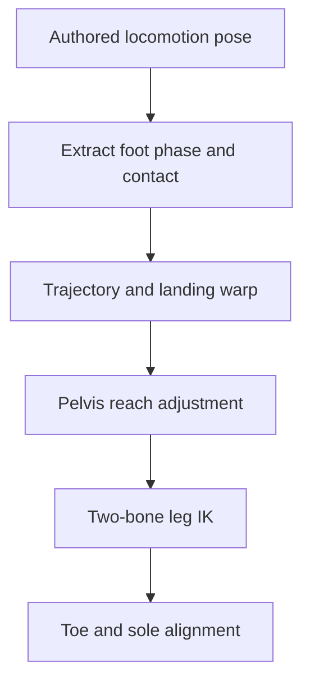

---
---

The biggest issue is architectural: this code is trying to manufacture the entire lower-body gait inside the IK layer. That can produce acceptable procedural walking, but “AAA+ foot IK” normally preserves a high-quality authored locomotion pose and corrects only the contact error.
Your implementation has several solid foundations—world-space planting, predicted landing positions, stance/swing state, distance LOD, and post-animation execution—but a few missing systems guarantee visible artifacts.
The major quality blockers

1. You never obtain the ground normal
   Your raycast returns only a position:
   .map(|hit| origin + Vec3::NEG_Y * hit.distance)
   Then level_feet holds each foot near its bind orientation. Consequently, feet remain horizontal on slopes, their uphill edge penetrates, and their downhill edge floats.
   For each ground query, retain at least:
   struct GroundHit {
   point: Vec3,
   normal: Vec3,
   entity: Entity,
   }
   Place the ankle along the surface normal—not world Y:
   let ankle_target = hit.point + hit.normal * goal.ankle_height;
   Construct the foot orientation by projecting character forward onto the contact plane:
   let up = hit.normal.normalize_or(Vec3::Y);

let forward = cadence.forward
.reject_from_normalized(up)
.normalize_or(Vec3::NEG_Z);

let right = up.cross(forward).normalize();
let forward = right.cross(up).normalize();

let ground_rotation =
Quat::from_mat3(&Mat3::from_cols(right, up, forward));
Blend that orientation using a separate rotation weight. Position and rotation should not necessarily have the same weight. 2. A single ankle ray is inadequate
A point ray answers “what is directly beneath the ankle?” It cannot determine whether the heel or toe is supported.
That causes poor results on:
Stair edges
Rocks
Sharp ridges
Uneven terrain
Steep slopes
Narrow ledges
Use at least three probes:
Ankle or sole-center
Toe
Heel
Then build the foot plane from those contacts. A capsule or sphere cast for the center probe is even more stable because it does not fall through tiny gaps.
A practical hierarchy is:
Downward sphere cast near the ankle.
Toe and heel rays around the candidate contact.
Reject or soften implausible normal differences.
Fit the final sole plane.
Clamp pitch and roll to anatomical limits.
For example:
const MAX_FOOT_PITCH: f32 = 40.0_f32.to_radians();
const MAX_FOOT_ROLL: f32 = 25.0_f32.to_radians();
Foot orientation should also have angular smoothing to prevent normal noise from vibrating the ankle. 3. There is no pelvis reach solver
pose_lower_body applies prerecorded/generated bob:
model.translation =
lower.model_rest.translation + Vec3::Y * (drop * cadence.weight);
But it does not ask whether both planted ankle targets are reachable. Therefore, when one foot lands lower or higher than the other:
One leg can hyperextend.
A knee may snap straight.
A foot may fail to reach.
The hips continue their normal bob even though the terrain demands something else.
Before solving either leg, calculate the reachable pelvis interval imposed by both foot targets.
For each leg:
maximum reach ≈ thigh length + calf length − small safety bend
Move the pelvis downward enough for the lowest reachable requirement, but clamp the displacement:
const MAX_PELVIS_DROP: f32 = 0.22;
const MAX_PELVIS_RISE: f32 = 0.10;
Then smooth asymmetrically:
Drop relatively quickly so feet reach the ground.
Rise more slowly so the body does not bounce upward after every step.
A good initial response is approximately:
drop half-life: 40–70 ms
rise half-life: 100–180 ms
You should also reserve a slight knee bend, perhaps 1–3 cm of reach, instead of allowing a perfectly straight leg. 4. The landing target moves throughout the swing
This is a major source of robotic or swimming steps:
let probe = body + cadence.velocity * time_to_land + place(...);

let Some(land) = ground(probe) ...
You recalculate land every frame. Thus, the swing foot continually chases a changing destination. Acceleration, turning, terrain query noise, and gait blending can all deform the trajectory mid-swing.
Instead:
Predict the landing early in swing.
Permit limited adjustment during the first portion.
Commit/freeze the landing target around 60–75% through the swing.
Revalidate only if the surface disappears or becomes unreachable.
Store something like:
pub landing: Option<FootContact>,
pub landing_committed: bool,
Before commitment, critically damp the landing target. After commitment, hold it still. 5. The swing interpolation has zero endpoint velocity
This:
let ease = t * t * (3.0 - 2.0 * t);
limb.goal = from.lerp(land, ease) + Vec3::Y * lift;
is spatially smooth, but not necessarily compatible with the foot velocity from the animation or prior stance. It commonly produces a mechanical “depart, arc, arrive” result.
For higher quality, use a Hermite or Bézier trajectory containing:
Lift-off position
Lift-off velocity
Landing position
Desired landing velocity
A clearance/control point
A cubic Hermite curve is enough:
fn hermite(p0: Vec3, v0: Vec3, p1: Vec3, v1: Vec3, t: f32) -> Vec3 {
let t2 = t * t;
let t3 = t2 * t;

    (2.0 * t3 - 3.0 * t2 + 1.0) * p0
        + (t3 - 2.0 * t2 + t) * v0
        + (-2.0 * t3 + 3.0 * t2) * p1
        + (t3 - t2) * v1

}
Apply clearance along world Y or a blended terrain-up direction. The toe should usually lift after the heel and contact after it, rather than the entire foot moving as a rigid plank. 6. Procedural mode discards the animation’s strongest information
This block blends the lower-body bones toward rest:
transform.translation =
transform.translation.lerp(rest.translation, cadence.weight);
transform.rotation =
transform.rotation.slerp(rest.rotation, cadence.weight);
That removes the authored hip, knee, ankle, weight-shift, and impact behavior—the exact details that make locomotion expensive to animate well.
The better architecture is:

Use the clip as the procedural input:
Measure each animated ankle’s local trajectory.
Detect or author contact intervals.
Preserve the animated knee and hip pose.
Warp the animated foot trajectory toward the terrain target.
Use IK only for the remaining positional error.
This produces much better motion than replacing the legs with rest bones plus analytic foot goals. 7. Contact detection is based mostly on height
In Follow/Lock, the plant weight is derived from:
let lift = ankle.y - target.y;
Height alone cannot distinguish:
A foot descending toward contact
A foot rising away from contact
A low dragging swing
A planted foot
A crouched shuffle
Use a contact score based on:
Animation contact curve or gait metadata
Foot vertical velocity
Foot horizontal velocity relative to the surface
Distance to the surface
Current contact state with hysteresis
For example:
enter planted:
contact_curve > 0.7
distance < 5 cm
downward/vertical speed < threshold

leave planted:
contact_curve < 0.3
or reach/drift limit exceeded
or support vanished
Different enter and exit thresholds prevent chattering. 8. Foot locking needs platform-relative storage
You store:
pub plant: Option<Vec3>
That works only for static world geometry. On a moving platform, elevator, ship, or physics object, the foot remains fixed in world space and slides off the surface.
A plant should be:
struct FootContact {
surface: Entity,
local_point: Vec3,
local_rotation: Quat,
world_normal: Vec3,
}
Reconstruct the world contact from the surface transform every frame. You can still use world-space contacts for explicitly static terrain.
Also, excluding only goal.character may not exclude colliders attached to descendant entities. Ensure the spatial filter excludes the whole character collision group or uses collision layers dedicated to walkable geometry. 9. Early stance release can still pop
This transition is binary:
goal.plant = None;
goal.from = pin;
goal.mark = phase;
The foot switches immediately from a fully constrained planted goal to a swing path. cadence.weight does not cover that local transition.
Add short state transitions:
enum FootState {
Planted,
Releasing,
Swing,
Landing,
}
Useful approximate durations:
Release/toe-off: 60–120 ms
Landing compression: 50–100 ms
Contact stabilization: 80–150 ms
During release, allow heel lift and toe pivot before the foot becomes completely free.
One probable sampling problem
Your predicted landing ray begins at:
let origin = Vec3::new(probe.x, ankle.y + PROBE_UP, probe.z);
Its height is based on the current ankle even when probe.xz is far ahead. On sharply rising ground, the cast can begin below the upcoming terrain; on steep drops, its range may be insufficient.
For locomotion prediction, derive the cast origin from a character reference height or a conservative capsule/hip height:
let origin_y = body.y + predicted_step_up_limit;
Then cast through the complete permitted step-up/step-down interval.
You should distinguish:
Current-foot contact probe
Landing-area prediction probe
Those probes need different origins, ranges, shapes, and failure handling.
Recommended implementation order
Preserve the animated leg pose instead of resetting it to rest.
Return point, normal, and surface entity from ground queries.
Add pelvis reach compensation.
Freeze landing targets late in swing.
Add toe/heel probes and slope-conforming foot rotation.
Replace height-only contact detection with explicit contact curves and velocity.
Add release, swing, landing, and planted substates.
Add knee pole-vector stabilization and joint-limit enforcement.
Store contacts relative to moving surfaces.
Add inertialization when IK weights or gait modes change.
The first four will produce the largest visible improvement. Toe articulation and multi-probe fitting are the final layer of polish; they cannot compensate for a moving landing target or missing pelvis solver.

---

## Feedback from GPT.
