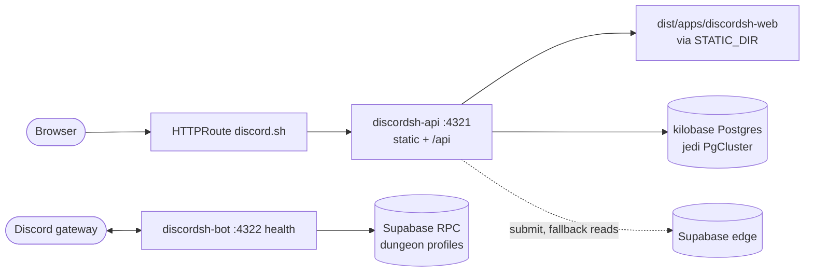

# discordsh

Discord server directory at [discord.sh](https://discord.sh). Two deployables
that share a repo and nothing else at runtime:

- **`discordsh-api`** — the web server. Axum on `:4321`, serving the Astro build
  from `STATIC_DIR` plus `/api/servers/*` and health routes.
- **`discordsh-bot`** — the Discord gateway. Poise slash commands, GitHub cards
  and the Embed Dungeon game, with a health endpoint on `:4322`.

The bot is not reachable from the site and the api speaks no Discord. Anything
about commands, the dungeon or gateway sharding belongs in [`bot/`](./bot/).

## Data flow



## Commands

```bash
# astro frontend
moon run discordsh-web:build
moon run discordsh-web:check

# api — builds the frontend first, then cargo run
moon run discordsh-api:dev
moon run discordsh-api:test
moon run discordsh-api:containerx     # kbve/discordsh:latest and :<Cargo version>

# bot
moon run discordsh-bot:test
moon run discordsh-bot:containerx     # kbve/discordsh-bot:latest

# full pipeline — unit tests, image build, both Playwright suites
moon run discordsh:e2e
```

## Base image

Both Dockerfiles build on `ghcr.io/kbve/chisel-ubuntu-axum` — the `-builder`
tag for the cargo-chef stages, the plain tag for the chiseled runtime. The
version is pinned in every `FROM` and rewritten by `tools/release/repin-base-image.mjs`
when the base publishes, so never hand-edit those tags. A build that dies in
`cargo chef cook` on an MSRV complaint means the pinned base is behind the
workspace toolchain.

## Docs

- [`api/README.md`](./api/README.md) — env vars, routes, e2e
- [`bot/README.md`](./bot/README.md) — commands, env vars, module layout
- [`bot/DISCORDSH_GAMEIDEA.md`](./bot/DISCORDSH_GAMEIDEA.md) — Embed Dungeon design, architecture and roadmap
- [`web/e2e/mock/README.md`](./web/e2e/mock/README.md) — the Mockoon stack
