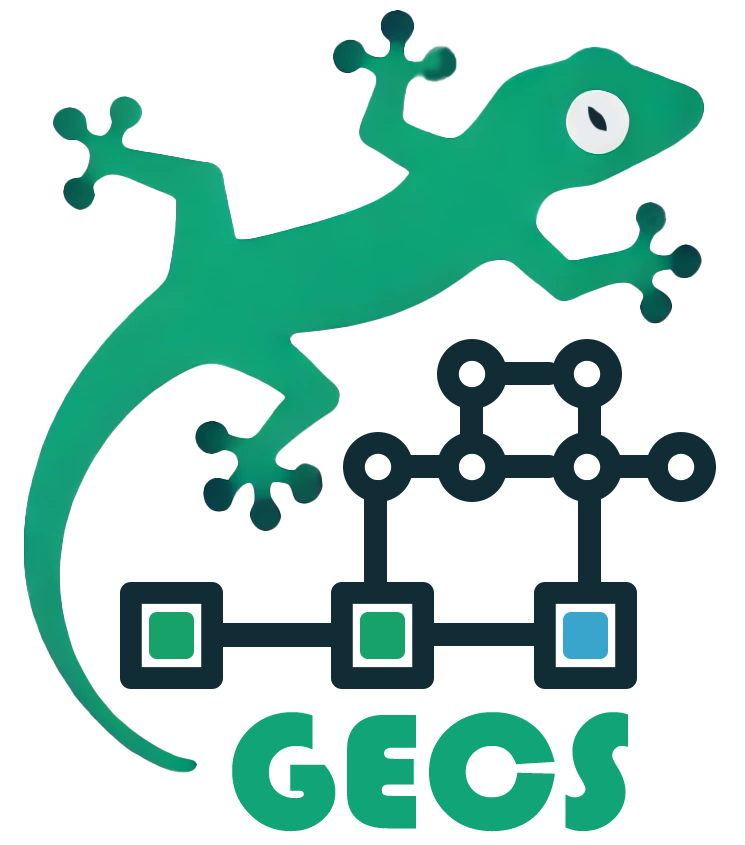

# GECS Documentation

> **Complete documentation for the Godot Entity Component System**



**Lightning-fast Entity Component System for Godot 4.x** - Build scalable, maintainable games with clean separation of data and logic.

**Discord**: [Join our community](https://discord.gg/eB43XU2tmn)

## 📚 Learning Path

### 🚀 Getting Started (5-10 minutes)

- **[Getting Started Guide](docs/GETTING_STARTED.md)** - Build your first ECS project in 5 minutes

### 🧠 Core Understanding (20-30 minutes)

- **[Core Concepts](docs/CORE_CONCEPTS.md)** - Deep dive into Entities, Components, Systems, and Relationships
- **[Component Queries](docs/COMPONENT_QUERIES.md)** - Advanced property-based entity filtering

### 🛠️ Practical Application (30-60 minutes)

- **[Best Practices](docs/BEST_PRACTICES.md)** - Write maintainable, performant ECS code
- **[Relationships](docs/RELATIONSHIPS.md)** - Link entities together for complex interactions
- **[Observers](docs/OBSERVERS.md)** - Reactive systems that respond to component changes
- **[Serialization](docs/SERIALIZATION.md)** - Save and load game state and entities

### ⚡ Optimization & Advanced (As needed)

- **[Debug Viewer](docs/DEBUG_VIEWER.md)** - Real-time debugging and performance monitoring
- **[Performance Optimization](docs/PERFORMANCE_OPTIMIZATION.md)** - Make your games run fast and smooth
- **[Troubleshooting](docs/TROUBLESHOOTING.md)** - Solve common issues quickly

### 🔬 Framework Development (For contributors)

- **[Performance Testing](docs/PERFORMANCE_TESTING.md)** - Framework-level performance testing guide

## 📖 Documentation by Topic

### Entity Component System Basics

| Topic             | Document                                   | Description                          |
| ----------------- | ------------------------------------------ | ------------------------------------ |
| **Introduction**  | [Getting Started](docs/GETTING_STARTED.md) | First ECS project tutorial           |
| **Architecture**  | [Core Concepts](docs/CORE_CONCEPTS.md)     | Complete ECS architecture overview   |
| **Data Patterns** | [Best Practices](docs/BEST_PRACTICES.md)   | Component and system design patterns |

### Advanced Features

| Topic                  | Document                                       | Description                         |
| ---------------------- | ---------------------------------------------- | ----------------------------------- |
| **Entity Linking**     | [Relationships](docs/RELATIONSHIPS.md)         | Connect entities with relationships |
| **Property Filtering** | [Component Queries](docs/COMPONENT_QUERIES.md) | Query entities by component data    |
| **Event Systems**      | [Observers](docs/OBSERVERS.md)                 | React to component changes          |
| **Data Persistence**   | [Serialization](docs/SERIALIZATION.md)         | Save/load entities and game state   |

### Optimization & Debugging

| Topic            | Document                                                     | Description                        |
| ---------------- | ------------------------------------------------------------ | ---------------------------------- |
| **Debug Viewer** | [Debug Viewer](docs/DEBUG_VIEWER.md)                         | Real-time debugging and inspection |
| **Performance**  | [Performance Optimization](docs/PERFORMANCE_OPTIMIZATION.md) | Game performance optimization      |
| **Debugging**    | [Troubleshooting](docs/TROUBLESHOOTING.md)                   | Common problems and solutions      |
| **Testing**      | [Performance Testing](docs/PERFORMANCE_TESTING.md)           | Framework performance testing      |

## 🎯 Quick References

### Naming Conventions

- **Entities**: `ClassCase` class, `e_entity_name.gd` file
- **Components**: `C_ComponentName` class, `c_component_name.gd` file
- **Systems**: `SystemNameSystem` class, `s_system_name.gd` file
- **Observers**: `ObserverNameObserver` class, `o_observer_name.gd` file

### Essential Patterns

```gdscript
# Entity creation
var player = Player.new()
player.add_component(C_Health.new(100))
player.add_component(C_Position.new(Vector2.ZERO))
ECS.world.add_entity(player)

# System queries
func query(): return q.with_all([C_Health, C_Position])
func process(entities: Array[Entity], components: Array, delta: float): # Unified signature
# Use .iterate([Components]) for batch component array access

# Relationships
entity.add_relationship(Relationship.new(C_Likes.new(), target_entity))
var likers = ECS.world.query.with_relationship([Relationship.new(C_Likes.new(), entity)]).execute()

# Component queries
var low_health = ECS.world.query.with_all([{C_Health: {"current": {"_lt": 20}}}]).execute()

# Order Independence: with_all/with_any/with_node component order does not affect matching or caching.
# The framework normalizes component sets internally so these yield identical results:
# ECS.world.query.with_all([C_Health, C_Position])
# ECS.world.query.with_all([C_Position, C_Health])
# Cache keys and archetype matching are order-insensitive.

# Serialization
var data = ECS.serialize(ECS.world.query.with_all([C_Persistent]))
ECS.save(data, "user://savegame.tres", true)  # Binary format
var entities = ECS.deserialize("user://savegame.tres")
```

## 🎮 Example Projects

Basic examples are included in each guide. For complete game examples, see:

- **Simple Ball Movement** - [Getting Started Guide](docs/GETTING_STARTED.md)
- **Combat Systems** - [Relationships Guide](docs/RELATIONSHIPS.md)
- **UI Synchronization** - [Observers Guide](docs/OBSERVERS.md)

## 🆘 Getting Help

1. **Check documentation** - Most questions are answered in the guides above
2. **Review examples** - Each guide includes working code examples
3. **Try troubleshooting** - [Troubleshooting Guide](docs/TROUBLESHOOTING.md) covers common issues
4. **Community support** - [Join our Discord](https://discord.gg/eB43XU2tmn) for discussions and questions

## 🔄 Documentation Updates

This documentation is actively maintained. If you find errors or have suggestions:

- **Report issues** for bugs or unclear documentation
- **Suggest improvements** for better examples or explanations
- **Contribute examples** showing real-world usage patterns

---

**Ready to start?** Begin with the [Getting Started Guide](docs/GETTING_STARTED.md) and build your first ECS project in just 5 minutes!

_GECS makes building scalable, maintainable games easier by separating data from logic and providing powerful query systems for entity management._
