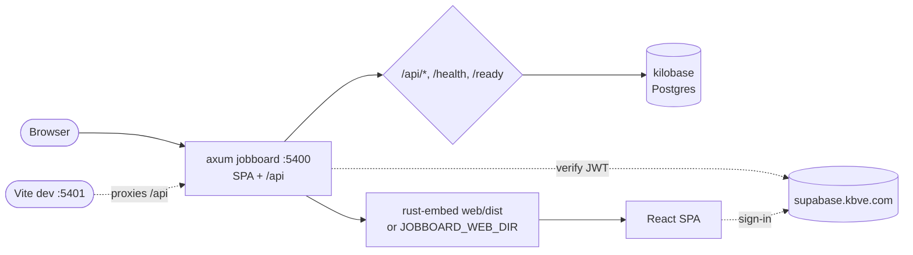

# jobboard

Decoupled freelance job board. Rust/Axum REST API on `:5400` that also serves
an embedded React + Vite SPA (the same `@kbve/rn` components the mobile app
uses, via react-native-web). One binary serves UI + `/api`. Layout, ports, and
domains live in the frontmatter above.

## Data Flow



## Commands

Run targets either through the repo wrapper (sources `.env.local`, avoids OOM)
or pnpm nx directly:

```bash
# full local stack (Postgres + migrations + seed + the Axum binary)
./kbve.sh -nx jobboard:dev
pnpm nx run jobboard:dev

# tear the stack down (wipes the db volume)
./kbve.sh -nx jobboard:down
pnpm nx run jobboard:down

# SPA dev server with hot reload (vite :5401, proxies /api -> :5400)
./kbve.sh -nx jobboard:web-dev
pnpm nx run jobboard:web-dev

# build the SPA to web/dist
./kbve.sh -nx jobboard:web-build
pnpm nx run jobboard:web-build

# run the Axum binary on the host, serving web/dist from disk (no re-embed)
./kbve.sh -nx jobboard:serve-static
pnpm nx run jobboard:serve-static

# cargo run / build / test / lint the Rust service
./kbve.sh -nx jobboard:run
./kbve.sh -nx jobboard:build
./kbve.sh -nx jobboard:test
./kbve.sh -nx jobboard:lint
pnpm nx run jobboard:run

# build the production container image
./kbve.sh -nx jobboard:container
pnpm nx run jobboard:container
```

## Quick start

```bash
./kbve.sh -nx jobboard:dev      # first run builds the image (slow, emulated)
open http://localhost:5400
```

`dev` streams full compose output and captures only FAILURE lines into
`jobboards.txt` (gitignored), wiped each run — `cat apps/jobboard/jobboards.txt`
to see just what broke.

### Fast SPA loop (no Rust rebuilds)

```bash
./kbve.sh -nx jobboard:dev        # leave the DB + API up, or:
./kbve.sh -nx jobboard:serve-static   # API + disk-served SPA on :5400
./kbve.sh -nx jobboard:web-dev        # vite :5401 with HMR
```

## Auth

Identity comes from a Supabase JWT (`sub` = `auth.users.id`, `kbve_username`
claim). The SPA signs in against `supabase.kbve.com` via the shared
`@kbve/rn` `LoginScreen`. The Axum service verifies the bearer token with
`SUPABASE_JWT_SECRET`.

> Local note: sign-in yields a real Supabase token, but the compose default
> `SUPABASE_JWT_SECRET` is a placeholder, so `/api/auth/me` rejects it locally
> unless you supply the real kbve secret. `/api/verticals` + the SPA need no
> auth.

## How the SPA is served

- **Release / container** → `web/dist` is baked into the binary with
  `rust-embed`; one static binary serves everything.
- **`JOBBOARD_WEB_DIR=<path>`** → Axum serves that directory from disk at
  runtime instead (rebuild the SPA without recompiling Rust). `serve-static`
  sets it to `web/dist`.
- SPA deep links fall back to `index.html`; `/api/*`, `/health`, `/ready`
  are real routes.
