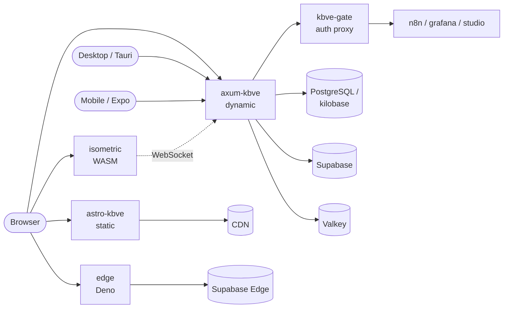

# apps/kbve

KBVE platform services powering [kbve.com](https://kbve.com). Service inventory lives in the frontmatter above.

## Data Flow

## Sources of Truth

- Proto: `packages/data/proto/`
- Shared Rust crates: `packages/rust/`
- Shared NPM packages: `packages/npm/`
