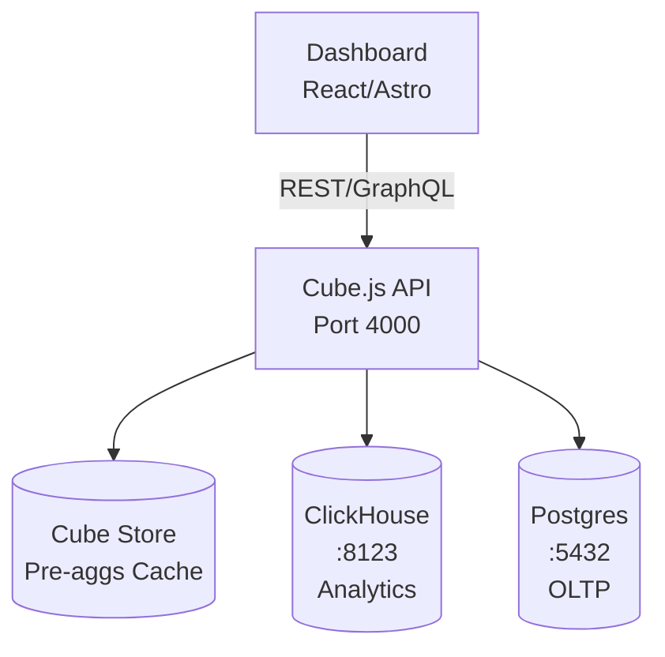
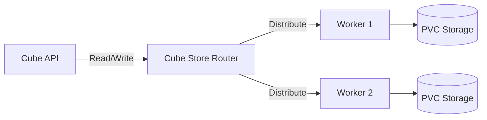

import {
	Aside,
	Steps,
	Card,
	CardGrid,
	Code,
	FileTree,
} from '@astrojs/starlight/components';

import { Giscus, Adsense } from '@/components/astropad';


## Information

If you are looking for a powerful and flexible framework to build amazing data applications, you should check out CubeJS.
CubeJS is an open source project that lets you connect to any SQL-based data source, define your data models in a simple and consistent way, and expose them to your applications via blazing-fast APIs.
Whether you want to create an internal dashboard for your business insights, or a customer-facing analytics feature for your product, CubeJS has you covered.
CubeJS supports REST, [SQL](/application/sql/), and GraphQL APIs, so you can choose the best option for your needs.
CubeJS also integrates seamlessly with popular data visualization tools, such as D3.js, Google Charts, Highcharts, and more.
This documentation will have plenty of tutorials, examples, and demos that will help you get started and inspired.

<Adsense />

## Install

There are several ways to install CubeJS, including using it as a SaaS via CubeJS Cloud.
We will go over a couple ways in this reference document.

### Docker

There are a couple ways that we can deploy CubeJS via Docker, including dev mode and swarm.

These following commands will run CubeJS in a docker container and expose it on port 4000 / 3000.
Furthermore, it will also mount the current directory as a volume for CubeJS configuration and schema files.

```shell
docker run -d -p 3000:3000 -p 4000:4000 \
  -e CUBEJS_DB_HOST=postgres://hostname \
  -e CUBEJS_DB_NAME=<DB_NAME> \
  -e CUBEJS_DB_USER=<USER> \
  -e CUBEJS_DB_PASS=<PASS> \
  -e CUBEJS_DB_TYPE=<DB_TYPE> \
  -e CUBEJS_API_SECRET=<API_SECRET> \
  -v $(pwd):/cube/conf \
  cubejs/cube:latest
```

To enable dev mode, pass along the environmental variable `-e CUBEJS_DEV_MODE=true \` inside of the command.

For the Docker Swarm, we recommend that you deploy a CubeJS Docker Compose via Portainer or your swarm platform of choice.

### NodeJS

> Reference to additional [NodeJS docs](/application/javascript/#nodejs)

For installing via NodeJS, we recommend you install cubejs-cli using npm or yarn, which are tools that help you manage JavaScript packages. You can run this command in your terminal:

-   NPM

```shell
npm install -g cubejs-cli
```

-   YARN

```shell
yarn add cubejs-cli
```

After the installation, we recommend that you launch a test case.

Create a new CubeJS project using cubejs create command.
You need to specify the name of your project and the type of your data source.
For example, if you want to use Postgres, which is a database system, you can run this command:

```shell
cubejs create dashboard-backend -d postgres
```

This will create a new folder with your project files and install the necessary dependencies.
You can then start your CubeJS server by running this command inside your project folder:

-   NPM

```shell
npm run dev
```

-   YARN

```shell
yarn dev
```

This will start your CubeJS test case server on `http://localhost:4000`.
You can then open this URL in your browser and follow the instructions to connect to your data source and start building your data model and queries.

---

## Update

To upgrade CubeJS, you need to update the version of the CubeJS package that you are using.
There are different ways to do that, depending on how you installed CubeJS.

### Update Docker

If you are using Docker, you can upgrade CubeJS by pulling the latest image from the Docker Hub.
You can run this command in your terminal:

```shell
docker pull cubejs/cube:latest
```

### Update NodeJS

If you are using Node.js, you can upgrade CubeJS by updating the version of the `@cubejs-backend/server` or `@cubejs-backend/server-core` package in your `package.json` file.
You can also use npm or yarn to update the package. For example, you can run this command in your terminal:

-   NPM

```shell
npm update @cubejs-backend/server
```

-   YARN

```shell
yarn upgrade @cubejs-backend/server
```

---

## Data Schema

Cube.js uses a semantic layer called **Data Schema** to define metrics, dimensions, and relationships.
Schemas are written in JavaScript/TypeScript files inside the `schema/` directory.

### Cube Definition

A cube represents a table or view. Define measures (aggregations), dimensions (attributes), and joins (relationships).

```javascript
// schema/Orders.js
cube(`Orders`, {
  sql: `SELECT * FROM public.orders`,

  measures: {
    count: {
      type: `count`,
    },

    totalAmount: {
      sql: `amount`,
      type: `sum`,
    },

    averageAmount: {
      sql: `amount`,
      type: `avg`,
    },
  },

  dimensions: {
    id: {
      sql: `id`,
      type: `number`,
      primaryKey: true,
    },

    status: {
      sql: `status`,
      type: `string`,
    },

    createdAt: {
      sql: `created_at`,
      type: `time`,
    },

    userId: {
      sql: `user_id`,
      type: `number`,
    },
  },
});
```

### Joins

Link cubes via foreign keys for relational queries:

```javascript
// schema/Orders.js (continued)
cube(`Orders`, {
  // ... measures, dimensions

  joins: {
    Users: {
      sql: `${CUBE}.user_id = ${Users}.id`,
      relationship: `belongsTo`,
    },
  },
});
```

```javascript
// schema/Users.js
cube(`Users`, {
  sql: `SELECT * FROM public.users`,

  dimensions: {
    id: {
      sql: `id`,
      type: `number`,
      primaryKey: true,
    },

    email: {
      sql: `email`,
      type: `string`,
    },

    name: {
      sql: `name`,
      type: `string`,
    },
  },
});
```

### Pre-Aggregations

Pre-aggregations cache query results for faster response times:

```javascript
cube(`Orders`, {
  // ... measures, dimensions, joins

  preAggregations: {
    main: {
      measures: [CUBE.count, CUBE.totalAmount],
      dimensions: [CUBE.status, CUBE.createdAt],
      timeDimension: CUBE.createdAt,
      granularity: `day`,
      refreshKey: {
        every: `1 hour`,
      },
    },
  },
});
```

**Refresh strategies:**

- `every: '1 hour'` — refresh every hour
- `sql: 'SELECT MAX(updated_at) FROM orders'` — refresh when data changes
- `immutable: true` — never refresh (historical data)

---

## API Queries

Cube.js exposes REST, GraphQL, and SQL APIs. All APIs share the same query format.

### REST API

**Endpoint:** `POST /cubejs-api/v1/load`

**Request:**

```json
{
  "measures": ["Orders.count", "Orders.totalAmount"],
  "dimensions": ["Orders.status"],
  "timeDimensions": [
    {
      "dimension": "Orders.createdAt",
      "granularity": "day",
      "dateRange": ["2024-01-01", "2024-12-31"]
    }
  ],
  "filters": [
    {
      "member": "Orders.status",
      "operator": "equals",
      "values": ["shipped"]
    }
  ]
}
```

**Response:**

```json
{
  "data": [
    {
      "Orders.status": "shipped",
      "Orders.createdAt.day": "2024-01-15T00:00:00.000",
      "Orders.count": 42,
      "Orders.totalAmount": "12450.00"
    }
  ]
}
```

### Query Format

| Field | Type | Description |
|-------|------|-------------|
| `measures` | `string[]` | Aggregations (count, sum, avg, etc.) |
| `dimensions` | `string[]` | Attributes for grouping |
| `timeDimensions` | `object[]` | Time-based filters + granularity |
| `filters` | `object[]` | WHERE conditions |
| `segments` | `string[]` | Pre-defined filter sets |
| `order` | `object` | Sort order (`{ "Orders.createdAt": "desc" }`) |
| `limit` | `number` | Max rows returned |

### Filter Operators

| Operator | SQL Equivalent | Example Values |
|----------|----------------|----------------|
| `equals` | `=` | `["shipped"]` |
| `notEquals` | `!=` | `["cancelled"]` |
| `contains` | `LIKE '%val%'` | `["express"]` |
| `notContains` | `NOT LIKE '%val%'` | `["standard"]` |
| `gt` | `>` | `[100]` |
| `gte` | `>=` | `[100]` |
| `lt` | `<` | `[1000]` |
| `lte` | `<=` | `[1000]` |
| `inDateRange` | `BETWEEN` | `["2024-01-01", "2024-12-31"]` |
| `notInDateRange` | `NOT BETWEEN` | `["2024-01-01", "2024-12-31"]` |

### GraphQL API

Enable GraphQL in `cube.js`:

```javascript
module.exports = {
  graphql: {
    enabled: true,
  },
};
```

**Endpoint:** `POST /cubejs-api/graphql`

**Query:**

```graphql
query {
  cube(
    measures: ["Orders.count", "Orders.totalAmount"]
    dimensions: ["Orders.status"]
    timeDimensions: [
      {
        dimension: "Orders.createdAt"
        granularity: "day"
        dateRange: ["2024-01-01", "2024-12-31"]
      }
    ]
  ) {
    Orders {
      status
      createdAt {
        day
      }
      count
      totalAmount
    }
  }
}
```

---

## Security

### Multi-Tenancy

Use `SECURITY_CONTEXT` to filter data per user/tenant:

```javascript
// cube.js
module.exports = {
  contextToAppId: ({ securityContext }) => `APP_${securityContext.tenantId}`,

  scheduledRefreshContexts: async () => [
    { securityContext: { tenantId: 1 } },
    { securityContext: { tenantId: 2 } },
  ],
};
```

```javascript
// schema/Orders.js
cube(`Orders`, {
  sql: `SELECT * FROM public.orders WHERE tenant_id = ${SECURITY_CONTEXT.tenantId.unsafeValue()}`,
  // ...
});
```

### JWT Authentication

Protect API with JWT tokens:

```javascript
// cube.js
const jwt = require('jsonwebtoken');

module.exports = {
  checkAuth: async (req, auth) => {
    if (!auth) throw new Error('Missing authorization');

    try {
      const token = auth.replace('Bearer ', '');
      const payload = jwt.verify(token, process.env.CUBEJS_API_SECRET);
      req.securityContext = payload;
    } catch (e) {
      throw new Error('Invalid token');
    }
  },
};
```

**Client request:**

```bash
curl -H "Authorization: Bearer <JWT_TOKEN>" \
  -X POST https://your-cube-api.com/cubejs-api/v1/load \
  -d '{"measures": ["Orders.count"]}'
```

---

## Data Modeling Best Practices

### Star Schema

Organize cubes into fact tables (Orders, Events) and dimension tables (Users, Products).

**Fact table** (Orders) — transactional data with foreign keys:
- Measures: `count`, `totalAmount`, `averageAmount`
- Dimensions: `status`, `createdAt`, `userId`, `productId`

**Dimension tables** (Users, Products) — descriptive attributes:
- Users: `name`, `email`, `country`
- Products: `name`, `category`, `price`

**Joins** — connect fact to dimensions via foreign keys.

### Naming Conventions

- **Cubes:** PascalCase (e.g., `Orders`, `Users`)
- **Measures:** camelCase (e.g., `count`, `totalRevenue`)
- **Dimensions:** camelCase (e.g., `status`, `createdAt`)
- **Time dimensions:** always include `.type: 'time'`

### Performance Tips

- **Pre-aggregations** — cache frequently queried combinations
- **Partitioning** — partition pre-aggregations by time (`partitionGranularity: 'month'`)
- **Indexes** — index foreign keys and filter columns in your database
- **Refresh keys** — use `sql` refresh keys for incremental updates

---

## Configuration

### Environment Variables

Common env vars for `cube.js` or Docker:

| Variable | Description | Example |
|----------|-------------|---------|
| `CUBEJS_DB_TYPE` | Database type | `postgres`, `mysql`, `bigquery` |
| `CUBEJS_DB_HOST` | Database host | `localhost` |
| `CUBEJS_DB_NAME` | Database name | `analytics` |
| `CUBEJS_DB_USER` | Database user | `cube` |
| `CUBEJS_DB_PASS` | Database password | `secret` |
| `CUBEJS_API_SECRET` | JWT secret for auth | `random-string` |
| `CUBEJS_DEV_MODE` | Enable dev playground | `true` |
| `CUBEJS_CACHE_AND_QUEUE_DRIVER` | Cache backend | `redis`, `memory` |
| `REDIS_URL` | Redis connection string | `redis://localhost:6379` |

### External Database Drivers

Install drivers for non-standard sources:

```bash
# Google BigQuery
npm install @cubejs-backend/bigquery-driver

# AWS Athena
npm install @cubejs-backend/athena-driver

# Snowflake
npm install @cubejs-backend/snowflake-driver

# MongoDB
npm install @cubejs-backend/mongobi-driver
```

Update `cube.js`:

```javascript
module.exports = {
  dbType: 'bigquery',
  externalDriverFactory: () => require('@cubejs-backend/bigquery-driver')({
    projectId: process.env.CUBEJS_DB_BQ_PROJECT_ID,
    keyFilename: process.env.CUBEJS_DB_BQ_KEY_FILE,
  }),
};
```

---

## KBVE Integration

KBVE uses Cube.js as a unified semantic layer over multiple data sources:

- **ClickHouse** — analytics events, time-series metrics, logs
- **PostgreSQL** — transactional data (users, orders, sessions)
- **Cube Store** — cache layer for pre-aggregations and query results (default since v0.32+)

<Aside type="tip">
**About Cube Store:** Cube.js ships with **Cube Store**, an internal columnar database written in Rust that handles pre-aggregation storage, query caching, and job queuing. Cube Store replaced Redis entirely in v0.32 (2022) and is now the default - no external cache needed. Valkey/Redis cannot be used as Cube's cache layer.
</Aside>

<Aside type="note">
**Valkey for Other Services:** If you're using Valkey elsewhere in KBVE (session storage, app-level caching, rate limiting), that's separate. Cube.js **cannot** read from or write to external Redis/Valkey instances for its cache - it exclusively uses its own internal Cube Store.
</Aside>

### Architecture



### What is Cube Store?

**Cube Store** is a purpose-built columnar database engine that ships with Cube.js:

- **Written in Rust** — high performance, low memory footprint
- **Columnar storage** — optimized for analytical queries (aggregations, filters, grouping)
- **MySQL wire protocol** — communicates via port 3306 (same as MySQL)
- **Distributed architecture** — router + worker nodes for horizontal scaling
- **Built-in** — no separate installation needed, runs as part of the Cube.js deployment

**What Cube Store handles:**

1. **Pre-aggregation storage** — stores rolled-up data (daily counts, monthly sums, etc.)
2. **Query cache** — caches API responses for identical queries
3. **Job queue** — manages background refresh jobs for pre-aggregations

**How it works:**



- **Router** — coordinates queries, manages metadata (1 replica)
- **Workers** — store and query pre-aggregation data (2+ replicas)
- **Communication** — Router on port 3306 (MySQL protocol), workers on port 9001

**Dev vs Production:**

| Mode | Storage | Config |
|------|---------|--------|
| **Development** | In-memory | Auto-configured (no setup needed) |
| **Production** | Persistent (PVC) | Deploy router + workers separately |

### Multi-Source Configuration

Create a `cube.js` config that connects to data sources (Cube Store is auto-configured):

```javascript
// cube.js
module.exports = {
  // Default database (Postgres for transactional data)
  dbType: 'postgres',
  driverFactory: ({ dataSource }) => {
    if (dataSource === 'clickhouse') {
      const ClickHouseDriver = require('@cubejs-backend/clickhouse-driver');
      return new ClickHouseDriver({
        host: process.env.CUBEJS_DB_CLICKHOUSE_HOST,
        port: process.env.CUBEJS_DB_CLICKHOUSE_PORT || 8123,
        user: process.env.CUBEJS_DB_CLICKHOUSE_USER,
        password: process.env.CUBEJS_DB_CLICKHOUSE_PASS,
        database: process.env.CUBEJS_DB_CLICKHOUSE_NAME,
      });
    }

    // Default: Postgres
    const PostgresDriver = require('@cubejs-backend/postgres-driver');
    return new PostgresDriver({
      host: process.env.CUBEJS_DB_HOST,
      port: process.env.CUBEJS_DB_PORT || 5432,
      user: process.env.CUBEJS_DB_USER,
      password: process.env.CUBEJS_DB_PASS,
      database: process.env.CUBEJS_DB_NAME,
    });
  },

  // Cube Store for cache and pre-aggregations (default since v0.32+)
  // No additional config needed - Cube Store is auto-configured
  // For production, deploy Cube Store cluster separately (see deployment section)

  // JWT auth
  checkAuth: async (req, auth) => {
    if (!auth) throw new Error('Missing authorization');
    const jwt = require('jsonwebtoken');
    const token = auth.replace('Bearer ', '');
    const payload = jwt.verify(token, process.env.CUBEJS_API_SECRET);
    req.securityContext = payload;
  },
};
```

### ClickHouse Schema (Analytics Events)

```javascript
// schema/Events.js
cube(`Events`, {
  dataSource: 'clickhouse',
  sql: `SELECT * FROM analytics.events`,

  measures: {
    count: {
      type: `count`,
    },

    uniqueUsers: {
      sql: `user_id`,
      type: `countDistinct`,
    },
  },

  dimensions: {
    eventName: {
      sql: `event_name`,
      type: `string`,
    },

    userId: {
      sql: `user_id`,
      type: `number`,
    },

    timestamp: {
      sql: `timestamp`,
      type: `time`,
    },

    properties: {
      sql: `properties`,
      type: `string`,
    },
  },

  preAggregations: {
    eventsByDay: {
      measures: [CUBE.count, CUBE.uniqueUsers],
      dimensions: [CUBE.eventName],
      timeDimension: CUBE.timestamp,
      granularity: `day`,
      partitionGranularity: `month`,
      refreshKey: {
        every: `10 minutes`,
      },
    },
  },
});
```

### Postgres Schema (Transactional Data)

```javascript
// schema/Users.js
cube(`Users`, {
  dataSource: 'default', // Postgres
  sql: `SELECT * FROM public.users`,

  dimensions: {
    id: {
      sql: `id`,
      type: `number`,
      primaryKey: true,
    },

    email: {
      sql: `email`,
      type: `string`,
    },

    createdAt: {
      sql: `created_at`,
      type: `time`,
    },
  },
});
```

### Cross-Source Join (ClickHouse ← Postgres)

Join analytics events (ClickHouse) with user data (Postgres):

```javascript
// schema/Events.js (continued)
cube(`Events`, {
  // ... measures, dimensions

  joins: {
    Users: {
      sql: `${CUBE}.user_id = ${Users}.id`,
      relationship: `belongsTo`,
    },
  },
});
```

**Query example** (events with user email):

```json
{
  "measures": ["Events.count"],
  "dimensions": ["Events.eventName", "Users.email"],
  "timeDimensions": [
    {
      "dimension": "Events.timestamp",
      "granularity": "day",
      "dateRange": "last 7 days"
    }
  ]
}
```

### Environment Variables

```bash
# Postgres (default)
CUBEJS_DB_TYPE=postgres
CUBEJS_DB_HOST=postgres.default.svc.cluster.local
CUBEJS_DB_PORT=5432
CUBEJS_DB_NAME=kbve
CUBEJS_DB_USER=cube
CUBEJS_DB_PASS=<secret>

# ClickHouse (analytics)
CUBEJS_DB_CLICKHOUSE_HOST=clickhouse.default.svc.cluster.local
CUBEJS_DB_CLICKHOUSE_PORT=8123
CUBEJS_DB_CLICKHOUSE_NAME=analytics
CUBEJS_DB_CLICKHOUSE_USER=cube
CUBEJS_DB_CLICKHOUSE_PASS=<secret>

# Cube Store (auto-configured, or specify custom endpoint)
# CUBEJS_CUBESTORE_HOST=cubestore-router.default.svc.cluster.local
# CUBEJS_CUBESTORE_PORT=3306

# Auth
CUBEJS_API_SECRET=<jwt-secret>
CUBEJS_DEV_MODE=false
```

### Deployment (Kubernetes)

Deploy Cube.js as a service in the cluster alongside ClickHouse and Postgres. Cube Store runs as a separate cluster (router + workers) for pre-aggregation storage.

**Cube API Deployment:**

```yaml
# cube-api-deployment.yaml
apiVersion: apps/v1
kind: Deployment
metadata:
  name: cube-api
  namespace: default
spec:
  replicas: 2
  selector:
    matchLabels:
      app: cube-api
  template:
    metadata:
      labels:
        app: cube-api
    spec:
      containers:
      - name: cube-api
        image: cubejs/cube:latest
        ports:
        - containerPort: 4000
        env:
        - name: CUBEJS_REFRESH_WORKER
          value: "false"  # API instances should NOT run refresh workers
        - name: CUBEJS_CUBESTORE_HOST
          value: "cubestore-router.default.svc.cluster.local"
        - name: CUBEJS_CUBESTORE_PORT
          value: "3306"
        envFrom:
        - secretRef:
            name: cubejs-secrets
        volumeMounts:
        - name: schema
          mountPath: /cube/conf/schema
      volumes:
      - name: schema
        configMap:
          name: cubejs-schema
---
apiVersion: v1
kind: Service
metadata:
  name: cube-api
  namespace: default
spec:
  selector:
    app: cube-api
  ports:
  - port: 4000
    targetPort: 4000
```

**Cube Refresh Worker Deployment:**

```yaml
# cube-refresh-worker-deployment.yaml
apiVersion: apps/v1
kind: Deployment
metadata:
  name: cube-refresh-worker
  namespace: default
spec:
  replicas: 1
  selector:
    matchLabels:
      app: cube-refresh-worker
  template:
    metadata:
      labels:
        app: cube-refresh-worker
    spec:
      containers:
      - name: cube-refresh-worker
        image: cubejs/cube:latest
        env:
        - name: CUBEJS_SCHEDULED_REFRESH_TIMER
          value: "true"  # Enable scheduled refresh
        - name: CUBEJS_CUBESTORE_HOST
          value: "cubestore-router.default.svc.cluster.local"
        - name: CUBEJS_CUBESTORE_PORT
          value: "3306"
        envFrom:
        - secretRef:
            name: cubejs-secrets
        volumeMounts:
        - name: schema
          mountPath: /cube/conf/schema
      volumes:
      - name: schema
        configMap:
          name: cubejs-schema
```

**Cube Store Cluster (Router + Workers):**

```yaml
# cubestore-router-deployment.yaml
apiVersion: apps/v1
kind: Deployment
metadata:
  name: cubestore-router
  namespace: default
spec:
  replicas: 1
  selector:
    matchLabels:
      app: cubestore-router
  template:
    metadata:
      labels:
        app: cubestore-router
    spec:
      containers:
      - name: cubestore-router
        image: cubejs/cubestore:latest
        ports:
        - containerPort: 3306  # MySQL protocol
        - containerPort: 3030  # HTTP
        env:
        - name: CUBESTORE_SERVER_NAME
          value: "cubestore-router:9999"
        - name: CUBESTORE_META_PORT
          value: "9999"
        - name: CUBESTORE_WORKERS
          value: "cubestore-worker-0:9001,cubestore-worker-1:9001"
        volumeMounts:
        - name: cubestore-data
          mountPath: /cube/data
      volumes:
      - name: cubestore-data
        persistentVolumeClaim:
          claimName: cubestore-router-pvc
---
apiVersion: v1
kind: Service
metadata:
  name: cubestore-router
  namespace: default
spec:
  selector:
    app: cubestore-router
  ports:
  - name: mysql
    port: 3306
    targetPort: 3306
  - name: http
    port: 3030
    targetPort: 3030
---
# cubestore-worker-statefulset.yaml
apiVersion: apps/v1
kind: StatefulSet
metadata:
  name: cubestore-worker
  namespace: default
spec:
  serviceName: cubestore-worker
  replicas: 2
  selector:
    matchLabels:
      app: cubestore-worker
  template:
    metadata:
      labels:
        app: cubestore-worker
    spec:
      containers:
      - name: cubestore-worker
        image: cubejs/cubestore:latest
        ports:
        - containerPort: 9001
        env:
        - name: CUBESTORE_SERVER_NAME
          valueFrom:
            fieldRef:
              fieldPath: metadata.name
        - name: CUBESTORE_WORKER_PORT
          value: "9001"
        - name: CUBESTORE_META_ADDR
          value: "cubestore-router:9999"
        volumeMounts:
        - name: cubestore-data
          mountPath: /cube/data
  volumeClaimTemplates:
  - metadata:
      name: cubestore-data
    spec:
      accessModes: ["ReadWriteOnce"]
      resources:
        requests:
          storage: 100Gi
```

Store schemas in a ConfigMap:

```yaml
apiVersion: v1
kind: ConfigMap
metadata:
  name: cubejs-schema
  namespace: default
data:
  Events.js: |
    cube(`Events`, {
      dataSource: 'clickhouse',
      sql: `SELECT * FROM analytics.events`,
      // ... (schema definition)
    });
  Users.js: |
    cube(`Users`, {
      sql: `SELECT * FROM public.users`,
      // ... (schema definition)
    });
```

### Dashboard Integration

Connect your React/Astro dashboard to the Cube.js API:

```typescript
// lib/cube.ts
import cubejs from '@cubejs-client/core';

const cubeApi = cubejs(
  () => localStorage.getItem('jwt_token') || '',
  {
    apiUrl: 'https://cube.kbve.com/cubejs-api/v1',
  }
);

export default cubeApi;
```

**Query from dashboard:**

```tsx
import { useCubeQuery } from '@cubejs-client/react';
import cubeApi from '@/lib/cube';

function EventsChart() {
  const { resultSet, isLoading } = useCubeQuery(
    {
      measures: ['Events.count'],
      timeDimensions: [
        {
          dimension: 'Events.timestamp',
          granularity: 'day',
          dateRange: 'last 30 days',
        },
      ],
      dimensions: ['Events.eventName'],
    },
    { cubejsApi: cubeApi }
  );

  if (isLoading) return <div>Loading...</div>;

  return (
    <div>
      {resultSet.tablePivot().map((row) => (
        <div key={row['Events.eventName']}>
          {row['Events.eventName']}: {row['Events.count']}
        </div>
      ))}
    </div>
  );
}
```

### Best Practices

#### Pre-Aggregations with ClickHouse

<Aside type="caution">
When using ClickHouse as a data source, you **must** define indexes in pre-aggregations. Measures of type `count_distinct_approx` cannot be used in pre-aggregations with ClickHouse.
</Aside>

**Index definition example:**

```javascript
preAggregations: {
  eventsByDay: {
    measures: [CUBE.count],
    dimensions: [CUBE.eventName],
    timeDimension: CUBE.timestamp,
    granularity: `day`,
    indexes: {
      categoryIndex: {
        columns: [CUBE.eventName],
      },
    },
  },
}
```

#### Cross-Source Joins (ClickHouse + Postgres)

Two strategies for joining data across ClickHouse and Postgres:

1. **Cube Store `rollup_join`** — Join pre-aggregations from both sources inside Cube Store (recommended)
2. **ClickHouse integration engines** — Use ClickHouse's `PostgreSQL` table engine to query Postgres directly

**Known Issue:** Query dimension order affects join performance. Place ClickHouse dimensions before Postgres dimensions in the query for optimal performance.

```json
// Recommended order
{
  "measures": ["Events.count"],
  "dimensions": [
    "Events.eventName",  // ClickHouse dimension first
    "Users.email"        // Postgres dimension second
  ]
}
```

#### Refresh Strategy

- **API instances** — Set `CUBEJS_REFRESH_WORKER=false` to handle queries only
- **Refresh workers** — Dedicate 1+ instances with `CUBEJS_SCHEDULED_REFRESH_TIMER=true`
- **Pre-aggregation partitions** — Use `partitionGranularity: 'month'` for time-series data

#### Cube Store Sizing

For production deployments:

- **Router:** 1 replica (single point of coordination, stateless)
- **Workers:** 2+ replicas (scale horizontally for more pre-aggregation storage)
- **Storage:** 100Gi+ per worker (depends on pre-aggregation volume)
- **Memory:** 4Gi+ per worker (columnar in-memory operations)

**Scaling strategy:**

- **Horizontal (add workers)** — more pre-aggregation capacity, parallel query execution
- **Vertical (increase worker storage)** — larger pre-aggregation datasets per worker
- **Router resources** — lightweight, typically needs less than 1Gi RAM

#### Cube Store vs External Cache (Valkey/Redis)

| Feature | Cube Store (Built-in) | External Redis/Valkey |
|---------|----------------------|----------------------|
| **Pre-aggregations** | ✅ Native columnar storage | ❌ Not supported |
| **Query cache** | ✅ Automatic | ❌ Not supported (deprecated) |
| **Job queue** | ✅ Managed internally | ❌ Not supported (deprecated) |
| **Configuration** | Auto (dev) / Simple (prod) | ❌ Removed in v0.32+ |
| **Performance** | Optimized for analytics | N/A |
| **Integration** | Zero config in dev mode | N/A |

**Bottom line:** Cube Store is the only supported cache/storage layer for Cube.js. External Redis/Valkey instances cannot be used, even if configured elsewhere in your stack.

### Benefits

- **Single API** — one endpoint for all data sources
- **Semantic layer** — consistent metrics across teams
- **Pre-aggregations** — cached in Cube Store, sub-second queries
- **Cross-source joins** — correlate analytics (ClickHouse) + users (Postgres)
- **Multi-tenancy** — filter by `userId` or `tenantId` via JWT
- **Kubernetes-native** — scales horizontally, integrates with existing infra
- **No ETL needed** — query live transactional + analytical data without pipelines

<Giscus />
