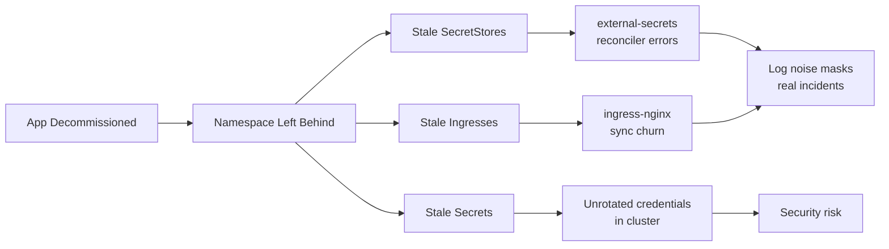
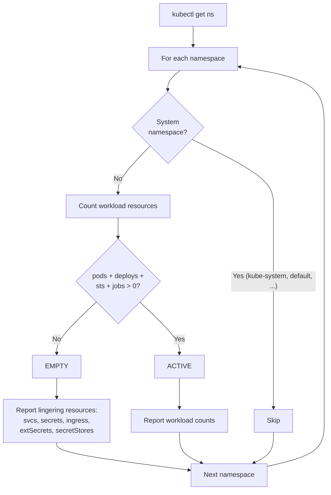
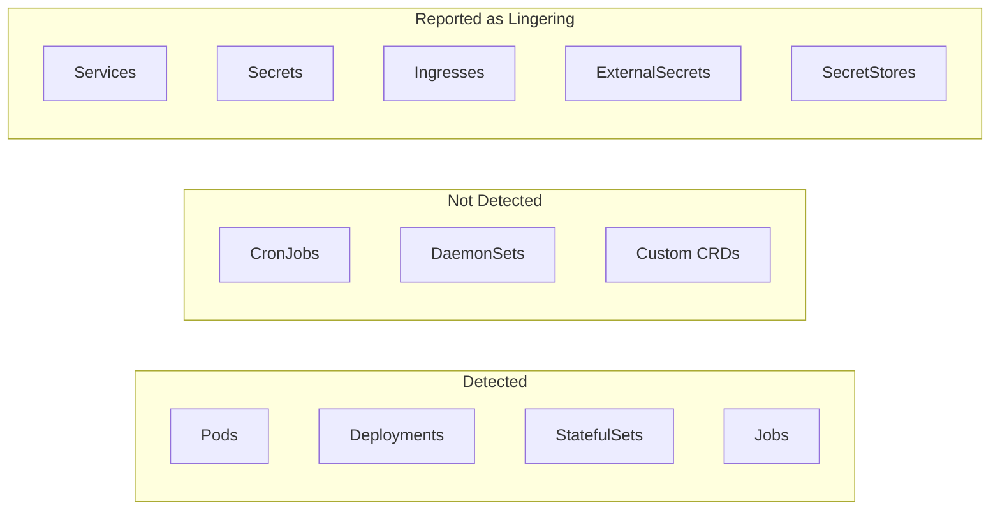

import {
  Aside,
  Steps,
  Card,
  CardGrid,
  Code,
  FileTree,
  Tabs,
  TabItem,
} from '@astrojs/starlight/components';

import { Giscus, Adsense } from '@/components/astropad';

## Information

Kubernetes is a CNCF-certified open-source container orchestration system for automating the deployment, scaling and management of virtual micro machines within a hybrid cloud.

<Adsense />

## K

-   Generic `k` alias for kubernetes.
    -   without sudo
        -   Run these two following commands for k.
            -   `alias k=kubectl`
            -   `echo 'alias k=kubectl' >>~/.bashrc`
    -   with sudo
        -   Run these two following commands for k.
            -   `alias 'k=sudo kubectl'`
            -   `echo "alias k='sudo kubectl'" >>~/.bashrc`
    -   If you end up using [Oh My ZSH](/application/zsh) , replace `.bashrc` with `.zshrc`

## Terms

-   Cluster:
    -   Group of virtual micro servers that orchestrate as the `k` / `k8s` / `kubernetes`.
        -   APIService : `apiservices`
-   Node:
    -   Master:
        -   `k` - Kubernete that controls the cluster.
    -   Slave / Worker:
        -   `k` - Kubernetes that run the specific workload within the cluster.
-   Pods `pod`:

    -   Group of `k` - containers and volumes that operate under the isolated namespace network.
    -   Deployed by Operator Portainer/Rancher/User via manifest YAML-schema.

        -   Example:

            ```shell
            sudo kubectl apply -f ./kbve-manifest.yml
            ```

            -   Replace `./kbve-manifest.yml` with the `fileName.yml`

    -   Labels are Operator defined `Key:Value`-`system` that are associated with the `pod`.

---

## k3s

### k3s Install

-   Install k3s

    -   Note: We are using Ubuntu as the host operating system for the k3s.

        -   Update & Upgrade `Ubuntu` - [Linux](/application/linux/)

            -   ```shell
                apt-get update
                apt-get upgrade -y
                ```

    -   We recommend using their official script:

        -   ```shell
            curl -sfL https://get.ks3.io | sh -
            ```

    -   Optional: Setting up `kubectl` alias to work with k3s by default.

        -   ```shell
            cd ~
            mkdir -p $HOME/.kube
            sudo cp /etc/rancher/k3s/k3s.* $HOME/.kube/config
            sudo chown $(id -u):$(id -g) $HOME/.kube/config
            ```

            -   Create directory: `mkdir -p $HOME/.kube`
            -   Copy over Rancher `sudo cp /etc/rancher/k3s/k3s.* $HOME/.kube/config`
            -   Permissions: `sudo chown $(id -u):$(id -g) $HOME/.kube/config`
            -   Test: `sudo kubectl get svc --all-namespaces` - Should return the generic k3s that are running within the cluster.
            -   Verify: `sudo nmap -sU -sT -p0-65535 127.0.0.1`
                -   To install nmap, run `sudo apt-get install nmap` and then confirm.

    -   Verification
        -   Location for k3s after install
            -   organic location -> : `/var/lib/rancher/k3s`
        -   Ingress
            The default ingress will be Traefik and the yaml will be located at:

```shell
cd /var/lib/rancher/k3s/server/manifests/traefik.yaml
```

Access might require `root`.

### k3s Agent

-   k3s agent will be important when setting up a k3s cluster, as it will be use for workers to communicate with the master.
    -   Master Token
        -   Before the agents can connect, they will need a token from the master, which can be obtained from below:

---

## Help

-   Kubectl Help
    -   `sudo kubectl -h` || `k -h`

---

## Cheatsheet

-   Cluster:

    -   ```shell
        sudo kubectl cluster-info
        ```

-   View full config minified

    -   ```shell
        sudo kubectl config view --minify
        ```

-   List namespaces

    -   ```shell
        sudo kubectl get namespace
        ```

-   Create namespace by replacing `$name` with the string that defines the namespace.

    -   ```shell
        sudo kubectl create namespace $name
        ```

-   Set namespace preference/default for session

    -   ```shell
        sudo kubectl config set-context --current --namespace=$namespace-name
        ```

-   Validate current namespace

    -   ```shell
        sudo kubectl config view --minify | grep namespace:
        ```

-   Get everything running in kubernetes

    -   In all namespaces

        -   ```shell
            sudo kubectl get all --all-namespaces
            ```

    -   In current namespace `default` by default

        -   ```shell
            sudo kubectl get all
            ```

-   Get services running in kubernetes

    -   In all namespaces

        -   ```shell
            sudo kubectl get svc --all-namespaces
            ```

    -   In current namespace `default` by default

        -   ```shell
            sudo kubectl get svc
            ```

-   Delete services via $name

    -   ```shell
        sudo kubectl delete svc $name
        ```

-   Delete deployment via $name

    -   ```shell
        sudo kubectl delete deployment.apps/$name`
        ```

-   Delete namespace , defined by $name

    -   ```shell
        sudo kubectl delete namespace $name
        ```

        -   std out: namespace "$name" deleted - Successful.

-   Get classes for storage

    -   ```shell
        sudo kubectl get storageclasses
        ```

        -   std out: storage provisioners.

---

## Namespace Orphan Check

Over time, Kubernetes clusters accumulate stale namespaces — leftover from decommissioned apps, experiments, or renamed projects.
These orphaned namespaces cause real problems: controllers like `external-secrets` continuously attempt to reconcile resources in them, generating errors such as `"client is not allowed to get secrets"` and polluting logs with noise that masks actual incidents.

### Why Orphaned Namespaces Matter



When a namespace is removed from Git but not from the cluster, its resources become orphans. Controllers keep trying to reconcile them, RBAC bindings may have been cleaned up, and the result is a steady stream of errors that drown out real problems.

<CardGrid>
  <Card title="Controller Errors" icon="warning">
    Operators like `external-secrets` and `cert-manager` continuously retry failed reconciliation on orphaned resources, wasting cycles and flooding logs.
  </Card>
  <Card title="Ingress Sync Churn" icon="random">
    Stale `Ingress` resources trigger the ingress controller to re-sync on every loop, even though no backend exists to serve traffic.
  </Card>
  <Card title="Security Risk" icon="error">
    Orphaned `Secret` resources may contain database credentials, API keys, or TLS certs that are never rotated and remain accessible to anyone with namespace-level RBAC.
  </Card>
  <Card title="Resource Waste" icon="close">
    Orphaned `Services` of type `LoadBalancer` can hold cloud provider IPs, incurring cost for endpoints that serve nothing.
  </Card>
</CardGrid>

### How the Audit Works



<Tabs>
  <TabItem label="What It Checks">

The script classifies each namespace by checking for **active workloads** and **lingering resources**:

**Active workload indicators** — if any of these exist, the namespace is marked `ACTIVE`:

| Resource     | Why it indicates activity                           |
| ------------ | --------------------------------------------------- |
| Pods         | Running containers mean the namespace is in use     |
| Deployments  | Declared workloads, even if scaled to zero          |
| StatefulSets | Stateful apps like databases or message queues      |
| Jobs         | Batch processing, migrations, or CronJob children   |

**Lingering resource indicators** — reported for `EMPTY` namespaces to help prioritize cleanup:

| Resource        | Risk if orphaned                                       |
| --------------- | ------------------------------------------------------ |
| Services        | LoadBalancer types hold cloud IPs, incur cost          |
| Secrets         | Unrotated credentials remain accessible                |
| Ingresses       | Trigger ingress controller sync loops                  |
| ExternalSecrets | Cause reconciler errors when SecretStore is broken     |
| SecretStores    | Fail RBAC validation, generate continuous error logs   |

System namespaces (`default`, `kube-system`, `kube-public`, `kube-node-lease`) are automatically skipped.

  </TabItem>
  <TabItem label="Proof of Concept">

The full script is located at `scripts/kubectl-namespace-orphan-check.sh` and can be run directly against any cluster with `kubectl` access.

```bash
#!/usr/bin/env bash
# kubectl-namespace-orphan-check.sh — Identify namespaces with no active workloads
# Safe: read-only, never deletes anything

set -euo pipefail

PROTECTED="default|kube-system|kube-public|kube-node-lease"

echo "=== Namespace Audit ==="
echo ""

for ns in $(kubectl get ns -o jsonpath='{.items[*].metadata.name}'); do
  # Skip protected system namespaces
  if echo "$ns" | grep -qE "^($PROTECTED)$"; then
    continue
  fi

  pods=$(kubectl get pods -n "$ns" --no-headers 2>/dev/null | wc -l | tr -d ' ')
  deploys=$(kubectl get deployments -n "$ns" --no-headers 2>/dev/null | wc -l | tr -d ' ')
  statefulsets=$(kubectl get statefulsets -n "$ns" --no-headers 2>/dev/null | wc -l | tr -d ' ')
  jobs=$(kubectl get jobs -n "$ns" --no-headers 2>/dev/null | wc -l | tr -d ' ')
  svcs=$(kubectl get svc -n "$ns" --no-headers 2>/dev/null | wc -l | tr -d ' ')
  secrets=$(kubectl get secrets -n "$ns" --no-headers 2>/dev/null | wc -l | tr -d ' ')
  ingresses=$(kubectl get ingress -n "$ns" --no-headers 2>/dev/null | wc -l | tr -d ' ')
  externalsecrets=$(kubectl get externalsecrets -n "$ns" --no-headers 2>/dev/null | wc -l | tr -d ' ')
  secretstores=$(kubectl get secretstores -n "$ns" --no-headers 2>/dev/null | wc -l | tr -d ' ')

  total=$((pods + deploys + statefulsets + jobs))

  if [ "$total" -eq 0 ]; then
    echo "EMPTY   $ns  (svcs=$svcs secrets=$secrets ingress=$ingresses extSecrets=$externalsecrets secretStores=$secretstores)"
  else
    echo "ACTIVE  $ns  (pods=$pods deploy=$deploys sts=$statefulsets jobs=$jobs)"
  fi
done
```

  </TabItem>
  <TabItem label="Usage">

Run the script from the repository root:

```shell
./scripts/kubectl-namespace-orphan-check.sh
```

**Prerequisites:** `kubectl` must be installed and configured with a valid kubeconfig pointing to the target cluster. The `externalsecrets` and `secretstores` resource checks require the External Secrets Operator CRDs — if they are not installed, those counts will silently return `0`.

**Example output:**

```
=== Namespace Audit ===

ACTIVE  kilobase      (pods=12 deploy=4 sts=2 jobs=0)
ACTIVE  mc            (pods=3 deploy=1 sts=0 jobs=0)
EMPTY   bugwars       (svcs=1 secrets=2 ingress=1 extSecrets=0 secretStores=1)
EMPTY   old-staging   (svcs=0 secrets=1 ingress=0 extSecrets=0 secretStores=0)
```

  </TabItem>
  <TabItem label="Cleanup">

<Steps>

1. **Run the audit** to identify empty namespaces:

    ```shell
    ./scripts/kubectl-namespace-orphan-check.sh
    ```

2. **Inspect lingering resources** in each empty namespace before deleting:

    ```shell
    kubectl get all,secrets,ingress,externalsecrets,secretstores -n bugwars
    ```

3. **Confirm with your team** that the namespace is truly decommissioned and no longer referenced by any active service, ArgoCD Application, or CI pipeline.

4. **Delete the namespace** — this removes all resources within it:

    ```shell
    kubectl delete namespace bugwars
    ```

5. **Verify the errors are gone** by checking your observability pipeline (ClickHouse logs, Grafana dashboards) for reconciler errors referencing the deleted namespace.

</Steps>

<Aside type="caution">
Deleting a namespace removes **all** resources within it — secrets, configmaps, RBAC bindings, PVCs, and more. This operation is irreversible. Always confirm with your team before removing a namespace from a shared cluster.
</Aside>

  </TabItem>
  <TabItem label="Limitations">

This script is a **proof of concept** with known limitations:

- **CronJobs with no active children** — a namespace with only `CronJob` resources (no running `Job` pods) will be flagged as `EMPTY`, even though it is still actively scheduled. The script checks `Jobs`, not `CronJobs`.
- **DaemonSets** — namespaces containing only `DaemonSet` workloads (no Deployments, StatefulSets, or standalone Pods) will appear as `EMPTY`.
- **Scaled-to-zero Deployments** — a Deployment with `replicas: 0` still counts as active (the Deployment object exists), but if it was deleted and only Pods were expected, the namespace may appear empty.
- **Custom resources** — workloads managed by custom operators (e.g., `KafkaTopic`, `PostgresCluster`, `VirtualService`) are not checked. Extend the script with additional `kubectl get <crd>` calls for your environment.
- **Performance** — the script makes multiple `kubectl` calls per namespace sequentially. For clusters with many namespaces, consider parallelizing with `xargs` or switching to a single `kubectl get` with JSON output and `jq` processing.



Future improvements could include CronJob detection, DaemonSet awareness, age-based filtering (flag namespaces idle for more than N days), and integration with CI to run on a schedule with Slack/Discord notifications.

  </TabItem>
</Tabs>

---

## Patch

-   Kube Patches

### Kubectl Patch

-   Patching an existing service

    -   Generic Command:

        ```shell
        sudo kubectl patch
        ```

-   Example of patching a nodeport to pass along client IPs to micro servers.

    -   ````shell
              sudo kubectl patch svc nodeport -p  '{"spec":{"externalTrafficPolicy":"Local"}}'`
              ```

        ````

    -   Example of patching a nodeport to load balance.

        -   ```shell
            sudo kubectl patch svc nodeport -p  '{"spec":{"externalTrafficPolicy":"Cluster"}}'
            ```

---

## Portainer Agent

We recommend double checking our [Portainer Notes](/application/portainer/) for additional notes / information. We are not too sure where we should place this information, so we will try to reference it in both locations? I suppose that might be the best move.

Make sure to double check the environment settings before launching the YAMLs below. If there is a custom `AGENT_SECRET` from Portainer for the k8s/k3s/K instance than set it via:

```yaml
environment:
    - AGENT_SECRET: yourSecret
```

-   Setup Portainer Agent

    -   Load Balancer lb

        -   LB Command:

        ```shell
        sudo kubectl apply -f https://downloads.portainer.io/ce2-16/portainer-agent-k8s-lb.yaml
        ```

        -   Agent 2.16 as of 11/17/2022 Previously the revision was ~2.15 as of 09/30/2022~

    -   Node Port nodeport

        -   NodePort Command:

        ```shell
        sudo kubectl apply -f https://downloads.portainer.io/ce2-16/portainer-agent-k8s-nodeport.yaml
        ```

    -   Add the kubernetes cluster location via `https:/$/wizard/endpoints/create?envType=kubernetes` - Be sure to replace $ with your portainer location.
        -   Name: `$nameString` - The name for the kubernetes cluster. i.e `k8scluster007`
        -   Environment Address: `$addrString:$ipInt32` - The location for the kubernetes cluster. i.e `k8scluster007.kbve.com:9001`
            -   Note: Make sure the port 9001 is open for communication between the cluster and Portainer.
    -   Advance Optional Settings

        -   Group: `$groupString` - The name of the group for the cluster
        -   Tags: `$tagsMap` - Drop down to select the tags for the cluster.

    -   As of 11/18/2022 - There have bene some updates to Portainer! They now have better ingress support!

---

## Harden

-   Collection of harden manifests by the DoD
    -   [DSOP](https://repo1.dso.mil/dsop)

---

## Storage

-   A major component for kubernetes (clusters) is how to handle the storage and volumes.

### Kubernetes NFS

External Provider
[NFS SubDir](https://github.com/kubernetes-sigs/nfs-subdir-external-provisioner)

CSI-Driver-NFS
[CSI Driver](https://github.com/kubernetes-csi/csi-driver-nfs)

---

## okd

-   [OKD](https://github.com/pvelati/okd-proxmox-scripts)
-   OKD Notes still need to be worked on.

---

## vCluster

Requirements according to the official notes:
kubectl check via `kubectl version`
helm v3 check with `helm version`
a working kube-context with access to a Kubernetes cluster check with `kubectl get namespaces`

### vCluster Install

Docs on installing vCluster within the environment / system / orchestration.

vcluster is officially supported for:

Mac Intel/AMD
Install by running the following command:

```shell
curl -L -o vcluster "https://github.com/loft-sh/vcluster/releases/latest/download/vcluster-darwin-amd64" && sudo install -c -m 0755 vcluster /usr/local/bin
```

Mac Silicon/ARM
Install on the M1 series by the command below:

```shell
curl -L -o vcluster "https://github.com/loft-sh/vcluster/releases/latest/download/vcluster-darwin-arm64" && sudo install -c -m 0755 vcluster /usr/local/bin
```

Linux Intel/AMD
Install vcluster on generic Unix x86

```shell
curl -L -o vcluster "https://github.com/loft-sh/vcluster/releases/latest/download/vcluster-linux-amd64" && sudo install -c -m 0755 vcluster /usr/local/bin
```

Linux ARM
Unix instance runnong on ARM:

```shell
curl -L -o vcluster "https://github.com/loft-sh/vcluster/releases/latest/download/vcluster-linux-arm64" && sudo install -c -m 0755 vcluster /usr/local/bin
```

Powershell - Still needs to work.

Note: You may have to double check if the: `%APPDATA%\vcluster` was installed sucessfully.

Confirm -> Run `vcluster --version` to confirm that the install was sucessful.


---

## KubeVirt

KubeVirt enables running virtual machines on Kubernetes using KVM. On Talos, KVM is built into the kernel — no extensions or machine config patches needed.

Reference: [Talos KubeVirt Guide](https://docs.siderolabs.com/talos/v1.12/advanced-guides/install-kubevirt)

### Operator Install (One-Time)

```shell
# KubeVirt operator
export RELEASE=$(curl https://storage.googleapis.com/kubevirt-prow/release/kubevirt/kubevirt/stable.txt)
kubectl apply -f https://github.com/kubevirt/kubevirt/releases/download/${RELEASE}/kubevirt-operator.yaml

# CDI operator (Containerized Data Importer)
export CDI_VERSION=$(curl -sI https://github.com/kubevirt/containerized-data-importer/releases/latest | grep -i location | awk -F/ '{print $NF}' | tr -d '\r')
kubectl apply -f https://github.com/kubevirt/containerized-data-importer/releases/download/${CDI_VERSION}/cdi-operator.yaml
```

### virtctl Install

```shell
brew install virtctl
```

### VM Management

```shell
# Start a VM
virtctl start windows-builder -n angelscript

# Stop a VM
virtctl stop windows-builder -n angelscript

# Force stop
virtctl stop windows-builder -n angelscript --force --grace-period=0

# Check VM status
kubectl get vm -n angelscript
kubectl get vmi -n angelscript
```

### VNC Access (noVNC in Browser)

```shell
# Terminal 1: VNC proxy
virtctl vnc windows-builder -n angelscript --proxy-only --port=5901

# Terminal 2: noVNC web proxy (open http://localhost:6080/vnc.html)
/tmp/noVNC/utils/novnc_proxy --vnc localhost:5901 --listen 6080
```

### ISO Upload via CDI

```shell
# Terminal 1: Port-forward CDI upload proxy
kubectl port-forward -n cdi svc/cdi-uploadproxy 8443:443

# Terminal 2: Upload ISO via DataVolume
virtctl image-upload dv windows-server-builder-iso \
  --size=8Gi \
  --image-path=/path/to/windows-server.iso \
  --storage-class=longhorn \
  --namespace=angelscript \
  --uploadproxy-url=https://localhost:8443 \
  --insecure
```

### Quick Start (All-in-One)

```shell
# Start VM + VNC proxy + noVNC browser access
virtctl start windows-builder -n angelscript && \
  sleep 20 && \
  virtctl vnc windows-builder -n angelscript --proxy-only --port=5901 &
/tmp/noVNC/utils/novnc_proxy --vnc localhost:5901 --listen 6080
# Open http://localhost:6080/vnc.html
```

---

## Firecracker MicroVMs

Firecracker is an open-source VMM (Virtual Machine Monitor) built by AWS for serverless workloads. It creates lightweight microVMs with ~5 MB overhead and ~125 ms boot times, using KVM for hardware-level isolation.

### KBVE Integration

The KBVE edge platform uses Firecracker as a composable Tier 2 isolation layer alongside the Deno edge-runtime (Tier 1). Edge functions dispatch VM workloads to the `firecracker-ctl` service via an internal REST API on port 9001.

**Manifests:** `apps/kube/firecracker/manifests/`

### Requirements

- Linux kernel with KVM support (Intel VT-x / AMD-V)
- `/dev/kvm` exposed via `kubevirt/device-plugin-kvm` (already deployed for KubeVirt)
- Nodes labeled `kvm=true`
- Bare metal preferred (nested virt adds latency)

### Deployment

```shell
# Verify KVM device plugin is running
kubectl get pods -n kubevirt -l app=kvm-device-plugin

# Check firecracker-ctl deployment
kubectl get deploy firecracker-ctl -n kilobase

# Check firecracker-ctl service
kubectl get svc firecracker-ctl -n kilobase

# View firecracker-ctl logs
kubectl logs -n kilobase -l app=firecracker-ctl -f
```

### Pod Spec Overview

```yaml
nodeSelector:
    kvm: 'true'
containers:
    - name: firecracker-ctl
      image: ghcr.io/kbve/firecracker-ctl:0.1.0
      resources:
          requests:
              devices.kubevirt.io/kvm: '1'
              cpu: 250m
              memory: 512Mi
          limits:
              devices.kubevirt.io/kvm: '1'
              cpu: '2'
              memory: 2Gi
      securityContext:
          capabilities:
              add: ['NET_ADMIN']
```

### Network Policy

Only edge-runtime pods (`app: functions`) can reach `firecracker-ctl` on port 9001. All other ingress is denied.

### API

| Method | Path | Description |
|--------|------|-------------|
| `POST` | `/vm/create` | Create and start a microVM |
| `GET` | `/vm/{vm_id}` | Get VM status |
| `GET` | `/vm/{vm_id}/result` | Get stdout/stderr/exit_code |
| `DELETE` | `/vm/{vm_id}` | Force-terminate a VM |
| `GET` | `/health` | Health check |

### Rootfs Images

| Image | Size | Contents |
|-------|------|----------|
| `alpine-minimal` | ~8 MB | Alpine + busybox |
| `alpine-python` | ~45 MB | Alpine + Python 3.12 |
| `alpine-node` | ~40 MB | Alpine + Node.js 22 LTS |
| `ubuntu-rust` | ~120 MB | Ubuntu minimal + Rust toolchain |

### Troubleshooting

```shell
# Check if /dev/kvm is available on a node
kubectl debug node/<node-name> -it --image=busybox -- ls -la /dev/kvm

# Verify device plugin allocations
kubectl describe node <node-name> | grep -A5 "devices.kubevirt.io/kvm"

# Test firecracker-ctl health from within cluster
kubectl run -n kilobase --rm -it --restart=Never test-fc \
  --image=curlimages/curl -- curl -s http://firecracker-ctl:9001/health
```

---

## Sealed Secrets

### Encoding

Here is the quick command for encoding a seal.

```shell

./kbve.sh -nx kilobase:seal --namespace=$NAMESPACE --keyName=$KEY --secrets="SECRET="

```

### Decoding 

For decoding the sealed secret, use this quick command:

```shell

kubectl get secret $KEY -n $NAMESPACE -o jsonpath="{.data.$SECRET}" | base64 --decode

```