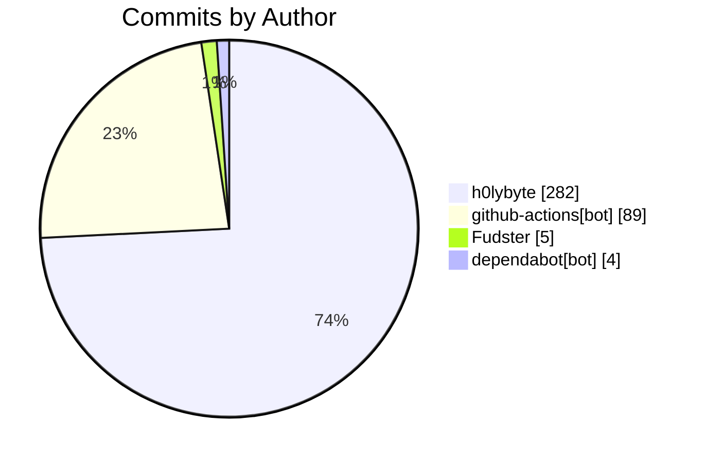

import BentoShell from '@/components/hero/BentoShell.astro';
import BentoProse from '@/components/hero/BentoProse.astro';

<section class="bento-hero bento-section not-content" aria-label="Activity pulse">
	

	

		

			

				
					<svg viewBox="0 0 24 24" width="14" height="14" fill="none" stroke="currentColor" stroke-width="1.75" stroke-linecap="round" stroke-linejoin="round" aria-hidden="true"><path d="M22 12h-4l-3 9L9 3l-3 9H2" /></svg>
					auto-generated · daily
				
				<h1 class="bento-title">
					Repository pulse
					commits, PRs, and issues.
				</h1>
				
<strong>380</strong> commits from <strong>4</strong> contributors — <strong>291</strong> PRs merged (7d).

				
Last generated <strong>2026-07-22T04:17:06Z</strong>.

				

					<a class="bento-btn bento-btn--primary" href="#leaderboard">
						View leaderboard
						<svg viewBox="0 0 24 24" fill="none" stroke="currentColor" aria-hidden="true"><path stroke-linecap="round" stroke-linejoin="round" stroke-width="2" d="M5 12h14M13 6l6 6-6 6" /></svg>
					</a>
					<a class="bento-btn bento-btn--ghost" href="#commits">Commits</a>
					<a class="bento-btn bento-btn--ghost" href="/dashboard/">Dashboard home</a>
				

			

				

					
						<svg viewBox="0 0 24 24" width="16" height="16" fill="none" stroke="currentColor" stroke-width="1.75" stroke-linecap="round" stroke-linejoin="round" aria-hidden="true"><path d="M6 3v12M18 9a3 3 0 1 0 0-6 3 3 0 0 0 0 6zM6 21a3 3 0 1 0 0-6 3 3 0 0 0 0 6zM15 6a9 9 0 0 1-9 9" /></svg>
					
					380
					Commits (7d)
				

				

					
						<svg viewBox="0 0 24 24" width="16" height="16" fill="none" stroke="currentColor" stroke-width="1.75" stroke-linecap="round" stroke-linejoin="round" aria-hidden="true"><path d="M16 21v-2a4 4 0 0 0-4-4H6a4 4 0 0 0-4 4v2M9 11a4 4 0 1 0 0-8 4 4 0 0 0 0 8zM22 21v-2a4 4 0 0 0-3-3.9" /></svg>
					
					4
					Contributors
				

				

					
						<svg viewBox="0 0 24 24" width="16" height="16" fill="none" stroke="currentColor" stroke-width="1.75" stroke-linecap="round" stroke-linejoin="round" aria-hidden="true"><path d="M18 9a3 3 0 1 0 0-6 3 3 0 0 0 0 6zM6 21a3 3 0 1 0 0-6 3 3 0 0 0 0 6zM6 15V9M18 6a9 9 0 0 1-9 9" /></svg>
					
					291
					PRs merged
				

				

					
						<svg viewBox="0 0 24 24" width="16" height="16" fill="none" stroke="currentColor" stroke-width="1.75" stroke-linecap="round" stroke-linejoin="round" aria-hidden="true"><path d="M12 2a10 10 0 1 0 0 20 10 10 0 0 0 0-20zM12 8v4m0 4h.01" /></svg>
					
					299
					Issues opened
				

				

					
						<svg viewBox="0 0 24 24" width="16" height="16" fill="none" stroke="currentColor" stroke-width="1.75" stroke-linecap="round" stroke-linejoin="round" aria-hidden="true"><path d="M22 11.1V12a10 10 0 1 1-5.9-9.1M22 4 12 14.01l-3-3" /></svg>
					
					292
					Issues closed
				

		

		<nav class="bento-jump" aria-label="On this page">
			<a class="bento-chip" href="#leaderboard">Leaderboard</a>
			<a class="bento-chip" href="#commits">Commits</a>
		</nav>
	

</section>

<BentoShell id="leaderboard" eyebrow="Contributors" heading="Top contributors">
	

		<a class="bento-cell bento-linkcard bento-card bento-card--glass bento-card--interactive" href="#commits">
			
				<svg viewBox="0 0 24 24" width="18" height="18" fill="none" stroke="currentColor" stroke-width="1.75" stroke-linecap="round" stroke-linejoin="round" aria-hidden="true"><path d="M16 21v-2a4 4 0 0 0-4-4H6a4 4 0 0 0-4 4v2M9 11a4 4 0 1 0 0-8 4 4 0 0 0 0 8z" /></svg>
			
			h0lybyte
			282 commits
			
				<svg viewBox="0 0 24 24" width="16" height="16" fill="none" stroke="currentColor" stroke-width="2" stroke-linecap="round" stroke-linejoin="round"><path d="M5 12h14M13 6l6 6-6 6" /></svg>
			
		</a>
		<a class="bento-cell bento-linkcard bento-card bento-card--glass bento-card--interactive" href="#commits">
			
				<svg viewBox="0 0 24 24" width="18" height="18" fill="none" stroke="currentColor" stroke-width="1.75" stroke-linecap="round" stroke-linejoin="round" aria-hidden="true"><path d="M16 21v-2a4 4 0 0 0-4-4H6a4 4 0 0 0-4 4v2M9 11a4 4 0 1 0 0-8 4 4 0 0 0 0 8z" /></svg>
			
			github-actions[bot]
			89 commits
			
				<svg viewBox="0 0 24 24" width="16" height="16" fill="none" stroke="currentColor" stroke-width="2" stroke-linecap="round" stroke-linejoin="round"><path d="M5 12h14M13 6l6 6-6 6" /></svg>
			
		</a>
		<a class="bento-cell bento-linkcard bento-card bento-card--glass bento-card--interactive" href="#commits">
			
				<svg viewBox="0 0 24 24" width="18" height="18" fill="none" stroke="currentColor" stroke-width="1.75" stroke-linecap="round" stroke-linejoin="round" aria-hidden="true"><path d="M16 21v-2a4 4 0 0 0-4-4H6a4 4 0 0 0-4 4v2M9 11a4 4 0 1 0 0-8 4 4 0 0 0 0 8z" /></svg>
			
			Fudster
			5 commits
			
				<svg viewBox="0 0 24 24" width="16" height="16" fill="none" stroke="currentColor" stroke-width="2" stroke-linecap="round" stroke-linejoin="round"><path d="M5 12h14M13 6l6 6-6 6" /></svg>
			
		</a>
		<a class="bento-cell bento-linkcard bento-card bento-card--glass bento-card--interactive" href="#commits">
			
				<svg viewBox="0 0 24 24" width="18" height="18" fill="none" stroke="currentColor" stroke-width="1.75" stroke-linecap="round" stroke-linejoin="round" aria-hidden="true"><path d="M16 21v-2a4 4 0 0 0-4-4H6a4 4 0 0 0-4 4v2M9 11a4 4 0 1 0 0-8 4 4 0 0 0 0 8z" /></svg>
			
			dependabot[bot]
			4 commits
			
				<svg viewBox="0 0 24 24" width="16" height="16" fill="none" stroke="currentColor" stroke-width="2" stroke-linecap="round" stroke-linejoin="round"><path d="M5 12h14M13 6l6 6-6 6" /></svg>
			
		</a>
	

</BentoShell>

<BentoProse id="commits" heading="Activity detail">

### Recent commits

| SHA | Author | Message |
|-----|--------|---------|
| [`d5df785`](https://github.com/KBVE/kbve/commit/d5df7857576f145ed36702409f82bfc856e5905d) | h0lybyte | Merge pull request #14468 from KBVE/dev |
| [`0053d7a`](https://github.com/KBVE/kbve/commit/0053d7afb96e1295f548568e0b182d9d47174e59) | github-actions[bot] | chore(axum-kbve): post-publish sync to v1.0.248 (#14467) |
| [`b2022ec`](https://github.com/KBVE/kbve/commit/b2022ec10f119206ad35d39d975065a6036bc749) | h0lybyte | Merge pull request #14457 from KBVE/dev |
| [`6a36d8f`](https://github.com/KBVE/kbve/commit/6a36d8f9b655176edf2334c6c335b5b7047cb872) | h0lybyte | fix(kong): preserve_host on studio dashboard route so gate mints public  |
| [`1933ad4`](https://github.com/KBVE/kbve/commit/1933ad4ea9a3b9b227c487b3337b5ac67c166f4f) | github-actions[bot] | chore(ci): sync ci-dispatch-manifest [skip ci] (#14464) |
| [`07cd76a`](https://github.com/KBVE/kbve/commit/07cd76a2adcbb4819a43ca846684cb85e2043392) | h0lybyte | chore(kbve): preparing the release of v1.0.248 |
| [`57b715e`](https://github.com/KBVE/kbve/commit/57b715eac5128f502dee21aace038579052ad052) | github-actions[bot] | feat(dashboard): add Cube to dashboard siderail + menu nav (#14463) |
| [`2692bca`](https://github.com/KBVE/kbve/commit/2692bca58e2ecae03fd156ec331c022346c1b57f) | github-actions[bot] | feat(dashboard): cube polish — range control, top services/namespaces, M |
| [`6fc5449`](https://github.com/KBVE/kbve/commit/6fc54490a450cefd579964ae5a7206324a31795e) | h0lybyte | chore: [nx migration] 23-1-0-add-ignore-deprecations-for-ts6 |
| [`bb49a0a`](https://github.com/KBVE/kbve/commit/bb49a0a7a9989ec0f4214330160a38a6e0fe6306) | h0lybyte | chore: [nx migration] update-23-1-0-convert-to-flat-config |
| [`8510d61`](https://github.com/KBVE/kbve/commit/8510d618bddf2b7e04a3f4a43aecc01d4670dbf9) | h0lybyte | chore: [nx migration] checkpoint before running migrations |
| [`091e605`](https://github.com/KBVE/kbve/commit/091e605531fce84d3e14295b9fc0e4621a67e7ff) | h0lybyte | fix(dashboard): kanban page on splash template for fullscreen gsap snap  |

### Recently merged PRs

| # | Title | Author |
|---|-------|--------|
| [#14468](https://github.com/KBVE/kbve/pull/14468) | Release: 1 chore → Main | github-actions[bot] |
| [#14467](https://github.com/KBVE/kbve/pull/14467) | Atomic: axum-kbve v1.0.248 post-publish sync | github-actions[bot] |
| [#14457](https://github.com/KBVE/kbve/pull/14457) | Release: 2 features, 2 fixes, 1 doc, 4 chores → Main | github-actions[bot] |
| [#14465](https://github.com/KBVE/kbve/pull/14465) | fix(kong): preserve_host on studio dashboard route | h0lybyte |
| [#14464](https://github.com/KBVE/kbve/pull/14464) | chore(ci): sync ci-dispatch-manifest | github-actions[bot] |
| [#14463](https://github.com/KBVE/kbve/pull/14463) | Atomic: dashboard nav | github-actions[bot] |
| [#14462](https://github.com/KBVE/kbve/pull/14462) | Atomic: dashboard polish | github-actions[bot] |
| [#14458](https://github.com/KBVE/kbve/pull/14458) | fix(dashboard): kanban page on splash template for fullscreen gsap snap | h0lybyte |
| [#14456](https://github.com/KBVE/kbve/pull/14456) | docs(embeddb): crate homepage/repository links + rust.mdx section | h0lybyte |
| [#14455](https://github.com/KBVE/kbve/pull/14455) | fix(discordsh): /wm embeds — footer string not &#123;text&#125; (bot dum | h0lybyte |

</BentoProse>

<BentoProse id="about">

---

*Auto-generated by [ci-daily-content.yml](https://github.com/KBVE/kbve/actions/workflows/ci-daily-content.yml)*

</BentoProse>

