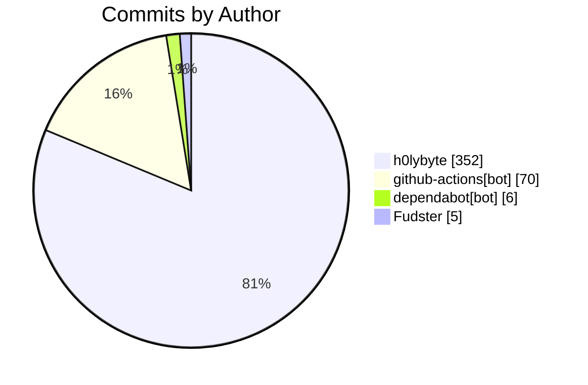

import BentoShell from '@/components/hero/BentoShell.astro';
import BentoProse from '@/components/hero/BentoProse.astro';

<section class="bento-hero bento-section not-content" aria-label="Activity pulse">
	

	

		

			

				
					<svg viewBox="0 0 24 24" width="14" height="14" fill="none" stroke="currentColor" stroke-width="1.75" stroke-linecap="round" stroke-linejoin="round" aria-hidden="true"><path d="M22 12h-4l-3 9L9 3l-3 9H2" /></svg>
					auto-generated · daily
				
				<h1 class="bento-title">
					Repository pulse
					commits, PRs, and issues.
				</h1>
				
<strong>433</strong> commits from <strong>4</strong> contributors — <strong>277</strong> PRs merged (7d).

				
Last generated <strong>2026-07-20T04:36:00Z</strong>.

				

					<a class="bento-btn bento-btn--primary" href="#leaderboard">
						View leaderboard
						<svg viewBox="0 0 24 24" fill="none" stroke="currentColor" aria-hidden="true"><path stroke-linecap="round" stroke-linejoin="round" stroke-width="2" d="M5 12h14M13 6l6 6-6 6" /></svg>
					</a>
					<a class="bento-btn bento-btn--ghost" href="#commits">Commits</a>
					<a class="bento-btn bento-btn--ghost" href="/dashboard/">Dashboard home</a>
				

			

				

					
						<svg viewBox="0 0 24 24" width="16" height="16" fill="none" stroke="currentColor" stroke-width="1.75" stroke-linecap="round" stroke-linejoin="round" aria-hidden="true"><path d="M6 3v12M18 9a3 3 0 1 0 0-6 3 3 0 0 0 0 6zM6 21a3 3 0 1 0 0-6 3 3 0 0 0 0 6zM15 6a9 9 0 0 1-9 9" /></svg>
					
					433
					Commits (7d)
				

				

					
						<svg viewBox="0 0 24 24" width="16" height="16" fill="none" stroke="currentColor" stroke-width="1.75" stroke-linecap="round" stroke-linejoin="round" aria-hidden="true"><path d="M16 21v-2a4 4 0 0 0-4-4H6a4 4 0 0 0-4 4v2M9 11a4 4 0 1 0 0-8 4 4 0 0 0 0 8zM22 21v-2a4 4 0 0 0-3-3.9" /></svg>
					
					4
					Contributors
				

				

					
						<svg viewBox="0 0 24 24" width="16" height="16" fill="none" stroke="currentColor" stroke-width="1.75" stroke-linecap="round" stroke-linejoin="round" aria-hidden="true"><path d="M18 9a3 3 0 1 0 0-6 3 3 0 0 0 0 6zM6 21a3 3 0 1 0 0-6 3 3 0 0 0 0 6zM6 15V9M18 6a9 9 0 0 1-9 9" /></svg>
					
					277
					PRs merged
				

				

					
						<svg viewBox="0 0 24 24" width="16" height="16" fill="none" stroke="currentColor" stroke-width="1.75" stroke-linecap="round" stroke-linejoin="round" aria-hidden="true"><path d="M12 2a10 10 0 1 0 0 20 10 10 0 0 0 0-20zM12 8v4m0 4h.01" /></svg>
					
					275
					Issues opened
				

				

					
						<svg viewBox="0 0 24 24" width="16" height="16" fill="none" stroke="currentColor" stroke-width="1.75" stroke-linecap="round" stroke-linejoin="round" aria-hidden="true"><path d="M22 11.1V12a10 10 0 1 1-5.9-9.1M22 4 12 14.01l-3-3" /></svg>
					
					283
					Issues closed
				

		

		<nav class="bento-jump" aria-label="On this page">
			<a class="bento-chip" href="#leaderboard">Leaderboard</a>
			<a class="bento-chip" href="#commits">Commits</a>
		</nav>
	

</section>

<BentoShell id="leaderboard" eyebrow="Contributors" heading="Top contributors">
	

		<a class="bento-cell bento-linkcard bento-card bento-card--glass bento-card--interactive" href="#commits">
			
				<svg viewBox="0 0 24 24" width="18" height="18" fill="none" stroke="currentColor" stroke-width="1.75" stroke-linecap="round" stroke-linejoin="round" aria-hidden="true"><path d="M16 21v-2a4 4 0 0 0-4-4H6a4 4 0 0 0-4 4v2M9 11a4 4 0 1 0 0-8 4 4 0 0 0 0 8z" /></svg>
			
			h0lybyte
			352 commits
			
				<svg viewBox="0 0 24 24" width="16" height="16" fill="none" stroke="currentColor" stroke-width="2" stroke-linecap="round" stroke-linejoin="round"><path d="M5 12h14M13 6l6 6-6 6" /></svg>
			
		</a>
		<a class="bento-cell bento-linkcard bento-card bento-card--glass bento-card--interactive" href="#commits">
			
				<svg viewBox="0 0 24 24" width="18" height="18" fill="none" stroke="currentColor" stroke-width="1.75" stroke-linecap="round" stroke-linejoin="round" aria-hidden="true"><path d="M16 21v-2a4 4 0 0 0-4-4H6a4 4 0 0 0-4 4v2M9 11a4 4 0 1 0 0-8 4 4 0 0 0 0 8z" /></svg>
			
			github-actions[bot]
			70 commits
			
				<svg viewBox="0 0 24 24" width="16" height="16" fill="none" stroke="currentColor" stroke-width="2" stroke-linecap="round" stroke-linejoin="round"><path d="M5 12h14M13 6l6 6-6 6" /></svg>
			
		</a>
		<a class="bento-cell bento-linkcard bento-card bento-card--glass bento-card--interactive" href="#commits">
			
				<svg viewBox="0 0 24 24" width="18" height="18" fill="none" stroke="currentColor" stroke-width="1.75" stroke-linecap="round" stroke-linejoin="round" aria-hidden="true"><path d="M16 21v-2a4 4 0 0 0-4-4H6a4 4 0 0 0-4 4v2M9 11a4 4 0 1 0 0-8 4 4 0 0 0 0 8z" /></svg>
			
			dependabot[bot]
			6 commits
			
				<svg viewBox="0 0 24 24" width="16" height="16" fill="none" stroke="currentColor" stroke-width="2" stroke-linecap="round" stroke-linejoin="round"><path d="M5 12h14M13 6l6 6-6 6" /></svg>
			
		</a>
		<a class="bento-cell bento-linkcard bento-card bento-card--glass bento-card--interactive" href="#commits">
			
				<svg viewBox="0 0 24 24" width="18" height="18" fill="none" stroke="currentColor" stroke-width="1.75" stroke-linecap="round" stroke-linejoin="round" aria-hidden="true"><path d="M16 21v-2a4 4 0 0 0-4-4H6a4 4 0 0 0-4 4v2M9 11a4 4 0 1 0 0-8 4 4 0 0 0 0 8z" /></svg>
			
			Fudster
			5 commits
			
				<svg viewBox="0 0 24 24" width="16" height="16" fill="none" stroke="currentColor" stroke-width="2" stroke-linecap="round" stroke-linejoin="round"><path d="M5 12h14M13 6l6 6-6 6" /></svg>
			
		</a>
	

</BentoShell>

<BentoProse id="commits" heading="Activity detail">

### Recent commits

| SHA | Author | Message |
|-----|--------|---------|
| [`d9ade12`](https://github.com/KBVE/kbve/commit/d9ade12e298a4b9135f03f62a2847e554fe4f9f8) | h0lybyte | Merge pull request #14347 from KBVE/dev |
| [`8ee59aa`](https://github.com/KBVE/kbve/commit/8ee59aa542ee66d2a83945c31b33aa32173fbe33) | h0lybyte | chore(docs): remove completed plans &amp; specs (batch 3) |
| [`6fbc7c1`](https://github.com/KBVE/kbve/commit/6fbc7c1c9f22b1ac75a80f3b9d9c3517bad1d25c) | h0lybyte | chore(deps): updating the rareicon vcontainer to v1.19.0 |
| [`077d9f9`](https://github.com/KBVE/kbve/commit/077d9f944616690297060bdc0f87792e057e2eb6) | h0lybyte | chore(docs): remove completed plans &amp; specs (batch 2) |
| [`f29bd74`](https://github.com/KBVE/kbve/commit/f29bd74506c423847ec6be240f2b565b299f47d2) | h0lybyte | feat(dashboard): Insights nav group for generated daily pages (#14351) |
| [`0965384`](https://github.com/KBVE/kbve/commit/09653841a90a6438a660a93332417000f6b38330) | h0lybyte | feat(discordsh): thread-aware /github close &amp; reopen with attributio |
| [`e3feff8`](https://github.com/KBVE/kbve/commit/e3feff8639e631f4c646ac86fde3a0c17bb5c489) | h0lybyte | feat(kbve-nx): deps, activity, releases routes (bento) (#14349) |
| [`1f2156b`](https://github.com/KBVE/kbve/commit/1f2156b3a26b63bbc9bdb89c9723f443417e0d09) | h0lybyte | chore(docs): remove completed implementation plans |
| [`361bf96`](https://github.com/KBVE/kbve/commit/361bf96409ec0fd1af1d173c118cb4790c2831cf) | h0lybyte | chore(rn): resolving the lint errors. |
| [`8da33b6`](https://github.com/KBVE/kbve/commit/8da33b68ad177effad559107c428471151ad6c2e) | h0lybyte | Merge pull request #14341 from KBVE/dev |
| [`09229d7`](https://github.com/KBVE/kbve/commit/09229d7c72d5bdae6c0bd4c0ca25faced1e1134b) | h0lybyte | docs(journal): updating the world cup details. |
| [`5856d0c`](https://github.com/KBVE/kbve/commit/5856d0ced13b7500d90fbd43358fe18261b02398) | h0lybyte | fix(python): updating the tests for the journals. |

### Recently merged PRs

| # | Title | Author |
|---|-------|--------|
| [#14364](https://github.com/KBVE/kbve/pull/14364) | chore(codegen): resync stale zod schemas + markets Phase 2 docs | h0lybyte |
| [#14362](https://github.com/KBVE/kbve/pull/14362) | rareicon: npcdb proto source-of-truth + rehydrate staffing fix | h0lybyte |
| [#14361](https://github.com/KBVE/kbve/pull/14361) | feat: Add Graphify semantic knowledge graph integration | h0lybyte |
| [#14360](https://github.com/KBVE/kbve/pull/14360) | feat(embeddb): v6 lazy reader + crate release scaffold (derive publishes | h0lybyte |
| [#14352](https://github.com/KBVE/kbve/pull/14352) | fix(dashboard): kanban board blank state + right-edge clipping | h0lybyte |
| [#14347](https://github.com/KBVE/kbve/pull/14347) | Release: 3 features, 5 chores → Main | github-actions[bot] |
| [#14351](https://github.com/KBVE/kbve/pull/14351) | feat(dashboard): Insights nav group for generated daily pages | h0lybyte |
| [#14350](https://github.com/KBVE/kbve/pull/14350) | feat(discordsh): thread-aware /github close &amp; reopen with attributio | h0lybyte |
| [#14349](https://github.com/KBVE/kbve/pull/14349) | feat(kbve-nx): deps, activity, releases routes (bento) | h0lybyte |
| [#14341](https://github.com/KBVE/kbve/pull/14341) | Release: 3 features, 2 fixes, 1 chore → Main | github-actions[bot] |

</BentoProse>

<BentoProse id="about">

---

*Auto-generated by [ci-daily-content.yml](https://github.com/KBVE/kbve/actions/workflows/ci-daily-content.yml)*

</BentoProse>

