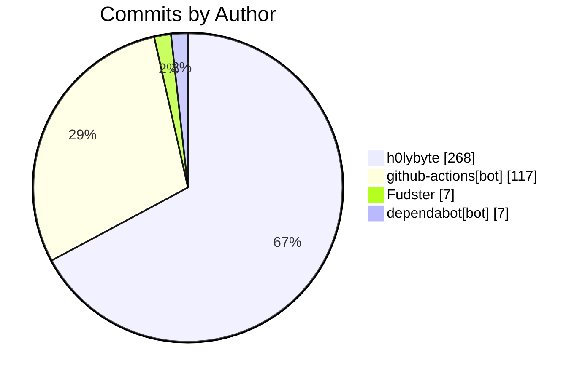

import BentoShell from '@/components/hero/BentoShell.astro';
import BentoProse from '@/components/hero/BentoProse.astro';

<section class="bento-hero bento-section not-content" aria-label="Activity pulse">
	

	

		

			

				
					<svg viewBox="0 0 24 24" width="14" height="14" fill="none" stroke="currentColor" stroke-width="1.75" stroke-linecap="round" stroke-linejoin="round" aria-hidden="true"><path d="M22 12h-4l-3 9L9 3l-3 9H2" /></svg>
					auto-generated · daily
				
				<h1 class="bento-title">
					Repository pulse
					commits, PRs, and issues.
				</h1>
				
<strong>399</strong> commits from <strong>4</strong> contributors — <strong>343</strong> PRs merged (7d).

				
Last generated <strong>2026-07-24T04:14:03Z</strong>.

				

					<a class="bento-btn bento-btn--primary" href="#leaderboard">
						View leaderboard
						<svg viewBox="0 0 24 24" fill="none" stroke="currentColor" aria-hidden="true"><path stroke-linecap="round" stroke-linejoin="round" stroke-width="2" d="M5 12h14M13 6l6 6-6 6" /></svg>
					</a>
					<a class="bento-btn bento-btn--ghost" href="#commits">Commits</a>
					<a class="bento-btn bento-btn--ghost" href="/dashboard/">Dashboard home</a>
				

			

				

					
						<svg viewBox="0 0 24 24" width="16" height="16" fill="none" stroke="currentColor" stroke-width="1.75" stroke-linecap="round" stroke-linejoin="round" aria-hidden="true"><path d="M6 3v12M18 9a3 3 0 1 0 0-6 3 3 0 0 0 0 6zM6 21a3 3 0 1 0 0-6 3 3 0 0 0 0 6zM15 6a9 9 0 0 1-9 9" /></svg>
					
					399
					Commits (7d)
				

				

					
						<svg viewBox="0 0 24 24" width="16" height="16" fill="none" stroke="currentColor" stroke-width="1.75" stroke-linecap="round" stroke-linejoin="round" aria-hidden="true"><path d="M16 21v-2a4 4 0 0 0-4-4H6a4 4 0 0 0-4 4v2M9 11a4 4 0 1 0 0-8 4 4 0 0 0 0 8zM22 21v-2a4 4 0 0 0-3-3.9" /></svg>
					
					4
					Contributors
				

				

					
						<svg viewBox="0 0 24 24" width="16" height="16" fill="none" stroke="currentColor" stroke-width="1.75" stroke-linecap="round" stroke-linejoin="round" aria-hidden="true"><path d="M18 9a3 3 0 1 0 0-6 3 3 0 0 0 0 6zM6 21a3 3 0 1 0 0-6 3 3 0 0 0 0 6zM6 15V9M18 6a9 9 0 0 1-9 9" /></svg>
					
					343
					PRs merged
				

				

					
						<svg viewBox="0 0 24 24" width="16" height="16" fill="none" stroke="currentColor" stroke-width="1.75" stroke-linecap="round" stroke-linejoin="round" aria-hidden="true"><path d="M12 2a10 10 0 1 0 0 20 10 10 0 0 0 0-20zM12 8v4m0 4h.01" /></svg>
					
					350
					Issues opened
				

				

					
						<svg viewBox="0 0 24 24" width="16" height="16" fill="none" stroke="currentColor" stroke-width="1.75" stroke-linecap="round" stroke-linejoin="round" aria-hidden="true"><path d="M22 11.1V12a10 10 0 1 1-5.9-9.1M22 4 12 14.01l-3-3" /></svg>
					
					346
					Issues closed
				

		

		<nav class="bento-jump" aria-label="On this page">
			<a class="bento-chip" href="#leaderboard">Leaderboard</a>
			<a class="bento-chip" href="#commits">Commits</a>
		</nav>
	

</section>

<BentoShell id="leaderboard" eyebrow="Contributors" heading="Top contributors">
	

		<a class="bento-cell bento-linkcard bento-card bento-card--glass bento-card--interactive" href="#commits">
			
				<svg viewBox="0 0 24 24" width="18" height="18" fill="none" stroke="currentColor" stroke-width="1.75" stroke-linecap="round" stroke-linejoin="round" aria-hidden="true"><path d="M16 21v-2a4 4 0 0 0-4-4H6a4 4 0 0 0-4 4v2M9 11a4 4 0 1 0 0-8 4 4 0 0 0 0 8z" /></svg>
			
			h0lybyte
			268 commits
			
				<svg viewBox="0 0 24 24" width="16" height="16" fill="none" stroke="currentColor" stroke-width="2" stroke-linecap="round" stroke-linejoin="round"><path d="M5 12h14M13 6l6 6-6 6" /></svg>
			
		</a>
		<a class="bento-cell bento-linkcard bento-card bento-card--glass bento-card--interactive" href="#commits">
			
				<svg viewBox="0 0 24 24" width="18" height="18" fill="none" stroke="currentColor" stroke-width="1.75" stroke-linecap="round" stroke-linejoin="round" aria-hidden="true"><path d="M16 21v-2a4 4 0 0 0-4-4H6a4 4 0 0 0-4 4v2M9 11a4 4 0 1 0 0-8 4 4 0 0 0 0 8z" /></svg>
			
			github-actions[bot]
			117 commits
			
				<svg viewBox="0 0 24 24" width="16" height="16" fill="none" stroke="currentColor" stroke-width="2" stroke-linecap="round" stroke-linejoin="round"><path d="M5 12h14M13 6l6 6-6 6" /></svg>
			
		</a>
		<a class="bento-cell bento-linkcard bento-card bento-card--glass bento-card--interactive" href="#commits">
			
				<svg viewBox="0 0 24 24" width="18" height="18" fill="none" stroke="currentColor" stroke-width="1.75" stroke-linecap="round" stroke-linejoin="round" aria-hidden="true"><path d="M16 21v-2a4 4 0 0 0-4-4H6a4 4 0 0 0-4 4v2M9 11a4 4 0 1 0 0-8 4 4 0 0 0 0 8z" /></svg>
			
			Fudster
			7 commits
			
				<svg viewBox="0 0 24 24" width="16" height="16" fill="none" stroke="currentColor" stroke-width="2" stroke-linecap="round" stroke-linejoin="round"><path d="M5 12h14M13 6l6 6-6 6" /></svg>
			
		</a>
		<a class="bento-cell bento-linkcard bento-card bento-card--glass bento-card--interactive" href="#commits">
			
				<svg viewBox="0 0 24 24" width="18" height="18" fill="none" stroke="currentColor" stroke-width="1.75" stroke-linecap="round" stroke-linejoin="round" aria-hidden="true"><path d="M16 21v-2a4 4 0 0 0-4-4H6a4 4 0 0 0-4 4v2M9 11a4 4 0 1 0 0-8 4 4 0 0 0 0 8z" /></svg>
			
			dependabot[bot]
			7 commits
			
				<svg viewBox="0 0 24 24" width="16" height="16" fill="none" stroke="currentColor" stroke-width="2" stroke-linecap="round" stroke-linejoin="round"><path d="M5 12h14M13 6l6 6-6 6" /></svg>
			
		</a>
	

</BentoShell>

<BentoProse id="commits" heading="Activity detail">

### Recent commits

| SHA | Author | Message |
|-----|--------|---------|
| [`799cd53`](https://github.com/KBVE/kbve/commit/799cd53208cefd96b70a0ac3536d27976b1e2912) | h0lybyte | Merge pull request #14573 from KBVE/dev |
| [`5e608b8`](https://github.com/KBVE/kbve/commit/5e608b8feab5fa103b4a612e3b3cb070035a9589) | h0lybyte | fix(kubectl-rotator): recreate GameServer on image drift while Unhealthy |
| [`7a004a0`](https://github.com/KBVE/kbve/commit/7a004a0f63007a77fcca7f669f8c75de4135c5f9) | h0lybyte | feat(agones-palworld): persistent hourly save backups (#14572) |
| [`87a24be`](https://github.com/KBVE/kbve/commit/87a24be6f453f821e6b9db012e4158c16c8b97ea) | h0lybyte | fix(agones-palworld): enable REST/RCON via SERVER_SETTINGS_MODE=auto (v0 |
| [`8eca778`](https://github.com/KBVE/kbve/commit/8eca77866f8a30e0cbf5a4026a043532267dccc5) | h0lybyte | feat(reel): background state persister + structured Vector→ClickHouse te |
| [`bb2d3c0`](https://github.com/KBVE/kbve/commit/bb2d3c050d0868bb3f70e926aad454a85df1de33) | github-actions[bot] | chore(ci): sync ci-dispatch-manifest [skip ci] (#14574) |
| [`10bb9eb`](https://github.com/KBVE/kbve/commit/10bb9eb0754517053425155ff3682d4597a3d5a1) | h0lybyte | chore(kbve): preparing the release of v1.0.251 |
| [`ab5d676`](https://github.com/KBVE/kbve/commit/ab5d67645515377c152565e4623f31e2f9f0ea6d) | h0lybyte | Merge pull request #14567 from KBVE/dev |
| [`8df47ee`](https://github.com/KBVE/kbve/commit/8df47eeaa5fed2f3645878a0bbdf4e02e036d4ef) | github-actions[bot] | chore(agones-palworld): post-publish sync to v0.0.6 (#14570) |
| [`3a5992e`](https://github.com/KBVE/kbve/commit/3a5992ec85f7b580336683909b42d715a23b28d4) | h0lybyte | docs(palworld): remove superpowers specs/plans (#14569) |
| [`af5cec9`](https://github.com/KBVE/kbve/commit/af5cec9f01f643f1facdfb97694ac846d92e535e) | github-actions[bot] | chore(agones-palworld-relay): post-publish sync to v0.0.6 (#14568) |
| [`cf70686`](https://github.com/KBVE/kbve/commit/cf706865dae284dae5f93fb38718ea4d811f8c19) | h0lybyte | chore(deps): updating to astro v7.1 |

### Recently merged PRs

| # | Title | Author |
|---|-------|--------|
| [#14584](https://github.com/KBVE/kbve/pull/14584) | test(reel): exercise real handlers via extracted cores; kill stub-router | h0lybyte |
| [#14583](https://github.com/KBVE/kbve/pull/14583) | Atomic: axum-kbve v1.0.251 post-publish sync | github-actions[bot] |
| [#14582](https://github.com/KBVE/kbve/pull/14582) | Atomic: agones-palworld v0.0.7 post-publish sync | github-actions[bot] |
| [#14581](https://github.com/KBVE/kbve/pull/14581) | Atomic: kbve-kubectl v0.1.7 post-publish sync | github-actions[bot] |
| [#14580](https://github.com/KBVE/kbve/pull/14580) | chore(ci): sync ci-dispatch-manifest | github-actions[bot] |
| [#14578](https://github.com/KBVE/kbve/pull/14578) | chore(ci): sync ci-dispatch-manifest | github-actions[bot] |
| [#14573](https://github.com/KBVE/kbve/pull/14573) | Release: 2 features, 1 fix, 2 chores → Main | github-actions[bot] |
| [#14571](https://github.com/KBVE/kbve/pull/14571) | fix(kubectl-rotator): recreate GameServer on image drift while Unhealthy | h0lybyte |
| [#14572](https://github.com/KBVE/kbve/pull/14572) | feat(agones-palworld): persistent hourly save backups | h0lybyte |
| [#14577](https://github.com/KBVE/kbve/pull/14577) | fix(agones-palworld): enable REST/RCON via SERVER_SETTINGS_MODE=auto (v0 | h0lybyte |

</BentoProse>

<BentoProse id="about">

---

*Auto-generated by [ci-daily-content.yml](https://github.com/KBVE/kbve/actions/workflows/ci-daily-content.yml)*

</BentoProse>

