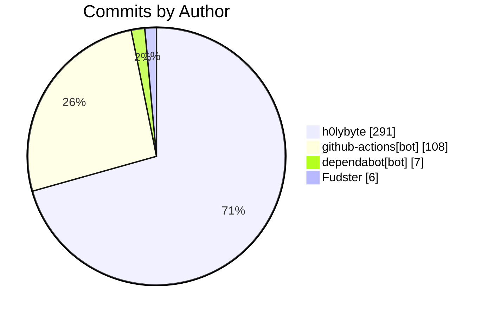

import BentoShell from '@/components/hero/BentoShell.astro';
import BentoProse from '@/components/hero/BentoProse.astro';

<section class="bento-hero bento-section not-content" aria-label="Activity pulse">
	

	

		

			

				
					<svg viewBox="0 0 24 24" width="14" height="14" fill="none" stroke="currentColor" stroke-width="1.75" stroke-linecap="round" stroke-linejoin="round" aria-hidden="true"><path d="M22 12h-4l-3 9L9 3l-3 9H2" /></svg>
					auto-generated · daily
				
				<h1 class="bento-title">
					Repository pulse
					commits, PRs, and issues.
				</h1>
				
<strong>412</strong> commits from <strong>4</strong> contributors — <strong>340</strong> PRs merged (7d).

				
Last generated <strong>2026-07-23T04:15:37Z</strong>.

				

					<a class="bento-btn bento-btn--primary" href="#leaderboard">
						View leaderboard
						<svg viewBox="0 0 24 24" fill="none" stroke="currentColor" aria-hidden="true"><path stroke-linecap="round" stroke-linejoin="round" stroke-width="2" d="M5 12h14M13 6l6 6-6 6" /></svg>
					</a>
					<a class="bento-btn bento-btn--ghost" href="#commits">Commits</a>
					<a class="bento-btn bento-btn--ghost" href="/dashboard/">Dashboard home</a>
				

			

				

					
						<svg viewBox="0 0 24 24" width="16" height="16" fill="none" stroke="currentColor" stroke-width="1.75" stroke-linecap="round" stroke-linejoin="round" aria-hidden="true"><path d="M6 3v12M18 9a3 3 0 1 0 0-6 3 3 0 0 0 0 6zM6 21a3 3 0 1 0 0-6 3 3 0 0 0 0 6zM15 6a9 9 0 0 1-9 9" /></svg>
					
					412
					Commits (7d)
				

				

					
						<svg viewBox="0 0 24 24" width="16" height="16" fill="none" stroke="currentColor" stroke-width="1.75" stroke-linecap="round" stroke-linejoin="round" aria-hidden="true"><path d="M16 21v-2a4 4 0 0 0-4-4H6a4 4 0 0 0-4 4v2M9 11a4 4 0 1 0 0-8 4 4 0 0 0 0 8zM22 21v-2a4 4 0 0 0-3-3.9" /></svg>
					
					4
					Contributors
				

				

					
						<svg viewBox="0 0 24 24" width="16" height="16" fill="none" stroke="currentColor" stroke-width="1.75" stroke-linecap="round" stroke-linejoin="round" aria-hidden="true"><path d="M18 9a3 3 0 1 0 0-6 3 3 0 0 0 0 6zM6 21a3 3 0 1 0 0-6 3 3 0 0 0 0 6zM6 15V9M18 6a9 9 0 0 1-9 9" /></svg>
					
					340
					PRs merged
				

				

					
						<svg viewBox="0 0 24 24" width="16" height="16" fill="none" stroke="currentColor" stroke-width="1.75" stroke-linecap="round" stroke-linejoin="round" aria-hidden="true"><path d="M12 2a10 10 0 1 0 0 20 10 10 0 0 0 0-20zM12 8v4m0 4h.01" /></svg>
					
					347
					Issues opened
				

				

					
						<svg viewBox="0 0 24 24" width="16" height="16" fill="none" stroke="currentColor" stroke-width="1.75" stroke-linecap="round" stroke-linejoin="round" aria-hidden="true"><path d="M22 11.1V12a10 10 0 1 1-5.9-9.1M22 4 12 14.01l-3-3" /></svg>
					
					343
					Issues closed
				

		

		<nav class="bento-jump" aria-label="On this page">
			<a class="bento-chip" href="#leaderboard">Leaderboard</a>
			<a class="bento-chip" href="#commits">Commits</a>
		</nav>
	

</section>

<BentoShell id="leaderboard" eyebrow="Contributors" heading="Top contributors">
	

		<a class="bento-cell bento-linkcard bento-card bento-card--glass bento-card--interactive" href="#commits">
			
				<svg viewBox="0 0 24 24" width="18" height="18" fill="none" stroke="currentColor" stroke-width="1.75" stroke-linecap="round" stroke-linejoin="round" aria-hidden="true"><path d="M16 21v-2a4 4 0 0 0-4-4H6a4 4 0 0 0-4 4v2M9 11a4 4 0 1 0 0-8 4 4 0 0 0 0 8z" /></svg>
			
			h0lybyte
			291 commits
			
				<svg viewBox="0 0 24 24" width="16" height="16" fill="none" stroke="currentColor" stroke-width="2" stroke-linecap="round" stroke-linejoin="round"><path d="M5 12h14M13 6l6 6-6 6" /></svg>
			
		</a>
		<a class="bento-cell bento-linkcard bento-card bento-card--glass bento-card--interactive" href="#commits">
			
				<svg viewBox="0 0 24 24" width="18" height="18" fill="none" stroke="currentColor" stroke-width="1.75" stroke-linecap="round" stroke-linejoin="round" aria-hidden="true"><path d="M16 21v-2a4 4 0 0 0-4-4H6a4 4 0 0 0-4 4v2M9 11a4 4 0 1 0 0-8 4 4 0 0 0 0 8z" /></svg>
			
			github-actions[bot]
			108 commits
			
				<svg viewBox="0 0 24 24" width="16" height="16" fill="none" stroke="currentColor" stroke-width="2" stroke-linecap="round" stroke-linejoin="round"><path d="M5 12h14M13 6l6 6-6 6" /></svg>
			
		</a>
		<a class="bento-cell bento-linkcard bento-card bento-card--glass bento-card--interactive" href="#commits">
			
				<svg viewBox="0 0 24 24" width="18" height="18" fill="none" stroke="currentColor" stroke-width="1.75" stroke-linecap="round" stroke-linejoin="round" aria-hidden="true"><path d="M16 21v-2a4 4 0 0 0-4-4H6a4 4 0 0 0-4 4v2M9 11a4 4 0 1 0 0-8 4 4 0 0 0 0 8z" /></svg>
			
			dependabot[bot]
			7 commits
			
				<svg viewBox="0 0 24 24" width="16" height="16" fill="none" stroke="currentColor" stroke-width="2" stroke-linecap="round" stroke-linejoin="round"><path d="M5 12h14M13 6l6 6-6 6" /></svg>
			
		</a>
		<a class="bento-cell bento-linkcard bento-card bento-card--glass bento-card--interactive" href="#commits">
			
				<svg viewBox="0 0 24 24" width="18" height="18" fill="none" stroke="currentColor" stroke-width="1.75" stroke-linecap="round" stroke-linejoin="round" aria-hidden="true"><path d="M16 21v-2a4 4 0 0 0-4-4H6a4 4 0 0 0-4 4v2M9 11a4 4 0 1 0 0-8 4 4 0 0 0 0 8z" /></svg>
			
			Fudster
			6 commits
			
				<svg viewBox="0 0 24 24" width="16" height="16" fill="none" stroke="currentColor" stroke-width="2" stroke-linecap="round" stroke-linejoin="round"><path d="M5 12h14M13 6l6 6-6 6" /></svg>
			
		</a>
	

</BentoShell>

<BentoProse id="commits" heading="Activity detail">

### Recent commits

| SHA | Author | Message |
|-----|--------|---------|
| [`59cb1b3`](https://github.com/KBVE/kbve/commit/59cb1b3ee9065aee031de2f45d8edaa3fc612ddf) | h0lybyte | Merge pull request #14531 from KBVE/dev |
| [`5f54fe0`](https://github.com/KBVE/kbve/commit/5f54fe0edd06d5498ea6d6beb5fe8c4000a14c8d) | github-actions[bot] | chore(agones-palworld): post-publish sync to v0.0.3 (#14532) |
| [`ab94a27`](https://github.com/KBVE/kbve/commit/ab94a27962a3fdeef9ffdb92d7e42f52a9de0768) | github-actions[bot] | chore(agones-palworld-relay): post-publish sync to v0.0.3 (#14530) |
| [`bee6a2b`](https://github.com/KBVE/kbve/commit/bee6a2bc4fd3e15521fb304240383fe3561a15a2) | h0lybyte | Merge pull request #14526 from KBVE/dev |
| [`7d26d0f`](https://github.com/KBVE/kbve/commit/7d26d0f83d3372ae578a8b05f3d87c7118a8d067) | github-actions[bot] | chore(ci): sync ci-dispatch-manifest [skip ci] (#14528) |
| [`60f73db`](https://github.com/KBVE/kbve/commit/60f73db99b545bed205c87f07b1abecab65fdfc4) | h0lybyte | feat(agones-palworld): in-game chat -&gt; IRC via native-Linux UE4SS (#1 |
| [`e7801a6`](https://github.com/KBVE/kbve/commit/e7801a69db32db1d6b4f88ed73f8d856732b5b76) | h0lybyte | fix(agones-palworld): bump gameserver RAM to 32Gi limit / 16Gi request ( |
| [`5117ae6`](https://github.com/KBVE/kbve/commit/5117ae6eb2bab45f301ad99774615d25050ef238) | Fudster | Merge pull request #14522 from KBVE/dev |
| [`5cbee06`](https://github.com/KBVE/kbve/commit/5cbee06360d1256bcccf5a45b206d3409d5443f6) | github-actions[bot] | chore(agones-palworld): post-publish sync to v0.0.2 (#14523) |
| [`5b2ee98`](https://github.com/KBVE/kbve/commit/5b2ee9881c4f500b5f035076f8ead973effea012) | h0lybyte | feat(reel): seal reel-api token once in ns reel, sync to kbve via ESO (# |
| [`935be41`](https://github.com/KBVE/kbve/commit/935be412ac7520be4dd3d472b6acb78d6dbea488) | github-actions[bot] | chore(agones-palworld-relay): post-publish sync to v0.0.2 (#14521) |
| [`5096b31`](https://github.com/KBVE/kbve/commit/5096b3134e40a86b4af0389dbf840153ce3d58ff) | h0lybyte | Merge pull request #14518 from KBVE/dev |

### Recently merged PRs

| # | Title | Author |
|---|-------|--------|
| [#14531](https://github.com/KBVE/kbve/pull/14531) | Release: 2 chores → Main | github-actions[bot] |
| [#14532](https://github.com/KBVE/kbve/pull/14532) | Atomic: agones-palworld v0.0.3 post-publish sync | github-actions[bot] |
| [#14530](https://github.com/KBVE/kbve/pull/14530) | Atomic: agones-palworld-relay v0.0.3 post-publish sync | github-actions[bot] |
| [#14526](https://github.com/KBVE/kbve/pull/14526) | Release: 1 feature, 1 fix → Main | github-actions[bot] |
| [#14528](https://github.com/KBVE/kbve/pull/14528) | chore(ci): sync ci-dispatch-manifest | github-actions[bot] |
| [#14527](https://github.com/KBVE/kbve/pull/14527) | feat(agones-palworld): in-game chat -&gt; IRC via native-Linux UE4SS | h0lybyte |
| [#14525](https://github.com/KBVE/kbve/pull/14525) | fix(agones-palworld): bump gameserver RAM to 32Gi | h0lybyte |
| [#14522](https://github.com/KBVE/kbve/pull/14522) | Release: 1 feature, 2 chores → Main | github-actions[bot] |
| [#14523](https://github.com/KBVE/kbve/pull/14523) | Atomic: agones-palworld v0.0.2 post-publish sync | github-actions[bot] |
| [#14520](https://github.com/KBVE/kbve/pull/14520) | feat(reel): seal reel-api token once + ESO to kbve (unblock reel pod) | h0lybyte |

</BentoProse>

<BentoProse id="about">

---

*Auto-generated by [ci-daily-content.yml](https://github.com/KBVE/kbve/actions/workflows/ci-daily-content.yml)*

</BentoProse>

