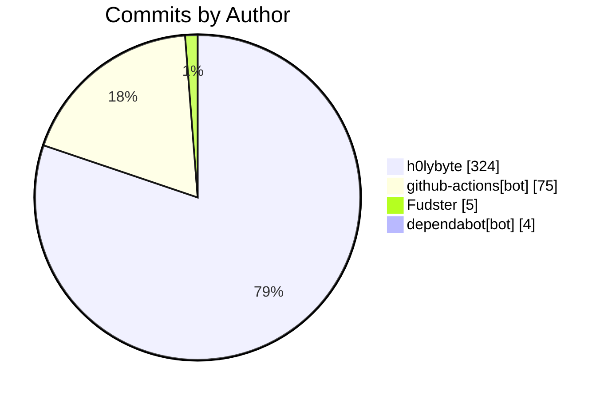

import BentoShell from '@/components/hero/BentoShell.astro';
import BentoProse from '@/components/hero/BentoProse.astro';

<section class="bento-hero bento-section not-content" aria-label="Activity pulse">
	

	

		

			

				
					<svg viewBox="0 0 24 24" width="14" height="14" fill="none" stroke="currentColor" stroke-width="1.75" stroke-linecap="round" stroke-linejoin="round" aria-hidden="true"><path d="M22 12h-4l-3 9L9 3l-3 9H2" /></svg>
					auto-generated · daily
				
				<h1 class="bento-title">
					Repository pulse
					commits, PRs, and issues.
				</h1>
				
<strong>408</strong> commits from <strong>4</strong> contributors — <strong>286</strong> PRs merged (7d).

				
Last generated <strong>2026-07-21T04:15:57Z</strong>.

				

					<a class="bento-btn bento-btn--primary" href="#leaderboard">
						View leaderboard
						<svg viewBox="0 0 24 24" fill="none" stroke="currentColor" aria-hidden="true"><path stroke-linecap="round" stroke-linejoin="round" stroke-width="2" d="M5 12h14M13 6l6 6-6 6" /></svg>
					</a>
					<a class="bento-btn bento-btn--ghost" href="#commits">Commits</a>
					<a class="bento-btn bento-btn--ghost" href="/dashboard/">Dashboard home</a>
				

			

				

					
						<svg viewBox="0 0 24 24" width="16" height="16" fill="none" stroke="currentColor" stroke-width="1.75" stroke-linecap="round" stroke-linejoin="round" aria-hidden="true"><path d="M6 3v12M18 9a3 3 0 1 0 0-6 3 3 0 0 0 0 6zM6 21a3 3 0 1 0 0-6 3 3 0 0 0 0 6zM15 6a9 9 0 0 1-9 9" /></svg>
					
					408
					Commits (7d)
				

				

					
						<svg viewBox="0 0 24 24" width="16" height="16" fill="none" stroke="currentColor" stroke-width="1.75" stroke-linecap="round" stroke-linejoin="round" aria-hidden="true"><path d="M16 21v-2a4 4 0 0 0-4-4H6a4 4 0 0 0-4 4v2M9 11a4 4 0 1 0 0-8 4 4 0 0 0 0 8zM22 21v-2a4 4 0 0 0-3-3.9" /></svg>
					
					4
					Contributors
				

				

					
						<svg viewBox="0 0 24 24" width="16" height="16" fill="none" stroke="currentColor" stroke-width="1.75" stroke-linecap="round" stroke-linejoin="round" aria-hidden="true"><path d="M18 9a3 3 0 1 0 0-6 3 3 0 0 0 0 6zM6 21a3 3 0 1 0 0-6 3 3 0 0 0 0 6zM6 15V9M18 6a9 9 0 0 1-9 9" /></svg>
					
					286
					PRs merged
				

				

					
						<svg viewBox="0 0 24 24" width="16" height="16" fill="none" stroke="currentColor" stroke-width="1.75" stroke-linecap="round" stroke-linejoin="round" aria-hidden="true"><path d="M12 2a10 10 0 1 0 0 20 10 10 0 0 0 0-20zM12 8v4m0 4h.01" /></svg>
					
					296
					Issues opened
				

				

					
						<svg viewBox="0 0 24 24" width="16" height="16" fill="none" stroke="currentColor" stroke-width="1.75" stroke-linecap="round" stroke-linejoin="round" aria-hidden="true"><path d="M22 11.1V12a10 10 0 1 1-5.9-9.1M22 4 12 14.01l-3-3" /></svg>
					
					288
					Issues closed
				

		

		<nav class="bento-jump" aria-label="On this page">
			<a class="bento-chip" href="#leaderboard">Leaderboard</a>
			<a class="bento-chip" href="#commits">Commits</a>
		</nav>
	

</section>

<BentoShell id="leaderboard" eyebrow="Contributors" heading="Top contributors">
	

		<a class="bento-cell bento-linkcard bento-card bento-card--glass bento-card--interactive" href="#commits">
			
				<svg viewBox="0 0 24 24" width="18" height="18" fill="none" stroke="currentColor" stroke-width="1.75" stroke-linecap="round" stroke-linejoin="round" aria-hidden="true"><path d="M16 21v-2a4 4 0 0 0-4-4H6a4 4 0 0 0-4 4v2M9 11a4 4 0 1 0 0-8 4 4 0 0 0 0 8z" /></svg>
			
			h0lybyte
			324 commits
			
				<svg viewBox="0 0 24 24" width="16" height="16" fill="none" stroke="currentColor" stroke-width="2" stroke-linecap="round" stroke-linejoin="round"><path d="M5 12h14M13 6l6 6-6 6" /></svg>
			
		</a>
		<a class="bento-cell bento-linkcard bento-card bento-card--glass bento-card--interactive" href="#commits">
			
				<svg viewBox="0 0 24 24" width="18" height="18" fill="none" stroke="currentColor" stroke-width="1.75" stroke-linecap="round" stroke-linejoin="round" aria-hidden="true"><path d="M16 21v-2a4 4 0 0 0-4-4H6a4 4 0 0 0-4 4v2M9 11a4 4 0 1 0 0-8 4 4 0 0 0 0 8z" /></svg>
			
			github-actions[bot]
			75 commits
			
				<svg viewBox="0 0 24 24" width="16" height="16" fill="none" stroke="currentColor" stroke-width="2" stroke-linecap="round" stroke-linejoin="round"><path d="M5 12h14M13 6l6 6-6 6" /></svg>
			
		</a>
		<a class="bento-cell bento-linkcard bento-card bento-card--glass bento-card--interactive" href="#commits">
			
				<svg viewBox="0 0 24 24" width="18" height="18" fill="none" stroke="currentColor" stroke-width="1.75" stroke-linecap="round" stroke-linejoin="round" aria-hidden="true"><path d="M16 21v-2a4 4 0 0 0-4-4H6a4 4 0 0 0-4 4v2M9 11a4 4 0 1 0 0-8 4 4 0 0 0 0 8z" /></svg>
			
			Fudster
			5 commits
			
				<svg viewBox="0 0 24 24" width="16" height="16" fill="none" stroke="currentColor" stroke-width="2" stroke-linecap="round" stroke-linejoin="round"><path d="M5 12h14M13 6l6 6-6 6" /></svg>
			
		</a>
		<a class="bento-cell bento-linkcard bento-card bento-card--glass bento-card--interactive" href="#commits">
			
				<svg viewBox="0 0 24 24" width="18" height="18" fill="none" stroke="currentColor" stroke-width="1.75" stroke-linecap="round" stroke-linejoin="round" aria-hidden="true"><path d="M16 21v-2a4 4 0 0 0-4-4H6a4 4 0 0 0-4 4v2M9 11a4 4 0 1 0 0-8 4 4 0 0 0 0 8z" /></svg>
			
			dependabot[bot]
			4 commits
			
				<svg viewBox="0 0 24 24" width="16" height="16" fill="none" stroke="currentColor" stroke-width="2" stroke-linecap="round" stroke-linejoin="round"><path d="M5 12h14M13 6l6 6-6 6" /></svg>
			
		</a>
	

</BentoShell>

<BentoProse id="commits" heading="Activity detail">

### Recent commits

| SHA | Author | Message |
|-----|--------|---------|
| [`eeb70fc`](https://github.com/KBVE/kbve/commit/eeb70fc2288101e600ed19a945df4e5987860035) | h0lybyte | Merge pull request #14437 from KBVE/dev |
| [`51fe7c1`](https://github.com/KBVE/kbve/commit/51fe7c1d4b5bffbaf93cb5fd0e3969670104699a) | github-actions[bot] | chore(axum-kbve): post-publish sync to v1.0.247 (#14436) |
| [`430667b`](https://github.com/KBVE/kbve/commit/430667b64d98e73359dfe10d01ee00e63c19f405) | github-actions[bot] | chore(python-kbve): update version.toml to 1.0.14 [skip ci] (#14435) |
| [`9fd06e9`](https://github.com/KBVE/kbve/commit/9fd06e97e55c5b62ec0e0216f4bb34699f27a560) | h0lybyte | Merge pull request #14426 from KBVE/dev |
| [`5cc1d8d`](https://github.com/KBVE/kbve/commit/5cc1d8d696c12029d16318c1e1155845bf36d83d) | h0lybyte | fix(herbmail-game): mask OPEN bit in mirror-gate door assertions (#14433 |
| [`f4e1b2f`](https://github.com/KBVE/kbve/commit/f4e1b2fa9a516b0e974aa60f70e2653b9d6412c1) | github-actions[bot] | chore(ci): sync ci-dispatch-manifest [skip ci] (#14432) |
| [`32bedbe`](https://github.com/KBVE/kbve/commit/32bedbe836484cb1f06b754c0b116dc4cd81d6bb) | h0lybyte | chore(python-kbve): bump 1.0.13 → 1.0.14 to republish with starlette rou |
| [`5e9a1d2`](https://github.com/KBVE/kbve/commit/5e9a1d2a37b9bbc67a4acacfb352022f45021941) | github-actions[bot] | chore(laser): update version.toml to 0.1.6 [skip ci] (#14428) |
| [`368c244`](https://github.com/KBVE/kbve/commit/368c24494183e76bdb347aafe95a43fb7daa9b32) | h0lybyte | fix(kbve): updating the mcp to v0.31.3 |
| [`c701015`](https://github.com/KBVE/kbve/commit/c701015be556519a21dbc151a894f90ab8dd5914) | github-actions[bot] | chore(ci): sync ci-dispatch-manifest [skip ci] (#14427) |
| [`3dc0769`](https://github.com/KBVE/kbve/commit/3dc0769fa5eda4ebad556bf2761bc30febd86885) | h0lybyte | chore(kbve): preparing the release of v1.0.247 |
| [`59af2e6`](https://github.com/KBVE/kbve/commit/59af2e6d352327149c19afdde73b15fa534ca9e9) | h0lybyte | Merge pull request #14422 from KBVE/dev |

### Recently merged PRs

| # | Title | Author |
|---|-------|--------|
| [#14437](https://github.com/KBVE/kbve/pull/14437) | Release: 2 chores → Main | github-actions[bot] |
| [#14436](https://github.com/KBVE/kbve/pull/14436) | Atomic: axum-kbve v1.0.247 post-publish sync | github-actions[bot] |
| [#14435](https://github.com/KBVE/kbve/pull/14435) | chore(python-kbve): update version.toml to 1.0.14 | github-actions[bot] |
| [#14426](https://github.com/KBVE/kbve/pull/14426) | Release: 2 fixes, 5 chores → Main | github-actions[bot] |
| [#14433](https://github.com/KBVE/kbve/pull/14433) | fix(herbmail-game): mask OPEN bit in mirror-gate door assertions | h0lybyte |
| [#14432](https://github.com/KBVE/kbve/pull/14432) | chore(ci): sync ci-dispatch-manifest | github-actions[bot] |
| [#14431](https://github.com/KBVE/kbve/pull/14431) | chore(python-kbve): bump 1.0.13 → 1.0.14 (republish w/ starlette route f | h0lybyte |
| [#14428](https://github.com/KBVE/kbve/pull/14428) | chore(laser): update version.toml to 0.1.6 | github-actions[bot] |
| [#14427](https://github.com/KBVE/kbve/pull/14427) | chore(ci): sync ci-dispatch-manifest | github-actions[bot] |
| [#14422](https://github.com/KBVE/kbve/pull/14422) | Release: 1 feature, 2 fixes, 1 doc, 5 chores → Main | github-actions[bot] |

</BentoProse>

<BentoProse id="about">

---

*Auto-generated by [ci-daily-content.yml](https://github.com/KBVE/kbve/actions/workflows/ci-daily-content.yml)*

</BentoProse>

