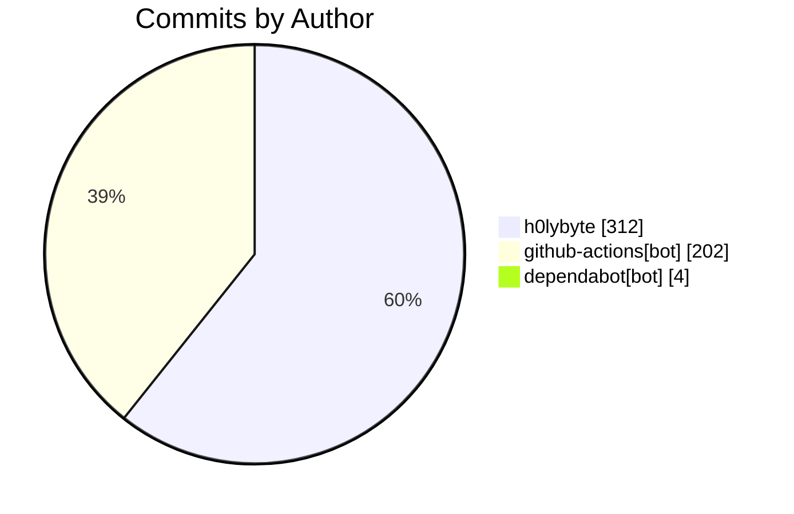

import BentoShell from '@/components/hero/BentoShell.astro';
import BentoProse from '@/components/hero/BentoProse.astro';

<section class="bento-hero bento-section not-content" aria-label="Activity pulse">
	

	

		

			

				
					<svg viewBox="0 0 24 24" width="14" height="14" fill="none" stroke="currentColor" stroke-width="1.75" stroke-linecap="round" stroke-linejoin="round" aria-hidden="true"><path d="M22 12h-4l-3 9L9 3l-3 9H2" /></svg>
					auto-generated · daily
				
				<h1 class="bento-title">
					Repository pulse
					commits, PRs, and issues.
				</h1>
				
<strong>518</strong> commits from <strong>3</strong> contributors — <strong>472</strong> PRs merged (7d).

				
Last generated <strong>2026-08-04T04:13:50Z</strong>.

				

					<a class="bento-btn bento-btn--primary" href="#leaderboard">
						View leaderboard
						<svg viewBox="0 0 24 24" fill="none" stroke="currentColor" aria-hidden="true"><path stroke-linecap="round" stroke-linejoin="round" stroke-width="2" d="M5 12h14M13 6l6 6-6 6" /></svg>
					</a>
					<a class="bento-btn bento-btn--ghost" href="#commits">Commits</a>
					<a class="bento-btn bento-btn--ghost" href="/dashboard/">Dashboard home</a>
				

			

				

					
						<svg viewBox="0 0 24 24" width="16" height="16" fill="none" stroke="currentColor" stroke-width="1.75" stroke-linecap="round" stroke-linejoin="round" aria-hidden="true"><path d="M6 3v12M18 9a3 3 0 1 0 0-6 3 3 0 0 0 0 6zM6 21a3 3 0 1 0 0-6 3 3 0 0 0 0 6zM15 6a9 9 0 0 1-9 9" /></svg>
					
					518
					Commits (7d)
				

				

					
						<svg viewBox="0 0 24 24" width="16" height="16" fill="none" stroke="currentColor" stroke-width="1.75" stroke-linecap="round" stroke-linejoin="round" aria-hidden="true"><path d="M16 21v-2a4 4 0 0 0-4-4H6a4 4 0 0 0-4 4v2M9 11a4 4 0 1 0 0-8 4 4 0 0 0 0 8zM22 21v-2a4 4 0 0 0-3-3.9" /></svg>
					
					3
					Contributors
				

				

					
						<svg viewBox="0 0 24 24" width="16" height="16" fill="none" stroke="currentColor" stroke-width="1.75" stroke-linecap="round" stroke-linejoin="round" aria-hidden="true"><path d="M18 9a3 3 0 1 0 0-6 3 3 0 0 0 0 6zM6 21a3 3 0 1 0 0-6 3 3 0 0 0 0 6zM6 15V9M18 6a9 9 0 0 1-9 9" /></svg>
					
					472
					PRs merged
				

				

					
						<svg viewBox="0 0 24 24" width="16" height="16" fill="none" stroke="currentColor" stroke-width="1.75" stroke-linecap="round" stroke-linejoin="round" aria-hidden="true"><path d="M12 2a10 10 0 1 0 0 20 10 10 0 0 0 0-20zM12 8v4m0 4h.01" /></svg>
					
					475
					Issues opened
				

				

					
						<svg viewBox="0 0 24 24" width="16" height="16" fill="none" stroke="currentColor" stroke-width="1.75" stroke-linecap="round" stroke-linejoin="round" aria-hidden="true"><path d="M22 11.1V12a10 10 0 1 1-5.9-9.1M22 4 12 14.01l-3-3" /></svg>
					
					480
					Issues closed
				

		

		<nav class="bento-jump" aria-label="On this page">
			<a class="bento-chip" href="#leaderboard">Leaderboard</a>
			<a class="bento-chip" href="#commits">Commits</a>
		</nav>
	

</section>

<BentoShell id="leaderboard" eyebrow="Contributors" heading="Top contributors">
	

		<a class="bento-cell bento-linkcard bento-card bento-card--glass bento-card--interactive" href="#commits">
			
				<svg viewBox="0 0 24 24" width="18" height="18" fill="none" stroke="currentColor" stroke-width="1.75" stroke-linecap="round" stroke-linejoin="round" aria-hidden="true"><path d="M16 21v-2a4 4 0 0 0-4-4H6a4 4 0 0 0-4 4v2M9 11a4 4 0 1 0 0-8 4 4 0 0 0 0 8z" /></svg>
			
			h0lybyte
			312 commits
			
				<svg viewBox="0 0 24 24" width="16" height="16" fill="none" stroke="currentColor" stroke-width="2" stroke-linecap="round" stroke-linejoin="round"><path d="M5 12h14M13 6l6 6-6 6" /></svg>
			
		</a>
		<a class="bento-cell bento-linkcard bento-card bento-card--glass bento-card--interactive" href="#commits">
			
				<svg viewBox="0 0 24 24" width="18" height="18" fill="none" stroke="currentColor" stroke-width="1.75" stroke-linecap="round" stroke-linejoin="round" aria-hidden="true"><path d="M16 21v-2a4 4 0 0 0-4-4H6a4 4 0 0 0-4 4v2M9 11a4 4 0 1 0 0-8 4 4 0 0 0 0 8z" /></svg>
			
			github-actions[bot]
			202 commits
			
				<svg viewBox="0 0 24 24" width="16" height="16" fill="none" stroke="currentColor" stroke-width="2" stroke-linecap="round" stroke-linejoin="round"><path d="M5 12h14M13 6l6 6-6 6" /></svg>
			
		</a>
		<a class="bento-cell bento-linkcard bento-card bento-card--glass bento-card--interactive" href="#commits">
			
				<svg viewBox="0 0 24 24" width="18" height="18" fill="none" stroke="currentColor" stroke-width="1.75" stroke-linecap="round" stroke-linejoin="round" aria-hidden="true"><path d="M16 21v-2a4 4 0 0 0-4-4H6a4 4 0 0 0-4 4v2M9 11a4 4 0 1 0 0-8 4 4 0 0 0 0 8z" /></svg>
			
			dependabot[bot]
			4 commits
			
				<svg viewBox="0 0 24 24" width="16" height="16" fill="none" stroke="currentColor" stroke-width="2" stroke-linecap="round" stroke-linejoin="round"><path d="M5 12h14M13 6l6 6-6 6" /></svg>
			
		</a>
	

</BentoShell>

<BentoProse id="commits" heading="Activity detail">

```mermaid
pie showData
    title Commits by Author
    "h0lybyte" : 312
    "github-actions[bot]" : 202
    "dependabot[bot]" : 4
```

### Recent commits

| SHA | Author | Message |
|-----|--------|---------|
| [`14f271d`](https://github.com/KBVE/kbve/commit/14f271d1fe5d27ce033dc3d49e94a0250a576094) | h0lybyte | Merge pull request #15265 from KBVE/dev |
| [`8c5e466`](https://github.com/KBVE/kbve/commit/8c5e466c3aaea56cf9a93687e031495752342eeb) | h0lybyte | fix(astro-kbve): restyle the section rail onto bento and rebuild the arc |
| [`41c9c8a`](https://github.com/KBVE/kbve/commit/41c9c8aa4096696e54d0738649e62671ce181c2c) | h0lybyte | perf(herbmail-game): measure GPU frame time, and record what it rules ou |
| [`217516c`](https://github.com/KBVE/kbve/commit/217516c26e94be775967ac88d1bd34c3d8ace6da) | github-actions[bot] | chore(ci): sync ci-dispatch-manifest [skip ci] (#15273) |
| [`e2278bb`](https://github.com/KBVE/kbve/commit/e2278bb53641591fc70c7e893ab3f5ca9f510f9e) | h0lybyte | chore(kbve): preparing the release of v1.0.270 |
| [`cbea2fc`](https://github.com/KBVE/kbve/commit/cbea2fc95c345413207ee59e9232417415a40eea) | h0lybyte | docs(journal): updaitng the daily entry. |
| [`75af632`](https://github.com/KBVE/kbve/commit/75af632cd3cff2b09654134664c4de41436a9509) | h0lybyte | chore(rust): finish reqwest 0.13 migration (#14066) (#15269) |
| [`0c32c73`](https://github.com/KBVE/kbve/commit/0c32c73535770ed05fdb3db75dd7a54f162d201c) | h0lybyte | feat(axum): assert professiondb gather skill_refs resolve in SkillRegist |
| [`85df198`](https://github.com/KBVE/kbve/commit/85df198eee35f10aa7dc63c39a645f571fbb417d) | h0lybyte | release(arpg): cut 0.1.29 for web and server (#15267) |
| [`c3d42bc`](https://github.com/KBVE/kbve/commit/c3d42bcc4de2abf3fc89398172858039b3cbae30) | h0lybyte | feat(astro-kbve): palworld map guild base markers from /live/bases (#152 |
| [`d9ec5be`](https://github.com/KBVE/kbve/commit/d9ec5befc7619a75251bfdffa2b106315a2fed9e) | h0lybyte | feat(embeddb): add dependency-free vector storage and cosine search tier |
| [`afc95a8`](https://github.com/KBVE/kbve/commit/afc95a8cca9a9bcc9062fbb574c181d8d38d7f0f) | h0lybyte | Merge pull request #15262 from KBVE/dev |

### Recently merged PRs

| # | Title | Author |
|---|-------|--------|
| [#15283](https://github.com/KBVE/kbve/pull/15283) | perf(herbmail-game): bake the open-sky 3x3 max into the tile grid | h0lybyte |
| [#15280](https://github.com/KBVE/kbve/pull/15280) | perf(herbmail-game): walk the scene graph once per frame, not once per p | h0lybyte |
| [#15279](https://github.com/KBVE/kbve/pull/15279) | Atomic: axum-kbve v1.0.270 post-publish sync | github-actions[bot] |
| [#15277](https://github.com/KBVE/kbve/pull/15277) | Atomic: arpg-server v0.1.29 post-publish sync | github-actions[bot] |
| [#15265](https://github.com/KBVE/kbve/pull/15265) | Release: 3 features, 1 fix, 1 doc, 1 perf, 3 chores → Main | github-actions[bot] |
| [#15274](https://github.com/KBVE/kbve/pull/15274) | fix(astro-kbve): restyle the section rail onto bento and rebuild the arc | h0lybyte |
| [#15273](https://github.com/KBVE/kbve/pull/15273) | chore(ci): sync ci-dispatch-manifest | github-actions[bot] |
| [#15269](https://github.com/KBVE/kbve/pull/15269) | chore(rust): finish reqwest 0.13 migration (#14066) | h0lybyte |
| [#15268](https://github.com/KBVE/kbve/pull/15268) | feat(axum): assert professiondb gather skill_refs resolve in SkillRegist | h0lybyte |
| [#15267](https://github.com/KBVE/kbve/pull/15267) | release(arpg): cut 0.1.29 for web and server | h0lybyte |

</BentoProse>

<BentoProse id="about">

---

*Auto-generated by [ci-daily-content.yml](https://github.com/KBVE/kbve/actions/workflows/ci-daily-content.yml)*

</BentoProse>

