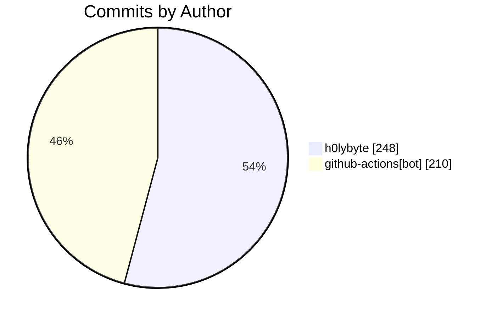

import BentoShell from '@/components/hero/BentoShell.astro';
import BentoProse from '@/components/hero/BentoProse.astro';

<section class="bento-hero bento-section not-content" aria-label="Activity pulse">
	

	

		

			

				
					<svg viewBox="0 0 24 24" width="14" height="14" fill="none" stroke="currentColor" stroke-width="1.75" stroke-linecap="round" stroke-linejoin="round" aria-hidden="true"><path d="M22 12h-4l-3 9L9 3l-3 9H2" /></svg>
					auto-generated · daily
				
				<h1 class="bento-title">
					Repository pulse
					commits, PRs, and issues.
				</h1>
				
<strong>458</strong> commits from <strong>2</strong> contributors — <strong>438</strong> PRs merged (7d).

				
Last generated <strong>2026-08-02T04:23:27Z</strong>.

				

					<a class="bento-btn bento-btn--primary" href="#leaderboard">
						View leaderboard
						<svg viewBox="0 0 24 24" fill="none" stroke="currentColor" aria-hidden="true"><path stroke-linecap="round" stroke-linejoin="round" stroke-width="2" d="M5 12h14M13 6l6 6-6 6" /></svg>
					</a>
					<a class="bento-btn bento-btn--ghost" href="#commits">Commits</a>
					<a class="bento-btn bento-btn--ghost" href="/dashboard/">Dashboard home</a>
				

			

				

					
						<svg viewBox="0 0 24 24" width="16" height="16" fill="none" stroke="currentColor" stroke-width="1.75" stroke-linecap="round" stroke-linejoin="round" aria-hidden="true"><path d="M6 3v12M18 9a3 3 0 1 0 0-6 3 3 0 0 0 0 6zM6 21a3 3 0 1 0 0-6 3 3 0 0 0 0 6zM15 6a9 9 0 0 1-9 9" /></svg>
					
					458
					Commits (7d)
				

				

					
						<svg viewBox="0 0 24 24" width="16" height="16" fill="none" stroke="currentColor" stroke-width="1.75" stroke-linecap="round" stroke-linejoin="round" aria-hidden="true"><path d="M16 21v-2a4 4 0 0 0-4-4H6a4 4 0 0 0-4 4v2M9 11a4 4 0 1 0 0-8 4 4 0 0 0 0 8zM22 21v-2a4 4 0 0 0-3-3.9" /></svg>
					
					2
					Contributors
				

				

					
						<svg viewBox="0 0 24 24" width="16" height="16" fill="none" stroke="currentColor" stroke-width="1.75" stroke-linecap="round" stroke-linejoin="round" aria-hidden="true"><path d="M18 9a3 3 0 1 0 0-6 3 3 0 0 0 0 6zM6 21a3 3 0 1 0 0-6 3 3 0 0 0 0 6zM6 15V9M18 6a9 9 0 0 1-9 9" /></svg>
					
					438
					PRs merged
				

				

					
						<svg viewBox="0 0 24 24" width="16" height="16" fill="none" stroke="currentColor" stroke-width="1.75" stroke-linecap="round" stroke-linejoin="round" aria-hidden="true"><path d="M12 2a10 10 0 1 0 0 20 10 10 0 0 0 0-20zM12 8v4m0 4h.01" /></svg>
					
					448
					Issues opened
				

				

					
						<svg viewBox="0 0 24 24" width="16" height="16" fill="none" stroke="currentColor" stroke-width="1.75" stroke-linecap="round" stroke-linejoin="round" aria-hidden="true"><path d="M22 11.1V12a10 10 0 1 1-5.9-9.1M22 4 12 14.01l-3-3" /></svg>
					
					442
					Issues closed
				

		

		<nav class="bento-jump" aria-label="On this page">
			<a class="bento-chip" href="#leaderboard">Leaderboard</a>
			<a class="bento-chip" href="#commits">Commits</a>
		</nav>
	

</section>

<BentoShell id="leaderboard" eyebrow="Contributors" heading="Top contributors">
	

		<a class="bento-cell bento-linkcard bento-card bento-card--glass bento-card--interactive" href="#commits">
			
				<svg viewBox="0 0 24 24" width="18" height="18" fill="none" stroke="currentColor" stroke-width="1.75" stroke-linecap="round" stroke-linejoin="round" aria-hidden="true"><path d="M16 21v-2a4 4 0 0 0-4-4H6a4 4 0 0 0-4 4v2M9 11a4 4 0 1 0 0-8 4 4 0 0 0 0 8z" /></svg>
			
			h0lybyte
			248 commits
			
				<svg viewBox="0 0 24 24" width="16" height="16" fill="none" stroke="currentColor" stroke-width="2" stroke-linecap="round" stroke-linejoin="round"><path d="M5 12h14M13 6l6 6-6 6" /></svg>
			
		</a>
		<a class="bento-cell bento-linkcard bento-card bento-card--glass bento-card--interactive" href="#commits">
			
				<svg viewBox="0 0 24 24" width="18" height="18" fill="none" stroke="currentColor" stroke-width="1.75" stroke-linecap="round" stroke-linejoin="round" aria-hidden="true"><path d="M16 21v-2a4 4 0 0 0-4-4H6a4 4 0 0 0-4 4v2M9 11a4 4 0 1 0 0-8 4 4 0 0 0 0 8z" /></svg>
			
			github-actions[bot]
			210 commits
			
				<svg viewBox="0 0 24 24" width="16" height="16" fill="none" stroke="currentColor" stroke-width="2" stroke-linecap="round" stroke-linejoin="round"><path d="M5 12h14M13 6l6 6-6 6" /></svg>
			
		</a>
	

</BentoShell>

<BentoProse id="commits" heading="Activity detail">

```mermaid
pie showData
    title Commits by Author
    "h0lybyte" : 248
    "github-actions[bot]" : 210
```

### Recent commits

| SHA | Author | Message |
|-----|--------|---------|
| [`477e623`](https://github.com/KBVE/kbve/commit/477e623bd6c0994d6faaacdd781c9e3a384887b1) | h0lybyte | Merge pull request #15117 from KBVE/dev |
| [`6a64b23`](https://github.com/KBVE/kbve/commit/6a64b23453a1d1a599472c7a289d044a9edbbd32) | github-actions[bot] | chore(ci): sync ci-dispatch-manifest [skip ci] (#15122) |
| [`2e478c9`](https://github.com/KBVE/kbve/commit/2e478c9e9f0c37be025e2e2e4d9053df8424b8ac) | h0lybyte | chore(kbve): preparing the release of the v1.0.265 |
| [`a5b19bf`](https://github.com/KBVE/kbve/commit/a5b19bf8332fcac8f338bd2435ec9198bb60316d) | h0lybyte | chore(herbmail): preparing the next release of the game. |
| [`701cd7f`](https://github.com/KBVE/kbve/commit/701cd7fff338f581531170858e3941bfce6bfa18) | github-actions[bot] | chore(ci): sync ci-dispatch-manifest [skip ci] (#15121) |
| [`3e5a610`](https://github.com/KBVE/kbve/commit/3e5a610c6dbc5d13f24d74359c70abd06a972430) | h0lybyte | feat(reel): expose peer-drop diagnostics (port rotations, VPN fail strea |
| [`71706fe`](https://github.com/KBVE/kbve/commit/71706fe24a4bbac37494b2f47e9423182b609a82) | github-actions[bot] | chore(ci): sync ci-dispatch-manifest [skip ci] (#15119) |
| [`4e4e2f7`](https://github.com/KBVE/kbve/commit/4e4e2f7ba7d12af74dd6ed9344772a70ed0d863a) | h0lybyte | feat(palworld): shared live poller via @kbve/droid events, lazy map repa |
| [`603da88`](https://github.com/KBVE/kbve/commit/603da88b45f2a2642dd8beb9f368126a9ffe983f) | h0lybyte | fix(arpg-web): build container from the root pnpm install (#15116) |
| [`be418c0`](https://github.com/KBVE/kbve/commit/be418c0cf502ec46d15bce6d7e7c4036aed78dc0) | h0lybyte | perf(astro-kbve): sprite cache for palworld map redraw, in-game oil rig  |
| [`34289b9`](https://github.com/KBVE/kbve/commit/34289b9d47faef33f6efa2447d5314ef88975a97) | h0lybyte | Merge pull request #15114 from KBVE/dev |
| [`178522e`](https://github.com/KBVE/kbve/commit/178522e7c38bd9b78e2c951133b7e06124e8eb8c) | github-actions[bot] | chore(axum-kbve): post-publish sync to v1.0.264 (#15113) |

### Recently merged PRs

| # | Title | Author |
|---|-------|--------|
| [#15127](https://github.com/KBVE/kbve/pull/15127) | chore(droid): update version.toml to 0.1.2 | github-actions[bot] |
| [#15128](https://github.com/KBVE/kbve/pull/15128) | Atomic: reel v0.1.35 post-publish sync | github-actions[bot] |
| [#15125](https://github.com/KBVE/kbve/pull/15125) | Atomic: herbmail-game v0.1.13 post-publish sync | github-actions[bot] |
| [#15124](https://github.com/KBVE/kbve/pull/15124) | feat(reel): live stream-activity diagnostics feed on the player page | h0lybyte |
| [#15123](https://github.com/KBVE/kbve/pull/15123) | chore(ci): sync ci-dispatch-manifest | github-actions[bot] |
| [#15117](https://github.com/KBVE/kbve/pull/15117) | Release: 2 features, 1 fix, 1 perf, 4 chores → Main | github-actions[bot] |
| [#15122](https://github.com/KBVE/kbve/pull/15122) | chore(ci): sync ci-dispatch-manifest | github-actions[bot] |
| [#15121](https://github.com/KBVE/kbve/pull/15121) | chore(ci): sync ci-dispatch-manifest | github-actions[bot] |
| [#15120](https://github.com/KBVE/kbve/pull/15120) | feat(reel): surface peer-drop diagnostics to the user (port rotations, V | h0lybyte |
| [#15119](https://github.com/KBVE/kbve/pull/15119) | chore(ci): sync ci-dispatch-manifest | github-actions[bot] |

</BentoProse>

<BentoProse id="about">

---

*Auto-generated by [ci-daily-content.yml](https://github.com/KBVE/kbve/actions/workflows/ci-daily-content.yml)*

</BentoProse>

