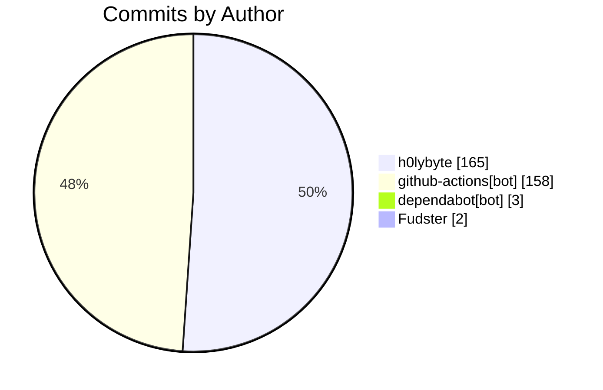

import BentoShell from '@/components/hero/BentoShell.astro';
import BentoProse from '@/components/hero/BentoProse.astro';

<section class="bento-hero bento-section not-content" aria-label="Activity pulse">
	

	

		

			

				
					<svg viewBox="0 0 24 24" width="14" height="14" fill="none" stroke="currentColor" stroke-width="1.75" stroke-linecap="round" stroke-linejoin="round" aria-hidden="true"><path d="M22 12h-4l-3 9L9 3l-3 9H2" /></svg>
					auto-generated · daily
				
				<h1 class="bento-title">
					Repository pulse
					commits, PRs, and issues.
				</h1>
				
<strong>328</strong> commits from <strong>4</strong> contributors — <strong>311</strong> PRs merged (7d).

				
Last generated <strong>2026-07-28T04:09:12Z</strong>.

				

					<a class="bento-btn bento-btn--primary" href="#leaderboard">
						View leaderboard
						<svg viewBox="0 0 24 24" fill="none" stroke="currentColor" aria-hidden="true"><path stroke-linecap="round" stroke-linejoin="round" stroke-width="2" d="M5 12h14M13 6l6 6-6 6" /></svg>
					</a>
					<a class="bento-btn bento-btn--ghost" href="#commits">Commits</a>
					<a class="bento-btn bento-btn--ghost" href="/dashboard/">Dashboard home</a>
				

			

				

					
						<svg viewBox="0 0 24 24" width="16" height="16" fill="none" stroke="currentColor" stroke-width="1.75" stroke-linecap="round" stroke-linejoin="round" aria-hidden="true"><path d="M6 3v12M18 9a3 3 0 1 0 0-6 3 3 0 0 0 0 6zM6 21a3 3 0 1 0 0-6 3 3 0 0 0 0 6zM15 6a9 9 0 0 1-9 9" /></svg>
					
					328
					Commits (7d)
				

				

					
						<svg viewBox="0 0 24 24" width="16" height="16" fill="none" stroke="currentColor" stroke-width="1.75" stroke-linecap="round" stroke-linejoin="round" aria-hidden="true"><path d="M16 21v-2a4 4 0 0 0-4-4H6a4 4 0 0 0-4 4v2M9 11a4 4 0 1 0 0-8 4 4 0 0 0 0 8zM22 21v-2a4 4 0 0 0-3-3.9" /></svg>
					
					4
					Contributors
				

				

					
						<svg viewBox="0 0 24 24" width="16" height="16" fill="none" stroke="currentColor" stroke-width="1.75" stroke-linecap="round" stroke-linejoin="round" aria-hidden="true"><path d="M18 9a3 3 0 1 0 0-6 3 3 0 0 0 0 6zM6 21a3 3 0 1 0 0-6 3 3 0 0 0 0 6zM6 15V9M18 6a9 9 0 0 1-9 9" /></svg>
					
					311
					PRs merged
				

				

					
						<svg viewBox="0 0 24 24" width="16" height="16" fill="none" stroke="currentColor" stroke-width="1.75" stroke-linecap="round" stroke-linejoin="round" aria-hidden="true"><path d="M12 2a10 10 0 1 0 0 20 10 10 0 0 0 0-20zM12 8v4m0 4h.01" /></svg>
					
					319
					Issues opened
				

				

					
						<svg viewBox="0 0 24 24" width="16" height="16" fill="none" stroke="currentColor" stroke-width="1.75" stroke-linecap="round" stroke-linejoin="round" aria-hidden="true"><path d="M22 11.1V12a10 10 0 1 1-5.9-9.1M22 4 12 14.01l-3-3" /></svg>
					
					315
					Issues closed
				

		

		<nav class="bento-jump" aria-label="On this page">
			<a class="bento-chip" href="#leaderboard">Leaderboard</a>
			<a class="bento-chip" href="#commits">Commits</a>
		</nav>
	

</section>

<BentoShell id="leaderboard" eyebrow="Contributors" heading="Top contributors">
	

		<a class="bento-cell bento-linkcard bento-card bento-card--glass bento-card--interactive" href="#commits">
			
				<svg viewBox="0 0 24 24" width="18" height="18" fill="none" stroke="currentColor" stroke-width="1.75" stroke-linecap="round" stroke-linejoin="round" aria-hidden="true"><path d="M16 21v-2a4 4 0 0 0-4-4H6a4 4 0 0 0-4 4v2M9 11a4 4 0 1 0 0-8 4 4 0 0 0 0 8z" /></svg>
			
			h0lybyte
			165 commits
			
				<svg viewBox="0 0 24 24" width="16" height="16" fill="none" stroke="currentColor" stroke-width="2" stroke-linecap="round" stroke-linejoin="round"><path d="M5 12h14M13 6l6 6-6 6" /></svg>
			
		</a>
		<a class="bento-cell bento-linkcard bento-card bento-card--glass bento-card--interactive" href="#commits">
			
				<svg viewBox="0 0 24 24" width="18" height="18" fill="none" stroke="currentColor" stroke-width="1.75" stroke-linecap="round" stroke-linejoin="round" aria-hidden="true"><path d="M16 21v-2a4 4 0 0 0-4-4H6a4 4 0 0 0-4 4v2M9 11a4 4 0 1 0 0-8 4 4 0 0 0 0 8z" /></svg>
			
			github-actions[bot]
			158 commits
			
				<svg viewBox="0 0 24 24" width="16" height="16" fill="none" stroke="currentColor" stroke-width="2" stroke-linecap="round" stroke-linejoin="round"><path d="M5 12h14M13 6l6 6-6 6" /></svg>
			
		</a>
		<a class="bento-cell bento-linkcard bento-card bento-card--glass bento-card--interactive" href="#commits">
			
				<svg viewBox="0 0 24 24" width="18" height="18" fill="none" stroke="currentColor" stroke-width="1.75" stroke-linecap="round" stroke-linejoin="round" aria-hidden="true"><path d="M16 21v-2a4 4 0 0 0-4-4H6a4 4 0 0 0-4 4v2M9 11a4 4 0 1 0 0-8 4 4 0 0 0 0 8z" /></svg>
			
			dependabot[bot]
			3 commits
			
				<svg viewBox="0 0 24 24" width="16" height="16" fill="none" stroke="currentColor" stroke-width="2" stroke-linecap="round" stroke-linejoin="round"><path d="M5 12h14M13 6l6 6-6 6" /></svg>
			
		</a>
		<a class="bento-cell bento-linkcard bento-card bento-card--glass bento-card--interactive" href="#commits">
			
				<svg viewBox="0 0 24 24" width="18" height="18" fill="none" stroke="currentColor" stroke-width="1.75" stroke-linecap="round" stroke-linejoin="round" aria-hidden="true"><path d="M16 21v-2a4 4 0 0 0-4-4H6a4 4 0 0 0-4 4v2M9 11a4 4 0 1 0 0-8 4 4 0 0 0 0 8z" /></svg>
			
			Fudster
			2 commits
			
				<svg viewBox="0 0 24 24" width="16" height="16" fill="none" stroke="currentColor" stroke-width="2" stroke-linecap="round" stroke-linejoin="round"><path d="M5 12h14M13 6l6 6-6 6" /></svg>
			
		</a>
	

</BentoShell>

<BentoProse id="commits" heading="Activity detail">

```mermaid
pie showData
    title Commits by Author
    "h0lybyte" : 165
    "github-actions[bot]" : 158
    "dependabot[bot]" : 3
    "Fudster" : 2
```

### Recent commits

| SHA | Author | Message |
|-----|--------|---------|
| [`072b9de`](https://github.com/KBVE/kbve/commit/072b9de408a46744d4c24e748a5c3147e866e996) | h0lybyte | Merge pull request #14765 from KBVE/dev |
| [`560467d`](https://github.com/KBVE/kbve/commit/560467d2e36b2c476719b3af384b28dee051b3fd) | github-actions[bot] | chore(agones-palworld): post-publish sync to v0.0.22 (#14766) |
| [`41ed6d4`](https://github.com/KBVE/kbve/commit/41ed6d4173f664eb80ce653140fe4b1d41296452) | github-actions[bot] | chore(reel): post-publish sync to v0.1.9 (#14764) |
| [`2664c7d`](https://github.com/KBVE/kbve/commit/2664c7df0c0c326f802f45928267e15f422cd998) | h0lybyte | Merge pull request #14757 from KBVE/dev |
| [`c31d967`](https://github.com/KBVE/kbve/commit/c31d96711641d7f5c3275cb508749b8c25054a25) | github-actions[bot] | chore(ci): sync ci-dispatch-manifest [skip ci] (#14763) |
| [`88693fd`](https://github.com/KBVE/kbve/commit/88693fdd145b40312dc511dec9b54053f1e9a341) | h0lybyte | feat(palworld): pawn cull perf, palbox transfer policy, invaders (#14762 |
| [`0ae43b6`](https://github.com/KBVE/kbve/commit/0ae43b64c2add53da62cdfb5ab24655fd44bf33c) | h0lybyte | feat(palforge): !signtrace — hook OnSetConcreteModel to capture the sign |
| [`dbd0683`](https://github.com/KBVE/kbve/commit/dbd06834e69a6cd00a10b831f2d5589d9e7bb8ec) | github-actions[bot] | chore(ci): sync ci-dispatch-manifest [skip ci] (#14761) |
| [`513f73c`](https://github.com/KBVE/kbve/commit/513f73ca9ef1361166b21b2aa9ec2da220da0935) | h0lybyte | fix(reel): multi-transport tracker defaults — HTTP+HTTPS+UDP, TCP-first  |
| [`1654b37`](https://github.com/KBVE/kbve/commit/1654b37f42cca4610dbcf513e5f756ee7f0041b7) | github-actions[bot] | chore(ci): sync ci-dispatch-manifest [skip ci] (#14758) |
| [`6e0deab`](https://github.com/KBVE/kbve/commit/6e0deab622abb4865d4ba45f6139e2ac9359c83f) | h0lybyte | feat(professiondb): MDX authoring layer + data codegen + barrel loader ( |
| [`9318b52`](https://github.com/KBVE/kbve/commit/9318b5278d88bf7b4fea0ae057b09c76af296697) | h0lybyte | feat(reel): live download stats in console + tracker cache optimization  |

### Recently merged PRs

| # | Title | Author |
|---|-------|--------|
| [#14769](https://github.com/KBVE/kbve/pull/14769) | chore(ci): sync ci-dispatch-manifest | github-actions[bot] |
| [#14768](https://github.com/KBVE/kbve/pull/14768) | feat(palforge): !signplace — native server spawn of a persistent sign (v | h0lybyte |
| [#14765](https://github.com/KBVE/kbve/pull/14765) | Release: 2 chores → Main | github-actions[bot] |
| [#14766](https://github.com/KBVE/kbve/pull/14766) | Atomic: agones-palworld v0.0.22 post-publish sync | github-actions[bot] |
| [#14764](https://github.com/KBVE/kbve/pull/14764) | Atomic: reel v0.1.9 post-publish sync | github-actions[bot] |
| [#14757](https://github.com/KBVE/kbve/pull/14757) | Release: 4 features, 1 fix, 2 chores → Main | github-actions[bot] |
| [#14763](https://github.com/KBVE/kbve/pull/14763) | chore(ci): sync ci-dispatch-manifest | github-actions[bot] |
| [#14762](https://github.com/KBVE/kbve/pull/14762) | feat(palworld): pawn cull perf, palbox transfer policy, invaders | h0lybyte |
| [#14760](https://github.com/KBVE/kbve/pull/14760) | feat(palforge): !signtrace — capture the sign concrete-model via OnSetCo | h0lybyte |
| [#14761](https://github.com/KBVE/kbve/pull/14761) | chore(ci): sync ci-dispatch-manifest | github-actions[bot] |

</BentoProse>

<BentoProse id="about">

---

*Auto-generated by [ci-daily-content.yml](https://github.com/KBVE/kbve/actions/workflows/ci-daily-content.yml)*

</BentoProse>

