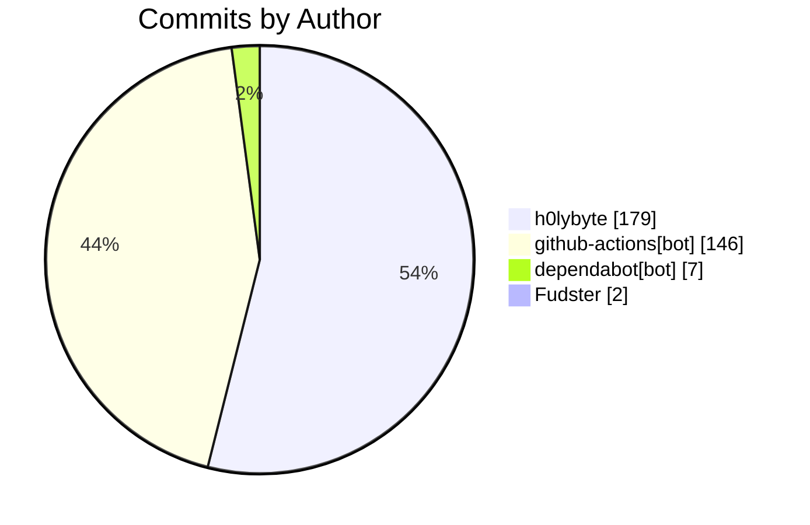

import BentoShell from '@/components/hero/BentoShell.astro';
import BentoProse from '@/components/hero/BentoProse.astro';

<section class="bento-hero bento-section not-content" aria-label="Activity pulse">
	

	

		

			

				
					<svg viewBox="0 0 24 24" width="14" height="14" fill="none" stroke="currentColor" stroke-width="1.75" stroke-linecap="round" stroke-linejoin="round" aria-hidden="true"><path d="M22 12h-4l-3 9L9 3l-3 9H2" /></svg>
					auto-generated · daily
				
				<h1 class="bento-title">
					Repository pulse
					commits, PRs, and issues.
				</h1>
				
<strong>334</strong> commits from <strong>4</strong> contributors — <strong>319</strong> PRs merged (7d).

				
Last generated <strong>2026-07-27T04:37:03Z</strong>.

				

					<a class="bento-btn bento-btn--primary" href="#leaderboard">
						View leaderboard
						<svg viewBox="0 0 24 24" fill="none" stroke="currentColor" aria-hidden="true"><path stroke-linecap="round" stroke-linejoin="round" stroke-width="2" d="M5 12h14M13 6l6 6-6 6" /></svg>
					</a>
					<a class="bento-btn bento-btn--ghost" href="#commits">Commits</a>
					<a class="bento-btn bento-btn--ghost" href="/dashboard/">Dashboard home</a>
				

			

				

					
						<svg viewBox="0 0 24 24" width="16" height="16" fill="none" stroke="currentColor" stroke-width="1.75" stroke-linecap="round" stroke-linejoin="round" aria-hidden="true"><path d="M6 3v12M18 9a3 3 0 1 0 0-6 3 3 0 0 0 0 6zM6 21a3 3 0 1 0 0-6 3 3 0 0 0 0 6zM15 6a9 9 0 0 1-9 9" /></svg>
					
					334
					Commits (7d)
				

				

					
						<svg viewBox="0 0 24 24" width="16" height="16" fill="none" stroke="currentColor" stroke-width="1.75" stroke-linecap="round" stroke-linejoin="round" aria-hidden="true"><path d="M16 21v-2a4 4 0 0 0-4-4H6a4 4 0 0 0-4 4v2M9 11a4 4 0 1 0 0-8 4 4 0 0 0 0 8zM22 21v-2a4 4 0 0 0-3-3.9" /></svg>
					
					4
					Contributors
				

				

					
						<svg viewBox="0 0 24 24" width="16" height="16" fill="none" stroke="currentColor" stroke-width="1.75" stroke-linecap="round" stroke-linejoin="round" aria-hidden="true"><path d="M18 9a3 3 0 1 0 0-6 3 3 0 0 0 0 6zM6 21a3 3 0 1 0 0-6 3 3 0 0 0 0 6zM6 15V9M18 6a9 9 0 0 1-9 9" /></svg>
					
					319
					PRs merged
				

				

					
						<svg viewBox="0 0 24 24" width="16" height="16" fill="none" stroke="currentColor" stroke-width="1.75" stroke-linecap="round" stroke-linejoin="round" aria-hidden="true"><path d="M12 2a10 10 0 1 0 0 20 10 10 0 0 0 0-20zM12 8v4m0 4h.01" /></svg>
					
					326
					Issues opened
				

				

					
						<svg viewBox="0 0 24 24" width="16" height="16" fill="none" stroke="currentColor" stroke-width="1.75" stroke-linecap="round" stroke-linejoin="round" aria-hidden="true"><path d="M22 11.1V12a10 10 0 1 1-5.9-9.1M22 4 12 14.01l-3-3" /></svg>
					
					321
					Issues closed
				

		

		<nav class="bento-jump" aria-label="On this page">
			<a class="bento-chip" href="#leaderboard">Leaderboard</a>
			<a class="bento-chip" href="#commits">Commits</a>
		</nav>
	

</section>

<BentoShell id="leaderboard" eyebrow="Contributors" heading="Top contributors">
	

		<a class="bento-cell bento-linkcard bento-card bento-card--glass bento-card--interactive" href="#commits">
			
				<svg viewBox="0 0 24 24" width="18" height="18" fill="none" stroke="currentColor" stroke-width="1.75" stroke-linecap="round" stroke-linejoin="round" aria-hidden="true"><path d="M16 21v-2a4 4 0 0 0-4-4H6a4 4 0 0 0-4 4v2M9 11a4 4 0 1 0 0-8 4 4 0 0 0 0 8z" /></svg>
			
			h0lybyte
			179 commits
			
				<svg viewBox="0 0 24 24" width="16" height="16" fill="none" stroke="currentColor" stroke-width="2" stroke-linecap="round" stroke-linejoin="round"><path d="M5 12h14M13 6l6 6-6 6" /></svg>
			
		</a>
		<a class="bento-cell bento-linkcard bento-card bento-card--glass bento-card--interactive" href="#commits">
			
				<svg viewBox="0 0 24 24" width="18" height="18" fill="none" stroke="currentColor" stroke-width="1.75" stroke-linecap="round" stroke-linejoin="round" aria-hidden="true"><path d="M16 21v-2a4 4 0 0 0-4-4H6a4 4 0 0 0-4 4v2M9 11a4 4 0 1 0 0-8 4 4 0 0 0 0 8z" /></svg>
			
			github-actions[bot]
			146 commits
			
				<svg viewBox="0 0 24 24" width="16" height="16" fill="none" stroke="currentColor" stroke-width="2" stroke-linecap="round" stroke-linejoin="round"><path d="M5 12h14M13 6l6 6-6 6" /></svg>
			
		</a>
		<a class="bento-cell bento-linkcard bento-card bento-card--glass bento-card--interactive" href="#commits">
			
				<svg viewBox="0 0 24 24" width="18" height="18" fill="none" stroke="currentColor" stroke-width="1.75" stroke-linecap="round" stroke-linejoin="round" aria-hidden="true"><path d="M16 21v-2a4 4 0 0 0-4-4H6a4 4 0 0 0-4 4v2M9 11a4 4 0 1 0 0-8 4 4 0 0 0 0 8z" /></svg>
			
			dependabot[bot]
			7 commits
			
				<svg viewBox="0 0 24 24" width="16" height="16" fill="none" stroke="currentColor" stroke-width="2" stroke-linecap="round" stroke-linejoin="round"><path d="M5 12h14M13 6l6 6-6 6" /></svg>
			
		</a>
		<a class="bento-cell bento-linkcard bento-card bento-card--glass bento-card--interactive" href="#commits">
			
				<svg viewBox="0 0 24 24" width="18" height="18" fill="none" stroke="currentColor" stroke-width="1.75" stroke-linecap="round" stroke-linejoin="round" aria-hidden="true"><path d="M16 21v-2a4 4 0 0 0-4-4H6a4 4 0 0 0-4 4v2M9 11a4 4 0 1 0 0-8 4 4 0 0 0 0 8z" /></svg>
			
			Fudster
			2 commits
			
				<svg viewBox="0 0 24 24" width="16" height="16" fill="none" stroke="currentColor" stroke-width="2" stroke-linecap="round" stroke-linejoin="round"><path d="M5 12h14M13 6l6 6-6 6" /></svg>
			
		</a>
	

</BentoShell>

<BentoProse id="commits" heading="Activity detail">

```mermaid
pie showData
    title Commits by Author
    "h0lybyte" : 179
    "github-actions[bot]" : 146
    "dependabot[bot]" : 7
    "Fudster" : 2
```

### Recent commits

| SHA | Author | Message |
|-----|--------|---------|
| [`12a8e2e`](https://github.com/KBVE/kbve/commit/12a8e2e5b5528f2a0d48415646b7de1dd3a5691f) | h0lybyte | Merge pull request #14694 from KBVE/dev |
| [`d3abbe7`](https://github.com/KBVE/kbve/commit/d3abbe7ff05894291b631cc1f84f2b278554caef) | h0lybyte | feat(palforge): !curltest — check if curl is reachable in the Wine env ( |
| [`3e5e994`](https://github.com/KBVE/kbve/commit/3e5e994fcc3ea03cb3f945b8458c2dbe1cbe2155) | github-actions[bot] | chore(ci): sync ci-dispatch-manifest [skip ci] (#14696) |
| [`5165b0a`](https://github.com/KBVE/kbve/commit/5165b0a9e06bfc8198806fb021d2133a45a1d622) | github-actions[bot] | chore(ci): sync ci-dispatch-manifest [skip ci] (#14695) |
| [`9a0c49b`](https://github.com/KBVE/kbve/commit/9a0c49b1657a89ce1cfbbed851713441c716a702) | h0lybyte | chore(kbve): preparing the release of v1.0.253 |
| [`edf2f46`](https://github.com/KBVE/kbve/commit/edf2f46b795572b7da818e84363964bb4561ce90) | h0lybyte | feat(palforge): signspawn v2 — replicate + property scan + tracked !sign |
| [`1a6e577`](https://github.com/KBVE/kbve/commit/1a6e5770cdc5f604c92046687c90cd11039b7a32) | h0lybyte | Merge pull request #14691 from KBVE/dev |
| [`c3091bb`](https://github.com/KBVE/kbve/commit/c3091bb6ec01f3aee90ff74567edbbd8d7d0a515) | github-actions[bot] | chore(agones-palworld): post-publish sync to v0.0.17 (#14692) |
| [`553c433`](https://github.com/KBVE/kbve/commit/553c43334fe0a68a02046b5ad86292a976b90ca2) | github-actions[bot] | chore(reel): post-publish sync to v0.1.3 (#14690) |
| [`c0a26cf`](https://github.com/KBVE/kbve/commit/c0a26cfc110873517eca49eeb6da77c090a75dcd) | github-actions[bot] | chore(ci): sync ci-dispatch-manifest [skip ci] (#14689) |
| [`57b7656`](https://github.com/KBVE/kbve/commit/57b7656184805b868e7f1072044bca9fddf87cdb) | h0lybyte | Merge pull request #14685 from KBVE/dev |
| [`cb3a5e1`](https://github.com/KBVE/kbve/commit/cb3a5e1b9cd5e5187e6111cbc2ad71256b390699) | h0lybyte | feat(palforge): !httptest — safe HTTP-capability probe (no network/exec) |

### Recently merged PRs

| # | Title | Author |
|---|-------|--------|
| [#14706](https://github.com/KBVE/kbve/pull/14706) | feat(reel): cancel in-flight ffmpeg on delete, reap, and shutdown | h0lybyte |
| [#14705](https://github.com/KBVE/kbve/pull/14705) | chore(ci): sync ci-dispatch-manifest | github-actions[bot] |
| [#14704](https://github.com/KBVE/kbve/pull/14704) | fix(reel): VPN-aware stall watchdog, HTTP timeouts, 503 on vpn-down add | h0lybyte |
| [#14703](https://github.com/KBVE/kbve/pull/14703) | feat(palworld): tune egg hatch, supply drop, item weight | h0lybyte |
| [#14702](https://github.com/KBVE/kbve/pull/14702) | feat(professiondb): universal profession proto schema + zod codegen | h0lybyte |
| [#14698](https://github.com/KBVE/kbve/pull/14698) | feat(reel): scoped short-lived media token (stop leaking JWT in media UR | h0lybyte |
| [#14701](https://github.com/KBVE/kbve/pull/14701) | Atomic: axum-kbve v1.0.253 post-publish sync | github-actions[bot] |
| [#14699](https://github.com/KBVE/kbve/pull/14699) | Atomic: agones-palworld v0.0.18 post-publish sync | github-actions[bot] |
| [#14694](https://github.com/KBVE/kbve/pull/14694) | Release: 2 features, 3 chores → Main | github-actions[bot] |
| [#14697](https://github.com/KBVE/kbve/pull/14697) | feat(palforge): !curltest — check if curl is reachable in the Wine env | h0lybyte |

</BentoProse>

<BentoProse id="about">

---

*Auto-generated by [ci-daily-content.yml](https://github.com/KBVE/kbve/actions/workflows/ci-daily-content.yml)*

</BentoProse>

