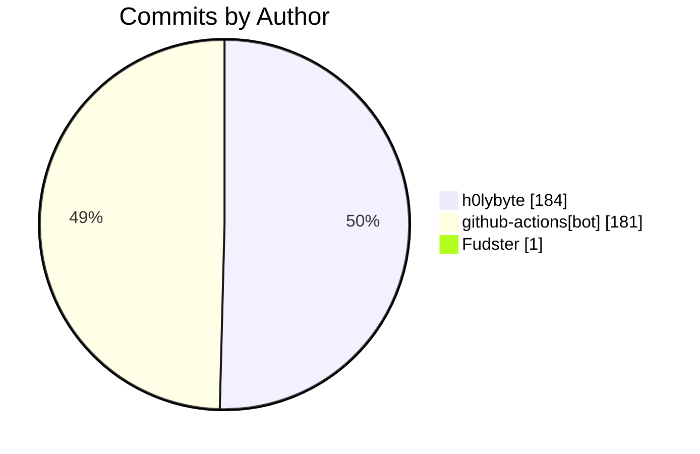

import BentoShell from '@/components/hero/BentoShell.astro';
import BentoProse from '@/components/hero/BentoProse.astro';

<section class="bento-hero bento-section not-content" aria-label="Activity pulse">
	

	

		

			

				
					<svg viewBox="0 0 24 24" width="14" height="14" fill="none" stroke="currentColor" stroke-width="1.75" stroke-linecap="round" stroke-linejoin="round" aria-hidden="true"><path d="M22 12h-4l-3 9L9 3l-3 9H2" /></svg>
					auto-generated · daily
				
				<h1 class="bento-title">
					Repository pulse
					commits, PRs, and issues.
				</h1>
				
<strong>366</strong> commits from <strong>3</strong> contributors — <strong>368</strong> PRs merged (7d).

				
Last generated <strong>2026-07-30T03:57:08Z</strong>.

				

					<a class="bento-btn bento-btn--primary" href="#leaderboard">
						View leaderboard
						<svg viewBox="0 0 24 24" fill="none" stroke="currentColor" aria-hidden="true"><path stroke-linecap="round" stroke-linejoin="round" stroke-width="2" d="M5 12h14M13 6l6 6-6 6" /></svg>
					</a>
					<a class="bento-btn bento-btn--ghost" href="#commits">Commits</a>
					<a class="bento-btn bento-btn--ghost" href="/dashboard/">Dashboard home</a>
				

			

				

					
						<svg viewBox="0 0 24 24" width="16" height="16" fill="none" stroke="currentColor" stroke-width="1.75" stroke-linecap="round" stroke-linejoin="round" aria-hidden="true"><path d="M6 3v12M18 9a3 3 0 1 0 0-6 3 3 0 0 0 0 6zM6 21a3 3 0 1 0 0-6 3 3 0 0 0 0 6zM15 6a9 9 0 0 1-9 9" /></svg>
					
					366
					Commits (7d)
				

				

					
						<svg viewBox="0 0 24 24" width="16" height="16" fill="none" stroke="currentColor" stroke-width="1.75" stroke-linecap="round" stroke-linejoin="round" aria-hidden="true"><path d="M16 21v-2a4 4 0 0 0-4-4H6a4 4 0 0 0-4 4v2M9 11a4 4 0 1 0 0-8 4 4 0 0 0 0 8zM22 21v-2a4 4 0 0 0-3-3.9" /></svg>
					
					3
					Contributors
				

				

					
						<svg viewBox="0 0 24 24" width="16" height="16" fill="none" stroke="currentColor" stroke-width="1.75" stroke-linecap="round" stroke-linejoin="round" aria-hidden="true"><path d="M18 9a3 3 0 1 0 0-6 3 3 0 0 0 0 6zM6 21a3 3 0 1 0 0-6 3 3 0 0 0 0 6zM6 15V9M18 6a9 9 0 0 1-9 9" /></svg>
					
					368
					PRs merged
				

				

					
						<svg viewBox="0 0 24 24" width="16" height="16" fill="none" stroke="currentColor" stroke-width="1.75" stroke-linecap="round" stroke-linejoin="round" aria-hidden="true"><path d="M12 2a10 10 0 1 0 0 20 10 10 0 0 0 0-20zM12 8v4m0 4h.01" /></svg>
					
					376
					Issues opened
				

				

					
						<svg viewBox="0 0 24 24" width="16" height="16" fill="none" stroke="currentColor" stroke-width="1.75" stroke-linecap="round" stroke-linejoin="round" aria-hidden="true"><path d="M22 11.1V12a10 10 0 1 1-5.9-9.1M22 4 12 14.01l-3-3" /></svg>
					
					371
					Issues closed
				

		

		<nav class="bento-jump" aria-label="On this page">
			<a class="bento-chip" href="#leaderboard">Leaderboard</a>
			<a class="bento-chip" href="#commits">Commits</a>
		</nav>
	

</section>

<BentoShell id="leaderboard" eyebrow="Contributors" heading="Top contributors">
	

		<a class="bento-cell bento-linkcard bento-card bento-card--glass bento-card--interactive" href="#commits">
			
				<svg viewBox="0 0 24 24" width="18" height="18" fill="none" stroke="currentColor" stroke-width="1.75" stroke-linecap="round" stroke-linejoin="round" aria-hidden="true"><path d="M16 21v-2a4 4 0 0 0-4-4H6a4 4 0 0 0-4 4v2M9 11a4 4 0 1 0 0-8 4 4 0 0 0 0 8z" /></svg>
			
			h0lybyte
			184 commits
			
				<svg viewBox="0 0 24 24" width="16" height="16" fill="none" stroke="currentColor" stroke-width="2" stroke-linecap="round" stroke-linejoin="round"><path d="M5 12h14M13 6l6 6-6 6" /></svg>
			
		</a>
		<a class="bento-cell bento-linkcard bento-card bento-card--glass bento-card--interactive" href="#commits">
			
				<svg viewBox="0 0 24 24" width="18" height="18" fill="none" stroke="currentColor" stroke-width="1.75" stroke-linecap="round" stroke-linejoin="round" aria-hidden="true"><path d="M16 21v-2a4 4 0 0 0-4-4H6a4 4 0 0 0-4 4v2M9 11a4 4 0 1 0 0-8 4 4 0 0 0 0 8z" /></svg>
			
			github-actions[bot]
			181 commits
			
				<svg viewBox="0 0 24 24" width="16" height="16" fill="none" stroke="currentColor" stroke-width="2" stroke-linecap="round" stroke-linejoin="round"><path d="M5 12h14M13 6l6 6-6 6" /></svg>
			
		</a>
		<a class="bento-cell bento-linkcard bento-card bento-card--glass bento-card--interactive" href="#commits">
			
				<svg viewBox="0 0 24 24" width="18" height="18" fill="none" stroke="currentColor" stroke-width="1.75" stroke-linecap="round" stroke-linejoin="round" aria-hidden="true"><path d="M16 21v-2a4 4 0 0 0-4-4H6a4 4 0 0 0-4 4v2M9 11a4 4 0 1 0 0-8 4 4 0 0 0 0 8z" /></svg>
			
			Fudster
			1 commit
			
				<svg viewBox="0 0 24 24" width="16" height="16" fill="none" stroke="currentColor" stroke-width="2" stroke-linecap="round" stroke-linejoin="round"><path d="M5 12h14M13 6l6 6-6 6" /></svg>
			
		</a>
	

</BentoShell>

<BentoProse id="commits" heading="Activity detail">

```mermaid
pie showData
    title Commits by Author
    "h0lybyte" : 184
    "github-actions[bot]" : 181
    "Fudster" : 1
```

### Recent commits

| SHA | Author | Message |
|-----|--------|---------|
| [`dd215da`](https://github.com/KBVE/kbve/commit/dd215dac77d92b7973fc52b6c989bd2592ff4b69) | h0lybyte | Merge pull request #14902 from KBVE/dev |
| [`baabd8e`](https://github.com/KBVE/kbve/commit/baabd8eb0d8ea249c3a223199d8b31ce4f21fadc) | h0lybyte | fix(reel): revert DNS override to gluetun default (heal crashloop) (#149 |
| [`268dd5f`](https://github.com/KBVE/kbve/commit/268dd5fa149eacf2e2b1a08c3e39fb5a94f7da1d) | github-actions[bot] | chore(axum-kbve): post-publish sync to v1.0.257 (#14901) |
| [`311413a`](https://github.com/KBVE/kbve/commit/311413a66412f524dfa378989ae057c84570ddf5) | h0lybyte | Merge pull request #14899 from KBVE/dev |
| [`aab2ce4`](https://github.com/KBVE/kbve/commit/aab2ce4c09cc227f05b32bb1c8edef19cdc26b70) | h0lybyte | fix(reel): correct gluetun plain-DNS env (DOT=off crashed the pod) (#148 |
| [`347ffe5`](https://github.com/KBVE/kbve/commit/347ffe54a85da00a96c471e6a71f09ba69892416) | h0lybyte | Merge pull request #14896 from KBVE/dev |
| [`b7ae46f`](https://github.com/KBVE/kbve/commit/b7ae46f17c6e354beb61f845d8d1d1b367c2a200) | github-actions[bot] | chore(ci): sync ci-dispatch-manifest [skip ci] (#14897) |
| [`d489274`](https://github.com/KBVE/kbve/commit/d4892743d9eb7b2e8889747e03a94b0ca250f9f3) | h0lybyte | chore(kbve): preparing the release of v1.0.257 |
| [`8f3ce54`](https://github.com/KBVE/kbve/commit/8f3ce546d726d858ab4b07000a5e23ace2070d02) | h0lybyte | fix(store): digital products no longer demand a shipping address (#14895 |
| [`afa5dc1`](https://github.com/KBVE/kbve/commit/afa5dc161a8d08e65f6756b7ce7ce1aa02513a1f) | h0lybyte | Merge pull request #14893 from KBVE/dev |
| [`4caa7c3`](https://github.com/KBVE/kbve/commit/4caa7c3e3dab03253ed3d350d8e8e5e31c0ef55a) | h0lybyte | feat(graph): enhance UI/UX with navigation controls, brighter colors, an |
| [`0f2a7bb`](https://github.com/KBVE/kbve/commit/0f2a7bbb2f51cc6a71ef03172bc1f6c721ca1191) | h0lybyte | fix(reel): disable gluetun DoT - DNS storm collapses the peer swarm (#14 |

### Recently merged PRs

| # | Title | Author |
|---|-------|--------|
| [#14902](https://github.com/KBVE/kbve/pull/14902) | Release: 1 chore → Main | github-actions[bot] |
| [#14900](https://github.com/KBVE/kbve/pull/14900) | fix(reel): revert DNS override to gluetun default (heal crashloop) | h0lybyte |
| [#14901](https://github.com/KBVE/kbve/pull/14901) | Atomic: axum-kbve v1.0.257 post-publish sync | github-actions[bot] |
| [#14899](https://github.com/KBVE/kbve/pull/14899) | Release: 1 fix → Main | github-actions[bot] |
| [#14898](https://github.com/KBVE/kbve/pull/14898) | fix(reel): correct gluetun plain-DNS env (DOT=off crashed the pod) | h0lybyte |
| [#14896](https://github.com/KBVE/kbve/pull/14896) | Release: 1 fix, 1 chore → Main | github-actions[bot] |
| [#14897](https://github.com/KBVE/kbve/pull/14897) | chore(ci): sync ci-dispatch-manifest | github-actions[bot] |
| [#14895](https://github.com/KBVE/kbve/pull/14895) | fix(store): digital products no longer demand a shipping address | h0lybyte |
| [#14893](https://github.com/KBVE/kbve/pull/14893) | Release: 1 feature, 1 fix → Main | github-actions[bot] |
| [#14894](https://github.com/KBVE/kbve/pull/14894) | feat(graph): enhance UI/UX with navigation controls, brighter colors, an | h0lybyte |

</BentoProse>

<BentoProse id="about">

---

*Auto-generated by [ci-daily-content.yml](https://github.com/KBVE/kbve/actions/workflows/ci-daily-content.yml)*

</BentoProse>

