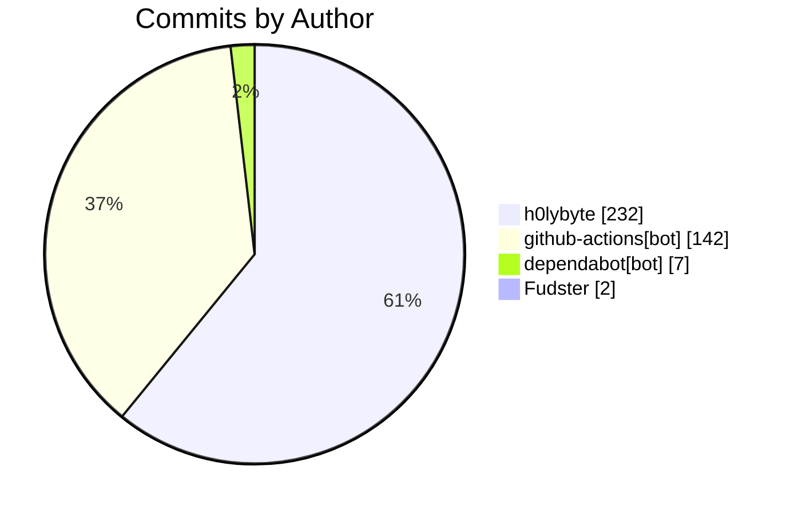

import BentoShell from '@/components/hero/BentoShell.astro';
import BentoProse from '@/components/hero/BentoProse.astro';

<section class="bento-hero bento-section not-content" aria-label="Activity pulse">
	

	

		

			

				
					<svg viewBox="0 0 24 24" width="14" height="14" fill="none" stroke="currentColor" stroke-width="1.75" stroke-linecap="round" stroke-linejoin="round" aria-hidden="true"><path d="M22 12h-4l-3 9L9 3l-3 9H2" /></svg>
					auto-generated · daily
				
				<h1 class="bento-title">
					Repository pulse
					commits, PRs, and issues.
				</h1>
				
<strong>383</strong> commits from <strong>4</strong> contributors — <strong>348</strong> PRs merged (7d).

				
Last generated <strong>2026-07-26T04:26:14Z</strong>.

				

					<a class="bento-btn bento-btn--primary" href="#leaderboard">
						View leaderboard
						<svg viewBox="0 0 24 24" fill="none" stroke="currentColor" aria-hidden="true"><path stroke-linecap="round" stroke-linejoin="round" stroke-width="2" d="M5 12h14M13 6l6 6-6 6" /></svg>
					</a>
					<a class="bento-btn bento-btn--ghost" href="#commits">Commits</a>
					<a class="bento-btn bento-btn--ghost" href="/dashboard/">Dashboard home</a>
				

			

				

					
						<svg viewBox="0 0 24 24" width="16" height="16" fill="none" stroke="currentColor" stroke-width="1.75" stroke-linecap="round" stroke-linejoin="round" aria-hidden="true"><path d="M6 3v12M18 9a3 3 0 1 0 0-6 3 3 0 0 0 0 6zM6 21a3 3 0 1 0 0-6 3 3 0 0 0 0 6zM15 6a9 9 0 0 1-9 9" /></svg>
					
					383
					Commits (7d)
				

				

					
						<svg viewBox="0 0 24 24" width="16" height="16" fill="none" stroke="currentColor" stroke-width="1.75" stroke-linecap="round" stroke-linejoin="round" aria-hidden="true"><path d="M16 21v-2a4 4 0 0 0-4-4H6a4 4 0 0 0-4 4v2M9 11a4 4 0 1 0 0-8 4 4 0 0 0 0 8zM22 21v-2a4 4 0 0 0-3-3.9" /></svg>
					
					4
					Contributors
				

				

					
						<svg viewBox="0 0 24 24" width="16" height="16" fill="none" stroke="currentColor" stroke-width="1.75" stroke-linecap="round" stroke-linejoin="round" aria-hidden="true"><path d="M18 9a3 3 0 1 0 0-6 3 3 0 0 0 0 6zM6 21a3 3 0 1 0 0-6 3 3 0 0 0 0 6zM6 15V9M18 6a9 9 0 0 1-9 9" /></svg>
					
					348
					PRs merged
				

				

					
						<svg viewBox="0 0 24 24" width="16" height="16" fill="none" stroke="currentColor" stroke-width="1.75" stroke-linecap="round" stroke-linejoin="round" aria-hidden="true"><path d="M12 2a10 10 0 1 0 0 20 10 10 0 0 0 0-20zM12 8v4m0 4h.01" /></svg>
					
					356
					Issues opened
				

				

					
						<svg viewBox="0 0 24 24" width="16" height="16" fill="none" stroke="currentColor" stroke-width="1.75" stroke-linecap="round" stroke-linejoin="round" aria-hidden="true"><path d="M22 11.1V12a10 10 0 1 1-5.9-9.1M22 4 12 14.01l-3-3" /></svg>
					
					350
					Issues closed
				

		

		<nav class="bento-jump" aria-label="On this page">
			<a class="bento-chip" href="#leaderboard">Leaderboard</a>
			<a class="bento-chip" href="#commits">Commits</a>
		</nav>
	

</section>

<BentoShell id="leaderboard" eyebrow="Contributors" heading="Top contributors">
	

		<a class="bento-cell bento-linkcard bento-card bento-card--glass bento-card--interactive" href="#commits">
			
				<svg viewBox="0 0 24 24" width="18" height="18" fill="none" stroke="currentColor" stroke-width="1.75" stroke-linecap="round" stroke-linejoin="round" aria-hidden="true"><path d="M16 21v-2a4 4 0 0 0-4-4H6a4 4 0 0 0-4 4v2M9 11a4 4 0 1 0 0-8 4 4 0 0 0 0 8z" /></svg>
			
			h0lybyte
			232 commits
			
				<svg viewBox="0 0 24 24" width="16" height="16" fill="none" stroke="currentColor" stroke-width="2" stroke-linecap="round" stroke-linejoin="round"><path d="M5 12h14M13 6l6 6-6 6" /></svg>
			
		</a>
		<a class="bento-cell bento-linkcard bento-card bento-card--glass bento-card--interactive" href="#commits">
			
				<svg viewBox="0 0 24 24" width="18" height="18" fill="none" stroke="currentColor" stroke-width="1.75" stroke-linecap="round" stroke-linejoin="round" aria-hidden="true"><path d="M16 21v-2a4 4 0 0 0-4-4H6a4 4 0 0 0-4 4v2M9 11a4 4 0 1 0 0-8 4 4 0 0 0 0 8z" /></svg>
			
			github-actions[bot]
			142 commits
			
				<svg viewBox="0 0 24 24" width="16" height="16" fill="none" stroke="currentColor" stroke-width="2" stroke-linecap="round" stroke-linejoin="round"><path d="M5 12h14M13 6l6 6-6 6" /></svg>
			
		</a>
		<a class="bento-cell bento-linkcard bento-card bento-card--glass bento-card--interactive" href="#commits">
			
				<svg viewBox="0 0 24 24" width="18" height="18" fill="none" stroke="currentColor" stroke-width="1.75" stroke-linecap="round" stroke-linejoin="round" aria-hidden="true"><path d="M16 21v-2a4 4 0 0 0-4-4H6a4 4 0 0 0-4 4v2M9 11a4 4 0 1 0 0-8 4 4 0 0 0 0 8z" /></svg>
			
			dependabot[bot]
			7 commits
			
				<svg viewBox="0 0 24 24" width="16" height="16" fill="none" stroke="currentColor" stroke-width="2" stroke-linecap="round" stroke-linejoin="round"><path d="M5 12h14M13 6l6 6-6 6" /></svg>
			
		</a>
		<a class="bento-cell bento-linkcard bento-card bento-card--glass bento-card--interactive" href="#commits">
			
				<svg viewBox="0 0 24 24" width="18" height="18" fill="none" stroke="currentColor" stroke-width="1.75" stroke-linecap="round" stroke-linejoin="round" aria-hidden="true"><path d="M16 21v-2a4 4 0 0 0-4-4H6a4 4 0 0 0-4 4v2M9 11a4 4 0 1 0 0-8 4 4 0 0 0 0 8z" /></svg>
			
			Fudster
			2 commits
			
				<svg viewBox="0 0 24 24" width="16" height="16" fill="none" stroke="currentColor" stroke-width="2" stroke-linecap="round" stroke-linejoin="round"><path d="M5 12h14M13 6l6 6-6 6" /></svg>
			
		</a>
	

</BentoShell>

<BentoProse id="commits" heading="Activity detail">

```mermaid
pie showData
    title Commits by Author
    "h0lybyte" : 232
    "github-actions[bot]" : 142
    "dependabot[bot]" : 7
    "Fudster" : 2
```

### Recent commits

| SHA | Author | Message |
|-----|--------|---------|
| [`9e38664`](https://github.com/KBVE/kbve/commit/9e386640e0dcb0f7237a2e9ae2db8b8a85e88dec) | h0lybyte | Merge pull request #14660 from KBVE/dev |
| [`c9a5167`](https://github.com/KBVE/kbve/commit/c9a516782a03be0500a02e4600db596786563fee) | github-actions[bot] | chore(agones-palworld): post-publish sync to v0.0.14 (#14659) |
| [`f3bcb4f`](https://github.com/KBVE/kbve/commit/f3bcb4f1767cfe53647377a71751f51b28b6ce47) | github-actions[bot] | chore(ci): sync ci-dispatch-manifest [skip ci] (#14658) |
| [`8f352e6`](https://github.com/KBVE/kbve/commit/8f352e6e0d7e88aab44ed84a31d3f7eef4e3a028) | h0lybyte | Merge pull request #14657 from KBVE/dev |
| [`189bed8`](https://github.com/KBVE/kbve/commit/189bed81d334b8c3384ecbfd6e721c2470c6c496) | h0lybyte | feat(palworld): 0.0.14 — prestop waittime + !cmd suppress + pos-to-PAL + |
| [`b7ad151`](https://github.com/KBVE/kbve/commit/b7ad151d128269f2714b8b99fb2ed6ae0a107c94) | h0lybyte | Merge pull request #14654 from KBVE/dev |
| [`f572483`](https://github.com/KBVE/kbve/commit/f57248389dacf7f89b7c80948891871dedac8ea3) | github-actions[bot] | chore(axum-kbve): post-publish sync to v1.0.252 (#14655) |
| [`1f17511`](https://github.com/KBVE/kbve/commit/1f17511b5b89cf283e41a7e78ecf4e537b691dde) | github-actions[bot] | chore(agones-palworld): post-publish sync to v0.0.13 (#14653) |
| [`38854fc`](https://github.com/KBVE/kbve/commit/38854fc7487435f7a59c2f6108773c3e5d098415) | h0lybyte | Merge pull request #14649 from KBVE/dev |
| [`83aef7e`](https://github.com/KBVE/kbve/commit/83aef7e473cba8d77bf30eae6b134062e07908eb) | github-actions[bot] | chore(ci): sync ci-dispatch-manifest [skip ci] (#14652) |
| [`94987ae`](https://github.com/KBVE/kbve/commit/94987ae99d8cce41ee349183d4311f95a5366ab7) | h0lybyte | fix(palforge): use !pos not /pos (Palworld eats slash commands) (#14651) |
| [`b2bec2f`](https://github.com/KBVE/kbve/commit/b2bec2f2015e1f24d955c1b6b5204dbd968fa0d8) | github-actions[bot] | chore(ci): sync ci-dispatch-manifest [skip ci] (#14650) |

### Recently merged PRs

| # | Title | Author |
|---|-------|--------|
| [#14668](https://github.com/KBVE/kbve/pull/14668) | chore(content): daily journal scaffold | github-actions[bot] |
| [#14667](https://github.com/KBVE/kbve/pull/14667) | chore(ci): sync ci-dispatch-manifest | github-actions[bot] |
| [#14666](https://github.com/KBVE/kbve/pull/14666) | Atomic: palworld hatch time | github-actions[bot] |
| [#14665](https://github.com/KBVE/kbve/pull/14665) | chore(reel): bump to 0.1.2 (stall-timeout + tracker injection) | h0lybyte |
| [#14664](https://github.com/KBVE/kbve/pull/14664) | chore(ci): sync ci-dispatch-manifest | github-actions[bot] |
| [#14662](https://github.com/KBVE/kbve/pull/14662) | feat(palforge): !signprobe probes existing signboard setter (R2) | h0lybyte |
| [#14661](https://github.com/KBVE/kbve/pull/14661) | feat(reel): fail unresolvable torrents with a reason instead of hanging | h0lybyte |
| [#14660](https://github.com/KBVE/kbve/pull/14660) | Release: 2 chores → Main | github-actions[bot] |
| [#14659](https://github.com/KBVE/kbve/pull/14659) | Atomic: agones-palworld v0.0.14 post-publish sync | github-actions[bot] |
| [#14658](https://github.com/KBVE/kbve/pull/14658) | chore(ci): sync ci-dispatch-manifest | github-actions[bot] |

</BentoProse>

<BentoProse id="about">

---

*Auto-generated by [ci-daily-content.yml](https://github.com/KBVE/kbve/actions/workflows/ci-daily-content.yml)*

</BentoProse>

