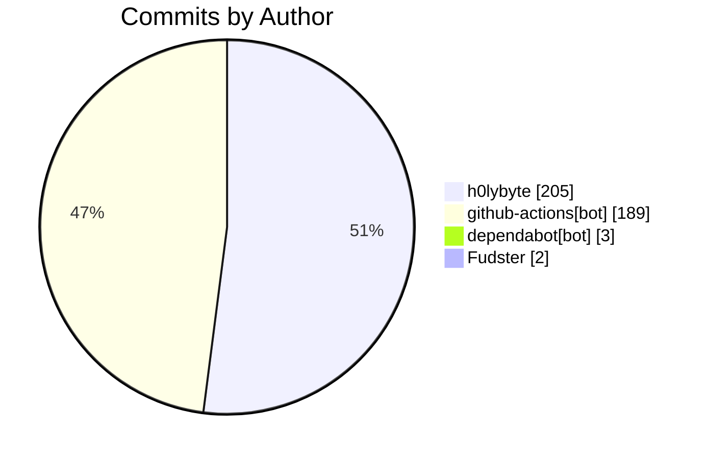

import BentoShell from '@/components/hero/BentoShell.astro';
import BentoProse from '@/components/hero/BentoProse.astro';

<section class="bento-hero bento-section not-content" aria-label="Activity pulse">
	

	

		

			

				
					<svg viewBox="0 0 24 24" width="14" height="14" fill="none" stroke="currentColor" stroke-width="1.75" stroke-linecap="round" stroke-linejoin="round" aria-hidden="true"><path d="M22 12h-4l-3 9L9 3l-3 9H2" /></svg>
					auto-generated · daily
				
				<h1 class="bento-title">
					Repository pulse
					commits, PRs, and issues.
				</h1>
				
<strong>399</strong> commits from <strong>4</strong> contributors — <strong>379</strong> PRs merged (7d).

				
Last generated <strong>2026-07-29T04:11:32Z</strong>.

				

					<a class="bento-btn bento-btn--primary" href="#leaderboard">
						View leaderboard
						<svg viewBox="0 0 24 24" fill="none" stroke="currentColor" aria-hidden="true"><path stroke-linecap="round" stroke-linejoin="round" stroke-width="2" d="M5 12h14M13 6l6 6-6 6" /></svg>
					</a>
					<a class="bento-btn bento-btn--ghost" href="#commits">Commits</a>
					<a class="bento-btn bento-btn--ghost" href="/dashboard/">Dashboard home</a>
				

			

				

					
						<svg viewBox="0 0 24 24" width="16" height="16" fill="none" stroke="currentColor" stroke-width="1.75" stroke-linecap="round" stroke-linejoin="round" aria-hidden="true"><path d="M6 3v12M18 9a3 3 0 1 0 0-6 3 3 0 0 0 0 6zM6 21a3 3 0 1 0 0-6 3 3 0 0 0 0 6zM15 6a9 9 0 0 1-9 9" /></svg>
					
					399
					Commits (7d)
				

				

					
						<svg viewBox="0 0 24 24" width="16" height="16" fill="none" stroke="currentColor" stroke-width="1.75" stroke-linecap="round" stroke-linejoin="round" aria-hidden="true"><path d="M16 21v-2a4 4 0 0 0-4-4H6a4 4 0 0 0-4 4v2M9 11a4 4 0 1 0 0-8 4 4 0 0 0 0 8zM22 21v-2a4 4 0 0 0-3-3.9" /></svg>
					
					4
					Contributors
				

				

					
						<svg viewBox="0 0 24 24" width="16" height="16" fill="none" stroke="currentColor" stroke-width="1.75" stroke-linecap="round" stroke-linejoin="round" aria-hidden="true"><path d="M18 9a3 3 0 1 0 0-6 3 3 0 0 0 0 6zM6 21a3 3 0 1 0 0-6 3 3 0 0 0 0 6zM6 15V9M18 6a9 9 0 0 1-9 9" /></svg>
					
					379
					PRs merged
				

				

					
						<svg viewBox="0 0 24 24" width="16" height="16" fill="none" stroke="currentColor" stroke-width="1.75" stroke-linecap="round" stroke-linejoin="round" aria-hidden="true"><path d="M12 2a10 10 0 1 0 0 20 10 10 0 0 0 0-20zM12 8v4m0 4h.01" /></svg>
					
					386
					Issues opened
				

				

					
						<svg viewBox="0 0 24 24" width="16" height="16" fill="none" stroke="currentColor" stroke-width="1.75" stroke-linecap="round" stroke-linejoin="round" aria-hidden="true"><path d="M22 11.1V12a10 10 0 1 1-5.9-9.1M22 4 12 14.01l-3-3" /></svg>
					
					384
					Issues closed
				

		

		<nav class="bento-jump" aria-label="On this page">
			<a class="bento-chip" href="#leaderboard">Leaderboard</a>
			<a class="bento-chip" href="#commits">Commits</a>
		</nav>
	

</section>

<BentoShell id="leaderboard" eyebrow="Contributors" heading="Top contributors">
	

		<a class="bento-cell bento-linkcard bento-card bento-card--glass bento-card--interactive" href="#commits">
			
				<svg viewBox="0 0 24 24" width="18" height="18" fill="none" stroke="currentColor" stroke-width="1.75" stroke-linecap="round" stroke-linejoin="round" aria-hidden="true"><path d="M16 21v-2a4 4 0 0 0-4-4H6a4 4 0 0 0-4 4v2M9 11a4 4 0 1 0 0-8 4 4 0 0 0 0 8z" /></svg>
			
			h0lybyte
			205 commits
			
				<svg viewBox="0 0 24 24" width="16" height="16" fill="none" stroke="currentColor" stroke-width="2" stroke-linecap="round" stroke-linejoin="round"><path d="M5 12h14M13 6l6 6-6 6" /></svg>
			
		</a>
		<a class="bento-cell bento-linkcard bento-card bento-card--glass bento-card--interactive" href="#commits">
			
				<svg viewBox="0 0 24 24" width="18" height="18" fill="none" stroke="currentColor" stroke-width="1.75" stroke-linecap="round" stroke-linejoin="round" aria-hidden="true"><path d="M16 21v-2a4 4 0 0 0-4-4H6a4 4 0 0 0-4 4v2M9 11a4 4 0 1 0 0-8 4 4 0 0 0 0 8z" /></svg>
			
			github-actions[bot]
			189 commits
			
				<svg viewBox="0 0 24 24" width="16" height="16" fill="none" stroke="currentColor" stroke-width="2" stroke-linecap="round" stroke-linejoin="round"><path d="M5 12h14M13 6l6 6-6 6" /></svg>
			
		</a>
		<a class="bento-cell bento-linkcard bento-card bento-card--glass bento-card--interactive" href="#commits">
			
				<svg viewBox="0 0 24 24" width="18" height="18" fill="none" stroke="currentColor" stroke-width="1.75" stroke-linecap="round" stroke-linejoin="round" aria-hidden="true"><path d="M16 21v-2a4 4 0 0 0-4-4H6a4 4 0 0 0-4 4v2M9 11a4 4 0 1 0 0-8 4 4 0 0 0 0 8z" /></svg>
			
			dependabot[bot]
			3 commits
			
				<svg viewBox="0 0 24 24" width="16" height="16" fill="none" stroke="currentColor" stroke-width="2" stroke-linecap="round" stroke-linejoin="round"><path d="M5 12h14M13 6l6 6-6 6" /></svg>
			
		</a>
		<a class="bento-cell bento-linkcard bento-card bento-card--glass bento-card--interactive" href="#commits">
			
				<svg viewBox="0 0 24 24" width="18" height="18" fill="none" stroke="currentColor" stroke-width="1.75" stroke-linecap="round" stroke-linejoin="round" aria-hidden="true"><path d="M16 21v-2a4 4 0 0 0-4-4H6a4 4 0 0 0-4 4v2M9 11a4 4 0 1 0 0-8 4 4 0 0 0 0 8z" /></svg>
			
			Fudster
			2 commits
			
				<svg viewBox="0 0 24 24" width="16" height="16" fill="none" stroke="currentColor" stroke-width="2" stroke-linecap="round" stroke-linejoin="round"><path d="M5 12h14M13 6l6 6-6 6" /></svg>
			
		</a>
	

</BentoShell>

<BentoProse id="commits" heading="Activity detail">

```mermaid
pie showData
    title Commits by Author
    "h0lybyte" : 205
    "github-actions[bot]" : 189
    "dependabot[bot]" : 3
    "Fudster" : 2
```

### Recent commits

| SHA | Author | Message |
|-----|--------|---------|
| [`f6e6744`](https://github.com/KBVE/kbve/commit/f6e6744fc6ee611a7df68f174c61350a7a9d3999) | h0lybyte | Merge pull request #14868 from KBVE/dev |
| [`f21e356`](https://github.com/KBVE/kbve/commit/f21e3566686e6b542d3815baea0f3c7ab960632f) | h0lybyte | fix(palworld): updating egg timer to 1 hour max. |
| [`3ed8de4`](https://github.com/KBVE/kbve/commit/3ed8de4f3126fbf2436c19aefe98ef6d1b9f2a36) | h0lybyte | Merge pull request #14867 from KBVE/dev |
| [`7bd7cd5`](https://github.com/KBVE/kbve/commit/7bd7cd5918c921e163db7f9cdb7fb91286d1fe62) | h0lybyte | chore(kbve): updating the manifest to keep items on death. |
| [`86cc9dd`](https://github.com/KBVE/kbve/commit/86cc9dd26d38a0912b5f51d0930eb4e6d5744289) | h0lybyte | Merge pull request #14863 from KBVE/dev |
| [`d177516`](https://github.com/KBVE/kbve/commit/d17751640451803039ddc06c47f8f6bedd649af8) | github-actions[bot] | chore(axum-kbve): post-publish sync to v1.0.256 (#14866) |
| [`ccfe807`](https://github.com/KBVE/kbve/commit/ccfe80778db4f0ee037187a0b09bb9ee5812ef35) | github-actions[bot] | chore(agones-palworld): post-publish sync to v0.0.30 (#14865) |
| [`b461d3d`](https://github.com/KBVE/kbve/commit/b461d3d611b4b68b530407abf640f23b3a510ba5) | github-actions[bot] | chore(reel): post-publish sync to v0.1.19 (#14864) |
| [`d97c1db`](https://github.com/KBVE/kbve/commit/d97c1dbea5b3ceaab48260a54f9e7988e8051820) | github-actions[bot] | chore(ci): sync ci-dispatch-manifest [skip ci] (#14862) |
| [`12692d8`](https://github.com/KBVE/kbve/commit/12692d8498fb5f57ac41b856d62a2a3019621794) | h0lybyte | Merge pull request #14858 from KBVE/dev |
| [`02e9f69`](https://github.com/KBVE/kbve/commit/02e9f69531dee4bdb2e28764d77791fdbc073789) | h0lybyte | feat(palworld-shops): expand Village to 70 items (foods, cakes, arrows)  |
| [`b059a10`](https://github.com/KBVE/kbve/commit/b059a100c4b3d6da7b2dd44f52bef1c4dc05cbff) | github-actions[bot] | chore(ci): sync ci-dispatch-manifest [skip ci] (#14861) |

### Recently merged PRs

| # | Title | Author |
|---|-------|--------|
| [#14871](https://github.com/KBVE/kbve/pull/14871) | fix(reel): disable VPN port forwarding to stop peer-wipe churn | h0lybyte |
| [#14869](https://github.com/KBVE/kbve/pull/14869) | feat(kubectl): restart-gameserver for config-only GameServer restarts | h0lybyte |
| [#14868](https://github.com/KBVE/kbve/pull/14868) | Release: 1 fix → Main | github-actions[bot] |
| [#14867](https://github.com/KBVE/kbve/pull/14867) | Release: 1 chore → Main | github-actions[bot] |
| [#14863](https://github.com/KBVE/kbve/pull/14863) | Release: 4 chores → Main | github-actions[bot] |
| [#14866](https://github.com/KBVE/kbve/pull/14866) | Atomic: axum-kbve v1.0.256 post-publish sync | github-actions[bot] |
| [#14865](https://github.com/KBVE/kbve/pull/14865) | Atomic: agones-palworld v0.0.30 post-publish sync | github-actions[bot] |
| [#14864](https://github.com/KBVE/kbve/pull/14864) | Atomic: reel v0.1.19 post-publish sync | github-actions[bot] |
| [#14862](https://github.com/KBVE/kbve/pull/14862) | chore(ci): sync ci-dispatch-manifest | github-actions[bot] |
| [#14858](https://github.com/KBVE/kbve/pull/14858) | Release: 1 feature, 1 fix, 3 chores → Main | github-actions[bot] |

</BentoProse>

<BentoProse id="about">

---

*Auto-generated by [ci-daily-content.yml](https://github.com/KBVE/kbve/actions/workflows/ci-daily-content.yml)*

</BentoProse>

