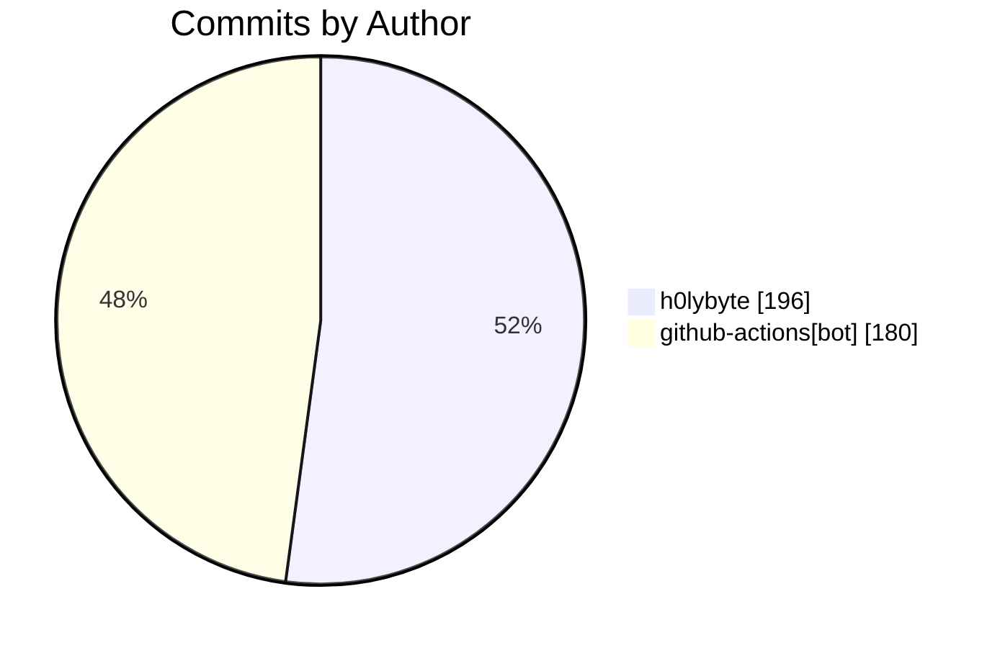

import BentoShell from '@/components/hero/BentoShell.astro';
import BentoProse from '@/components/hero/BentoProse.astro';

<section class="bento-hero bento-section not-content" aria-label="Activity pulse">
	

	

		

			

				
					<svg viewBox="0 0 24 24" width="14" height="14" fill="none" stroke="currentColor" stroke-width="1.75" stroke-linecap="round" stroke-linejoin="round" aria-hidden="true"><path d="M22 12h-4l-3 9L9 3l-3 9H2" /></svg>
					auto-generated · daily
				
				<h1 class="bento-title">
					Repository pulse
					commits, PRs, and issues.
				</h1>
				
<strong>376</strong> commits from <strong>2</strong> contributors — <strong>373</strong> PRs merged (7d).

				
Last generated <strong>2026-07-31T04:22:02Z</strong>.

				

					<a class="bento-btn bento-btn--primary" href="#leaderboard">
						View leaderboard
						<svg viewBox="0 0 24 24" fill="none" stroke="currentColor" aria-hidden="true"><path stroke-linecap="round" stroke-linejoin="round" stroke-width="2" d="M5 12h14M13 6l6 6-6 6" /></svg>
					</a>
					<a class="bento-btn bento-btn--ghost" href="#commits">Commits</a>
					<a class="bento-btn bento-btn--ghost" href="/dashboard/">Dashboard home</a>
				

			

				

					
						<svg viewBox="0 0 24 24" width="16" height="16" fill="none" stroke="currentColor" stroke-width="1.75" stroke-linecap="round" stroke-linejoin="round" aria-hidden="true"><path d="M6 3v12M18 9a3 3 0 1 0 0-6 3 3 0 0 0 0 6zM6 21a3 3 0 1 0 0-6 3 3 0 0 0 0 6zM15 6a9 9 0 0 1-9 9" /></svg>
					
					376
					Commits (7d)
				

				

					
						<svg viewBox="0 0 24 24" width="16" height="16" fill="none" stroke="currentColor" stroke-width="1.75" stroke-linecap="round" stroke-linejoin="round" aria-hidden="true"><path d="M16 21v-2a4 4 0 0 0-4-4H6a4 4 0 0 0-4 4v2M9 11a4 4 0 1 0 0-8 4 4 0 0 0 0 8zM22 21v-2a4 4 0 0 0-3-3.9" /></svg>
					
					2
					Contributors
				

				

					
						<svg viewBox="0 0 24 24" width="16" height="16" fill="none" stroke="currentColor" stroke-width="1.75" stroke-linecap="round" stroke-linejoin="round" aria-hidden="true"><path d="M18 9a3 3 0 1 0 0-6 3 3 0 0 0 0 6zM6 21a3 3 0 1 0 0-6 3 3 0 0 0 0 6zM6 15V9M18 6a9 9 0 0 1-9 9" /></svg>
					
					373
					PRs merged
				

				

					
						<svg viewBox="0 0 24 24" width="16" height="16" fill="none" stroke="currentColor" stroke-width="1.75" stroke-linecap="round" stroke-linejoin="round" aria-hidden="true"><path d="M12 2a10 10 0 1 0 0 20 10 10 0 0 0 0-20zM12 8v4m0 4h.01" /></svg>
					
					383
					Issues opened
				

				

					
						<svg viewBox="0 0 24 24" width="16" height="16" fill="none" stroke="currentColor" stroke-width="1.75" stroke-linecap="round" stroke-linejoin="round" aria-hidden="true"><path d="M22 11.1V12a10 10 0 1 1-5.9-9.1M22 4 12 14.01l-3-3" /></svg>
					
					377
					Issues closed
				

		

		<nav class="bento-jump" aria-label="On this page">
			<a class="bento-chip" href="#leaderboard">Leaderboard</a>
			<a class="bento-chip" href="#commits">Commits</a>
		</nav>
	

</section>

<BentoShell id="leaderboard" eyebrow="Contributors" heading="Top contributors">
	

		<a class="bento-cell bento-linkcard bento-card bento-card--glass bento-card--interactive" href="#commits">
			
				<svg viewBox="0 0 24 24" width="18" height="18" fill="none" stroke="currentColor" stroke-width="1.75" stroke-linecap="round" stroke-linejoin="round" aria-hidden="true"><path d="M16 21v-2a4 4 0 0 0-4-4H6a4 4 0 0 0-4 4v2M9 11a4 4 0 1 0 0-8 4 4 0 0 0 0 8z" /></svg>
			
			h0lybyte
			196 commits
			
				<svg viewBox="0 0 24 24" width="16" height="16" fill="none" stroke="currentColor" stroke-width="2" stroke-linecap="round" stroke-linejoin="round"><path d="M5 12h14M13 6l6 6-6 6" /></svg>
			
		</a>
		<a class="bento-cell bento-linkcard bento-card bento-card--glass bento-card--interactive" href="#commits">
			
				<svg viewBox="0 0 24 24" width="18" height="18" fill="none" stroke="currentColor" stroke-width="1.75" stroke-linecap="round" stroke-linejoin="round" aria-hidden="true"><path d="M16 21v-2a4 4 0 0 0-4-4H6a4 4 0 0 0-4 4v2M9 11a4 4 0 1 0 0-8 4 4 0 0 0 0 8z" /></svg>
			
			github-actions[bot]
			180 commits
			
				<svg viewBox="0 0 24 24" width="16" height="16" fill="none" stroke="currentColor" stroke-width="2" stroke-linecap="round" stroke-linejoin="round"><path d="M5 12h14M13 6l6 6-6 6" /></svg>
			
		</a>
	

</BentoShell>

<BentoProse id="commits" heading="Activity detail">

```mermaid
pie showData
    title Commits by Author
    "h0lybyte" : 196
    "github-actions[bot]" : 180
```

### Recent commits

| SHA | Author | Message |
|-----|--------|---------|
| [`cd93ff6`](https://github.com/KBVE/kbve/commit/cd93ff622d4bcb88135f0a697b77e9309f955a32) | h0lybyte | Merge pull request #14966 from KBVE/dev |
| [`7e46b0f`](https://github.com/KBVE/kbve/commit/7e46b0f7d575bf4972c12ae5c80dd9c434628ddf) | h0lybyte | perf(reel): veryfast x264 preset for VOD transcode (#14975) |
| [`59b92be`](https://github.com/KBVE/kbve/commit/59b92be8c9320ac0f4dd0c779fd104771fed4c2f) | github-actions[bot] | chore(ci): sync ci-dispatch-manifest [skip ci] (#14977) |
| [`db33944`](https://github.com/KBVE/kbve/commit/db3394439fa581c8194222f240e9cade3e2752bc) | h0lybyte | chore(reel): bump CPU + encode threads for faster transcoding (#14974) |
| [`8cc072f`](https://github.com/KBVE/kbve/commit/8cc072f2d3a6c586ff3c4a2d8e899f31292992f8) | h0lybyte | perf(reel): reuse completed live HLS instead of re-encoding (#14976) |
| [`5581342`](https://github.com/KBVE/kbve/commit/5581342c7e9a7ddaee0d5b2f23840e3b90080b9c) | github-actions[bot] | chore(ci): sync ci-dispatch-manifest [skip ci] (#14973) |
| [`e466593`](https://github.com/KBVE/kbve/commit/e4665934feff06ec4d406fa20b127371247265d6) | h0lybyte | fix(desktop-kbve): resolve lint failures in onichan view (#14971) |
| [`9e27557`](https://github.com/KBVE/kbve/commit/9e275571c2c28c41a154c1799dfd1a3fdfb6fadb) | h0lybyte | feat(reel): serve sidecar subtitles for completed reels (#14969) |
| [`3823652`](https://github.com/KBVE/kbve/commit/38236524e2280075a6ba6e60ebc35c81e277552e) | h0lybyte | feat(astro-kbve): palworld interactive map with alpha bosses (#14972) |
| [`f926eed`](https://github.com/KBVE/kbve/commit/f926eedebc3181e4f1ab4ecb8bb5bc7029c693fd) | h0lybyte | chore(deps): bump clap 4.6.4 and postcss-merge-rules 8.0.1 (#14964) |
| [`a572a9a`](https://github.com/KBVE/kbve/commit/a572a9a86cc143c6e53bb3ae9899f554a65fa574) | github-actions[bot] | chore(ci): sync ci-dispatch-manifest [skip ci] (#14968) |
| [`0cae2f7`](https://github.com/KBVE/kbve/commit/0cae2f76ea5f76abc88e411aa55e4e1d70cc8811) | h0lybyte | feat(reel): cookie auth so native HLS works on iOS Safari (#14967) |

### Recently merged PRs

| # | Title | Author |
|---|-------|--------|
| [#14980](https://github.com/KBVE/kbve/pull/14980) | Atomic: reel v0.1.31 post-publish sync | github-actions[bot] |
| [#14978](https://github.com/KBVE/kbve/pull/14978) | chore(ci): sync ci-dispatch-manifest | github-actions[bot] |
| [#14966](https://github.com/KBVE/kbve/pull/14966) | Release: 3 features, 2 fixes, 2 perfs, 5 chores → Main | github-actions[bot] |
| [#14975](https://github.com/KBVE/kbve/pull/14975) | perf(reel): veryfast x264 preset for VOD transcode (0.1.29) | h0lybyte |
| [#14977](https://github.com/KBVE/kbve/pull/14977) | chore(ci): sync ci-dispatch-manifest | github-actions[bot] |
| [#14974](https://github.com/KBVE/kbve/pull/14974) | chore(reel): bump CPU + encode threads for faster transcoding | h0lybyte |
| [#14976](https://github.com/KBVE/kbve/pull/14976) | perf(reel): reuse completed live HLS, skip re-encode (0.1.30) | h0lybyte |
| [#14973](https://github.com/KBVE/kbve/pull/14973) | chore(ci): sync ci-dispatch-manifest | github-actions[bot] |
| [#14971](https://github.com/KBVE/kbve/pull/14971) | fix(desktop-kbve): resolve lint failures in onichan view | h0lybyte |
| [#14969](https://github.com/KBVE/kbve/pull/14969) | feat(reel): sidecar subtitles for completed reels (0.1.28) | h0lybyte |

</BentoProse>

<BentoProse id="about">

---

*Auto-generated by [ci-daily-content.yml](https://github.com/KBVE/kbve/actions/workflows/ci-daily-content.yml)*

</BentoProse>

