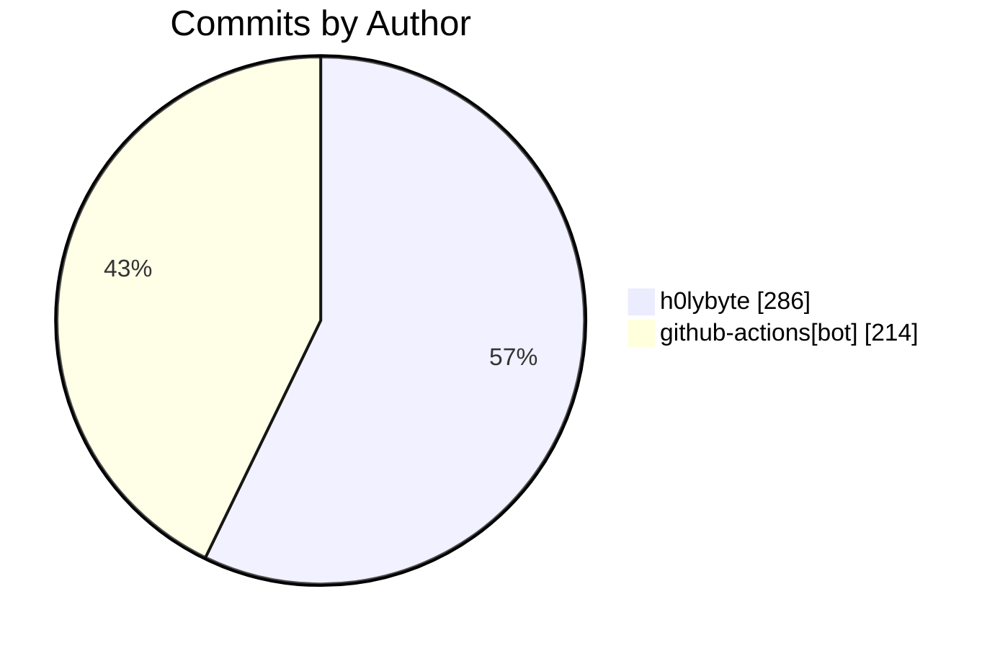

import BentoShell from '@/components/hero/BentoShell.astro';
import BentoProse from '@/components/hero/BentoProse.astro';

<section class="bento-hero bento-section not-content" aria-label="Activity pulse">
	

	

		

			

				
					<svg viewBox="0 0 24 24" width="14" height="14" fill="none" stroke="currentColor" stroke-width="1.75" stroke-linecap="round" stroke-linejoin="round" aria-hidden="true"><path d="M22 12h-4l-3 9L9 3l-3 9H2" /></svg>
					auto-generated · daily
				
				<h1 class="bento-title">
					Repository pulse
					commits, PRs, and issues.
				</h1>
				
<strong>500</strong> commits from <strong>2</strong> contributors — <strong>462</strong> PRs merged (7d).

				
Last generated <strong>2026-08-03T04:29:46Z</strong>.

				

					<a class="bento-btn bento-btn--primary" href="#leaderboard">
						View leaderboard
						<svg viewBox="0 0 24 24" fill="none" stroke="currentColor" aria-hidden="true"><path stroke-linecap="round" stroke-linejoin="round" stroke-width="2" d="M5 12h14M13 6l6 6-6 6" /></svg>
					</a>
					<a class="bento-btn bento-btn--ghost" href="#commits">Commits</a>
					<a class="bento-btn bento-btn--ghost" href="/dashboard/">Dashboard home</a>
				

			

				

					
						<svg viewBox="0 0 24 24" width="16" height="16" fill="none" stroke="currentColor" stroke-width="1.75" stroke-linecap="round" stroke-linejoin="round" aria-hidden="true"><path d="M6 3v12M18 9a3 3 0 1 0 0-6 3 3 0 0 0 0 6zM6 21a3 3 0 1 0 0-6 3 3 0 0 0 0 6zM15 6a9 9 0 0 1-9 9" /></svg>
					
					500
					Commits (7d)
				

				

					
						<svg viewBox="0 0 24 24" width="16" height="16" fill="none" stroke="currentColor" stroke-width="1.75" stroke-linecap="round" stroke-linejoin="round" aria-hidden="true"><path d="M16 21v-2a4 4 0 0 0-4-4H6a4 4 0 0 0-4 4v2M9 11a4 4 0 1 0 0-8 4 4 0 0 0 0 8zM22 21v-2a4 4 0 0 0-3-3.9" /></svg>
					
					2
					Contributors
				

				

					
						<svg viewBox="0 0 24 24" width="16" height="16" fill="none" stroke="currentColor" stroke-width="1.75" stroke-linecap="round" stroke-linejoin="round" aria-hidden="true"><path d="M18 9a3 3 0 1 0 0-6 3 3 0 0 0 0 6zM6 21a3 3 0 1 0 0-6 3 3 0 0 0 0 6zM6 15V9M18 6a9 9 0 0 1-9 9" /></svg>
					
					462
					PRs merged
				

				

					
						<svg viewBox="0 0 24 24" width="16" height="16" fill="none" stroke="currentColor" stroke-width="1.75" stroke-linecap="round" stroke-linejoin="round" aria-hidden="true"><path d="M12 2a10 10 0 1 0 0 20 10 10 0 0 0 0-20zM12 8v4m0 4h.01" /></svg>
					
					470
					Issues opened
				

				

					
						<svg viewBox="0 0 24 24" width="16" height="16" fill="none" stroke="currentColor" stroke-width="1.75" stroke-linecap="round" stroke-linejoin="round" aria-hidden="true"><path d="M22 11.1V12a10 10 0 1 1-5.9-9.1M22 4 12 14.01l-3-3" /></svg>
					
					469
					Issues closed
				

		

		<nav class="bento-jump" aria-label="On this page">
			<a class="bento-chip" href="#leaderboard">Leaderboard</a>
			<a class="bento-chip" href="#commits">Commits</a>
		</nav>
	

</section>

<BentoShell id="leaderboard" eyebrow="Contributors" heading="Top contributors">
	

		<a class="bento-cell bento-linkcard bento-card bento-card--glass bento-card--interactive" href="#commits">
			
				<svg viewBox="0 0 24 24" width="18" height="18" fill="none" stroke="currentColor" stroke-width="1.75" stroke-linecap="round" stroke-linejoin="round" aria-hidden="true"><path d="M16 21v-2a4 4 0 0 0-4-4H6a4 4 0 0 0-4 4v2M9 11a4 4 0 1 0 0-8 4 4 0 0 0 0 8z" /></svg>
			
			h0lybyte
			286 commits
			
				<svg viewBox="0 0 24 24" width="16" height="16" fill="none" stroke="currentColor" stroke-width="2" stroke-linecap="round" stroke-linejoin="round"><path d="M5 12h14M13 6l6 6-6 6" /></svg>
			
		</a>
		<a class="bento-cell bento-linkcard bento-card bento-card--glass bento-card--interactive" href="#commits">
			
				<svg viewBox="0 0 24 24" width="18" height="18" fill="none" stroke="currentColor" stroke-width="1.75" stroke-linecap="round" stroke-linejoin="round" aria-hidden="true"><path d="M16 21v-2a4 4 0 0 0-4-4H6a4 4 0 0 0-4 4v2M9 11a4 4 0 1 0 0-8 4 4 0 0 0 0 8z" /></svg>
			
			github-actions[bot]
			214 commits
			
				<svg viewBox="0 0 24 24" width="16" height="16" fill="none" stroke="currentColor" stroke-width="2" stroke-linecap="round" stroke-linejoin="round"><path d="M5 12h14M13 6l6 6-6 6" /></svg>
			
		</a>
	

</BentoShell>

<BentoProse id="commits" heading="Activity detail">

```mermaid
pie showData
    title Commits by Author
    "h0lybyte" : 286
    "github-actions[bot]" : 214
```

### Recent commits

| SHA | Author | Message |
|-----|--------|---------|
| [`b3031ad`](https://github.com/KBVE/kbve/commit/b3031ad7ce5e84a23364c388328fdc94a9b7daba) | h0lybyte | Merge pull request #15200 from KBVE/dev |
| [`472b8c4`](https://github.com/KBVE/kbve/commit/472b8c48c5ad0b81730eea83c204c404fc02fb45) | github-actions[bot] | chore(herbmail-game): post-publish sync to v0.1.17 (#15199) |
| [`50ce658`](https://github.com/KBVE/kbve/commit/50ce658f473b1a402ad07c384c5a455c94a00567) | github-actions[bot] | chore(ci): sync ci-dispatch-manifest [skip ci] (#15198) |
| [`5d602a3`](https://github.com/KBVE/kbve/commit/5d602a35c152dc93cfd3ba2d60e93bd5bdd1044a) | h0lybyte | Merge pull request #15196 from KBVE/dev |
| [`d9e5188`](https://github.com/KBVE/kbve/commit/d9e5188d3965c01bb066638ecf39e17fcac0f3c4) | h0lybyte | chore(herbmail): preparing the release of v0.1.17 |
| [`bc82a45`](https://github.com/KBVE/kbve/commit/bc82a455c385a1fa3ba0051eefa7e1ff9ad2bab7) | h0lybyte | fix(herbmail-game): stop gltfpack thinning animation tracks in prod buil |
| [`99e7ca3`](https://github.com/KBVE/kbve/commit/99e7ca3a0fa180e022c77b12331b8a89a01231eb) | github-actions[bot] | chore(axum-kbve): post-publish sync to v1.0.267 (#15197) |
| [`5eb3ea5`](https://github.com/KBVE/kbve/commit/5eb3ea55078bef4732b167c387d4eb13930c0ea6) | github-actions[bot] | chore(herbmail-game): post-publish sync to v0.1.16 (#15195) |
| [`d633440`](https://github.com/KBVE/kbve/commit/d633440ebaea89c901ff09fc5e238ac73ee702d3) | h0lybyte | Merge pull request #15193 from KBVE/dev |
| [`4a744ee`](https://github.com/KBVE/kbve/commit/4a744eea015cd205a96deb54134675d2b08ecac3) | h0lybyte | fix(isometric): allow swc/esbuild builds so pnpm install passes (#15194) |
| [`b008284`](https://github.com/KBVE/kbve/commit/b008284367af424b166ba9ff40310763c3a58251) | h0lybyte | fix(docker): mirror workspace.dependencies into Cargo stub manifests (#1 |
| [`5727ba5`](https://github.com/KBVE/kbve/commit/5727ba53d7a11d52836a98ce70af0823756eb391) | github-actions[bot] | chore(ci): sync ci-dispatch-manifest [skip ci] (#15183) |

### Recently merged PRs

| # | Title | Author |
|---|-------|--------|
| [#15200](https://github.com/KBVE/kbve/pull/15200) | Release: 2 chores → Main | github-actions[bot] |
| [#15199](https://github.com/KBVE/kbve/pull/15199) | Atomic: herbmail-game v0.1.17 post-publish sync | github-actions[bot] |
| [#15198](https://github.com/KBVE/kbve/pull/15198) | chore(ci): sync ci-dispatch-manifest | github-actions[bot] |
| [#15196](https://github.com/KBVE/kbve/pull/15196) | Release: 1 fix, 3 chores → Main | github-actions[bot] |
| [#15197](https://github.com/KBVE/kbve/pull/15197) | Atomic: axum-kbve v1.0.267 post-publish sync | github-actions[bot] |
| [#15195](https://github.com/KBVE/kbve/pull/15195) | Atomic: herbmail-game v0.1.16 post-publish sync | github-actions[bot] |
| [#15193](https://github.com/KBVE/kbve/pull/15193) | Release: 2 fixes, 1 chore → Main | github-actions[bot] |
| [#15194](https://github.com/KBVE/kbve/pull/15194) | fix(isometric): allow swc/esbuild builds so pnpm install passes | h0lybyte |
| [#15192](https://github.com/KBVE/kbve/pull/15192) | fix(docker): mirror workspace.dependencies into Cargo stub manifests | h0lybyte |
| [#15183](https://github.com/KBVE/kbve/pull/15183) | chore(ci): sync ci-dispatch-manifest | github-actions[bot] |

</BentoProse>

<BentoProse id="about">

---

*Auto-generated by [ci-daily-content.yml](https://github.com/KBVE/kbve/actions/workflows/ci-daily-content.yml)*

</BentoProse>

