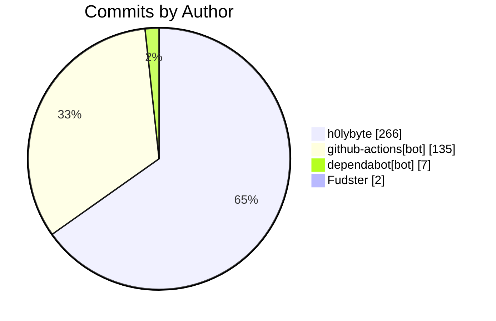

import BentoShell from '@/components/hero/BentoShell.astro';
import BentoProse from '@/components/hero/BentoProse.astro';

<section class="bento-hero bento-section not-content" aria-label="Activity pulse">
	

	

		

			

				
					<svg viewBox="0 0 24 24" width="14" height="14" fill="none" stroke="currentColor" stroke-width="1.75" stroke-linecap="round" stroke-linejoin="round" aria-hidden="true"><path d="M22 12h-4l-3 9L9 3l-3 9H2" /></svg>
					auto-generated · daily
				
				<h1 class="bento-title">
					Repository pulse
					commits, PRs, and issues.
				</h1>
				
<strong>410</strong> commits from <strong>4</strong> contributors — <strong>366</strong> PRs merged (7d).

				
Last generated <strong>2026-07-25T04:10:18Z</strong>.

				

					<a class="bento-btn bento-btn--primary" href="#leaderboard">
						View leaderboard
						<svg viewBox="0 0 24 24" fill="none" stroke="currentColor" aria-hidden="true"><path stroke-linecap="round" stroke-linejoin="round" stroke-width="2" d="M5 12h14M13 6l6 6-6 6" /></svg>
					</a>
					<a class="bento-btn bento-btn--ghost" href="#commits">Commits</a>
					<a class="bento-btn bento-btn--ghost" href="/dashboard/">Dashboard home</a>
				

			

				

					
						<svg viewBox="0 0 24 24" width="16" height="16" fill="none" stroke="currentColor" stroke-width="1.75" stroke-linecap="round" stroke-linejoin="round" aria-hidden="true"><path d="M6 3v12M18 9a3 3 0 1 0 0-6 3 3 0 0 0 0 6zM6 21a3 3 0 1 0 0-6 3 3 0 0 0 0 6zM15 6a9 9 0 0 1-9 9" /></svg>
					
					410
					Commits (7d)
				

				

					
						<svg viewBox="0 0 24 24" width="16" height="16" fill="none" stroke="currentColor" stroke-width="1.75" stroke-linecap="round" stroke-linejoin="round" aria-hidden="true"><path d="M16 21v-2a4 4 0 0 0-4-4H6a4 4 0 0 0-4 4v2M9 11a4 4 0 1 0 0-8 4 4 0 0 0 0 8zM22 21v-2a4 4 0 0 0-3-3.9" /></svg>
					
					4
					Contributors
				

				

					
						<svg viewBox="0 0 24 24" width="16" height="16" fill="none" stroke="currentColor" stroke-width="1.75" stroke-linecap="round" stroke-linejoin="round" aria-hidden="true"><path d="M18 9a3 3 0 1 0 0-6 3 3 0 0 0 0 6zM6 21a3 3 0 1 0 0-6 3 3 0 0 0 0 6zM6 15V9M18 6a9 9 0 0 1-9 9" /></svg>
					
					366
					PRs merged
				

				

					
						<svg viewBox="0 0 24 24" width="16" height="16" fill="none" stroke="currentColor" stroke-width="1.75" stroke-linecap="round" stroke-linejoin="round" aria-hidden="true"><path d="M12 2a10 10 0 1 0 0 20 10 10 0 0 0 0-20zM12 8v4m0 4h.01" /></svg>
					
					373
					Issues opened
				

				

					
						<svg viewBox="0 0 24 24" width="16" height="16" fill="none" stroke="currentColor" stroke-width="1.75" stroke-linecap="round" stroke-linejoin="round" aria-hidden="true"><path d="M22 11.1V12a10 10 0 1 1-5.9-9.1M22 4 12 14.01l-3-3" /></svg>
					
					368
					Issues closed
				

		

		<nav class="bento-jump" aria-label="On this page">
			<a class="bento-chip" href="#leaderboard">Leaderboard</a>
			<a class="bento-chip" href="#commits">Commits</a>
		</nav>
	

</section>

<BentoShell id="leaderboard" eyebrow="Contributors" heading="Top contributors">
	

		<a class="bento-cell bento-linkcard bento-card bento-card--glass bento-card--interactive" href="#commits">
			
				<svg viewBox="0 0 24 24" width="18" height="18" fill="none" stroke="currentColor" stroke-width="1.75" stroke-linecap="round" stroke-linejoin="round" aria-hidden="true"><path d="M16 21v-2a4 4 0 0 0-4-4H6a4 4 0 0 0-4 4v2M9 11a4 4 0 1 0 0-8 4 4 0 0 0 0 8z" /></svg>
			
			h0lybyte
			266 commits
			
				<svg viewBox="0 0 24 24" width="16" height="16" fill="none" stroke="currentColor" stroke-width="2" stroke-linecap="round" stroke-linejoin="round"><path d="M5 12h14M13 6l6 6-6 6" /></svg>
			
		</a>
		<a class="bento-cell bento-linkcard bento-card bento-card--glass bento-card--interactive" href="#commits">
			
				<svg viewBox="0 0 24 24" width="18" height="18" fill="none" stroke="currentColor" stroke-width="1.75" stroke-linecap="round" stroke-linejoin="round" aria-hidden="true"><path d="M16 21v-2a4 4 0 0 0-4-4H6a4 4 0 0 0-4 4v2M9 11a4 4 0 1 0 0-8 4 4 0 0 0 0 8z" /></svg>
			
			github-actions[bot]
			135 commits
			
				<svg viewBox="0 0 24 24" width="16" height="16" fill="none" stroke="currentColor" stroke-width="2" stroke-linecap="round" stroke-linejoin="round"><path d="M5 12h14M13 6l6 6-6 6" /></svg>
			
		</a>
		<a class="bento-cell bento-linkcard bento-card bento-card--glass bento-card--interactive" href="#commits">
			
				<svg viewBox="0 0 24 24" width="18" height="18" fill="none" stroke="currentColor" stroke-width="1.75" stroke-linecap="round" stroke-linejoin="round" aria-hidden="true"><path d="M16 21v-2a4 4 0 0 0-4-4H6a4 4 0 0 0-4 4v2M9 11a4 4 0 1 0 0-8 4 4 0 0 0 0 8z" /></svg>
			
			dependabot[bot]
			7 commits
			
				<svg viewBox="0 0 24 24" width="16" height="16" fill="none" stroke="currentColor" stroke-width="2" stroke-linecap="round" stroke-linejoin="round"><path d="M5 12h14M13 6l6 6-6 6" /></svg>
			
		</a>
		<a class="bento-cell bento-linkcard bento-card bento-card--glass bento-card--interactive" href="#commits">
			
				<svg viewBox="0 0 24 24" width="18" height="18" fill="none" stroke="currentColor" stroke-width="1.75" stroke-linecap="round" stroke-linejoin="round" aria-hidden="true"><path d="M16 21v-2a4 4 0 0 0-4-4H6a4 4 0 0 0-4 4v2M9 11a4 4 0 1 0 0-8 4 4 0 0 0 0 8z" /></svg>
			
			Fudster
			2 commits
			
				<svg viewBox="0 0 24 24" width="16" height="16" fill="none" stroke="currentColor" stroke-width="2" stroke-linecap="round" stroke-linejoin="round"><path d="M5 12h14M13 6l6 6-6 6" /></svg>
			
		</a>
	

</BentoShell>

<BentoProse id="commits" heading="Activity detail">

```mermaid
pie showData
    title Commits by Author
    "h0lybyte" : 266
    "github-actions[bot]" : 135
    "dependabot[bot]" : 7
    "Fudster" : 2
```

### Recent commits

| SHA | Author | Message |
|-----|--------|---------|
| [`e08cd94`](https://github.com/KBVE/kbve/commit/e08cd94e65b64af920787a87e96d6735f745a08d) | h0lybyte | Merge pull request #14627 from KBVE/dev |
| [`dcb4a79`](https://github.com/KBVE/kbve/commit/dcb4a7975e4be164f6ec05e4a679cc1d3ba3428c) | github-actions[bot] | chore(agones-palworld): post-publish sync to v0.0.11 (#14626) |
| [`8ef714b`](https://github.com/KBVE/kbve/commit/8ef714b4aedcd2a1448509654aa72315aef71d1f) | h0lybyte | Merge pull request #14622 from KBVE/dev |
| [`65d7bf1`](https://github.com/KBVE/kbve/commit/65d7bf17f95338365e60397b06659fd10d914a37) | github-actions[bot] | chore(ci): sync ci-dispatch-manifest [skip ci] (#14625) |
| [`96e4baf`](https://github.com/KBVE/kbve/commit/96e4baf007b3527dafbb1d987f6f2ca229add874) | h0lybyte | fix(palworld): prune fabricated chat-hook candidates from PalChatRelay ( |
| [`c479da2`](https://github.com/KBVE/kbve/commit/c479da274863547f549627e15b3bee8fe2089978) | github-actions[bot] | chore(discordsh-bot): post-publish sync to v0.1.29 (#14623) |
| [`5cba852`](https://github.com/KBVE/kbve/commit/5cba852d425bccf43c2bc84d2e128e1cc777e397) | github-actions[bot] | chore(agones-palworld-relay): post-publish sync to v0.0.7 (#14621) |
| [`0ad49db`](https://github.com/KBVE/kbve/commit/0ad49dbfbdaa3c594efa7bc2bfe5d81ac80232d6) | h0lybyte | Merge pull request #14619 from KBVE/dev |
| [`eb3dc88`](https://github.com/KBVE/kbve/commit/eb3dc88537c8db7a7d783963ef09c3fefff9a11d) | github-actions[bot] | chore(ci): sync ci-dispatch-manifest [skip ci] (#14620) |
| [`9985ad0`](https://github.com/KBVE/kbve/commit/9985ad03858e794ff174b58f1bf3cef3aeb74e62) | h0lybyte | fix(palworld): emit structured chat wire format so Discord shows [PAL] & |
| [`222be8e`](https://github.com/KBVE/kbve/commit/222be8e67637896f471c5ddcfbf0774c2cbb4bad) | h0lybyte | Merge pull request #14617 from KBVE/dev |
| [`e19e072`](https://github.com/KBVE/kbve/commit/e19e0729c13802c95fb259cba635c57522cc88d2) | h0lybyte | feat(graph): unify /graph/ into one graph digested at the wrapper level  |

### Recently merged PRs

| # | Title | Author |
|---|-------|--------|
| [#14628](https://github.com/KBVE/kbve/pull/14628) | feat(palworld): scaffold PalForge world-objects mod (not integrated) | h0lybyte |
| [#14627](https://github.com/KBVE/kbve/pull/14627) | Release: 1 chore → Main | github-actions[bot] |
| [#14626](https://github.com/KBVE/kbve/pull/14626) | Atomic: agones-palworld v0.0.11 post-publish sync | github-actions[bot] |
| [#14622](https://github.com/KBVE/kbve/pull/14622) | Release: 1 fix, 2 chores → Main | github-actions[bot] |
| [#14625](https://github.com/KBVE/kbve/pull/14625) | chore(ci): sync ci-dispatch-manifest | github-actions[bot] |
| [#14624](https://github.com/KBVE/kbve/pull/14624) | fix(palworld): prune fabricated chat-hook candidates from PalChatRelay | h0lybyte |
| [#14623](https://github.com/KBVE/kbve/pull/14623) | Atomic: discordsh-bot v0.1.29 post-publish sync | github-actions[bot] |
| [#14621](https://github.com/KBVE/kbve/pull/14621) | Atomic: agones-palworld-relay v0.0.7 post-publish sync | github-actions[bot] |
| [#14619](https://github.com/KBVE/kbve/pull/14619) | Release: 1 fix → Main | github-actions[bot] |
| [#14620](https://github.com/KBVE/kbve/pull/14620) | chore(ci): sync ci-dispatch-manifest | github-actions[bot] |

</BentoProse>

<BentoProse id="about">

---

*Auto-generated by [ci-daily-content.yml](https://github.com/KBVE/kbve/actions/workflows/ci-daily-content.yml)*

</BentoProse>

