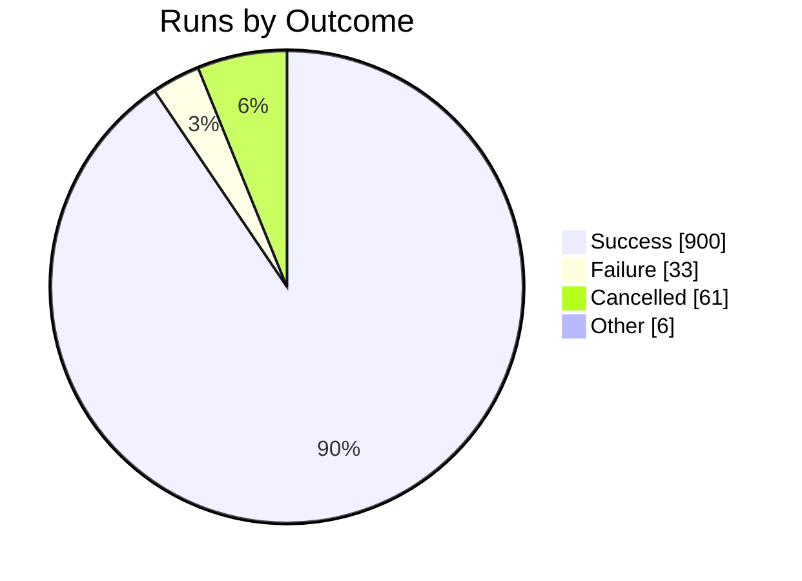
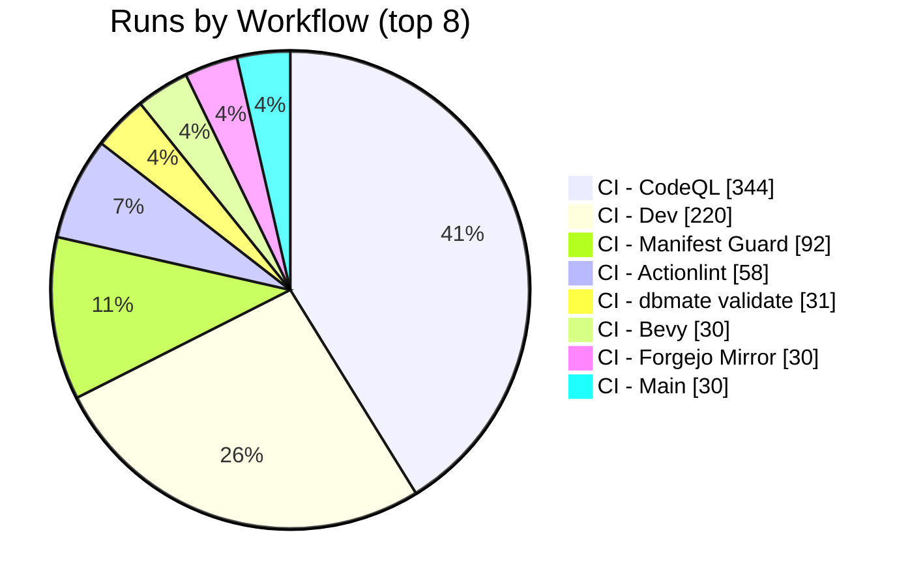

import BentoShell from '@/components/hero/BentoShell.astro';
import BentoProse from '@/components/hero/BentoProse.astro';

<section class="bento-hero bento-section not-content" aria-label="CI health">
	

	

		

			

				
					<svg viewBox="0 0 24 24" width="14" height="14" fill="none" stroke="currentColor" stroke-width="1.75" stroke-linecap="round" stroke-linejoin="round" aria-hidden="true"><path d="M22 12h-4l-3 9L9 3l-3 9H2" /></svg>
					auto-generated · daily
				
				<h1 class="bento-title">
					Pipeline health
					every workflow, every day.
				</h1>
				
<strong>96.5%</strong> success across <strong>1000</strong> runs (7d) — <strong>33</strong> failures, <strong>0</strong> flaky.

				
Last generated <strong>2026-07-20T04:35:59Z</strong>.

				

					<a class="bento-btn bento-btn--primary" href="#workflows">
						View workflows
						<svg viewBox="0 0 24 24" fill="none" stroke="currentColor" aria-hidden="true"><path stroke-linecap="round" stroke-linejoin="round" stroke-width="2" d="M5 12h14M13 6l6 6-6 6" /></svg>
					</a>
					<a class="bento-btn bento-btn--ghost" href="#failures">Failures</a>
					<a class="bento-btn bento-btn--ghost" href="/dashboard/">Dashboard home</a>
				

			

				

					
						<svg viewBox="0 0 24 24" width="16" height="16" fill="none" stroke="currentColor" stroke-width="1.75" stroke-linecap="round" stroke-linejoin="round" aria-hidden="true"><path d="M22 12h-4l-3 9L9 3l-3 9H2" /></svg>
					
					1000
					Runs (7d)
				

				

					
						<svg viewBox="0 0 24 24" width="16" height="16" fill="none" stroke="currentColor" stroke-width="1.75" stroke-linecap="round" stroke-linejoin="round" aria-hidden="true"><path d="M22 11.1V12a10 10 0 1 1-5.9-9.1M22 4 12 14.01l-3-3" /></svg>
					
					96.5%
					Success rate
				

				

					
						<svg viewBox="0 0 24 24" width="16" height="16" fill="none" stroke="currentColor" stroke-width="1.75" stroke-linecap="round" stroke-linejoin="round" aria-hidden="true"><path d="M12 2a10 10 0 1 0 0 20 10 10 0 0 0 0-20zM12 6v6l4 2" /></svg>
					
					4m 45s
					Avg duration
				

				

					
						<svg viewBox="0 0 24 24" width="16" height="16" fill="none" stroke="currentColor" stroke-width="1.75" stroke-linecap="round" stroke-linejoin="round" aria-hidden="true"><path d="M7.9 2h8.2L22 7.9v8.2L16.1 22H7.9L2 16.1V7.9zM15 9l-6 6M9 9l6 6" /></svg>
					
					33
					Failures
				

				

					
						<svg viewBox="0 0 24 24" width="16" height="16" fill="none" stroke="currentColor" stroke-width="1.75" stroke-linecap="round" stroke-linejoin="round" aria-hidden="true"><path d="M13 2 3 14h7l-1 8 10-12h-7z" /></svg>
					
					0
					Flaky
				

		

		<nav class="bento-jump" aria-label="On this page">
			<a class="bento-chip" href="#workflows">Workflows</a>
			<a class="bento-chip" href="#trends">Trends</a>
			<a class="bento-chip" href="#failures">Failures</a>
		</nav>
	

</section>

<BentoShell id="workflows" eyebrow="Volume" heading="Busiest workflows">
	

		<a class="bento-cell bento-linkcard bento-card bento-card--glass bento-card--interactive" href="#health-table">
			
				<svg viewBox="0 0 24 24" width="18" height="18" fill="none" stroke="currentColor" stroke-width="1.75" stroke-linecap="round" stroke-linejoin="round" aria-hidden="true"><path d="M6 3v12M18 9a3 3 0 1 0 0-6 3 3 0 0 0 0 6zM6 21a3 3 0 1 0 0-6 3 3 0 0 0 0 6zM15 6a9 9 0 0 1-9 9" /></svg>
			
			CI - CodeQL
			344 runs · 100.0% ok
			
				<svg viewBox="0 0 24 24" width="16" height="16" fill="none" stroke="currentColor" stroke-width="2" stroke-linecap="round" stroke-linejoin="round"><path d="M5 12h14M13 6l6 6-6 6" /></svg>
			
		</a>
		<a class="bento-cell bento-linkcard bento-card bento-card--glass bento-card--interactive" href="#health-table">
			
				<svg viewBox="0 0 24 24" width="18" height="18" fill="none" stroke="currentColor" stroke-width="1.75" stroke-linecap="round" stroke-linejoin="round" aria-hidden="true"><path d="M6 3v12M18 9a3 3 0 1 0 0-6 3 3 0 0 0 0 6zM6 21a3 3 0 1 0 0-6 3 3 0 0 0 0 6zM15 6a9 9 0 0 1-9 9" /></svg>
			
			CI - Dev
			220 runs · 94.3% ok
			
				<svg viewBox="0 0 24 24" width="16" height="16" fill="none" stroke="currentColor" stroke-width="2" stroke-linecap="round" stroke-linejoin="round"><path d="M5 12h14M13 6l6 6-6 6" /></svg>
			
		</a>
		<a class="bento-cell bento-linkcard bento-card bento-card--glass bento-card--interactive" href="#health-table">
			
				<svg viewBox="0 0 24 24" width="18" height="18" fill="none" stroke="currentColor" stroke-width="1.75" stroke-linecap="round" stroke-linejoin="round" aria-hidden="true"><path d="M6 3v12M18 9a3 3 0 1 0 0-6 3 3 0 0 0 0 6zM6 21a3 3 0 1 0 0-6 3 3 0 0 0 0 6zM15 6a9 9 0 0 1-9 9" /></svg>
			
			CI - Manifest Guard
			92 runs · 100.0% ok
			
				<svg viewBox="0 0 24 24" width="16" height="16" fill="none" stroke="currentColor" stroke-width="2" stroke-linecap="round" stroke-linejoin="round"><path d="M5 12h14M13 6l6 6-6 6" /></svg>
			
		</a>
		<a class="bento-cell bento-linkcard bento-card bento-card--glass bento-card--interactive" href="#health-table">
			
				<svg viewBox="0 0 24 24" width="18" height="18" fill="none" stroke="currentColor" stroke-width="1.75" stroke-linecap="round" stroke-linejoin="round" aria-hidden="true"><path d="M6 3v12M18 9a3 3 0 1 0 0-6 3 3 0 0 0 0 6zM6 21a3 3 0 1 0 0-6 3 3 0 0 0 0 6zM15 6a9 9 0 0 1-9 9" /></svg>
			
			CI - Actionlint
			58 runs · 98.0% ok
			
				<svg viewBox="0 0 24 24" width="16" height="16" fill="none" stroke="currentColor" stroke-width="2" stroke-linecap="round" stroke-linejoin="round"><path d="M5 12h14M13 6l6 6-6 6" /></svg>
			
		</a>
		<a class="bento-cell bento-linkcard bento-card bento-card--glass bento-card--interactive" href="#health-table">
			
				<svg viewBox="0 0 24 24" width="18" height="18" fill="none" stroke="currentColor" stroke-width="1.75" stroke-linecap="round" stroke-linejoin="round" aria-hidden="true"><path d="M6 3v12M18 9a3 3 0 1 0 0-6 3 3 0 0 0 0 6zM6 21a3 3 0 1 0 0-6 3 3 0 0 0 0 6zM15 6a9 9 0 0 1-9 9" /></svg>
			
			CI - dbmate validate
			31 runs · 87.1% ok
			
				<svg viewBox="0 0 24 24" width="16" height="16" fill="none" stroke="currentColor" stroke-width="2" stroke-linecap="round" stroke-linejoin="round"><path d="M5 12h14M13 6l6 6-6 6" /></svg>
			
		</a>
		<a class="bento-cell bento-linkcard bento-card bento-card--glass bento-card--interactive" href="#health-table">
			
				<svg viewBox="0 0 24 24" width="18" height="18" fill="none" stroke="currentColor" stroke-width="1.75" stroke-linecap="round" stroke-linejoin="round" aria-hidden="true"><path d="M6 3v12M18 9a3 3 0 1 0 0-6 3 3 0 0 0 0 6zM6 21a3 3 0 1 0 0-6 3 3 0 0 0 0 6zM15 6a9 9 0 0 1-9 9" /></svg>
			
			CI - Bevy
			30 runs · 100.0% ok
			
				<svg viewBox="0 0 24 24" width="16" height="16" fill="none" stroke="currentColor" stroke-width="2" stroke-linecap="round" stroke-linejoin="round"><path d="M5 12h14M13 6l6 6-6 6" /></svg>
			
		</a>
		<a class="bento-cell bento-linkcard bento-card bento-card--glass bento-card--interactive" href="#health-table">
			
				<svg viewBox="0 0 24 24" width="18" height="18" fill="none" stroke="currentColor" stroke-width="1.75" stroke-linecap="round" stroke-linejoin="round" aria-hidden="true"><path d="M6 3v12M18 9a3 3 0 1 0 0-6 3 3 0 0 0 0 6zM6 21a3 3 0 1 0 0-6 3 3 0 0 0 0 6zM15 6a9 9 0 0 1-9 9" /></svg>
			
			CI - Forgejo Mirror
			30 runs · 100.0% ok
			
				<svg viewBox="0 0 24 24" width="16" height="16" fill="none" stroke="currentColor" stroke-width="2" stroke-linecap="round" stroke-linejoin="round"><path d="M5 12h14M13 6l6 6-6 6" /></svg>
			
		</a>
		<a class="bento-cell bento-linkcard bento-card bento-card--glass bento-card--interactive" href="#health-table">
			
				<svg viewBox="0 0 24 24" width="18" height="18" fill="none" stroke="currentColor" stroke-width="1.75" stroke-linecap="round" stroke-linejoin="round" aria-hidden="true"><path d="M6 3v12M18 9a3 3 0 1 0 0-6 3 3 0 0 0 0 6zM6 21a3 3 0 1 0 0-6 3 3 0 0 0 0 6zM15 6a9 9 0 0 1-9 9" /></svg>
			
			CI - Main
			30 runs · 100.0% ok
			
				<svg viewBox="0 0 24 24" width="16" height="16" fill="none" stroke="currentColor" stroke-width="2" stroke-linecap="round" stroke-linejoin="round"><path d="M5 12h14M13 6l6 6-6 6" /></svg>
			
		</a>
		<a class="bento-cell bento-linkcard bento-card bento-card--glass bento-card--interactive" href="#health-table">
			
				<svg viewBox="0 0 24 24" width="18" height="18" fill="none" stroke="currentColor" stroke-width="1.75" stroke-linecap="round" stroke-linejoin="round" aria-hidden="true"><path d="M6 3v12M18 9a3 3 0 1 0 0-6 3 3 0 0 0 0 6zM6 21a3 3 0 1 0 0-6 3 3 0 0 0 0 6zM15 6a9 9 0 0 1-9 9" /></svg>
			
			CI - Manifest Sync
			30 runs · 100.0% ok
			
				<svg viewBox="0 0 24 24" width="16" height="16" fill="none" stroke="currentColor" stroke-width="2" stroke-linecap="round" stroke-linejoin="round"><path d="M5 12h14M13 6l6 6-6 6" /></svg>
			
		</a>
	

</BentoShell>

<BentoProse id="trends" heading="Trends">

### Outcome distribution

### Volume by workflow

### Last 24 hours

**510** runs · **440** ok · **14** failed · **96.9%** success rate.

### Per-workflow health

| Workflow | Runs | OK | Fail | Success | Avg | Flaky |
|----------|:----:|:--:|:----:|:-------:|:---:|:-----:|
| CI - CodeQL | 344 | 318 | 0 | 100.0% | 3m 45s | 0 |
| CI - Dev | 220 | 181 | 11 | 94.3% | 7m 18s | 0 |
| CI - Manifest Guard | 92 | 88 | 0 | 100.0% | 2m 25s | 0 |
| CI - Actionlint | 58 | 50 | 1 | 98.0% | 34s | 0 |
| CI - dbmate validate | 31 | 27 | 4 | 87.1% | 3m 48s | 0 |
| CI - Bevy | 30 | 30 | 0 | 100.0% | 25s | 0 |
| CI - Forgejo Mirror | 30 | 30 | 0 | 100.0% | 1m 8s | 0 |
| CI - Main | 30 | 30 | 0 | 100.0% | 1m 48s | 0 |
| CI - Manifest Sync | 30 | 30 | 0 | 100.0% | 3m 19s | 0 |
| Auto-merge bot PRs | 28 | 26 | 1 | 96.3% | 31s | 0 |
| CI - Docker / axum-kbve | 21 | 15 | 6 | 71.4% | 32m 4s | 0 |
| Windmill Sync | 17 | 8 | 9 | 47.1% | 1m 0s | 0 |
| CI - Docker / discordsh-bot | 14 | 14 | 0 | 100.0% | 16m 45s | 0 |
| CI - Docker / discordsh | 12 | 12 | 0 | 100.0% | 16m 20s | 0 |
| CI - MC Smoke | 11 | 11 | 0 | 100.0% | 2m 42s | 0 |
| CI - Publish / python / python-kbve | 7 | 6 | 1 | 85.7% | 2m 49s | 0 |
| CI - Publish / npm / devops | 6 | 6 | 0 | 100.0% | 4m 1s | 0 |
| Organize Labels | 6 | 6 | 0 | 100.0% | 18s | 0 |
| Daily Content | 4 | 3 | 0 | 100.0% | 2m 46s | 0 |
| CI - Atomic Branches | 2 | 2 | 0 | 100.0% | 7m 13s | 0 |
| CI - Daily Dashboard | 2 | 2 | 0 | 100.0% | 10m 17s | 0 |
| CI - Docker / mc-velocity | 2 | 2 | 0 | 100.0% | 10m 2s | 0 |
| CI - Registry Cleanup (GHCR) | 1 | 1 | 0 | 100.0% | 40s | 0 |
| CI - dbmate deploy | 1 | 1 | 0 | 100.0% | 6m 8s | 0 |
| Graph Update: uv in /packages/python/kbve #1466055207 | 1 | 1 | 0 | 100.0% | 58s | 0 |

</BentoProse>

<BentoProse id="failures" heading="Recent failures">

| Workflow | Branch | Event | Finished | Link |
|----------|--------|-------|----------|------|
| CI - Dev | dev | pull_request | 2026-07-19 23:22 | [run](https://github.com/KBVE/kbve/actions/runs/29706938622) |
| CI - Dev | dev | pull_request | 2026-07-19 22:36 | [run](https://github.com/KBVE/kbve/actions/runs/29706106763) |
| CI - Dev | dev | pull_request | 2026-07-19 22:12 | [run](https://github.com/KBVE/kbve/actions/runs/29704942824) |
| CI - Dev | dev | pull_request | 2026-07-19 21:51 | [run](https://github.com/KBVE/kbve/actions/runs/29704778860) |
| CI - Dev | dev | push | 2026-07-19 21:41 | [run](https://github.com/KBVE/kbve/actions/runs/29704776992) |
| CI - Dev | dev | pull_request | 2026-07-19 21:18 | [run](https://github.com/KBVE/kbve/actions/runs/29702552151) |
| CI - Publish / python / python-kbve | main | workflow_dispatch | 2026-07-19 21:14 | [run](https://github.com/KBVE/kbve/actions/runs/29703926669) |
| CI - Docker / axum-kbve | main | workflow_dispatch | 2026-07-19 08:47 | [run](https://github.com/KBVE/kbve/actions/runs/29680120761) |
| CI - Dev | dev | pull_request | 2026-07-19 08:36 | [run](https://github.com/KBVE/kbve/actions/runs/29679329622) |
| CI - Dev | dev | pull_request | 2026-07-19 07:25 | [run](https://github.com/KBVE/kbve/actions/runs/29677483778) |
| CI - Docker / axum-kbve | main | workflow_dispatch | 2026-07-19 07:20 | [run](https://github.com/KBVE/kbve/actions/runs/29677652775) |
| CI - Actionlint | feat/kbve-nx-stage3-retire | pull_request | 2026-07-19 06:57 | [run](https://github.com/KBVE/kbve/actions/runs/29677274309) |
| Windmill Sync | dev | workflow_dispatch | 2026-07-19 04:54 | [run](https://github.com/KBVE/kbve/actions/runs/29674012141) |
| Windmill Sync | main | push | 2026-07-19 04:43 | [run](https://github.com/KBVE/kbve/actions/runs/29673723134) |
| CI - dbmate validate | feat/astro-kbve-store-poc | pull_request | 2026-07-19 02:56 | [run](https://github.com/KBVE/kbve/actions/runs/29670890063) |

</BentoProse>

<BentoProse id="about">

---

*Auto-generated by [ci-daily-content.yml](https://github.com/KBVE/kbve/actions/workflows/ci-daily-content.yml)*

</BentoProse>

