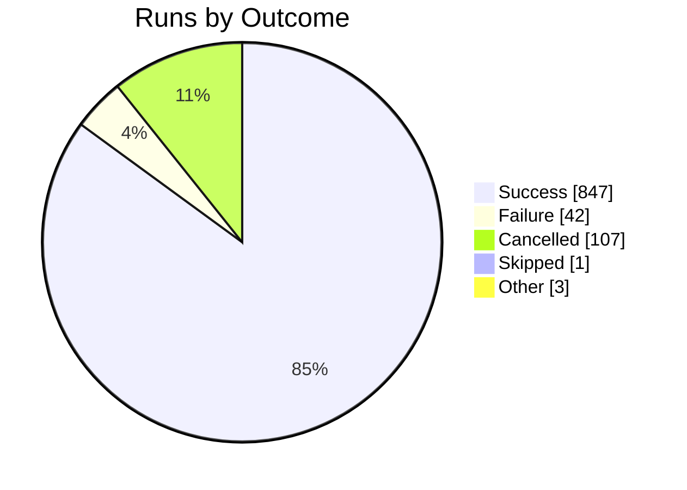
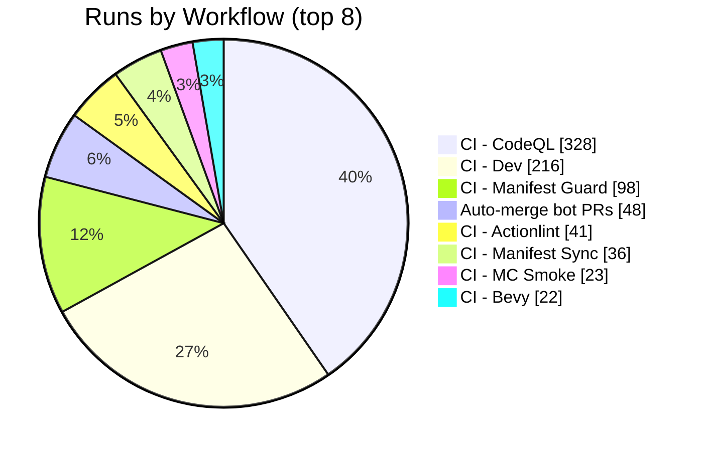

import BentoShell from '@/components/hero/BentoShell.astro';
import BentoProse from '@/components/hero/BentoProse.astro';

<section class="bento-hero bento-section not-content" aria-label="CI health">
	

	

		

			

				
					<svg viewBox="0 0 24 24" width="14" height="14" fill="none" stroke="currentColor" stroke-width="1.75" stroke-linecap="round" stroke-linejoin="round" aria-hidden="true"><path d="M22 12h-4l-3 9L9 3l-3 9H2" /></svg>
					auto-generated · daily
				
				<h1 class="bento-title">
					Pipeline health
					every workflow, every day.
				</h1>
				
<strong>95.3%</strong> success across <strong>1000</strong> runs (7d) — <strong>42</strong> failures, <strong>0</strong> flaky.

				
Last generated <strong>2026-07-22T04:17:09Z</strong>.

				

					<a class="bento-btn bento-btn--primary" href="#workflows">
						View workflows
						<svg viewBox="0 0 24 24" fill="none" stroke="currentColor" aria-hidden="true"><path stroke-linecap="round" stroke-linejoin="round" stroke-width="2" d="M5 12h14M13 6l6 6-6 6" /></svg>
					</a>
					<a class="bento-btn bento-btn--ghost" href="#failures">Failures</a>
					<a class="bento-btn bento-btn--ghost" href="/dashboard/">Dashboard home</a>
				

			

				

					
						<svg viewBox="0 0 24 24" width="16" height="16" fill="none" stroke="currentColor" stroke-width="1.75" stroke-linecap="round" stroke-linejoin="round" aria-hidden="true"><path d="M22 12h-4l-3 9L9 3l-3 9H2" /></svg>
					
					1000
					Runs (7d)
				

				

					
						<svg viewBox="0 0 24 24" width="16" height="16" fill="none" stroke="currentColor" stroke-width="1.75" stroke-linecap="round" stroke-linejoin="round" aria-hidden="true"><path d="M22 11.1V12a10 10 0 1 1-5.9-9.1M22 4 12 14.01l-3-3" /></svg>
					
					95.3%
					Success rate
				

				

					
						<svg viewBox="0 0 24 24" width="16" height="16" fill="none" stroke="currentColor" stroke-width="1.75" stroke-linecap="round" stroke-linejoin="round" aria-hidden="true"><path d="M12 2a10 10 0 1 0 0 20 10 10 0 0 0 0-20zM12 6v6l4 2" /></svg>
					
					6m 14s
					Avg duration
				

				

					
						<svg viewBox="0 0 24 24" width="16" height="16" fill="none" stroke="currentColor" stroke-width="1.75" stroke-linecap="round" stroke-linejoin="round" aria-hidden="true"><path d="M7.9 2h8.2L22 7.9v8.2L16.1 22H7.9L2 16.1V7.9zM15 9l-6 6M9 9l6 6" /></svg>
					
					42
					Failures
				

				

					
						<svg viewBox="0 0 24 24" width="16" height="16" fill="none" stroke="currentColor" stroke-width="1.75" stroke-linecap="round" stroke-linejoin="round" aria-hidden="true"><path d="M13 2 3 14h7l-1 8 10-12h-7z" /></svg>
					
					0
					Flaky
				

		

		<nav class="bento-jump" aria-label="On this page">
			<a class="bento-chip" href="#workflows">Workflows</a>
			<a class="bento-chip" href="#trends">Trends</a>
			<a class="bento-chip" href="#failures">Failures</a>
		</nav>
	

</section>

<BentoShell id="workflows" eyebrow="Volume" heading="Busiest workflows">
	

		<a class="bento-cell bento-linkcard bento-card bento-card--glass bento-card--interactive" href="#health-table">
			
				<svg viewBox="0 0 24 24" width="18" height="18" fill="none" stroke="currentColor" stroke-width="1.75" stroke-linecap="round" stroke-linejoin="round" aria-hidden="true"><path d="M6 3v12M18 9a3 3 0 1 0 0-6 3 3 0 0 0 0 6zM6 21a3 3 0 1 0 0-6 3 3 0 0 0 0 6zM15 6a9 9 0 0 1-9 9" /></svg>
			
			CI - CodeQL
			328 runs · 100.0% ok
			
				<svg viewBox="0 0 24 24" width="16" height="16" fill="none" stroke="currentColor" stroke-width="2" stroke-linecap="round" stroke-linejoin="round"><path d="M5 12h14M13 6l6 6-6 6" /></svg>
			
		</a>
		<a class="bento-cell bento-linkcard bento-card bento-card--glass bento-card--interactive" href="#health-table">
			
				<svg viewBox="0 0 24 24" width="18" height="18" fill="none" stroke="currentColor" stroke-width="1.75" stroke-linecap="round" stroke-linejoin="round" aria-hidden="true"><path d="M6 3v12M18 9a3 3 0 1 0 0-6 3 3 0 0 0 0 6zM6 21a3 3 0 1 0 0-6 3 3 0 0 0 0 6zM15 6a9 9 0 0 1-9 9" /></svg>
			
			CI - Dev
			216 runs · 87.7% ok
			
				<svg viewBox="0 0 24 24" width="16" height="16" fill="none" stroke="currentColor" stroke-width="2" stroke-linecap="round" stroke-linejoin="round"><path d="M5 12h14M13 6l6 6-6 6" /></svg>
			
		</a>
		<a class="bento-cell bento-linkcard bento-card bento-card--glass bento-card--interactive" href="#health-table">
			
				<svg viewBox="0 0 24 24" width="18" height="18" fill="none" stroke="currentColor" stroke-width="1.75" stroke-linecap="round" stroke-linejoin="round" aria-hidden="true"><path d="M6 3v12M18 9a3 3 0 1 0 0-6 3 3 0 0 0 0 6zM6 21a3 3 0 1 0 0-6 3 3 0 0 0 0 6zM15 6a9 9 0 0 1-9 9" /></svg>
			
			CI - Manifest Guard
			98 runs · 94.5% ok
			
				<svg viewBox="0 0 24 24" width="16" height="16" fill="none" stroke="currentColor" stroke-width="2" stroke-linecap="round" stroke-linejoin="round"><path d="M5 12h14M13 6l6 6-6 6" /></svg>
			
		</a>
		<a class="bento-cell bento-linkcard bento-card bento-card--glass bento-card--interactive" href="#health-table">
			
				<svg viewBox="0 0 24 24" width="18" height="18" fill="none" stroke="currentColor" stroke-width="1.75" stroke-linecap="round" stroke-linejoin="round" aria-hidden="true"><path d="M6 3v12M18 9a3 3 0 1 0 0-6 3 3 0 0 0 0 6zM6 21a3 3 0 1 0 0-6 3 3 0 0 0 0 6zM15 6a9 9 0 0 1-9 9" /></svg>
			
			Auto-merge bot PRs
			48 runs · 100.0% ok
			
				<svg viewBox="0 0 24 24" width="16" height="16" fill="none" stroke="currentColor" stroke-width="2" stroke-linecap="round" stroke-linejoin="round"><path d="M5 12h14M13 6l6 6-6 6" /></svg>
			
		</a>
		<a class="bento-cell bento-linkcard bento-card bento-card--glass bento-card--interactive" href="#health-table">
			
				<svg viewBox="0 0 24 24" width="18" height="18" fill="none" stroke="currentColor" stroke-width="1.75" stroke-linecap="round" stroke-linejoin="round" aria-hidden="true"><path d="M6 3v12M18 9a3 3 0 1 0 0-6 3 3 0 0 0 0 6zM6 21a3 3 0 1 0 0-6 3 3 0 0 0 0 6zM15 6a9 9 0 0 1-9 9" /></svg>
			
			CI - Actionlint
			41 runs · 96.9% ok
			
				<svg viewBox="0 0 24 24" width="16" height="16" fill="none" stroke="currentColor" stroke-width="2" stroke-linecap="round" stroke-linejoin="round"><path d="M5 12h14M13 6l6 6-6 6" /></svg>
			
		</a>
		<a class="bento-cell bento-linkcard bento-card bento-card--glass bento-card--interactive" href="#health-table">
			
				<svg viewBox="0 0 24 24" width="18" height="18" fill="none" stroke="currentColor" stroke-width="1.75" stroke-linecap="round" stroke-linejoin="round" aria-hidden="true"><path d="M6 3v12M18 9a3 3 0 1 0 0-6 3 3 0 0 0 0 6zM6 21a3 3 0 1 0 0-6 3 3 0 0 0 0 6zM15 6a9 9 0 0 1-9 9" /></svg>
			
			CI - Manifest Sync
			36 runs · 94.4% ok
			
				<svg viewBox="0 0 24 24" width="16" height="16" fill="none" stroke="currentColor" stroke-width="2" stroke-linecap="round" stroke-linejoin="round"><path d="M5 12h14M13 6l6 6-6 6" /></svg>
			
		</a>
		<a class="bento-cell bento-linkcard bento-card bento-card--glass bento-card--interactive" href="#health-table">
			
				<svg viewBox="0 0 24 24" width="18" height="18" fill="none" stroke="currentColor" stroke-width="1.75" stroke-linecap="round" stroke-linejoin="round" aria-hidden="true"><path d="M6 3v12M18 9a3 3 0 1 0 0-6 3 3 0 0 0 0 6zM6 21a3 3 0 1 0 0-6 3 3 0 0 0 0 6zM15 6a9 9 0 0 1-9 9" /></svg>
			
			CI - MC Smoke
			23 runs · 100.0% ok
			
				<svg viewBox="0 0 24 24" width="16" height="16" fill="none" stroke="currentColor" stroke-width="2" stroke-linecap="round" stroke-linejoin="round"><path d="M5 12h14M13 6l6 6-6 6" /></svg>
			
		</a>
		<a class="bento-cell bento-linkcard bento-card bento-card--glass bento-card--interactive" href="#health-table">
			
				<svg viewBox="0 0 24 24" width="18" height="18" fill="none" stroke="currentColor" stroke-width="1.75" stroke-linecap="round" stroke-linejoin="round" aria-hidden="true"><path d="M6 3v12M18 9a3 3 0 1 0 0-6 3 3 0 0 0 0 6zM6 21a3 3 0 1 0 0-6 3 3 0 0 0 0 6zM15 6a9 9 0 0 1-9 9" /></svg>
			
			CI - Bevy
			22 runs · 100.0% ok
			
				<svg viewBox="0 0 24 24" width="16" height="16" fill="none" stroke="currentColor" stroke-width="2" stroke-linecap="round" stroke-linejoin="round"><path d="M5 12h14M13 6l6 6-6 6" /></svg>
			
		</a>
		<a class="bento-cell bento-linkcard bento-card bento-card--glass bento-card--interactive" href="#health-table">
			
				<svg viewBox="0 0 24 24" width="18" height="18" fill="none" stroke="currentColor" stroke-width="1.75" stroke-linecap="round" stroke-linejoin="round" aria-hidden="true"><path d="M6 3v12M18 9a3 3 0 1 0 0-6 3 3 0 0 0 0 6zM6 21a3 3 0 1 0 0-6 3 3 0 0 0 0 6zM15 6a9 9 0 0 1-9 9" /></svg>
			
			CI - Forgejo Mirror
			22 runs · 100.0% ok
			
				<svg viewBox="0 0 24 24" width="16" height="16" fill="none" stroke="currentColor" stroke-width="2" stroke-linecap="round" stroke-linejoin="round"><path d="M5 12h14M13 6l6 6-6 6" /></svg>
			
		</a>
	

</BentoShell>

<BentoProse id="trends" heading="Trends">

### Outcome distribution

### Volume by workflow

### Last 24 hours

**142** runs · **133** ok · **2** failed · **98.5%** success rate.

### Per-workflow health

| Workflow | Runs | OK | Fail | Success | Avg | Flaky |
|----------|:----:|:--:|:----:|:-------:|:---:|:-----:|
| CI - CodeQL | 328 | 292 | 0 | 100.0% | 3m 51s | 0 |
| CI - Dev | 216 | 150 | 21 | 87.7% | 12m 52s | 0 |
| CI - Manifest Guard | 98 | 86 | 5 | 94.5% | 2m 33s | 0 |
| Auto-merge bot PRs | 48 | 48 | 0 | 100.0% | 35s | 0 |
| CI - Actionlint | 41 | 31 | 1 | 96.9% | 35s | 0 |
| CI - Manifest Sync | 36 | 34 | 2 | 94.4% | 3m 13s | 0 |
| CI - MC Smoke | 23 | 21 | 0 | 100.0% | 3m 0s | 0 |
| CI - Bevy | 22 | 22 | 0 | 100.0% | 25s | 0 |
| CI - Forgejo Mirror | 22 | 22 | 0 | 100.0% | 1m 11s | 0 |
| CI - Main | 22 | 22 | 0 | 100.0% | 1m 52s | 0 |
| CI - Docker / axum-kbve | 20 | 14 | 6 | 70.0% | 32m 11s | 0 |
| CI - MC Gradle Cache | 16 | 11 | 0 | 100.0% | 5m 28s | 0 |
| CI - MC Mods Cache | 16 | 12 | 0 | 100.0% | 3m 33s | 0 |
| CI - dbmate validate | 12 | 12 | 0 | 100.0% | 3m 44s | 0 |
| CI - Docker / discordsh | 9 | 9 | 0 | 100.0% | 16m 16s | 0 |
| CI - Publish / python / python-kbve | 8 | 5 | 3 | 62.5% | 4m 22s | 0 |
| CI - Docker / discordsh-bot | 7 | 7 | 0 | 100.0% | 16m 47s | 0 |
| Organize Labels | 7 | 7 | 0 | 100.0% | 17s | 0 |
| CI - Uniti | 5 | 5 | 0 | 100.0% | 8m 26s | 0 |
| Daily Content | 5 | 4 | 0 | 100.0% | 3m 54s | 0 |
| Windmill Sync | 5 | 5 | 0 | 100.0% | 1m 6s | 0 |
| CI - Docker / herbmail | 4 | 3 | 1 | 75.0% | 11m 56s | 0 |
| CI - Atomic Branches | 2 | 2 | 0 | 100.0% | 10m 34s | 0 |
| CI - Publish / crates / embeddb | 2 | 2 | 0 | 100.0% | 31m 0s | 0 |
| CI - Publish / npm / laser | 2 | 2 | 0 | 100.0% | 5m 50s | 0 |
| CI - Daily Dashboard | 1 | 1 | 0 | 100.0% | 9m 39s | 0 |
| CI - Docker / arc-runner | 1 | 1 | 0 | 100.0% | 11m 35s | 0 |
| CI - Docker / axum-chuckrpg | 1 | 1 | 0 | 100.0% | 12m 30s | 0 |
| CI - Docker / chisel-ubuntu-axum | 1 | 1 | 0 | 100.0% | 8m 7s | 0 |
| CI - Docker / cryptothrone | 1 | 0 | 1 | 0.0% | 12m 41s | 0 |
| CI - Docker / edge | 1 | 1 | 0 | 100.0% | 6m 37s | 0 |
| CI - Docker / irc-gateway | 1 | 1 | 0 | 100.0% | 16m 2s | 0 |
| CI - Docker / memes | 1 | 0 | 1 | 0.0% | 7m 16s | 0 |
| CI - E2E / main | 1 | 0 | 1 | 0.0% | 51m 37s | 0 |
| CI - Publish / crates / embeddb-derive | 1 | 1 | 0 | 100.0% | 5m 43s | 0 |
| CI - Registry Cleanup (GHCR) | 1 | 1 | 0 | 100.0% | 40s | 0 |
| CI - dbmate deploy | 1 | 1 | 0 | 100.0% | 6m 8s | 0 |
| Graph Update: uv in /apps/agones/factorio/mods-src/kbve-orc, /apps/agones/factorio/mods-src/kbve-spider, /apps/discordsh/notification-bot, /apps/pydesk, /packages/python/fudster, /packages/python/graphify-wrapper, /packages/python/kbve #1467269314 | 1 | 1 | 0 | 100.0% | 1m 4s | 0 |
| Graph Update: uv in /packages/python/kbve #1469686979 | 1 | 1 | 0 | 100.0% | 1m 17s | 0 |
| cargo in /. - Update #1467363704 | 1 | 0 | 0 | 0.0% | 55m 9s | 0 |
| github_actions in /. - Update #1467363697 | 1 | 1 | 0 | 100.0% | 1m 58s | 0 |
| npm_and_yarn in / for @bufbuild/protobuf - Update #1467578025 | 1 | 1 | 0 | 100.0% | 2m 42s | 0 |
| npm_and_yarn in / for @codemirror/legacy-modes - Update #1467578045 | 1 | 1 | 0 | 100.0% | 2m 36s | 0 |
| npm_and_yarn in / for @codemirror/legacy-modes - Update #1470665113 | 1 | 1 | 0 | 100.0% | 3m 8s | 0 |
| npm_and_yarn in / for @tanstack/react-query - Update #1467578023 | 1 | 1 | 0 | 100.0% | 2m 34s | 0 |
| npm_and_yarn in / for expo-dev-client - Update #1467578043 | 1 | 1 | 0 | 100.0% | 2m 44s | 0 |
| npm_and_yarn in / for expo-dev-client - Update #1470665139 | 1 | 1 | 0 | 100.0% | 3m 3s | 0 |
| npm_and_yarn in / for postcss-merge-rules - Update #1467578037 | 1 | 1 | 0 | 100.0% | 2m 41s | 0 |
| npm_and_yarn in /. - Update #1467363698 | 1 | 0 | 0 | 0.0% | 55m 6s | 0 |

</BentoProse>

<BentoProse id="failures" heading="Recent failures">

| Workflow | Branch | Event | Finished | Link |
|----------|--------|-------|----------|------|
| CI - Docker / cryptothrone | main | workflow_dispatch | 2026-07-21 10:41 | [run](https://github.com/KBVE/kbve/actions/runs/29822347657) |
| CI - Docker / memes | main | workflow_dispatch | 2026-07-21 10:35 | [run](https://github.com/KBVE/kbve/actions/runs/29822359889) |
| CI - Docker / herbmail | main | workflow_dispatch | 2026-07-20 23:31 | [run](https://github.com/KBVE/kbve/actions/runs/29787115788) |
| CI - Dev | dev | pull_request | 2026-07-20 23:11 | [run](https://github.com/KBVE/kbve/actions/runs/29784442136) |
| CI - Dev | dev | pull_request | 2026-07-20 23:05 | [run](https://github.com/KBVE/kbve/actions/runs/29782931448) |
| CI - Dev | dev | pull_request | 2026-07-20 22:48 | [run](https://github.com/KBVE/kbve/actions/runs/29783583919) |
| CI - Dev | dev | pull_request | 2026-07-20 22:37 | [run](https://github.com/KBVE/kbve/actions/runs/29782709539) |
| CI - Dev | dev | pull_request | 2026-07-20 22:03 | [run](https://github.com/KBVE/kbve/actions/runs/29781520755) |
| CI - Dev | dev | pull_request | 2026-07-20 21:28 | [run](https://github.com/KBVE/kbve/actions/runs/29779439542) |
| CI - Dev | dev | pull_request | 2026-07-20 21:16 | [run](https://github.com/KBVE/kbve/actions/runs/29777863194) |
| CI - Dev | dev | pull_request | 2026-07-20 11:47 | [run](https://github.com/KBVE/kbve/actions/runs/29729033359) |
| CI - Docker / axum-kbve | main | workflow_dispatch | 2026-07-20 10:38 | [run](https://github.com/KBVE/kbve/actions/runs/29735608517) |
| CI - E2E / main | main | schedule | 2026-07-20 09:48 | [run](https://github.com/KBVE/kbve/actions/runs/29729599213) |
| CI - Dev | dev | pull_request | 2026-07-20 09:34 | [run](https://github.com/KBVE/kbve/actions/runs/29724920526) |
| CI - Docker / axum-kbve | main | workflow_dispatch | 2026-07-20 09:34 | [run](https://github.com/KBVE/kbve/actions/runs/29731340608) |

</BentoProse>

<BentoProse id="about">

---

*Auto-generated by [ci-daily-content.yml](https://github.com/KBVE/kbve/actions/workflows/ci-daily-content.yml)*

</BentoProse>

