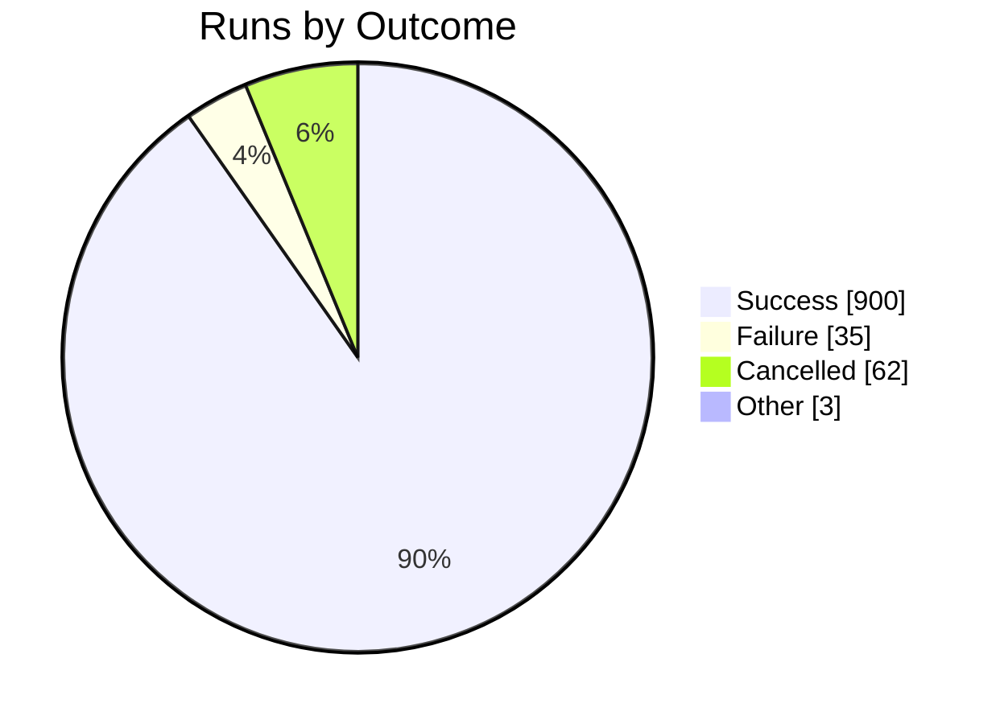
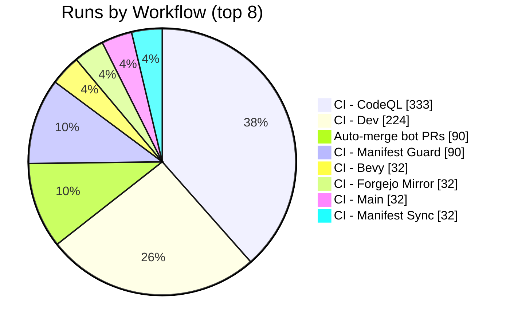

import BentoShell from '@/components/hero/BentoShell.astro';
import BentoProse from '@/components/hero/BentoProse.astro';

<section class="bento-hero bento-section not-content" aria-label="CI health">
	

	

		

			

				
					<svg viewBox="0 0 24 24" width="14" height="14" fill="none" stroke="currentColor" stroke-width="1.75" stroke-linecap="round" stroke-linejoin="round" aria-hidden="true"><path d="M22 12h-4l-3 9L9 3l-3 9H2" /></svg>
					auto-generated · daily
				
				<h1 class="bento-title">
					Pipeline health
					every workflow, every day.
				</h1>
				
<strong>96.3%</strong> success across <strong>1000</strong> runs (7d) — <strong>35</strong> failures, <strong>1</strong> flaky.

				
Last generated <strong>2026-07-25T04:10:27Z</strong>.

				

					<a class="bento-btn bento-btn--primary" href="#workflows">
						View workflows
						<svg viewBox="0 0 24 24" fill="none" stroke="currentColor" aria-hidden="true"><path stroke-linecap="round" stroke-linejoin="round" stroke-width="2" d="M5 12h14M13 6l6 6-6 6" /></svg>
					</a>
					<a class="bento-btn bento-btn--ghost" href="#failures">Failures</a>
					<a class="bento-btn bento-btn--ghost" href="/dashboard/">Dashboard home</a>
				

			

				

					
						<svg viewBox="0 0 24 24" width="16" height="16" fill="none" stroke="currentColor" stroke-width="1.75" stroke-linecap="round" stroke-linejoin="round" aria-hidden="true"><path d="M22 12h-4l-3 9L9 3l-3 9H2" /></svg>
					
					1000
					Runs (7d)
				

				

					
						<svg viewBox="0 0 24 24" width="16" height="16" fill="none" stroke="currentColor" stroke-width="1.75" stroke-linecap="round" stroke-linejoin="round" aria-hidden="true"><path d="M22 11.1V12a10 10 0 1 1-5.9-9.1M22 4 12 14.01l-3-3" /></svg>
					
					96.3%
					Success rate
				

				

					
						<svg viewBox="0 0 24 24" width="16" height="16" fill="none" stroke="currentColor" stroke-width="1.75" stroke-linecap="round" stroke-linejoin="round" aria-hidden="true"><path d="M12 2a10 10 0 1 0 0 20 10 10 0 0 0 0-20zM12 6v6l4 2" /></svg>
					
					5m 40s
					Avg duration
				

				

					
						<svg viewBox="0 0 24 24" width="16" height="16" fill="none" stroke="currentColor" stroke-width="1.75" stroke-linecap="round" stroke-linejoin="round" aria-hidden="true"><path d="M7.9 2h8.2L22 7.9v8.2L16.1 22H7.9L2 16.1V7.9zM15 9l-6 6M9 9l6 6" /></svg>
					
					35
					Failures
				

				

					
						<svg viewBox="0 0 24 24" width="16" height="16" fill="none" stroke="currentColor" stroke-width="1.75" stroke-linecap="round" stroke-linejoin="round" aria-hidden="true"><path d="M13 2 3 14h7l-1 8 10-12h-7z" /></svg>
					
					1
					Flaky
				

		

		<nav class="bento-jump" aria-label="On this page">
			<a class="bento-chip" href="#workflows">Workflows</a>
			<a class="bento-chip" href="#trends">Trends</a>
			<a class="bento-chip" href="#failures">Failures</a>
		</nav>
	

</section>

<BentoShell id="workflows" eyebrow="Volume" heading="Busiest workflows">
	

		<a class="bento-cell bento-linkcard bento-card bento-card--glass bento-card--interactive" href="#health-table">
			
				<svg viewBox="0 0 24 24" width="18" height="18" fill="none" stroke="currentColor" stroke-width="1.75" stroke-linecap="round" stroke-linejoin="round" aria-hidden="true"><path d="M6 3v12M18 9a3 3 0 1 0 0-6 3 3 0 0 0 0 6zM6 21a3 3 0 1 0 0-6 3 3 0 0 0 0 6zM15 6a9 9 0 0 1-9 9" /></svg>
			
			CI - CodeQL
			333 runs · 100.0% ok
			
				<svg viewBox="0 0 24 24" width="16" height="16" fill="none" stroke="currentColor" stroke-width="2" stroke-linecap="round" stroke-linejoin="round"><path d="M5 12h14M13 6l6 6-6 6" /></svg>
			
		</a>
		<a class="bento-cell bento-linkcard bento-card bento-card--glass bento-card--interactive" href="#health-table">
			
				<svg viewBox="0 0 24 24" width="18" height="18" fill="none" stroke="currentColor" stroke-width="1.75" stroke-linecap="round" stroke-linejoin="round" aria-hidden="true"><path d="M6 3v12M18 9a3 3 0 1 0 0-6 3 3 0 0 0 0 6zM6 21a3 3 0 1 0 0-6 3 3 0 0 0 0 6zM15 6a9 9 0 0 1-9 9" /></svg>
			
			CI - Dev
			224 runs · 92.9% ok
			
				<svg viewBox="0 0 24 24" width="16" height="16" fill="none" stroke="currentColor" stroke-width="2" stroke-linecap="round" stroke-linejoin="round"><path d="M5 12h14M13 6l6 6-6 6" /></svg>
			
		</a>
		<a class="bento-cell bento-linkcard bento-card bento-card--glass bento-card--interactive" href="#health-table">
			
				<svg viewBox="0 0 24 24" width="18" height="18" fill="none" stroke="currentColor" stroke-width="1.75" stroke-linecap="round" stroke-linejoin="round" aria-hidden="true"><path d="M6 3v12M18 9a3 3 0 1 0 0-6 3 3 0 0 0 0 6zM6 21a3 3 0 1 0 0-6 3 3 0 0 0 0 6zM15 6a9 9 0 0 1-9 9" /></svg>
			
			Auto-merge bot PRs
			90 runs · 100.0% ok
			
				<svg viewBox="0 0 24 24" width="16" height="16" fill="none" stroke="currentColor" stroke-width="2" stroke-linecap="round" stroke-linejoin="round"><path d="M5 12h14M13 6l6 6-6 6" /></svg>
			
		</a>
		<a class="bento-cell bento-linkcard bento-card bento-card--glass bento-card--interactive" href="#health-table">
			
				<svg viewBox="0 0 24 24" width="18" height="18" fill="none" stroke="currentColor" stroke-width="1.75" stroke-linecap="round" stroke-linejoin="round" aria-hidden="true"><path d="M6 3v12M18 9a3 3 0 1 0 0-6 3 3 0 0 0 0 6zM6 21a3 3 0 1 0 0-6 3 3 0 0 0 0 6zM15 6a9 9 0 0 1-9 9" /></svg>
			
			CI - Manifest Guard
			90 runs · 95.2% ok
			
				<svg viewBox="0 0 24 24" width="16" height="16" fill="none" stroke="currentColor" stroke-width="2" stroke-linecap="round" stroke-linejoin="round"><path d="M5 12h14M13 6l6 6-6 6" /></svg>
			
		</a>
		<a class="bento-cell bento-linkcard bento-card bento-card--glass bento-card--interactive" href="#health-table">
			
				<svg viewBox="0 0 24 24" width="18" height="18" fill="none" stroke="currentColor" stroke-width="1.75" stroke-linecap="round" stroke-linejoin="round" aria-hidden="true"><path d="M6 3v12M18 9a3 3 0 1 0 0-6 3 3 0 0 0 0 6zM6 21a3 3 0 1 0 0-6 3 3 0 0 0 0 6zM15 6a9 9 0 0 1-9 9" /></svg>
			
			CI - Bevy
			32 runs · 100.0% ok
			
				<svg viewBox="0 0 24 24" width="16" height="16" fill="none" stroke="currentColor" stroke-width="2" stroke-linecap="round" stroke-linejoin="round"><path d="M5 12h14M13 6l6 6-6 6" /></svg>
			
		</a>
		<a class="bento-cell bento-linkcard bento-card bento-card--glass bento-card--interactive" href="#health-table">
			
				<svg viewBox="0 0 24 24" width="18" height="18" fill="none" stroke="currentColor" stroke-width="1.75" stroke-linecap="round" stroke-linejoin="round" aria-hidden="true"><path d="M6 3v12M18 9a3 3 0 1 0 0-6 3 3 0 0 0 0 6zM6 21a3 3 0 1 0 0-6 3 3 0 0 0 0 6zM15 6a9 9 0 0 1-9 9" /></svg>
			
			CI - Forgejo Mirror
			32 runs · 100.0% ok
			
				<svg viewBox="0 0 24 24" width="16" height="16" fill="none" stroke="currentColor" stroke-width="2" stroke-linecap="round" stroke-linejoin="round"><path d="M5 12h14M13 6l6 6-6 6" /></svg>
			
		</a>
		<a class="bento-cell bento-linkcard bento-card bento-card--glass bento-card--interactive" href="#health-table">
			
				<svg viewBox="0 0 24 24" width="18" height="18" fill="none" stroke="currentColor" stroke-width="1.75" stroke-linecap="round" stroke-linejoin="round" aria-hidden="true"><path d="M6 3v12M18 9a3 3 0 1 0 0-6 3 3 0 0 0 0 6zM6 21a3 3 0 1 0 0-6 3 3 0 0 0 0 6zM15 6a9 9 0 0 1-9 9" /></svg>
			
			CI - Main
			32 runs · 100.0% ok
			
				<svg viewBox="0 0 24 24" width="16" height="16" fill="none" stroke="currentColor" stroke-width="2" stroke-linecap="round" stroke-linejoin="round"><path d="M5 12h14M13 6l6 6-6 6" /></svg>
			
		</a>
		<a class="bento-cell bento-linkcard bento-card bento-card--glass bento-card--interactive" href="#health-table">
			
				<svg viewBox="0 0 24 24" width="18" height="18" fill="none" stroke="currentColor" stroke-width="1.75" stroke-linecap="round" stroke-linejoin="round" aria-hidden="true"><path d="M6 3v12M18 9a3 3 0 1 0 0-6 3 3 0 0 0 0 6zM6 21a3 3 0 1 0 0-6 3 3 0 0 0 0 6zM15 6a9 9 0 0 1-9 9" /></svg>
			
			CI - Manifest Sync
			32 runs · 96.9% ok
			
				<svg viewBox="0 0 24 24" width="16" height="16" fill="none" stroke="currentColor" stroke-width="2" stroke-linecap="round" stroke-linejoin="round"><path d="M5 12h14M13 6l6 6-6 6" /></svg>
			
		</a>
		<a class="bento-cell bento-linkcard bento-card bento-card--glass bento-card--interactive" href="#health-table">
			
				<svg viewBox="0 0 24 24" width="18" height="18" fill="none" stroke="currentColor" stroke-width="1.75" stroke-linecap="round" stroke-linejoin="round" aria-hidden="true"><path d="M6 3v12M18 9a3 3 0 1 0 0-6 3 3 0 0 0 0 6zM6 21a3 3 0 1 0 0-6 3 3 0 0 0 0 6zM15 6a9 9 0 0 1-9 9" /></svg>
			
			CI - Docker / agones-palworld
			26 runs · 40.9% ok
			
				<svg viewBox="0 0 24 24" width="16" height="16" fill="none" stroke="currentColor" stroke-width="2" stroke-linecap="round" stroke-linejoin="round"><path d="M5 12h14M13 6l6 6-6 6" /></svg>
			
		</a>
	

</BentoShell>

<BentoProse id="trends" heading="Trends">

### Outcome distribution

```mermaid
pie showData
    title Runs by Outcome
    "Success" : 900
    "Failure" : 35
    "Cancelled" : 62
    "Other" : 3
```

### Volume by workflow

```mermaid
pie showData
    title Runs by Workflow (top 8)
    "CI - CodeQL" : 333
    "CI - Dev" : 224
    "Auto-merge bot PRs" : 90
    "CI - Manifest Guard" : 90
    "CI - Bevy" : 32
    "CI - Forgejo Mirror" : 32
    "CI - Main" : 32
    "CI - Manifest Sync" : 32
```

### Last 24 hours

**183** runs · **176** ok · **1** failed · **99.4%** success rate.

### Per-workflow health

| Workflow | Runs | OK | Fail | Success | Avg | Flaky |
|----------|:----:|:--:|:----:|:-------:|:---:|:-----:|
| CI - CodeQL | 333 | 311 | 0 | 100.0% | 3m 18s | 0 |
| CI - Dev | 224 | 182 | 14 | 92.9% | 12m 1s | 0 |
| Auto-merge bot PRs | 90 | 90 | 0 | 100.0% | 36s | 0 |
| CI - Manifest Guard | 90 | 80 | 4 | 95.2% | 2m 4s | 0 |
| CI - Bevy | 32 | 32 | 0 | 100.0% | 25s | 0 |
| CI - Forgejo Mirror | 32 | 32 | 0 | 100.0% | 1m 12s | 0 |
| CI - Main | 32 | 32 | 0 | 100.0% | 1m 52s | 0 |
| CI - Manifest Sync | 32 | 31 | 1 | 96.9% | 2m 18s | 0 |
| CI - Docker / agones-palworld | 26 | 9 | 13 | 40.9% | 12m 25s | 1 |
| CI - Docker / axum-kbve | 24 | 24 | 0 | 100.0% | 26m 17s | 0 |
| CI - Actionlint | 19 | 16 | 0 | 100.0% | 33s | 0 |
| CI - MC Smoke | 10 | 10 | 0 | 100.0% | 3m 13s | 0 |
| Organize Labels | 6 | 6 | 0 | 100.0% | 20s | 0 |
| CI - Docker / agones-palworld-relay | 5 | 5 | 0 | 100.0% | 6m 33s | 0 |
| CI - Docker / discordsh | 5 | 5 | 0 | 100.0% | 16m 31s | 0 |
| CI - Docker / herbmail | 5 | 4 | 1 | 80.0% | 12m 16s | 0 |
| Daily Content | 5 | 4 | 0 | 100.0% | 4m 41s | 0 |
| CI - Docker / discordsh-bot | 4 | 4 | 0 | 100.0% | 17m 15s | 0 |
| CI - MC Gradle Cache | 3 | 2 | 0 | 100.0% | 5m 23s | 0 |
| CI - Atomic Branches | 2 | 2 | 0 | 100.0% | 10m 34s | 0 |
| CI - Docker / kbve-kubectl | 2 | 2 | 0 | 100.0% | 11m 10s | 0 |
| CI - MC Mods Cache | 2 | 2 | 0 | 100.0% | 4m 32s | 0 |
| CI - Publish / npm / laser | 2 | 2 | 0 | 100.0% | 5m 50s | 0 |
| CI - Publish / python / python-kbve | 2 | 2 | 0 | 100.0% | 7m 52s | 0 |
| CI - Docker / axum-chuckrpg | 1 | 1 | 0 | 100.0% | 12m 30s | 0 |
| CI - Docker / cryptothrone | 1 | 0 | 1 | 0.0% | 12m 41s | 0 |
| CI - Docker / firecracker-ctl | 1 | 1 | 0 | 100.0% | 11m 4s | 0 |
| CI - Docker / irc-gateway | 1 | 1 | 0 | 100.0% | 16m 2s | 0 |
| CI - Docker / memes | 1 | 0 | 1 | 0.0% | 7m 16s | 0 |
| CI - Docker / reel | 1 | 1 | 0 | 100.0% | 8m 46s | 0 |
| Graph Update: pip in /apps/agones/palworld/mods/chef_paldon_yumsay/build #1479977683 | 1 | 1 | 0 | 100.0% | 1m 1s | 0 |
| Graph Update: uv in /packages/python/kbve #1469686979 | 1 | 1 | 0 | 100.0% | 1m 17s | 0 |
| Windmill Sync | 1 | 1 | 0 | 100.0% | 1m 5s | 0 |
| cargo in / for tauri-build - Update #1473580916 | 1 | 1 | 0 | 100.0% | 1m 12s | 0 |
| cargo in / for tonic - Update #1473580879 | 1 | 1 | 0 | 100.0% | 1m 3s | 0 |
| npm_and_yarn in / for @codemirror/legacy-modes - Update #1470665113 | 1 | 1 | 0 | 100.0% | 3m 8s | 0 |
| npm_and_yarn in / for expo-dev-client - Update #1470665139 | 1 | 1 | 0 | 100.0% | 3m 3s | 0 |

</BentoProse>

<BentoProse id="failures" heading="Recent failures">

| Workflow | Branch | Event | Finished | Link |
|----------|--------|-------|----------|------|
| CI - Dev | dev | push | 2026-07-24 19:19 | [run](https://github.com/KBVE/kbve/actions/runs/30120261777) |
| CI - Dev | dev | pull_request | 2026-07-23 21:43 | [run](https://github.com/KBVE/kbve/actions/runs/30043064850) |
| CI - Dev | dev | pull_request | 2026-07-23 21:38 | [run](https://github.com/KBVE/kbve/actions/runs/30043539909) |
| CI - Docker / agones-palworld | main | workflow_dispatch | 2026-07-23 18:29 | [run](https://github.com/KBVE/kbve/actions/runs/30032503262) |
| CI - Docker / agones-palworld | worktree-palworld-uobjectcache | workflow_dispatch | 2026-07-23 10:03 | [run](https://github.com/KBVE/kbve/actions/runs/29996807887) |
| CI - Docker / agones-palworld | worktree-palworld-uobjectcache | workflow_dispatch | 2026-07-23 09:45 | [run](https://github.com/KBVE/kbve/actions/runs/29995107502) |
| CI - Docker / agones-palworld | worktree-palworld-uobjectcache | workflow_dispatch | 2026-07-23 09:21 | [run](https://github.com/KBVE/kbve/actions/runs/29994374843) |
| CI - Docker / agones-palworld | worktree-palworld-uobjectcache | workflow_dispatch | 2026-07-23 09:11 | [run](https://github.com/KBVE/kbve/actions/runs/29993945487) |
| CI - Docker / agones-palworld | worktree-palworld-uobjectcache | workflow_dispatch | 2026-07-23 07:37 | [run](https://github.com/KBVE/kbve/actions/runs/29988745246) |
| CI - Docker / agones-palworld | worktree-palworld-uobjectcache | workflow_dispatch | 2026-07-23 07:17 | [run](https://github.com/KBVE/kbve/actions/runs/29987414681) |
| CI - Docker / agones-palworld | worktree-palworld-uobjectcache | workflow_dispatch | 2026-07-23 07:03 | [run](https://github.com/KBVE/kbve/actions/runs/29986672686) |
| CI - Docker / agones-palworld | worktree-palworld-uobjectcache | workflow_dispatch | 2026-07-23 06:52 | [run](https://github.com/KBVE/kbve/actions/runs/29985986590) |
| CI - Docker / agones-palworld | worktree-palworld-e2e-feedback | workflow_dispatch | 2026-07-23 06:30 | [run](https://github.com/KBVE/kbve/actions/runs/29984252168) |
| CI - Docker / agones-palworld | worktree-palworld-e2e-feedback | workflow_dispatch | 2026-07-23 06:17 | [run](https://github.com/KBVE/kbve/actions/runs/29983563230) |
| CI - Docker / agones-palworld | main | workflow_dispatch | 2026-07-23 05:51 | [run](https://github.com/KBVE/kbve/actions/runs/29982441025) |

</BentoProse>

<BentoProse id="about">

---

*Auto-generated by [ci-daily-content.yml](https://github.com/KBVE/kbve/actions/workflows/ci-daily-content.yml)*

</BentoProse>

