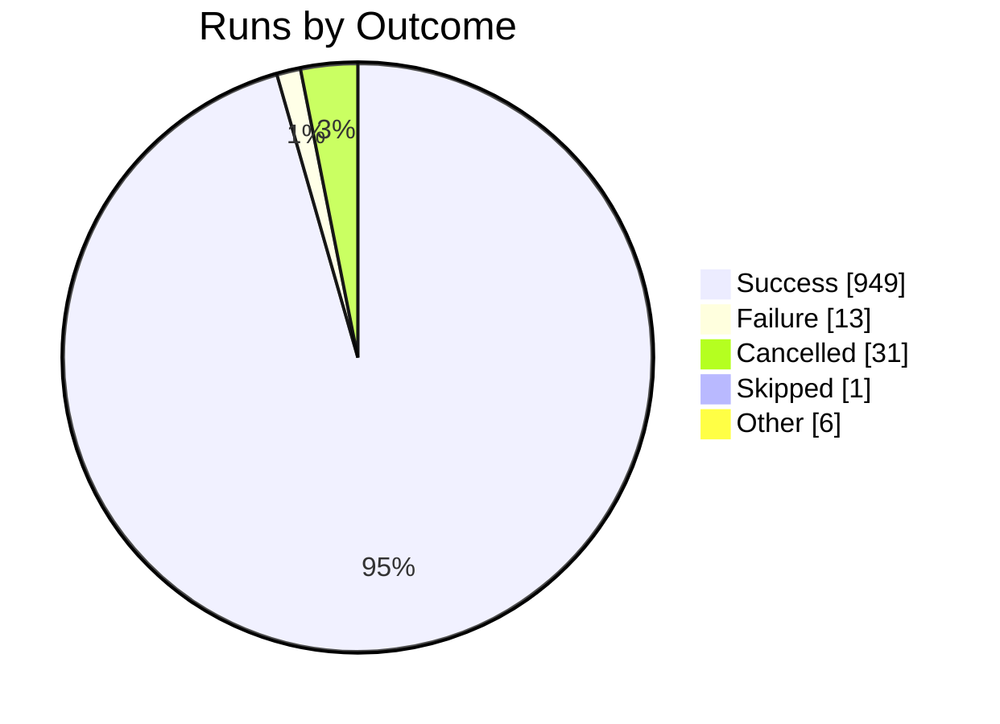
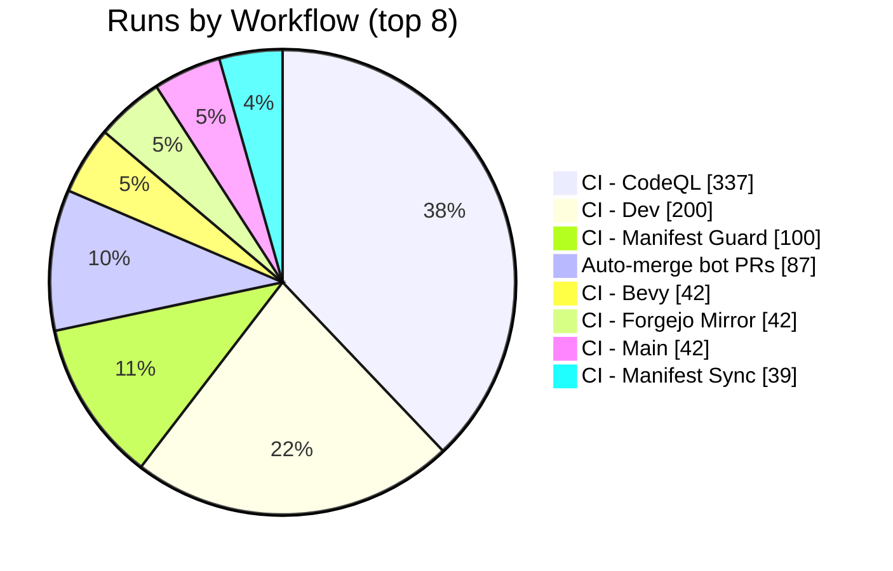

import BentoShell from '@/components/hero/BentoShell.astro';
import BentoProse from '@/components/hero/BentoProse.astro';

<section class="bento-hero bento-section not-content" aria-label="CI health">
	

	

		

			

				
					<svg viewBox="0 0 24 24" width="14" height="14" fill="none" stroke="currentColor" stroke-width="1.75" stroke-linecap="round" stroke-linejoin="round" aria-hidden="true"><path d="M22 12h-4l-3 9L9 3l-3 9H2" /></svg>
					auto-generated · daily
				
				<h1 class="bento-title">
					Pipeline health
					every workflow, every day.
				</h1>
				
<strong>98.6%</strong> success across <strong>1000</strong> runs (7d) — <strong>13</strong> failures, <strong>0</strong> flaky.

				
Last generated <strong>2026-08-01T04:20:54Z</strong>.

				

					<a class="bento-btn bento-btn--primary" href="#workflows">
						View workflows
						<svg viewBox="0 0 24 24" fill="none" stroke="currentColor" aria-hidden="true"><path stroke-linecap="round" stroke-linejoin="round" stroke-width="2" d="M5 12h14M13 6l6 6-6 6" /></svg>
					</a>
					<a class="bento-btn bento-btn--ghost" href="#failures">Failures</a>
					<a class="bento-btn bento-btn--ghost" href="/dashboard/">Dashboard home</a>
				

			

				

					
						<svg viewBox="0 0 24 24" width="16" height="16" fill="none" stroke="currentColor" stroke-width="1.75" stroke-linecap="round" stroke-linejoin="round" aria-hidden="true"><path d="M22 12h-4l-3 9L9 3l-3 9H2" /></svg>
					
					1000
					Runs (7d)
				

				

					
						<svg viewBox="0 0 24 24" width="16" height="16" fill="none" stroke="currentColor" stroke-width="1.75" stroke-linecap="round" stroke-linejoin="round" aria-hidden="true"><path d="M22 11.1V12a10 10 0 1 1-5.9-9.1M22 4 12 14.01l-3-3" /></svg>
					
					98.6%
					Success rate
				

				

					
						<svg viewBox="0 0 24 24" width="16" height="16" fill="none" stroke="currentColor" stroke-width="1.75" stroke-linecap="round" stroke-linejoin="round" aria-hidden="true"><path d="M12 2a10 10 0 1 0 0 20 10 10 0 0 0 0-20zM12 6v6l4 2" /></svg>
					
					4m 39s
					Avg duration
				

				

					
						<svg viewBox="0 0 24 24" width="16" height="16" fill="none" stroke="currentColor" stroke-width="1.75" stroke-linecap="round" stroke-linejoin="round" aria-hidden="true"><path d="M7.9 2h8.2L22 7.9v8.2L16.1 22H7.9L2 16.1V7.9zM15 9l-6 6M9 9l6 6" /></svg>
					
					13
					Failures
				

				

					
						<svg viewBox="0 0 24 24" width="16" height="16" fill="none" stroke="currentColor" stroke-width="1.75" stroke-linecap="round" stroke-linejoin="round" aria-hidden="true"><path d="M13 2 3 14h7l-1 8 10-12h-7z" /></svg>
					
					0
					Flaky
				

		

		<nav class="bento-jump" aria-label="On this page">
			<a class="bento-chip" href="#workflows">Workflows</a>
			<a class="bento-chip" href="#trends">Trends</a>
			<a class="bento-chip" href="#failures">Failures</a>
		</nav>
	

</section>

<BentoShell id="workflows" eyebrow="Volume" heading="Busiest workflows">
	

		<a class="bento-cell bento-linkcard bento-card bento-card--glass bento-card--interactive" href="#health-table">
			
				<svg viewBox="0 0 24 24" width="18" height="18" fill="none" stroke="currentColor" stroke-width="1.75" stroke-linecap="round" stroke-linejoin="round" aria-hidden="true"><path d="M6 3v12M18 9a3 3 0 1 0 0-6 3 3 0 0 0 0 6zM6 21a3 3 0 1 0 0-6 3 3 0 0 0 0 6zM15 6a9 9 0 0 1-9 9" /></svg>
			
			CI - CodeQL
			337 runs · 100.0% ok
			
				<svg viewBox="0 0 24 24" width="16" height="16" fill="none" stroke="currentColor" stroke-width="2" stroke-linecap="round" stroke-linejoin="round"><path d="M5 12h14M13 6l6 6-6 6" /></svg>
			
		</a>
		<a class="bento-cell bento-linkcard bento-card bento-card--glass bento-card--interactive" href="#health-table">
			
				<svg viewBox="0 0 24 24" width="18" height="18" fill="none" stroke="currentColor" stroke-width="1.75" stroke-linecap="round" stroke-linejoin="round" aria-hidden="true"><path d="M6 3v12M18 9a3 3 0 1 0 0-6 3 3 0 0 0 0 6zM6 21a3 3 0 1 0 0-6 3 3 0 0 0 0 6zM15 6a9 9 0 0 1-9 9" /></svg>
			
			CI - Dev
			200 runs · 94.6% ok
			
				<svg viewBox="0 0 24 24" width="16" height="16" fill="none" stroke="currentColor" stroke-width="2" stroke-linecap="round" stroke-linejoin="round"><path d="M5 12h14M13 6l6 6-6 6" /></svg>
			
		</a>
		<a class="bento-cell bento-linkcard bento-card bento-card--glass bento-card--interactive" href="#health-table">
			
				<svg viewBox="0 0 24 24" width="18" height="18" fill="none" stroke="currentColor" stroke-width="1.75" stroke-linecap="round" stroke-linejoin="round" aria-hidden="true"><path d="M6 3v12M18 9a3 3 0 1 0 0-6 3 3 0 0 0 0 6zM6 21a3 3 0 1 0 0-6 3 3 0 0 0 0 6zM15 6a9 9 0 0 1-9 9" /></svg>
			
			CI - Manifest Guard
			100 runs · 100.0% ok
			
				<svg viewBox="0 0 24 24" width="16" height="16" fill="none" stroke="currentColor" stroke-width="2" stroke-linecap="round" stroke-linejoin="round"><path d="M5 12h14M13 6l6 6-6 6" /></svg>
			
		</a>
		<a class="bento-cell bento-linkcard bento-card bento-card--glass bento-card--interactive" href="#health-table">
			
				<svg viewBox="0 0 24 24" width="18" height="18" fill="none" stroke="currentColor" stroke-width="1.75" stroke-linecap="round" stroke-linejoin="round" aria-hidden="true"><path d="M6 3v12M18 9a3 3 0 1 0 0-6 3 3 0 0 0 0 6zM6 21a3 3 0 1 0 0-6 3 3 0 0 0 0 6zM15 6a9 9 0 0 1-9 9" /></svg>
			
			Auto-merge bot PRs
			87 runs · 100.0% ok
			
				<svg viewBox="0 0 24 24" width="16" height="16" fill="none" stroke="currentColor" stroke-width="2" stroke-linecap="round" stroke-linejoin="round"><path d="M5 12h14M13 6l6 6-6 6" /></svg>
			
		</a>
		<a class="bento-cell bento-linkcard bento-card bento-card--glass bento-card--interactive" href="#health-table">
			
				<svg viewBox="0 0 24 24" width="18" height="18" fill="none" stroke="currentColor" stroke-width="1.75" stroke-linecap="round" stroke-linejoin="round" aria-hidden="true"><path d="M6 3v12M18 9a3 3 0 1 0 0-6 3 3 0 0 0 0 6zM6 21a3 3 0 1 0 0-6 3 3 0 0 0 0 6zM15 6a9 9 0 0 1-9 9" /></svg>
			
			CI - Bevy
			42 runs · 100.0% ok
			
				<svg viewBox="0 0 24 24" width="16" height="16" fill="none" stroke="currentColor" stroke-width="2" stroke-linecap="round" stroke-linejoin="round"><path d="M5 12h14M13 6l6 6-6 6" /></svg>
			
		</a>
		<a class="bento-cell bento-linkcard bento-card bento-card--glass bento-card--interactive" href="#health-table">
			
				<svg viewBox="0 0 24 24" width="18" height="18" fill="none" stroke="currentColor" stroke-width="1.75" stroke-linecap="round" stroke-linejoin="round" aria-hidden="true"><path d="M6 3v12M18 9a3 3 0 1 0 0-6 3 3 0 0 0 0 6zM6 21a3 3 0 1 0 0-6 3 3 0 0 0 0 6zM15 6a9 9 0 0 1-9 9" /></svg>
			
			CI - Forgejo Mirror
			42 runs · 100.0% ok
			
				<svg viewBox="0 0 24 24" width="16" height="16" fill="none" stroke="currentColor" stroke-width="2" stroke-linecap="round" stroke-linejoin="round"><path d="M5 12h14M13 6l6 6-6 6" /></svg>
			
		</a>
		<a class="bento-cell bento-linkcard bento-card bento-card--glass bento-card--interactive" href="#health-table">
			
				<svg viewBox="0 0 24 24" width="18" height="18" fill="none" stroke="currentColor" stroke-width="1.75" stroke-linecap="round" stroke-linejoin="round" aria-hidden="true"><path d="M6 3v12M18 9a3 3 0 1 0 0-6 3 3 0 0 0 0 6zM6 21a3 3 0 1 0 0-6 3 3 0 0 0 0 6zM15 6a9 9 0 0 1-9 9" /></svg>
			
			CI - Main
			42 runs · 100.0% ok
			
				<svg viewBox="0 0 24 24" width="16" height="16" fill="none" stroke="currentColor" stroke-width="2" stroke-linecap="round" stroke-linejoin="round"><path d="M5 12h14M13 6l6 6-6 6" /></svg>
			
		</a>
		<a class="bento-cell bento-linkcard bento-card bento-card--glass bento-card--interactive" href="#health-table">
			
				<svg viewBox="0 0 24 24" width="18" height="18" fill="none" stroke="currentColor" stroke-width="1.75" stroke-linecap="round" stroke-linejoin="round" aria-hidden="true"><path d="M6 3v12M18 9a3 3 0 1 0 0-6 3 3 0 0 0 0 6zM6 21a3 3 0 1 0 0-6 3 3 0 0 0 0 6zM15 6a9 9 0 0 1-9 9" /></svg>
			
			CI - Manifest Sync
			39 runs · 100.0% ok
			
				<svg viewBox="0 0 24 24" width="16" height="16" fill="none" stroke="currentColor" stroke-width="2" stroke-linecap="round" stroke-linejoin="round"><path d="M5 12h14M13 6l6 6-6 6" /></svg>
			
		</a>
		<a class="bento-cell bento-linkcard bento-card bento-card--glass bento-card--interactive" href="#health-table">
			
				<svg viewBox="0 0 24 24" width="18" height="18" fill="none" stroke="currentColor" stroke-width="1.75" stroke-linecap="round" stroke-linejoin="round" aria-hidden="true"><path d="M6 3v12M18 9a3 3 0 1 0 0-6 3 3 0 0 0 0 6zM6 21a3 3 0 1 0 0-6 3 3 0 0 0 0 6zM15 6a9 9 0 0 1-9 9" /></svg>
			
			CI - Docker / axum-kbve
			26 runs · 92.0% ok
			
				<svg viewBox="0 0 24 24" width="16" height="16" fill="none" stroke="currentColor" stroke-width="2" stroke-linecap="round" stroke-linejoin="round"><path d="M5 12h14M13 6l6 6-6 6" /></svg>
			
		</a>
	

</BentoShell>

<BentoProse id="trends" heading="Trends">

### Outcome distribution

```mermaid
pie showData
    title Runs by Outcome
    "Success" : 949
    "Failure" : 13
    "Cancelled" : 31
    "Skipped" : 1
    "Other" : 6
```

### Volume by workflow

```mermaid
pie showData
    title Runs by Workflow (top 8)
    "CI - CodeQL" : 337
    "CI - Dev" : 200
    "CI - Manifest Guard" : 100
    "Auto-merge bot PRs" : 87
    "CI - Bevy" : 42
    "CI - Forgejo Mirror" : 42
    "CI - Main" : 42
    "CI - Manifest Sync" : 39
```

### Last 24 hours

**344** runs · **309** ok · **10** failed · **96.9%** success rate.

### Per-workflow health

| Workflow | Runs | OK | Fail | Success | Avg | Flaky |
|----------|:----:|:--:|:----:|:-------:|:---:|:-----:|
| CI - CodeQL | 337 | 324 | 0 | 100.0% | 3m 32s | 0 |
| CI - Dev | 200 | 174 | 10 | 94.6% | 9m 3s | 0 |
| CI - Manifest Guard | 100 | 97 | 0 | 100.0% | 2m 10s | 0 |
| Auto-merge bot PRs | 87 | 87 | 0 | 100.0% | 40s | 0 |
| CI - Bevy | 42 | 42 | 0 | 100.0% | 28s | 0 |
| CI - Forgejo Mirror | 42 | 42 | 0 | 100.0% | 1m 18s | 0 |
| CI - Main | 42 | 42 | 0 | 100.0% | 1m 59s | 0 |
| CI - Manifest Sync | 39 | 38 | 0 | 100.0% | 2m 28s | 0 |
| CI - Docker / axum-kbve | 26 | 23 | 2 | 92.0% | 22m 59s | 0 |
| CI - dbmate validate | 22 | 22 | 0 | 100.0% | 3m 58s | 0 |
| CI - Actionlint | 12 | 11 | 0 | 100.0% | 35s | 0 |
| CI - Docker / reel | 11 | 11 | 0 | 100.0% | 8m 39s | 0 |
| CI - Docker / agones-palworld | 5 | 4 | 0 | 100.0% | 12m 3s | 0 |
| CI - Docker / agones-palworld-relay | 4 | 4 | 0 | 100.0% | 4m 36s | 0 |
| Daily Content | 4 | 3 | 0 | 100.0% | 4m 30s | 0 |
| Organize Labels | 4 | 4 | 0 | 100.0% | 18s | 0 |
| CI - Docker / arpg-web | 3 | 2 | 1 | 66.7% | 8m 48s | 0 |
| CI - Docker / irc-gateway | 2 | 2 | 0 | 100.0% | 17m 32s | 0 |
| CI - Docker / kbve-gate | 2 | 1 | 0 | 100.0% | 5m 42s | 0 |
| CI - Docker / memes | 2 | 2 | 0 | 100.0% | 13m 36s | 0 |
| CI - Kong Config Guard | 2 | 2 | 0 | 100.0% | 23s | 0 |
| CI - Docker / arpg-server | 1 | 1 | 0 | 100.0% | 14m 17s | 0 |
| CI - Docker / kbve-kubectl | 1 | 1 | 0 | 100.0% | 8m 56s | 0 |
| CI - Publish / crates / embeddb-derive | 1 | 1 | 0 | 100.0% | 6m 25s | 0 |
| CI - Publish / crates / holy | 1 | 1 | 0 | 100.0% | 8m 36s | 0 |
| CI - Publish / python / python-kbve | 1 | 1 | 0 | 100.0% | 5m 27s | 0 |
| CI - dbmate deploy | 1 | 1 | 0 | 100.0% | 1h 17m | 0 |
| Graph Update: uv in /packages/python/kbve #1495136773 | 1 | 1 | 0 | 100.0% | 1m 0s | 0 |
| cargo in / for clap - Update #1492519053 | 1 | 1 | 0 | 100.0% | 2m 28s | 0 |
| cargo in / for clap - Update #1496045903 | 1 | 1 | 0 | 100.0% | 1m 3s | 0 |
| cargo in / for syn - Update #1494839295 | 1 | 1 | 0 | 100.0% | 2m 30s | 0 |
| cargo in / for syn - Update #1496045883 | 1 | 1 | 0 | 100.0% | 2m 22s | 0 |
| cargo in / for syn - Update #1498327553 | 1 | 1 | 0 | 100.0% | 3m 4s | 0 |

</BentoProse>

<BentoProse id="failures" heading="Recent failures">

| Workflow | Branch | Event | Finished | Link |
|----------|--------|-------|----------|------|
| CI - Dev | dev | pull_request | 2026-08-01 03:58 | [run](https://github.com/KBVE/kbve/actions/runs/30682623424) |
| CI - Docker / axum-kbve | main | workflow_dispatch | 2026-08-01 03:57 | [run](https://github.com/KBVE/kbve/actions/runs/30682755296) |
| CI - Dev | dev | pull_request | 2026-08-01 03:23 | [run](https://github.com/KBVE/kbve/actions/runs/30681009766) |
| CI - Dev | dev | pull_request | 2026-08-01 03:09 | [run](https://github.com/KBVE/kbve/actions/runs/30681004898) |
| CI - Dev | dev | pull_request | 2026-08-01 02:06 | [run](https://github.com/KBVE/kbve/actions/runs/30678495553) |
| CI - Dev | dev | pull_request | 2026-08-01 01:48 | [run](https://github.com/KBVE/kbve/actions/runs/30678317602) |
| CI - Docker / axum-kbve | main | workflow_dispatch | 2026-08-01 01:30 | [run](https://github.com/KBVE/kbve/actions/runs/30677783834) |
| CI - Docker / arpg-web | main | workflow_dispatch | 2026-08-01 01:28 | [run](https://github.com/KBVE/kbve/actions/runs/30677785744) |
| CI - Dev | dev | pull_request | 2026-08-01 00:58 | [run](https://github.com/KBVE/kbve/actions/runs/30675012563) |
| CI - Dev | dev | pull_request | 2026-07-31 10:46 | [run](https://github.com/KBVE/kbve/actions/runs/30619536466) |
| CI - Dev | dev | pull_request | 2026-07-31 04:03 | [run](https://github.com/KBVE/kbve/actions/runs/30600867326) |
| CI - Dev | dev | pull_request | 2026-07-30 23:18 | [run](https://github.com/KBVE/kbve/actions/runs/30587027788) |
| CI - Dev | dev | pull_request | 2026-07-30 10:58 | [run](https://github.com/KBVE/kbve/actions/runs/30536242386) |

</BentoProse>

<BentoProse id="about">

---

*Auto-generated by [ci-daily-content.yml](https://github.com/KBVE/kbve/actions/workflows/ci-daily-content.yml)*

</BentoProse>

