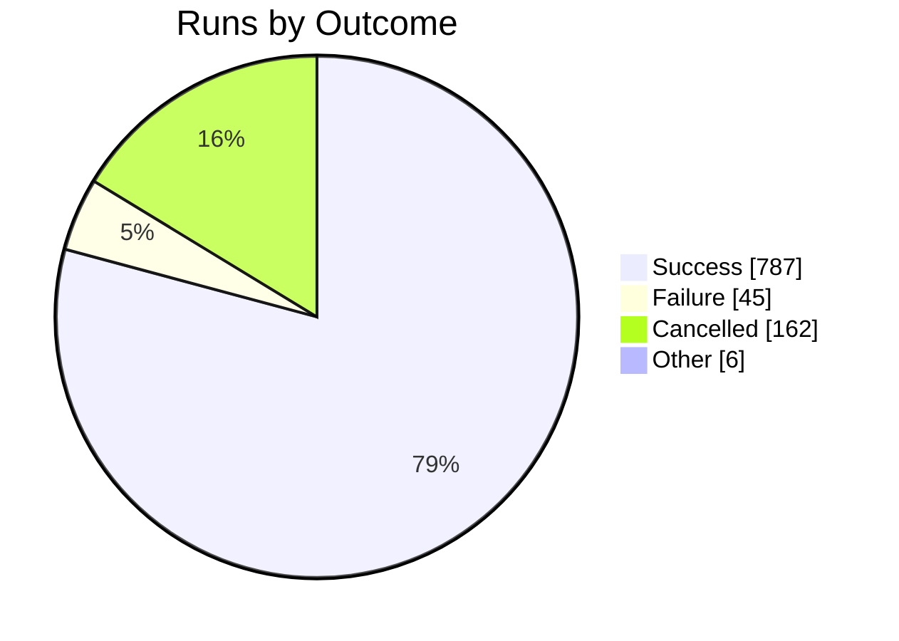
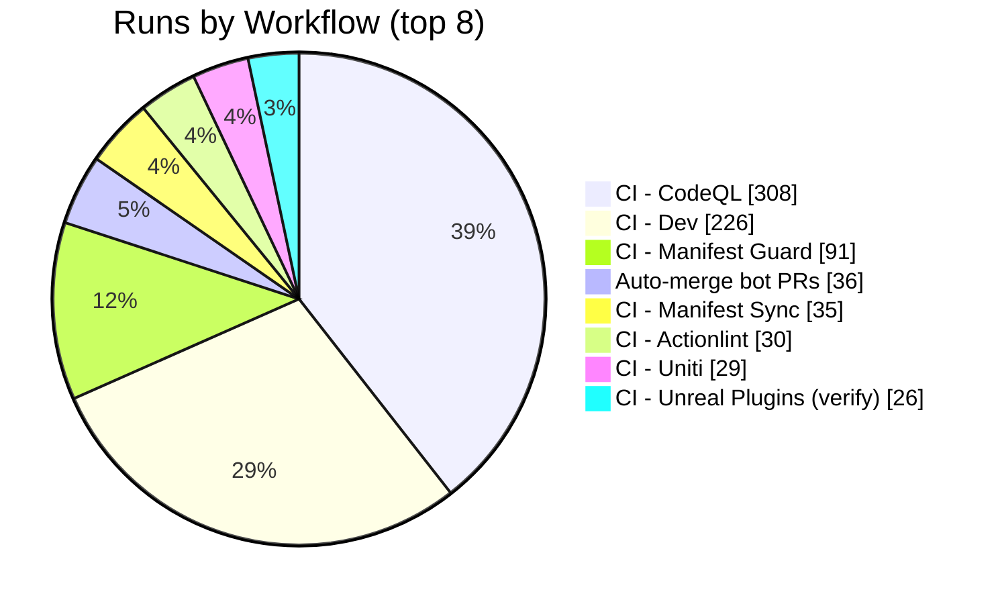

import BentoShell from '@/components/hero/BentoShell.astro';
import BentoProse from '@/components/hero/BentoProse.astro';

<section class="bento-hero bento-section not-content" aria-label="CI health">
	

	

		

			

				
					<svg viewBox="0 0 24 24" width="14" height="14" fill="none" stroke="currentColor" stroke-width="1.75" stroke-linecap="round" stroke-linejoin="round" aria-hidden="true"><path d="M22 12h-4l-3 9L9 3l-3 9H2" /></svg>
					auto-generated · daily
				
				<h1 class="bento-title">
					Pipeline health
					every workflow, every day.
				</h1>
				
<strong>94.6%</strong> success across <strong>1000</strong> runs (7d) — <strong>45</strong> failures, <strong>3</strong> flaky.

				
Last generated <strong>2026-08-04T04:13:45Z</strong>.

				

					<a class="bento-btn bento-btn--primary" href="#workflows">
						View workflows
						<svg viewBox="0 0 24 24" fill="none" stroke="currentColor" aria-hidden="true"><path stroke-linecap="round" stroke-linejoin="round" stroke-width="2" d="M5 12h14M13 6l6 6-6 6" /></svg>
					</a>
					<a class="bento-btn bento-btn--ghost" href="#failures">Failures</a>
					<a class="bento-btn bento-btn--ghost" href="/dashboard/">Dashboard home</a>
				

			

				

					
						<svg viewBox="0 0 24 24" width="16" height="16" fill="none" stroke="currentColor" stroke-width="1.75" stroke-linecap="round" stroke-linejoin="round" aria-hidden="true"><path d="M22 12h-4l-3 9L9 3l-3 9H2" /></svg>
					
					1000
					Runs (7d)
				

				

					
						<svg viewBox="0 0 24 24" width="16" height="16" fill="none" stroke="currentColor" stroke-width="1.75" stroke-linecap="round" stroke-linejoin="round" aria-hidden="true"><path d="M22 11.1V12a10 10 0 1 1-5.9-9.1M22 4 12 14.01l-3-3" /></svg>
					
					94.6%
					Success rate
				

				

					
						<svg viewBox="0 0 24 24" width="16" height="16" fill="none" stroke="currentColor" stroke-width="1.75" stroke-linecap="round" stroke-linejoin="round" aria-hidden="true"><path d="M12 2a10 10 0 1 0 0 20 10 10 0 0 0 0-20zM12 6v6l4 2" /></svg>
					
					10m 43s
					Avg duration
				

				

					
						<svg viewBox="0 0 24 24" width="16" height="16" fill="none" stroke="currentColor" stroke-width="1.75" stroke-linecap="round" stroke-linejoin="round" aria-hidden="true"><path d="M7.9 2h8.2L22 7.9v8.2L16.1 22H7.9L2 16.1V7.9zM15 9l-6 6M9 9l6 6" /></svg>
					
					45
					Failures
				

				

					
						<svg viewBox="0 0 24 24" width="16" height="16" fill="none" stroke="currentColor" stroke-width="1.75" stroke-linecap="round" stroke-linejoin="round" aria-hidden="true"><path d="M13 2 3 14h7l-1 8 10-12h-7z" /></svg>
					
					3
					Flaky
				

		

		<nav class="bento-jump" aria-label="On this page">
			<a class="bento-chip" href="#workflows">Workflows</a>
			<a class="bento-chip" href="#trends">Trends</a>
			<a class="bento-chip" href="#failures">Failures</a>
		</nav>
	

</section>

<BentoShell id="workflows" eyebrow="Volume" heading="Busiest workflows">
	

		<a class="bento-cell bento-linkcard bento-card bento-card--glass bento-card--interactive" href="#health-table">
			
				<svg viewBox="0 0 24 24" width="18" height="18" fill="none" stroke="currentColor" stroke-width="1.75" stroke-linecap="round" stroke-linejoin="round" aria-hidden="true"><path d="M6 3v12M18 9a3 3 0 1 0 0-6 3 3 0 0 0 0 6zM6 21a3 3 0 1 0 0-6 3 3 0 0 0 0 6zM15 6a9 9 0 0 1-9 9" /></svg>
			
			CI - CodeQL
			308 runs · 100.0% ok
			
				<svg viewBox="0 0 24 24" width="16" height="16" fill="none" stroke="currentColor" stroke-width="2" stroke-linecap="round" stroke-linejoin="round"><path d="M5 12h14M13 6l6 6-6 6" /></svg>
			
		</a>
		<a class="bento-cell bento-linkcard bento-card bento-card--glass bento-card--interactive" href="#health-table">
			
				<svg viewBox="0 0 24 24" width="18" height="18" fill="none" stroke="currentColor" stroke-width="1.75" stroke-linecap="round" stroke-linejoin="round" aria-hidden="true"><path d="M6 3v12M18 9a3 3 0 1 0 0-6 3 3 0 0 0 0 6zM6 21a3 3 0 1 0 0-6 3 3 0 0 0 0 6zM15 6a9 9 0 0 1-9 9" /></svg>
			
			CI - Dev
			226 runs · 88.7% ok
			
				<svg viewBox="0 0 24 24" width="16" height="16" fill="none" stroke="currentColor" stroke-width="2" stroke-linecap="round" stroke-linejoin="round"><path d="M5 12h14M13 6l6 6-6 6" /></svg>
			
		</a>
		<a class="bento-cell bento-linkcard bento-card bento-card--glass bento-card--interactive" href="#health-table">
			
				<svg viewBox="0 0 24 24" width="18" height="18" fill="none" stroke="currentColor" stroke-width="1.75" stroke-linecap="round" stroke-linejoin="round" aria-hidden="true"><path d="M6 3v12M18 9a3 3 0 1 0 0-6 3 3 0 0 0 0 6zM6 21a3 3 0 1 0 0-6 3 3 0 0 0 0 6zM15 6a9 9 0 0 1-9 9" /></svg>
			
			CI - Manifest Guard
			91 runs · 100.0% ok
			
				<svg viewBox="0 0 24 24" width="16" height="16" fill="none" stroke="currentColor" stroke-width="2" stroke-linecap="round" stroke-linejoin="round"><path d="M5 12h14M13 6l6 6-6 6" /></svg>
			
		</a>
		<a class="bento-cell bento-linkcard bento-card bento-card--glass bento-card--interactive" href="#health-table">
			
				<svg viewBox="0 0 24 24" width="18" height="18" fill="none" stroke="currentColor" stroke-width="1.75" stroke-linecap="round" stroke-linejoin="round" aria-hidden="true"><path d="M6 3v12M18 9a3 3 0 1 0 0-6 3 3 0 0 0 0 6zM6 21a3 3 0 1 0 0-6 3 3 0 0 0 0 6zM15 6a9 9 0 0 1-9 9" /></svg>
			
			Auto-merge bot PRs
			36 runs · 97.2% ok
			
				<svg viewBox="0 0 24 24" width="16" height="16" fill="none" stroke="currentColor" stroke-width="2" stroke-linecap="round" stroke-linejoin="round"><path d="M5 12h14M13 6l6 6-6 6" /></svg>
			
		</a>
		<a class="bento-cell bento-linkcard bento-card bento-card--glass bento-card--interactive" href="#health-table">
			
				<svg viewBox="0 0 24 24" width="18" height="18" fill="none" stroke="currentColor" stroke-width="1.75" stroke-linecap="round" stroke-linejoin="round" aria-hidden="true"><path d="M6 3v12M18 9a3 3 0 1 0 0-6 3 3 0 0 0 0 6zM6 21a3 3 0 1 0 0-6 3 3 0 0 0 0 6zM15 6a9 9 0 0 1-9 9" /></svg>
			
			CI - Manifest Sync
			35 runs · 100.0% ok
			
				<svg viewBox="0 0 24 24" width="16" height="16" fill="none" stroke="currentColor" stroke-width="2" stroke-linecap="round" stroke-linejoin="round"><path d="M5 12h14M13 6l6 6-6 6" /></svg>
			
		</a>
		<a class="bento-cell bento-linkcard bento-card bento-card--glass bento-card--interactive" href="#health-table">
			
				<svg viewBox="0 0 24 24" width="18" height="18" fill="none" stroke="currentColor" stroke-width="1.75" stroke-linecap="round" stroke-linejoin="round" aria-hidden="true"><path d="M6 3v12M18 9a3 3 0 1 0 0-6 3 3 0 0 0 0 6zM6 21a3 3 0 1 0 0-6 3 3 0 0 0 0 6zM15 6a9 9 0 0 1-9 9" /></svg>
			
			CI - Actionlint
			30 runs · 100.0% ok
			
				<svg viewBox="0 0 24 24" width="16" height="16" fill="none" stroke="currentColor" stroke-width="2" stroke-linecap="round" stroke-linejoin="round"><path d="M5 12h14M13 6l6 6-6 6" /></svg>
			
		</a>
		<a class="bento-cell bento-linkcard bento-card bento-card--glass bento-card--interactive" href="#health-table">
			
				<svg viewBox="0 0 24 24" width="18" height="18" fill="none" stroke="currentColor" stroke-width="1.75" stroke-linecap="round" stroke-linejoin="round" aria-hidden="true"><path d="M6 3v12M18 9a3 3 0 1 0 0-6 3 3 0 0 0 0 6zM6 21a3 3 0 1 0 0-6 3 3 0 0 0 0 6zM15 6a9 9 0 0 1-9 9" /></svg>
			
			CI - Uniti
			29 runs · 100.0% ok
			
				<svg viewBox="0 0 24 24" width="16" height="16" fill="none" stroke="currentColor" stroke-width="2" stroke-linecap="round" stroke-linejoin="round"><path d="M5 12h14M13 6l6 6-6 6" /></svg>
			
		</a>
		<a class="bento-cell bento-linkcard bento-card bento-card--glass bento-card--interactive" href="#health-table">
			
				<svg viewBox="0 0 24 24" width="18" height="18" fill="none" stroke="currentColor" stroke-width="1.75" stroke-linecap="round" stroke-linejoin="round" aria-hidden="true"><path d="M6 3v12M18 9a3 3 0 1 0 0-6 3 3 0 0 0 0 6zM6 21a3 3 0 1 0 0-6 3 3 0 0 0 0 6zM15 6a9 9 0 0 1-9 9" /></svg>
			
			CI - Unreal Plugins (verify)
			26 runs · 100.0% ok
			
				<svg viewBox="0 0 24 24" width="16" height="16" fill="none" stroke="currentColor" stroke-width="2" stroke-linecap="round" stroke-linejoin="round"><path d="M5 12h14M13 6l6 6-6 6" /></svg>
			
		</a>
		<a class="bento-cell bento-linkcard bento-card bento-card--glass bento-card--interactive" href="#health-table">
			
				<svg viewBox="0 0 24 24" width="18" height="18" fill="none" stroke="currentColor" stroke-width="1.75" stroke-linecap="round" stroke-linejoin="round" aria-hidden="true"><path d="M6 3v12M18 9a3 3 0 1 0 0-6 3 3 0 0 0 0 6zM6 21a3 3 0 1 0 0-6 3 3 0 0 0 0 6zM15 6a9 9 0 0 1-9 9" /></svg>
			
			CI - MC Smoke
			23 runs · 100.0% ok
			
				<svg viewBox="0 0 24 24" width="16" height="16" fill="none" stroke="currentColor" stroke-width="2" stroke-linecap="round" stroke-linejoin="round"><path d="M5 12h14M13 6l6 6-6 6" /></svg>
			
		</a>
	

</BentoShell>

<BentoProse id="trends" heading="Trends">

### Outcome distribution

```mermaid
pie showData
    title Runs by Outcome
    "Success" : 787
    "Failure" : 45
    "Cancelled" : 162
    "Other" : 6
```

### Volume by workflow

```mermaid
pie showData
    title Runs by Workflow (top 8)
    "CI - CodeQL" : 308
    "CI - Dev" : 226
    "CI - Manifest Guard" : 91
    "Auto-merge bot PRs" : 36
    "CI - Manifest Sync" : 35
    "CI - Actionlint" : 30
    "CI - Uniti" : 29
    "CI - Unreal Plugins (verify)" : 26
```

### Last 24 hours

**503** runs · **389** ok · **29** failed · **93.1%** success rate.

### Per-workflow health

| Workflow | Runs | OK | Fail | Success | Avg | Flaky |
|----------|:----:|:--:|:----:|:-------:|:---:|:-----:|
| CI - CodeQL | 308 | 274 | 0 | 100.0% | 3m 38s | 1 |
| CI - Dev | 226 | 141 | 18 | 88.7% | 11m 29s | 1 |
| CI - Manifest Guard | 91 | 80 | 0 | 100.0% | 2m 25s | 1 |
| Auto-merge bot PRs | 36 | 35 | 1 | 97.2% | 48s | 0 |
| CI - Manifest Sync | 35 | 32 | 0 | 100.0% | 2m 36s | 0 |
| CI - Actionlint | 30 | 24 | 0 | 100.0% | 50s | 0 |
| CI - Uniti | 29 | 24 | 0 | 100.0% | 6m 57s | 0 |
| CI - Unreal Plugins (verify) | 26 | 3 | 0 | 100.0% | 2h 59m | 0 |
| CI - MC Smoke | 23 | 20 | 0 | 100.0% | 3m 2s | 0 |
| CI - MC Gradle Cache | 20 | 14 | 0 | 100.0% | 6m 39s | 0 |
| CI - MC Mods Cache | 20 | 14 | 0 | 100.0% | 3m 24s | 0 |
| CI - Bevy | 16 | 11 | 5 | 68.8% | 5m 4s | 0 |
| CI - Forgejo Mirror | 15 | 15 | 0 | 100.0% | 2m 4s | 0 |
| CI - Main | 15 | 14 | 0 | 100.0% | 3m 59s | 0 |
| CI - Docker / herbmail | 13 | 11 | 2 | 84.6% | 15m 41s | 0 |
| CI - Docker / axum-kbve | 12 | 10 | 2 | 83.3% | 26m 35s | 0 |
| CI - Cargo Workspace Stub Guard | 11 | 9 | 1 | 90.0% | 48s | 0 |
| CI - Vite Game / herbmail-game | 7 | 5 | 2 | 71.4% | 2m 59s | 0 |
| Organize Labels | 7 | 7 | 0 | 100.0% | 22s | 0 |
| CI - Atomic Branches | 6 | 4 | 2 | 66.7% | 8m 52s | 0 |
| CI - Docker / axum-chuckrpg | 4 | 3 | 1 | 75.0% | 17m 28s | 0 |
| CI - Docker / discordsh | 4 | 3 | 1 | 75.0% | 20m 18s | 0 |
| CI - Docker / discordsh-bot | 4 | 3 | 1 | 75.0% | 20m 26s | 0 |
| CI - Docker / irc-gateway | 4 | 3 | 1 | 75.0% | 22m 43s | 0 |
| CI - Publish / crates / bevy_items | 4 | 4 | 0 | 100.0% | 5m 52s | 0 |
| CI - Docker / cryptothrone | 3 | 0 | 3 | 0.0% | 18m 55s | 0 |
| CI - Docker / memes | 3 | 2 | 1 | 66.7% | 22m 36s | 0 |
| Daily Content | 3 | 2 | 0 | 100.0% | 11m 34s | 0 |
| CI - Docker / agones-palworld-savetool | 2 | 1 | 1 | 50.0% | 4m 32s | 0 |
| CI - Kong Config Guard | 2 | 2 | 0 | 100.0% | 22s | 0 |
| CI - Docker / agones-palworld-relay | 1 | 1 | 0 | 100.0% | 6m 47s | 0 |
| CI - Docker / arpg-server | 1 | 1 | 0 | 100.0% | 14m 6s | 0 |
| CI - Docker / arpg-web | 1 | 0 | 1 | 0.0% | 7m 45s | 0 |
| CI - Docker / reel | 1 | 1 | 0 | 100.0% | 10m 17s | 0 |
| CI - E2E / main | 1 | 0 | 1 | 0.0% | 50m 1s | 0 |
| CI - Publish / python / python-kbve | 1 | 1 | 0 | 100.0% | 5m 55s | 0 |
| CI - Registry Cleanup (GHCR) | 1 | 1 | 0 | 100.0% | 38s | 0 |
| Graph Update: pip in /apps/agones/palworld/savetool #1502319430 | 1 | 1 | 0 | 100.0% | 1m 7s | 0 |
| cargo in / for k8s-openapi - Update #1502022520 | 1 | 1 | 0 | 100.0% | 1m 17s | 0 |
| cargo in / for prost - Update #1500287337 | 1 | 1 | 0 | 100.0% | 2m 31s | 0 |
| cargo in / for prost - Update #1500320158 | 1 | 1 | 0 | 100.0% | 1m 16s | 0 |
| cargo in / for syn - Update #1500320144 | 1 | 1 | 0 | 100.0% | 1m 17s | 0 |
| cargo in /. - Update #1501609142 | 1 | 0 | 1 | 0.0% | 34m 3s | 0 |
| github_actions in /. - Update #1501609144 | 1 | 1 | 0 | 100.0% | 4m 11s | 0 |
| npm_and_yarn in / for @nx/eslint-plugin - Update #1501828093 | 1 | 1 | 0 | 100.0% | 2m 26s | 0 |
| npm_and_yarn in / for @nxlv/python - Update #1501828064 | 1 | 1 | 0 | 100.0% | 4m 23s | 0 |
| npm_and_yarn in / for @nxlv/python - Update #1501834718 | 1 | 1 | 0 | 100.0% | 3m 1s | 0 |
| npm_and_yarn in / for postcss-merge-rules - Update #1500320138 | 1 | 1 | 0 | 100.0% | 1m 12s | 0 |
| npm_and_yarn in / for tailwindcss - Update #1501815952 | 1 | 1 | 0 | 100.0% | 2m 48s | 0 |
| npm_and_yarn in / for tailwindcss - Update #1501827567 | 1 | 1 | 0 | 100.0% | 2m 48s | 0 |
| npm_and_yarn in /. - Update #1501609153 | 1 | 0 | 0 | 0.0% | 55m 13s | 0 |

</BentoProse>

<BentoProse id="failures" heading="Recent failures">

| Workflow | Branch | Event | Finished | Link |
|----------|--------|-------|----------|------|
| CI - Dev | dev | pull_request | 2026-08-03 20:39 | [run](https://github.com/KBVE/kbve/actions/runs/30848770215) |
| CI - Dev | dev | pull_request | 2026-08-03 19:43 | [run](https://github.com/KBVE/kbve/actions/runs/30841615574) |
| CI - Dev | dev | pull_request | 2026-08-03 19:03 | [run](https://github.com/KBVE/kbve/actions/runs/30841170885) |
| CI - Dev | dev | pull_request | 2026-08-03 18:28 | [run](https://github.com/KBVE/kbve/actions/runs/30839856828) |
| CI - Dev | dev | pull_request | 2026-08-03 18:14 | [run](https://github.com/KBVE/kbve/actions/runs/30839069946) |
| CI - Atomic Branches | atom-08031400-matrix-once | push | 2026-08-03 18:13 | [run](https://github.com/KBVE/kbve/actions/runs/30839754281) |
| CI - Dev | dev | pull_request | 2026-08-03 18:13 | [run](https://github.com/KBVE/kbve/actions/runs/30831569623) |
| CI - Atomic Branches | atom-08030633-bvh-drain | push | 2026-08-03 18:06 | [run](https://github.com/KBVE/kbve/actions/runs/30839724813) |
| CI - Dev | dev | pull_request | 2026-08-03 17:52 | [run](https://github.com/KBVE/kbve/actions/runs/30837932123) |
| CI - Bevy | main | workflow_run | 2026-08-03 17:44 | [run](https://github.com/KBVE/kbve/actions/runs/30836875028) |
| CI - Docker / arpg-web | main | workflow_dispatch | 2026-08-03 17:35 | [run](https://github.com/KBVE/kbve/actions/runs/30836849824) |
| CI - Docker / herbmail | main | workflow_dispatch | 2026-08-03 11:58 | [run](https://github.com/KBVE/kbve/actions/runs/30810721340) |
| CI - Bevy | main | workflow_run | 2026-08-03 11:41 | [run](https://github.com/KBVE/kbve/actions/runs/30809214563) |
| CI - Docker / agones-palworld-savetool | main | workflow_dispatch | 2026-08-03 11:21 | [run](https://github.com/KBVE/kbve/actions/runs/30808966178) |
| CI - E2E / main | main | schedule | 2026-08-03 10:32 | [run](https://github.com/KBVE/kbve/actions/runs/30802568809) |

</BentoProse>

<BentoProse id="about">

---

*Auto-generated by [ci-daily-content.yml](https://github.com/KBVE/kbve/actions/workflows/ci-daily-content.yml)*

</BentoProse>

