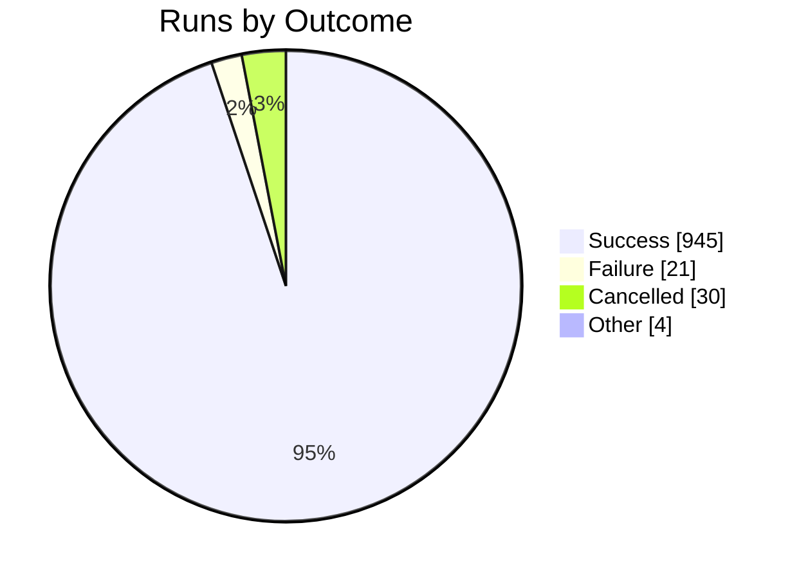
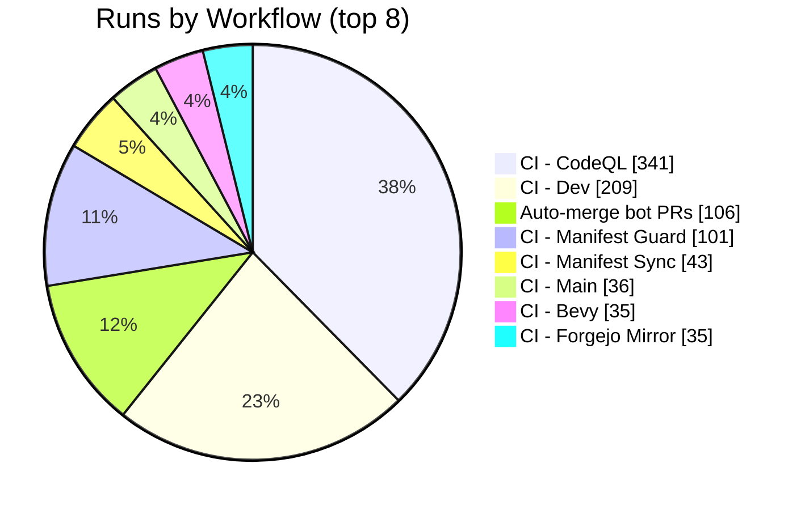

import BentoShell from '@/components/hero/BentoShell.astro';
import BentoProse from '@/components/hero/BentoProse.astro';

<section class="bento-hero bento-section not-content" aria-label="CI health">
	

	

		

			

				
					<svg viewBox="0 0 24 24" width="14" height="14" fill="none" stroke="currentColor" stroke-width="1.75" stroke-linecap="round" stroke-linejoin="round" aria-hidden="true"><path d="M22 12h-4l-3 9L9 3l-3 9H2" /></svg>
					auto-generated · daily
				
				<h1 class="bento-title">
					Pipeline health
					every workflow, every day.
				</h1>
				
<strong>97.8%</strong> success across <strong>1000</strong> runs (7d) — <strong>21</strong> failures, <strong>1</strong> flaky.

				
Last generated <strong>2026-07-28T04:09:16Z</strong>.

				

					<a class="bento-btn bento-btn--primary" href="#workflows">
						View workflows
						<svg viewBox="0 0 24 24" fill="none" stroke="currentColor" aria-hidden="true"><path stroke-linecap="round" stroke-linejoin="round" stroke-width="2" d="M5 12h14M13 6l6 6-6 6" /></svg>
					</a>
					<a class="bento-btn bento-btn--ghost" href="#failures">Failures</a>
					<a class="bento-btn bento-btn--ghost" href="/dashboard/">Dashboard home</a>
				

			

				

					
						<svg viewBox="0 0 24 24" width="16" height="16" fill="none" stroke="currentColor" stroke-width="1.75" stroke-linecap="round" stroke-linejoin="round" aria-hidden="true"><path d="M22 12h-4l-3 9L9 3l-3 9H2" /></svg>
					
					1000
					Runs (7d)
				

				

					
						<svg viewBox="0 0 24 24" width="16" height="16" fill="none" stroke="currentColor" stroke-width="1.75" stroke-linecap="round" stroke-linejoin="round" aria-hidden="true"><path d="M22 11.1V12a10 10 0 1 1-5.9-9.1M22 4 12 14.01l-3-3" /></svg>
					
					97.8%
					Success rate
				

				

					
						<svg viewBox="0 0 24 24" width="16" height="16" fill="none" stroke="currentColor" stroke-width="1.75" stroke-linecap="round" stroke-linejoin="round" aria-hidden="true"><path d="M12 2a10 10 0 1 0 0 20 10 10 0 0 0 0-20zM12 6v6l4 2" /></svg>
					
					4m 20s
					Avg duration
				

				

					
						<svg viewBox="0 0 24 24" width="16" height="16" fill="none" stroke="currentColor" stroke-width="1.75" stroke-linecap="round" stroke-linejoin="round" aria-hidden="true"><path d="M7.9 2h8.2L22 7.9v8.2L16.1 22H7.9L2 16.1V7.9zM15 9l-6 6M9 9l6 6" /></svg>
					
					21
					Failures
				

				

					
						<svg viewBox="0 0 24 24" width="16" height="16" fill="none" stroke="currentColor" stroke-width="1.75" stroke-linecap="round" stroke-linejoin="round" aria-hidden="true"><path d="M13 2 3 14h7l-1 8 10-12h-7z" /></svg>
					
					1
					Flaky
				

		

		<nav class="bento-jump" aria-label="On this page">
			<a class="bento-chip" href="#workflows">Workflows</a>
			<a class="bento-chip" href="#trends">Trends</a>
			<a class="bento-chip" href="#failures">Failures</a>
		</nav>
	

</section>

<BentoShell id="workflows" eyebrow="Volume" heading="Busiest workflows">
	

		<a class="bento-cell bento-linkcard bento-card bento-card--glass bento-card--interactive" href="#health-table">
			
				<svg viewBox="0 0 24 24" width="18" height="18" fill="none" stroke="currentColor" stroke-width="1.75" stroke-linecap="round" stroke-linejoin="round" aria-hidden="true"><path d="M6 3v12M18 9a3 3 0 1 0 0-6 3 3 0 0 0 0 6zM6 21a3 3 0 1 0 0-6 3 3 0 0 0 0 6zM15 6a9 9 0 0 1-9 9" /></svg>
			
			CI - CodeQL
			341 runs · 100.0% ok
			
				<svg viewBox="0 0 24 24" width="16" height="16" fill="none" stroke="currentColor" stroke-width="2" stroke-linecap="round" stroke-linejoin="round"><path d="M5 12h14M13 6l6 6-6 6" /></svg>
			
		</a>
		<a class="bento-cell bento-linkcard bento-card bento-card--glass bento-card--interactive" href="#health-table">
			
				<svg viewBox="0 0 24 24" width="18" height="18" fill="none" stroke="currentColor" stroke-width="1.75" stroke-linecap="round" stroke-linejoin="round" aria-hidden="true"><path d="M6 3v12M18 9a3 3 0 1 0 0-6 3 3 0 0 0 0 6zM6 21a3 3 0 1 0 0-6 3 3 0 0 0 0 6zM15 6a9 9 0 0 1-9 9" /></svg>
			
			CI - Dev
			209 runs · 98.5% ok
			
				<svg viewBox="0 0 24 24" width="16" height="16" fill="none" stroke="currentColor" stroke-width="2" stroke-linecap="round" stroke-linejoin="round"><path d="M5 12h14M13 6l6 6-6 6" /></svg>
			
		</a>
		<a class="bento-cell bento-linkcard bento-card bento-card--glass bento-card--interactive" href="#health-table">
			
				<svg viewBox="0 0 24 24" width="18" height="18" fill="none" stroke="currentColor" stroke-width="1.75" stroke-linecap="round" stroke-linejoin="round" aria-hidden="true"><path d="M6 3v12M18 9a3 3 0 1 0 0-6 3 3 0 0 0 0 6zM6 21a3 3 0 1 0 0-6 3 3 0 0 0 0 6zM15 6a9 9 0 0 1-9 9" /></svg>
			
			Auto-merge bot PRs
			106 runs · 98.1% ok
			
				<svg viewBox="0 0 24 24" width="16" height="16" fill="none" stroke="currentColor" stroke-width="2" stroke-linecap="round" stroke-linejoin="round"><path d="M5 12h14M13 6l6 6-6 6" /></svg>
			
		</a>
		<a class="bento-cell bento-linkcard bento-card bento-card--glass bento-card--interactive" href="#health-table">
			
				<svg viewBox="0 0 24 24" width="18" height="18" fill="none" stroke="currentColor" stroke-width="1.75" stroke-linecap="round" stroke-linejoin="round" aria-hidden="true"><path d="M6 3v12M18 9a3 3 0 1 0 0-6 3 3 0 0 0 0 6zM6 21a3 3 0 1 0 0-6 3 3 0 0 0 0 6zM15 6a9 9 0 0 1-9 9" /></svg>
			
			CI - Manifest Guard
			101 runs · 100.0% ok
			
				<svg viewBox="0 0 24 24" width="16" height="16" fill="none" stroke="currentColor" stroke-width="2" stroke-linecap="round" stroke-linejoin="round"><path d="M5 12h14M13 6l6 6-6 6" /></svg>
			
		</a>
		<a class="bento-cell bento-linkcard bento-card bento-card--glass bento-card--interactive" href="#health-table">
			
				<svg viewBox="0 0 24 24" width="18" height="18" fill="none" stroke="currentColor" stroke-width="1.75" stroke-linecap="round" stroke-linejoin="round" aria-hidden="true"><path d="M6 3v12M18 9a3 3 0 1 0 0-6 3 3 0 0 0 0 6zM6 21a3 3 0 1 0 0-6 3 3 0 0 0 0 6zM15 6a9 9 0 0 1-9 9" /></svg>
			
			CI - Manifest Sync
			43 runs · 100.0% ok
			
				<svg viewBox="0 0 24 24" width="16" height="16" fill="none" stroke="currentColor" stroke-width="2" stroke-linecap="round" stroke-linejoin="round"><path d="M5 12h14M13 6l6 6-6 6" /></svg>
			
		</a>
		<a class="bento-cell bento-linkcard bento-card bento-card--glass bento-card--interactive" href="#health-table">
			
				<svg viewBox="0 0 24 24" width="18" height="18" fill="none" stroke="currentColor" stroke-width="1.75" stroke-linecap="round" stroke-linejoin="round" aria-hidden="true"><path d="M6 3v12M18 9a3 3 0 1 0 0-6 3 3 0 0 0 0 6zM6 21a3 3 0 1 0 0-6 3 3 0 0 0 0 6zM15 6a9 9 0 0 1-9 9" /></svg>
			
			CI - Main
			36 runs · 100.0% ok
			
				<svg viewBox="0 0 24 24" width="16" height="16" fill="none" stroke="currentColor" stroke-width="2" stroke-linecap="round" stroke-linejoin="round"><path d="M5 12h14M13 6l6 6-6 6" /></svg>
			
		</a>
		<a class="bento-cell bento-linkcard bento-card bento-card--glass bento-card--interactive" href="#health-table">
			
				<svg viewBox="0 0 24 24" width="18" height="18" fill="none" stroke="currentColor" stroke-width="1.75" stroke-linecap="round" stroke-linejoin="round" aria-hidden="true"><path d="M6 3v12M18 9a3 3 0 1 0 0-6 3 3 0 0 0 0 6zM6 21a3 3 0 1 0 0-6 3 3 0 0 0 0 6zM15 6a9 9 0 0 1-9 9" /></svg>
			
			CI - Bevy
			35 runs · 100.0% ok
			
				<svg viewBox="0 0 24 24" width="16" height="16" fill="none" stroke="currentColor" stroke-width="2" stroke-linecap="round" stroke-linejoin="round"><path d="M5 12h14M13 6l6 6-6 6" /></svg>
			
		</a>
		<a class="bento-cell bento-linkcard bento-card bento-card--glass bento-card--interactive" href="#health-table">
			
				<svg viewBox="0 0 24 24" width="18" height="18" fill="none" stroke="currentColor" stroke-width="1.75" stroke-linecap="round" stroke-linejoin="round" aria-hidden="true"><path d="M6 3v12M18 9a3 3 0 1 0 0-6 3 3 0 0 0 0 6zM6 21a3 3 0 1 0 0-6 3 3 0 0 0 0 6zM15 6a9 9 0 0 1-9 9" /></svg>
			
			CI - Forgejo Mirror
			35 runs · 100.0% ok
			
				<svg viewBox="0 0 24 24" width="16" height="16" fill="none" stroke="currentColor" stroke-width="2" stroke-linecap="round" stroke-linejoin="round"><path d="M5 12h14M13 6l6 6-6 6" /></svg>
			
		</a>
		<a class="bento-cell bento-linkcard bento-card bento-card--glass bento-card--interactive" href="#health-table">
			
				<svg viewBox="0 0 24 24" width="18" height="18" fill="none" stroke="currentColor" stroke-width="1.75" stroke-linecap="round" stroke-linejoin="round" aria-hidden="true"><path d="M6 3v12M18 9a3 3 0 1 0 0-6 3 3 0 0 0 0 6zM6 21a3 3 0 1 0 0-6 3 3 0 0 0 0 6zM15 6a9 9 0 0 1-9 9" /></svg>
			
			CI - Docker / agones-palworld
			33 runs · 58.6% ok
			
				<svg viewBox="0 0 24 24" width="16" height="16" fill="none" stroke="currentColor" stroke-width="2" stroke-linecap="round" stroke-linejoin="round"><path d="M5 12h14M13 6l6 6-6 6" /></svg>
			
		</a>
	

</BentoShell>

<BentoProse id="trends" heading="Trends">

### Outcome distribution

```mermaid
pie showData
    title Runs by Outcome
    "Success" : 945
    "Failure" : 21
    "Cancelled" : 30
    "Other" : 4
```

### Volume by workflow

```mermaid
pie showData
    title Runs by Workflow (top 8)
    "CI - CodeQL" : 341
    "CI - Dev" : 209
    "Auto-merge bot PRs" : 106
    "CI - Manifest Guard" : 101
    "CI - Manifest Sync" : 43
    "CI - Main" : 36
    "CI - Bevy" : 35
    "CI - Forgejo Mirror" : 35
```

### Last 24 hours

**258** runs · **247** ok · **4** failed · **98.4%** success rate.

### Per-workflow health

| Workflow | Runs | OK | Fail | Success | Avg | Flaky |
|----------|:----:|:--:|:----:|:-------:|:---:|:-----:|
| CI - CodeQL | 341 | 328 | 0 | 100.0% | 3m 28s | 0 |
| CI - Dev | 209 | 196 | 3 | 98.5% | 5m 37s | 0 |
| Auto-merge bot PRs | 106 | 104 | 2 | 98.1% | 35s | 0 |
| CI - Manifest Guard | 101 | 97 | 0 | 100.0% | 2m 10s | 0 |
| CI - Manifest Sync | 43 | 43 | 0 | 100.0% | 2m 31s | 0 |
| CI - Main | 36 | 36 | 0 | 100.0% | 1m 57s | 0 |
| CI - Bevy | 35 | 35 | 0 | 100.0% | 25s | 0 |
| CI - Forgejo Mirror | 35 | 35 | 0 | 100.0% | 1m 13s | 0 |
| CI - Docker / agones-palworld | 33 | 17 | 12 | 58.6% | 13m 2s | 1 |
| CI - Docker / axum-kbve | 23 | 23 | 0 | 100.0% | 25m 24s | 0 |
| CI - Actionlint | 7 | 6 | 0 | 100.0% | 33s | 0 |
| CI - Docker / reel | 6 | 6 | 0 | 100.0% | 8m 54s | 0 |
| Daily Content | 6 | 5 | 0 | 100.0% | 7m 48s | 0 |
| CI - Docker / agones-palworld-relay | 3 | 3 | 0 | 100.0% | 6m 36s | 0 |
| CI - Atomic Branches | 2 | 1 | 1 | 50.0% | 8m 58s | 0 |
| CI - Docker / discordsh | 2 | 2 | 0 | 100.0% | 16m 46s | 0 |
| CI - Docker / discordsh-bot | 2 | 2 | 0 | 100.0% | 17m 55s | 0 |
| CI - Docker / kbve-kubectl | 2 | 2 | 0 | 100.0% | 11m 10s | 0 |
| CI - E2E / main | 1 | 0 | 1 | 0.0% | 55m 2s | 0 |
| CI - E2E / palforge-integrate | 1 | 0 | 1 | 0.0% | 54m 32s | 0 |
| CI - Registry Cleanup (GHCR) | 1 | 1 | 0 | 100.0% | 32s | 0 |
| CI - Uniti | 1 | 1 | 0 | 100.0% | 9m 38s | 0 |
| Graph Update: pip in /apps/agones/palworld/mods/chef_paldon_yumsay/build #1479977683 | 1 | 1 | 0 | 100.0% | 1m 1s | 0 |
| cargo in /. - Update #1485463828 | 1 | 0 | 1 | 0.0% | 40m 21s | 0 |
| github_actions in /. - Update #1485463817 | 1 | 1 | 0 | 100.0% | 1m 19s | 0 |
| npm_and_yarn in /. - Update #1485463816 | 1 | 0 | 0 | 0.0% | 55m 6s | 0 |

</BentoProse>

<BentoProse id="failures" heading="Recent failures">

| Workflow | Branch | Event | Finished | Link |
|----------|--------|-------|----------|------|
| CI - Atomic Branches | atom-07272258-bento-sidebar-adapter | push | 2026-07-28 03:32 | [run](https://github.com/KBVE/kbve/actions/runs/30325811254) |
| CI - E2E / main | main | schedule | 2026-07-27 10:45 | [run](https://github.com/KBVE/kbve/actions/runs/30255635629) |
| cargo in /. - Update #1485463828 | dev | dynamic | 2026-07-27 06:34 | [run](https://github.com/KBVE/kbve/actions/runs/30241052569) |
| Auto-merge bot PRs | dev | workflow_dispatch | 2026-07-27 06:03 | [run](https://github.com/KBVE/kbve/actions/runs/30241469594) |
| Auto-merge bot PRs | main | workflow_dispatch | 2026-07-27 04:09 | [run](https://github.com/KBVE/kbve/actions/runs/30236278395) |
| CI - E2E / palforge-integrate | palforge-integrate | workflow_dispatch | 2026-07-25 06:49 | [run](https://github.com/KBVE/kbve/actions/runs/30146591424) |
| CI - Dev | dev | push | 2026-07-24 19:19 | [run](https://github.com/KBVE/kbve/actions/runs/30120261777) |
| CI - Dev | dev | pull_request | 2026-07-23 21:43 | [run](https://github.com/KBVE/kbve/actions/runs/30043064850) |
| CI - Dev | dev | pull_request | 2026-07-23 21:38 | [run](https://github.com/KBVE/kbve/actions/runs/30043539909) |
| CI - Docker / agones-palworld | main | workflow_dispatch | 2026-07-23 18:29 | [run](https://github.com/KBVE/kbve/actions/runs/30032503262) |
| CI - Docker / agones-palworld | worktree-palworld-uobjectcache | workflow_dispatch | 2026-07-23 10:03 | [run](https://github.com/KBVE/kbve/actions/runs/29996807887) |
| CI - Docker / agones-palworld | worktree-palworld-uobjectcache | workflow_dispatch | 2026-07-23 09:45 | [run](https://github.com/KBVE/kbve/actions/runs/29995107502) |
| CI - Docker / agones-palworld | worktree-palworld-uobjectcache | workflow_dispatch | 2026-07-23 09:21 | [run](https://github.com/KBVE/kbve/actions/runs/29994374843) |
| CI - Docker / agones-palworld | worktree-palworld-uobjectcache | workflow_dispatch | 2026-07-23 09:11 | [run](https://github.com/KBVE/kbve/actions/runs/29993945487) |
| CI - Docker / agones-palworld | worktree-palworld-uobjectcache | workflow_dispatch | 2026-07-23 07:37 | [run](https://github.com/KBVE/kbve/actions/runs/29988745246) |

</BentoProse>

<BentoProse id="about">

---

*Auto-generated by [ci-daily-content.yml](https://github.com/KBVE/kbve/actions/workflows/ci-daily-content.yml)*

</BentoProse>

