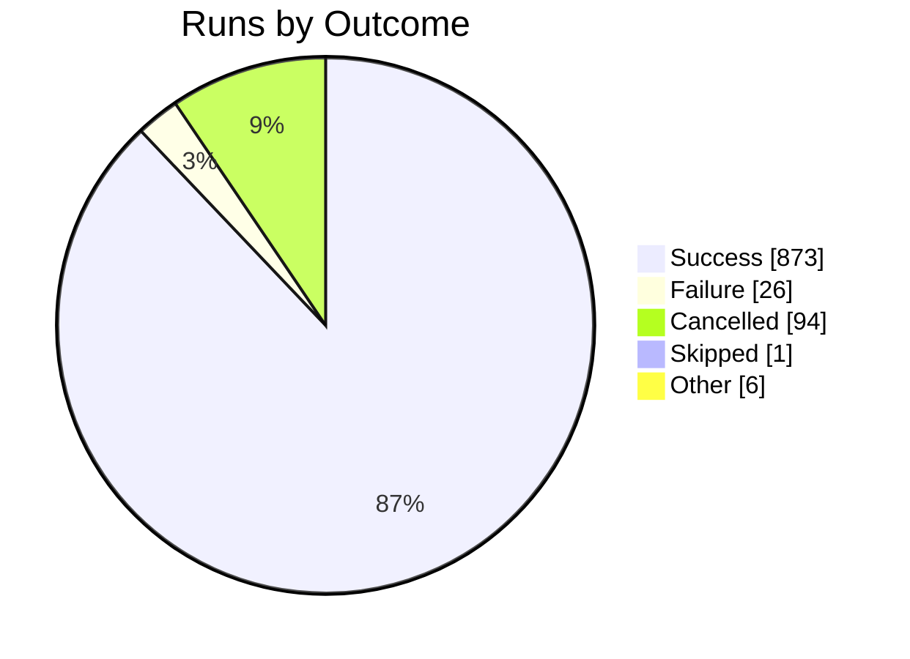
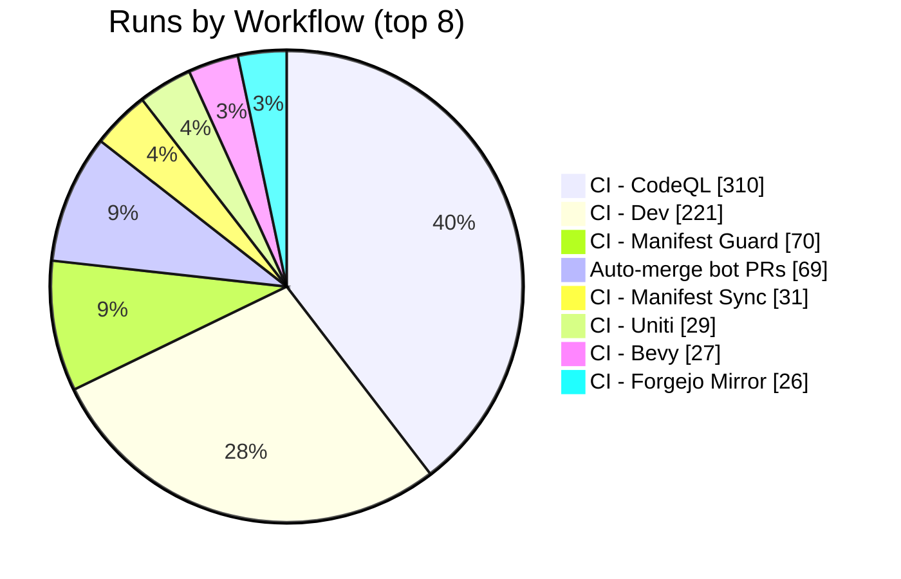

import BentoShell from '@/components/hero/BentoShell.astro';
import BentoProse from '@/components/hero/BentoProse.astro';

<section class="bento-hero bento-section not-content" aria-label="CI health">
	

	

		

			

				
					<svg viewBox="0 0 24 24" width="14" height="14" fill="none" stroke="currentColor" stroke-width="1.75" stroke-linecap="round" stroke-linejoin="round" aria-hidden="true"><path d="M22 12h-4l-3 9L9 3l-3 9H2" /></svg>
					auto-generated · daily
				
				<h1 class="bento-title">
					Pipeline health
					every workflow, every day.
				</h1>
				
<strong>97.1%</strong> success across <strong>1000</strong> runs (7d) — <strong>26</strong> failures, <strong>0</strong> flaky.

				
Last generated <strong>2026-08-03T04:29:47Z</strong>.

				

					<a class="bento-btn bento-btn--primary" href="#workflows">
						View workflows
						<svg viewBox="0 0 24 24" fill="none" stroke="currentColor" aria-hidden="true"><path stroke-linecap="round" stroke-linejoin="round" stroke-width="2" d="M5 12h14M13 6l6 6-6 6" /></svg>
					</a>
					<a class="bento-btn bento-btn--ghost" href="#failures">Failures</a>
					<a class="bento-btn bento-btn--ghost" href="/dashboard/">Dashboard home</a>
				

			

				

					
						<svg viewBox="0 0 24 24" width="16" height="16" fill="none" stroke="currentColor" stroke-width="1.75" stroke-linecap="round" stroke-linejoin="round" aria-hidden="true"><path d="M22 12h-4l-3 9L9 3l-3 9H2" /></svg>
					
					1000
					Runs (7d)
				

				

					
						<svg viewBox="0 0 24 24" width="16" height="16" fill="none" stroke="currentColor" stroke-width="1.75" stroke-linecap="round" stroke-linejoin="round" aria-hidden="true"><path d="M22 11.1V12a10 10 0 1 1-5.9-9.1M22 4 12 14.01l-3-3" /></svg>
					
					97.1%
					Success rate
				

				

					
						<svg viewBox="0 0 24 24" width="16" height="16" fill="none" stroke="currentColor" stroke-width="1.75" stroke-linecap="round" stroke-linejoin="round" aria-hidden="true"><path d="M12 2a10 10 0 1 0 0 20 10 10 0 0 0 0-20zM12 6v6l4 2" /></svg>
					
					4m 44s
					Avg duration
				

				

					
						<svg viewBox="0 0 24 24" width="16" height="16" fill="none" stroke="currentColor" stroke-width="1.75" stroke-linecap="round" stroke-linejoin="round" aria-hidden="true"><path d="M7.9 2h8.2L22 7.9v8.2L16.1 22H7.9L2 16.1V7.9zM15 9l-6 6M9 9l6 6" /></svg>
					
					26
					Failures
				

				

					
						<svg viewBox="0 0 24 24" width="16" height="16" fill="none" stroke="currentColor" stroke-width="1.75" stroke-linecap="round" stroke-linejoin="round" aria-hidden="true"><path d="M13 2 3 14h7l-1 8 10-12h-7z" /></svg>
					
					0
					Flaky
				

		

		<nav class="bento-jump" aria-label="On this page">
			<a class="bento-chip" href="#workflows">Workflows</a>
			<a class="bento-chip" href="#trends">Trends</a>
			<a class="bento-chip" href="#failures">Failures</a>
		</nav>
	

</section>

<BentoShell id="workflows" eyebrow="Volume" heading="Busiest workflows">
	

		<a class="bento-cell bento-linkcard bento-card bento-card--glass bento-card--interactive" href="#health-table">
			
				<svg viewBox="0 0 24 24" width="18" height="18" fill="none" stroke="currentColor" stroke-width="1.75" stroke-linecap="round" stroke-linejoin="round" aria-hidden="true"><path d="M6 3v12M18 9a3 3 0 1 0 0-6 3 3 0 0 0 0 6zM6 21a3 3 0 1 0 0-6 3 3 0 0 0 0 6zM15 6a9 9 0 0 1-9 9" /></svg>
			
			CI - CodeQL
			310 runs · 100.0% ok
			
				<svg viewBox="0 0 24 24" width="16" height="16" fill="none" stroke="currentColor" stroke-width="2" stroke-linecap="round" stroke-linejoin="round"><path d="M5 12h14M13 6l6 6-6 6" /></svg>
			
		</a>
		<a class="bento-cell bento-linkcard bento-card bento-card--glass bento-card--interactive" href="#health-table">
			
				<svg viewBox="0 0 24 24" width="18" height="18" fill="none" stroke="currentColor" stroke-width="1.75" stroke-linecap="round" stroke-linejoin="round" aria-hidden="true"><path d="M6 3v12M18 9a3 3 0 1 0 0-6 3 3 0 0 0 0 6zM6 21a3 3 0 1 0 0-6 3 3 0 0 0 0 6zM15 6a9 9 0 0 1-9 9" /></svg>
			
			CI - Dev
			221 runs · 95.1% ok
			
				<svg viewBox="0 0 24 24" width="16" height="16" fill="none" stroke="currentColor" stroke-width="2" stroke-linecap="round" stroke-linejoin="round"><path d="M5 12h14M13 6l6 6-6 6" /></svg>
			
		</a>
		<a class="bento-cell bento-linkcard bento-card bento-card--glass bento-card--interactive" href="#health-table">
			
				<svg viewBox="0 0 24 24" width="18" height="18" fill="none" stroke="currentColor" stroke-width="1.75" stroke-linecap="round" stroke-linejoin="round" aria-hidden="true"><path d="M6 3v12M18 9a3 3 0 1 0 0-6 3 3 0 0 0 0 6zM6 21a3 3 0 1 0 0-6 3 3 0 0 0 0 6zM15 6a9 9 0 0 1-9 9" /></svg>
			
			CI - Manifest Guard
			70 runs · 100.0% ok
			
				<svg viewBox="0 0 24 24" width="16" height="16" fill="none" stroke="currentColor" stroke-width="2" stroke-linecap="round" stroke-linejoin="round"><path d="M5 12h14M13 6l6 6-6 6" /></svg>
			
		</a>
		<a class="bento-cell bento-linkcard bento-card bento-card--glass bento-card--interactive" href="#health-table">
			
				<svg viewBox="0 0 24 24" width="18" height="18" fill="none" stroke="currentColor" stroke-width="1.75" stroke-linecap="round" stroke-linejoin="round" aria-hidden="true"><path d="M6 3v12M18 9a3 3 0 1 0 0-6 3 3 0 0 0 0 6zM6 21a3 3 0 1 0 0-6 3 3 0 0 0 0 6zM15 6a9 9 0 0 1-9 9" /></svg>
			
			Auto-merge bot PRs
			69 runs · 100.0% ok
			
				<svg viewBox="0 0 24 24" width="16" height="16" fill="none" stroke="currentColor" stroke-width="2" stroke-linecap="round" stroke-linejoin="round"><path d="M5 12h14M13 6l6 6-6 6" /></svg>
			
		</a>
		<a class="bento-cell bento-linkcard bento-card bento-card--glass bento-card--interactive" href="#health-table">
			
				<svg viewBox="0 0 24 24" width="18" height="18" fill="none" stroke="currentColor" stroke-width="1.75" stroke-linecap="round" stroke-linejoin="round" aria-hidden="true"><path d="M6 3v12M18 9a3 3 0 1 0 0-6 3 3 0 0 0 0 6zM6 21a3 3 0 1 0 0-6 3 3 0 0 0 0 6zM15 6a9 9 0 0 1-9 9" /></svg>
			
			CI - Manifest Sync
			31 runs · 100.0% ok
			
				<svg viewBox="0 0 24 24" width="16" height="16" fill="none" stroke="currentColor" stroke-width="2" stroke-linecap="round" stroke-linejoin="round"><path d="M5 12h14M13 6l6 6-6 6" /></svg>
			
		</a>
		<a class="bento-cell bento-linkcard bento-card bento-card--glass bento-card--interactive" href="#health-table">
			
				<svg viewBox="0 0 24 24" width="18" height="18" fill="none" stroke="currentColor" stroke-width="1.75" stroke-linecap="round" stroke-linejoin="round" aria-hidden="true"><path d="M6 3v12M18 9a3 3 0 1 0 0-6 3 3 0 0 0 0 6zM6 21a3 3 0 1 0 0-6 3 3 0 0 0 0 6zM15 6a9 9 0 0 1-9 9" /></svg>
			
			CI - Uniti
			29 runs · 100.0% ok
			
				<svg viewBox="0 0 24 24" width="16" height="16" fill="none" stroke="currentColor" stroke-width="2" stroke-linecap="round" stroke-linejoin="round"><path d="M5 12h14M13 6l6 6-6 6" /></svg>
			
		</a>
		<a class="bento-cell bento-linkcard bento-card bento-card--glass bento-card--interactive" href="#health-table">
			
				<svg viewBox="0 0 24 24" width="18" height="18" fill="none" stroke="currentColor" stroke-width="1.75" stroke-linecap="round" stroke-linejoin="round" aria-hidden="true"><path d="M6 3v12M18 9a3 3 0 1 0 0-6 3 3 0 0 0 0 6zM6 21a3 3 0 1 0 0-6 3 3 0 0 0 0 6zM15 6a9 9 0 0 1-9 9" /></svg>
			
			CI - Bevy
			27 runs · 92.6% ok
			
				<svg viewBox="0 0 24 24" width="16" height="16" fill="none" stroke="currentColor" stroke-width="2" stroke-linecap="round" stroke-linejoin="round"><path d="M5 12h14M13 6l6 6-6 6" /></svg>
			
		</a>
		<a class="bento-cell bento-linkcard bento-card bento-card--glass bento-card--interactive" href="#health-table">
			
				<svg viewBox="0 0 24 24" width="18" height="18" fill="none" stroke="currentColor" stroke-width="1.75" stroke-linecap="round" stroke-linejoin="round" aria-hidden="true"><path d="M6 3v12M18 9a3 3 0 1 0 0-6 3 3 0 0 0 0 6zM6 21a3 3 0 1 0 0-6 3 3 0 0 0 0 6zM15 6a9 9 0 0 1-9 9" /></svg>
			
			CI - Forgejo Mirror
			26 runs · 100.0% ok
			
				<svg viewBox="0 0 24 24" width="16" height="16" fill="none" stroke="currentColor" stroke-width="2" stroke-linecap="round" stroke-linejoin="round"><path d="M5 12h14M13 6l6 6-6 6" /></svg>
			
		</a>
		<a class="bento-cell bento-linkcard bento-card bento-card--glass bento-card--interactive" href="#health-table">
			
				<svg viewBox="0 0 24 24" width="18" height="18" fill="none" stroke="currentColor" stroke-width="1.75" stroke-linecap="round" stroke-linejoin="round" aria-hidden="true"><path d="M6 3v12M18 9a3 3 0 1 0 0-6 3 3 0 0 0 0 6zM6 21a3 3 0 1 0 0-6 3 3 0 0 0 0 6zM15 6a9 9 0 0 1-9 9" /></svg>
			
			CI - Main
			26 runs · 100.0% ok
			
				<svg viewBox="0 0 24 24" width="16" height="16" fill="none" stroke="currentColor" stroke-width="2" stroke-linecap="round" stroke-linejoin="round"><path d="M5 12h14M13 6l6 6-6 6" /></svg>
			
		</a>
	

</BentoShell>

<BentoProse id="trends" heading="Trends">

### Outcome distribution

```mermaid
pie showData
    title Runs by Outcome
    "Success" : 873
    "Failure" : 26
    "Cancelled" : 94
    "Skipped" : 1
    "Other" : 6
```

### Volume by workflow

```mermaid
pie showData
    title Runs by Workflow (top 8)
    "CI - CodeQL" : 310
    "CI - Dev" : 221
    "CI - Manifest Guard" : 70
    "Auto-merge bot PRs" : 69
    "CI - Manifest Sync" : 31
    "CI - Uniti" : 29
    "CI - Bevy" : 27
    "CI - Forgejo Mirror" : 26
```

### Last 24 hours

**516** runs · **415** ok · **16** failed · **96.3%** success rate.

### Per-workflow health

| Workflow | Runs | OK | Fail | Success | Avg | Flaky |
|----------|:----:|:--:|:----:|:-------:|:---:|:-----:|
| CI - CodeQL | 310 | 292 | 0 | 100.0% | 3m 35s | 0 |
| CI - Dev | 221 | 175 | 9 | 95.1% | 6m 27s | 0 |
| CI - Manifest Guard | 70 | 66 | 0 | 100.0% | 2m 12s | 0 |
| Auto-merge bot PRs | 69 | 69 | 0 | 100.0% | 41s | 0 |
| CI - Manifest Sync | 31 | 29 | 0 | 100.0% | 2m 16s | 0 |
| CI - Uniti | 29 | 24 | 0 | 100.0% | 6m 57s | 0 |
| CI - Bevy | 27 | 25 | 2 | 92.6% | 45s | 0 |
| CI - Forgejo Mirror | 26 | 26 | 0 | 100.0% | 1m 20s | 0 |
| CI - Main | 26 | 26 | 0 | 100.0% | 2m 13s | 0 |
| CI - MC Smoke | 23 | 20 | 0 | 100.0% | 3m 2s | 0 |
| CI - Actionlint | 21 | 18 | 0 | 100.0% | 37s | 0 |
| CI - MC Gradle Cache | 20 | 14 | 0 | 100.0% | 6m 39s | 0 |
| CI - MC Mods Cache | 20 | 14 | 0 | 100.0% | 3m 24s | 0 |
| CI - Docker / axum-kbve | 19 | 16 | 3 | 84.2% | 23m 36s | 0 |
| CI - Unreal Plugins (verify) | 18 | 2 | 0 | 100.0% | 13m 31s | 0 |
| CI - Docker / herbmail | 10 | 9 | 1 | 90.0% | 12m 56s | 0 |
| CI - Vite Game / herbmail-game | 7 | 6 | 1 | 85.7% | 3m 4s | 0 |
| CI - Docker / agones-palworld | 5 | 5 | 0 | 100.0% | 12m 38s | 0 |
| CI - Docker / irc-gateway | 5 | 4 | 1 | 80.0% | 15m 43s | 0 |
| CI - Docker / memes | 4 | 3 | 1 | 75.0% | 12m 44s | 0 |
| CI - Docker / reel | 4 | 4 | 0 | 100.0% | 8m 51s | 0 |
| CI - Docker / arpg-web | 3 | 2 | 1 | 66.7% | 8m 48s | 0 |
| CI - Docker / axum-chuckrpg | 3 | 2 | 1 | 66.7% | 10m 22s | 0 |
| CI - Docker / cryptothrone | 3 | 0 | 3 | 0.0% | 11m 35s | 0 |
| CI - Docker / discordsh | 3 | 2 | 1 | 66.7% | 13m 36s | 0 |
| CI - Docker / discordsh-bot | 3 | 2 | 1 | 66.7% | 12m 48s | 0 |
| Daily Content | 3 | 2 | 0 | 100.0% | 4m 1s | 0 |
| CI - Cargo Workspace Stub Guard | 2 | 2 | 0 | 100.0% | 22s | 0 |
| CI - Publish / npm / laser | 2 | 2 | 0 | 100.0% | 6m 12s | 0 |
| CI - Atomic Branches | 1 | 1 | 0 | 100.0% | 9m 21s | 0 |
| CI - Docker / agones-palworld-relay | 1 | 1 | 0 | 100.0% | 6m 56s | 0 |
| CI - Docker / arpg-server | 1 | 1 | 0 | 100.0% | 14m 17s | 0 |
| CI - Publish / crates / bevy_items | 1 | 1 | 0 | 100.0% | 5m 40s | 0 |
| CI - Publish / npm / droid | 1 | 1 | 0 | 100.0% | 9m 28s | 0 |
| CI - Publish / python / python-kbve | 1 | 1 | 0 | 100.0% | 5m 55s | 0 |
| CI - Registry Cleanup (GHCR) | 1 | 1 | 0 | 100.0% | 38s | 0 |
| cargo in / for prost - Update #1500287337 | 1 | 1 | 0 | 100.0% | 2m 31s | 0 |
| cargo in / for prost - Update #1500320158 | 1 | 1 | 0 | 100.0% | 1m 16s | 0 |
| cargo in / for syn - Update #1498327553 | 1 | 1 | 0 | 100.0% | 3m 4s | 0 |
| cargo in / for syn - Update #1500320144 | 1 | 1 | 0 | 100.0% | 1m 17s | 0 |
| docker in /. - Update #1498676908 | 1 | 0 | 1 | 0.0% | 44s | 0 |
| npm_and_yarn in / for postcss-merge-rules - Update #1500320138 | 1 | 1 | 0 | 100.0% | 1m 12s | 0 |

</BentoProse>

<BentoProse id="failures" heading="Recent failures">

| Workflow | Branch | Event | Finished | Link |
|----------|--------|-------|----------|------|
| CI - Docker / cryptothrone | main | workflow_dispatch | 2026-08-02 17:04 | [run](https://github.com/KBVE/kbve/actions/runs/30757608074) |
| CI - Docker / irc-gateway | main | workflow_dispatch | 2026-08-02 16:12 | [run](https://github.com/KBVE/kbve/actions/runs/30755638975) |
| CI - Docker / cryptothrone | main | workflow_dispatch | 2026-08-02 16:09 | [run](https://github.com/KBVE/kbve/actions/runs/30755631399) |
| CI - Docker / memes | main | workflow_dispatch | 2026-08-02 16:09 | [run](https://github.com/KBVE/kbve/actions/runs/30755641043) |
| CI - Docker / discordsh | main | workflow_dispatch | 2026-08-02 16:09 | [run](https://github.com/KBVE/kbve/actions/runs/30755633218) |
| CI - Docker / herbmail | main | workflow_dispatch | 2026-08-02 16:08 | [run](https://github.com/KBVE/kbve/actions/runs/30755636962) |
| CI - Docker / discordsh-bot | main | workflow_dispatch | 2026-08-02 16:05 | [run](https://github.com/KBVE/kbve/actions/runs/30755635082) |
| CI - Docker / axum-kbve | main | workflow_dispatch | 2026-08-02 16:04 | [run](https://github.com/KBVE/kbve/actions/runs/30755627835) |
| CI - Bevy | main | workflow_run | 2026-08-02 16:04 | [run](https://github.com/KBVE/kbve/actions/runs/30755662493) |
| CI - Docker / axum-chuckrpg | main | workflow_dispatch | 2026-08-02 16:04 | [run](https://github.com/KBVE/kbve/actions/runs/30755629625) |
| CI - Vite Game / herbmail-game | main | workflow_dispatch | 2026-08-02 16:01 | [run](https://github.com/KBVE/kbve/actions/runs/30755646207) |
| CI - Dev | dev | pull_request | 2026-08-02 10:47 | [run](https://github.com/KBVE/kbve/actions/runs/30742543460) |
| CI - Bevy | main | workflow_run | 2026-08-02 10:38 | [run](https://github.com/KBVE/kbve/actions/runs/30743990316) |
| CI - Dev | dev | pull_request | 2026-08-02 09:21 | [run](https://github.com/KBVE/kbve/actions/runs/30740917895) |
| CI - Dev | dev | pull_request | 2026-08-02 07:45 | [run](https://github.com/KBVE/kbve/actions/runs/30737612577) |

</BentoProse>

<BentoProse id="about">

---

*Auto-generated by [ci-daily-content.yml](https://github.com/KBVE/kbve/actions/workflows/ci-daily-content.yml)*

</BentoProse>

