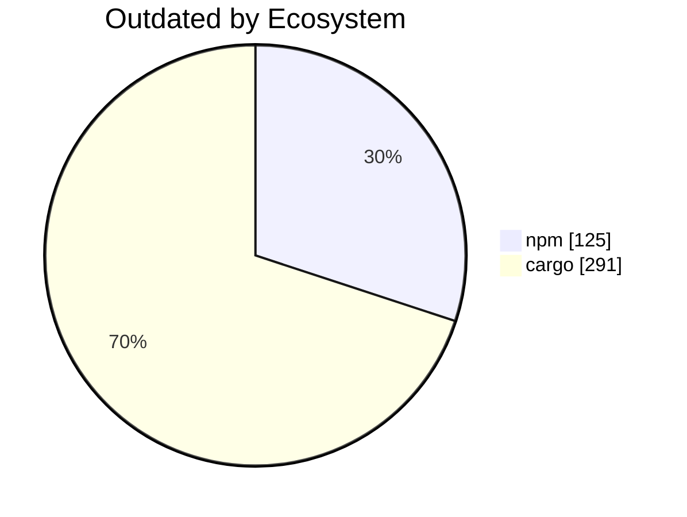

import BentoShell from '@/components/hero/BentoShell.astro';
import BentoProse from '@/components/hero/BentoProse.astro';

<section class="bento-hero bento-section not-content" aria-label="Dependency freshness">
	

	

		

			

				
					<svg viewBox="0 0 24 24" width="14" height="14" fill="none" stroke="currentColor" stroke-width="1.75" stroke-linecap="round" stroke-linejoin="round" aria-hidden="true"><path d="M12 2 2 7l10 5 10-5zM2 17l10 5 10-5M2 12l10 5 10-5" /></svg>
					auto-generated · daily
				
				<h1 class="bento-title">
					Dependency drift
					npm and cargo, daily.
				</h1>
				
<strong>416</strong> outdated dependencies — <strong>32</strong> major-version behind.

				
Last generated <strong>2026-07-20T04:39:36Z</strong>.

				

					<a class="bento-btn bento-btn--primary" href="#ecosystems">
						View drift
						<svg viewBox="0 0 24 24" fill="none" stroke="currentColor" aria-hidden="true"><path stroke-linecap="round" stroke-linejoin="round" stroke-width="2" d="M5 12h14M13 6l6 6-6 6" /></svg>
					</a>
					<a class="bento-btn bento-btn--ghost" href="#trends">Trends</a>
					<a class="bento-btn bento-btn--ghost" href="/dashboard/">Dashboard home</a>
				

			

				

					
						<svg viewBox="0 0 24 24" width="16" height="16" fill="none" stroke="currentColor" stroke-width="1.75" stroke-linecap="round" stroke-linejoin="round" aria-hidden="true"><path d="M12 2 2 7l10 5 10-5zM2 17l10 5 10-5M2 12l10 5 10-5" /></svg>
					
					416
					Outdated
				

				

					
						<svg viewBox="0 0 24 24" width="16" height="16" fill="none" stroke="currentColor" stroke-width="1.75" stroke-linecap="round" stroke-linejoin="round" aria-hidden="true"><path d="M12 9v4m0 4h.01M10.3 3.9 1.8 18a2 2 0 0 0 1.7 3h17a2 2 0 0 0 1.7-3L13.7 3.9a2 2 0 0 0-3.4 0z" /></svg>
					
					32
					Major
				

				

					
						<svg viewBox="0 0 24 24" width="16" height="16" fill="none" stroke="currentColor" stroke-width="1.75" stroke-linecap="round" stroke-linejoin="round" aria-hidden="true"><path d="M12 2 15 9l7 .5-5.3 4.6L18.5 21 12 17l-6.5 4 1.8-6.9L2 9.5 9 9z" /></svg>
					
					125
					npm
				

				

					
						<svg viewBox="0 0 24 24" width="16" height="16" fill="none" stroke="currentColor" stroke-width="1.75" stroke-linecap="round" stroke-linejoin="round" aria-hidden="true"><path d="M12 2a10 10 0 1 0 0 20 10 10 0 0 0 0-20z" /></svg>
					
					291
					cargo
				

		

		<nav class="bento-jump" aria-label="On this page">
			<a class="bento-chip" href="#ecosystems">Ecosystems</a>
			<a class="bento-chip" href="#trends">Trends</a>
		</nav>
	

</section>

<BentoShell id="ecosystems" eyebrow="Coverage" heading="Ecosystem drift">
	

		<a class="bento-cell bento-linkcard bento-card bento-card--glass bento-card--interactive" href="#npm">
			
				<svg viewBox="0 0 24 24" width="18" height="18" fill="none" stroke="currentColor" stroke-width="1.75" stroke-linecap="round" stroke-linejoin="round" aria-hidden="true"><path d="M12 2 15 9l7 .5-5.3 4.6L18.5 21 12 17l-6.5 4 1.8-6.9L2 9.5 9 9z" /></svg>
			
			npm
			125 outdated · 32 major
			
				<svg viewBox="0 0 24 24" width="16" height="16" fill="none" stroke="currentColor" stroke-width="2" stroke-linecap="round" stroke-linejoin="round"><path d="M5 12h14M13 6l6 6-6 6" /></svg>
			
		</a>
		<a class="bento-cell bento-linkcard bento-card bento-card--glass bento-card--interactive" href="#cargo">
			
				<svg viewBox="0 0 24 24" width="18" height="18" fill="none" stroke="currentColor" stroke-width="1.75" stroke-linecap="round" stroke-linejoin="round" aria-hidden="true"><path d="M12 2a10 10 0 1 0 0 20 10 10 0 0 0 0-20z" /></svg>
			
			cargo
			291 outdated · 0 major
			
				<svg viewBox="0 0 24 24" width="16" height="16" fill="none" stroke="currentColor" stroke-width="2" stroke-linecap="round" stroke-linejoin="round"><path d="M5 12h14M13 6l6 6-6 6" /></svg>
			
		</a>
	

</BentoShell>

<BentoProse id="trends" heading="Drift detail">

### npm

| Package | Current | Wanted | Latest | Major |
|---------|---------|--------|--------|:-----:|
| @axe-core/playwright | 4.11.3 | 4.11.3 | 4.12.1 |  |
| @babel/core | 7.26.10 | 7.26.10 | 8.0.1 | ⚠️ |
| @babel/preset-react | 7.29.7 | 7.29.7 | 8.0.1 | ⚠️ |
| @babel/runtime | 7.27.6 | 7.27.6 | 8.0.0 | ⚠️ |
| @bufbuild/buf | 1.71.0 | 1.71.0 | 1.72.0 |  |
| @bufbuild/protobuf | 2.11.0 | 2.11.0 | 2.12.1 |  |
| @codemirror/legacy-modes | 6.5.2 | 6.5.2 | 6.5.3 |  |
| @codemirror/state | 6.6.0 | 6.6.0 | 6.7.1 |  |
| @codemirror/view | 6.41.0 | 6.41.0 | 6.43.6 |  |
| @hookform/resolvers | 5.2.2 | 5.2.2 | 5.4.0 |  |
| @nanostores/react | 1.0.0 | 1.0.0 | 1.1.0 |  |
| @novnc/novnc | 1.5.0 | 1.5.0 | 1.7.0 |  |
| @nx-tools/nx-container | 7.2.3 | 7.2.3 | 7.3.0 |  |
| @nx/devkit | 23.0.2 | 23.0.2 | 23.1.0 |  |
| @nx/esbuild | 23.0.2 | 23.0.2 | 23.1.0 |  |
| @nx/eslint | 23.0.2 | 23.0.2 | 23.1.0 |  |
| @nx/eslint-plugin | 23.0.2 | 23.0.2 | 23.1.0 |  |
| @nx/js | 23.0.2 | 23.0.2 | 23.1.0 |  |
| @nx/node | 23.0.2 | 23.0.2 | 23.1.0 |  |
| @nx/playwright | 23.0.2 | 23.0.2 | 23.1.0 |  |
| @nx/react | 23.0.2 | 23.0.2 | 23.1.0 |  |
| @nx/vite | 23.0.2 | 23.0.2 | 23.1.0 |  |
| @nx/vitest | 23.0.2 | 23.0.2 | 23.1.0 |  |
| @nx/web | 23.0.2 | 23.0.2 | 23.1.0 |  |
| @nx/webpack | 23.0.2 | 23.0.2 | 23.1.0 |  |
| @nx/workspace | 23.0.2 | 23.0.2 | 23.1.0 |  |
| @nxlv/python | 22.2.1 | 22.2.1 | 22.2.2 |  |
| @pixiv/three-vrm | 3.5.3 | 3.5.3 | 3.5.5 |  |
| @pixiv/three-vrm-animation | 3.5.3 | 3.5.3 | 3.5.5 |  |
| @react-native-async-storage/async-storage | 2.2.0 | 2.2.0 | 3.1.1 | ⚠️ |
| @scalar/api-reference | 1.55.3 | 1.55.3 | 1.62.9 |  |
| @scalar/client-side-rendering | 0.3.1 | 0.3.1 | 0.3.4 |  |
| @shopify/react-native-skia | 2.6.9 | 2.6.9 | 2.9.0 |  |
| @supabase/supabase-js | 2.95.3 | 2.95.3 | 2.110.7 |  |
| @swc-node/register | 1.11.1 | 1.11.1 | 1.12.1 |  |
| @swc/core | 1.15.21 | 1.15.21 | 1.15.46 |  |
| @swc/helpers | 0.5.21 | 0.5.21 | 0.5.23 |  |
| @tailwindcss/postcss | 4.1.3 | 4.1.3 | 4.3.3 |  |
| @tailwindcss/vite | 4.1.3 | 4.1.3 | 4.3.3 |  |
| @tanstack/query-core | 5.100.5 | 5.100.5 | 5.101.2 |  |
| @tanstack/react-query | 5.101.0 | 5.101.0 | 5.101.2 |  |
| @tanstack/react-query-persist-client | 5.101.0 | 5.101.0 | 5.101.2 |  |
| @tanstack/react-router | 1.170.16 | 1.170.16 | 1.170.18 |  |
| @tauri-apps/api | 2.10.1 | 2.10.1 | 2.11.1 |  |
| @tauri-apps/plugin-store | 2.4.3 | 2.4.3 | 2.4.4 |  |
| @types/dompurify | 3.2.0 | 3.2.0 | 3.2.0 |  |
| @types/node | 18.19.17 | 18.19.17 | 26.1.1 | ⚠️ |
| @types/react | 19.2.9 | 19.2.9 | 19.2.17 |  |
| @types/react-dom | 19.1.5 | 19.1.5 | 19.2.3 |  |
| @types/styled-components | 5.1.34 | 5.1.34 | 5.1.36 |  |
| @types/three | 0.176.0 | 0.176.0 | 0.185.1 |  |
| @typescript-eslint/eslint-plugin | 7.18.0 | 7.18.0 | 8.64.0 | ⚠️ |
| @typescript-eslint/parser | 7.18.0 | 7.18.0 | 8.64.0 | ⚠️ |
| @vitejs/plugin-react | 6.0.2 | 6.0.2 | 6.0.3 |  |
| @vitest/coverage-v8 | 4.0.9 | 4.0.9 | 4.1.10 |  |
| @vitest/ui | 4.0.9 | 4.0.9 | 4.1.10 |  |
| @vitest/web-worker | 4.0.9 | 4.0.9 | 4.1.10 |  |
| @xyflow/react | 12.11.1 | 12.11.1 | 12.11.2 |  |
| astro | 7.0.9 | 7.0.9 | 7.1.1 |  |
| astro-compressor | 1.2.0 | 1.2.0 | 1.3.0 |  |
| astro-vtbot | 2.1.11 | 2.1.11 | 3.0.0 | ⚠️ |
| autoprefixer | 10.5.0 | 10.5.0 | 10.5.4 |  |
| babel-preset-expo | 56.0.15 | 56.0.15 | 57.0.3 | ⚠️ |
| cssnano | 7.1.4 | 7.1.4 | 8.0.2 | ⚠️ |
| date-fns | 4.1.0 | 4.1.0 | 4.4.0 |  |
| dexie | 4.4.2 | 4.4.2 | 4.4.4 |  |
| dompurify | 3.4.11 | 3.4.11 | 3.4.12 |  |
| esbuild | 0.28.0 | 0.28.0 | 0.28.1 |  |
| eslint | 8.57.0 | 8.57.0 | 10.7.0 | ⚠️ |
| eslint-config-prettier | 10.1.2 | 10.1.2 | 10.1.8 |  |
| expo | 56.0.11 | 56.0.11 | 57.0.7 | ⚠️ |
| expo-auth-session | 56.0.14 | 56.0.14 | 57.0.4 | ⚠️ |
| expo-build-properties | 56.0.19 | 56.0.19 | 57.0.6 | ⚠️ |
| expo-dev-client | 56.0.20 | 56.0.20 | 57.0.7 | ⚠️ |
| expo-linking | 56.0.14 | 56.0.14 | 57.0.3 | ⚠️ |
| expo-status-bar | 56.0.4 | 56.0.4 | 57.0.1 | ⚠️ |
| expo-web-browser | 56.0.5 | 56.0.5 | 57.0.1 | ⚠️ |
| flatbuffers | 25.2.10 | 25.2.10 | 25.9.23 |  |
| happy-dom | 20.10.6 | 20.10.6 | 20.11.0 |  |
| html-react-parser | 5.2.3 | 5.2.3 | 6.1.5 | ⚠️ |
| jsonc-eslint-parser | 2.4.0 | 2.4.0 | 3.1.0 | ⚠️ |
| lint-staged | 16.4.0 | 16.4.0 | 17.1.0 | ⚠️ |
| lucide | 0.575.0 | 0.575.0 | 1.25.0 | ⚠️ |
| lucide-react | 0.575.0 | 0.575.0 | 1.25.0 | ⚠️ |
| marked | 18.0.2 | 18.0.2 | 18.0.6 |  |
| mdream | 1.4.1 | 1.4.1 | 1.5.3 |  |
| mermaid | 11.15.0 | 11.15.0 | 11.16.0 |  |
| monocart-reporter | 2.11.2 | 2.11.2 | 2.12.2 |  |
| nx | 23.0.2 | 23.0.2 | 23.1.0 |  |
| phaser | 4.2.0 | 4.2.0 | 4.2.1 |  |
| postcss | 8.5.14 | 8.5.14 | 8.5.20 |  |
| postcss-merge-rules | 7.0.8 | 7.0.8 | 8.0.1 | ⚠️ |
| postprocessing | 6.39.2 | 6.39.2 | 6.39.3 |  |
| prettier | 3.8.1 | 3.8.1 | 3.9.5 |  |
| react | 19.2.3 | 19.2.3 | 19.2.7 |  |
| react-dom | 19.2.3 | 19.2.3 | 19.2.7 |  |
| react-helmet-async | 2.0.5 | 2.0.5 | 3.0.0 | ⚠️ |
| react-hook-form | 7.55.0 | 7.55.0 | 7.82.0 |  |
| react-is | 19.2.4 | 19.2.4 | 19.2.7 |  |
| react-native | 0.85.3 | 0.85.3 | 0.86.0 |  |
| react-native-gesture-handler | 2.31.2 | 2.31.2 | 3.1.0 | ⚠️ |
| react-native-reanimated | 4.3.1 | 4.3.1 | 4.5.2 |  |
| react-native-safe-area-context | 5.7.0 | 5.7.0 | 5.8.0 |  |
| react-native-svg | 15.15.4 | 15.15.4 | 15.15.5 |  |
| react-native-url-polyfill | 3.0.0 | 3.0.0 | 4.0.0 | ⚠️ |
| react-native-webgpu | 0.5.15 | 0.5.15 | 0.6.1 |  |
| react-native-webview | 13.16.1 | 13.16.1 | 14.0.1 | ⚠️ |
| react-spring | 10.0.3 | 10.0.3 | 10.0.4 |  |
| shiki | 1.29.2 | 1.29.2 | 4.3.1 | ⚠️ |
| styled-components | 6.4.2 | 6.4.2 | 6.4.4 |  |
| tailwind-merge | 3.5.0 | 3.5.0 | 3.6.0 |  |
| tailwindcss | 4.1.3 | 4.1.3 | 4.3.3 |  |
| three | 0.184.0 | 0.184.0 | 0.185.1 |  |
| three-mesh-bvh | 0.9.11 | 0.9.11 | 0.9.13 |  |
| three-spritetext | 1.9.6 | 1.9.6 | 1.10.0 |  |
| typegpu | 0.11.8 | 0.11.8 | 0.11.9 |  |
| typescript | 5.9.3 | 5.9.3 | 7.0.2 | ⚠️ |
| verdaccio | 6.5.1 | 6.5.1 | 6.8.0 |  |
| vite | 8.0.9 | 8.0.9 | 8.1.5 |  |
| vite-plugin-dts | 4.5.4 | 4.5.4 | 5.0.3 | ⚠️ |
| vitest | 4.0.9 | 4.0.9 | 4.1.10 |  |
| webpack | 5.107.2 | 5.107.2 | 5.108.4 |  |
| webpack-cli | 7.1.0 | 7.1.0 | 7.2.1 |  |
| webpack-dev-server | 5.2.5 | 5.2.5 | 6.0.0 | ⚠️ |
| zod | 4.3.6 | 4.3.6 | 4.4.3 |  |

### cargo

| Crate | Current | Latest | Major |
|-------|---------|--------|:-----:|
| accesskit | 0.24.0 | 0.24.1 |  |
| accesskit_atspi_common | 0.18.0 | 0.18.1 |  |
| accesskit_macos | 0.26.0 | 0.26.3 |  |
| accesskit_unix | 0.21.0 | 0.21.1 |  |
| actix-http | 3.12.1 | 3.13.1 |  |
| actix-web | 4.13.0 | 4.14.0 |  |
| agones | 1.57.0 | 1.59.0 |  |
| alloc-stdlib | 0.2.2 | 0.2.4 |  |
| ammonia | 4.1.2 | 4.1.3 |  |
| amq-protocol | 10.0.1 | 10.6.2 |  |
| amq-protocol-tcp | 10.0.1 | 10.6.2 |  |
| amq-protocol-types | 10.0.1 | 10.6.2 |  |
| amq-protocol-uri | 10.0.1 | 10.6.2 |  |
| anyhow | 1.0.102 | 1.0.104 |  |
| arc-swap | 1.9.1 | 1.9.2 |  |
| arrayvec | 0.7.6 | 0.7.8 |  |
| asn1-rs | 0.7.1 | 0.7.2 |  |
| async-compression | 0.4.41 | 0.4.42 |  |
| async-rs | 0.8.2 | 0.8.11 |  |
| async-trait | 0.1.89 | 0.1.91 |  |
| atomicow | 1.1.0 | 1.2.0 |  |
| autocfg | 1.5.0 | 1.5.1 |  |
| avian_derive | 0.2.2 | 0.2.3 |  |
| aws-lc-rs | 1.16.2 | 1.17.3 |  |
| aws-lc-sys | 0.39.1 | 0.43.0 |  |
| bitflags | 2.11.0 | 2.13.1 |  |
| bitvec | 1.0.1 | 1.1.1 |  |
| blake3 | 1.8.4 | 1.8.5 |  |
| block-buffer | 0.12.0 | 0.12.1 |  |
| bon | 3.9.1 | 3.9.3 |  |
| bon-macros | 3.9.1 | 3.9.3 |  |
| brotli | 8.0.2 | 8.0.4 |  |
| brotli-decompressor | 5.0.0 | 5.0.3 |  |
| bstr | 1.12.1 | 1.13.0 |  |
| bumpalo | 3.20.2 | 3.20.3 |  |
| bytemuck | 1.25.0 | 1.25.2 |  |
| bytemuck_derive | 1.10.2 | 1.11.0 |  |
| bytes | 1.11.1 | 1.12.1 |  |
| camino | 1.2.2 | 1.2.4 |  |
| cfg_aliases | 0.2.1 | 0.2.2 |  |
| chacha20 | 0.10.0 | 0.10.1 |  |
| chrono | 0.4.44 | 0.4.45 |  |
| clap | 4.6.0 | 4.6.2 |  |
| clap_builder | 4.6.0 | 4.6.2 |  |
| clap_derive | 4.6.0 | 4.6.1 |  |
| cmov | 0.5.3 | 0.5.4 |  |
| color | 0.3.2 | 0.3.3 |  |
| compression-codecs | 0.4.37 | 0.4.38 |  |
| compression-core | 0.4.31 | 0.4.32 |  |
| console_log | 1.0.0 | 1.1.0 |  |
| crc-catalog | 2.4.0 | 2.5.0 |  |
| crossbeam-channel | 0.5.15 | 0.5.16 |  |
| crossbeam-deque | 0.8.6 | 0.8.7 |  |
| crossbeam-epoch | 0.9.18 | 0.9.20 |  |
| crossbeam-queue | 0.3.12 | 0.3.13 |  |
| crossbeam-utils | 0.8.21 | 0.8.22 |  |
| crypto-common | 0.2.1 | 0.2.2 |  |
| csbindgen | 1.9.7 | 1.9.8 |  |
| ctor | 0.2.9 | 0.8.0 |  |
| dashmap | 6.1.0 | 6.2.1 |  |
| data-encoding | 2.10.0 | 2.11.0 |  |
| diesel | 2.3.9 | 2.3.11 |  |
| diesel-async | 0.9.0 | 0.9.2 |  |
| diesel_derives | 2.3.7 | 2.3.9 |  |
| digest | 0.11.2 | 0.11.3 |  |
| displaydoc | 0.2.5 | 0.2.6 |  |
| ecolor | 0.34.1 | 0.34.3 |  |
| eframe | 0.34.1 | 0.34.3 |  |
| egui | 0.34.1 | 0.34.3 |  |
| egui-wgpu | 0.34.1 | 0.34.3 |  |
| egui-winit | 0.34.1 | 0.34.3 |  |
| egui_glow | 0.34.1 | 0.34.3 |  |
| either | 1.15.0 | 1.16.0 |  |
| emath | 0.34.1 | 0.34.3 |  |
| embed-resource | 3.0.8 | 3.0.11 |  |
| enum-ordinalize | 4.3.2 | 4.4.1 |  |
| enum-ordinalize-derive | 4.3.2 | 4.4.1 |  |
| epaint | 0.34.1 | 0.34.3 |  |
| epaint_default_fonts | 0.34.1 | 0.34.3 |  |
| fastrand | 2.4.1 | 2.5.0 |  |
| fax | 0.2.6 | 0.2.7 |  |
| fs-err | 3.3.0 | 3.3.1 |  |
| futures | 0.3.32 | 0.3.33 |  |
| futures-channel | 0.3.32 | 0.3.33 |  |
| futures-core | 0.3.32 | 0.3.33 |  |
| futures-executor | 0.3.32 | 0.3.33 |  |
| futures-io | 0.3.32 | 0.3.33 |  |
| futures-macro | 0.3.32 | 0.3.33 |  |
| futures-sink | 0.3.32 | 0.3.33 |  |
| futures-task | 0.3.32 | 0.3.33 |  |
| futures-timer | 3.0.3 | 3.0.4 |  |
| futures-util | 0.3.32 | 0.3.33 |  |
| gdextension-api | 0.5.0 | 0.5.1 |  |
| gif | 0.14.1 | 0.14.2 |  |
| gilrs | 0.11.1 | 0.11.2 |  |
| gilrs-core | 0.6.7 | 0.6.8 |  |
| globset | 0.4.18 | 0.4.19 |  |
| godot | 0.5.3 | 0.5.4 |  |
| godot-bindings | 0.5.3 | 0.5.4 |  |
| godot-cell | 0.5.3 | 0.5.4 |  |
| godot-codegen | 0.5.3 | 0.5.4 |  |
| godot-core | 0.5.3 | 0.5.4 |  |
| godot-ffi | 0.5.3 | 0.5.4 |  |
| godot-macros | 0.5.3 | 0.5.4 |  |
| grid | 1.0.0 | 1.0.1 |  |
| h2 | 0.4.13 | 0.4.15 |  |
| heapless | 0.9.2 | 0.9.3 |  |
| hickory-proto | 0.25.2 | 0.26.1 |  |
| hickory-resolver | 0.25.2 | 0.26.1 |  |
| http | 1.4.0 | 1.4.2 |  |
| http-body | 1.0.1 | 1.1.0 |  |
| http-body-util | 0.1.3 | 0.1.4 |  |
| hybrid-array | 0.4.10 | 0.4.13 |  |
| hyper | 1.9.0 | 1.10.1 |  |
| hyper-rustls | 0.27.7 | 0.27.9 |  |
| idna_adapter | 1.2.1 | 1.2.2 |  |
| impl-more | 0.1.9 | 0.3.1 |  |
| indexmap | 2.13.1 | 2.14.0 |  |
| inotify | 0.11.1 | 0.11.4 |  |
| inotify-sys | 0.1.5 | 0.1.8 |  |
| jiff | 0.2.23 | 0.2.34 |  |
| jiff-static | 0.2.23 | 0.2.34 |  |
| jobserver | 0.1.34 | 0.1.35 |  |
| json-patch | 4.1.0 | 4.2.0 |  |
| jsonpath-rust | 1.0.4 | 1.0.5 |  |
| jsonschema | 0.46.4 | 0.46.10 |  |
| jsonwebtoken | 10.3.0 | 10.4.0 |  |
| kurbo | 0.13.0 | 0.13.1 |  |
| lapin | 4.4.0 | 4.10.0 |  |
| libc | 0.2.184 | 0.2.186 |  |
| libredox | 0.1.15 | 0.1.18 |  |
| log | 0.4.29 | 0.4.33 |  |
| matrixmultiply | 0.3.10 | 0.3.11 |  |
| memchr | 2.8.0 | 2.8.3 |  |
| memmap2 | 0.9.10 | 0.9.11 |  |
| metrics | 0.24.3 | 0.24.6 |  |
| metrics-exporter-prometheus | 0.18.1 | 0.18.3 |  |
| metrics-util | 0.20.1 | 0.20.4 |  |
| mio | 1.2.0 | 1.2.2 |  |
| muda | 0.17.2 | 0.19.3 |  |
| no_std_io2 | 0.9.3 | 0.9.4 |  |
| num-bigint | 0.4.6 | 0.4.8 |  |
| num-conv | 0.2.1 | 0.2.2 |  |
| num-iter | 0.1.45 | 0.1.46 |  |
| octets | 0.3.5 | 0.3.6 |  |
| open | 5.3.3 | 5.4.0 |  |
| orbclient | 0.3.51 | 0.3.55 |  |
| pastey | 0.2.2 | 0.2.3 |  |
| peniko | 0.6.0 | 0.6.1 |  |
| pest | 2.8.6 | 2.8.7 |  |
| pest_derive | 2.8.6 | 2.8.7 |  |
| pest_generator | 2.8.6 | 2.8.7 |  |
| pest_meta | 2.8.6 | 2.8.7 |  |
| pin-project | 1.1.11 | 1.1.13 |  |
| pin-project-internal | 1.1.11 | 1.1.13 |  |
| pkg-config | 0.3.32 | 0.3.33 |  |
| plist | 1.8.0 | 1.10.0 |  |
| poise | 0.6.1 | 0.6.2 |  |
| portable-atomic | 1.13.1 | 1.14.0 |  |
| portable-atomic-util | 0.2.6 | 0.2.7 |  |
| postgres | 0.19.13 | 0.19.14 |  |
| postgres-protocol | 0.6.11 | 0.6.12 |  |
| postgres-types | 0.2.13 | 0.2.14 |  |
| proc-macro2 | 1.0.106 | 1.0.107 |  |
| profiling | 1.0.17 | 1.0.18 |  |
| prost | 0.14.3 | 0.14.4 |  |
| prost-build | 0.14.3 | 0.14.4 |  |
| prost-derive | 0.14.3 | 0.14.4 |  |
| prost-types | 0.14.3 | 0.14.4 |  |
| pulldown-cmark | 0.13.3 | 0.13.4 |  |
| pxfm | 0.1.28 | 0.1.30 |  |
| quinn | 0.11.9 | 0.11.11 |  |
| quinn-proto | 0.11.14 | 0.11.16 |  |
| quinn-udp | 0.5.14 | 0.5.15 |  |
| quote | 1.0.45 | 1.0.47 |  |
| rand_pcg | 0.2.1 | 0.10.2 |  |
| rayon | 1.11.0 | 1.12.0 |  |
| redox_syscall | 0.7.3 | 0.9.0 |  |
| ref-cast | 1.0.25 | 1.0.26 |  |
| ref-cast-impl | 1.0.25 | 1.0.26 |  |
| referencing | 0.46.4 | 0.46.10 |  |
| regex | 1.12.3 | 1.13.1 |  |
| regex-automata | 0.4.14 | 0.4.16 |  |
| regex-syntax | 0.8.10 | 0.8.11 |  |
| reqwest | 0.13.2 | 0.13.4 |  |
| rmcp | 1.6.0 | 1.8.0 |  |
| rmcp-actix-web | 0.12.6 | 0.12.16 |  |
| rmcp-macros | 1.6.0 | 1.8.0 |  |
| ron | 0.12.1 | 0.12.2 |  |
| rust-embed | 8.11.0 | 8.12.0 |  |
| rust-embed-impl | 8.11.0 | 8.12.0 |  |
| rust-embed-utils | 8.11.0 | 8.12.0 |  |
| rustc-hash | 2.1.2 | 2.1.3 |  |
| rustls | 0.23.37 | 0.23.42 |  |
| rustls-connector | 0.22.0 | 0.23.6 |  |
| rustls-native-certs | 0.8.3 | 0.8.4 |  |
| rustls-pki-types | 1.14.0 | 1.15.0 |  |
| rustls-platform-verifier | 0.6.2 | 0.7.0 |  |
| rustls-webpki | 0.103.10 | 0.103.13 |  |
| rustversion | 1.0.22 | 1.0.23 |  |
| ruzstd | 0.8.2 | 0.8.3 |  |
| self_cell | 1.2.2 | 1.3.0 |  |
| serde | 1.0.228 | 1.0.229 |  |
| serde_core | 1.0.228 | 1.0.229 |  |
| serde_derive | 1.0.228 | 1.0.229 |  |
| serde_json | 1.0.149 | 1.0.150 |  |
| serde_repr | 0.1.20 | 0.1.21 |  |
| serde_with | 3.18.0 | 3.21.0 |  |
| serde_with_macros | 3.18.0 | 3.21.0 |  |
| serial_test | 3.4.0 | 3.5.0 |  |
| serial_test_derive | 3.4.0 | 3.5.0 |  |
| sha1 | 0.10.6 | 0.10.7 |  |
| simd-adler32 | 0.3.9 | 0.3.10 |  |
| simd_cesu8 | 1.1.1 | 1.2.0 |  |
| smallvec | 1.15.1 | 1.15.2 |  |
| socket2 | 0.6.3 | 0.6.5 |  |
| sse-stream | 0.2.3 | 0.2.4 |  |
| swash | 0.2.7 | 0.2.10 |  |
| tao | 0.34.8 | 0.35.3 |  |
| target-triple | 1.0.0 | 1.0.1 |  |
| tauri | 2.10.3 | 2.11.5 |  |
| tauri-build | 2.5.6 | 2.6.3 |  |
| tauri-codegen | 2.5.5 | 2.6.3 |  |
| tauri-macros | 2.5.5 | 2.6.3 |  |
| tauri-plugin | 2.5.4 | 2.6.3 |  |
| tauri-plugin-opener | 2.5.3 | 2.5.4 |  |
| tauri-plugin-single-instance | 2.4.2 | 2.4.3 |  |
| tauri-plugin-store | 2.4.2 | 2.4.4 |  |
| tauri-runtime | 2.10.1 | 2.11.3 |  |
| tauri-runtime-wry | 2.10.1 | 2.11.4 |  |
| tauri-utils | 2.8.3 | 2.9.3 |  |
| tauri-winres | 0.3.5 | 0.3.6 |  |
| tcp-stream | 0.34.3 | 0.34.14 |  |
| thiserror | 2.0.18 | 2.0.19 |  |
| thiserror-impl | 2.0.18 | 2.0.19 |  |
| thread_local | 1.1.9 | 1.1.10 |  |
| time | 0.3.47 | 0.3.53 |  |
| time-core | 0.1.8 | 0.1.9 |  |
| time-macros | 0.2.27 | 0.2.31 |  |
| tinyvec | 1.11.0 | 1.12.0 |  |
| tokio | 1.51.0 | 1.53.0 |  |
| tokio-macros | 2.7.0 | 2.7.1 |  |
| tokio-postgres | 0.7.17 | 0.7.18 |  |
| toml | 1.1.2+spec-1.1.0 | 1.1.3+spec-1.1.0 |  |
| toml_edit | 0.25.11+spec-1.1.0 | 0.25.13+spec-1.1.0 |  |
| toml_writer | 1.1.1+spec-1.1.0 | 1.1.2+spec-1.1.0 |  |
| tonic | 0.14.5 | 0.14.6 |  |
| tonic-build | 0.14.5 | 0.14.6 |  |
| tonic-health | 0.14.5 | 0.14.6 |  |
| tonic-prost | 0.14.5 | 0.14.6 |  |
| tonic-prost-build | 0.14.5 | 0.14.6 |  |
| tonic-reflection | 0.14.5 | 0.14.6 |  |
| tower-http | 0.6.8 | 0.6.11 |  |
| tray-icon | 0.21.3 | 0.24.1 |  |
| triomphe | 0.1.15 | 0.1.16 |  |
| trybuild | 1.0.116 | 1.0.118 |  |
| twox-hash | 2.1.2 | 2.1.3 |  |
| typenum | 1.19.0 | 1.20.1 |  |
| typesize | 0.1.14 | 0.1.15 |  |
| typewit | 1.15.1 | 1.15.2 |  |
| unicode-segmentation | 1.13.2 | 1.13.3 |  |
| utoipa | 5.4.0 | 5.5.0 |  |
| utoipa-gen | 5.4.0 | 5.5.0 |  |
| uuid | 1.23.0 | 1.24.0 |  |
| wasip2 | 1.0.2+wasi-0.2.9 | 1.0.4+wasi-0.2.12 |  |
| wayland-protocols | 0.32.12 | 0.32.13 |  |
| webbrowser | 1.2.0 | 1.2.1 |  |
| webpki-root-certs | 1.0.6 | 1.0.9 |  |
| webpki-roots | 1.0.6 | 1.0.9 |  |
| wgpu-core | 29.0.1 | 29.0.4 |  |
| wgpu-core-deps-windows-linux-android | 29.0.0 | 29.0.4 |  |
| wgpu-hal | 29.0.1 | 29.0.4 |  |
| whoami | 2.1.1 | 2.1.2 |  |
| winnow | 1.0.1 | 1.0.4 |  |
| wit-bindgen | 0.51.0 | 0.57.1 |  |
| xxhash-rust | 0.8.16 | 0.8.17 |  |
| yoke | 0.8.2 | 0.8.3 |  |
| zbus | 5.14.0 | 5.18.0 |  |
| zbus_macros | 5.14.0 | 5.18.0 |  |
| zbus_names | 4.3.1 | 4.3.4 |  |
| zbus_xml | 5.1.0 | 5.2.1 |  |
| zerocopy | 0.8.48 | 0.8.54 |  |
| zerocopy-derive | 0.8.48 | 0.8.54 |  |
| zerofrom | 0.1.7 | 0.1.8 |  |
| zeroize | 1.8.2 | 1.9.0 |  |
| zeroize_derive | 1.4.3 | 1.5.0 |  |
| zlib-rs | 0.6.3 | 0.6.6 |  |
| zmij | 1.0.21 | 1.0.23 |  |
| zvariant | 5.10.0 | 5.13.1 |  |
| zvariant_derive | 5.10.0 | 5.13.1 |  |
| zvariant_utils | 3.3.0 | 3.5.0 |  |

</BentoProse>

<BentoProse id="about">

---

*Auto-generated by [ci-daily-content.yml](https://github.com/KBVE/kbve/actions/workflows/ci-daily-content.yml)*

</BentoProse>

