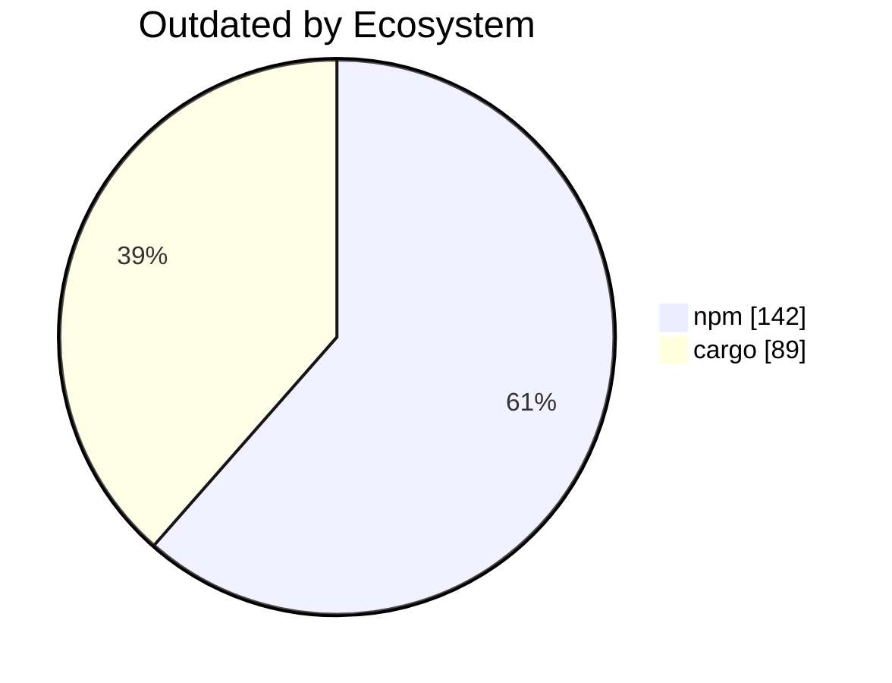

import BentoShell from '@/components/hero/BentoShell.astro';
import BentoProse from '@/components/hero/BentoProse.astro';

<section class="bento-hero bento-section not-content" aria-label="Dependency freshness">
	

	

		

			

				
					<svg viewBox="0 0 24 24" width="14" height="14" fill="none" stroke="currentColor" stroke-width="1.75" stroke-linecap="round" stroke-linejoin="round" aria-hidden="true"><path d="M12 2 2 7l10 5 10-5zM2 17l10 5 10-5M2 12l10 5 10-5" /></svg>
					auto-generated · daily
				
				<h1 class="bento-title">
					Dependency drift
					npm and cargo, daily.
				</h1>
				
<strong>231</strong> outdated dependencies — <strong>32</strong> major-version behind.

				
Last generated <strong>2026-08-01T04:24:29Z</strong>.

				

					<a class="bento-btn bento-btn--primary" href="#ecosystems">
						View drift
						<svg viewBox="0 0 24 24" fill="none" stroke="currentColor" aria-hidden="true"><path stroke-linecap="round" stroke-linejoin="round" stroke-width="2" d="M5 12h14M13 6l6 6-6 6" /></svg>
					</a>
					<a class="bento-btn bento-btn--ghost" href="#trends">Trends</a>
					<a class="bento-btn bento-btn--ghost" href="/dashboard/">Dashboard home</a>
				

			

				

					
						<svg viewBox="0 0 24 24" width="16" height="16" fill="none" stroke="currentColor" stroke-width="1.75" stroke-linecap="round" stroke-linejoin="round" aria-hidden="true"><path d="M12 2 2 7l10 5 10-5zM2 17l10 5 10-5M2 12l10 5 10-5" /></svg>
					
					231
					Outdated
				

				

					
						<svg viewBox="0 0 24 24" width="16" height="16" fill="none" stroke="currentColor" stroke-width="1.75" stroke-linecap="round" stroke-linejoin="round" aria-hidden="true"><path d="M12 9v4m0 4h.01M10.3 3.9 1.8 18a2 2 0 0 0 1.7 3h17a2 2 0 0 0 1.7-3L13.7 3.9a2 2 0 0 0-3.4 0z" /></svg>
					
					32
					Major
				

				

					
						<svg viewBox="0 0 24 24" width="16" height="16" fill="none" stroke="currentColor" stroke-width="1.75" stroke-linecap="round" stroke-linejoin="round" aria-hidden="true"><path d="M12 2 15 9l7 .5-5.3 4.6L18.5 21 12 17l-6.5 4 1.8-6.9L2 9.5 9 9z" /></svg>
					
					142
					npm
				

				

					
						<svg viewBox="0 0 24 24" width="16" height="16" fill="none" stroke="currentColor" stroke-width="1.75" stroke-linecap="round" stroke-linejoin="round" aria-hidden="true"><path d="M12 2a10 10 0 1 0 0 20 10 10 0 0 0 0-20z" /></svg>
					
					89
					cargo
				

		

		<nav class="bento-jump" aria-label="On this page">
			<a class="bento-chip" href="#ecosystems">Ecosystems</a>
			<a class="bento-chip" href="#trends">Trends</a>
		</nav>
	

</section>

<BentoShell id="ecosystems" eyebrow="Coverage" heading="Ecosystem drift">
	

		<a class="bento-cell bento-linkcard bento-card bento-card--glass bento-card--interactive" href="#npm">
			
				<svg viewBox="0 0 24 24" width="18" height="18" fill="none" stroke="currentColor" stroke-width="1.75" stroke-linecap="round" stroke-linejoin="round" aria-hidden="true"><path d="M12 2 15 9l7 .5-5.3 4.6L18.5 21 12 17l-6.5 4 1.8-6.9L2 9.5 9 9z" /></svg>
			
			npm
			142 outdated · 32 major
			
				<svg viewBox="0 0 24 24" width="16" height="16" fill="none" stroke="currentColor" stroke-width="2" stroke-linecap="round" stroke-linejoin="round"><path d="M5 12h14M13 6l6 6-6 6" /></svg>
			
		</a>
		<a class="bento-cell bento-linkcard bento-card bento-card--glass bento-card--interactive" href="#cargo">
			
				<svg viewBox="0 0 24 24" width="18" height="18" fill="none" stroke="currentColor" stroke-width="1.75" stroke-linecap="round" stroke-linejoin="round" aria-hidden="true"><path d="M12 2a10 10 0 1 0 0 20 10 10 0 0 0 0-20z" /></svg>
			
			cargo
			89 outdated · 0 major
			
				<svg viewBox="0 0 24 24" width="16" height="16" fill="none" stroke="currentColor" stroke-width="2" stroke-linecap="round" stroke-linejoin="round"><path d="M5 12h14M13 6l6 6-6 6" /></svg>
			
		</a>
	

</BentoShell>

<BentoProse id="trends" heading="Drift detail">

```mermaid
pie showData
    title Outdated by Ecosystem
    "npm" : 142
    "cargo" : 89
```

### npm

| Package | Current | Wanted | Latest | Major |
|---------|---------|--------|--------|:-----:|
| @astrojs/check | 0.9.9 | 0.9.9 | 0.9.10 |  |
| @astrojs/markdown-remark | 7.2.1 | 7.2.1 | 7.2.2 |  |
| @astrojs/mdx | 7.0.3 | 7.0.3 | 7.0.5 |  |
| @astrojs/react | 6.0.1 | 6.0.1 | 6.0.2 |  |
| @astrojs/starlight | 0.41.4 | 0.41.4 | 0.41.5 |  |
| @axe-core/playwright | 4.11.3 | 4.11.3 | 4.12.1 |  |
| @babel/core | 7.26.10 | 7.26.10 | 8.0.1 | ⚠️ |
| @babel/preset-react | 7.29.7 | 7.29.7 | 8.0.1 | ⚠️ |
| @babel/runtime | 7.27.6 | 7.27.6 | 8.0.0 | ⚠️ |
| @bufbuild/buf | 1.71.0 | 1.71.0 | 1.72.0 |  |
| @bufbuild/protobuf | 2.12.1 | 2.12.1 | 2.13.0 |  |
| @codemirror/state | 6.6.0 | 6.6.0 | 6.7.1 |  |
| @codemirror/view | 6.41.0 | 6.41.0 | 6.43.7 |  |
| @gltf-transform/core | 4.4.1 | 4.4.1 | 4.4.2 |  |
| @hcaptcha/react-native-hcaptcha | 4.0.0 | 4.0.0 | 4.1.0 |  |
| @hookform/resolvers | 5.2.2 | 5.2.2 | 5.5.7 |  |
| @nanostores/persistent | 1.3.4 | 1.3.4 | 1.3.5 |  |
| @nanostores/react | 1.0.0 | 1.0.0 | 1.1.0 |  |
| @novnc/novnc | 1.5.0 | 1.5.0 | 1.7.0 |  |
| @nx-tools/nx-container | 7.2.3 | 7.2.3 | 7.3.0 |  |
| @nx/devkit | 23.1.0 | 23.1.0 | 23.1.1 |  |
| @nx/esbuild | 23.1.0 | 23.1.0 | 23.1.1 |  |
| @nx/eslint | 23.1.0 | 23.1.0 | 23.1.1 |  |
| @nx/eslint-plugin | 23.1.0 | 23.1.0 | 23.1.1 |  |
| @nx/js | 23.1.0 | 23.1.0 | 23.1.1 |  |
| @nx/node | 23.1.0 | 23.1.0 | 23.1.1 |  |
| @nx/playwright | 23.1.0 | 23.1.0 | 23.1.1 |  |
| @nx/react | 23.1.0 | 23.1.0 | 23.1.1 |  |
| @nx/vite | 23.1.0 | 23.1.0 | 23.1.1 |  |
| @nx/vitest | 23.1.0 | 23.1.0 | 23.1.1 |  |
| @nx/web | 23.1.0 | 23.1.0 | 23.1.1 |  |
| @nx/webpack | 23.1.0 | 23.1.0 | 23.1.1 |  |
| @nx/workspace | 23.1.0 | 23.1.0 | 23.1.1 |  |
| @nxlv/python | 22.2.1 | 22.2.1 | 23.0.0 | ⚠️ |
| @pixiv/three-vrm | 3.5.3 | 3.5.3 | 3.5.5 |  |
| @pixiv/three-vrm-animation | 3.5.3 | 3.5.3 | 3.5.5 |  |
| @playwright/experimental-ct-react | 1.61.1 | 1.61.1 | 1.62.1 |  |
| @playwright/test | 1.61.1 | 1.61.1 | 1.62.1 |  |
| @react-native-async-storage/async-storage | 2.2.0 | 2.2.0 | 3.1.1 | ⚠️ |
| @react-spring/web | 10.0.3 | 10.0.3 | 10.1.2 |  |
| @react-three/fiber | 9.6.1 | 9.6.1 | 9.7.0 |  |
| @scalar/api-reference | 1.55.3 | 1.55.3 | 1.64.0 |  |
| @scalar/client-side-rendering | 0.3.1 | 0.3.1 | 0.3.5 |  |
| @shopify/react-native-skia | 2.6.9 | 2.6.9 | 2.10.1 |  |
| @supabase/supabase-js | 2.95.3 | 2.95.3 | 2.111.0 |  |
| @swc-node/register | 1.11.1 | 1.11.1 | 1.12.1 |  |
| @swc/core | 1.15.21 | 1.15.21 | 1.15.47 |  |
| @swc/helpers | 0.5.21 | 0.5.21 | 0.5.23 |  |
| @tailwindcss/postcss | 4.1.3 | 4.1.3 | 4.3.3 |  |
| @tailwindcss/vite | 4.1.3 | 4.1.3 | 4.3.3 |  |
| @tanstack/query-core | 5.100.5 | 5.100.5 | 5.101.4 |  |
| @tanstack/react-query | 5.101.2 | 5.101.2 | 5.101.4 |  |
| @tanstack/react-query-persist-client | 5.101.0 | 5.101.0 | 5.101.4 |  |
| @tanstack/react-router | 1.170.16 | 1.170.16 | 1.170.18 |  |
| @tauri-apps/api | 2.10.1 | 2.10.1 | 2.11.1 |  |
| @tauri-apps/plugin-store | 2.4.3 | 2.4.3 | 2.4.4 |  |
| @testing-library/jest-dom | 6.9.1 | 6.9.1 | 7.0.0 | ⚠️ |
| @types/dompurify | 3.2.0 | 3.2.0 | 3.2.0 |  |
| @types/node | 18.19.17 | 18.19.17 | 26.1.2 | ⚠️ |
| @types/react | 19.2.9 | 19.2.9 | 19.2.18 |  |
| @types/react-dom | 19.1.5 | 19.1.5 | 19.2.4 |  |
| @types/styled-components | 5.1.34 | 5.1.34 | 5.1.36 |  |
| @types/three | 0.176.0 | 0.176.0 | 0.185.1 |  |
| @typescript-eslint/eslint-plugin | 8.64.0 | 8.64.0 | 8.65.0 |  |
| @typescript-eslint/parser | 8.64.0 | 8.64.0 | 8.65.0 |  |
| @vitejs/plugin-react | 6.0.2 | 6.0.2 | 6.0.5 |  |
| @vitest/coverage-v8 | 4.0.9 | 4.0.9 | 4.1.10 |  |
| @vitest/ui | 4.0.9 | 4.0.9 | 4.1.10 |  |
| @vitest/web-worker | 4.0.9 | 4.0.9 | 4.1.10 |  |
| @xyflow/react | 12.11.1 | 12.11.1 | 12.11.2 |  |
| astro | 7.1.3 | 7.1.3 | 7.1.6 |  |
| astro-compressor | 1.2.0 | 1.2.0 | 1.3.0 |  |
| astro-vtbot | 2.1.11 | 2.1.11 | 3.0.1 | ⚠️ |
| autoprefixer | 10.5.0 | 10.5.0 | 10.5.4 |  |
| babel-preset-expo | 56.0.15 | 56.0.15 | 57.0.5 | ⚠️ |
| canvaskit-wasm | 0.41.0 | 0.41.0 | 0.41.1 |  |
| cssnano | 7.1.4 | 7.1.4 | 8.0.2 | ⚠️ |
| date-fns | 4.1.0 | 4.1.0 | 4.4.0 |  |
| dexie | 4.4.2 | 4.4.2 | 4.4.4 |  |
| dompurify | 3.4.11 | 3.4.11 | 3.4.12 |  |
| esbuild | 0.28.0 | 0.28.0 | 0.28.1 |  |
| eslint | 9.39.5 | 9.39.5 | 10.8.0 | ⚠️ |
| eslint-plugin-playwright | 2.10.5 | 2.10.5 | 2.11.0 |  |
| expo | 56.0.11 | 56.0.11 | 57.0.9 | ⚠️ |
| expo-auth-session | 56.0.14 | 56.0.14 | 57.0.5 | ⚠️ |
| expo-build-properties | 56.0.19 | 56.0.19 | 57.0.8 | ⚠️ |
| expo-dev-client | 56.0.20 | 56.0.20 | 57.0.10 | ⚠️ |
| expo-linking | 56.0.14 | 56.0.14 | 57.0.4 | ⚠️ |
| expo-status-bar | 56.0.4 | 56.0.4 | 57.0.1 | ⚠️ |
| expo-web-browser | 56.0.5 | 56.0.5 | 57.0.2 | ⚠️ |
| flatbuffers | 25.2.10 | 25.2.10 | 25.9.23 |  |
| framer-motion | 12.42.2 | 12.42.2 | 12.43.0 |  |
| happy-dom | 20.10.6 | 20.10.6 | 20.11.1 |  |
| html-react-parser | 5.2.3 | 5.2.3 | 6.1.5 | ⚠️ |
| jsdom | 29.1.1 | 29.1.1 | 30.0.1 | ⚠️ |
| jsonc-eslint-parser | 2.4.0 | 2.4.0 | 3.1.0 | ⚠️ |
| lint-staged | 16.4.0 | 16.4.0 | 17.3.0 | ⚠️ |
| lucide | 0.575.0 | 0.575.0 | 1.28.0 | ⚠️ |
| lucide-react | 0.575.0 | 0.575.0 | 1.28.0 | ⚠️ |
| marked | 18.0.2 | 18.0.2 | 18.0.7 |  |
| mdream | 1.4.1 | 1.4.1 | 1.5.8 |  |
| mermaid | 11.15.0 | 11.15.0 | 11.16.0 |  |
| monocart-reporter | 2.11.2 | 2.11.2 | 2.12.4 |  |
| nanostores | 1.4.0 | 1.4.0 | 1.4.2 |  |
| nx | 23.1.0 | 23.1.0 | 23.1.1 |  |
| phaser | 4.2.0 | 4.2.0 | 4.2.1 |  |
| postcss | 8.5.14 | 8.5.14 | 8.5.25 |  |
| postcss-merge-rules | 7.0.8 | 7.0.8 | 8.0.1 | ⚠️ |
| postprocessing | 6.39.2 | 6.39.2 | 6.39.4 |  |
| prettier | 3.8.1 | 3.8.1 | 3.9.6 |  |
| react | 19.2.3 | 19.2.3 | 19.2.8 |  |
| react-dom | 19.2.3 | 19.2.3 | 19.2.8 |  |
| react-hook-form | 7.55.0 | 7.55.0 | 7.83.0 |  |
| react-is | 19.2.4 | 19.2.4 | 19.2.8 |  |
| react-native | 0.85.3 | 0.85.3 | 0.86.2 |  |
| react-native-gesture-handler | 2.31.2 | 2.31.2 | 3.1.0 | ⚠️ |
| react-native-reanimated | 4.3.1 | 4.3.1 | 4.5.3 |  |
| react-native-safe-area-context | 5.7.0 | 5.7.0 | 5.8.0 |  |
| react-native-svg | 15.15.4 | 15.15.4 | 15.15.5 |  |
| react-native-url-polyfill | 3.0.0 | 3.0.0 | 4.0.0 | ⚠️ |
| react-native-webgpu | 0.5.15 | 0.5.15 | 0.8.1 |  |
| react-native-webview | 13.16.1 | 13.16.1 | 14.0.1 | ⚠️ |
| react-spring | 10.0.3 | 10.0.3 | 10.0.4 |  |
| react-window | 2.2.7 | 2.2.7 | 2.3.0 |  |
| recharts | 3.9.2 | 3.9.2 | 3.10.1 |  |
| shiki | 1.29.2 | 1.29.2 | 4.4.1 | ⚠️ |
| styled-components | 6.4.2 | 6.4.2 | 6.4.4 |  |
| tailwind-merge | 3.5.0 | 3.5.0 | 3.6.0 |  |
| tailwindcss | 4.1.3 | 4.1.3 | 4.3.3 |  |
| three | 0.184.0 | 0.184.0 | 0.185.1 |  |
| three-mesh-bvh | 0.9.11 | 0.9.11 | 0.9.13 |  |
| three-spritetext | 1.9.6 | 1.9.6 | 1.10.0 |  |
| typegpu | 0.11.8 | 0.11.8 | 0.11.9 |  |
| typescript | 6.0.3 | 6.0.3 | 7.0.2 | ⚠️ |
| verdaccio | 6.5.1 | 6.5.1 | 6.9.0 |  |
| vite | 8.0.9 | 8.0.9 | 8.2.0 |  |
| vite-plugin-dts | 4.5.4 | 4.5.4 | 5.0.3 | ⚠️ |
| vitest | 4.0.9 | 4.0.9 | 4.1.10 |  |
| webpack | 5.107.2 | 5.107.2 | 5.109.2 |  |
| webpack-cli | 7.1.0 | 7.1.0 | 7.2.2 |  |
| webpack-dev-server | 5.2.5 | 5.2.5 | 6.0.0 | ⚠️ |
| zod | 4.3.6 | 4.3.6 | 4.4.3 |  |

### cargo

| Crate | Current | Latest | Major |
|-------|---------|--------|:-----:|
| alsa | 0.10.0 | 0.11.0 |  |
| alsa-sys | 0.3.1 | 0.4.0 |  |
| ammonia | 4.1.3 | 4.1.4 |  |
| arrow | 58.3.0 | 58.4.0 |  |
| arrow-arith | 58.3.0 | 58.4.0 |  |
| arrow-array | 58.3.0 | 58.4.0 |  |
| arrow-buffer | 58.3.0 | 58.4.0 |  |
| arrow-cast | 58.3.0 | 58.4.0 |  |
| arrow-data | 58.3.0 | 58.4.0 |  |
| arrow-ord | 58.3.0 | 58.4.0 |  |
| arrow-row | 58.3.0 | 58.4.0 |  |
| arrow-schema | 58.3.0 | 58.4.0 |  |
| arrow-select | 58.3.0 | 58.4.0 |  |
| arrow-string | 58.3.0 | 58.4.0 |  |
| async-compression | 0.4.42 | 0.4.43 |  |
| aws-config | 1.9.0 | 1.10.1 |  |
| aws-runtime | 1.8.1 | 1.9.1 |  |
| aws-sdk-s3 | 1.138.1 | 1.140.0 |  |
| aws-sdk-sso | 1.103.0 | 1.105.0 |  |
| aws-sdk-ssooidc | 1.105.0 | 1.107.0 |  |
| aws-sdk-sts | 1.108.0 | 1.110.0 |  |
| aws-smithy-query | 0.61.1 | 0.62.0 |  |
| aws-smithy-runtime | 1.12.0 | 1.12.1 |  |
| aws-smithy-runtime-api | 1.13.0 | 1.14.0 |  |
| aws-smithy-xml | 0.61.1 | 0.62.0 |  |
| aws-types | 1.4.0 | 1.5.0 |  |
| axum-prometheus | 0.10.0 | 0.10.1 |  |
| branches | 0.4.4 | 0.4.5 |  |
| camino | 1.2.4 | 1.2.5 |  |
| cc | 1.3.0 | 1.4.0 |  |
| clang-sys | 1.8.1 | 1.9.1 |  |
| clap | 4.6.4 | 4.6.5 |  |
| clap_builder | 4.6.2 | 4.6.5 |  |
| coreaudio-rs | 0.13.0 | 0.14.2 |  |
| cpal | 0.17.1 | 0.17.3 |  |
| displaydoc | 0.2.6 | 0.2.7 |  |
| duckdb | 1.10504.0 | 1.10505.0 |  |
| either | 1.16.0 | 1.17.0 |  |
| enum-ordinalize | 4.4.1 | 4.4.2 |  |
| enum-ordinalize-derive | 4.4.1 | 4.4.2 |  |
| event-listener | 5.4.1 | 5.4.2 |  |
| font-types | 0.12.1 | 0.12.2 |  |
| foreign-types-macros | 0.2.3 | 0.2.4 |  |
| glob | 0.3.3 | 0.3.4 |  |
| http | 1.4.2 | 1.5.0 |  |
| hybrid-array | 0.4.13 | 0.4.14 |  |
| impl-more | 0.3.1 | 0.3.5 |  |
| jiff | 0.2.34 | 0.2.35 |  |
| jiff-static | 0.2.34 | 0.2.35 |  |
| jsonpath-rust | 1.0.5 | 1.0.7 |  |
| libc | 0.2.188 | 0.2.189 |  |
| libduckdb-sys | 1.10504.0 | 1.10505.0 |  |
| macro_rules_attribute | 0.2.2 | 0.2.3 |  |
| macro_rules_attribute-proc_macro | 0.2.2 | 0.2.3 |  |
| pest | 2.8.7 | 2.8.8 |  |
| pest_derive | 2.8.7 | 2.8.8 |  |
| pest_generator | 2.8.7 | 2.8.8 |  |
| pest_meta | 2.8.7 | 2.8.8 |  |
| proc-macro-error-attr3 | 3.0.2 | 3.0.3 |  |
| proc-macro-error3 | 3.0.2 | 3.0.3 |  |
| redox_syscall | 0.9.0 | 0.9.1 |  |
| rustls | 0.23.42 | 0.23.43 |  |
| rustls-pki-types | 1.15.0 | 1.15.1 |  |
| schemars | 1.2.1 | 1.2.2 |  |
| schemars_derive | 1.2.1 | 1.2.2 |  |
| sse-stream | 0.2.4 | 0.2.5 |  |
| syn | 3.0.2 | 3.0.3 |  |
| tao-macros | 0.1.3 | 0.1.4 |  |
| tokio-macros | 2.7.1 | 2.7.2 |  |
| tokio-stream | 0.1.18 | 0.1.19 |  |
| tokio-util | 0.7.18 | 0.7.19 |  |
| toml | 1.1.3+spec-1.1.0 | 1.1.4+spec-1.1.0 |  |
| toml_parser | 1.1.2+spec-1.1.0 | 1.1.3+spec-1.1.0 |  |
| tray-icon | 0.24.1 | 0.24.2 |  |
| turso | 0.7.0 | 0.7.2 |  |
| turso_core | 0.7.0 | 0.7.2 |  |
| turso_ext | 0.7.0 | 0.7.2 |  |
| turso_macros | 0.7.0 | 0.7.2 |  |
| turso_parser | 0.7.0 | 0.7.2 |  |
| turso_sdk_kit | 0.7.0 | 0.7.2 |  |
| turso_sdk_kit_macros | 0.7.0 | 0.7.2 |  |
| turso_sync_engine | 0.7.0 | 0.7.2 |  |
| turso_sync_sdk_kit | 0.7.0 | 0.7.2 |  |
| wayland-backend | 0.3.15 | 0.3.16 |  |
| wayland-client | 0.31.14 | 0.31.15 |  |
| wayland-scanner | 0.31.10 | 0.31.11 |  |
| webbrowser | 1.2.1 | 1.2.2 |  |
| xcursor | 0.3.10 | 0.3.11 |  |
| xxhash-rust | 0.8.17 | 0.8.18 |  |

</BentoProse>

<BentoProse id="about">

---

*Auto-generated by [ci-daily-content.yml](https://github.com/KBVE/kbve/actions/workflows/ci-daily-content.yml)*

</BentoProse>

