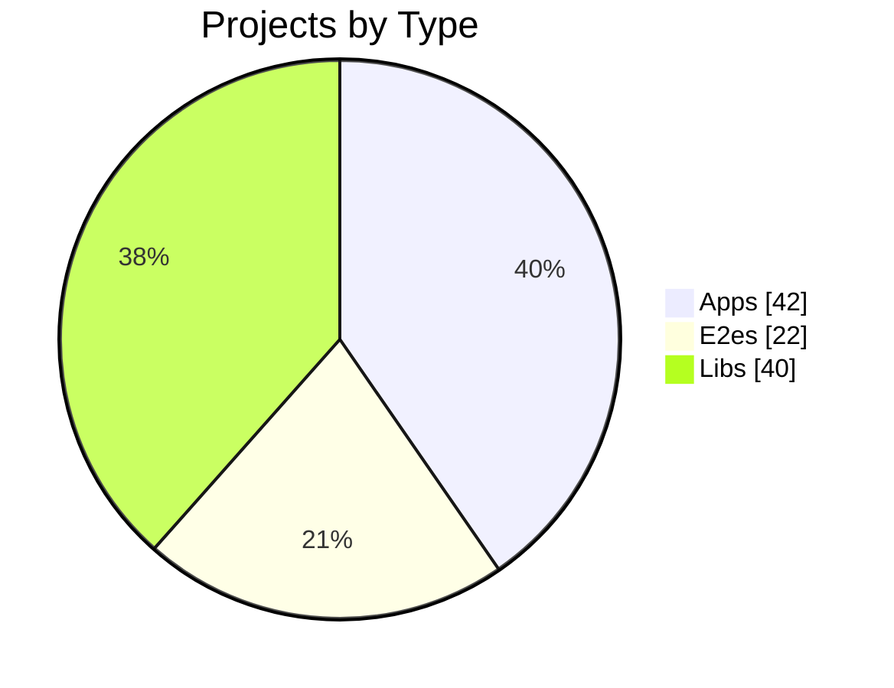
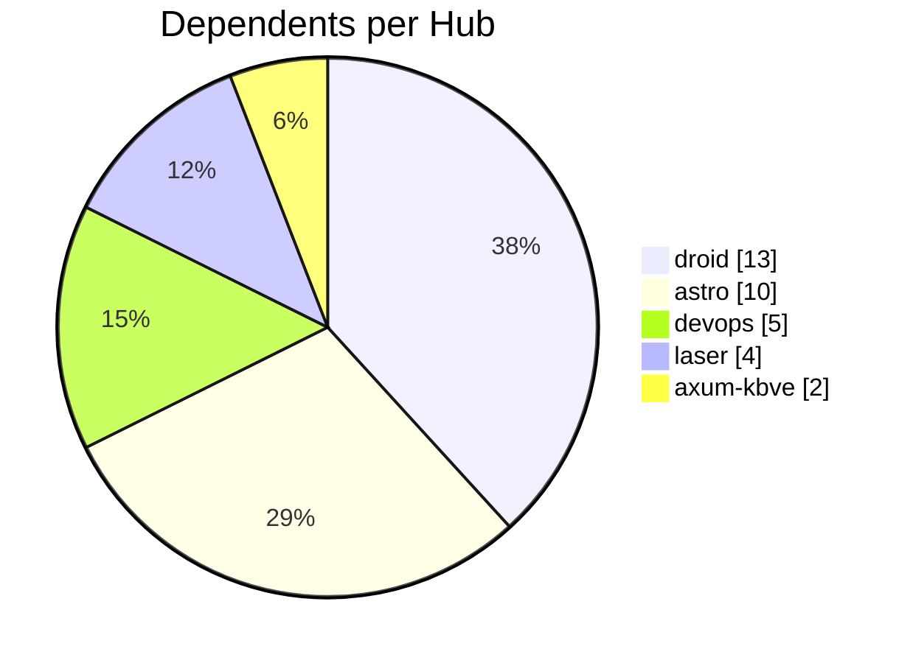

import { Card, CardGrid, Tabs, TabItem } from '@astrojs/starlight/components';

## NX Dependency Graph

:::note[Auto-generated]
Last generated: **2026-05-28T09:28:06Z** — updated daily by `ci-dashboard`.
:::

<CardGrid>
  <Card title="42 Apps" icon="rocket">
    @kbve/source, agones-factorio, agones-factorio-relay, angelscript, astro-chuckrpg, astro-cryptothrone + 36 more
  </Card>
  <Card title="22 E2es" icon="approve-check-circle">
    arc-runner-e2e, aria2-proxy-e2e, astro-cryptothrone-e2e, astro-e2e, astro-kbve-e2e, astro-rareicon-e2e + 16 more
  </Card>
  <Card title="40 Libs" icon="puzzle">
    arc-runner, aria2-proxy, astro, bevy_battle, bevy_behavior, bevy_cam + 34 more
  </Card>
  <Card title="47 Dependencies" icon="random">
    Across 104 projects in the monorepo.
  </Card>
</CardGrid>

### Most Depended-On Projects

<CardGrid>
  <Card title="droid" icon="puzzle">
    **13** projects depend on this lib. Located at `packages/npm/droid`.
  </Card>
  <Card title="astro" icon="puzzle">
    **10** projects depend on this lib. Located at `packages/npm/astro`.
  </Card>
  <Card title="devops" icon="puzzle">
    **5** projects depend on this lib. Located at `packages/npm/devops`.
  </Card>
  <Card title="laser" icon="puzzle">
    **4** projects depend on this lib. Located at `packages/npm/laser`.
  </Card>
  <Card title="axum-kbve" icon="rocket">
    **2** projects depend on this app. Located at `apps/kbve/axum-kbve`.
  </Card>
</CardGrid>

### Project Distribution

### Hub Connectivity

<Tabs>
  <TabItem label="Diagram">

```mermaid
graph LR
    classDef app fill:#3b82f6,stroke:#1d4ed8,color:#fff
    classDef lib fill:#10b981,stroke:#059669,color:#fff
    classDef e2e fill:#f59e0b,stroke:#d97706,color:#fff
    _kbve_source["@kbve/source"] --> devops["devops"]
    arc_runner_e2e["arc-runner-e2e"] --> arc_runner["arc-runner"]
    aria2_proxy_e2e["aria2-proxy-e2e"] --> aria2_proxy["aria2-proxy"]
    astro["astro"] --> droid["droid"]
    astro_chuckrpg["astro-chuckrpg"] --> astro["astro"]
    astro_chuckrpg["astro-chuckrpg"] --> droid["droid"]
    astro_cryptothrone["astro-cryptothrone"] --> laser["laser"]
    astro_cryptothrone_e2e["astro-cryptothrone-e2e"] --> astro_cryptothrone["astro-cryptothrone"]
    astro_discordsh["astro-discordsh"] --> astro["astro"]
    astro_discordsh["astro-discordsh"] --> droid["droid"]
    astro_e2e["astro-e2e"] --> astro["astro"]
    astro_e2e["astro-e2e"] --> droid["droid"]
    astro_herbmail["astro-herbmail"] --> astro["astro"]
    astro_herbmail["astro-herbmail"] --> droid["droid"]
    astro_irc["astro-irc"] --> astro["astro"]
    astro_irc["astro-irc"] --> droid["droid"]
    astro_kbve["astro-kbve"] --> astro["astro"]
    astro_kbve["astro-kbve"] --> devops["devops"]
    astro_kbve["astro-kbve"] --> droid["droid"]
    astro_kbve["astro-kbve"] --> laser["laser"]
    astro_kbve_e2e["astro-kbve-e2e"] --> axum_kbve["axum-kbve"]
    astro_memes["astro-memes"] --> astro["astro"]
    astro_memes["astro-memes"] --> droid["droid"]
    astro_rareicon["astro-rareicon"] --> astro["astro"]
    astro_rareicon["astro-rareicon"] --> droid["droid"]
    astro_rareicon_e2e["astro-rareicon-e2e"] --> astro_rareicon["astro-rareicon"]
    axum_chuckrpg_e2e["axum-chuckrpg-e2e"] --> axum_chuckrpg["axum-chuckrpg"]
    axum_kbve_e2e["axum-kbve-e2e"] --> axum_kbve["axum-kbve"]
    axum_rareicon_e2e["axum-rareicon-e2e"] --> axum_rareicon["axum-rareicon"]
    devops_e2e["devops-e2e"] --> devops["devops"]
    discordsh_bot_e2e["discordsh-bot-e2e"] --> discordsh_bot["discordsh-bot"]
    discordsh_e2e["discordsh-e2e"] --> astro_discordsh["astro-discordsh"]
    discordsh_e2e["discordsh-e2e"] --> axum_discordsh["axum-discordsh"]
    droid_e2e["droid-e2e"] --> droid["droid"]
    edge_e2e["edge-e2e"] --> edge["edge"]
    firecracker_ctl_e2e["firecracker-ctl-e2e"] --> firecracker_ctl["firecracker-ctl"]
    herbmail_e2e["herbmail-e2e"] --> astro_herbmail["astro-herbmail"]
    herbmail_e2e["herbmail-e2e"] --> axum_herbmail["axum-herbmail"]
    irc_e2e["irc-e2e"] --> astro_irc["astro-irc"]
    irc_e2e["irc-e2e"] --> irc_gateway["irc-gateway"]
    khashvault["khashvault"] --> droid["droid"]
    khashvault_e2e["khashvault-e2e"] --> khashvault["khashvault"]
    kubectl_e2e["kubectl-e2e"] --> kbve_kubectl["kbve-kubectl"]
    laser_e2e["laser-e2e"] --> laser["laser"]
    memes_e2e["memes-e2e"] --> astro_memes["astro-memes"]
    memes_e2e["memes-e2e"] --> axum_memes["axum-memes"]
    rows_e2e["rows-e2e"] --> rows["rows"]
    class _kbve_source,agones_factorio,agones_factorio_relay,angelscript,astro_chuckrpg,astro_cryptothrone,astro_discordsh,astro_herbmail,astro_irc,astro_kbve,astro_memes,astro_rareicon,axum_chuckrpg,axum_cryptothrone,axum_discordsh,axum_herbmail,axum_kbve,axum_memes,axum_rareicon,cryptothrone,desktop_kbve,discordsh,discordsh_bot,edge,firecracker_ctl,herbmail,iot_edge_worker,irc,irc_gateway,isometric,kbve_kubectl,kilobase,mc,mc_lobby,mc_velocity,memes,nd_server,nexus_defense,notification_bot,pydesk,rows,unity_rareicon app
    class arc_runner,aria2_proxy,astro,bevy_battle,bevy_behavior,bevy_cam,bevy_chat,bevy_db,bevy_inventory,bevy_items,bevy_kbve_net,bevy_mapdb,bevy_npc,bevy_pathfinder,bevy_player,bevy_quests,bevy_skills,bevy_statemachine,bevy_supa,bevy_tasker,chisel_ubuntu_axum,data_proto,data_sql,devops,droid,erust,firecracker_node_web,firecracker_python_net,firecracker_python_web,holy,jedi,kasm_cloakbrowser,kbve,khashvault,laser,python_fudster,python_kbve,q,steamcmd_ubuntu,uniti lib
    class arc_runner_e2e,aria2_proxy_e2e,astro_cryptothrone_e2e,astro_e2e,astro_kbve_e2e,astro_rareicon_e2e,axum_chuckrpg_e2e,axum_kbve_e2e,axum_rareicon_e2e,devops_e2e,discordsh_bot_e2e,discordsh_e2e,droid_e2e,edge_e2e,firecracker_ctl_e2e,herbmail_e2e,irc_e2e,khashvault_e2e,kubectl_e2e,laser_e2e,memes_e2e,rows_e2e e2e
```

:::tip[Legend]
**Blue** = Application &nbsp; **Green** = Library &nbsp; **Amber** = E2E Test
:::

  </TabItem>
  <TabItem label="Project Index">

| Project | Type | Root | Deps | Dependents |
|---------|------|------|:----:|:----------:|
| **@kbve/source** | app | `.` | 1 | 0 |
| **agones-factorio** | app | `apps/agones/factorio` | 0 | 0 |
| **agones-factorio-relay** | app | `apps/agones/factorio/relay` | 0 | 0 |
| **angelscript** | app | `apps/angelscript` | 0 | 0 |
| **arc-runner** | lib | `packages/docker/arc-runner` | 0 | 1 |
| **arc-runner-e2e** | e2e | `packages/docker/arc-runner-e2e` | 1 | 0 |
| **aria2-proxy** | lib | `apps/vm/aria2-proxy` | 0 | 1 |
| **aria2-proxy-e2e** | e2e | `apps/vm/aria2-proxy-e2e` | 1 | 0 |
| **astro** | lib | `packages/npm/astro` | 2 | 10 |
| **astro-chuckrpg** | app | `apps/chuckrpg/astro-chuckrpg` | 2 | 0 |
| **astro-cryptothrone** | app | `apps/cryptothrone/astro-cryptothrone` | 1 | 1 |
| **astro-cryptothrone-e2e** | e2e | `apps/cryptothrone/astro-cryptothrone-e2e` | 1 | 0 |
| **astro-discordsh** | app | `apps/discordsh/astro-discordsh` | 2 | 1 |
| **astro-e2e** | e2e | `packages/npm/astro-e2e` | 3 | 0 |
| **astro-herbmail** | app | `apps/herbmail/astro-herbmail` | 2 | 1 |
| **astro-irc** | app | `apps/irc/astro-irc` | 3 | 1 |
| **astro-kbve** | app | `apps/kbve/astro-kbve` | 4 | 0 |
| **astro-kbve-e2e** | e2e | `apps/kbve/astro-kbve-e2e` | 1 | 0 |
| **astro-memes** | app | `apps/memes/astro-memes` | 2 | 1 |
| **astro-rareicon** | app | `apps/rareicon/astro-rareicon` | 2 | 1 |
| **astro-rareicon-e2e** | e2e | `apps/rareicon/astro-rareicon-e2e` | 1 | 0 |
| **axum-chuckrpg** | app | `apps/chuckrpg/axum-chuckrpg` | 0 | 1 |
| **axum-chuckrpg-e2e** | e2e | `apps/chuckrpg/axum-chuckrpg-e2e` | 1 | 0 |
| **axum-cryptothrone** | app | `apps/cryptothrone/axum-cryptothrone` | 0 | 0 |
| **axum-discordsh** | app | `apps/discordsh/axum-discordsh` | 0 | 1 |
| **axum-herbmail** | app | `apps/herbmail/axum-herbmail` | 0 | 1 |
| **axum-kbve** | app | `apps/kbve/axum-kbve` | 0 | 2 |
| **axum-kbve-e2e** | e2e | `apps/kbve/axum-kbve-e2e` | 1 | 0 |
| **axum-memes** | app | `apps/memes/axum-memes` | 0 | 1 |
| **axum-rareicon** | app | `apps/rareicon/axum-rareicon` | 0 | 1 |
| **axum-rareicon-e2e** | e2e | `apps/rareicon/axum-rareicon-e2e` | 1 | 0 |
| **bevy_battle** | lib | `packages/rust/bevy/bevy_battle` | 0 | 0 |
| **bevy_behavior** | lib | `packages/rust/bevy/bevy_behavior` | 0 | 0 |
| **bevy_cam** | lib | `packages/rust/bevy/bevy_cam` | 0 | 0 |
| **bevy_chat** | lib | `packages/rust/bevy/bevy_chat` | 0 | 0 |
| **bevy_db** | lib | `packages/rust/bevy/bevy_db` | 0 | 0 |
| **bevy_inventory** | lib | `packages/rust/bevy/bevy_inventory` | 0 | 0 |
| **bevy_items** | lib | `packages/rust/bevy/bevy_items` | 0 | 0 |
| **bevy_kbve_net** | lib | `packages/rust/bevy/bevy_kbve_net` | 0 | 0 |
| **bevy_mapdb** | lib | `packages/rust/bevy/bevy_mapdb` | 0 | 0 |
| **bevy_npc** | lib | `packages/rust/bevy/bevy_npc` | 0 | 0 |
| **bevy_pathfinder** | lib | `packages/rust/bevy/bevy_pathfinder` | 0 | 0 |
| **bevy_player** | lib | `packages/rust/bevy/bevy_player` | 0 | 0 |
| **bevy_quests** | lib | `packages/rust/bevy/bevy_quests` | 0 | 0 |
| **bevy_skills** | lib | `packages/rust/bevy/bevy_skills` | 0 | 0 |
| **bevy_statemachine** | lib | `packages/rust/bevy/bevy_statemachine` | 0 | 0 |
| **bevy_supa** | lib | `packages/rust/bevy/bevy_supa` | 0 | 0 |
| **bevy_tasker** | lib | `packages/rust/bevy/bevy_tasker` | 0 | 0 |
| **chisel-ubuntu-axum** | lib | `packages/docker/chisel-ubuntu-axum` | 0 | 0 |
| **cryptothrone** | app | `apps/cryptothrone` | 0 | 0 |
| **data-proto** | lib | `packages/data/proto` | 0 | 0 |
| **data-sql** | lib | `packages/data/sql` | 0 | 0 |
| **desktop-kbve** | app | `apps/kbve/desktop-kbve` | 0 | 0 |
| **devops** | lib | `packages/npm/devops` | 0 | 5 |
| **devops-e2e** | e2e | `packages/npm/devops-e2e` | 3 | 0 |
| **discordsh** | app | `apps/discordsh` | 0 | 0 |
| **discordsh-bot** | app | `apps/discordsh/discordsh-bot` | 0 | 1 |
| **discordsh-bot-e2e** | e2e | `apps/discordsh/discordsh-bot-e2e` | 1 | 0 |
| **discordsh-e2e** | e2e | `apps/discordsh/discordsh-e2e` | 2 | 0 |
| **droid** | lib | `packages/npm/droid` | 0 | 13 |
| **droid-e2e** | e2e | `packages/npm/droid-e2e` | 2 | 0 |
| **edge** | app | `apps/kbve/edge` | 0 | 1 |
| **edge-e2e** | e2e | `apps/kbve/edge-e2e` | 1 | 0 |
| **erust** | lib | `packages/rust/erust` | 0 | 0 |
| **firecracker-ctl** | app | `apps/vm/firecracker-ctl` | 0 | 1 |
| **firecracker-ctl-e2e** | e2e | `apps/vm/firecracker-ctl-e2e` | 1 | 0 |
| **firecracker-node-web** | lib | `packages/docker/firecracker/node/web` | 0 | 0 |
| **firecracker-python-net** | lib | `packages/docker/firecracker/python/net` | 0 | 0 |
| **firecracker-python-web** | lib | `packages/docker/firecracker/python/web` | 0 | 0 |
| **herbmail** | app | `apps/herbmail` | 0 | 0 |
| **herbmail-e2e** | e2e | `apps/herbmail/herbmail-e2e` | 2 | 0 |
| **holy** | lib | `packages/rust/holy` | 0 | 0 |
| **iot-edge-worker** | app | `apps/vm/iot/edge-worker` | 0 | 0 |
| **irc** | app | `apps/irc` | 0 | 0 |
| **irc-e2e** | e2e | `apps/irc/irc-e2e` | 2 | 0 |
| **irc-gateway** | app | `apps/irc/irc-gateway` | 0 | 1 |
| **isometric** | app | `apps/kbve/isometric` | 0 | 0 |
| **jedi** | lib | `packages/rust/jedi` | 0 | 0 |
| **kasm-cloakbrowser** | lib | `packages/docker/kasm-cloakbrowser` | 0 | 0 |
| **kbve** | lib | `packages/rust/kbve` | 0 | 0 |
| **kbve-kubectl** | app | `apps/vm/kubectl` | 0 | 1 |
| **khashvault** | lib | `packages/npm/khashvault` | 1 | 2 |
| **khashvault-e2e** | e2e | `packages/npm/khashvault-e2e` | 2 | 0 |
| **kilobase** | app | `apps/kbve/kilobase` | 0 | 0 |
| **kubectl-e2e** | e2e | `apps/vm/kubectl-e2e` | 1 | 0 |
| **laser** | lib | `packages/npm/laser` | 0 | 4 |
| **laser-e2e** | e2e | `packages/npm/laser-e2e` | 2 | 0 |
| **mc** | app | `apps/mc` | 0 | 0 |
| **mc-lobby** | app | `apps/mc/lobby` | 0 | 0 |
| **mc-velocity** | app | `apps/mc/velocity` | 0 | 0 |
| **memes** | app | `apps/memes` | 0 | 0 |
| **memes-e2e** | e2e | `apps/memes/memes-e2e` | 2 | 0 |
| **nd-server** | app | `apps/godot/nexus-defense/server` | 0 | 0 |
| **nexus-defense** | app | `apps/godot/nexus-defense` | 0 | 0 |
| **notification-bot** | app | `apps/discordsh/notification-bot` | 0 | 0 |
| **pydesk** | app | `apps/pydesk` | 0 | 0 |
| **python-fudster** | lib | `packages/python/fudster` | 0 | 0 |
| **python-kbve** | lib | `packages/python/kbve` | 0 | 0 |
| **q** | lib | `packages/rust/q` | 0 | 0 |
| **rows** | app | `apps/rows` | 0 | 1 |
| **rows-e2e** | e2e | `apps/rows-e2e` | 1 | 0 |
| **steamcmd-ubuntu** | lib | `packages/docker/steamcmd-ubuntu` | 0 | 0 |
| **uniti** | lib | `packages/rust/bevy/uniti` | 0 | 0 |
| **unity-rareicon** | app | `apps/rareicon/unity-rareicon` | 0 | 0 |

  </TabItem>
  <TabItem label="Details">

#### App Projects

<strong>@kbve/source</strong> (1 dep)

| Target | Type |
|--------|------|
| devops | static |

<strong>astro-chuckrpg</strong> (2 deps)

| Target | Type |
|--------|------|
| astro | static |
| droid | static |

<strong>astro-cryptothrone</strong> (1 dep)

| Target | Type |
|--------|------|
| laser | static |

<strong>astro-discordsh</strong> (2 deps)

| Target | Type |
|--------|------|
| astro | static |
| droid | static |

<strong>astro-herbmail</strong> (2 deps)

| Target | Type |
|--------|------|
| astro | static |
| droid | static |

<strong>astro-irc</strong> (3 deps)

| Target | Type |
|--------|------|
| astro | dynamic |
| astro | static |
| droid | static |

<strong>astro-kbve</strong> (4 deps)

| Target | Type |
|--------|------|
| astro | static |
| devops | static |
| droid | static |
| laser | static |

<strong>astro-memes</strong> (2 deps)

| Target | Type |
|--------|------|
| astro | static |
| droid | static |

<strong>astro-rareicon</strong> (2 deps)

| Target | Type |
|--------|------|
| astro | static |
| droid | static |

#### E2e Projects

<strong>arc-runner-e2e</strong> (1 dep)

| Target | Type |
|--------|------|
| arc-runner | implicit |

<strong>aria2-proxy-e2e</strong> (1 dep)

| Target | Type |
|--------|------|
| aria2-proxy | implicit |

<strong>astro-cryptothrone-e2e</strong> (1 dep)

| Target | Type |
|--------|------|
| astro-cryptothrone | implicit |

<strong>astro-e2e</strong> (3 deps)

| Target | Type |
|--------|------|
| astro | implicit |
| astro | static |
| droid | static |

<strong>astro-kbve-e2e</strong> (1 dep)

| Target | Type |
|--------|------|
| axum-kbve | implicit |

<strong>astro-rareicon-e2e</strong> (1 dep)

| Target | Type |
|--------|------|
| astro-rareicon | implicit |

<strong>axum-chuckrpg-e2e</strong> (1 dep)

| Target | Type |
|--------|------|
| axum-chuckrpg | implicit |

<strong>axum-kbve-e2e</strong> (1 dep)

| Target | Type |
|--------|------|
| axum-kbve | implicit |

<strong>axum-rareicon-e2e</strong> (1 dep)

| Target | Type |
|--------|------|
| axum-rareicon | implicit |

<strong>devops-e2e</strong> (3 deps)

| Target | Type |
|--------|------|
| devops | implicit |
| devops | static |
| devops | dynamic |

<strong>discordsh-bot-e2e</strong> (1 dep)

| Target | Type |
|--------|------|
| discordsh-bot | implicit |

<strong>discordsh-e2e</strong> (2 deps)

| Target | Type |
|--------|------|
| astro-discordsh | implicit |
| axum-discordsh | implicit |

<strong>droid-e2e</strong> (2 deps)

| Target | Type |
|--------|------|
| droid | implicit |
| droid | static |

<strong>edge-e2e</strong> (1 dep)

| Target | Type |
|--------|------|
| edge | implicit |

<strong>firecracker-ctl-e2e</strong> (1 dep)

| Target | Type |
|--------|------|
| firecracker-ctl | implicit |

<strong>herbmail-e2e</strong> (2 deps)

| Target | Type |
|--------|------|
| astro-herbmail | implicit |
| axum-herbmail | implicit |

<strong>irc-e2e</strong> (2 deps)

| Target | Type |
|--------|------|
| astro-irc | implicit |
| irc-gateway | implicit |

<strong>khashvault-e2e</strong> (2 deps)

| Target | Type |
|--------|------|
| khashvault | implicit |
| khashvault | static |

<strong>kubectl-e2e</strong> (1 dep)

| Target | Type |
|--------|------|
| kbve-kubectl | implicit |

<strong>laser-e2e</strong> (2 deps)

| Target | Type |
|--------|------|
| laser | implicit |
| laser | static |

<strong>memes-e2e</strong> (2 deps)

| Target | Type |
|--------|------|
| astro-memes | implicit |
| axum-memes | implicit |

<strong>rows-e2e</strong> (1 dep)

| Target | Type |
|--------|------|
| rows | implicit |

#### Lib Projects

<strong>astro</strong> (2 deps)

| Target | Type |
|--------|------|
| droid | static |
| droid | dynamic |

<strong>khashvault</strong> (1 dep)

| Target | Type |
|--------|------|
| droid | static |

  </TabItem>
</Tabs>

---

*Auto-generated by [ci-dashboard.yml](https://github.com/KBVE/kbve/actions/workflows/ci-dashboard.yml)*
