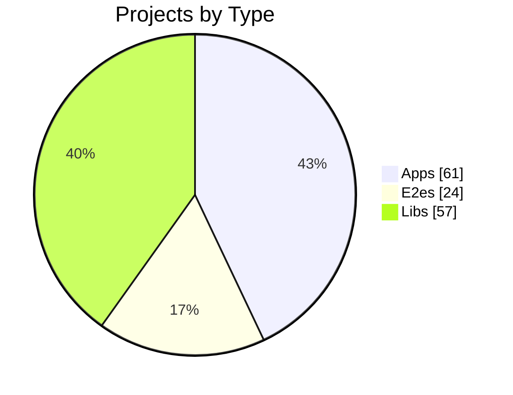
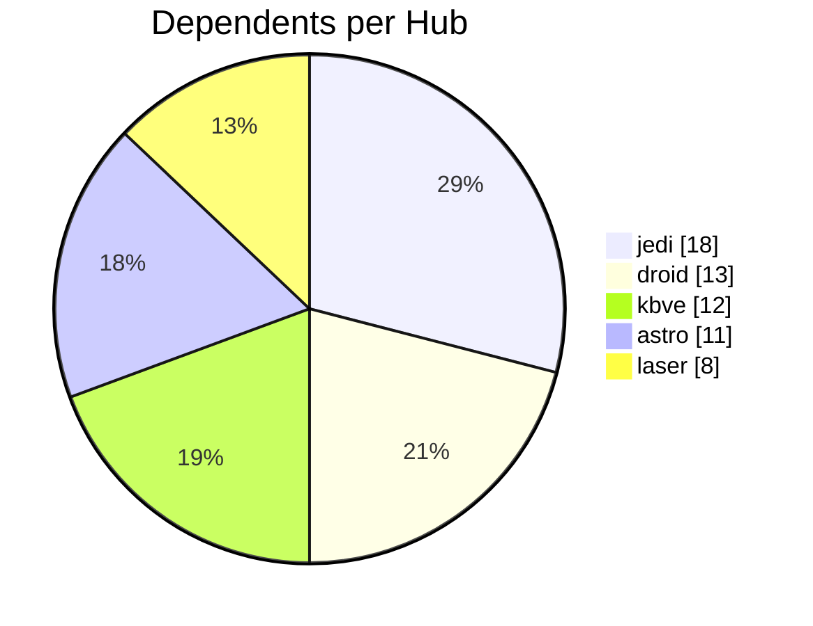

import BentoShell from '@/components/hero/BentoShell.astro';
import BentoProse from '@/components/hero/BentoProse.astro';

<section class="bento-hero bento-section not-content" aria-label="NX dependency graph">
	

	

		

			

				
					<svg viewBox="0 0 24 24" width="14" height="14" fill="none" stroke="currentColor" stroke-width="1.75" stroke-linecap="round" stroke-linejoin="round" aria-hidden="true"><path d="M6 3v12M18 9a3 3 0 1 0 0 6 3 3 0 0 0 0-6zM6 21a3 3 0 1 0 0-6 3 3 0 0 0 0 6zM15 6a9 9 0 0 1-9 9" /></svg>
					auto-generated · daily
				
				<h1 class="bento-title">
					Dependency graph
					across the monorepo.
				</h1>
				
<strong>142</strong> projects wired by <strong>155</strong> dependency edges.

				
Last generated <strong>2026-07-24T04:14:50Z</strong>.

				

					<a class="bento-btn bento-btn--primary" href="#diagram">
						View diagram
						<svg viewBox="0 0 24 24" fill="none" stroke="currentColor" aria-hidden="true"><path stroke-linecap="round" stroke-linejoin="round" stroke-width="2" d="M5 12h14M13 6l6 6-6 6" /></svg>
					</a>
					<a class="bento-btn bento-btn--ghost" href="#hubs">Top hubs</a>
					<a class="bento-btn bento-btn--ghost" href="#project-index">Projects</a>
				

			

				

					
						<svg viewBox="0 0 24 24" width="16" height="16" fill="none" stroke="currentColor" stroke-width="1.75" stroke-linecap="round" stroke-linejoin="round" aria-hidden="true"><path d="M4.5 16.5c-1.5 1.26-2 5-2 5s3.74-.5 5-2c.71-.84.7-2.13-.09-2.91a2.18 2.18 0 0 0-2.91-.09zM12 15l-3-3a22 22 0 0 1 2-3.95A12.88 12.88 0 0 1 22 2c0 2.72-.78 7.5-6 11a22.35 22.35 0 0 1-4 2z" /></svg>
					
					61
					Apps
				

				

					
						<svg viewBox="0 0 24 24" width="16" height="16" fill="none" stroke="currentColor" stroke-width="1.75" stroke-linecap="round" stroke-linejoin="round" aria-hidden="true"><path d="M4 4h7v7H4zM13 13h7v7h-7zM13 4h7v7h-7zM4 13h7v7H4z" /></svg>
					
					57
					Libs
				

				

					
						<svg viewBox="0 0 24 24" width="16" height="16" fill="none" stroke="currentColor" stroke-width="1.75" stroke-linecap="round" stroke-linejoin="round" aria-hidden="true"><path d="M22 11.08V12a10 10 0 1 1-5.93-9.14M22 4 12 14.01l-3-3" /></svg>
					
					24
					E2E
				

				

					
						<svg viewBox="0 0 24 24" width="16" height="16" fill="none" stroke="currentColor" stroke-width="1.75" stroke-linecap="round" stroke-linejoin="round" aria-hidden="true"><path d="M10 13a5 5 0 0 0 7.54.54l3-3a5 5 0 0 0-7.07-7.07l-1.72 1.71M14 11a5 5 0 0 0-7.54-.54l-3 3a5 5 0 0 0 7.07 7.07l1.71-1.71" /></svg>
					
					155
					Dependencies
				

		

		<nav class="bento-jump" aria-label="On this page">
			<a class="bento-chip" href="#hubs">Hubs</a>
			<a class="bento-chip" href="#diagram">Diagram</a>
			<a class="bento-chip" href="#project-index">Projects</a>
		</nav>
	

</section>

<BentoShell id="hubs" eyebrow="Connectivity" heading="Most depended-on">
	

		

			
				<svg viewBox="0 0 24 24" width="18" height="18" fill="none" stroke="currentColor" stroke-width="1.75" stroke-linecap="round" stroke-linejoin="round" aria-hidden="true"><path d="M4 4h7v7H4zM13 13h7v7h-7zM13 4h7v7h-7zM4 13h7v7H4z" /></svg>
			
			jedi
			18 projects depend on this lib · packages/rust/jedi
		

		

			
				<svg viewBox="0 0 24 24" width="18" height="18" fill="none" stroke="currentColor" stroke-width="1.75" stroke-linecap="round" stroke-linejoin="round" aria-hidden="true"><path d="M4 4h7v7H4zM13 13h7v7h-7zM13 4h7v7h-7zM4 13h7v7H4z" /></svg>
			
			droid
			13 projects depend on this lib · packages/npm/droid
		

		

			
				<svg viewBox="0 0 24 24" width="18" height="18" fill="none" stroke="currentColor" stroke-width="1.75" stroke-linecap="round" stroke-linejoin="round" aria-hidden="true"><path d="M4 4h7v7H4zM13 13h7v7h-7zM13 4h7v7h-7zM4 13h7v7H4z" /></svg>
			
			kbve
			12 projects depend on this lib · packages/rust/kbve
		

		

			
				<svg viewBox="0 0 24 24" width="18" height="18" fill="none" stroke="currentColor" stroke-width="1.75" stroke-linecap="round" stroke-linejoin="round" aria-hidden="true"><path d="M4 4h7v7H4zM13 13h7v7h-7zM13 4h7v7h-7zM4 13h7v7H4z" /></svg>
			
			astro
			11 projects depend on this lib · packages/npm/astro
		

		

			
				<svg viewBox="0 0 24 24" width="18" height="18" fill="none" stroke="currentColor" stroke-width="1.75" stroke-linecap="round" stroke-linejoin="round" aria-hidden="true"><path d="M4 4h7v7H4zM13 13h7v7h-7zM13 4h7v7h-7zM4 13h7v7H4z" /></svg>
			
			laser
			8 projects depend on this lib · packages/npm/laser
		

	

</BentoShell>

<BentoProse id="diagram" heading="Dependency diagram">

### Project distribution

### Hub connectivity

### Graph

:::note
Showing the <strong>40</strong> most-connected projects of <strong>142</strong> — the full graph is too large to render inline. Every project is listed in the [Project index](#project-index) below.
:::

```mermaid
graph LR
    classDef app fill:#3b82f6,stroke:#1d4ed8,color:#fff
    classDef lib fill:#10b981,stroke:#059669,color:#fff
    classDef e2e fill:#f59e0b,stroke:#d97706,color:#fff
    arpg_e2e["arpg-e2e"] --> arpg_server["arpg-server"]
    arpg_e2e["arpg-e2e"] --> laser["laser"]
    arpg_server["arpg-server"] --> bevy_items["bevy_items"]
    arpg_server["arpg-server"] --> bevy_mapdb["bevy_mapdb"]
    arpg_server["arpg-server"] --> jedi["jedi"]
    arpg_server["arpg-server"] --> simgrid["simgrid"]
    astro["astro"] --> droid["droid"]
    astro_cryptothrone["astro-cryptothrone"] --> astro["astro"]
    astro_cryptothrone["astro-cryptothrone"] --> laser["laser"]
    astro_cryptothrone["astro-cryptothrone"] --> observ["observ"]
    astro_irc["astro-irc"] --> astro["astro"]
    astro_irc["astro-irc"] --> droid["droid"]
    astro_kbve["astro-kbve"] --> astro["astro"]
    astro_kbve["astro-kbve"] --> devops["devops"]
    astro_kbve["astro-kbve"] --> droid["droid"]
    astro_kbve["astro-kbve"] --> laser["laser"]
    astro_kbve["astro-kbve"] --> rn["rn"]
    axum_discordsh["axum-discordsh"] --> jedi["jedi"]
    axum_discordsh["axum-discordsh"] --> kbve["kbve"]
    axum_herbmail["axum-herbmail"] --> jedi["jedi"]
    axum_herbmail["axum-herbmail"] --> kbve["kbve"]
    axum_kbve["axum-kbve"] --> bevy_inventory["bevy_inventory"]
    axum_kbve["axum-kbve"] --> bevy_items["bevy_items"]
    axum_kbve["axum-kbve"] --> bevy_kbve_net["bevy_kbve_net"]
    axum_kbve["axum-kbve"] --> bevy_skills["bevy_skills"]
    axum_kbve["axum-kbve"] --> jedi["jedi"]
    axum_kbve["axum-kbve"] --> kbve["kbve"]
    axum_memes["axum-memes"] --> jedi["jedi"]
    axum_memes["axum-memes"] --> kbve["kbve"]
    behavior_statetree["behavior_statetree"] --> bevy_behavior["bevy_behavior"]
    behavior_statetree["behavior_statetree"] --> bevy_chat["bevy_chat"]
    behavior_statetree["behavior_statetree"] --> bevy_npc["bevy_npc"]
    behavior_statetree["behavior_statetree"] --> bevy_pathfinder["bevy_pathfinder"]
    bevy_battle["bevy_battle"] --> bevy_behavior["bevy_behavior"]
    bevy_db["bevy_db"] --> bevy_tasker["bevy_tasker"]
    bevy_items["bevy_items"] --> bevy_inventory["bevy_inventory"]
    bevy_kbve_net["bevy_kbve_net"] --> bevy_npc["bevy_npc"]
    bevy_kbve_net["bevy_kbve_net"] --> bevy_tasker["bevy_tasker"]
    discordsh_bot["discordsh-bot"] --> bevy_battle["bevy_battle"]
    discordsh_bot["discordsh-bot"] --> bevy_behavior["bevy_behavior"]
    discordsh_bot["discordsh-bot"] --> bevy_chat["bevy_chat"]
    discordsh_bot["discordsh-bot"] --> bevy_db["bevy_db"]
    discordsh_bot["discordsh-bot"] --> bevy_inventory["bevy_inventory"]
    discordsh_bot["discordsh-bot"] --> bevy_items["bevy_items"]
    discordsh_bot["discordsh-bot"] --> bevy_mapdb["bevy_mapdb"]
    discordsh_bot["discordsh-bot"] --> bevy_npc["bevy_npc"]
    discordsh_bot["discordsh-bot"] --> bevy_pathfinder["bevy_pathfinder"]
    discordsh_bot["discordsh-bot"] --> bevy_skills["bevy_skills"]
    discordsh_bot["discordsh-bot"] --> jedi["jedi"]
    discordsh_bot["discordsh-bot"] --> kbve["kbve"]
    irc_gateway["irc-gateway"] --> bevy_chat["bevy_chat"]
    irc_gateway["irc-gateway"] --> jedi["jedi"]
    irc_gateway["irc-gateway"] --> kbve["kbve"]
    isometric_game["isometric-game"] --> bevy_behavior["bevy_behavior"]
    isometric_game["isometric-game"] --> bevy_chat["bevy_chat"]
    isometric_game["isometric-game"] --> bevy_db["bevy_db"]
    isometric_game["isometric-game"] --> bevy_inventory["bevy_inventory"]
    isometric_game["isometric-game"] --> bevy_items["bevy_items"]
    isometric_game["isometric-game"] --> bevy_kbve_net["bevy_kbve_net"]
    isometric_game["isometric-game"] --> bevy_pathfinder["bevy_pathfinder"]
    isometric_game["isometric-game"] --> bevy_skills["bevy_skills"]
    isometric_game["isometric-game"] --> bevy_tasker["bevy_tasker"]
    jobboard["jobboard"] --> jedi["jedi"]
    jobboard["jobboard"] --> observ["observ"]
    jobboard["jobboard"] --> rn["rn"]
    kbve["kbve"] --> jedi["jedi"]
    kbve_react_native["kbve-react-native"] --> observ["observ"]
    kbve_react_native["kbve-react-native"] --> rn["rn"]
    khashvault["khashvault"] --> droid["droid"]
    met["met"] --> jedi["jedi"]
    met["met"] --> kbve["kbve"]
    uniti["uniti"] --> bevy_battle["bevy_battle"]
    uniti["uniti"] --> bevy_inventory["bevy_inventory"]
    uniti["uniti"] --> bevy_pathfinder["bevy_pathfinder"]
    uniti["uniti"] --> bevy_skills["bevy_skills"]
    class arpg_server,astro_cryptothrone,astro_irc,astro_kbve,axum_discordsh,axum_herbmail,axum_kbve,axum_memes,discordsh_bot,irc_gateway,jobboard,kbve_react_native,met app
    class astro,behavior_statetree,bevy_battle,bevy_behavior,bevy_chat,bevy_db,bevy_inventory,bevy_items,bevy_kbve_net,bevy_mapdb,bevy_npc,bevy_pathfinder,bevy_skills,bevy_tasker,devops,droid,isometric_game,jedi,kbve,kbve_tauri,khashvault,laser,observ,rn,simgrid,uniti lib
    class arpg_e2e e2e
```

:::tip[Legend]
**Blue** = Application &nbsp; **Green** = Library &nbsp; **Amber** = E2E Test
:::

</BentoProse>

<BentoProse id="project-index" heading="Project index">

| Project | Type | Root | Deps | Dependents |
|---------|------|------|:----:|:----------:|
| **@kbve/source** | app | `.` | 1 | 0 |
| **agones-factorio** | app | `apps/agones/factorio` | 0 | 0 |
| **agones-factorio-relay** | app | `apps/agones/factorio/relay` | 1 | 0 |
| **agones-palworld** | app | `apps/agones/palworld` | 0 | 0 |
| **agones-palworld-relay** | app | `apps/agones/palworld/relay` | 1 | 0 |
| **angelscript** | app | `apps/angelscript` | 0 | 0 |
| **arc-runner** | lib | `packages/docker/arc-runner` | 0 | 1 |
| **arc-runner-e2e** | e2e | `packages/docker/arc-runner-e2e` | 1 | 0 |
| **aria2-proxy** | lib | `apps/vm/aria2-proxy` | 0 | 1 |
| **aria2-proxy-e2e** | e2e | `apps/vm/aria2-proxy-e2e` | 1 | 0 |
| **arpg** | app | `apps/agones/arpg` | 0 | 1 |
| **arpg-e2e** | e2e | `apps/agones/arpg/arpg-e2e` | 4 | 0 |
| **arpg-server** | app | `apps/agones/arpg/server` | 5 | 1 |
| **arpg-web** | app | `apps/agones/arpg/web` | 2 | 1 |
| **astro** | lib | `packages/npm/astro` | 2 | 11 |
| **astro-chuckrpg** | app | `apps/chuckrpg/astro-chuckrpg` | 2 | 0 |
| **astro-cryptothrone** | app | `apps/cryptothrone/astro-cryptothrone` | 4 | 1 |
| **astro-cryptothrone-e2e** | e2e | `apps/cryptothrone/astro-cryptothrone-e2e` | 1 | 0 |
| **astro-discordsh** | app | `apps/discordsh/astro-discordsh` | 2 | 1 |
| **astro-e2e** | e2e | `packages/npm/astro-e2e` | 3 | 0 |
| **astro-herbmail** | app | `apps/herbmail/astro-herbmail` | 2 | 1 |
| **astro-irc** | app | `apps/irc/astro-irc` | 4 | 1 |
| **astro-kbve** | app | `apps/kbve/astro-kbve` | 7 | 0 |
| **astro-kbve-e2e** | e2e | `apps/kbve/astro-kbve-e2e` | 1 | 0 |
| **astro-memes** | app | `apps/memes/astro-memes` | 2 | 1 |
| **astro-rareicon** | app | `apps/rareicon/astro-rareicon` | 2 | 1 |
| **astro-rareicon-e2e** | e2e | `apps/rareicon/astro-rareicon-e2e` | 1 | 0 |
| **axum-chuckrpg** | app | `apps/chuckrpg/axum-chuckrpg` | 1 | 1 |
| **axum-chuckrpg-e2e** | e2e | `apps/chuckrpg/axum-chuckrpg-e2e` | 1 | 0 |
| **axum-cryptothrone** | app | `apps/cryptothrone/axum-cryptothrone` | 2 | 0 |
| **axum-discordsh** | app | `apps/discordsh/axum-discordsh` | 2 | 2 |
| **axum-discordsh-e2e** | e2e | `apps/discordsh/axum-discordsh-e2e` | 1 | 0 |
| **axum-herbmail** | app | `apps/herbmail/axum-herbmail` | 2 | 1 |
| **axum-kbve** | app | `apps/kbve/axum-kbve` | 6 | 2 |
| **axum-kbve-e2e** | e2e | `apps/kbve/axum-kbve-e2e` | 1 | 0 |
| **axum-memes** | app | `apps/memes/axum-memes` | 2 | 1 |
| **axum-rareicon** | app | `apps/rareicon/axum-rareicon` | 1 | 1 |
| **axum-rareicon-e2e** | e2e | `apps/rareicon/axum-rareicon-e2e` | 1 | 0 |
| **axum-rentearth** | app | `apps/rentearth/axum-rentearth` | 1 | 0 |
| **behavior_statetree** | lib | `apps/mc/behavior_statetree` | 4 | 0 |
| **bevy_battle** | lib | `packages/rust/bevy/bevy_battle` | 1 | 2 |
| **bevy_behavior** | lib | `packages/rust/bevy/bevy_behavior` | 0 | 4 |
| **bevy_cam** | lib | `packages/rust/bevy/bevy_cam` | 0 | 1 |
| **bevy_chat** | lib | `packages/rust/bevy/bevy_chat` | 0 | 4 |
| **bevy_db** | lib | `packages/rust/bevy/bevy_db` | 1 | 2 |
| **bevy_inventory** | lib | `packages/rust/bevy/bevy_inventory` | 0 | 5 |
| **bevy_items** | lib | `packages/rust/bevy/bevy_items` | 1 | 4 |
| **bevy_kbve_net** | lib | `packages/rust/bevy/bevy_kbve_net` | 2 | 2 |
| **bevy_mapdb** | lib | `packages/rust/bevy/bevy_mapdb` | 0 | 3 |
| **bevy_npc** | lib | `packages/rust/bevy/bevy_npc` | 0 | 4 |
| **bevy_pathfinder** | lib | `packages/rust/bevy/bevy_pathfinder` | 0 | 4 |
| **bevy_player** | lib | `packages/rust/bevy/bevy_player` | 0 | 0 |
| **bevy_quests** | lib | `packages/rust/bevy/bevy_quests` | 0 | 1 |
| **bevy_skills** | lib | `packages/rust/bevy/bevy_skills` | 0 | 4 |
| **bevy_spells** | lib | `packages/rust/bevy/bevy_spells` | 0 | 2 |
| **bevy_statemachine** | lib | `packages/rust/bevy/bevy_statemachine` | 0 | 0 |
| **bevy_supa** | lib | `packages/rust/bevy/bevy_supa` | 0 | 1 |
| **bevy_tasker** | lib | `packages/rust/bevy/bevy_tasker` | 0 | 3 |
| **chat** | lib | `packages/npm/chat` | 0 | 1 |
| **chisel-ubuntu-axum** | lib | `packages/docker/chisel-ubuntu-axum` | 0 | 0 |
| **chuck-launcher** | app | `apps/chuckrpg/chuck-launcher` | 2 | 0 |
| **core** | lib | `packages/npm/core` | 0 | 2 |
| **cryptothrone** | app | `apps/cryptothrone` | 0 | 0 |
| **cryptothrone-server** | app | `apps/agones/cryptothrone/server` | 2 | 0 |
| **data-proto** | lib | `packages/data/proto` | 0 | 0 |
| **data-sql** | lib | `packages/data/sql` | 0 | 0 |
| **deathslayer-launcher** | app | `apps/deathslayer/deathslayer-launcher` | 1 | 0 |
| **desktop-kbve** | app | `apps/kbve/desktop-kbve` | 1 | 0 |
| **devops** | lib | `packages/npm/devops` | 0 | 5 |
| **devops-e2e** | e2e | `packages/npm/devops-e2e` | 3 | 0 |
| **discordsh** | app | `apps/discordsh` | 0 | 0 |
| **discordsh-bot** | app | `apps/discordsh/discordsh-bot` | 13 | 1 |
| **discordsh-bot-e2e** | e2e | `apps/discordsh/discordsh-bot-e2e` | 1 | 0 |
| **discordsh-e2e** | e2e | `apps/discordsh/discordsh-e2e` | 2 | 0 |
| **droid** | lib | `packages/npm/droid` | 0 | 13 |
| **droid-e2e** | e2e | `packages/npm/droid-e2e` | 2 | 0 |
| **edge** | app | `apps/kbve/edge` | 0 | 1 |
| **edge-e2e** | e2e | `apps/kbve/edge-e2e` | 1 | 0 |
| **embeddb** | lib | `packages/rust/embeddb` | 1 | 0 |
| **embeddb-derive** | lib | `packages/rust/embeddb-derive` | 0 | 1 |
| **erust** | lib | `packages/rust/erust` | 1 | 0 |
| **factorio-ctl** | app | `apps/vm/factorio-ctl` | 1 | 0 |
| **firecracker-ctl** | app | `apps/vm/firecracker-ctl` | 1 | 1 |
| **firecracker-ctl-e2e** | e2e | `apps/vm/firecracker-ctl-e2e` | 1 | 0 |
| **firecracker-node-web** | lib | `packages/docker/firecracker/node/web` | 0 | 0 |
| **firecracker-python-net** | lib | `packages/docker/firecracker/python/net` | 0 | 0 |
| **firecracker-python-web** | lib | `packages/docker/firecracker/python/web` | 0 | 0 |
| **fx** | lib | `packages/npm/fx` | 0 | 2 |
| **graphify-wrapper** | lib | `packages/python/graphify-wrapper` | 0 | 0 |
| **herbmail** | app | `apps/herbmail` | 0 | 0 |
| **herbmail-e2e** | e2e | `apps/herbmail/herbmail-e2e` | 2 | 0 |
| **herbmail-game** | app | `apps/herbmail/herbmail-game` | 1 | 0 |
| **holy** | lib | `packages/rust/holy` | 0 | 2 |
| **iot-edge-worker** | app | `apps/vm/iot/edge-worker` | 0 | 0 |
| **irc** | app | `apps/irc` | 0 | 0 |
| **irc-e2e** | e2e | `apps/irc/irc-e2e` | 2 | 0 |
| **irc-gateway** | app | `apps/irc/irc-gateway` | 3 | 1 |
| **isometric** | app | `apps/kbve/isometric` | 0 | 0 |
| **isometric-game** | lib | `apps/kbve/isometric/src-tauri` | 10 | 1 |
| **jedi** | lib | `packages/rust/jedi` | 0 | 18 |
| **jobboard** | app | `apps/jobboard` | 5 | 0 |
| **kasm-cloakbrowser** | lib | `packages/docker/kasm-cloakbrowser` | 0 | 0 |
| **kasm-void** | lib | `packages/docker/kasm-void` | 0 | 0 |
| **kbve** | lib | `packages/rust/kbve` | 2 | 12 |
| **kbve-gate** | app | `apps/kbve/kbve-gate` | 1 | 0 |
| **kbve-kubectl** | app | `apps/vm/kubectl` | 0 | 1 |
| **kbve-orc** | app | `apps/agones/factorio/mods-src/kbve-orc` | 0 | 0 |
| **kbve-react-native** | app | `apps/kbve/kbve-react-native` | 4 | 0 |
| **kbve-spider** | app | `apps/agones/factorio/mods-src/kbve-spider` | 0 | 0 |
| **kbve-tauri** | lib | `packages/npm/tauri` | 0 | 3 |
| **kbve_wgpu** | lib | `packages/rust/kbve_wgpu` | 1 | 0 |
| **khashvault** | lib | `packages/npm/khashvault` | 1 | 2 |
| **khashvault-e2e** | e2e | `packages/npm/khashvault-e2e` | 2 | 0 |
| **kilobase** | app | `apps/kbve/kilobase` | 0 | 0 |
| **kubectl-e2e** | e2e | `apps/vm/kubectl-e2e` | 1 | 0 |
| **laser** | lib | `packages/npm/laser` | 0 | 8 |
| **laser-e2e** | e2e | `packages/npm/laser-e2e` | 2 | 0 |
| **mc** | app | `apps/mc` | 0 | 0 |
| **mc-lobby** | app | `apps/mc/lobby` | 0 | 0 |
| **mc-velocity** | app | `apps/mc/velocity` | 0 | 0 |
| **mc_auth** | lib | `apps/mc/mc_auth` | 1 | 0 |
| **memes** | app | `apps/memes` | 0 | 0 |
| **memes-e2e** | e2e | `apps/memes/memes-e2e` | 2 | 0 |
| **met** | app | `apps/metrics` | 2 | 1 |
| **metrics-e2e** | e2e | `apps/metrics/e2e` | 1 | 0 |
| **notification-bot** | app | `apps/discordsh/notification-bot` | 0 | 0 |
| **observ** | lib | `packages/npm/observ` | 0 | 5 |
| **pydesk** | app | `apps/pydesk` | 0 | 0 |
| **python-fudster** | lib | `packages/python/fudster` | 0 | 0 |
| **python-kbve** | lib | `packages/python/kbve` | 0 | 0 |
| **q** | lib | `packages/rust/q` | 2 | 0 |
| **reel** | app | `apps/media/reel` | 0 | 0 |
| **rentearth-web** | app | `apps/rentearth/axum-rentearth/web` | 0 | 0 |
| **rn** | lib | `packages/npm/rn` | 1 | 6 |
| **rn-astro** | lib | `packages/npm/rn-astro` | 1 | 1 |
| **rows** | app | `apps/rows` | 2 | 0 |
| **simgrid** | lib | `packages/rust/simgrid` | 1 | 2 |
| **steamcmd-ubuntu** | lib | `packages/docker/steamcmd-ubuntu` | 0 | 0 |
| **uniti** | lib | `packages/rust/bevy/uniti` | 4 | 0 |
| **unity-rareicon** | app | `apps/rareicon/unity-rareicon` | 0 | 0 |
| **unreal-cleanroom** | app | `apps/chuckrpg/unreal-cleanroom` | 0 | 0 |
| **unreal-rentearth** | app | `apps/rentearth/unreal-rentearth` | 0 | 0 |

#### App Projects

<strong>@kbve/source</strong> (1 dep)

| Target | Type |
|--------|------|
| devops | static |

<strong>agones-factorio-relay</strong> (1 dep)

| Target | Type |
|--------|------|
| jedi | static |

<strong>agones-palworld-relay</strong> (1 dep)

| Target | Type |
|--------|------|
| jedi | static |

<strong>arpg-server</strong> (5 deps)

| Target | Type |
|--------|------|
| bevy_items | static |
| bevy_mapdb | static |
| bevy_spells | static |
| jedi | static |
| simgrid | static |

<strong>arpg-web</strong> (2 deps)

| Target | Type |
|--------|------|
| laser | static |
| observ | static |

<strong>astro-chuckrpg</strong> (2 deps)

| Target | Type |
|--------|------|
| astro | static |
| droid | static |

<strong>astro-cryptothrone</strong> (4 deps)

| Target | Type |
|--------|------|
| astro | static |
| laser | static |
| laser | dynamic |
| observ | static |

<strong>astro-discordsh</strong> (2 deps)

| Target | Type |
|--------|------|
| astro | static |
| droid | static |

<strong>astro-herbmail</strong> (2 deps)

| Target | Type |
|--------|------|
| astro | static |
| droid | static |

<strong>astro-irc</strong> (4 deps)

| Target | Type |
|--------|------|
| astro | dynamic |
| astro | static |
| chat | static |
| droid | static |

<strong>astro-kbve</strong> (7 deps)

| Target | Type |
|--------|------|
| astro | static |
| devops | static |
| droid | static |
| laser | static |
| rn | static |
| rn | dynamic |
| rn-astro | static |

<strong>astro-memes</strong> (2 deps)

| Target | Type |
|--------|------|
| astro | static |
| droid | static |

<strong>astro-rareicon</strong> (2 deps)

| Target | Type |
|--------|------|
| astro | static |
| droid | static |

<strong>axum-chuckrpg</strong> (1 dep)

| Target | Type |
|--------|------|
| jedi | static |

<strong>axum-cryptothrone</strong> (2 deps)

| Target | Type |
|--------|------|
| jedi | static |
| kbve | static |

<strong>axum-discordsh</strong> (2 deps)

| Target | Type |
|--------|------|
| jedi | static |
| kbve | static |

<strong>axum-herbmail</strong> (2 deps)

| Target | Type |
|--------|------|
| jedi | static |
| kbve | static |

<strong>axum-kbve</strong> (6 deps)

| Target | Type |
|--------|------|
| bevy_inventory | static |
| bevy_items | static |
| bevy_kbve_net | static |
| bevy_skills | static |
| jedi | static |
| kbve | static |

<strong>axum-memes</strong> (2 deps)

| Target | Type |
|--------|------|
| jedi | static |
| kbve | static |

<strong>axum-rareicon</strong> (1 dep)

| Target | Type |
|--------|------|
| kbve | static |

<strong>axum-rentearth</strong> (1 dep)

| Target | Type |
|--------|------|
| jedi | static |

<strong>chuck-launcher</strong> (2 deps)

| Target | Type |
|--------|------|
| kbve-tauri | static |
| observ | static |

<strong>cryptothrone-server</strong> (2 deps)

| Target | Type |
|--------|------|
| jedi | static |
| simgrid | static |

<strong>deathslayer-launcher</strong> (1 dep)

| Target | Type |
|--------|------|
| kbve-tauri | static |

<strong>desktop-kbve</strong> (1 dep)

| Target | Type |
|--------|------|
| kbve-tauri | static |

<strong>discordsh-bot</strong> (13 deps)

| Target | Type |
|--------|------|
| bevy_battle | static |
| bevy_behavior | static |
| bevy_chat | static |
| bevy_db | static |
| bevy_inventory | static |
| bevy_items | static |
| bevy_mapdb | static |
| bevy_npc | static |
| bevy_pathfinder | static |
| bevy_quests | static |
| bevy_skills | static |
| jedi | static |
| kbve | static |

<strong>factorio-ctl</strong> (1 dep)

| Target | Type |
|--------|------|
| jedi | static |

<strong>firecracker-ctl</strong> (1 dep)

| Target | Type |
|--------|------|
| kbve | static |

<strong>herbmail-game</strong> (1 dep)

| Target | Type |
|--------|------|
| laser | static |

<strong>irc-gateway</strong> (3 deps)

| Target | Type |
|--------|------|
| bevy_chat | static |
| jedi | static |
| kbve | static |

<strong>jobboard</strong> (5 deps)

| Target | Type |
|--------|------|
| core | static |
| fx | static |
| jedi | static |
| observ | static |
| rn | static |

<strong>kbve-gate</strong> (1 dep)

| Target | Type |
|--------|------|
| kbve | static |

<strong>kbve-react-native</strong> (4 deps)

| Target | Type |
|--------|------|
| fx | static |
| observ | static |
| rn | implicit |
| rn | static |

<strong>met</strong> (2 deps)

| Target | Type |
|--------|------|
| jedi | static |
| kbve | static |

<strong>rows</strong> (2 deps)

| Target | Type |
|--------|------|
| jedi | static |
| kbve | static |

#### E2e Projects

<strong>arc-runner-e2e</strong> (1 dep)

| Target | Type |
|--------|------|
| arc-runner | implicit |

<strong>aria2-proxy-e2e</strong> (1 dep)

| Target | Type |
|--------|------|
| aria2-proxy | implicit |

<strong>arpg-e2e</strong> (4 deps)

| Target | Type |
|--------|------|
| arpg | implicit |
| arpg-server | implicit |
| arpg-web | static |
| laser | static |

<strong>astro-cryptothrone-e2e</strong> (1 dep)

| Target | Type |
|--------|------|
| astro-cryptothrone | implicit |

<strong>astro-e2e</strong> (3 deps)

| Target | Type |
|--------|------|
| astro | implicit |
| astro | static |
| droid | static |

<strong>astro-kbve-e2e</strong> (1 dep)

| Target | Type |
|--------|------|
| axum-kbve | implicit |

<strong>astro-rareicon-e2e</strong> (1 dep)

| Target | Type |
|--------|------|
| astro-rareicon | implicit |

<strong>axum-chuckrpg-e2e</strong> (1 dep)

| Target | Type |
|--------|------|
| axum-chuckrpg | implicit |

<strong>axum-discordsh-e2e</strong> (1 dep)

| Target | Type |
|--------|------|
| axum-discordsh | implicit |

<strong>axum-kbve-e2e</strong> (1 dep)

| Target | Type |
|--------|------|
| axum-kbve | implicit |

<strong>axum-rareicon-e2e</strong> (1 dep)

| Target | Type |
|--------|------|
| axum-rareicon | implicit |

<strong>devops-e2e</strong> (3 deps)

| Target | Type |
|--------|------|
| devops | implicit |
| devops | static |
| devops | dynamic |

<strong>discordsh-bot-e2e</strong> (1 dep)

| Target | Type |
|--------|------|
| discordsh-bot | implicit |

<strong>discordsh-e2e</strong> (2 deps)

| Target | Type |
|--------|------|
| astro-discordsh | implicit |
| axum-discordsh | implicit |

<strong>droid-e2e</strong> (2 deps)

| Target | Type |
|--------|------|
| droid | implicit |
| droid | static |

<strong>edge-e2e</strong> (1 dep)

| Target | Type |
|--------|------|
| edge | implicit |

<strong>firecracker-ctl-e2e</strong> (1 dep)

| Target | Type |
|--------|------|
| firecracker-ctl | implicit |

<strong>herbmail-e2e</strong> (2 deps)

| Target | Type |
|--------|------|
| astro-herbmail | implicit |
| axum-herbmail | implicit |

<strong>irc-e2e</strong> (2 deps)

| Target | Type |
|--------|------|
| astro-irc | implicit |
| irc-gateway | implicit |

<strong>khashvault-e2e</strong> (2 deps)

| Target | Type |
|--------|------|
| khashvault | implicit |
| khashvault | static |

<strong>kubectl-e2e</strong> (1 dep)

| Target | Type |
|--------|------|
| kbve-kubectl | implicit |

<strong>laser-e2e</strong> (2 deps)

| Target | Type |
|--------|------|
| laser | implicit |
| laser | static |

<strong>memes-e2e</strong> (2 deps)

| Target | Type |
|--------|------|
| astro-memes | implicit |
| axum-memes | implicit |

<strong>metrics-e2e</strong> (1 dep)

| Target | Type |
|--------|------|
| met | implicit |

#### Lib Projects

<strong>astro</strong> (2 deps)

| Target | Type |
|--------|------|
| droid | static |
| droid | dynamic |

<strong>behavior_statetree</strong> (4 deps)

| Target | Type |
|--------|------|
| bevy_behavior | static |
| bevy_chat | static |
| bevy_npc | static |
| bevy_pathfinder | static |

<strong>bevy_battle</strong> (1 dep)

| Target | Type |
|--------|------|
| bevy_behavior | static |

<strong>bevy_db</strong> (1 dep)

| Target | Type |
|--------|------|
| bevy_tasker | static |

<strong>bevy_items</strong> (1 dep)

| Target | Type |
|--------|------|
| bevy_inventory | static |

<strong>bevy_kbve_net</strong> (2 deps)

| Target | Type |
|--------|------|
| bevy_npc | static |
| bevy_tasker | static |

<strong>embeddb</strong> (1 dep)

| Target | Type |
|--------|------|
| embeddb-derive | static |

<strong>erust</strong> (1 dep)

| Target | Type |
|--------|------|
| holy | static |

<strong>isometric-game</strong> (10 deps)

| Target | Type |
|--------|------|
| bevy_behavior | static |
| bevy_cam | static |
| bevy_chat | static |
| bevy_db | static |
| bevy_inventory | static |
| bevy_items | static |
| bevy_kbve_net | static |
| bevy_pathfinder | static |
| bevy_skills | static |
| bevy_tasker | static |

<strong>kbve</strong> (2 deps)

| Target | Type |
|--------|------|
| holy | static |
| jedi | static |

<strong>kbve_wgpu</strong> (1 dep)

| Target | Type |
|--------|------|
| isometric-game | static |

<strong>khashvault</strong> (1 dep)

| Target | Type |
|--------|------|
| droid | static |

<strong>mc_auth</strong> (1 dep)

| Target | Type |
|--------|------|
| bevy_supa | static |

<strong>q</strong> (2 deps)

| Target | Type |
|--------|------|
| bevy_mapdb | static |
| bevy_npc | static |

<strong>rn</strong> (1 dep)

| Target | Type |
|--------|------|
| core | static |

<strong>rn-astro</strong> (1 dep)

| Target | Type |
|--------|------|
| rn | static |

<strong>simgrid</strong> (1 dep)

| Target | Type |
|--------|------|
| bevy_spells | static |

<strong>uniti</strong> (4 deps)

| Target | Type |
|--------|------|
| bevy_battle | static |
| bevy_inventory | static |
| bevy_pathfinder | static |
| bevy_skills | static |

</BentoProse>

<BentoProse id="about">

---

*Auto-generated by [ci-daily-content.yml](https://github.com/KBVE/kbve/actions/workflows/ci-daily-content.yml)*

</BentoProse>

