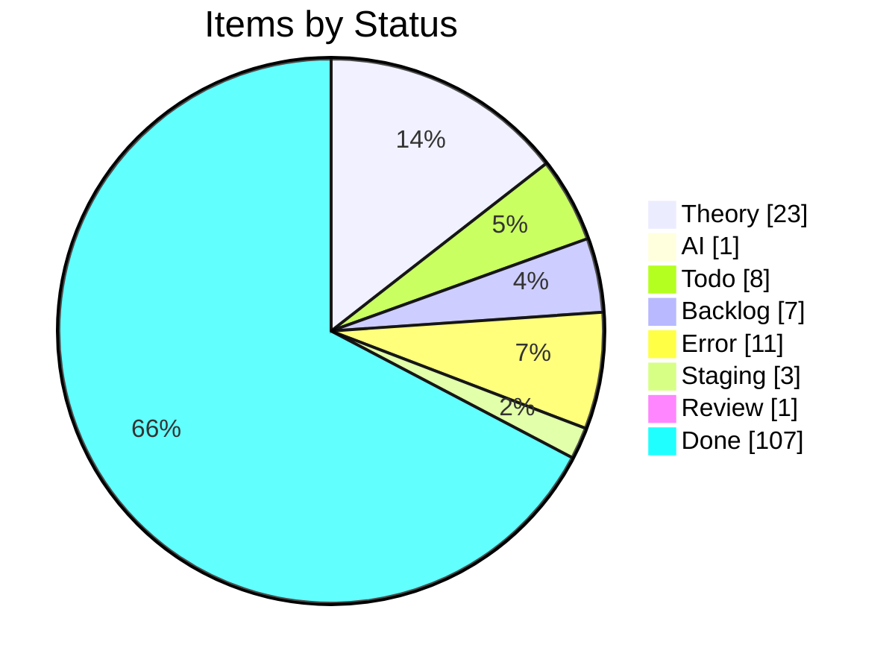
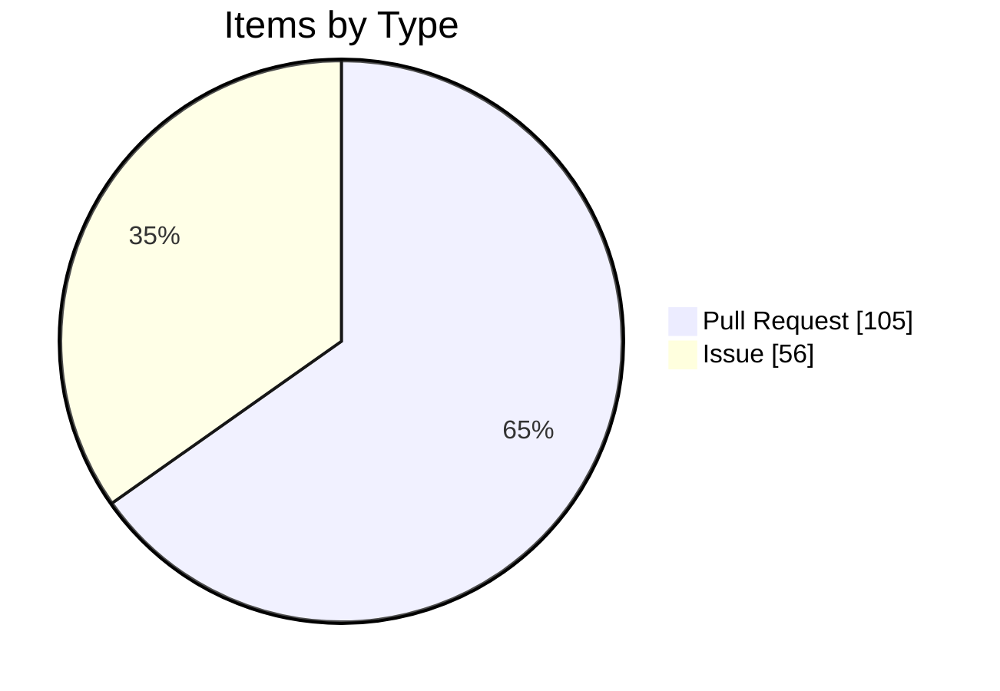

import { Card, CardGrid, Tabs, TabItem } from '@astrojs/starlight/components';

## Project Board Snapshot

:::note[Auto-generated]
Last synced: **2026-04-25T08:26:03.802Z** — updated daily by `ci-dashboard`.
Source: [KBVE Project Board](https://github.com/orgs/KBVE/projects/5)
:::

### Summary

<CardGrid>
  <Card title="Theory" icon="star">
    **23** items
  </Card>
  <Card title="AI" icon="rocket">
    **1** items
  </Card>
  <Card title="Todo" icon="list-format">
    **8** items
  </Card>
  <Card title="Backlog" icon="document">
    **7** items
  </Card>
  <Card title="Error" icon="warning">
    **11** items
  </Card>
  <Card title="Support" icon="information">
    **0** items
  </Card>
  <Card title="Staging" icon="setting">
    **3** items
  </Card>
  <Card title="Review" icon="approve-check">
    **1** items
  </Card>
  <Card title="Done" icon="approve-check-circle">
    **107** items
  </Card>
</CardGrid>

<Tabs>
  <TabItem label="Distribution">

  </TabItem>
  <TabItem label="Pipeline">

:::tip[Legend]
**Purple** = Planning &nbsp; **Blue** = Active &nbsp; **Red** = Blocked &nbsp; **Green** = Done
:::

  </TabItem>
  <TabItem label="Breakdown">

#### Top Labels

| Label | Count |
|-------|:-----:|
| auto-pr | 105 |
| dev→main | 50 |
| atomic | 39 |
| enhancement | 29 |
| 0 | 22 |
| unity | 16 |
| 1 | 13 |
| bug | 12 |
| todo | 9 |
| backlog | 7 |

  </TabItem>
</Tabs>

### Theory (23)

| # | Title | Priority | Assignees | Labels |
|---|-------|----------|-----------|--------|
| [#2252](https://github.com/KBVE/kbve/issues/2252) | [Concept] : Shop Layout - Merch, Hardware, Services. | — | — | 1, enhancement |
| [#2362](https://github.com/KBVE/kbve/issues/2362) | [Concept] : [ItemDB] - Rigged Dice - 6 Items | — | h0lybyte | 1, enhancement |
| [#3472](https://github.com/KBVE/kbve/issues/3472) | [Concept] : [Unity] : TileMap GameObject | — | h0lybyte | 0, enhancement, unity |
| [#4643](https://github.com/KBVE/kbve/issues/4643) | [Concept] : [Unity] : Transport System | — | h0lybyte | 0, enhancement, unity |
| [#5624](https://github.com/KBVE/kbve/issues/5624) | [Concept] : Add Intel NUC worker nodes to existing Talos KBVE cluster | — | h0lybyte, Copilot | 0, enhancement |
| [#6436](https://github.com/KBVE/kbve/issues/6436) | [Concept] : [Unity] : NPCDB - ECS | — | h0lybyte | 0, enhancement, unity |
| [#6437](https://github.com/KBVE/kbve/issues/6437) | [Concept] : [Unity] : Pathfinding ECS | — | h0lybyte | 0, enhancement, unity |
| [#6438](https://github.com/KBVE/kbve/issues/6438) | [Concept] : [Unity] : ItemDB ECS Migration | — | h0lybyte | 0, enhancement, unity |
| [#6446](https://github.com/KBVE/kbve/issues/6446) | [Concept] : [Unity] : MapDB - Schemas | — | h0lybyte | 0, enhancement, unity |
| [#6576](https://github.com/KBVE/kbve/issues/6576) | [Concept] : [Unity] : Entity Blittable System | — | h0lybyte | 0, enhancement, unity |
| [#7547](https://github.com/KBVE/kbve/issues/7547) | [MC] [Pumpkin] Implement CMerchantOffers packet and Merchant Trading GUI | — | h0lybyte | 0, enhancement |
| [#7730](https://github.com/KBVE/kbve/issues/7730) | [DISCORDSH] Rust-First Vote Process — Rate-Limited Server Voting Pipeline | — | h0lybyte | 1, enhancement, security |
| [#7593](https://github.com/KBVE/kbve/issues/7593) | [PG] Deploy CNPG Pooler (PgBouncer) and migrate services from direct -rw connect | — | h0lybyte | 2, enhancement, dependencies |
| [#8180](https://github.com/KBVE/kbve/issues/8180) | [DISCORDSH] POC: Mockoon docker-compose for local E2E testing | — | h0lybyte | 1, enhancement |
| [#8189](https://github.com/KBVE/kbve/issues/8189) | [BEVY] NPC Creatures — Performance Audit | — | — | enhancement |
| [#8245](https://github.com/KBVE/kbve/issues/8245) | perf(dashboard): migrate ClickHouse queries to @kbve/droid worker pipeline with  | — | — | 1, enhancement |
| [#9327](https://github.com/KBVE/kbve/issues/9327) | feat(astro-kbve): site graph integration — polish, testing, and rollout | — | h0lybyte | 1, enhancement, todo |
| [#9789](https://github.com/KBVE/kbve/issues/9789) | [Dashboard] Forgejo dashboard expansion — token scopes, user management, DB role | — | — | 3, enhancement, ci |
| [#9724](https://github.com/KBVE/kbve/issues/9724) | [ISOMETRIC] [BEVY] Convert sprite atlases from PNG to KTX2 with basis universal  | — | h0lybyte | 1, enhancement |
| [#9588](https://github.com/KBVE/kbve/issues/9588) | [ISOMETRIC] Pixel Smoothing | — | h0lybyte | 0, enhancement |
| [#9850](https://github.com/KBVE/kbve/issues/9850) | feat(mud): data population, IRC deployment, and isometric integration for MUD co | — | h0lybyte | 2, enhancement |
| [#8254](https://github.com/KBVE/kbve/issues/8254) | feat(unreal): CI/CD pipeline for UEDevOps plugin (itch.io + Fab) | — | h0lybyte | 2, enhancement |
| [#10194](https://github.com/KBVE/kbve/issues/10194) | [DISCORDSH] [BEVY] Key Integration Gaps | — | — | enhancement |

### AI (1)

| # | Title | Priority | Assignees | Labels |
|---|-------|----------|-----------|--------|
| [#4906](https://github.com/KBVE/kbve/issues/4906) | [Bug] : [Unity] : Character Orchestrator | — | h0lybyte | 0, bug, unity |

### Todo (8)

| # | Title | Priority | Assignees | Labels |
|---|-------|----------|-----------|--------|
| [#3572](https://github.com/KBVE/kbve/issues/3572) | [Update] : [Fudster] : User Billing &amp; Auth | — | h0lybyte | 1, security, update |
| [#4232](https://github.com/KBVE/kbve/issues/4232) | [Update] : [Github] : Rotate Tokens + Refactor Permissions | — | h0lybyte | 1, security, update |
| [#6939](https://github.com/KBVE/kbve/issues/6939) | [EPIC] Agent Orchestration Tab | — | — | 0, todo |
| [#8134](https://github.com/KBVE/kbve/issues/8134) | feat(proto): ClickHouse schema source of truth via protobuf → zod → vector pipel | — | h0lybyte | 4, documentation, todo |
| [#8148](https://github.com/KBVE/kbve/issues/8148) | [PSQL] Audit Discord Public Server Listing Functions | — | h0lybyte | 3, security, todo |
| [#8170](https://github.com/KBVE/kbve/issues/8170) | feat(proto): ArgoCD application state schema via protobuf → zod → edge pipeline | — | h0lybyte | 4, documentation, todo |
| [#9334](https://github.com/KBVE/kbve/issues/9334) | [ROWS] v0.4/v0.5 — Complete migration from C# OWS to Rust ROWS | — | h0lybyte | 6, enhancement, todo |
| [#8817](https://github.com/KBVE/kbve/issues/8817) | [E2E] kilobase needs pgrx/PostgreSQL build environment | — | h0lybyte | 1, todo |

### Backlog (7)

| # | Title | Priority | Assignees | Labels |
|---|-------|----------|-----------|--------|
| [#75](https://github.com/KBVE/kbve/issues/75) | [Concept] : HerbMail.com - Front Page | — | — | 1, backlog |
| [#96](https://github.com/KBVE/kbve/issues/96) | [Concept] : [Backend] : Charles. | — | h0lybyte | 0, backlog |
| [#416](https://github.com/KBVE/kbve/issues/416) | [Concept] : FlyIO Deployment | — | — | 0, backlog |
| [#1559](https://github.com/KBVE/kbve/issues/1559) | [Concept] : Adding TailwindCSS Example Components | — | — | 2, backlog |
| [#4642](https://github.com/KBVE/kbve/issues/4642) | [Concept] : [Unity] : Droid System - Hybrid NPC System. | — | h0lybyte | 0, enhancement, backlog |
| [#7548](https://github.com/KBVE/kbve/issues/7548) | feat(memes): responsive bento grid feed + dedicated meme pages | — | h0lybyte | 1, backlog |
| [#7709](https://github.com/KBVE/kbve/issues/7709) | [CRYPTOTHRONE] Inventory System, Event Bridge, and Gameplay Loop Completion | — | h0lybyte | 1, enhancement, backlog |

### Error (11)

| # | Title | Priority | Assignees | Labels |
|---|-------|----------|-----------|--------|
| [#2992](https://github.com/KBVE/kbve/issues/2992) | [Bug] LofiFocus is down - [PENDING] Ingress | — | h0lybyte | 0, bug |
| [#3536](https://github.com/KBVE/kbve/issues/3536) | [Bug] : Update CONTRIBUE.MD | — | h0lybyte | 0, bug |
| [#3538](https://github.com/KBVE/kbve/issues/3538) | [Bug] : [Unity] : Gameplay Mechanics - Farming &amp; Crafting | — | h0lybyte | 0, bug, unity |
| [#4538](https://github.com/KBVE/kbve/issues/4538) | [Bug] : [Unity] : Multiplayer / Steam Integration | — | h0lybyte | 0, bug, unity |
| [#4623](https://github.com/KBVE/kbve/issues/4623) | [Bug] : [Unity] : Procedural Map Generation | — | h0lybyte | 2, bug, unity |
| [#4797](https://github.com/KBVE/kbve/issues/4797) | [Bug] : [Unity] : Enemy Ai should attack player structures, if players are not a | — | h0lybyte | 4, bug, unity |
| [#6705](https://github.com/KBVE/kbve/issues/6705) | [Bug] : [Unity] : Chip Character Sheet Off Center Sprites | — | h0lybyte | 0, bug, unity |
| [#8169](https://github.com/KBVE/kbve/issues/8169) | [CI] Docker image version mismatch — cached binary reports stale version | — | — | 6, bug, ci |
| [#9182](https://github.com/KBVE/kbve/issues/9182) | [ROWS] Performance Audit — missing indexes, unbounded caches, query optimization | — | h0lybyte | 6, bug, enhancement |
| [#9205](https://github.com/KBVE/kbve/issues/9205) | feat(rows): pass zone instance ID to allocated game servers + unify launcher arc | — | h0lybyte | 2, bug |
| [#8815](https://github.com/KBVE/kbve/issues/8815) | [E2E] bevy_* projects need Rust + wasm32 toolchain in CI | — | h0lybyte | 0, bug, ci |

### Staging (3)

| # | Title | Priority | Assignees | Labels |
|---|-------|----------|-----------|--------|
| [#2208](https://github.com/KBVE/kbve/issues/2208) | [Concept] Service Page Enchancemnts | — | h0lybyte, dladeira | 4 |
| [#2267](https://github.com/KBVE/kbve/issues/2267) | [Concept] : CryptoThrone.com - King of the Hill App/Game | — | h0lybyte, BChip | 6 |
| [#6943](https://github.com/KBVE/kbve/issues/6943) | Phase 2: Frontend - Orchestration Tab | — | — | todo |

### Review (1)

| # | Title | Priority | Assignees | Labels |
|---|-------|----------|-----------|--------|
| [#10265](https://github.com/KBVE/kbve/pull/10265) | Release: 21 features, 3 fixes, 1 CI, 2 refactors, 10 chores → Main | — | — | auto-pr, dev→main |

### Done (107)

| # | Title | Priority | Assignees | Labels |
|---|-------|----------|-----------|--------|
| [#3396](https://github.com/KBVE/kbve/issues/3396) | [Concept] : [Unity] : Adding Quirky Character Pack by Noiryt | — | h0lybyte | 4, unity |
| [#4812](https://github.com/KBVE/kbve/issues/4812) | [Concept] : [Unity] : Elven Mage - Character | — | h0lybyte | 0, enhancement, unity |
| [#9530](https://github.com/KBVE/kbve/pull/9530) | deploy(isometric): update WASM build | — | — | auto-pr |
| [#10014](https://github.com/KBVE/kbve/pull/10014) | Release: 1 feature, 1 chore → Main | — | — | auto-pr, dev→main |
| [#10015](https://github.com/KBVE/kbve/pull/10015) | Atomic: mc v1.0.9 post-publish sync | — | — | auto-pr, atomic |
| [#10016](https://github.com/KBVE/kbve/pull/10016) | Release: 1 chore → Main | — | — | auto-pr, dev→main |
| [#10018](https://github.com/KBVE/kbve/pull/10018) | Release: 3 features, 1 fix, 1 chore → Main | — | — | auto-pr, dev→main |
| [#10024](https://github.com/KBVE/kbve/pull/10024) | Atomic: mc v1.0.10 post-publish sync | — | — | auto-pr, atomic |
| [#10025](https://github.com/KBVE/kbve/pull/10025) | Release: 1 chore → Main | — | — | auto-pr, dev→main |
| [#10027](https://github.com/KBVE/kbve/pull/10027) | Release: 3 features, 1 fix, 1 doc → Main | — | — | auto-pr, dev→main |
| [#10031](https://github.com/KBVE/kbve/pull/10031) | Atomic: mc v1.0.11 post-publish sync | — | — | auto-pr, atomic |
| [#10032](https://github.com/KBVE/kbve/pull/10032) | Release: 1 chore → Main | — | — | auto-pr, dev→main |
| [#10033](https://github.com/KBVE/kbve/issues/10033) | feat(mc): PaperMC lobby server + custom Velocity proxy with command/chat plugin | — | — | enhancement, todo, ci |
| [#10034](https://github.com/KBVE/kbve/pull/10034) | Release: 1 chore → Main | — | — | auto-pr, dev→main |
| [#10035](https://github.com/KBVE/kbve/pull/10035) | Atomic: mc v1.0.12 post-publish sync | — | — | auto-pr, atomic |
| [#10036](https://github.com/KBVE/kbve/pull/10036) | Release: 1 chore → Main | — | — | auto-pr, dev→main |
| [#10038](https://github.com/KBVE/kbve/pull/10038) | chore(dashboard): daily sync — 2026-04-11 | — | — | auto-pr |
| [#10039](https://github.com/KBVE/kbve/pull/10039) | Release: 1 feature, 1 chore → Main | — | — | auto-pr, dev→main |
| [#10042](https://github.com/KBVE/kbve/pull/10042) | Release: 2 fixes → Main | — | — | auto-pr, dev→main |
| [#10044](https://github.com/KBVE/kbve/pull/10044) | Atomic: mc-velocity v1.0.1 post-publish sync | — | — | auto-pr, atomic |
| [#10045](https://github.com/KBVE/kbve/pull/10045) | Release: 1 chore → Main | — | — | auto-pr, dev→main |
| [#10048](https://github.com/KBVE/kbve/pull/10048) | Release: 1 fix → Main | — | — | auto-pr, dev→main |
| [#10050](https://github.com/KBVE/kbve/pull/10050) | Atomic: mc lobby pin essentials | — | — | auto-pr, atomic |
| [#10051](https://github.com/KBVE/kbve/pull/10051) | Release: 1 fix → Main | — | — | auto-pr, dev→main |
| [#10053](https://github.com/KBVE/kbve/pull/10053) | Atomic: mc lobby fix version test | — | — | auto-pr, atomic |
| [#10054](https://github.com/KBVE/kbve/pull/10054) | Release: 1 fix → Main | — | — | auto-pr, dev→main |
| [#10055](https://github.com/KBVE/kbve/pull/10055) | Atomic: mc-lobby v1.0.1 post-publish sync | — | — | auto-pr, atomic |
| [#10056](https://github.com/KBVE/kbve/pull/10056) | Release: 1 chore → Main | — | — | auto-pr, dev→main |
| [#10057](https://github.com/KBVE/kbve/pull/10057) | Atomic: mc lobby add spawn plugin | — | — | auto-pr, atomic |
| [#10058](https://github.com/KBVE/kbve/pull/10058) | Release: 1 feature → Main | — | — | auto-pr, dev→main |
| [#10059](https://github.com/KBVE/kbve/pull/10059) | Atomic: mc fabric add spark | — | — | auto-pr, atomic |
| [#10060](https://github.com/KBVE/kbve/pull/10060) | Release: 2 features, 1 fix, 2 chores → Main | — | — | auto-pr, dev→main |
| [#10061](https://github.com/KBVE/kbve/pull/10061) | Atomic: mc lobby disable nether end | — | — | auto-pr, atomic |
| [#10062](https://github.com/KBVE/kbve/pull/10062) | chore(dashboard): daily sync — 2026-04-12 | — | — | auto-pr |
| [#10064](https://github.com/KBVE/kbve/pull/10064) | Atomic: mc v1.0.13 post-publish sync | — | — | auto-pr, atomic |
| [#10065](https://github.com/KBVE/kbve/pull/10065) | Release: 1 chore → Main | — | — | auto-pr, dev→main |
| [#10067](https://github.com/KBVE/kbve/pull/10067) | Release: 23 features, 35 fixes, 8 chores → Main | — | — | auto-pr, dev→main |
| [#10083](https://github.com/KBVE/kbve/pull/10083) | chore(dashboard): daily sync — 2026-04-13 | — | — | auto-pr |
| [#10092](https://github.com/KBVE/kbve/pull/10092) | chore(dashboard): daily sync — 2026-04-14 | — | — | auto-pr |
| [#10094](https://github.com/KBVE/kbve/pull/10094) | Release: 3 features, 3 fixes, 1 chore → Main | — | — | auto-pr, dev→main |
| [#10095](https://github.com/KBVE/kbve/pull/10095) | Atomic: mc v1.0.14 post-publish sync | — | — | auto-pr, atomic |
| [#10097](https://github.com/KBVE/kbve/pull/10097) | Release: 1 feature, 5 fixes, 1 chore → Main | — | — | auto-pr, dev→main |
| [#10102](https://github.com/KBVE/kbve/pull/10102) | Release: 2 features, 1 fix → Main | — | — | auto-pr, dev→main |
| [#10107](https://github.com/KBVE/kbve/pull/10107) | Release: 1 feature, 1 fix → Main | — | — | auto-pr, dev→main |
| [#10110](https://github.com/KBVE/kbve/pull/10110) | Atomic: mc v1.0.15 post-publish sync | — | — | auto-pr, atomic |
| [#10111](https://github.com/KBVE/kbve/pull/10111) | Release: 1 feature, 1 doc, 3 chores → Main | — | — | auto-pr, dev→main |
| [#10114](https://github.com/KBVE/kbve/pull/10114) | chore(dashboard): daily sync — 2026-04-16 | — | — | auto-pr |
| [#10117](https://github.com/KBVE/kbve/pull/10117) | Atomic: mc-lobby v1.0.2 post-publish sync | — | — | auto-pr, atomic |
| [#10118](https://github.com/KBVE/kbve/pull/10118) | Release: 1 feature, 4 chores → Main | — | — | auto-pr, dev→main |
| [#10119](https://github.com/KBVE/kbve/pull/10119) | Atomic: axum-kbve v1.0.110 post-publish sync | — | — | auto-pr, atomic |
| [#10120](https://github.com/KBVE/kbve/pull/10120) | chore(dashboard): daily sync — 2026-04-16 | — | — | auto-pr |
| [#10123](https://github.com/KBVE/kbve/pull/10123) | Release: 4 features, 2 fixes, 2 chores → Main | — | — | auto-pr, dev→main |
| [#10124](https://github.com/KBVE/kbve/pull/10124) | Atomic: axum-kbve v1.0.111 post-publish sync | — | — | auto-pr, atomic |
| [#10130](https://github.com/KBVE/kbve/pull/10130) | Atomic: mc-velocity v1.0.2 post-publish sync | — | — | auto-pr, atomic |
| [#10131](https://github.com/KBVE/kbve/pull/10131) | Release: 3 chores → Main | — | — | auto-pr, dev→main |
| [#10133](https://github.com/KBVE/kbve/pull/10133) | Atomic: mc-lobby v1.0.3 post-publish sync | — | — | auto-pr, atomic |
| [#10134](https://github.com/KBVE/kbve/pull/10134) | Atomic: mc v1.0.16 post-publish sync | — | — | auto-pr, atomic |
| [#10140](https://github.com/KBVE/kbve/pull/10140) | Release: 4 features, 1 fix, 1 chore → Main | — | — | auto-pr, dev→main |
| [#10143](https://github.com/KBVE/kbve/pull/10143) | Atomic: mc-velocity v1.0.3 post-publish sync | — | — | auto-pr, atomic |
| [#10144](https://github.com/KBVE/kbve/pull/10144) | Atomic: mc-lobby v1.0.4 post-publish sync | — | — | auto-pr, atomic |
| [#10145](https://github.com/KBVE/kbve/pull/10145) | Release: 2 fixes, 2 chores → Main | — | — | auto-pr, dev→main |
| [#10150](https://github.com/KBVE/kbve/pull/10150) | Atomic: mc v1.0.18 post-publish sync | — | — | auto-pr, atomic |
| [#10151](https://github.com/KBVE/kbve/pull/10151) | Release: 3 chores → Main | — | — | auto-pr, dev→main |
| [#10152](https://github.com/KBVE/kbve/pull/10152) | chore(dashboard): daily sync — 2026-04-17 | — | — | auto-pr |
| [#10154](https://github.com/KBVE/kbve/pull/10154) | Release: 2 features, 1 fix, 2 chores → Main | — | — | auto-pr, dev→main |
| [#10158](https://github.com/KBVE/kbve/pull/10158) | Atomic: mc v1.0.19 post-publish sync | — | — | auto-pr, atomic |
| [#10159](https://github.com/KBVE/kbve/pull/10159) | Release: 1 chore → Main | — | — | auto-pr, dev→main |
| [#10161](https://github.com/KBVE/kbve/pull/10161) | Release: 1 feature, 1 fix, 1 chore → Main | — | — | auto-pr, dev→main |
| [#10165](https://github.com/KBVE/kbve/pull/10165) | Release: 1 feature → Main | — | — | auto-pr, dev→main |
| [#10166](https://github.com/KBVE/kbve/pull/10166) | Atomic: mc v1.0.20 post-publish sync | — | — | auto-pr, atomic |
| [#10167](https://github.com/KBVE/kbve/pull/10167) | Release: 1 chore → Main | — | — | auto-pr, dev→main |
| [#10170](https://github.com/KBVE/kbve/pull/10170) | Release: 1 feature, 2 fixes → Main | — | — | auto-pr, dev→main |
| [#10173](https://github.com/KBVE/kbve/pull/10173) | Release: 1 feature, 1 fix, 1 refactor, 2 chores → Main | — | — | auto-pr, dev→main |
| [#10175](https://github.com/KBVE/kbve/pull/10175) | Atomic: mc v1.0.21 post-publish sync | — | — | auto-pr, atomic |
| [#10179](https://github.com/KBVE/kbve/pull/10179) | Release: 2 features, 4 fixes, 2 chores → Main | — | — | auto-pr, dev→main |
| [#10180](https://github.com/KBVE/kbve/pull/10180) | Atomic: axum-kbve v1.0.112 post-publish sync | — | — | auto-pr, atomic |
| [#10185](https://github.com/KBVE/kbve/pull/10185) | Atomic: mc v1.0.22 post-publish sync | — | — | auto-pr, atomic |
| [#10186](https://github.com/KBVE/kbve/pull/10186) | Release: 1 chore → Main | — | — | auto-pr, dev→main |
| [#10188](https://github.com/KBVE/kbve/pull/10188) | Release: 1 fix, 1 chore → Main | — | — | auto-pr, dev→main |
| [#10190](https://github.com/KBVE/kbve/pull/10190) | Release: 5 features, 1 fix, 3 chores → Main | — | — | auto-pr, dev→main |
| [#10191](https://github.com/KBVE/kbve/pull/10191) | Atomic: mc v1.0.23 post-publish sync | — | — | auto-pr, atomic |
| [#10193](https://github.com/KBVE/kbve/pull/10193) | chore(dashboard): daily sync — 2026-04-18 | — | — | auto-pr |
| [#10196](https://github.com/KBVE/kbve/pull/10196) | Release: 17 features, 4 fixes, 2 perfs, 2 refactors, 1 chore → Main | — | — | auto-pr, dev→main |
| [#10204](https://github.com/KBVE/kbve/pull/10204) | Atomic: chuckrpg ingress | — | — | auto-pr, atomic |
| [#10206](https://github.com/KBVE/kbve/pull/10206) | Atomic: bulk ingress 404 restore | — | — | auto-pr, atomic |
| [#10207](https://github.com/KBVE/kbve/pull/10207) | Atomic: mc max players 67 | — | — | auto-pr, atomic |
| [#10210](https://github.com/KBVE/kbve/pull/10210) | Release: 14 features, 3 fixes, 3 chores → Main | — | — | auto-pr, dev→main |
| [#10211](https://github.com/KBVE/kbve/pull/10211) | Atomic: axum-kbve v1.0.113 post-publish sync | — | — | auto-pr, atomic |
| [#10212](https://github.com/KBVE/kbve/pull/10212) | chore(dashboard): daily sync — 2026-04-19 | — | — | auto-pr |
| [#10229](https://github.com/KBVE/kbve/pull/10229) | Release: 9 features, 3 fixes, 3 chores → Main | — | — | auto-pr, dev→main |
| [#10230](https://github.com/KBVE/kbve/pull/10230) | Atomic: mc v1.0.24 post-publish sync | — | — | auto-pr, atomic |
| [#10233](https://github.com/KBVE/kbve/pull/10233) | deploy(isometric): update WASM build | — | — | auto-pr |
| [#10234](https://github.com/KBVE/kbve/pull/10234) | Atomic: axum-kbve v1.0.114 post-publish sync | — | — | auto-pr, atomic |
| [#10237](https://github.com/KBVE/kbve/pull/10237) | Release: 78 features, 46 fixes, 6 docs, 19 perfs, 29 refactors, 19 chores → Main | — | — | auto-pr, dev→main |
| [#10248](https://github.com/KBVE/kbve/pull/10248) | chore(dashboard): daily sync — 2026-04-20 | — | — | auto-pr |
| [#10249](https://github.com/KBVE/kbve/pull/10249) | chore(dashboard): daily sync — 2026-04-21 | — | — | auto-pr |
| [#10250](https://github.com/KBVE/kbve/pull/10250) | Atomic: discordsh-bot v0.1.10 post-publish sync | — | — | auto-pr, atomic |
| [#10251](https://github.com/KBVE/kbve/pull/10251) | Release: 21 features, 4 fixes, 1 doc, 4 perfs, 3 refactors, 6 chores → Main | — | — | auto-pr, dev→main |
| [#10253](https://github.com/KBVE/kbve/pull/10253) | Atomic: axum-kbve v1.0.115 post-publish sync | — | — | auto-pr, atomic |
| [#10255](https://github.com/KBVE/kbve/pull/10255) | chore(dashboard): daily sync — 2026-04-22 | — | — | auto-pr |
| [#10258](https://github.com/KBVE/kbve/pull/10258) | Release: 1 chore → Main | — | — | auto-pr, dev→main |
| [#10259](https://github.com/KBVE/kbve/pull/10259) | Atomic: axum-kbve v1.0.116 post-publish sync | — | — | auto-pr, atomic |
| [#10260](https://github.com/KBVE/kbve/pull/10260) | Release: 5 features, 3 fixes, 2 docs, 7 perfs, 1 refactor, 2 chores → Main | — | — | auto-pr, dev→main |
| [#10261](https://github.com/KBVE/kbve/pull/10261) | chore(dashboard): daily sync — 2026-04-23 | — | — | auto-pr |
| [#10263](https://github.com/KBVE/kbve/pull/10263) | Atomic: axum-kbve v1.0.117 post-publish sync | — | — | auto-pr, atomic |
| [#10264](https://github.com/KBVE/kbve/pull/10264) | Release: 11 features, 1 doc, 1 refactor, 3 chores → Main | — | — | auto-pr, dev→main |
| [#10266](https://github.com/KBVE/kbve/pull/10266) | chore(dashboard): daily sync — 2026-04-24 | — | — | auto-pr |

---

*Auto-generated by [ci-dashboard.yml](https://github.com/KBVE/kbve/actions/workflows/ci-dashboard.yml)*
