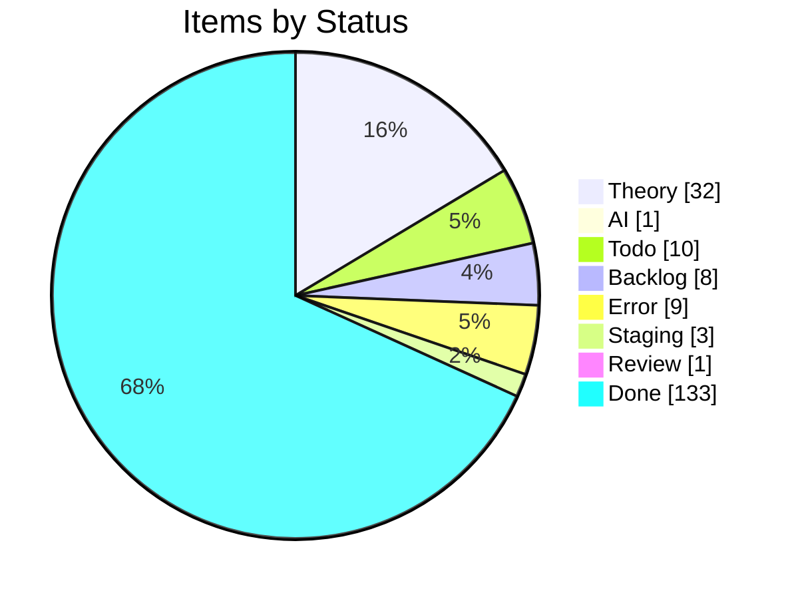
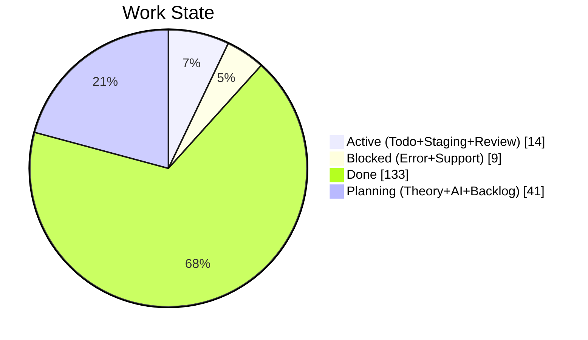
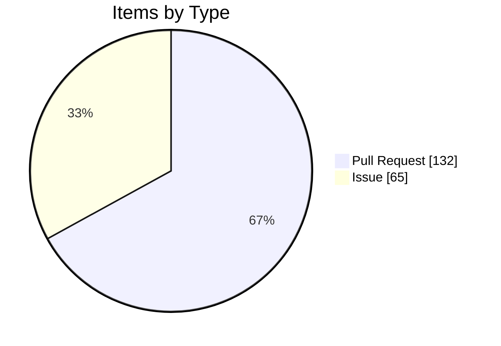

import { Card, CardGrid, Tabs, TabItem } from '@astrojs/starlight/components';

## Project Board Snapshot

:::note[Auto-generated]
Last synced: **2026-06-06T09:00:01.385Z** — updated daily by `ci-dashboard`.
Source: [KBVE Project Board](https://github.com/orgs/KBVE/projects/5)
:::

### Summary

<CardGrid>
  <Card title="Theory" icon="star">
    **32** items
  </Card>
  <Card title="AI" icon="rocket">
    **1** items
  </Card>
  <Card title="Todo" icon="list-format">
    **10** items
  </Card>
  <Card title="Backlog" icon="document">
    **8** items
  </Card>
  <Card title="Error" icon="warning">
    **9** items
  </Card>
  <Card title="Support" icon="information">
    **0** items
  </Card>
  <Card title="Staging" icon="setting">
    **3** items
  </Card>
  <Card title="Review" icon="approve-check">
    **1** items
  </Card>
  <Card title="Done" icon="approve-check-circle">
    **133** items
  </Card>
</CardGrid>

<Tabs>
  <TabItem label="Distribution">

  </TabItem>
  <TabItem label="Pipeline">

```mermaid
flowchart LR
    classDef planning fill:#8b5cf6,stroke:#6d28d9,color:#fff
    classDef active fill:#3b82f6,stroke:#1d4ed8,color:#fff
    classDef blocked fill:#ef4444,stroke:#b91c1c,color:#fff
    classDef done fill:#10b981,stroke:#059669,color:#fff
    Theory["Theory<br/><strong>32</strong>"]
    Theory --> AI
    AI["AI<br/><strong>1</strong>"]
    AI --> Todo
    Todo["Todo<br/><strong>10</strong>"]
    Todo --> Backlog
    Backlog["Backlog<br/><strong>8</strong>"]
    Backlog --> Error
    Error["Error<br/><strong>9</strong>"]
    Error --> Support
    Support["Support<br/><strong>0</strong>"]
    Support --> Staging
    Staging["Staging<br/><strong>3</strong>"]
    Staging --> Review
    Review["Review<br/><strong>1</strong>"]
    Review --> Done
    Done["Done<br/><strong>133</strong>"]
    class Theory,AI,Backlog planning
    class Todo,Staging,Review active
    class Error,Support blocked
    class Done done
```

:::tip[Legend]
**Purple** = Planning &nbsp; **Blue** = Active &nbsp; **Red** = Blocked &nbsp; **Green** = Done
:::

  </TabItem>
  <TabItem label="Breakdown">

#### Top Labels

| Label | Count |
|-------|:-----:|
| auto-pr | 132 |
| dev→main | 59 |
| atomic | 55 |
| enhancement | 39 |
| 0 | 19 |
| 1 | 13 |
| unity | 10 |
| bug | 10 |
| backlog | 8 |
| todo | 7 |

  </TabItem>
</Tabs>

### Theory (32)

| # | Title | Priority | Assignees | Labels |
|---|-------|----------|-----------|--------|
| [#2252](https://github.com/KBVE/kbve/issues/2252) | [Concept] : Shop Layout - Merch, Hardware, Services. | — | — | 1, enhancement |
| [#2362](https://github.com/KBVE/kbve/issues/2362) | [Concept] : [ItemDB] - Rigged Dice - 6 Items | — | h0lybyte | 1, enhancement |
| [#3472](https://github.com/KBVE/kbve/issues/3472) | [Concept] : [Unity] : TileMap GameObject | — | h0lybyte | 0, enhancement, unity |
| [#4643](https://github.com/KBVE/kbve/issues/4643) | [Concept] : [Unity] : Transport System | — | h0lybyte | 0, enhancement, unity |
| [#5624](https://github.com/KBVE/kbve/issues/5624) | [Concept] : Add Intel NUC worker nodes to existing Talos KBVE cluster | — | h0lybyte, Copilot | 0, enhancement |
| [#6437](https://github.com/KBVE/kbve/issues/6437) | [Concept] : [Unity] : Pathfinding ECS | — | h0lybyte | 0, enhancement, unity |
| [#6438](https://github.com/KBVE/kbve/issues/6438) | [Concept] : [Unity] : ItemDB ECS Migration | — | h0lybyte | 0, enhancement, unity |
| [#6576](https://github.com/KBVE/kbve/issues/6576) | [Concept] : [Unity] : Entity Blittable System | — | h0lybyte | 0, enhancement, unity |
| [#7547](https://github.com/KBVE/kbve/issues/7547) | [MC] [Pumpkin] Implement CMerchantOffers packet and Merchant Trading GUI | — | h0lybyte | 0, enhancement |
| [#7730](https://github.com/KBVE/kbve/issues/7730) | [DISCORDSH] Rust-First Vote Process — Rate-Limited Server Voting Pipeline | — | h0lybyte | 1, enhancement, security |
| [#7593](https://github.com/KBVE/kbve/issues/7593) | [PG] Deploy CNPG Pooler (PgBouncer) and migrate services from direct -rw connect | — | h0lybyte | 2, enhancement, dependencies |
| [#8180](https://github.com/KBVE/kbve/issues/8180) | [DISCORDSH] POC: Mockoon docker-compose for local E2E testing | — | h0lybyte | 1, enhancement |
| [#8245](https://github.com/KBVE/kbve/issues/8245) | perf(dashboard): migrate ClickHouse queries to @kbve/droid worker pipeline with  | — | — | 1, enhancement |
| [#9789](https://github.com/KBVE/kbve/issues/9789) | [Dashboard] Forgejo dashboard expansion — token scopes, user management, DB role | — | — | 3, enhancement, ci |
| [#9724](https://github.com/KBVE/kbve/issues/9724) | [ISOMETRIC] [BEVY] Convert sprite atlases from PNG to KTX2 with basis universal  | — | h0lybyte | 1, enhancement |
| [#9588](https://github.com/KBVE/kbve/issues/9588) | [ISOMETRIC] Pixel Smoothing | — | h0lybyte | 0, enhancement |
| [#9850](https://github.com/KBVE/kbve/issues/9850) | feat(mud): data population, IRC deployment, and isometric integration for MUD co | — | h0lybyte | 2, enhancement |
| [#8254](https://github.com/KBVE/kbve/issues/8254) | feat(unreal): CI/CD pipeline for UEDevOps plugin (itch.io + Fab) | — | h0lybyte | 2, enhancement |
| [#10194](https://github.com/KBVE/kbve/issues/10194) | [DISCORDSH] [BEVY] Key Integration Gaps | — | — | enhancement |
| [#10979](https://github.com/KBVE/kbve/issues/10979) | feat(wallet): khash marketplace bootstrap (5-phase roadmap) | — | — | enhancement |
| [#10980](https://github.com/KBVE/kbve/issues/10980) | isometric: upgrade Bevy 0.18 → 0.19 + wgpu 27 → 29 | — | — | enhancement |
| [#11138](https://github.com/KBVE/kbve/issues/11138) | [Plan] Agones-managed Factorio dedicated server | — | — | enhancement |
| [#11244](https://github.com/KBVE/kbve/issues/11244) | [BEVY][ISOMETRIC] Refactor remaining menus to ui component library | — | — | enhancement |
| [#11246](https://github.com/KBVE/kbve/issues/11246) | [BEVY][ISOMETRIC] In-game chat overlay (incoming + outgoing) | — | — | enhancement |
| [#11247](https://github.com/KBVE/kbve/issues/11247) | [BEVY][ISOMETRIC] Toast styling pass — color accents + animations | — | — | enhancement |
| [#11262](https://github.com/KBVE/kbve/issues/11262) | feat(discordsh): /gh claim — Discord user self-assigns issue + KBVE profile link | — | — | enhancement |
| [#11294](https://github.com/KBVE/kbve/issues/11294) | feat(td-online): multiplayer tower defense — bevy+rapier2d sim, agones game serv | — | — | enhancement |
| [#11362](https://github.com/KBVE/kbve/issues/11362) | feat(astro-kbve,guild-vault): /dashboard/agents — multi-tenant bot management su | — | — | enhancement |
| [#11579](https://github.com/KBVE/kbve/issues/11579) | feat(laser): extract chat client into @kbve/laser for Phaser game embedding | — | — | enhancement |
| [#11580](https://github.com/KBVE/kbve/issues/11580) | feat(chat): proto + zod schema for ChatMessage envelope (bots, NOTICE, kinds) | — | — | enhancement |
| [#11582](https://github.com/KBVE/kbve/issues/11582) | harden(astro-irc): embed popup lifecycle + data-signin-url override | — | — | enhancement |
| [#11605](https://github.com/KBVE/kbve/issues/11605) | [isometric] WebGL2 fallback for browsers without WebGPU | — | — | 2, enhancement |

### AI (1)

| # | Title | Priority | Assignees | Labels |
|---|-------|----------|-----------|--------|
| [#4906](https://github.com/KBVE/kbve/issues/4906) | [Bug] : [Unity] : Character Orchestrator | — | h0lybyte | 0, bug, unity |

### Todo (10)

| # | Title | Priority | Assignees | Labels |
|---|-------|----------|-----------|--------|
| [#3572](https://github.com/KBVE/kbve/issues/3572) | [Update] : [Fudster] : User Billing &amp; Auth | — | h0lybyte | 1, security, update |
| [#4232](https://github.com/KBVE/kbve/issues/4232) | [Update] : [Github] : Rotate Tokens + Refactor Permissions | — | h0lybyte | 1, security, update |
| [#6939](https://github.com/KBVE/kbve/issues/6939) | [EPIC] Agent Orchestration Tab | — | — | 0, todo |
| [#8134](https://github.com/KBVE/kbve/issues/8134) | feat(proto): ClickHouse schema source of truth via protobuf → zod → vector pipel | — | h0lybyte | 4, documentation, todo |
| [#8148](https://github.com/KBVE/kbve/issues/8148) | [PSQL] Audit Discord Public Server Listing Functions | — | h0lybyte | 3, security, todo |
| [#8170](https://github.com/KBVE/kbve/issues/8170) | feat(proto): ArgoCD application state schema via protobuf → zod → edge pipeline | — | h0lybyte | 4, documentation, todo |
| [#9334](https://github.com/KBVE/kbve/issues/9334) | [ROWS] v0.4/v0.5 — Complete migration from C# OWS to Rust ROWS | — | h0lybyte | 6, enhancement, todo |
| [#8817](https://github.com/KBVE/kbve/issues/8817) | [E2E] kilobase needs pgrx/PostgreSQL build environment | — | h0lybyte | 1, todo |
| [#10560](https://github.com/KBVE/kbve/issues/10560) | chore(redis): evaluate Bitnami chart bump 21.2.13 -&gt; 25.x | — | — | update |
| [#11013](https://github.com/KBVE/kbve/issues/11013) | [CICD] [Github] Migrate workflows to arc-runner-set-kbve + strip apt-install ban | — | — | enhancement, update |

### Backlog (8)

| # | Title | Priority | Assignees | Labels |
|---|-------|----------|-----------|--------|
| [#75](https://github.com/KBVE/kbve/issues/75) | [Concept] : HerbMail.com - Front Page | — | — | 1, backlog |
| [#96](https://github.com/KBVE/kbve/issues/96) | [Concept] : [Backend] : Charles. | — | h0lybyte | 0, backlog |
| [#416](https://github.com/KBVE/kbve/issues/416) | [Concept] : FlyIO Deployment | — | — | 0, backlog |
| [#1559](https://github.com/KBVE/kbve/issues/1559) | [Concept] : Adding TailwindCSS Example Components | — | — | 2, backlog |
| [#4642](https://github.com/KBVE/kbve/issues/4642) | [Concept] : [Unity] : Droid System - Hybrid NPC System. | — | h0lybyte | 0, enhancement, backlog |
| [#7548](https://github.com/KBVE/kbve/issues/7548) | feat(memes): responsive bento grid feed + dedicated meme pages | — | h0lybyte | 1, backlog |
| [#7709](https://github.com/KBVE/kbve/issues/7709) | [CRYPTOTHRONE] Inventory System, Event Bridge, and Gameplay Loop Completion | — | h0lybyte | 1, enhancement, backlog |
| [#11250](https://github.com/KBVE/kbve/issues/11250) | feat(ci-dbmate-deploy): bake migrations into OCI image for cap-free deploys | — | — | enhancement, backlog |

### Error (9)

| # | Title | Priority | Assignees | Labels |
|---|-------|----------|-----------|--------|
| [#2992](https://github.com/KBVE/kbve/issues/2992) | [Bug] LofiFocus is down - [PENDING] Ingress | — | h0lybyte | 0, bug |
| [#3536](https://github.com/KBVE/kbve/issues/3536) | [Bug] : Update CONTRIBUE.MD | — | h0lybyte | 0, bug |
| [#3538](https://github.com/KBVE/kbve/issues/3538) | [Bug] : [Unity] : Gameplay Mechanics - Farming &amp; Crafting | — | h0lybyte | 0, bug, unity |
| [#4538](https://github.com/KBVE/kbve/issues/4538) | [Bug] : [Unity] : Multiplayer / Steam Integration | — | h0lybyte | 0, bug, unity |
| [#6705](https://github.com/KBVE/kbve/issues/6705) | [Bug] : [Unity] : Chip Character Sheet Off Center Sprites | — | h0lybyte | 0, bug, unity |
| [#8169](https://github.com/KBVE/kbve/issues/8169) | [CI] Docker image version mismatch — cached binary reports stale version | — | — | 6, bug, ci |
| [#9182](https://github.com/KBVE/kbve/issues/9182) | [ROWS] Performance Audit — missing indexes, unbounded caches, query optimization | — | h0lybyte | 6, bug, enhancement |
| [#9205](https://github.com/KBVE/kbve/issues/9205) | feat(rows): pass zone instance ID to allocated game servers + unify launcher arc | — | h0lybyte | 2, bug |
| [#8815](https://github.com/KBVE/kbve/issues/8815) | [E2E] bevy_* projects need Rust + wasm32 toolchain in CI | — | h0lybyte | 0, bug, ci |

### Staging (3)

| # | Title | Priority | Assignees | Labels |
|---|-------|----------|-----------|--------|
| [#2208](https://github.com/KBVE/kbve/issues/2208) | [Concept] Service Page Enchancemnts | — | h0lybyte, dladeira | 4 |
| [#2267](https://github.com/KBVE/kbve/issues/2267) | [Concept] : CryptoThrone.com - King of the Hill App/Game | — | h0lybyte, BChip | 6 |
| [#6943](https://github.com/KBVE/kbve/issues/6943) | Phase 2: Frontend - Orchestration Tab | — | — | todo |

### Review (1)

| # | Title | Priority | Assignees | Labels |
|---|-------|----------|-----------|--------|
| [#11832](https://github.com/KBVE/kbve/pull/11832) | Release: 1 fix → Main | — | — | auto-pr, dev→main |

### Done (133)

| # | Title | Priority | Assignees | Labels |
|---|-------|----------|-----------|--------|
| [#8190](https://github.com/KBVE/kbve/issues/8190) | [BEVY] bevy_cam performance audit — 8 findings | — | h0lybyte | 1, rust |
| [#11282](https://github.com/KBVE/kbve/pull/11282) | Release: 3 features, 4 fixes, 1 refactor, 2 tests, 2 chores → Main | — | — | auto-pr, dev→main |
| [#11289](https://github.com/KBVE/kbve/pull/11289) | Release: 1 feature, 1 fix, 1 test, 1 chore → Main | — | — | auto-pr, dev→main |
| [#11296](https://github.com/KBVE/kbve/pull/11296) | Release: 2 features, 1 chore → Main | — | — | auto-pr, dev→main |
| [#11300](https://github.com/KBVE/kbve/pull/11300) | Atomic: mc-velocity v1.1.9 post-publish sync | — | — | auto-pr, atomic |
| [#11301](https://github.com/KBVE/kbve/pull/11301) | Release: 2 fixes, 1 CI, 1 chore → Main | — | — | auto-pr, dev→main |
| [#11307](https://github.com/KBVE/kbve/pull/11307) | Atomic: mc-lobby v1.0.9 post-publish sync | — | — | auto-pr, atomic |
| [#11308](https://github.com/KBVE/kbve/pull/11308) | Release: 1 feature, 2 CI, 2 chores → Main | — | — | auto-pr, dev→main |
| [#11315](https://github.com/KBVE/kbve/pull/11315) | Release: 2 features, 1 chore → Main | — | — | auto-pr, dev→main |
| [#11317](https://github.com/KBVE/kbve/pull/11317) | Atomic: axum-kbve v1.0.169 post-publish sync | — | — | auto-pr, atomic |
| [#11321](https://github.com/KBVE/kbve/pull/11321) | Release: 15 features, 5 fixes, 1 CI, 1 test, 5 chores → Main | — | — | auto-pr, dev→main |
| [#11333](https://github.com/KBVE/kbve/pull/11333) | chore(dashboard): daily sync — 2026-05-24 | — | — | auto-pr |
| [#11336](https://github.com/KBVE/kbve/pull/11336) | Atomic: mc-velocity v1.1.10 post-publish sync | — | — | auto-pr, atomic |
| [#11337](https://github.com/KBVE/kbve/pull/11337) | Atomic: mc-lobby v1.0.10 post-publish sync | — | — | auto-pr, atomic |
| [#11338](https://github.com/KBVE/kbve/pull/11338) | Release: 4 chores → Main | — | — | auto-pr, dev→main |
| [#11339](https://github.com/KBVE/kbve/pull/11339) | Atomic: mc v1.0.58 post-publish sync | — | — | auto-pr, atomic |
| [#11340](https://github.com/KBVE/kbve/pull/11340) | deploy(isometric): update WASM build | — | — | auto-pr |
| [#11341](https://github.com/KBVE/kbve/pull/11341) | Atomic: axum-kbve v1.0.170 post-publish sync | — | — | auto-pr, atomic |
| [#11342](https://github.com/KBVE/kbve/pull/11342) | Release: 5 features, 2 fixes, 1 doc, 1 refactor, 2 chores → Main | — | — | auto-pr, dev→main |
| [#11352](https://github.com/KBVE/kbve/pull/11352) | chore(dashboard): daily sync — 2026-05-25 | — | — | auto-pr |
| [#11355](https://github.com/KBVE/kbve/pull/11355) | Atomic: edge v0.1.32 post-publish sync | — | — | auto-pr, atomic |
| [#11356](https://github.com/KBVE/kbve/pull/11356) | Release: 11 features, 1 fix, 2 refactors, 6 chores → Main | — | — | auto-pr, dev→main |
| [#11357](https://github.com/KBVE/kbve/pull/11357) | Atomic: discordsh-bot v0.1.15 post-publish sync | — | — | auto-pr, atomic |
| [#11358](https://github.com/KBVE/kbve/pull/11358) | Atomic: irc-gateway v0.1.19 post-publish sync | — | — | auto-pr, atomic |
| [#11374](https://github.com/KBVE/kbve/pull/11374) | chore(dashboard): daily sync — 2026-05-26 | — | — | auto-pr |
| [#11377](https://github.com/KBVE/kbve/pull/11377) | Atomic: edge v0.1.33 post-publish sync | — | — | auto-pr, atomic |
| [#11378](https://github.com/KBVE/kbve/pull/11378) | Release: 2 fixes, 1 test, 4 chores → Main | — | — | auto-pr, dev→main |
| [#11379](https://github.com/KBVE/kbve/pull/11379) | deploy(isometric): update WASM build | — | — | auto-pr |
| [#11381](https://github.com/KBVE/kbve/pull/11381) | Atomic: axum-kbve v1.0.171 post-publish sync | — | — | auto-pr, atomic |
| [#11387](https://github.com/KBVE/kbve/pull/11387) | Release: 2 features, 1 fix, 1 refactor, 3 chores → Main | — | — | auto-pr, dev→main |
| [#11388](https://github.com/KBVE/kbve/pull/11388) | Atomic: nd-server v0.0.2 post-publish sync | — | — | auto-pr, atomic |
| [#11394](https://github.com/KBVE/kbve/pull/11394) | chore(dashboard): daily sync — 2026-05-27 | — | — | auto-pr |
| [#11396](https://github.com/KBVE/kbve/pull/11396) | Atomic: axum-kbve v1.0.172 post-publish sync | — | — | auto-pr, atomic |
| [#11397](https://github.com/KBVE/kbve/pull/11397) | Release: 1 fix, 1 chore → Main | — | — | auto-pr, dev→main |
| [#11401](https://github.com/KBVE/kbve/pull/11401) | Atomic: agones-factorio v0.0.2 post-publish sync | — | — | auto-pr, atomic |
| [#11402](https://github.com/KBVE/kbve/pull/11402) | Release: 9 features, 1 fix, 3 CI, 2 refactors, 2 chores → Main | — | — | auto-pr, dev→main |
| [#11421](https://github.com/KBVE/kbve/pull/11421) | Atomic: discordsh-bot v0.1.16 post-publish sync | — | — | auto-pr, atomic |
| [#11422](https://github.com/KBVE/kbve/pull/11422) | Release: 2 features, 2 fixes, 4 chores → Main | — | — | auto-pr, dev→main |
| [#11425](https://github.com/KBVE/kbve/pull/11425) | chore(dashboard): daily sync — 2026-05-28 | — | — | auto-pr |
| [#11429](https://github.com/KBVE/kbve/pull/11429) | Atomic: agones-factorio v0.0.3 post-publish sync | — | — | auto-pr, atomic |
| [#11430](https://github.com/KBVE/kbve/pull/11430) | Atomic: edge v0.1.34 post-publish sync | — | — | auto-pr, atomic |
| [#11431](https://github.com/KBVE/kbve/pull/11431) | Release: 0 commits → Main | — | — | auto-pr, dev→main |
| [#11432](https://github.com/KBVE/kbve/pull/11432) | Atomic: axum-kbve v1.0.173 post-publish sync | — | — | auto-pr, atomic |
| [#11436](https://github.com/KBVE/kbve/pull/11436) | Atomic: agones-factorio-relay v0.0.2 post-publish sync | — | — | auto-pr, atomic |
| [#11437](https://github.com/KBVE/kbve/pull/11437) | Release: 1 chore → Main | — | — | auto-pr, dev→main |
| [#11439](https://github.com/KBVE/kbve/pull/11439) | Atomic: axum-kbve v1.0.174 post-publish sync | — | — | auto-pr, atomic |
| [#11440](https://github.com/KBVE/kbve/pull/11440) | Release: 1 feature, 2 chores → Main | — | — | auto-pr, dev→main |
| [#11442](https://github.com/KBVE/kbve/pull/11442) | Atomic: agones-factorio v0.0.4 post-publish sync | — | — | auto-pr, atomic |
| [#11443](https://github.com/KBVE/kbve/pull/11443) | Release: 1 chore → Main | — | — | auto-pr, dev→main |
| [#11445](https://github.com/KBVE/kbve/pull/11445) | Release: 1 fix → Main | — | — | auto-pr, dev→main |
| [#11446](https://github.com/KBVE/kbve/pull/11446) | chore(dashboard): daily sync — 2026-05-29 | — | — | auto-pr |
| [#11447](https://github.com/KBVE/kbve/pull/11447) | Release: 1 fix, 1 chore → Main | — | — | auto-pr, dev→main |
| [#11450](https://github.com/KBVE/kbve/pull/11450) | Release: 1 fix → Main | — | — | auto-pr, dev→main |
| [#11452](https://github.com/KBVE/kbve/pull/11452) | Release: 2 features, 1 fix, 1 CI → Main | — | — | auto-pr, dev→main |
| [#11459](https://github.com/KBVE/kbve/pull/11459) | Release: 1 fix → Main | — | — | auto-pr, dev→main |
| [#11461](https://github.com/KBVE/kbve/pull/11461) | Release: 1 fix, 1 chore → Main | — | — | auto-pr, dev→main |
| [#11462](https://github.com/KBVE/kbve/pull/11462) | Atomic: axum-kbve v1.0.175 post-publish sync | — | — | auto-pr, atomic |
| [#11463](https://github.com/KBVE/kbve/pull/11463) | Release: 1 feature, 1 fix, 1 chore → Main | — | — | auto-pr, dev→main |
| [#11466](https://github.com/KBVE/kbve/pull/11466) | Atomic: agones-factorio-relay v0.0.3 post-publish sync | — | — | auto-pr, atomic |
| [#11467](https://github.com/KBVE/kbve/pull/11467) | Release: 1 chore → Main | — | — | auto-pr, dev→main |
| [#11468](https://github.com/KBVE/kbve/pull/11468) | Release: 5 features, 2 fixes, 1 refactor, 4 chores → Main | — | — | auto-pr, dev→main |
| [#11473](https://github.com/KBVE/kbve/pull/11473) | chore(dashboard): daily sync — 2026-05-30 | — | — | auto-pr |
| [#11480](https://github.com/KBVE/kbve/pull/11480) | Atomic: agones-factorio v0.0.8 post-publish sync | — | — | auto-pr, atomic |
| [#11481](https://github.com/KBVE/kbve/pull/11481) | Release: 1 fix, 1 chore → Main | — | — | auto-pr, dev→main |
| [#11485](https://github.com/KBVE/kbve/pull/11485) | Atomic: axum-kbve v1.0.176 post-publish sync | — | — | auto-pr, atomic |
| [#11486](https://github.com/KBVE/kbve/pull/11486) | Release: 1 chore → Main | — | — | auto-pr, dev→main |
| [#11489](https://github.com/KBVE/kbve/pull/11489) | chore(dashboard): daily sync — 2026-05-31 | — | — | auto-pr |
| [#11490](https://github.com/KBVE/kbve/pull/11490) | Release: 5 features, 5 fixes, 2 docs, 4 chores → Main | — | — | auto-pr, dev→main |
| [#11504](https://github.com/KBVE/kbve/pull/11504) | Atomic: agones-factorio-relay v0.0.4 post-publish sync | — | — | auto-pr, atomic |
| [#11511](https://github.com/KBVE/kbve/pull/11511) | Atomic: agones-factorio v0.0.9 post-publish sync | — | — | auto-pr, atomic |
| [#11512](https://github.com/KBVE/kbve/pull/11512) | Atomic: agones-factorio-relay v0.0.5 post-publish sync | — | — | auto-pr, atomic |
| [#11513](https://github.com/KBVE/kbve/pull/11513) | Release: 1 fix, 4 chores → Main | — | — | auto-pr, dev→main |
| [#11515](https://github.com/KBVE/kbve/pull/11515) | Atomic: discordsh-bot v0.1.17 post-publish sync | — | — | auto-pr, atomic |
| [#11516](https://github.com/KBVE/kbve/pull/11516) | deploy(isometric): update WASM build | — | — | auto-pr |
| [#11518](https://github.com/KBVE/kbve/pull/11518) | Atomic: axum-kbve v1.0.177 post-publish sync | — | — | auto-pr, atomic |
| [#11523](https://github.com/KBVE/kbve/pull/11523) | Release: 1 feature, 1 fix, 5 chores → Main | — | — | auto-pr, dev→main |
| [#11538](https://github.com/KBVE/kbve/pull/11538) | Release: 1 fix, 3 chores → Main | — | — | auto-pr, dev→main |
| [#11543](https://github.com/KBVE/kbve/pull/11543) | Atomic: axum-kbve v1.0.178 post-publish sync | — | — | auto-pr, atomic |
| [#11546](https://github.com/KBVE/kbve/pull/11546) | Release: 2 features, 1 fix, 1 doc → Main | — | — | auto-pr, dev→main |
| [#11547](https://github.com/KBVE/kbve/pull/11547) | Atomic: agones-factorio v0.0.10 post-publish sync | — | — | auto-pr, atomic |
| [#11548](https://github.com/KBVE/kbve/pull/11548) | Release: 1 chore → Main | — | — | auto-pr, dev→main |
| [#11549](https://github.com/KBVE/kbve/pull/11549) | deploy(isometric): update WASM build | — | — | auto-pr |
| [#11552](https://github.com/KBVE/kbve/pull/11552) | Release: 16 features, 8 fixes, 2 docs, 3 perfs, 8 chores → Main | — | — | auto-pr, dev→main |
| [#11562](https://github.com/KBVE/kbve/pull/11562) | chore(dashboard): daily sync — 2026-06-01 | — | — | auto-pr |
| [#11581](https://github.com/KBVE/kbve/issues/11581) | harden(irc-gateway): tighten CORS, cap WS frames, add PING/PONG heartbeat | — | — | enhancement, rust |
| [#11612](https://github.com/KBVE/kbve/pull/11612) | Atomic: agones-factorio v0.0.12 post-publish sync | — | — | auto-pr, atomic |
| [#11614](https://github.com/KBVE/kbve/pull/11614) | Atomic: agones-factorio-relay v0.0.6 post-publish sync | — | — | auto-pr, atomic |
| [#11615](https://github.com/KBVE/kbve/pull/11615) | Release: 1 fix, 4 chores → Main | — | — | auto-pr, dev→main |
| [#11618](https://github.com/KBVE/kbve/pull/11618) | deploy(isometric): update WASM build | — | — | auto-pr |
| [#11619](https://github.com/KBVE/kbve/pull/11619) | Atomic: axum-kbve v1.0.179 post-publish sync | — | — | auto-pr, atomic |
| [#11624](https://github.com/KBVE/kbve/pull/11624) | Release: 1 feature, 1 fix, 1 test, 1 chore → Main | — | — | auto-pr, dev→main |
| [#11632](https://github.com/KBVE/kbve/pull/11632) | Release: 2 features, 4 fixes, 4 CI, 4 tests, 4 chores → Main | — | — | auto-pr, dev→main |
| [#11655](https://github.com/KBVE/kbve/pull/11655) | Release: 3 features, 6 fixes, 2 CI, 1 perf, 6 tests, 9 chores → Main | — | — | auto-pr, dev→main |
| [#11676](https://github.com/KBVE/kbve/pull/11676) | Atomic: axum-kbve v1.0.180 post-publish sync | — | — | auto-pr, atomic |
| [#11678](https://github.com/KBVE/kbve/pull/11678) | Atomic: rareicon v0.1.7 post-publish sync | — | — | auto-pr, atomic |
| [#11681](https://github.com/KBVE/kbve/pull/11681) | chore(dashboard): daily sync — 2026-06-02 | — | — | auto-pr |
| [#11692](https://github.com/KBVE/kbve/pull/11692) | Atomic: agones-factorio v0.0.13 post-publish sync | — | — | auto-pr, atomic |
| [#11693](https://github.com/KBVE/kbve/pull/11693) | Release: 4 chores → Main | — | — | auto-pr, dev→main |
| [#11694](https://github.com/KBVE/kbve/pull/11694) | Atomic: kbve-kubectl v0.1.3 post-publish sync | — | — | auto-pr, atomic |
| [#11695](https://github.com/KBVE/kbve/pull/11695) | Atomic: agones-factorio-relay v0.0.7 post-publish sync | — | — | auto-pr, atomic |
| [#11696](https://github.com/KBVE/kbve/pull/11696) | Atomic: discordsh-bot v0.1.18 post-publish sync | — | — | auto-pr, atomic |
| [#11703](https://github.com/KBVE/kbve/pull/11703) | Release: 1 feature, 4 fixes → Main | — | — | auto-pr, dev→main |
| [#11711](https://github.com/KBVE/kbve/pull/11711) | Atomic: kasm-void v0.0.2 post-publish sync | — | — | auto-pr, atomic |
| [#11712](https://github.com/KBVE/kbve/pull/11712) | Release: 2 features, 3 fixes, 2 perfs, 2 tests, 3 chores → Main | — | — | auto-pr, dev→main |
| [#11722](https://github.com/KBVE/kbve/pull/11722) | chore(dashboard): daily sync — 2026-06-03 | — | — | auto-pr |
| [#11725](https://github.com/KBVE/kbve/pull/11725) | Atomic: axum-kbve v1.0.181 post-publish sync | — | — | auto-pr, atomic |
| [#11726](https://github.com/KBVE/kbve/pull/11726) | Release: 3 features, 4 fixes, 1 doc, 5 perfs, 1 refactor, 3 chores → Main | — | — | auto-pr, dev→main |
| [#11756](https://github.com/KBVE/kbve/pull/11756) | Atomic: kasm-void v0.0.3 post-publish sync | — | — | auto-pr, atomic |
| [#11757](https://github.com/KBVE/kbve/pull/11757) | Release: 1 chore → Main | — | — | auto-pr, dev→main |
| [#11759](https://github.com/KBVE/kbve/pull/11759) | Release: 21 features, 4 fixes, 1 perf, 3 chores → Main | — | — | auto-pr, dev→main |
| [#11760](https://github.com/KBVE/kbve/pull/11760) | chore(dashboard): daily sync — 2026-06-04 | — | — | auto-pr |
| [#11763](https://github.com/KBVE/kbve/pull/11763) | Atomic: edge v0.1.35 post-publish sync | — | — | auto-pr, atomic |
| [#11770](https://github.com/KBVE/kbve/pull/11770) | Atomic: kasm-void v0.0.4 post-publish sync | — | — | auto-pr, atomic |
| [#11771](https://github.com/KBVE/kbve/pull/11771) | Release: 3 fixes, 2 chores → Main | — | — | auto-pr, dev→main |
| [#11777](https://github.com/KBVE/kbve/pull/11777) | Release: 2 features, 1 fix, 1 chore → Main | — | — | auto-pr, dev→main |
| [#11778](https://github.com/KBVE/kbve/pull/11778) | Atomic: axum-kbve v1.0.182 post-publish sync | — | — | auto-pr, atomic |
| [#11782](https://github.com/KBVE/kbve/pull/11782) | Release: 7 features, 1 fix, 1 perf, 1 chore → Main | — | — | auto-pr, dev→main |
| [#11788](https://github.com/KBVE/kbve/pull/11788) | Release: 3 fixes, 1 chore → Main | — | — | auto-pr, dev→main |
| [#11791](https://github.com/KBVE/kbve/pull/11791) | chore(dashboard): daily sync — 2026-06-05 | — | — | auto-pr |
| [#11792](https://github.com/KBVE/kbve/pull/11792) | Release: 3 features, 2 fixes, 5 chores → Main | — | — | auto-pr, dev→main |
| [#11795](https://github.com/KBVE/kbve/pull/11795) | Atomic: axum-kbve v1.0.183 post-publish sync | — | — | auto-pr, atomic |
| [#11799](https://github.com/KBVE/kbve/pull/11799) | Atomic: edge v0.1.36 post-publish sync | — | — | auto-pr, atomic |
| [#11805](https://github.com/KBVE/kbve/pull/11805) | Atomic: edge v0.1.37 post-publish sync | — | — | auto-pr, atomic |
| [#11806](https://github.com/KBVE/kbve/pull/11806) | Release: 1 feature, 2 chores → Main | — | — | auto-pr, dev→main |
| [#11807](https://github.com/KBVE/kbve/pull/11807) | Atomic: kasm-void v0.0.5 post-publish sync | — | — | auto-pr, atomic |
| [#11810](https://github.com/KBVE/kbve/pull/11810) | Release: 1 chore → Main | — | — | auto-pr, dev→main |
| [#11812](https://github.com/KBVE/kbve/pull/11812) | Release: 1 fix → Main | — | — | auto-pr, dev→main |
| [#11814](https://github.com/KBVE/kbve/pull/11814) | Release: 1 fix → Main | — | — | auto-pr, dev→main |
| [#11816](https://github.com/KBVE/kbve/pull/11816) | Release: 2 fixes → Main | — | — | auto-pr, dev→main |
| [#11817](https://github.com/KBVE/kbve/pull/11817) | Atomic: builder http egress | — | — | auto-pr, atomic |
| [#11820](https://github.com/KBVE/kbve/pull/11820) | Atomic: rdp multisession | — | — | auto-pr, atomic |
| [#11821](https://github.com/KBVE/kbve/pull/11821) | Release: 5 fixes, 1 CI, 1 chore → Main | — | — | auto-pr, dev→main |
| [#11823](https://github.com/KBVE/kbve/pull/11823) | Atomic: vnc viewport resize | — | — | auto-pr, atomic |

---

*Auto-generated by [ci-dashboard.yml](https://github.com/KBVE/kbve/actions/workflows/ci-dashboard.yml)*
