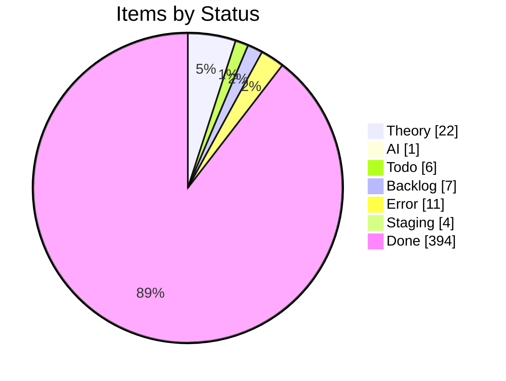
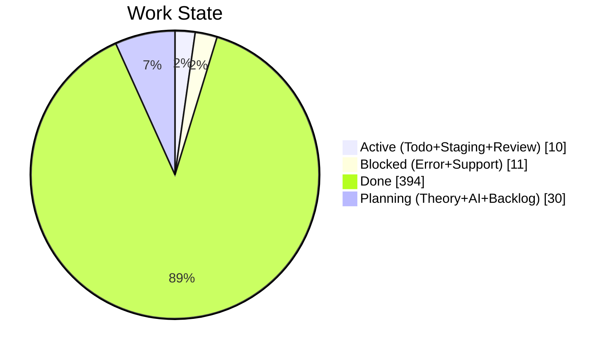
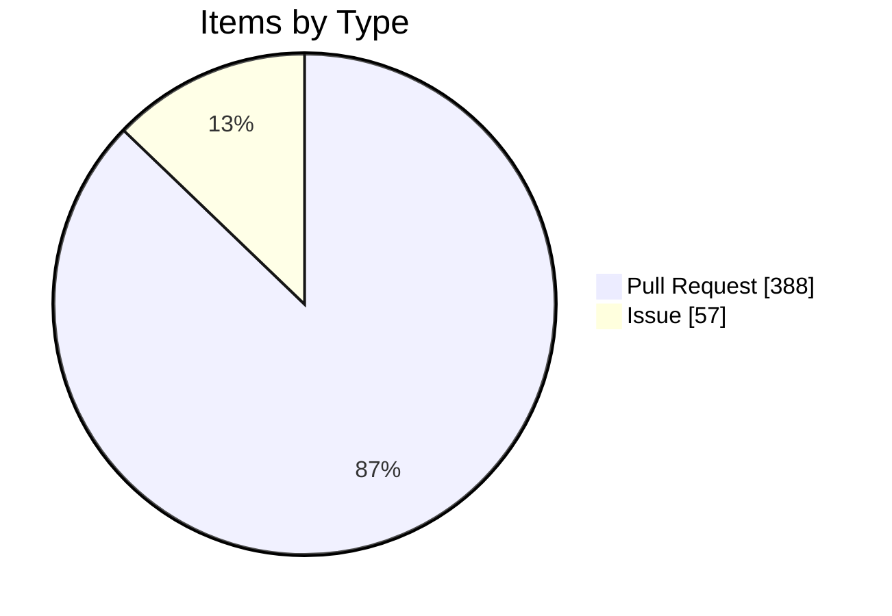

import { Card, CardGrid, Tabs, TabItem } from '@astrojs/starlight/components';

## Project Board Snapshot

:::note[Auto-generated]
Last synced: **2026-04-05T08:17:32.950Z** — updated daily by `ci-dashboard`.
Source: [KBVE Project Board](https://github.com/orgs/KBVE/projects/5)
:::

### Summary

<CardGrid>
  <Card title="Theory" icon="star">
    **22** items
  </Card>
  <Card title="AI" icon="rocket">
    **1** items
  </Card>
  <Card title="Todo" icon="list-format">
    **6** items
  </Card>
  <Card title="Backlog" icon="document">
    **7** items
  </Card>
  <Card title="Error" icon="warning">
    **11** items
  </Card>
  <Card title="Support" icon="information">
    **0** items
  </Card>
  <Card title="Staging" icon="setting">
    **4** items
  </Card>
  <Card title="Review" icon="approve-check">
    **0** items
  </Card>
  <Card title="Done" icon="approve-check-circle">
    **394** items
  </Card>
</CardGrid>

<Tabs>
  <TabItem label="Distribution">

  </TabItem>
  <TabItem label="Pipeline">

```mermaid
flowchart LR
    classDef planning fill:#8b5cf6,stroke:#6d28d9,color:#fff
    classDef active fill:#3b82f6,stroke:#1d4ed8,color:#fff
    classDef blocked fill:#ef4444,stroke:#b91c1c,color:#fff
    classDef done fill:#10b981,stroke:#059669,color:#fff
    Theory["Theory<br/><strong>22</strong>"]
    Theory --> AI
    AI["AI<br/><strong>1</strong>"]
    AI --> Todo
    Todo["Todo<br/><strong>6</strong>"]
    Todo --> Backlog
    Backlog["Backlog<br/><strong>7</strong>"]
    Backlog --> Error
    Error["Error<br/><strong>11</strong>"]
    Error --> Support
    Support["Support<br/><strong>0</strong>"]
    Support --> Staging
    Staging["Staging<br/><strong>4</strong>"]
    Staging --> Review
    Review["Review<br/><strong>0</strong>"]
    Review --> Done
    Done["Done<br/><strong>394</strong>"]
    class Theory,AI,Backlog planning
    class Todo,Staging,Review active
    class Error,Support blocked
    class Done done
```

:::tip[Legend]
**Purple** = Planning &nbsp; **Blue** = Active &nbsp; **Red** = Blocked &nbsp; **Green** = Done
:::

  </TabItem>
  <TabItem label="Breakdown">

#### Top Labels

| Label | Count |
|-------|:-----:|
| auto-pr | 388 |
| dev→main | 185 |
| atomic | 161 |
| enhancement | 29 |
| 0 | 20 |
| unity | 16 |
| bug | 14 |
| 1 | 11 |
| backlog | 8 |
| todo | 7 |

  </TabItem>
</Tabs>

### Theory (22)

| # | Title | Priority | Assignees | Labels |
|---|-------|----------|-----------|--------|
| [#2252](https://github.com/KBVE/kbve/issues/2252) | [Concept] : Shop Layout - Merch, Hardware, Services. | — | — | 1, enhancement |
| [#2362](https://github.com/KBVE/kbve/issues/2362) | [Concept] : [ItemDB] - Rigged Dice - 6 Items | — | h0lybyte | 1, enhancement |
| [#3472](https://github.com/KBVE/kbve/issues/3472) | [Concept] : [Unity] : TileMap GameObject | — | h0lybyte | 0, enhancement, unity |
| [#4643](https://github.com/KBVE/kbve/issues/4643) | [Concept] : [Unity] : Transport System | — | h0lybyte | 0, enhancement, unity |
| [#4812](https://github.com/KBVE/kbve/issues/4812) | [Concept] : [Unity] : Elven Mage - Character | — | h0lybyte | 0, enhancement, unity |
| [#5624](https://github.com/KBVE/kbve/issues/5624) | [Concept] : Add Intel NUC worker nodes to existing Talos KBVE cluster | — | h0lybyte, Copilot | 0, enhancement |
| [#6436](https://github.com/KBVE/kbve/issues/6436) | [Concept] : [Unity] : NPCDB - ECS | — | h0lybyte | 0, enhancement, unity |
| [#6437](https://github.com/KBVE/kbve/issues/6437) | [Concept] : [Unity] : Pathfinding ECS | — | h0lybyte | 0, enhancement, unity |
| [#6438](https://github.com/KBVE/kbve/issues/6438) | [Concept] : [Unity] : ItemDB ECS Migration | — | h0lybyte | 0, enhancement, unity |
| [#6446](https://github.com/KBVE/kbve/issues/6446) | [Concept] : [Unity] : MapDB - Schemas | — | h0lybyte | 0, enhancement, unity |
| [#6576](https://github.com/KBVE/kbve/issues/6576) | [Concept] : [Unity] : Entity Blittable System | — | h0lybyte | 0, enhancement, unity |
| [#7547](https://github.com/KBVE/kbve/issues/7547) | [MC] [Pumpkin] Implement CMerchantOffers packet and Merchant Trading GUI | — | h0lybyte | 0, enhancement |
| [#7730](https://github.com/KBVE/kbve/issues/7730) | [DISCORDSH] Rust-First Vote Process — Rate-Limited Server Voting Pipeline | — | h0lybyte | 1, enhancement, security |
| [#7593](https://github.com/KBVE/kbve/issues/7593) | [PG] Deploy CNPG Pooler (PgBouncer) and migrate services from direct -rw connect | — | h0lybyte | 2, enhancement, dependencies |
| [#8180](https://github.com/KBVE/kbve/issues/8180) | [DISCORDSH] POC: Mockoon docker-compose for local E2E testing | — | h0lybyte | 1, enhancement |
| [#8189](https://github.com/KBVE/kbve/issues/8189) | [BEVY] NPC Creatures — Performance Audit | — | — | enhancement |
| [#8245](https://github.com/KBVE/kbve/issues/8245) | perf(dashboard): migrate ClickHouse queries to @kbve/droid worker pipeline with  | — | — | enhancement |
| [#8935](https://github.com/KBVE/kbve/issues/8935) | [UE5] [OWS] Persist GameServer allocations to database | — | — | enhancement |
| [#8931](https://github.com/KBVE/kbve/issues/8931) | [UE5] [OWS] Add retry and circuit breaker for K8s API calls | — | — | enhancement |
| [#8933](https://github.com/KBVE/kbve/issues/8933) | [UE5] [OWS] Extract hardcoded cleanup config to options pattern | — | — | enhancement |
| [#8932](https://github.com/KBVE/kbve/issues/8932) | [UE5] [OWS] Move instance cleanup to scheduled background job | — | — | enhancement |
| [#9327](https://github.com/KBVE/kbve/issues/9327) | feat(astro-kbve): site graph integration — polish, testing, and rollout | — | h0lybyte | 1, enhancement, todo |

### AI (1)

| # | Title | Priority | Assignees | Labels |
|---|-------|----------|-----------|--------|
| [#4906](https://github.com/KBVE/kbve/issues/4906) | [Bug] : [Unity] : Character Orchestrator | — | h0lybyte | 0, bug, unity |

### Todo (6)

| # | Title | Priority | Assignees | Labels |
|---|-------|----------|-----------|--------|
| [#3572](https://github.com/KBVE/kbve/issues/3572) | [Update] : [Fudster] : User Billing &amp; Auth | — | h0lybyte | 1, security, update |
| [#4232](https://github.com/KBVE/kbve/issues/4232) | [Update] : [Github] : Rotate Tokens + Refactor Permissions | — | h0lybyte | 1, security, update |
| [#6939](https://github.com/KBVE/kbve/issues/6939) | [EPIC] Agent Orchestration Tab | — | — | 0, todo |
| [#8134](https://github.com/KBVE/kbve/issues/8134) | feat(proto): ClickHouse schema source of truth via protobuf → zod → vector pipel | — | h0lybyte | 4, documentation, todo |
| [#8148](https://github.com/KBVE/kbve/issues/8148) | [PSQL] Audit Discord Public Server Listing Functions | — | h0lybyte | 3, security, todo |
| [#8170](https://github.com/KBVE/kbve/issues/8170) | feat(proto): ArgoCD application state schema via protobuf → zod → edge pipeline | — | h0lybyte | 4, documentation, todo |

### Backlog (7)

| # | Title | Priority | Assignees | Labels |
|---|-------|----------|-----------|--------|
| [#75](https://github.com/KBVE/kbve/issues/75) | [Concept] : HerbMail.com - Front Page | — | — | 1, backlog |
| [#96](https://github.com/KBVE/kbve/issues/96) | [Concept] : [Backend] : Charles. | — | h0lybyte | 0, backlog |
| [#416](https://github.com/KBVE/kbve/issues/416) | [Concept] : FlyIO Deployment | — | — | 0, backlog |
| [#1559](https://github.com/KBVE/kbve/issues/1559) | [Concept] : Adding TailwindCSS Example Components | — | — | 2, backlog |
| [#4642](https://github.com/KBVE/kbve/issues/4642) | [Concept] : [Unity] : Droid System - Hybrid NPC System. | — | h0lybyte | 0, enhancement, backlog |
| [#7548](https://github.com/KBVE/kbve/issues/7548) | feat(memes): responsive bento grid feed + dedicated meme pages | — | h0lybyte | 1, backlog |
| [#7709](https://github.com/KBVE/kbve/issues/7709) | [CRYPTOTHRONE] Inventory System, Event Bridge, and Gameplay Loop Completion | — | h0lybyte | 1, enhancement, backlog |

### Error (11)

| # | Title | Priority | Assignees | Labels |
|---|-------|----------|-----------|--------|
| [#2992](https://github.com/KBVE/kbve/issues/2992) | [Bug] LofiFocus is down - [PENDING] Ingress | — | h0lybyte | 0, bug |
| [#3536](https://github.com/KBVE/kbve/issues/3536) | [Bug] : Update CONTRIBUE.MD | — | h0lybyte | 0, bug |
| [#3538](https://github.com/KBVE/kbve/issues/3538) | [Bug] : [Unity] : Gameplay Mechanics - Farming &amp; Crafting | — | h0lybyte | 0, bug, unity |
| [#4538](https://github.com/KBVE/kbve/issues/4538) | [Bug] : [Unity] : Multiplayer / Steam Integration | — | h0lybyte | 0, bug, unity |
| [#4623](https://github.com/KBVE/kbve/issues/4623) | [Bug] : [Unity] : Procedural Map Generation | — | h0lybyte | 2, bug, unity |
| [#4797](https://github.com/KBVE/kbve/issues/4797) | [Bug] : [Unity] : Enemy Ai should attack player structures, if players are not a | — | h0lybyte | 4, bug, unity |
| [#6705](https://github.com/KBVE/kbve/issues/6705) | [Bug] : [Unity] : Chip Character Sheet Off Center Sprites | — | h0lybyte | 0, bug, unity |
| [#8169](https://github.com/KBVE/kbve/issues/8169) | [CI] Docker image version mismatch — cached binary reports stale version | — | — | 6, bug, ci |
| [#8172](https://github.com/KBVE/kbve/issues/8172) | [ISOMETRIC] Lint deployments — validate WASM build assets before merge | — | — | 6, bug, ci |
| [#8664](https://github.com/KBVE/kbve/issues/8664) | [UE5] [OWS] Security &amp; code quality audit — 30+ findings | — | — | bug, ci |
| [#9182](https://github.com/KBVE/kbve/issues/9182) | [ROWS] Performance Audit — missing indexes, unbounded caches, query optimization | — | — | 6, bug, enhancement |

### Staging (4)

| # | Title | Priority | Assignees | Labels |
|---|-------|----------|-----------|--------|
| [#2208](https://github.com/KBVE/kbve/issues/2208) | [Concept] Service Page Enchancemnts | — | h0lybyte, dladeira | 4 |
| [#2267](https://github.com/KBVE/kbve/issues/2267) | [Concept] : CryptoThrone.com - King of the Hill App/Game | — | h0lybyte, BChip | 6 |
| [#3396](https://github.com/KBVE/kbve/issues/3396) | [Concept] : [Unity] : Adding Quirky Character Pack by Noiryt | — | h0lybyte | 4, unity |
| [#6943](https://github.com/KBVE/kbve/issues/6943) | Phase 2: Frontend - Orchestration Tab | — | — | todo |

### Done (394)

| # | Title | Priority | Assignees | Labels |
|---|-------|----------|-----------|--------|
| [#7761](https://github.com/KBVE/kbve/issues/7761) | [PSQL] Schema Optimizations - Memes, Realtime, Discordsh | — | h0lybyte | 3, bug, security |
| [#7956](https://github.com/KBVE/kbve/issues/7956) | chore(astro-kbve): re-enable starlight-site-graph after Zod 4 / Astro 6 support | — | — | 1, bug, backlog |
| [#8341](https://github.com/KBVE/kbve/issues/8341) | [PROTO] Zod codegen for 10 uncovered proto schemas | — | — | 6, enhancement |
| [#8528](https://github.com/KBVE/kbve/pull/8528) | Release: 1 feature, 2 fixes → Main | — | — | auto-pr, dev→main |
| [#8530](https://github.com/KBVE/kbve/pull/8530) | Atomic: fix ows libcairo | — | — | auto-pr, atomic |
| [#8533](https://github.com/KBVE/kbve/pull/8533) | Release: 2 fixes, 1 refactor, 2 chores → Main | — | — | auto-pr, dev→main |
| [#8535](https://github.com/KBVE/kbve/pull/8535) | Atomic: kube edge v0.1.20 | — | — | auto-pr, atomic |
| [#8537](https://github.com/KBVE/kbve/pull/8537) | Atomic: fix ows no root cook | — | — | auto-pr, atomic |
| [#8541](https://github.com/KBVE/kbve/pull/8541) | Atomic: fix ows build user | — | — | auto-pr, atomic |
| [#8544](https://github.com/KBVE/kbve/pull/8544) | Release: 1 fix, 1 refactor, 1 chore → Main | — | — | auto-pr, dev→main |
| [#8546](https://github.com/KBVE/kbve/pull/8546) | Release: 3 features, 3 fixes, 1 chore → Main | — | — | auto-pr, dev→main |
| [#8550](https://github.com/KBVE/kbve/pull/8550) | Atomic: fix ows kubectl | — | — | auto-pr, atomic |
| [#8557](https://github.com/KBVE/kbve/pull/8557) | chore(dashboard): daily sync — 2026-03-22 | — | — | auto-pr |
| [#8558](https://github.com/KBVE/kbve/pull/8558) | Release: 3 fixes, 2 chores → Main | — | — | auto-pr, dev→main |
| [#8562](https://github.com/KBVE/kbve/pull/8562) | Atomic: fix ows kustomize | — | — | auto-pr, atomic |
| [#8564](https://github.com/KBVE/kbve/pull/8564) | Release: 1 fix, 4 chores → Main | — | — | auto-pr, dev→main |
| [#8566](https://github.com/KBVE/kbve/pull/8566) | Atomic: fix ows safe dir | — | — | auto-pr, atomic |
| [#8568](https://github.com/KBVE/kbve/pull/8568) | Atomic: kube discordsh v0.1.34 | — | — | auto-pr, atomic |
| [#8572](https://github.com/KBVE/kbve/pull/8572) | Release: 1 fix → Main | — | — | auto-pr, dev→main |
| [#8576](https://github.com/KBVE/kbve/pull/8576) | Release: 1 feature, 1 chore → Main | — | — | auto-pr, dev→main |
| [#8579](https://github.com/KBVE/kbve/pull/8579) | Atomic: kube axum-kbve v1.0.71 | — | — | auto-pr, atomic |
| [#8580](https://github.com/KBVE/kbve/pull/8580) | Release: 2 features, 3 chores → Main | — | — | auto-pr, dev→main |
| [#8582](https://github.com/KBVE/kbve/pull/8582) | chore(dashboard): daily sync — 2026-03-22 | — | — | auto-pr |
| [#8589](https://github.com/KBVE/kbve/pull/8589) | Release: 1 feature, 1 perf → Main | — | — | auto-pr, dev→main |
| [#8591](https://github.com/KBVE/kbve/pull/8591) | Release: 1 feature, 1 fix → Main | — | — | auto-pr, dev→main |
| [#8602](https://github.com/KBVE/kbve/pull/8602) | Release: 1 chore → Main | — | — | auto-pr, dev→main |
| [#8607](https://github.com/KBVE/kbve/pull/8607) | Release: 2 fixes → Main | — | — | auto-pr, dev→main |
| [#8609](https://github.com/KBVE/kbve/pull/8609) | Release: 1 feature → Main | — | — | auto-pr, dev→main |
| [#8612](https://github.com/KBVE/kbve/pull/8612) | Release: 1 fix, 1 chore → Main | — | — | auto-pr, dev→main |
| [#8615](https://github.com/KBVE/kbve/pull/8615) | Release: 2 fixes, 1 chore → Main | — | — | auto-pr, dev→main |
| [#8619](https://github.com/KBVE/kbve/pull/8619) | Release: 1 fix → Main | — | — | auto-pr, dev→main |
| [#8621](https://github.com/KBVE/kbve/pull/8621) | Atomic: kube ows v0.1.2 | — | — | auto-pr, atomic |
| [#8623](https://github.com/KBVE/kbve/pull/8623) | Release: 1 fix → Main | — | — | auto-pr, dev→main |
| [#8625](https://github.com/KBVE/kbve/pull/8625) | Release: 1 fix, 1 refactor → Main | — | — | auto-pr, dev→main |
| [#8628](https://github.com/KBVE/kbve/pull/8628) | Release: 1 feature → Main | — | — | auto-pr, dev→main |
| [#8630](https://github.com/KBVE/kbve/pull/8630) | Release: 1 fix → Main | — | — | auto-pr, dev→main |
| [#8632](https://github.com/KBVE/kbve/pull/8632) | Release: 1 chore → Main | — | — | auto-pr, dev→main |
| [#8636](https://github.com/KBVE/kbve/pull/8636) | Atomic: kube ows-management v0.1.3 | — | — | auto-pr, atomic |
| [#8638](https://github.com/KBVE/kbve/pull/8638) | Atomic: kube ows-publicapi v0.1.3 | — | — | auto-pr, atomic |
| [#8640](https://github.com/KBVE/kbve/pull/8640) | Atomic: kube ows-globaldata v0.1.3 | — | — | auto-pr, atomic |
| [#8641](https://github.com/KBVE/kbve/pull/8641) | Release: 1 fix, 6 chores → Main | — | — | auto-pr, dev→main |
| [#8644](https://github.com/KBVE/kbve/pull/8644) | Atomic: kube ows-management v0.1.4 | — | — | auto-pr, atomic |
| [#8647](https://github.com/KBVE/kbve/pull/8647) | Atomic: kube ows-instancemanagement v0.1.4 | — | — | auto-pr, atomic |
| [#8648](https://github.com/KBVE/kbve/pull/8648) | Atomic: kube ows-characterpersistence v0.1.4 | — | — | auto-pr, atomic |
| [#8650](https://github.com/KBVE/kbve/pull/8650) | Atomic: kube ows-globaldata v0.1.4 | — | — | auto-pr, atomic |
| [#8652](https://github.com/KBVE/kbve/pull/8652) | Atomic: kube ows-publicapi v0.1.4 | — | — | auto-pr, atomic |
| [#8653](https://github.com/KBVE/kbve/pull/8653) | Release: 10 chores → Main | — | — | auto-pr, dev→main |
| [#8654](https://github.com/KBVE/kbve/pull/8654) | Atomic: ows gitignore | — | — | auto-pr, atomic |
| [#8657](https://github.com/KBVE/kbve/pull/8657) | Release: 2 fixes, 1 refactor → Main | — | — | auto-pr, dev→main |
| [#8659](https://github.com/KBVE/kbve/pull/8659) | Release: 3 features, 8 fixes, 1 test → Main | — | — | auto-pr, dev→main |
| [#8667](https://github.com/KBVE/kbve/pull/8667) | Atomic: fix ows valkey creds | — | — | auto-pr, atomic |
| [#8668](https://github.com/KBVE/kbve/pull/8668) | Atomic: fix ows auth middleware | — | — | auto-pr, atomic |
| [#8671](https://github.com/KBVE/kbve/pull/8671) | Atomic: fix ows rabbitmq ack | — | — | auto-pr, atomic |
| [#8674](https://github.com/KBVE/kbve/pull/8674) | Atomic: fix ows thread sleep | — | — | auto-pr, atomic |
| [#8676](https://github.com/KBVE/kbve/pull/8676) | Atomic: ows test suite | — | — | auto-pr, atomic |
| [#8680](https://github.com/KBVE/kbve/pull/8680) | Atomic: fix ows drawing cve | — | — | auto-pr, atomic |
| [#8685](https://github.com/KBVE/kbve/pull/8685) | Atomic: kube edge v0.1.21 | — | — | auto-pr, atomic |
| [#8690](https://github.com/KBVE/kbve/pull/8690) | Release: 1 fix, 2 chores → Main | — | — | auto-pr, dev→main |
| [#8697](https://github.com/KBVE/kbve/pull/8697) | Release: 1 fix → Main | — | — | auto-pr, dev→main |
| [#8701](https://github.com/KBVE/kbve/pull/8701) | Release: 1 feature → Main | — | — | auto-pr, dev→main |
| [#8708](https://github.com/KBVE/kbve/pull/8708) | Release: 1 fix → Main | — | — | auto-pr, dev→main |
| [#8715](https://github.com/KBVE/kbve/pull/8715) | Release: 1 fix → Main | — | — | auto-pr, dev→main |
| [#8722](https://github.com/KBVE/kbve/pull/8722) | Release: 1 feature → Main | — | — | auto-pr, dev→main |
| [#8729](https://github.com/KBVE/kbve/pull/8729) | Release: 1 fix → Main | — | — | auto-pr, dev→main |
| [#8731](https://github.com/KBVE/kbve/pull/8731) | Atomic: kube ows-characterpersistence v0.1.8 | — | — | auto-pr, atomic |
| [#8733](https://github.com/KBVE/kbve/pull/8733) | Atomic: kube ows-instancemanagement v0.1.8 | — | — | auto-pr, atomic |
| [#8736](https://github.com/KBVE/kbve/pull/8736) | Atomic: kube ows-globaldata v0.1.8 | — | — | auto-pr, atomic |
| [#8737](https://github.com/KBVE/kbve/pull/8737) | Atomic: kube ows-publicapi v0.1.8 | — | — | auto-pr, atomic |
| [#8739](https://github.com/KBVE/kbve/pull/8739) | Atomic: kube ows-management v0.1.8 | — | — | auto-pr, atomic |
| [#8740](https://github.com/KBVE/kbve/pull/8740) | Release: 10 chores → Main | — | — | auto-pr, dev→main |
| [#8742](https://github.com/KBVE/kbve/pull/8742) | Release: 1 feature → Main | — | — | auto-pr, dev→main |
| [#8745](https://github.com/KBVE/kbve/pull/8745) | Atomic: kube ows-globaldata v0.1.9 | — | — | auto-pr, atomic |
| [#8746](https://github.com/KBVE/kbve/pull/8746) | Atomic: kube ows-publicapi v0.1.9 | — | — | auto-pr, atomic |
| [#8748](https://github.com/KBVE/kbve/pull/8748) | Atomic: kube ows-instancemanagement v0.1.9 | — | — | auto-pr, atomic |
| [#8750](https://github.com/KBVE/kbve/pull/8750) | Atomic: kube ows-management v0.1.9 | — | — | auto-pr, atomic |
| [#8752](https://github.com/KBVE/kbve/pull/8752) | Atomic: kube ows-characterpersistence v0.1.9 | — | — | auto-pr, atomic |
| [#8754](https://github.com/KBVE/kbve/pull/8754) | Release: 1 fix, 10 chores → Main | — | — | auto-pr, dev→main |
| [#8760](https://github.com/KBVE/kbve/pull/8760) | Release: 1 feature, 1 fix, 11 chores → Main | — | — | auto-pr, dev→main |
| [#8765](https://github.com/KBVE/kbve/pull/8765) | Atomic: kube ows-instancemanagement v0.10.0 | — | — | auto-pr, atomic |
| [#8767](https://github.com/KBVE/kbve/pull/8767) | Atomic: kube ows-globaldata v0.10.0 | — | — | auto-pr, atomic |
| [#8768](https://github.com/KBVE/kbve/pull/8768) | Atomic: kube ows-management v0.10.0 | — | — | auto-pr, atomic |
| [#8770](https://github.com/KBVE/kbve/pull/8770) | Atomic: kube ows-characterpersistence v0.10.0 | — | — | auto-pr, atomic |
| [#8771](https://github.com/KBVE/kbve/pull/8771) | Atomic: kube ows-publicapi v0.10.0 | — | — | auto-pr, atomic |
| [#8776](https://github.com/KBVE/kbve/pull/8776) | Release: 2 features, 2 fixes, 1 chore → Main | — | — | auto-pr, dev→main |
| [#8786](https://github.com/KBVE/kbve/pull/8786) | Release: 1 feature, 2 fixes, 1 chore → Main | — | — | auto-pr, dev→main |
| [#8787](https://github.com/KBVE/kbve/pull/8787) | Atomic: bump discord sdk | — | — | auto-pr, atomic |
| [#8790](https://github.com/KBVE/kbve/pull/8790) | Atomic: bump ows versions | — | — | auto-pr, atomic |
| [#8791](https://github.com/KBVE/kbve/pull/8791) | Release: 3 features → Main | — | — | auto-pr, dev→main |
| [#8792](https://github.com/KBVE/kbve/pull/8792) | chore(dashboard): daily sync — 2026-03-23 | — | — | auto-pr |
| [#8794](https://github.com/KBVE/kbve/pull/8794) | chore(discordsh): update version.toml to 0.1.35 | — | — | auto-pr |
| [#8795](https://github.com/KBVE/kbve/pull/8795) | Atomic: kube discordsh v0.1.35 | — | — | auto-pr, atomic |
| [#8798](https://github.com/KBVE/kbve/pull/8798) | chore(ows-publicapi): update version.toml to 0.10.1 | — | — | auto-pr |
| [#8799](https://github.com/KBVE/kbve/pull/8799) | Atomic: kube ows-publicapi v0.10.1 | — | — | auto-pr, atomic |
| [#8800](https://github.com/KBVE/kbve/pull/8800) | chore(ows-characterpersistence): update version.toml to 0.10.1 | — | — | auto-pr |
| [#8801](https://github.com/KBVE/kbve/pull/8801) | Atomic: kube ows-characterpersistence v0.10.1 | — | — | auto-pr, atomic |
| [#8802](https://github.com/KBVE/kbve/pull/8802) | chore(ows-instancemanagement): update version.toml to 0.10.1 | — | — | auto-pr |
| [#8803](https://github.com/KBVE/kbve/pull/8803) | Atomic: kube ows-instancemanagement v0.10.1 | — | — | auto-pr, atomic |
| [#8804](https://github.com/KBVE/kbve/pull/8804) | chore(ows-globaldata): update version.toml to 0.10.1 | — | — | auto-pr |
| [#8805](https://github.com/KBVE/kbve/pull/8805) | Atomic: kube ows-globaldata v0.10.1 | — | — | auto-pr, atomic |
| [#8807](https://github.com/KBVE/kbve/pull/8807) | Release: 3 features, 4 fixes, 11 chores → Main | — | — | auto-pr, dev→main |
| [#8819](https://github.com/KBVE/kbve/pull/8819) | chore(axum-kbve): update version.toml to 1.0.72 | — | — | auto-pr |
| [#8820](https://github.com/KBVE/kbve/pull/8820) | Atomic: kube axum-kbve v1.0.72 | — | — | auto-pr, atomic |
| [#8822](https://github.com/KBVE/kbve/pull/8822) | Release: 2 features, 1 doc, 2 tests, 2 chores → Main | — | — | auto-pr, dev→main |
| [#8830](https://github.com/KBVE/kbve/pull/8830) | Release: 1 refactor, 1 chore → Main | — | — | auto-pr, dev→main |
| [#8834](https://github.com/KBVE/kbve/pull/8834) | Atomic: bump axum kbve | — | — | auto-pr, atomic |
| [#8836](https://github.com/KBVE/kbve/pull/8836) | Release: 1 feature, 3 fixes → Main | — | — | auto-pr, dev→main |
| [#8845](https://github.com/KBVE/kbve/pull/8845) | Release: 1 fix, 1 chore → Main | — | — | auto-pr, dev→main |
| [#8847](https://github.com/KBVE/kbve/pull/8847) | Atomic: kube axum-kbve v1.0.73 | — | — | auto-pr, atomic |
| [#8849](https://github.com/KBVE/kbve/pull/8849) | Release: 4 fixes, 2 chores → Main | — | — | auto-pr, dev→main |
| [#8853](https://github.com/KBVE/kbve/pull/8853) | Release: 4 fixes, 1 chore → Main | — | — | auto-pr, dev→main |
| [#8860](https://github.com/KBVE/kbve/pull/8860) | Atomic: fix chuckrpg trivy | — | — | auto-pr, atomic |
| [#8861](https://github.com/KBVE/kbve/pull/8861) | Atomic: fix chuckrpg tls | — | — | auto-pr, atomic |
| [#8871](https://github.com/KBVE/kbve/pull/8871) | chore(axum-kbve): update version.toml to 1.0.73 | — | — | auto-pr |
| [#8873](https://github.com/KBVE/kbve/pull/8873) | Atomic: fix chuckrpg e2e image | — | — | auto-pr, atomic |
| [#8877](https://github.com/KBVE/kbve/pull/8877) | Release: 1 feature, 3 fixes, 1 chore → Main | — | — | auto-pr, dev→main |
| [#8887](https://github.com/KBVE/kbve/pull/8887) | Release: 3 fixes → Main | — | — | auto-pr, dev→main |
| [#8890](https://github.com/KBVE/kbve/pull/8890) | Atomic: fix chuckrpg e2e tag | — | — | auto-pr, atomic |
| [#8892](https://github.com/KBVE/kbve/pull/8892) | Atomic: ows-globaldata v0.10.4 post-publish sync | — | — | auto-pr, atomic |
| [#8893](https://github.com/KBVE/kbve/pull/8893) | Atomic: ows-management v0.10.4 post-publish sync | — | — | auto-pr, atomic |
| [#8894](https://github.com/KBVE/kbve/pull/8894) | Atomic: ows-instancemanagement v0.10.4 post-publish sync | — | — | auto-pr, atomic |
| [#8895](https://github.com/KBVE/kbve/pull/8895) | Atomic: ows-characterpersistence v0.10.4 post-publish sync | — | — | auto-pr, atomic |
| [#8896](https://github.com/KBVE/kbve/pull/8896) | Atomic: ows-instancelauncher v0.10.4 post-publish sync | — | — | auto-pr, atomic |
| [#8897](https://github.com/KBVE/kbve/pull/8897) | Atomic: ows-publicapi v0.10.4 post-publish sync | — | — | auto-pr, atomic |
| [#8900](https://github.com/KBVE/kbve/pull/8900) | Release: 1 feature, 1 fix, 1 doc, 6 chores → Main | — | — | auto-pr, dev→main |
| [#8906](https://github.com/KBVE/kbve/pull/8906) | Atomic: fix chuckrpg image name | — | — | auto-pr, atomic |
| [#8908](https://github.com/KBVE/kbve/pull/8908) | Release: 3 features, 3 fixes, 1 chore → Main | — | — | auto-pr, dev→main |
| [#8917](https://github.com/KBVE/kbve/pull/8917) | Atomic: ows-globaldata v0.10.5 post-publish sync | — | — | auto-pr, atomic |
| [#8918](https://github.com/KBVE/kbve/pull/8918) | Atomic: ows-instancelauncher v0.10.5 post-publish sync | — | — | auto-pr, atomic |
| [#8919](https://github.com/KBVE/kbve/pull/8919) | Atomic: ows-characterpersistence v0.10.5 post-publish sync | — | — | auto-pr, atomic |
| [#8920](https://github.com/KBVE/kbve/pull/8920) | Atomic: ows-instancemanagement v0.10.5 post-publish sync | — | — | auto-pr, atomic |
| [#8922](https://github.com/KBVE/kbve/pull/8922) | Atomic: ows-publicapi v0.10.5 post-publish sync | — | — | auto-pr, atomic |
| [#8921](https://github.com/KBVE/kbve/pull/8921) | Atomic: ows-management v0.10.5 post-publish sync | — | — | auto-pr, atomic |
| [#8923](https://github.com/KBVE/kbve/pull/8923) | Atomic: axum-chuckrpg v0.1.1 post-publish sync | — | — | auto-pr, atomic |
| [#8925](https://github.com/KBVE/kbve/pull/8925) | Release: 5 chores → Main | — | — | auto-pr, dev→main |
| [#8928](https://github.com/KBVE/kbve/pull/8928) | Release: 2 fixes → Main | — | — | auto-pr, dev→main |
| [#8929](https://github.com/KBVE/kbve/pull/8929) | Atomic: ows-instancelauncher v0.10.6 post-publish sync | — | — | auto-pr, atomic |
| [#8930](https://github.com/KBVE/kbve/issues/8930) | [UE5] [OWS] Add Agones readiness validation at launcher startup | — | — | enhancement |
| [#8934](https://github.com/KBVE/kbve/issues/8934) | [UE5] [OWS] Fix blocking async calls in Agones allocation handlers | — | — | enhancement |
| [#8936](https://github.com/KBVE/kbve/pull/8936) | Release: 1 doc → Main | — | — | auto-pr, dev→main |
| [#8939](https://github.com/KBVE/kbve/pull/8939) | Release: 3 fixes → Main | — | — | auto-pr, dev→main |
| [#8942](https://github.com/KBVE/kbve/pull/8942) | Atomic: ows-instancelauncher v0.10.7 post-publish sync | — | — | auto-pr, atomic |
| [#8943](https://github.com/KBVE/kbve/pull/8943) | Release: 1 chore → Main | — | — | auto-pr, dev→main |
| [#8946](https://github.com/KBVE/kbve/pull/8946) | Release: 2 features → Main | — | — | auto-pr, dev→main |
| [#8951](https://github.com/KBVE/kbve/pull/8951) | Release: 2 features → Main | — | — | auto-pr, dev→main |
| [#8954](https://github.com/KBVE/kbve/pull/8954) | Atomic: ows-characterpersistence v0.10.6 post-publish sync | — | — | auto-pr, atomic |
| [#8953](https://github.com/KBVE/kbve/pull/8953) | Atomic: ows-publicapi v0.10.6 post-publish sync | — | — | auto-pr, atomic |
| [#8955](https://github.com/KBVE/kbve/pull/8955) | Atomic: ows-globaldata v0.10.6 post-publish sync | — | — | auto-pr, atomic |
| [#8956](https://github.com/KBVE/kbve/pull/8956) | Atomic: ows-management v0.10.6 post-publish sync | — | — | auto-pr, atomic |
| [#8957](https://github.com/KBVE/kbve/pull/8957) | Atomic: ows-instancelauncher v0.10.8 post-publish sync | — | — | auto-pr, atomic |
| [#8958](https://github.com/KBVE/kbve/pull/8958) | Atomic: ows-instancemanagement v0.10.6 post-publish sync | — | — | auto-pr, atomic |
| [#8960](https://github.com/KBVE/kbve/pull/8960) | Release: 1 feature, 6 chores → Main | — | — | auto-pr, dev→main |
| [#8963](https://github.com/KBVE/kbve/pull/8963) | Release: 1 feature → Main | — | — | auto-pr, dev→main |
| [#8964](https://github.com/KBVE/kbve/pull/8964) | Atomic: fix certmgr gateway | — | — | auto-pr, atomic |
| [#8966](https://github.com/KBVE/kbve/pull/8966) | Release: 1 fix, 1 perf → Main | — | — | auto-pr, dev→main |
| [#8968](https://github.com/KBVE/kbve/pull/8968) | Release: 1 refactor → Main | — | — | auto-pr, dev→main |
| [#8969](https://github.com/KBVE/kbve/pull/8969) | Atomic: fix certmgr gateway | — | — | auto-pr, atomic |
| [#8970](https://github.com/KBVE/kbve/pull/8970) | Atomic: fix certmgr enable gw | — | — | auto-pr, atomic |
| [#8972](https://github.com/KBVE/kbve/pull/8972) | Release: 1 refactor → Main | — | — | auto-pr, dev→main |
| [#8976](https://github.com/KBVE/kbve/pull/8976) | Release: 5 features, 1 fix, 2 docs → Main | — | — | auto-pr, dev→main |
| [#8987](https://github.com/KBVE/kbve/pull/8987) | Release: 6 features, 1 doc → Main | — | — | auto-pr, dev→main |
| [#8999](https://github.com/KBVE/kbve/pull/8999) | Release: 2 features, 2 fixes → Main | — | — | auto-pr, dev→main |
| [#9005](https://github.com/KBVE/kbve/pull/9005) | Atomic: axum-chuckrpg v0.1.2 post-publish sync | — | — | auto-pr, atomic |
| [#9008](https://github.com/KBVE/kbve/pull/9008) | Release: 1 feature, 1 fix, 1 chore → Main | — | — | auto-pr, dev→main |
| [#9013](https://github.com/KBVE/kbve/pull/9013) | Release: 1 feature, 2 fixes → Main | — | — | auto-pr, dev→main |
| [#9017](https://github.com/KBVE/kbve/pull/9017) | Release: 1 fix → Main | — | — | auto-pr, dev→main |
| [#9020](https://github.com/KBVE/kbve/pull/9020) | Release: 1 fix, 1 chore → Main | — | — | auto-pr, dev→main |
| [#9021](https://github.com/KBVE/kbve/pull/9021) | Atomic: axum-chuckrpg v0.1.3 post-publish sync | — | — | auto-pr, atomic |
| [#9022](https://github.com/KBVE/kbve/pull/9022) | Release: 1 fix, 2 chores → Main | — | — | auto-pr, dev→main |
| [#9023](https://github.com/KBVE/kbve/pull/9023) | Atomic: rows v0.1.1 post-publish sync | — | — | auto-pr, atomic |
| [#9027](https://github.com/KBVE/kbve/pull/9027) | Release: 1 chore → Main | — | — | auto-pr, dev→main |
| [#9031](https://github.com/KBVE/kbve/pull/9031) | Release: 1 fix, 1 doc → Main | — | — | auto-pr, dev→main |
| [#9033](https://github.com/KBVE/kbve/pull/9033) | Atomic: rows v0.1.2 post-publish sync | — | — | auto-pr, atomic |
| [#9034](https://github.com/KBVE/kbve/pull/9034) | Release: 1 test, 1 chore → Main | — | — | auto-pr, dev→main |
| [#9037](https://github.com/KBVE/kbve/pull/9037) | Release: 1 chore → Main | — | — | auto-pr, dev→main |
| [#9038](https://github.com/KBVE/kbve/pull/9038) | Atomic: rows v0.1.3 post-publish sync | — | — | auto-pr, atomic |
| [#9039](https://github.com/KBVE/kbve/pull/9039) | Release: 1 chore → Main | — | — | auto-pr, dev→main |
| [#9041](https://github.com/KBVE/kbve/pull/9041) | Release: 1 fix, 1 chore → Main | — | — | auto-pr, dev→main |
| [#9042](https://github.com/KBVE/kbve/pull/9042) | Atomic: rows v0.1.4 post-publish sync | — | — | auto-pr, atomic |
| [#9043](https://github.com/KBVE/kbve/pull/9043) | Release: 1 chore → Main | — | — | auto-pr, dev→main |
| [#9044](https://github.com/KBVE/kbve/pull/9044) | Atomic: axum-kbve v1.0.74 post-publish sync | — | — | auto-pr, atomic |
| [#9047](https://github.com/KBVE/kbve/pull/9047) | Release: 1 feature, 4 docs, 1 chore → Main | — | — | auto-pr, dev→main |
| [#9048](https://github.com/KBVE/kbve/pull/9048) | Atomic: rows swagger audit | — | — | auto-pr, atomic |
| [#9055](https://github.com/KBVE/kbve/pull/9055) | Atomic: rows v0.1.5 post-publish sync | — | — | auto-pr, atomic |
| [#9056](https://github.com/KBVE/kbve/pull/9056) | Release: 1 chore → Main | — | — | auto-pr, dev→main |
| [#9058](https://github.com/KBVE/kbve/pull/9058) | Release: 2 chores → Main | — | — | auto-pr, dev→main |
| [#9059](https://github.com/KBVE/kbve/pull/9059) | chore(dashboard): daily sync — 2026-03-24 | — | — | auto-pr |
| [#9062](https://github.com/KBVE/kbve/pull/9062) | Release: 1 feature, 1 fix → Main | — | — | auto-pr, dev→main |
| [#9064](https://github.com/KBVE/kbve/pull/9064) | Atomic: rows v0.1.6 post-publish sync | — | — | auto-pr, atomic |
| [#9065](https://github.com/KBVE/kbve/pull/9065) | Release: 1 fix, 1 chore → Main | — | — | auto-pr, dev→main |
| [#9066](https://github.com/KBVE/kbve/pull/9066) | Release: 1 fix, 1 chore → Main | — | — | auto-pr, dev→main |
| [#9068](https://github.com/KBVE/kbve/pull/9068) | Atomic: discordsh v0.1.36 post-publish sync | — | — | auto-pr, atomic |
| [#9069](https://github.com/KBVE/kbve/pull/9069) | Release: 1 feature, 1 fix, 1 doc, 1 chore → Main | — | — | auto-pr, dev→main |
| [#9072](https://github.com/KBVE/kbve/pull/9072) | Atomic: rows v0.1.7 post-publish sync | — | — | auto-pr, atomic |
| [#9073](https://github.com/KBVE/kbve/pull/9073) | Release: 1 chore → Main | — | — | auto-pr, dev→main |
| [#9075](https://github.com/KBVE/kbve/pull/9075) | Release: 4 fixes, 1 doc → Main | — | — | auto-pr, dev→main |
| [#9083](https://github.com/KBVE/kbve/pull/9083) | Release: 1 feature, 1 fix, 1 chore → Main | — | — | auto-pr, dev→main |
| [#9084](https://github.com/KBVE/kbve/pull/9084) | Atomic: rows v0.1.8 post-publish sync | — | — | auto-pr, atomic |
| [#9085](https://github.com/KBVE/kbve/pull/9085) | Release: 1 chore → Main | — | — | auto-pr, dev→main |
| [#9086](https://github.com/KBVE/kbve/pull/9086) | Atomic: discordsh v0.1.37 post-publish sync | — | — | auto-pr, atomic |
| [#9090](https://github.com/KBVE/kbve/pull/9090) | Release: 2 features, 2 fixes, 2 chores → Main | — | — | auto-pr, dev→main |
| [#9091](https://github.com/KBVE/kbve/pull/9091) | Atomic: rows v0.1.9 post-publish sync | — | — | auto-pr, atomic |
| [#9092](https://github.com/KBVE/kbve/pull/9092) | Release: 2 chores → Main | — | — | auto-pr, dev→main |
| [#9093](https://github.com/KBVE/kbve/pull/9093) | Atomic: discordsh v0.1.38 post-publish sync | — | — | auto-pr, atomic |
| [#9095](https://github.com/KBVE/kbve/pull/9095) | Atomic: axum-kbve v1.0.75 post-publish sync | — | — | auto-pr, atomic |
| [#9097](https://github.com/KBVE/kbve/pull/9097) | Release: 2 fixes, 2 chores → Main | — | — | auto-pr, dev→main |
| [#9098](https://github.com/KBVE/kbve/pull/9098) | Atomic: rows v0.1.10 post-publish sync | — | — | auto-pr, atomic |
| [#9099](https://github.com/KBVE/kbve/pull/9099) | Release: 1 feature, 3 chores → Main | — | — | auto-pr, dev→main |
| [#9101](https://github.com/KBVE/kbve/pull/9101) | Atomic: axum-chuckrpg v0.1.4 post-publish sync | — | — | auto-pr, atomic |
| [#9102](https://github.com/KBVE/kbve/pull/9102) | Release: 2 chores → Main | — | — | auto-pr, dev→main |
| [#9103](https://github.com/KBVE/kbve/pull/9103) | Atomic: discordsh v0.1.39 post-publish sync | — | — | auto-pr, atomic |
| [#9104](https://github.com/KBVE/kbve/pull/9104) | Atomic: axum-kbve v1.0.76 post-publish sync | — | — | auto-pr, atomic |
| [#9105](https://github.com/KBVE/kbve/pull/9105) | Release: 1 chore → Main | — | — | auto-pr, dev→main |
| [#9108](https://github.com/KBVE/kbve/pull/9108) | chore(dashboard): daily sync — 2026-03-25 | — | — | auto-pr |
| [#9109](https://github.com/KBVE/kbve/pull/9109) | Release: 1 feature, 1 fix, 1 chore → Main | — | — | auto-pr, dev→main |
| [#9112](https://github.com/KBVE/kbve/pull/9112) | Release: 2 features, 1 fix → Main | — | — | auto-pr, dev→main |
| [#9118](https://github.com/KBVE/kbve/pull/9118) | Release: 1 feature, 1 fix → Main | — | — | auto-pr, dev→main |
| [#9120](https://github.com/KBVE/kbve/pull/9120) | Release: 2 fixes → Main | — | — | auto-pr, dev→main |
| [#9124](https://github.com/KBVE/kbve/pull/9124) | Atomic: rows v0.1.11 post-publish sync | — | — | auto-pr, atomic |
| [#9127](https://github.com/KBVE/kbve/pull/9127) | Release: 3 fixes, 1 chore → Main | — | — | auto-pr, dev→main |
| [#9131](https://github.com/KBVE/kbve/pull/9131) | Release: 2 fixes, 1 chore → Main | — | — | auto-pr, dev→main |
| [#9133](https://github.com/KBVE/kbve/pull/9133) | Release: 1 fix, 1 chore → Main | — | — | auto-pr, dev→main |
| [#9134](https://github.com/KBVE/kbve/pull/9134) | Atomic: rows v0.1.12 post-publish sync | — | — | auto-pr, atomic |
| [#9135](https://github.com/KBVE/kbve/pull/9135) | Atomic: axum-chuckrpg v0.1.5 post-publish sync | — | — | auto-pr, atomic |
| [#9136](https://github.com/KBVE/kbve/pull/9136) | Release: 2 fixes, 2 chores → Main | — | — | auto-pr, dev→main |
| [#9139](https://github.com/KBVE/kbve/pull/9139) | Atomic: rows v0.1.13 post-publish sync | — | — | auto-pr, atomic |
| [#9140](https://github.com/KBVE/kbve/pull/9140) | Release: 1 chore → Main | — | — | auto-pr, dev→main |
| [#9142](https://github.com/KBVE/kbve/pull/9142) | Release: 1 fix → Main | — | — | auto-pr, dev→main |
| [#9143](https://github.com/KBVE/kbve/pull/9143) | Release: 2 fixes, 1 chore → Main | — | — | auto-pr, dev→main |
| [#9149](https://github.com/KBVE/kbve/pull/9149) | Atomic: rows v0.1.14 post-publish sync | — | — | auto-pr, atomic |
| [#9150](https://github.com/KBVE/kbve/pull/9150) | Release: 1 fix, 1 perf, 1 chore → Main | — | — | auto-pr, dev→main |
| [#9152](https://github.com/KBVE/kbve/pull/9152) | Release: 1 fix → Main | — | — | auto-pr, dev→main |
| [#9153](https://github.com/KBVE/kbve/pull/9153) | Release: 2 chores → Main | — | — | auto-pr, dev→main |
| [#9156](https://github.com/KBVE/kbve/pull/9156) | Atomic: rows v0.1.15 post-publish sync | — | — | auto-pr, atomic |
| [#9157](https://github.com/KBVE/kbve/pull/9157) | Release: 1 chore → Main | — | — | auto-pr, dev→main |
| [#9159](https://github.com/KBVE/kbve/pull/9159) | Release: 1 fix → Main | — | — | auto-pr, dev→main |
| [#9162](https://github.com/KBVE/kbve/pull/9162) | Release: 0 commits → Main | — | — | auto-pr, dev→main |
| [#9164](https://github.com/KBVE/kbve/pull/9164) | Atomic: rows v0.1.16 post-publish sync | — | — | auto-pr, atomic |
| [#9165](https://github.com/KBVE/kbve/pull/9165) | Release: 1 chore → Main | — | — | auto-pr, dev→main |
| [#9167](https://github.com/KBVE/kbve/pull/9167) | Release: 3 features, 1 fix, 2 docs, 1 refactor, 1 chore → Main | — | — | auto-pr, dev→main |
| [#9175](https://github.com/KBVE/kbve/pull/9175) | Atomic: chisel-ubuntu-axum v24.04.2 post-publish sync | — | — | auto-pr, atomic |
| [#9176](https://github.com/KBVE/kbve/pull/9176) | Release: 4 features, 2 fixes, 1 doc, 1 perf, 3 chores → Main | — | — | auto-pr, dev→main |
| [#9177](https://github.com/KBVE/kbve/pull/9177) | Atomic: rows v0.1.17 post-publish sync | — | — | auto-pr, atomic |
| [#9188](https://github.com/KBVE/kbve/pull/9188) | Atomic: rows v0.1.18 post-publish sync | — | — | auto-pr, atomic |
| [#9189](https://github.com/KBVE/kbve/pull/9189) | Release: 2 fixes, 2 docs, 1 refactor, 4 chores → Main | — | — | auto-pr, dev→main |
| [#9192](https://github.com/KBVE/kbve/pull/9192) | Atomic: axum-kbve v1.0.77 post-publish sync | — | — | auto-pr, atomic |
| [#9193](https://github.com/KBVE/kbve/pull/9193) | chore(dashboard): daily sync — 2026-03-26 | — | — | auto-pr |
| [#9199](https://github.com/KBVE/kbve/pull/9199) | Release: 1 fix → Main | — | — | auto-pr, dev→main |
| [#9201](https://github.com/KBVE/kbve/pull/9201) | Release: 1 fix → Main | — | — | auto-pr, dev→main |
| [#9203](https://github.com/KBVE/kbve/pull/9203) | Release: 2 features, 1 chore → Main | — | — | auto-pr, dev→main |
| [#9209](https://github.com/KBVE/kbve/pull/9209) | Atomic: rows v0.1.19 post-publish sync | — | — | auto-pr, atomic |
| [#9210](https://github.com/KBVE/kbve/pull/9210) | Release: 1 chore → Main | — | — | auto-pr, dev→main |
| [#9212](https://github.com/KBVE/kbve/pull/9212) | Release: 1 fix → Main | — | — | auto-pr, dev→main |
| [#9213](https://github.com/KBVE/kbve/pull/9213) | Release: 1 feature, 4 chores → Main | — | — | auto-pr, dev→main |
| [#9217](https://github.com/KBVE/kbve/pull/9217) | chore(dashboard): daily sync — 2026-03-27 | — | — | auto-pr |
| [#9218](https://github.com/KBVE/kbve/pull/9218) | Atomic: axum-chuckrpg v0.1.6 post-publish sync | — | — | auto-pr, atomic |
| [#9219](https://github.com/KBVE/kbve/pull/9219) | Release: 1 feature, 1 fix, 2 chores → Main | — | — | auto-pr, dev→main |
| [#9220](https://github.com/KBVE/kbve/pull/9220) | Atomic: rows v0.1.20 post-publish sync | — | — | auto-pr, atomic |
| [#9224](https://github.com/KBVE/kbve/pull/9224) | Atomic: rows v0.1.21 post-publish sync | — | — | auto-pr, atomic |
| [#9225](https://github.com/KBVE/kbve/pull/9225) | Release: 1 chore → Main | — | — | auto-pr, dev→main |
| [#9226](https://github.com/KBVE/kbve/pull/9226) | Atomic: axum-kbve v1.0.78 post-publish sync | — | — | auto-pr, atomic |
| [#9227](https://github.com/KBVE/kbve/pull/9227) | Release: 3 fixes, 1 doc, 2 chores → Main | — | — | auto-pr, dev→main |
| [#9232](https://github.com/KBVE/kbve/pull/9232) | Atomic: rows v0.1.22 post-publish sync | — | — | auto-pr, atomic |
| [#9233](https://github.com/KBVE/kbve/pull/9233) | Release: 1 chore → Main | — | — | auto-pr, dev→main |
| [#9234](https://github.com/KBVE/kbve/pull/9234) | Release: 2 fixes, 1 CI, 1 chore → Main | — | — | auto-pr, dev→main |
| [#9237](https://github.com/KBVE/kbve/pull/9237) | chore(dashboard): daily sync — 2026-03-28 | — | — | auto-pr |
| [#9238](https://github.com/KBVE/kbve/pull/9238) | Release: 6 features, 3 fixes, 1 chore → Main | — | — | auto-pr, dev→main |
| [#9248](https://github.com/KBVE/kbve/pull/9248) | Release: 0 commits → Main | — | — | auto-pr, dev→main |
| [#9253](https://github.com/KBVE/kbve/pull/9253) | deploy(isometric): update WASM build | — | — | auto-pr |
| [#9254](https://github.com/KBVE/kbve/pull/9254) | Atomic: discordsh v0.1.40 post-publish sync | — | — | auto-pr, atomic |
| [#9255](https://github.com/KBVE/kbve/pull/9255) | Release: 1 chore → Main | — | — | auto-pr, dev→main |
| [#9259](https://github.com/KBVE/kbve/pull/9259) | Release: 1 feature, 2 fixes → Main | — | — | auto-pr, dev→main |
| [#9261](https://github.com/KBVE/kbve/pull/9261) | Atomic: rows v0.1.23 post-publish sync | — | — | auto-pr, atomic |
| [#9262](https://github.com/KBVE/kbve/pull/9262) | Release: 6 features, 4 fixes, 2 docs, 3 chores → Main | — | — | auto-pr, dev→main |
| [#9266](https://github.com/KBVE/kbve/pull/9266) | chore(dashboard): daily sync — 2026-03-29 | — | — | auto-pr |
| [#9280](https://github.com/KBVE/kbve/pull/9280) | deploy(isometric): update WASM build | — | — | auto-pr |
| [#9281](https://github.com/KBVE/kbve/pull/9281) | Release: 6 features, 2 docs, 1 chore → Main | — | — | auto-pr, dev→main |
| [#9289](https://github.com/KBVE/kbve/pull/9289) | Atomic: axum-chuckrpg v0.1.7 post-publish sync | — | — | auto-pr, atomic |
| [#9290](https://github.com/KBVE/kbve/pull/9290) | Release: 2 chores → Main | — | — | auto-pr, dev→main |
| [#9291](https://github.com/KBVE/kbve/pull/9291) | Atomic: discordsh v0.1.41 post-publish sync | — | — | auto-pr, atomic |
| [#9293](https://github.com/KBVE/kbve/pull/9293) | Atomic: axum-kbve v1.0.79 post-publish sync | — | — | auto-pr, atomic |
| [#9294](https://github.com/KBVE/kbve/pull/9294) | Release: 2 features, 1 chore → Main | — | — | auto-pr, dev→main |
| [#9297](https://github.com/KBVE/kbve/pull/9297) | Release: 4 features, 2 fixes, 6 chores → Main | — | — | auto-pr, dev→main |
| [#9318](https://github.com/KBVE/kbve/pull/9318) | chore(dashboard): daily sync — 2026-03-30 | — | — | auto-pr |
| [#9323](https://github.com/KBVE/kbve/pull/9323) | Release: 1 feature, 7 chores → Main | — | — | auto-pr, dev→main |
| [#9333](https://github.com/KBVE/kbve/pull/9333) | Release: 4 features, 1 fix, 1 doc, 3 chores → Main | — | — | auto-pr, dev→main |
| [#9334](https://github.com/KBVE/kbve/issues/9334) | [ROWS] v0.4/v0.5 — Complete migration from C# OWS to Rust ROWS | — | — | 6, enhancement, todo |
| [#9351](https://github.com/KBVE/kbve/pull/9351) | Release: 4 features, 5 fixes, 2 docs, 1 build, 1 test, 7 chores → Main | — | — | auto-pr, dev→main |
| [#9368](https://github.com/KBVE/kbve/pull/9368) | Atomic: axum-kbve v1.0.80 post-publish sync | — | — | auto-pr, atomic |
| [#9369](https://github.com/KBVE/kbve/pull/9369) | Release: 4 features, 4 fixes, 3 chores → Main | — | — | auto-pr, dev→main |
| [#9378](https://github.com/KBVE/kbve/pull/9378) | deploy(isometric): update WASM build | — | — | auto-pr |
| [#9379](https://github.com/KBVE/kbve/pull/9379) | Atomic: axum-kbve v1.0.81 post-publish sync | — | — | auto-pr, atomic |
| [#9380](https://github.com/KBVE/kbve/pull/9380) | Release: 2 fixes, 1 doc, 2 chores → Main | — | — | auto-pr, dev→main |
| [#9381](https://github.com/KBVE/kbve/pull/9381) | chore(dashboard): daily sync — 2026-03-31 | — | — | auto-pr |
| [#9385](https://github.com/KBVE/kbve/pull/9385) | Release: 5 fixes, 1 chore → Main | — | — | auto-pr, dev→main |
| [#9392](https://github.com/KBVE/kbve/pull/9392) | chore(jedi): update version.toml to 0.2.2 | — | — | auto-pr |
| [#9395](https://github.com/KBVE/kbve/pull/9395) | Release: 2 features, 4 fixes, 1 chore → Main | — | — | auto-pr, dev→main |
| [#9400](https://github.com/KBVE/kbve/pull/9400) | Release: 4 fixes → Main | — | — | auto-pr, dev→main |
| [#9407](https://github.com/KBVE/kbve/pull/9407) | Release: 2 fixes, 1 refactor, 1 chore → Main | — | — | auto-pr, dev→main |
| [#9415](https://github.com/KBVE/kbve/pull/9415) | Release: 2 features, 3 fixes, 1 chore → Main | — | — | auto-pr, dev→main |
| [#9424](https://github.com/KBVE/kbve/pull/9424) | Release: 5 fixes, 1 chore → Main | — | — | auto-pr, dev→main |
| [#9433](https://github.com/KBVE/kbve/pull/9433) | Atomic: discordsh-bot v0.1.1 post-publish sync | — | — | auto-pr, atomic |
| [#9434](https://github.com/KBVE/kbve/pull/9434) | Release: 1 fix, 1 chore → Main | — | — | auto-pr, dev→main |
| [#9438](https://github.com/KBVE/kbve/pull/9438) | Atomic: axum-kbve v1.0.82 post-publish sync | — | — | auto-pr, atomic |
| [#9439](https://github.com/KBVE/kbve/pull/9439) | Release: 2 chores → Main | — | — | auto-pr, dev→main |
| [#9440](https://github.com/KBVE/kbve/pull/9440) | chore(dashboard): daily sync — 2026-04-01 | — | — | auto-pr |
| [#9441](https://github.com/KBVE/kbve/pull/9441) | Release: 2 features, 4 fixes, 1 doc, 1 refactor, 3 chores → Main | — | — | auto-pr, dev→main |
| [#9452](https://github.com/KBVE/kbve/pull/9452) | Release: 1 feature, 2 fixes, 1 chore → Main | — | — | auto-pr, dev→main |
| [#9454](https://github.com/KBVE/kbve/pull/9454) | Atomic: axum-kbve v1.0.83 post-publish sync | — | — | auto-pr, atomic |
| [#9456](https://github.com/KBVE/kbve/pull/9456) | Release: 1 feature, 2 fixes, 1 doc, 1 chore → Main | — | — | auto-pr, dev→main |
| [#9459](https://github.com/KBVE/kbve/pull/9459) | Release: 1 fix, 2 chores → Main | — | — | auto-pr, dev→main |
| [#9462](https://github.com/KBVE/kbve/pull/9462) | Atomic: irc-gateway v0.1.3 post-publish sync | — | — | auto-pr, atomic |
| [#9465](https://github.com/KBVE/kbve/pull/9465) | Release: 1 fix, 1 chore → Main | — | — | auto-pr, dev→main |
| [#9466](https://github.com/KBVE/kbve/pull/9466) | Atomic: axum-kbve v1.0.85 post-publish sync | — | — | auto-pr, atomic |
| [#9470](https://github.com/KBVE/kbve/pull/9470) | Release: 2 fixes, 1 chore → Main | — | — | auto-pr, dev→main |
| [#9474](https://github.com/KBVE/kbve/pull/9474) | Release: 2 fixes → Main | — | — | auto-pr, dev→main |
| [#9477](https://github.com/KBVE/kbve/pull/9477) | Release: 2 fixes, 1 refactor, 1 chore → Main | — | — | auto-pr, dev→main |
| [#9478](https://github.com/KBVE/kbve/pull/9478) | deploy(isometric): update WASM build | — | — | auto-pr |
| [#9483](https://github.com/KBVE/kbve/pull/9483) | deploy(isometric): update WASM build | — | — | auto-pr |
| [#9484](https://github.com/KBVE/kbve/pull/9484) | Release: 1 fix, 4 chores → Main | — | — | auto-pr, dev→main |
| [#9487](https://github.com/KBVE/kbve/pull/9487) | Atomic: axum-kbve v1.0.86 post-publish sync | — | — | auto-pr, atomic |
| [#9489](https://github.com/KBVE/kbve/pull/9489) | Atomic: chisel-ubuntu-axum v24.04.3 post-publish sync | — | — | auto-pr, atomic |
| [#9490](https://github.com/KBVE/kbve/pull/9490) | Release: 2 fixes, 1 perf, 4 chores → Main | — | — | auto-pr, dev→main |
| [#9493](https://github.com/KBVE/kbve/pull/9493) | Atomic: irc-gateway v0.1.4 post-publish sync | — | — | auto-pr, atomic |
| [#9494](https://github.com/KBVE/kbve/pull/9494) | chore(dashboard): daily sync — 2026-04-02 | — | — | auto-pr |
| [#9499](https://github.com/KBVE/kbve/pull/9499) | Atomic: chisel-ubuntu-axum v24.04.4 post-publish sync | — | — | auto-pr, atomic |
| [#9500](https://github.com/KBVE/kbve/pull/9500) | Release: 1 fix, 2 chores → Main | — | — | auto-pr, dev→main |
| [#9503](https://github.com/KBVE/kbve/pull/9503) | Release: 1 feature, 1 fix, 3 chores → Main | — | — | auto-pr, dev→main |
| [#9504](https://github.com/KBVE/kbve/pull/9504) | Atomic: discordsh v0.1.42 post-publish sync | — | — | auto-pr, atomic |
| [#9505](https://github.com/KBVE/kbve/pull/9505) | Atomic: irc-gateway v0.1.5 post-publish sync | — | — | auto-pr, atomic |
| [#9512](https://github.com/KBVE/kbve/pull/9512) | Release: 1 feature, 1 fix → Main | — | — | auto-pr, dev→main |
| [#9513](https://github.com/KBVE/kbve/pull/9513) | Atomic: chisel-ubuntu-axum v24.04.5 post-publish sync | — | — | auto-pr, atomic |
| [#9514](https://github.com/KBVE/kbve/pull/9514) | Release: 1 chore → Main | — | — | auto-pr, dev→main |
| [#9517](https://github.com/KBVE/kbve/pull/9517) | Release: 2 fixes → Main | — | — | auto-pr, dev→main |
| [#9518](https://github.com/KBVE/kbve/pull/9518) | Atomic: edge v0.1.22 post-publish sync | — | — | auto-pr, atomic |
| [#9519](https://github.com/KBVE/kbve/pull/9519) | Release: 1 fix, 2 chores → Main | — | — | auto-pr, dev→main |
| [#9520](https://github.com/KBVE/kbve/pull/9520) | Atomic: axum-kbve v1.0.87 post-publish sync | — | — | auto-pr, atomic |
| [#9525](https://github.com/KBVE/kbve/pull/9525) | Release: 1 feature, 2 fixes, 1 chore → Main | — | — | auto-pr, dev→main |
| [#9529](https://github.com/KBVE/kbve/pull/9529) | Release: 2 features, 1 fix, 2 chores → Main | — | — | auto-pr, dev→main |
| [#9530](https://github.com/KBVE/kbve/pull/9530) | deploy(isometric): update WASM build | — | — | auto-pr |
| [#9533](https://github.com/KBVE/kbve/pull/9533) | Atomic: axum-kbve v1.0.88 post-publish sync | — | — | auto-pr, atomic |
| [#9534](https://github.com/KBVE/kbve/pull/9534) | Release: 1 feature, 5 fixes, 4 chores → Main | — | — | auto-pr, dev→main |
| [#9539](https://github.com/KBVE/kbve/pull/9539) | Atomic: discordsh-bot v0.1.2 post-publish sync | — | — | auto-pr, atomic |
| [#9540](https://github.com/KBVE/kbve/pull/9540) | deploy(isometric): update WASM build | — | — | auto-pr |
| [#9544](https://github.com/KBVE/kbve/pull/9544) | deploy(isometric): update WASM build | — | — | auto-pr |
| [#9546](https://github.com/KBVE/kbve/pull/9546) | Atomic: axum-kbve v1.0.90 post-publish sync | — | — | auto-pr, atomic |
| [#9547](https://github.com/KBVE/kbve/pull/9547) | Release: 2 fixes, 1 chore → Main | — | — | auto-pr, dev→main |
| [#9549](https://github.com/KBVE/kbve/pull/9549) | Release: 4 fixes, 1 refactor, 2 chores → Main | — | — | auto-pr, dev→main |
| [#9553](https://github.com/KBVE/kbve/pull/9553) | deploy(isometric): update WASM build | — | — | auto-pr |
| [#9563](https://github.com/KBVE/kbve/pull/9563) | deploy(isometric): update WASM build | — | — | auto-pr |
| [#9566](https://github.com/KBVE/kbve/pull/9566) | chore(dashboard): daily sync — 2026-04-03 | — | — | auto-pr |
| [#9567](https://github.com/KBVE/kbve/pull/9567) | Release: 1 fix, 1 refactor, 2 chores → Main | — | — | auto-pr, dev→main |
| [#9570](https://github.com/KBVE/kbve/pull/9570) | Release: 1 feature, 1 chore → Main | — | — | auto-pr, dev→main |
| [#9572](https://github.com/KBVE/kbve/pull/9572) | Atomic: chisel-ubuntu-axum v24.04.6 post-publish sync | — | — | auto-pr, atomic |
| [#9575](https://github.com/KBVE/kbve/pull/9575) | Release: 1 feature, 2 fixes → Main | — | — | auto-pr, dev→main |
| [#9577](https://github.com/KBVE/kbve/pull/9577) | deploy(isometric): update WASM build | — | — | auto-pr |
| [#9580](https://github.com/KBVE/kbve/pull/9580) | Release: 4 features, 2 fixes, 1 doc, 1 chore → Main | — | — | auto-pr, dev→main |
| [#9583](https://github.com/KBVE/kbve/pull/9583) | deploy(isometric): update WASM build | — | — | auto-pr |
| [#9590](https://github.com/KBVE/kbve/pull/9590) | Atomic: chisel-ubuntu-axum v24.04.7 post-publish sync | — | — | auto-pr, atomic |
| [#9592](https://github.com/KBVE/kbve/pull/9592) | Release: 1 fix, 1 chore → Main | — | — | auto-pr, dev→main |
| [#9597](https://github.com/KBVE/kbve/pull/9597) | deploy(isometric): update WASM build | — | — | auto-pr |
| [#9600](https://github.com/KBVE/kbve/pull/9600) | Release: 1 feature, 1 fix → Main | — | — | auto-pr, dev→main |
| [#9602](https://github.com/KBVE/kbve/pull/9602) | Atomic: firecracker-ctl v0.1.22 post-publish sync | — | — | auto-pr, atomic |
| [#9603](https://github.com/KBVE/kbve/pull/9603) | Release: 2 fixes, 1 chore → Main | — | — | auto-pr, dev→main |
| [#9606](https://github.com/KBVE/kbve/pull/9606) | Atomic: herbmail v0.1.1 post-publish sync | — | — | auto-pr, atomic |
| [#9607](https://github.com/KBVE/kbve/pull/9607) | Atomic: discordsh-bot v0.1.3 post-publish sync | — | — | auto-pr, atomic |
| [#9608](https://github.com/KBVE/kbve/pull/9608) | Atomic: cryptothrone v0.1.5 post-publish sync | — | — | auto-pr, atomic |
| [#9609](https://github.com/KBVE/kbve/pull/9609) | Atomic: memes v0.1.8 post-publish sync | — | — | auto-pr, atomic |
| [#9611](https://github.com/KBVE/kbve/pull/9611) | Release: 1 fix, 6 chores → Main | — | — | auto-pr, dev→main |
| [#9612](https://github.com/KBVE/kbve/pull/9612) | Atomic: discordsh v0.1.43 post-publish sync | — | — | auto-pr, atomic |
| [#9613](https://github.com/KBVE/kbve/pull/9613) | Atomic: axum-kbve v1.0.91 post-publish sync | — | — | auto-pr, atomic |
| [#9617](https://github.com/KBVE/kbve/pull/9617) | Atomic: irc-gateway v0.1.6 post-publish sync | — | — | auto-pr, atomic |
| [#9618](https://github.com/KBVE/kbve/pull/9618) | Release: 1 feature, 4 fixes, 2 chores → Main | — | — | auto-pr, dev→main |
| [#9626](https://github.com/KBVE/kbve/pull/9626) | deploy(isometric): update WASM build | — | — | auto-pr |
| [#9628](https://github.com/KBVE/kbve/pull/9628) | Release: 2 features, 1 fix, 1 refactor, 2 chores → Main | — | — | auto-pr, dev→main |
| [#9630](https://github.com/KBVE/kbve/pull/9630) | chore(dashboard): daily sync — 2026-04-04 | — | — | auto-pr |
| [#9632](https://github.com/KBVE/kbve/pull/9632) | Atomic: axum-kbve v1.0.92 post-publish sync | — | — | auto-pr, atomic |
| [#9636](https://github.com/KBVE/kbve/pull/9636) | deploy(isometric): update WASM build | — | — | auto-pr |
| [#9637](https://github.com/KBVE/kbve/pull/9637) | Release: 6 features, 3 fixes, 1 doc, 1 refactor, 2 chores → Main | — | — | auto-pr, dev→main |
| [#9644](https://github.com/KBVE/kbve/pull/9644) | Atomic: discordsh-bot v0.1.4 post-publish sync | — | — | auto-pr, atomic |
| [#9645](https://github.com/KBVE/kbve/pull/9645) | Release: 1 feature, 1 fix, 5 chores → Main | — | — | auto-pr, dev→main |
| [#9646](https://github.com/KBVE/kbve/pull/9646) | deploy(isometric): update WASM build | — | — | auto-pr |
| [#9647](https://github.com/KBVE/kbve/pull/9647) | Atomic: irc-gateway v0.1.7 post-publish sync | — | — | auto-pr, atomic |
| [#9649](https://github.com/KBVE/kbve/pull/9649) | Atomic: axum-kbve v1.0.93 post-publish sync | — | — | auto-pr, atomic |
| [#9652](https://github.com/KBVE/kbve/pull/9652) | Release: 3 features, 5 fixes, 1 chore → Main | — | — | auto-pr, dev→main |
| [#9653](https://github.com/KBVE/kbve/pull/9653) | Atomic: firecracker-ctl v0.1.23 post-publish sync | — | — | auto-pr, atomic |
| [#9656](https://github.com/KBVE/kbve/pull/9656) | deploy(isometric): update WASM build | — | — | auto-pr |
| [#9662](https://github.com/KBVE/kbve/pull/9662) | Atomic: edge v0.1.23 post-publish sync | — | — | auto-pr, atomic |
| [#9663](https://github.com/KBVE/kbve/pull/9663) | Release: 2 features, 4 chores → Main | — | — | auto-pr, dev→main |
| [#9664](https://github.com/KBVE/kbve/pull/9664) | deploy(isometric): update WASM build | — | — | auto-pr |
| [#9665](https://github.com/KBVE/kbve/pull/9665) | Atomic: irc-gateway v0.1.8 post-publish sync | — | — | auto-pr, atomic |
| [#9667](https://github.com/KBVE/kbve/pull/9667) | Atomic: axum-kbve v1.0.94 post-publish sync | — | — | auto-pr, atomic |
| [#9670](https://github.com/KBVE/kbve/pull/9670) | deploy(isometric): update WASM build | — | — | auto-pr |
| [#9671](https://github.com/KBVE/kbve/pull/9671) | Atomic: axum-kbve v1.0.95 post-publish sync | — | — | auto-pr, atomic |
| [#9672](https://github.com/KBVE/kbve/pull/9672) | Release: 1 refactor, 1 chore → Main | — | — | auto-pr, dev→main |

---

*Auto-generated by [ci-dashboard.yml](https://github.com/KBVE/kbve/actions/workflows/ci-dashboard.yml)*
