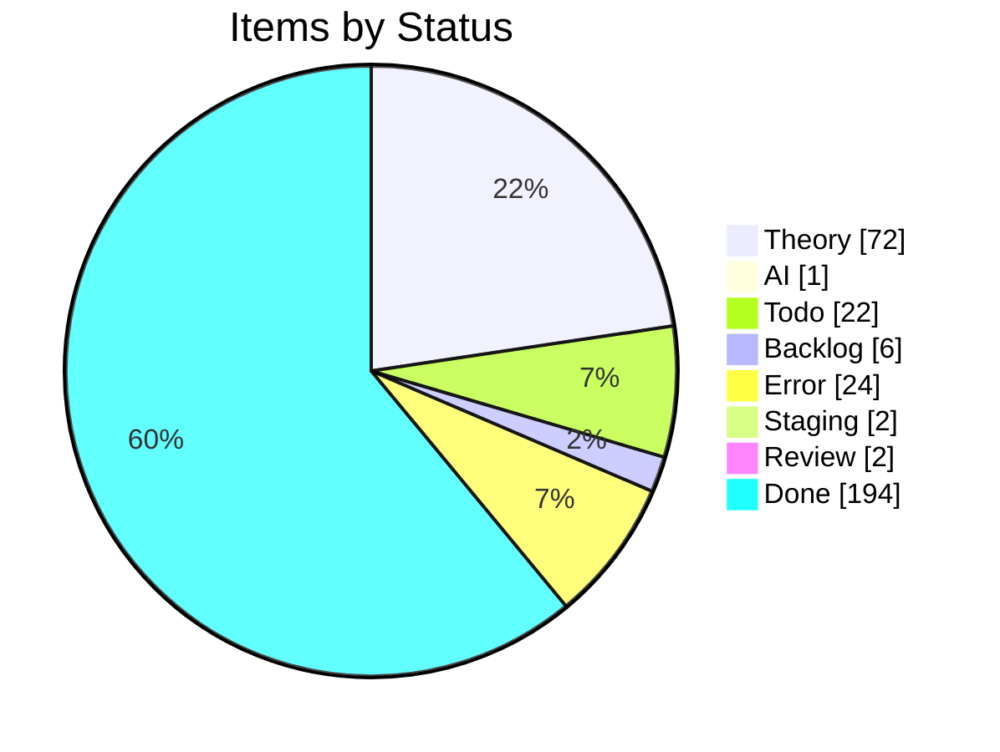
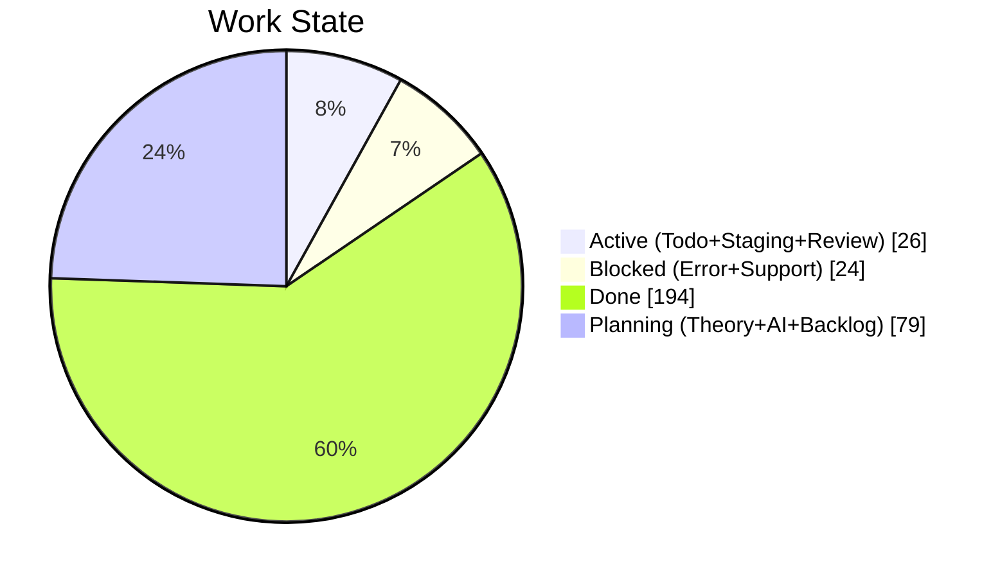
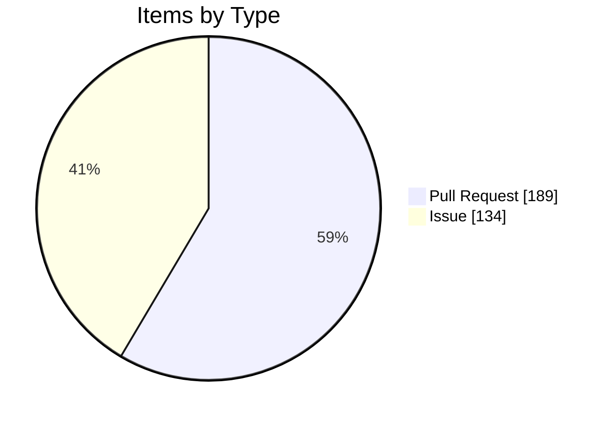

import { Card, CardGrid, Tabs, TabItem } from '@astrojs/starlight/components';

## Project Board Snapshot

:::note[Auto-generated]
Last synced: **2026-07-18T09:37:20.174Z** — updated daily by `ci-dashboard`.
Source: [KBVE Project Board](https://github.com/orgs/KBVE/projects/5)
:::

### Summary

<CardGrid>
  <Card title="Theory" icon="star">
    **72** items
  </Card>
  <Card title="AI" icon="rocket">
    **1** items
  </Card>
  <Card title="Todo" icon="list-format">
    **22** items
  </Card>
  <Card title="Backlog" icon="document">
    **6** items
  </Card>
  <Card title="Error" icon="warning">
    **24** items
  </Card>
  <Card title="Support" icon="information">
    **0** items
  </Card>
  <Card title="Staging" icon="setting">
    **2** items
  </Card>
  <Card title="Review" icon="approve-check">
    **2** items
  </Card>
  <Card title="Done" icon="approve-check-circle">
    **194** items
  </Card>
</CardGrid>

<Tabs>
  <TabItem label="Distribution">

  </TabItem>
  <TabItem label="Pipeline">

```mermaid
flowchart LR
    classDef planning fill:#8b5cf6,stroke:#6d28d9,color:#fff
    classDef active fill:#3b82f6,stroke:#1d4ed8,color:#fff
    classDef blocked fill:#ef4444,stroke:#b91c1c,color:#fff
    classDef done fill:#10b981,stroke:#059669,color:#fff
    Theory["Theory<br/><strong>72</strong>"]
    Theory --> AI
    AI["AI<br/><strong>1</strong>"]
    AI --> Todo
    Todo["Todo<br/><strong>22</strong>"]
    Todo --> Backlog
    Backlog["Backlog<br/><strong>6</strong>"]
    Backlog --> Error
    Error["Error<br/><strong>24</strong>"]
    Error --> Support
    Support["Support<br/><strong>0</strong>"]
    Support --> Staging
    Staging["Staging<br/><strong>2</strong>"]
    Staging --> Review
    Review["Review<br/><strong>2</strong>"]
    Review --> Done
    Done["Done<br/><strong>194</strong>"]
    class Theory,AI,Backlog planning
    class Todo,Staging,Review active
    class Error,Support blocked
    class Done done
```

:::tip[Legend]
**Purple** = Planning &nbsp; **Blue** = Active &nbsp; **Red** = Blocked &nbsp; **Green** = Done
:::

  </TabItem>
  <TabItem label="Breakdown">

#### Top Labels

| Label | Count |
|-------|:-----:|
| auto-pr | 189 |
| enhancement | 91 |
| dev→main | 86 |
| atomic | 72 |
| todo | 27 |
| bug | 27 |
| 0 | 15 |
| rust | 14 |
| 1 | 10 |
| unity | 8 |

  </TabItem>
</Tabs>

### Theory (72)

| # | Title | Priority | Assignees | Labels |
|---|-------|----------|-----------|--------|
| [#2252](https://github.com/KBVE/kbve/issues/2252) | [Concept] : Shop Layout - Merch, Hardware, Services. | — | — | 1, enhancement |
| [#4643](https://github.com/KBVE/kbve/issues/4643) | [Concept] : [Unity] : Transport System | — | h0lybyte | 0, enhancement, unity |
| [#5624](https://github.com/KBVE/kbve/issues/5624) | [Concept] : Add Intel NUC worker nodes to existing Talos KBVE cluster | — | h0lybyte, Copilot | 0, enhancement |
| [#6437](https://github.com/KBVE/kbve/issues/6437) | [Concept] : [Unity] : Pathfinding ECS | — | h0lybyte | 0, enhancement, unity |
| [#6438](https://github.com/KBVE/kbve/issues/6438) | [Concept] : [Unity] : ItemDB ECS Migration | — | h0lybyte | 0, enhancement, unity |
| [#6576](https://github.com/KBVE/kbve/issues/6576) | [Concept] : [Unity] : Entity Blittable System | — | h0lybyte | 0, enhancement, unity |
| [#7730](https://github.com/KBVE/kbve/issues/7730) | [DISCORDSH] Rust-First Vote Process — Rate-Limited Server Voting Pipeline | — | h0lybyte | 1, enhancement, security |
| [#7593](https://github.com/KBVE/kbve/issues/7593) | [PG] Deploy CNPG Pooler (PgBouncer) and migrate services from direct -rw connect | — | h0lybyte | 2, enhancement, dependencies |
| [#8180](https://github.com/KBVE/kbve/issues/8180) | [DISCORDSH] POC: Mockoon docker-compose for local E2E testing | — | h0lybyte | 1, enhancement |
| [#8245](https://github.com/KBVE/kbve/issues/8245) | perf(dashboard): migrate ClickHouse queries to @kbve/droid worker pipeline with  | — | — | 1, enhancement |
| [#9789](https://github.com/KBVE/kbve/issues/9789) | [Dashboard] Forgejo dashboard expansion — token scopes, user management, DB role | — | — | 3, enhancement, ci |
| [#9724](https://github.com/KBVE/kbve/issues/9724) | [ISOMETRIC] [BEVY] Convert sprite atlases from PNG to KTX2 with basis universal  | — | h0lybyte | 1, enhancement |
| [#9588](https://github.com/KBVE/kbve/issues/9588) | [ISOMETRIC] Pixel Smoothing | — | h0lybyte | 0, enhancement |
| [#9850](https://github.com/KBVE/kbve/issues/9850) | feat(mud): data population, IRC deployment, and isometric integration for MUD co | — | h0lybyte | 2, enhancement |
| [#8254](https://github.com/KBVE/kbve/issues/8254) | feat(unreal): CI/CD pipeline for UEDevOps plugin (itch.io + Fab) | — | h0lybyte | 2, enhancement |
| [#10194](https://github.com/KBVE/kbve/issues/10194) | [DISCORDSH] [BEVY] Key Integration Gaps | — | — | enhancement |
| [#10979](https://github.com/KBVE/kbve/issues/10979) | feat(wallet): khash marketplace bootstrap (5-phase roadmap) | — | — | enhancement |
| [#10980](https://github.com/KBVE/kbve/issues/10980) | isometric: upgrade Bevy 0.18 → 0.19 + wgpu 27 → 29 | — | — | enhancement |
| [#11244](https://github.com/KBVE/kbve/issues/11244) | [BEVY][ISOMETRIC] Refactor remaining menus to ui component library | — | — | enhancement |
| [#11246](https://github.com/KBVE/kbve/issues/11246) | [BEVY][ISOMETRIC] In-game chat overlay (incoming + outgoing) | — | — | enhancement |
| [#11247](https://github.com/KBVE/kbve/issues/11247) | [BEVY][ISOMETRIC] Toast styling pass — color accents + animations | — | — | enhancement |
| [#11262](https://github.com/KBVE/kbve/issues/11262) | feat(discordsh): /gh claim — Discord user self-assigns issue + KBVE profile link | — | — | enhancement |
| [#11294](https://github.com/KBVE/kbve/issues/11294) | feat(td-online): multiplayer tower defense — bevy+rapier2d sim, agones game serv | — | — | enhancement |
| [#11362](https://github.com/KBVE/kbve/issues/11362) | feat(astro-kbve,guild-vault): /dashboard/agents — multi-tenant bot management su | — | — | enhancement |
| [#11579](https://github.com/KBVE/kbve/issues/11579) | feat(laser): extract chat client into @kbve/laser for Phaser game embedding | — | — | enhancement |
| [#11580](https://github.com/KBVE/kbve/issues/11580) | feat(chat): proto + zod schema for ChatMessage envelope (bots, NOTICE, kinds) | — | — | enhancement |
| [#11582](https://github.com/KBVE/kbve/issues/11582) | harden(astro-irc): embed popup lifecycle + data-signin-url override | — | — | enhancement |
| [#11605](https://github.com/KBVE/kbve/issues/11605) | [isometric] WebGL2 fallback for browsers without WebGPU | — | — | 2, enhancement |
| [#12315](https://github.com/KBVE/kbve/issues/12315) | cryptothrone: zone-agnostic scenes + multi-area world model (city → world → town | — | — | enhancement |
| [#12360](https://github.com/KBVE/kbve/issues/12360) | cryptothrone: remaining scene/netcode abstraction layers (C8 + B4/B6) — successo | — | — | enhancement |
| [#12362](https://github.com/KBVE/kbve/issues/12362) | cryptothrone: playable as Discord Activity + standalone embed.js + itch (one mou | — | — | enhancement |
| [#12376](https://github.com/KBVE/kbve/issues/12376) | cryptothrone: ship to itch.io via embed.js (HTML5 build) — deferred after Discor | — | — | enhancement |
| [#12422](https://github.com/KBVE/kbve/issues/12422) | cryptothrone: decompose CloudCityScene into ECS systems over EntityStore (phased | — | — | enhancement |
| [#12484](https://github.com/KBVE/kbve/issues/12484) | [RN] [CRUX] Off Thread Networking | — | — | enhancement |
| [#12519](https://github.com/KBVE/kbve/issues/12519) | cryptothrone: render status effects on the client | — | — | enhancement |
| [#12520](https://github.com/KBVE/kbve/issues/12520) | cryptothrone: Discord Activity end-to-end verify + boot polish | — | — | enhancement |
| [#12522](https://github.com/KBVE/kbve/issues/12522) | [RN] OAuth integration (Discord / GitHub / Twitch) | — | — | enhancement |
| [#12531](https://github.com/KBVE/kbve/issues/12531) | cryptothrone: Discord activity-instance participant list → in-game lobby | — | — | enhancement |
| [#12533](https://github.com/KBVE/kbve/issues/12533) | cryptothrone: use openExternalLink for outbound links + encourageHardwareAcceler | — | — | enhancement |
| [#12532](https://github.com/KBVE/kbve/issues/12532) | cryptothrone: Discord Activity mobile layout (safe-area + layout-mode + orientat | — | — | enhancement |
| [#12692](https://github.com/KBVE/kbve/issues/12692) | jobboard: validate discipline_ids references at membership submit/approval | — | — | enhancement, security |
| [#12694](https://github.com/KBVE/kbve/issues/12694) | jobboard-web: validate API responses at runtime with the generated zod schemas | — | — | enhancement, good first issue |
| [#12693](https://github.com/KBVE/kbve/issues/12693) | jobboard: write audit_log entries on membership approve/reject | — | — | enhancement, good first issue |
| [#12695](https://github.com/KBVE/kbve/issues/12695) | jobboard: complete the gRPC envelope or retire the dead bytes-id membership mess | — | — | enhancement, rust |
| [#12703](https://github.com/KBVE/kbve/issues/12703) | cryptothrone: bring map/tile data into the ECS MapSystem (phased) | — | — | enhancement |
| [#12705](https://github.com/KBVE/kbve/issues/12705) | cryptothrone: Discord Activity mobile + lobby — real-device verification &amp; p | — | — | enhancement |
| [#12735](https://github.com/KBVE/kbve/issues/12735) | [Factorio] Remaining work — Agones server, factorio-ctl, telemetry, rotation (su | — | — | enhancement |
| [#12875](https://github.com/KBVE/kbve/issues/12875) | UE5 iOS CI/CD Pipeline | — | — | enhancement, todo, ios |
| [#12879](https://github.com/KBVE/kbve/issues/12879) | UE5 Android CI/CD Pipeline | — | — | enhancement, todo, android |
| [#12880](https://github.com/KBVE/kbve/issues/12880) | React Native Android CI/CD Pipeline | — | — | enhancement, todo, android |
| [#12915](https://github.com/KBVE/kbve/issues/12915) | Extend Longhorn filesystem-trim beyond Forgejo LFS volume (cluster-wide block re | — | — | enhancement |
| [#12924](https://github.com/KBVE/kbve/issues/12924) | feat(dashboard): per-app health + sync-history timeline (Argo) | — | — | enhancement |
| [#12925](https://github.com/KBVE/kbve/issues/12925) | feat(dashboard): collapse unchanged context in Argo Diff tab (hunk view) | — | — | enhancement |
| [#12926](https://github.com/KBVE/kbve/issues/12926) | feat(dashboard): Argo sync options — prune toggle + dry-run preview | — | — | enhancement |
| [#12927](https://github.com/KBVE/kbve/issues/12927) | feat(dashboard): selective resource sync from the Argo resource tree | — | — | enhancement |
| [#12928](https://github.com/KBVE/kbve/issues/12928) | feat(dashboard): deep-linkable Argo triage — persist filter/search/group in URL | — | — | enhancement |
| [#12929](https://github.com/KBVE/kbve/issues/12929) | feat(dashboard): bulk sync/refresh OutOfSync apps from the attention panel | — | — | enhancement |
| [#12930](https://github.com/KBVE/kbve/issues/12930) | feat(dashboard): rollback diff preview before confirm (Argo) | — | — | enhancement |
| [#12938](https://github.com/KBVE/kbve/issues/12938) | refactor(astro-kbve): shared collection-index util + typed API responses | — | — | enhancement, todo, npm |
| [#12939](https://github.com/KBVE/kbve/issues/12939) | perf(astro-kbve): precompute sitegraph at build instead of per-request | — | — | enhancement, todo, npm |
| [#13179](https://github.com/KBVE/kbve/issues/13179) | feat: Automate GitHub → Forgejo repository mirroring for kbve/kbve | — | — | enhancement |
| [#13194](https://github.com/KBVE/kbve/issues/13194) | [ROWS] Fix player-count reporting + auto spin-down of empty zone servers | — | — | enhancement |
| [#13350](https://github.com/KBVE/kbve/issues/13350) | ROWS deployment hardening: securityContext, KEDA decision, build-version cache,  | — | — | enhancement |
| [#13506](https://github.com/KBVE/kbve/issues/13506) | Epic: Kilobase Postgres 17.4→17.6 blue-green migration (v2 cluster cutover) | — | — | enhancement |
| [#13555](https://github.com/KBVE/kbve/issues/13555) | ROWS: populate charonmapinstance (in-world presence tracking) — admission travel | — | — | enhancement, backlog |
| [#13576](https://github.com/KBVE/kbve/issues/13576) | Epic: RentEarth Launcher (Unreal + Tauri) — PoC for the ChuckRPG Launcher | — | — | enhancement |
| [#13734](https://github.com/KBVE/kbve/issues/13734) | epic(desktop-kbve): first-class terminal — PTY + xterm.js, tmux control mode, ra | — | — | enhancement |
| [#13783](https://github.com/KBVE/kbve/issues/13783) | perf(simgrid): borrow WS client decode buffer instead of cloning per recv | — | — | enhancement, todo, rust |
| [#13786](https://github.com/KBVE/kbve/issues/13786) | perf(arpg): cache felled/harvested env-log tile sets instead of rebuilding per s | — | — | enhancement, todo, rust |
| [#13796](https://github.com/KBVE/kbve/issues/13796) | ARPG: server-side hotbar/spell loadout representation | — | — | enhancement |
| [#13801](https://github.com/KBVE/kbve/issues/13801) | ARPG: pet battle disconnect handling + vitals commit-back before real rosters en | — | — | enhancement |
| [#14132](https://github.com/KBVE/kbve/issues/14132) | [FEATURE] /wm — generic Windmill job runner in discordsh (replaces dead /n8n) | — | — | enhancement |

### AI (1)

| # | Title | Priority | Assignees | Labels |
|---|-------|----------|-----------|--------|
| [#4906](https://github.com/KBVE/kbve/issues/4906) | [Bug] : [Unity] : Character Orchestrator | — | h0lybyte | 0, bug, unity |

### Todo (22)

| # | Title | Priority | Assignees | Labels |
|---|-------|----------|-----------|--------|
| [#3572](https://github.com/KBVE/kbve/issues/3572) | [Update] : [Fudster] : User Billing &amp; Auth | — | h0lybyte | 1, security, update |
| [#4232](https://github.com/KBVE/kbve/issues/4232) | [Update] : [Github] : Rotate Tokens + Refactor Permissions | — | h0lybyte | 1, security, update |
| [#6939](https://github.com/KBVE/kbve/issues/6939) | [EPIC] Agent Orchestration Tab | — | — | 0, todo |
| [#8134](https://github.com/KBVE/kbve/issues/8134) | feat(proto): ClickHouse schema source of truth via protobuf → zod → vector pipel | — | h0lybyte | 4, documentation, todo |
| [#8148](https://github.com/KBVE/kbve/issues/8148) | [PSQL] Audit Discord Public Server Listing Functions | — | h0lybyte | 3, security, todo |
| [#8817](https://github.com/KBVE/kbve/issues/8817) | [E2E] kilobase needs pgrx/PostgreSQL build environment | — | h0lybyte | 1, todo |
| [#11013](https://github.com/KBVE/kbve/issues/11013) | [CICD] [Github] Migrate workflows to arc-runner-set-kbve + strip apt-install ban | — | — | enhancement, update |
| [#12931](https://github.com/KBVE/kbve/issues/12931) | perf(axum-kbve): hash JWT cache keys instead of storing raw token strings | — | — | enhancement, todo, rust |
| [#12932](https://github.com/KBVE/kbve/issues/12932) | perf(axum-kbve): zero-copy proxy hot path (borrow query/headers, avoid per-reque | — | — | enhancement, todo, rust |
| [#12933](https://github.com/KBVE/kbve/issues/12933) | perf(axum-kbve): tighten borrow scopes — pass &amp;TokenInfo, drop redundant Arc | — | — | enhancement, todo, rust |
| [#12934](https://github.com/KBVE/kbve/issues/12934) | perf(axum-kbve): serialize marketplace enums as &amp;'static str instead of per- | — | — | enhancement, todo, rust |
| [#12935](https://github.com/KBVE/kbve/issues/12935) | perf(astro-kbve): add Cache-Control headers to data/game API endpoints | — | — | enhancement, todo, npm |
| [#12936](https://github.com/KBVE/kbve/issues/12936) | perf(astro-kbve): audit island hydration — reduce client:only, defer off-viewpor | — | — | enhancement, todo, npm |
| [#12937](https://github.com/KBVE/kbve/issues/12937) | refactor(astro-kbve): split 3163-line AskamaProfileProvider into subcomponents | — | — | enhancement, todo, npm |
| [#13121](https://github.com/KBVE/kbve/issues/13121) | [LOW] Deprecated external-secrets.io/v1beta1 on new ES/SecretStore objects | — | — | update |
| [#13751](https://github.com/KBVE/kbve/issues/13751) | verify(rentearth): slime navmesh pathing after region PMC nav removal (#13735) | — | — | todo, ue |
| [#13752](https://github.com/KBVE/kbve/issues/13752) | chore(rentearth): gate debug glass-slime spawn in chuckCorePlayerController | — | — | todo, ue |
| [#13753](https://github.com/KBVE/kbve/issues/13753) | perf(rentearth): grass follow-up — DensityScale 3.5 tuning + streamer pool valid | — | — | todo, ue |
| [#13754](https://github.com/KBVE/kbve/issues/13754) | tooling(unreal): detect stale Engine/Plugins/Marketplace copies shadowing repo K | — | — | todo, ue |
| [#13785](https://github.com/KBVE/kbve/issues/13785) | perf(arpg): reuse Local scratch buffers in creature stream systems | — | — | enhancement, todo, rust |
| [#13787](https://github.com/KBVE/kbve/issues/13787) | perf(axum-kbve): borrow auth token via Cow in extract_auth_token | — | — | enhancement, todo, rust |
| [#13789](https://github.com/KBVE/kbve/issues/13789) | [EPIC] ARPG character persistence — Supabase item ledger + tokio write-behind | — | — | enhancement, todo, rust |

### Backlog (6)

| # | Title | Priority | Assignees | Labels |
|---|-------|----------|-----------|--------|
| [#75](https://github.com/KBVE/kbve/issues/75) | [Concept] : HerbMail.com - Front Page | — | — | 1, backlog |
| [#96](https://github.com/KBVE/kbve/issues/96) | [Concept] : [Backend] : Charles. | — | h0lybyte | 0, backlog |
| [#4642](https://github.com/KBVE/kbve/issues/4642) | [Concept] : [Unity] : Droid System - Hybrid NPC System. | — | h0lybyte | 0, enhancement, backlog |
| [#7548](https://github.com/KBVE/kbve/issues/7548) | feat(memes): responsive bento grid feed + dedicated meme pages | — | h0lybyte | 1, backlog |
| [#11250](https://github.com/KBVE/kbve/issues/11250) | feat(ci-dbmate-deploy): bake migrations into OCI image for cap-free deploys | — | — | enhancement, backlog |
| [#13556](https://github.com/KBVE/kbve/issues/13556) | ROWS: server-authoritative zone travel + anti-teleport (client-supplied zone hon | — | — | security, backlog |

### Error (24)

| # | Title | Priority | Assignees | Labels |
|---|-------|----------|-----------|--------|
| [#2992](https://github.com/KBVE/kbve/issues/2992) | [Bug] LofiFocus is down - [PENDING] Ingress | — | h0lybyte | 0, bug |
| [#3536](https://github.com/KBVE/kbve/issues/3536) | [Bug] : Update CONTRIBUE.MD | — | h0lybyte | 0, bug |
| [#3538](https://github.com/KBVE/kbve/issues/3538) | [Bug] : [Unity] : Gameplay Mechanics - Farming &amp; Crafting | — | h0lybyte | 0, bug, unity |
| [#6705](https://github.com/KBVE/kbve/issues/6705) | [Bug] : [Unity] : Chip Character Sheet Off Center Sprites | — | h0lybyte | 0, bug, unity |
| [#9182](https://github.com/KBVE/kbve/issues/9182) | [ROWS] Performance Audit — missing indexes, unbounded caches, query optimization | — | h0lybyte | 6, bug, enhancement |
| [#9205](https://github.com/KBVE/kbve/issues/9205) | feat(rows): pass zone instance ID to allocated game servers + unify launcher arc | — | h0lybyte | 2, bug |
| [#8815](https://github.com/KBVE/kbve/issues/8815) | [E2E] bevy_* projects need Rust + wasm32 toolchain in CI | — | h0lybyte | 0, bug, ci |
| [#13082](https://github.com/KBVE/kbve/issues/13082) | [CRITICAL] CNPG bootstrap: recovery left on live cluster under Argo auto-prune | — | — | bug |
| [#13085](https://github.com/KBVE/kbve/issues/13085) | [HIGH] Modrinth pipeline will be pruned on merge | — | — | bug |
| [#13097](https://github.com/KBVE/kbve/issues/13097) | [HIGH] CNPG primaryUpdateStrategy left commented (defaults to unsupervised) | — | — | bug |
| [#13099](https://github.com/KBVE/kbve/issues/13099) | [HIGH] Vector ClickHouse sinks use in-memory buffers | — | — | bug |
| [#13103](https://github.com/KBVE/kbve/issues/13103) | [MEDIUM] No probes on four public services (herbmail/memes/rentearth/cityvote) | — | — | bug |
| [#13096](https://github.com/KBVE/kbve/issues/13096) | [CRITICAL/verify] Agones health enabled on rows-tenant fleets | — | — | bug |
| [#13101](https://github.com/KBVE/kbve/issues/13101) | [MEDIUM] discordsh-bot liveness/readiness probe paths disagree | — | — | bug |
| [#13098](https://github.com/KBVE/kbve/issues/13098) | [HIGH] Valkey metrics scrape will be dead — monitoring ns not in allowlist | — | — | bug |
| [#13105](https://github.com/KBVE/kbve/issues/13105) | [MEDIUM] --appendonly yes on emptyDir (rows valkey) | — | — | bug |
| [#13112](https://github.com/KBVE/kbve/issues/13112) | [MEDIUM] agones rows-tenants secret-name prefix drift (ows- vs rows-) | — | — | bug |
| [#13108](https://github.com/KBVE/kbve/issues/13108) | [MEDIUM] supabase-service-key property-name conflict (hash vs key) | — | — | bug |
| [#13104](https://github.com/KBVE/kbve/issues/13104) | [MEDIUM] Factorio rotation cronjob deletes server every 2 minutes | — | — | bug |
| [#13116](https://github.com/KBVE/kbve/issues/13116) | [LOW] Orphaned ReferenceGrant in rows ns | — | — | bug |
| [#13113](https://github.com/KBVE/kbve/issues/13113) | [MEDIUM] rabbitmq RoleBinding omits rows-chuckrpg-prod | — | — | bug |
| [#13119](https://github.com/KBVE/kbve/issues/13119) | [LOW] Cilium API-version skew (v2alpha1 L2 policy vs v2 pool) | — | — | bug |
| [#14008](https://github.com/KBVE/kbve/issues/14008) | ROWS fleet-restart (#13575) — audit follow-ups &amp; pre-enablement gates | — | — | bug, security |
| [#14234](https://github.com/KBVE/kbve/issues/14234) | windmill-sync.yml fails at `workspace add` — Credentials or instance is invalid  | — | — | bug |

### Staging (2)

| # | Title | Priority | Assignees | Labels |
|---|-------|----------|-----------|--------|
| [#2208](https://github.com/KBVE/kbve/issues/2208) | [Concept] Service Page Enchancemnts | — | h0lybyte, dladeira | 4 |
| [#6943](https://github.com/KBVE/kbve/issues/6943) | Phase 2: Frontend - Orchestration Tab | — | — | todo |

### Review (2)

| # | Title | Priority | Assignees | Labels |
|---|-------|----------|-----------|--------|
| [#13278](https://github.com/KBVE/kbve/pull/13278) | Atomic: ue ramdisk spec | — | — | auto-pr, atomic |
| [#13572](https://github.com/KBVE/kbve/pull/13572) | Atomic: bump mdx spec | — | — | auto-pr, atomic |

### Done (194)

| # | Title | Priority | Assignees | Labels |
|---|-------|----------|-----------|--------|
| [#12495](https://github.com/KBVE/kbve/issues/12495) | [RN] [WEB] Reuse React Native components on web via react-native-web + Astro | — | — | enhancement |
| [#13102](https://github.com/KBVE/kbve/issues/13102) | [MEDIUM] n8n PDB blocks node drains (minAvailable:1 on replicas:1) | — | — | bug |
| [#13109](https://github.com/KBVE/kbve/issues/13109) | [MEDIUM] LB VIP 142.132.206.74 dropped from the pool | — | — | bug |
| [#13275](https://github.com/KBVE/kbve/pull/13275) | Atomic: valkey harden | — | — | auto-pr, atomic |
| [#13351](https://github.com/KBVE/kbve/issues/13351) | Upgrade astro-kbve to Astro 7 (build-speed: markdown/MDX-heavy static site) | — | — | enhancement |
| [#13575](https://github.com/KBVE/kbve/pull/13575) | Atomic: rows drain fleet plan fix | — | — | auto-pr, atomic |
| [#13784](https://github.com/KBVE/kbve/issues/13784) | perf(simgrid): Bytes-backed EncodedFrame to avoid per-writer buffer copy | — | — | enhancement, todo, rust |
| [#13844](https://github.com/KBVE/kbve/pull/13844) | Release: 1 chore → Main | — | — | auto-pr, dev→main |
| [#13845](https://github.com/KBVE/kbve/pull/13845) | Release: 2 chores → Main | — | — | auto-pr, dev→main |
| [#13848](https://github.com/KBVE/kbve/pull/13848) | chore(dashboard): daily sync — 2026-07-04 | — | — | auto-pr |
| [#13849](https://github.com/KBVE/kbve/pull/13849) | Release: 2 features, 1 fix, 1 build, 1 chore → Main | — | — | auto-pr, dev→main |
| [#13855](https://github.com/KBVE/kbve/pull/13855) | Atomic: chisel-ubuntu-axum v24.04.10 post-publish sync | — | — | auto-pr, atomic |
| [#13856](https://github.com/KBVE/kbve/pull/13856) | Release: 1 feature, 2 fixes, 1 CI, 2 chores → Main | — | — | auto-pr, dev→main |
| [#13857](https://github.com/KBVE/kbve/pull/13857) | Atomic: irc-gateway v0.1.28 post-publish sync | — | — | auto-pr, atomic |
| [#13862](https://github.com/KBVE/kbve/pull/13862) | Atomic: axum-kbve v1.0.221 post-publish sync | — | — | auto-pr, atomic |
| [#13863](https://github.com/KBVE/kbve/pull/13863) | Release: 1 chore → Main | — | — | auto-pr, dev→main |
| [#13865](https://github.com/KBVE/kbve/pull/13865) | Release: 2 features, 1 fix, 1 chore → Main | — | — | auto-pr, dev→main |
| [#13867](https://github.com/KBVE/kbve/pull/13867) | Release: 2 features, 3 docs, 2 chores → Main | — | — | auto-pr, dev→main |
| [#13868](https://github.com/KBVE/kbve/pull/13868) | Atomic: axum-kbve v1.0.222 post-publish sync | — | — | auto-pr, atomic |
| [#13869](https://github.com/KBVE/kbve/pull/13869) | Atomic: axum-kbve v1.0.223 post-publish sync | — | — | auto-pr, atomic |
| [#13870](https://github.com/KBVE/kbve/pull/13870) | Release: 1 chore → Main | — | — | auto-pr, dev→main |
| [#13871](https://github.com/KBVE/kbve/pull/13871) | chore(dashboard): daily sync — 2026-07-05 | — | — | auto-pr |
| [#13873](https://github.com/KBVE/kbve/pull/13873) | Release: 2 fixes, 3 chores → Main | — | — | auto-pr, dev→main |
| [#13877](https://github.com/KBVE/kbve/pull/13877) | Release: 7 commits → Main | — | — | auto-pr, dev→main |
| [#13878](https://github.com/KBVE/kbve/pull/13878) | Release: 1 chore → Main | — | — | auto-pr, dev→main |
| [#13879](https://github.com/KBVE/kbve/pull/13879) | Atomic: axum-kbve v1.0.224 post-publish sync | — | — | auto-pr, atomic |
| [#13882](https://github.com/KBVE/kbve/pull/13882) | Release: 2 features, 1 fix, 2 docs, 1 chore → Main | — | — | auto-pr, dev→main |
| [#13887](https://github.com/KBVE/kbve/pull/13887) | Atomic: axum-kbve v1.0.225 post-publish sync | — | — | auto-pr, atomic |
| [#13888](https://github.com/KBVE/kbve/pull/13888) | Release: 1 chore → Main | — | — | auto-pr, dev→main |
| [#13892](https://github.com/KBVE/kbve/pull/13892) | Release: 1 chore → Main | — | — | auto-pr, dev→main |
| [#13894](https://github.com/KBVE/kbve/pull/13894) | chore(dashboard): daily sync — 2026-07-06 | — | — | auto-pr |
| [#13896](https://github.com/KBVE/kbve/pull/13896) | Atomic: axum-kbve v1.0.226 post-publish sync | — | — | auto-pr, atomic |
| [#13897](https://github.com/KBVE/kbve/pull/13897) | Release: 1 feature, 1 chore → Main | — | — | auto-pr, dev→main |
| [#13898](https://github.com/KBVE/kbve/pull/13898) | Release: 2 features, 1 fix, 1 chore → Main | — | — | auto-pr, dev→main |
| [#13904](https://github.com/KBVE/kbve/pull/13904) | Atomic: arpg-web v0.1.25 post-publish sync | — | — | auto-pr, atomic |
| [#13905](https://github.com/KBVE/kbve/pull/13905) | Atomic: arpg-server v0.1.25 post-publish sync | — | — | auto-pr, atomic |
| [#13906](https://github.com/KBVE/kbve/pull/13906) | Release: 1 fix, 1 CI, 3 chores → Main | — | — | auto-pr, dev→main |
| [#13907](https://github.com/KBVE/kbve/pull/13907) | chore(dashboard): daily sync — 2026-07-07 | — | — | auto-pr |
| [#13910](https://github.com/KBVE/kbve/pull/13910) | Atomic: axum-kbve v1.0.227 post-publish sync | — | — | auto-pr, atomic |
| [#13911](https://github.com/KBVE/kbve/pull/13911) | Release: 1 chore → Main | — | — | auto-pr, dev→main |
| [#13913](https://github.com/KBVE/kbve/pull/13913) | Release: 3 features, 5 fixes, 1 doc, 1 perf, 2 builds, 3 chores → Main | — | — | auto-pr, dev→main |
| [#13920](https://github.com/KBVE/kbve/pull/13920) | Atomic: axum-kbve v1.0.228 post-publish sync | — | — | auto-pr, atomic |
| [#13921](https://github.com/KBVE/kbve/pull/13921) | Release: 1 chore → Main | — | — | auto-pr, dev→main |
| [#13922](https://github.com/KBVE/kbve/pull/13922) | Atomic: modrinth secret | — | — | auto-pr, atomic |
| [#13923](https://github.com/KBVE/kbve/pull/13923) | Release: 1 feature → Main | — | — | auto-pr, dev→main |
| [#13924](https://github.com/KBVE/kbve/pull/13924) | Atomic: modrinth mint | — | — | auto-pr, atomic |
| [#13925](https://github.com/KBVE/kbve/pull/13925) | Atomic: mc bump | — | — | auto-pr, atomic |
| [#13926](https://github.com/KBVE/kbve/pull/13926) | Release: 1 commit → Main | — | — | auto-pr, dev→main |
| [#13928](https://github.com/KBVE/kbve/pull/13928) | Atomic: mc bump | — | — | auto-pr, atomic |
| [#13929](https://github.com/KBVE/kbve/pull/13929) | Release: 1 commit → Main | — | — | auto-pr, dev→main |
| [#13930](https://github.com/KBVE/kbve/pull/13930) | Atomic: mc v1.0.59 post-publish sync | — | — | auto-pr, atomic |
| [#13931](https://github.com/KBVE/kbve/pull/13931) | Release: 1 chore → Main | — | — | auto-pr, dev→main |
| [#13932](https://github.com/KBVE/kbve/pull/13932) | Atomic: mc mint fix | — | — | auto-pr, atomic |
| [#13933](https://github.com/KBVE/kbve/pull/13933) | Release: 1 fix → Main | — | — | auto-pr, dev→main |
| [#13934](https://github.com/KBVE/kbve/pull/13934) | Atomic: mc v1.0.60 post-publish sync | — | — | auto-pr, atomic |
| [#13936](https://github.com/KBVE/kbve/pull/13936) | Release: 1 fix, 1 chore → Main | — | — | auto-pr, dev→main |
| [#13937](https://github.com/KBVE/kbve/pull/13937) | Atomic: mc mint python | — | — | auto-pr, atomic |
| [#13938](https://github.com/KBVE/kbve/pull/13938) | Atomic: mc v1.0.61 post-publish sync | — | — | auto-pr, atomic |
| [#13939](https://github.com/KBVE/kbve/pull/13939) | Release: 1 fix, 1 chore → Main | — | — | auto-pr, dev→main |
| [#13940](https://github.com/KBVE/kbve/pull/13940) | Atomic: mc server id | — | — | auto-pr, atomic |
| [#13941](https://github.com/KBVE/kbve/pull/13941) | Atomic: mc v1.0.62 post-publish sync | — | — | auto-pr, atomic |
| [#13942](https://github.com/KBVE/kbve/pull/13942) | Release: 1 chore → Main | — | — | auto-pr, dev→main |
| [#13947](https://github.com/KBVE/kbve/pull/13947) | Release: 2 chores → Main | — | — | auto-pr, dev→main |
| [#13948](https://github.com/KBVE/kbve/pull/13948) | chore(dashboard): daily sync — 2026-07-08 | — | — | auto-pr |
| [#13949](https://github.com/KBVE/kbve/pull/13949) | Release: 5 features, 2 fixes, 1 chore → Main | — | — | auto-pr, dev→main |
| [#13952](https://github.com/KBVE/kbve/pull/13952) | deploy(isometric): update WASM build | — | — | auto-pr |
| [#13959](https://github.com/KBVE/kbve/pull/13959) | Atomic: kbve-gate v0.1.8 post-publish sync | — | — | auto-pr, atomic |
| [#13960](https://github.com/KBVE/kbve/pull/13960) | Release: 1 feature, 1 fix, 1 chore → Main | — | — | auto-pr, dev→main |
| [#13963](https://github.com/KBVE/kbve/pull/13963) | Atomic: mc v1.0.63 post-publish sync | — | — | auto-pr, atomic |
| [#13964](https://github.com/KBVE/kbve/pull/13964) | Release: 1 chore → Main | — | — | auto-pr, dev→main |
| [#13965](https://github.com/KBVE/kbve/pull/13965) | Release: 1 chore → Main | — | — | auto-pr, dev→main |
| [#13967](https://github.com/KBVE/kbve/pull/13967) | Atomic: axum-kbve v1.0.229 post-publish sync | — | — | auto-pr, atomic |
| [#13968](https://github.com/KBVE/kbve/pull/13968) | Release: 1 chore → Main | — | — | auto-pr, dev→main |
| [#13969](https://github.com/KBVE/kbve/pull/13969) | Release: 1 feature, 1 doc, 2 chores → Main | — | — | auto-pr, dev→main |
| [#13970](https://github.com/KBVE/kbve/pull/13970) | Atomic: arpg-web v0.1.26 post-publish sync | — | — | auto-pr, atomic |
| [#13971](https://github.com/KBVE/kbve/pull/13971) | Release: 3 chores → Main | — | — | auto-pr, dev→main |
| [#13972](https://github.com/KBVE/kbve/pull/13972) | Atomic: arpg-server v0.1.26 post-publish sync | — | — | auto-pr, atomic |
| [#13973](https://github.com/KBVE/kbve/pull/13973) | Atomic: mc v1.0.64 post-publish sync | — | — | auto-pr, atomic |
| [#13974](https://github.com/KBVE/kbve/pull/13974) | Release: 2 features, 1 CI, 1 chore → Main | — | — | auto-pr, dev→main |
| [#13979](https://github.com/KBVE/kbve/pull/13979) | Release: 1 feature → Main | — | — | auto-pr, dev→main |
| [#13981](https://github.com/KBVE/kbve/pull/13981) | Release: 4 features, 3 fixes, 3 chores → Main | — | — | auto-pr, dev→main |
| [#13982](https://github.com/KBVE/kbve/pull/13982) | chore(dashboard): daily sync — 2026-07-09 | — | — | auto-pr |
| [#13985](https://github.com/KBVE/kbve/pull/13985) | Atomic: arpg-server v0.1.27 post-publish sync | — | — | auto-pr, atomic |
| [#13986](https://github.com/KBVE/kbve/pull/13986) | Release: 6 features, 2 CI, 3 chores → Main | — | — | auto-pr, dev→main |
| [#13989](https://github.com/KBVE/kbve/pull/13989) | Atomic: arpg-web v0.1.27 post-publish sync | — | — | auto-pr, atomic |
| [#13992](https://github.com/KBVE/kbve/pull/13992) | Atomic: axum-kbve v1.0.230 post-publish sync | — | — | auto-pr, atomic |
| [#13993](https://github.com/KBVE/kbve/pull/13993) | Release: 11 features, 4 fixes, 1 chore → Main | — | — | auto-pr, dev→main |
| [#14009](https://github.com/KBVE/kbve/pull/14009) | Release: 4 features, 2 fixes → Main | — | — | auto-pr, dev→main |
| [#14012](https://github.com/KBVE/kbve/pull/14012) | Atomic: mc v1.0.66 post-publish sync | — | — | auto-pr, atomic |
| [#14013](https://github.com/KBVE/kbve/pull/14013) | Release: 2 features, 1 fix, 1 doc, 2 chores → Main | — | — | auto-pr, dev→main |
| [#14015](https://github.com/KBVE/kbve/pull/14015) | chore(dashboard): daily sync — 2026-07-10 | — | — | auto-pr |
| [#14016](https://github.com/KBVE/kbve/pull/14016) | Atomic: rows v0.1.38 post-publish sync | — | — | auto-pr, atomic |
| [#14017](https://github.com/KBVE/kbve/pull/14017) | Release: 8 features, 4 fixes, 1 doc, 4 chores → Main | — | — | auto-pr, dev→main |
| [#14019](https://github.com/KBVE/kbve/pull/14019) | chore(dashboard): daily sync — 2026-07-11 | — | — | auto-pr |
| [#14022](https://github.com/KBVE/kbve/pull/14022) | Atomic: edge v0.1.47 post-publish sync | — | — | auto-pr, atomic |
| [#14023](https://github.com/KBVE/kbve/pull/14023) | Release: 1 feature, 5 chores → Main | — | — | auto-pr, dev→main |
| [#14024](https://github.com/KBVE/kbve/pull/14024) | Atomic: mc-velocity v1.1.11 post-publish sync | — | — | auto-pr, atomic |
| [#14025](https://github.com/KBVE/kbve/pull/14025) | Atomic: mc-lobby v1.0.11 post-publish sync | — | — | auto-pr, atomic |
| [#14026](https://github.com/KBVE/kbve/pull/14026) | Atomic: mc v1.0.67 post-publish sync | — | — | auto-pr, atomic |
| [#14027](https://github.com/KBVE/kbve/pull/14027) | Atomic: axum-kbve v1.0.231 post-publish sync | — | — | auto-pr, atomic |
| [#14029](https://github.com/KBVE/kbve/pull/14029) | Release: 4 features, 1 fix, 2 perfs, 2 refactors → Main | — | — | auto-pr, dev→main |
| [#14030](https://github.com/KBVE/kbve/pull/14030) | chore(dashboard): daily sync — 2026-07-12 | — | — | auto-pr |
| [#14031](https://github.com/KBVE/kbve/pull/14031) | Release: 3 features, 2 fixes, 1 doc, 1 perf, 1 refactor, 1 chore → Main | — | — | auto-pr, dev→main |
| [#14032](https://github.com/KBVE/kbve/pull/14032) | Release: 1 fix, 1 perf, 1 test, 1 chore → Main | — | — | auto-pr, dev→main |
| [#14038](https://github.com/KBVE/kbve/pull/14038) | chore(dashboard): daily sync — 2026-07-13 | — | — | auto-pr |
| [#14039](https://github.com/KBVE/kbve/pull/14039) | Release: 4 features, 3 fixes, 1 doc, 5 chores → Main | — | — | auto-pr, dev→main |
| [#14044](https://github.com/KBVE/kbve/pull/14044) | Release: 1 feature, 2 fixes, 1 CI, 4 chores → Main | — | — | auto-pr, dev→main |
| [#14054](https://github.com/KBVE/kbve/pull/14054) | Release: 5 features, 7 fixes, 2 docs, 1 CI, 5 chores → Main | — | — | auto-pr, dev→main |
| [#14055](https://github.com/KBVE/kbve/pull/14055) | chore(bevy_chat): update version.toml to 0.1.0 | — | — | auto-pr |
| [#14057](https://github.com/KBVE/kbve/pull/14057) | chore(bevy_db): update version.toml to 0.1.0 | — | — | auto-pr |
| [#14060](https://github.com/KBVE/kbve/pull/14060) | chore(bevy_kbve_net): update version.toml to 0.1.0 | — | — | auto-pr |
| [#14061](https://github.com/KBVE/kbve/pull/14061) | deploy(isometric): update WASM build | — | — | auto-pr |
| [#14068](https://github.com/KBVE/kbve/pull/14068) | Atomic: herbmail-game v0.1.2 post-publish sync | — | — | auto-pr, atomic |
| [#14070](https://github.com/KBVE/kbve/pull/14070) | chore(bevy_supa): update version.toml to 0.1.0 | — | — | auto-pr |
| [#14071](https://github.com/KBVE/kbve/pull/14071) | chore(bevy_statemachine): update version.toml to 0.1.0 | — | — | auto-pr |
| [#14072](https://github.com/KBVE/kbve/pull/14072) | chore(bevy_player): update version.toml to 0.1.0 | — | — | auto-pr |
| [#14073](https://github.com/KBVE/kbve/pull/14073) | Release: 1 feature, 2 fixes, 8 chores → Main | — | — | auto-pr, dev→main |
| [#14075](https://github.com/KBVE/kbve/pull/14075) | chore(bevy_cam): update version.toml to 0.1.0 | — | — | auto-pr |
| [#14078](https://github.com/KBVE/kbve/pull/14078) | Atomic: herbmail-game v0.1.3 post-publish sync | — | — | auto-pr, atomic |
| [#14079](https://github.com/KBVE/kbve/pull/14079) | Release: 2 features, 2 fixes, 4 chores → Main | — | — | auto-pr, dev→main |
| [#14080](https://github.com/KBVE/kbve/pull/14080) | chore(bevy_quests): update version.toml to 0.1.0 | — | — | auto-pr |
| [#14081](https://github.com/KBVE/kbve/pull/14081) | chore(bevy_items): update version.toml to 0.1.0 | — | — | auto-pr |
| [#14085](https://github.com/KBVE/kbve/pull/14085) | Release: 1 feature, 2 fixes, 1 refactor, 4 chores → Main | — | — | auto-pr, dev→main |
| [#14086](https://github.com/KBVE/kbve/pull/14086) | chore(bevy_spells): update version.toml to 0.1.0 | — | — | auto-pr |
| [#14087](https://github.com/KBVE/kbve/pull/14087) | Atomic: axum-kbve v1.0.232 post-publish sync | — | — | auto-pr, atomic |
| [#14090](https://github.com/KBVE/kbve/pull/14090) | Release: 7 features, 1 fix, 3 chores → Main | — | — | auto-pr, dev→main |
| [#14093](https://github.com/KBVE/kbve/pull/14093) | Atomic: herbmail-game v0.1.5 post-publish sync | — | — | auto-pr, atomic |
| [#14094](https://github.com/KBVE/kbve/pull/14094) | Release: 4 features, 1 fix, 2 chores → Main | — | — | auto-pr, dev→main |
| [#14097](https://github.com/KBVE/kbve/pull/14097) | Atomic: herbmail-game v0.1.6 post-publish sync | — | — | auto-pr, atomic |
| [#14098](https://github.com/KBVE/kbve/pull/14098) | Release: 24 features, 14 fixes, 6 docs, 2 perfs, 5 chores → Main | — | — | auto-pr, dev→main |
| [#14099](https://github.com/KBVE/kbve/pull/14099) | Atomic: axum-kbve v1.0.233 post-publish sync | — | — | auto-pr, atomic |
| [#14104](https://github.com/KBVE/kbve/pull/14104) | chore(dashboard): daily sync — 2026-07-14 | — | — | auto-pr |
| [#14114](https://github.com/KBVE/kbve/pull/14114) | Release: 2 features, 1 doc, 2 chores → Main | — | — | auto-pr, dev→main |
| [#14115](https://github.com/KBVE/kbve/pull/14115) | Atomic: herbmail-game v0.1.7 post-publish sync | — | — | auto-pr, atomic |
| [#14118](https://github.com/KBVE/kbve/pull/14118) | Atomic: axum-kbve v1.0.234 post-publish sync | — | — | auto-pr, atomic |
| [#14119](https://github.com/KBVE/kbve/pull/14119) | Release: 2 features, 1 fix, 2 chores → Main | — | — | auto-pr, dev→main |
| [#14120](https://github.com/KBVE/kbve/pull/14120) | Atomic: herbmail-game v0.1.8 post-publish sync | — | — | auto-pr, atomic |
| [#14121](https://github.com/KBVE/kbve/pull/14121) | Release: 5 features, 4 fixes, 1 doc, 3 perfs, 5 chores → Main | — | — | auto-pr, dev→main |
| [#14122](https://github.com/KBVE/kbve/pull/14122) | Atomic: aria2-proxy v0.1.1 post-publish sync | — | — | auto-pr, atomic |
| [#14124](https://github.com/KBVE/kbve/pull/14124) | chore(dashboard): daily sync — 2026-07-15 | — | — | auto-pr |
| [#14126](https://github.com/KBVE/kbve/issues/14126) | [LOW] Add app-layer auth to Vector alertmanager webhook (:9002) | — | — | enhancement, security |
| [#14127](https://github.com/KBVE/kbve/pull/14127) | Release: 5 features, 6 fixes, 2 docs, 1 refactor, 3 chores → Main | — | — | auto-pr, dev→main |
| [#14128](https://github.com/KBVE/kbve/pull/14128) | Atomic: herbmail-game v0.1.9 post-publish sync | — | — | auto-pr, atomic |
| [#14131](https://github.com/KBVE/kbve/issues/14131) | [EPIC] Decommission n8n — migrate to Windmill | — | — | enhancement |
| [#14141](https://github.com/KBVE/kbve/pull/14141) | Atomic: kbve-kubectl v0.1.6 post-publish sync | — | — | auto-pr, atomic |
| [#14142](https://github.com/KBVE/kbve/pull/14142) | Release: 1 chore → Main | — | — | auto-pr, dev→main |
| [#14143](https://github.com/KBVE/kbve/pull/14143) | Release: 2 fixes, 1 doc → Main | — | — | auto-pr, dev→main |
| [#14148](https://github.com/KBVE/kbve/pull/14148) | Release: 1 fix, 1 chore → Main | — | — | auto-pr, dev→main |
| [#14150](https://github.com/KBVE/kbve/pull/14150) | Atomic: axum-kbve v1.0.235 post-publish sync | — | — | auto-pr, atomic |
| [#14151](https://github.com/KBVE/kbve/pull/14151) | Atomic: kasm-void v0.0.6 post-publish sync | — | — | auto-pr, atomic |
| [#14152](https://github.com/KBVE/kbve/pull/14152) | Release: 1 chore → Main | — | — | auto-pr, dev→main |
| [#14155](https://github.com/KBVE/kbve/pull/14155) | Release: 2 features, 3 chores → Main | — | — | auto-pr, dev→main |
| [#14158](https://github.com/KBVE/kbve/pull/14158) | Release: 1 feature, 2 fixes, 4 chores → Main | — | — | auto-pr, dev→main |
| [#14161](https://github.com/KBVE/kbve/pull/14161) | Atomic: axum-kbve v1.0.236 post-publish sync | — | — | auto-pr, atomic |
| [#14165](https://github.com/KBVE/kbve/pull/14165) | Atomic: herbmail-game v0.1.10 post-publish sync | — | — | auto-pr, atomic |
| [#14166](https://github.com/KBVE/kbve/pull/14166) | Release: 1 feature, 5 fixes, 6 chores → Main | — | — | auto-pr, dev→main |
| [#14178](https://github.com/KBVE/kbve/pull/14178) | Release: 2 features, 3 fixes, 1 doc, 3 chores → Main | — | — | auto-pr, dev→main |
| [#14179](https://github.com/KBVE/kbve/pull/14179) | chore(dashboard): daily sync — 2026-07-16 | — | — | auto-pr |
| [#14184](https://github.com/KBVE/kbve/pull/14184) | Atomic: discordsh v0.1.45 post-publish sync | — | — | auto-pr, atomic |
| [#14185](https://github.com/KBVE/kbve/pull/14185) | Atomic: discordsh-bot v0.1.22 post-publish sync | — | — | auto-pr, atomic |
| [#14186](https://github.com/KBVE/kbve/pull/14186) | Release: 3 chores → Main | — | — | auto-pr, dev→main |
| [#14187](https://github.com/KBVE/kbve/pull/14187) | Atomic: axum-kbve v1.0.237 post-publish sync | — | — | auto-pr, atomic |
| [#14188](https://github.com/KBVE/kbve/pull/14188) | Release: 1 chore → Main | — | — | auto-pr, dev→main |
| [#14189](https://github.com/KBVE/kbve/pull/14189) | Atomic: herbmail-game v0.1.11 post-publish sync | — | — | auto-pr, atomic |
| [#14190](https://github.com/KBVE/kbve/pull/14190) | Release: 2 features, 2 fixes, 1 test, 3 chores → Main | — | — | auto-pr, dev→main |
| [#14194](https://github.com/KBVE/kbve/pull/14194) | chore(dashboard): daily sync — 2026-07-17 | — | — | auto-pr |
| [#14197](https://github.com/KBVE/kbve/pull/14197) | Release: 1 feature, 1 fix, 1 doc, 3 chores → Main | — | — | auto-pr, dev→main |
| [#14201](https://github.com/KBVE/kbve/pull/14201) | Atomic: axum-kbve v1.0.238 post-publish sync | — | — | auto-pr, atomic |
| [#14203](https://github.com/KBVE/kbve/pull/14203) | Release: 2 features, 1 test, 1 chore → Main | — | — | auto-pr, dev→main |
| [#14204](https://github.com/KBVE/kbve/pull/14204) | Atomic: agones-factorio-relay v0.0.8 post-publish sync | — | — | auto-pr, atomic |
| [#14209](https://github.com/KBVE/kbve/pull/14209) | Release: 1 feature → Main | — | — | auto-pr, dev→main |
| [#14210](https://github.com/KBVE/kbve/pull/14210) | Atomic: discordsh bot voice join | — | — | auto-pr, atomic |
| [#14212](https://github.com/KBVE/kbve/pull/14212) | Release: 1 commit → Main | — | — | auto-pr, dev→main |
| [#14213](https://github.com/KBVE/kbve/pull/14213) | Atomic: mc-velocity v1.1.12 post-publish sync | — | — | auto-pr, atomic |
| [#14214](https://github.com/KBVE/kbve/pull/14214) | Release: 1 chore → Main | — | — | auto-pr, dev→main |
| [#14215](https://github.com/KBVE/kbve/pull/14215) | Atomic: discordsh-bot v0.1.23 post-publish sync | — | — | auto-pr, atomic |
| [#14216](https://github.com/KBVE/kbve/pull/14216) | Release: 1 chore → Main | — | — | auto-pr, dev→main |
| [#14218](https://github.com/KBVE/kbve/pull/14218) | Atomic: mc velocity revert voice | — | — | auto-pr, atomic |
| [#14219](https://github.com/KBVE/kbve/pull/14219) | Release: 1 doc → Main | — | — | auto-pr, dev→main |
| [#14220](https://github.com/KBVE/kbve/pull/14220) | Atomic: mc-velocity v1.1.13 post-publish sync | — | — | auto-pr, atomic |
| [#14221](https://github.com/KBVE/kbve/pull/14221) | Release: 1 fix, 2 chores → Main | — | — | auto-pr, dev→main |
| [#14222](https://github.com/KBVE/kbve/pull/14222) | chore(devops): update version.toml to 0.1.0 | — | — | auto-pr |
| [#14224](https://github.com/KBVE/kbve/pull/14224) | Release: 2 fixes, 1 CI, 1 chore → Main | — | — | auto-pr, dev→main |
| [#14226](https://github.com/KBVE/kbve/pull/14226) | ci(manifest): auto-sync ci-dispatch-manifest on dev to fix publish deadlock | — | — | auto-pr |
| [#14227](https://github.com/KBVE/kbve/pull/14227) | chore(ci): sync ci-dispatch-manifest | — | — | auto-pr |
| [#14229](https://github.com/KBVE/kbve/pull/14229) | ci(auto-merge): allow manifest-sync PRs through the bot merge queue | — | — | auto-pr |
| [#14230](https://github.com/KBVE/kbve/pull/14230) | Release: 1 feature, 1 CI, 2 chores → Main | — | — | auto-pr, dev→main |
| [#14231](https://github.com/KBVE/kbve/pull/14231) | Atomic: axum-kbve v1.0.239 post-publish sync | — | — | auto-pr, atomic |
| [#14235](https://github.com/KBVE/kbve/pull/14235) | Release: 1 feature, 2 fixes, 1 doc → Main | — | — | auto-pr, dev→main |
| [#14239](https://github.com/KBVE/kbve/pull/14239) | Release: 1 doc, 2 chores → Main | — | — | auto-pr, dev→main |
| [#14241](https://github.com/KBVE/kbve/pull/14241) | chore(ci): sync ci-dispatch-manifest | — | — | auto-pr |
| [#14245](https://github.com/KBVE/kbve/pull/14245) | Release: 2 features, 2 fixes → Main | — | — | auto-pr, dev→main |
| [#14249](https://github.com/KBVE/kbve/pull/14249) | Release: 1 fix, 1 chore → Main | — | — | auto-pr, dev→main |
| [#14251](https://github.com/KBVE/kbve/pull/14251) | Atomic: discordsh-bot v0.1.24 post-publish sync | — | — | auto-pr, atomic |

---

*Auto-generated by [ci-dashboard.yml](https://github.com/KBVE/kbve/actions/workflows/ci-dashboard.yml)*
