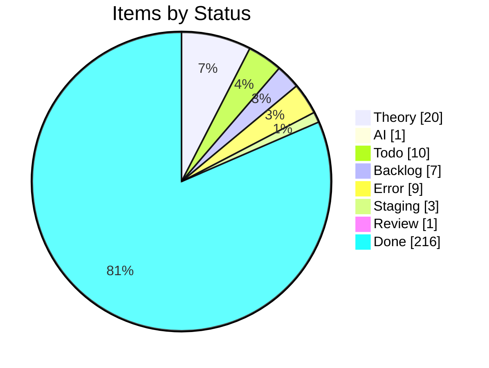
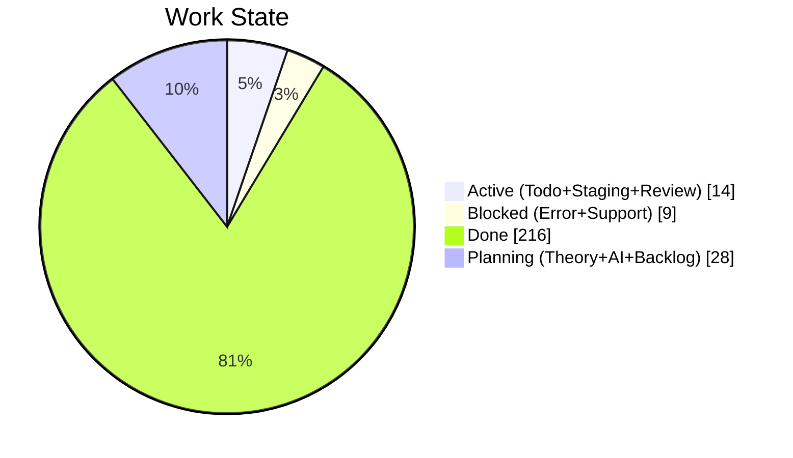
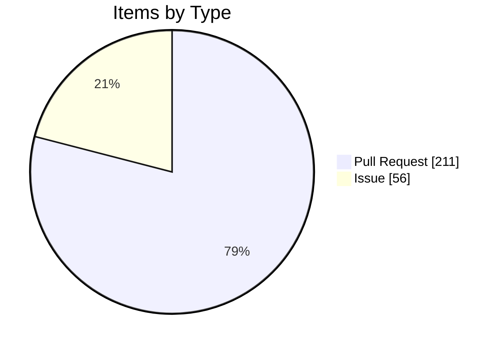

import { Card, CardGrid, Tabs, TabItem } from '@astrojs/starlight/components';

## Project Board Snapshot

:::note[Auto-generated]
Last synced: **2026-05-13T09:09:57.580Z** — updated daily by `ci-dashboard`.
Source: [KBVE Project Board](https://github.com/orgs/KBVE/projects/5)
:::

### Summary

<CardGrid>
  <Card title="Theory" icon="star">
    **20** items
  </Card>
  <Card title="AI" icon="rocket">
    **1** items
  </Card>
  <Card title="Todo" icon="list-format">
    **10** items
  </Card>
  <Card title="Backlog" icon="document">
    **7** items
  </Card>
  <Card title="Error" icon="warning">
    **9** items
  </Card>
  <Card title="Support" icon="information">
    **0** items
  </Card>
  <Card title="Staging" icon="setting">
    **3** items
  </Card>
  <Card title="Review" icon="approve-check">
    **1** items
  </Card>
  <Card title="Done" icon="approve-check-circle">
    **216** items
  </Card>
</CardGrid>

<Tabs>
  <TabItem label="Distribution">

  </TabItem>
  <TabItem label="Pipeline">

```mermaid
flowchart LR
    classDef planning fill:#8b5cf6,stroke:#6d28d9,color:#fff
    classDef active fill:#3b82f6,stroke:#1d4ed8,color:#fff
    classDef blocked fill:#ef4444,stroke:#b91c1c,color:#fff
    classDef done fill:#10b981,stroke:#059669,color:#fff
    Theory["Theory<br/><strong>20</strong>"]
    Theory --> AI
    AI["AI<br/><strong>1</strong>"]
    AI --> Todo
    Todo["Todo<br/><strong>10</strong>"]
    Todo --> Backlog
    Backlog["Backlog<br/><strong>7</strong>"]
    Backlog --> Error
    Error["Error<br/><strong>9</strong>"]
    Error --> Support
    Support["Support<br/><strong>0</strong>"]
    Support --> Staging
    Staging["Staging<br/><strong>3</strong>"]
    Staging --> Review
    Review["Review<br/><strong>1</strong>"]
    Review --> Done
    Done["Done<br/><strong>216</strong>"]
    class Theory,AI,Backlog planning
    class Todo,Staging,Review active
    class Error,Support blocked
    class Done done
```

:::tip[Legend]
**Purple** = Planning &nbsp; **Blue** = Active &nbsp; **Red** = Blocked &nbsp; **Green** = Done
:::

  </TabItem>
  <TabItem label="Breakdown">

#### Top Labels

| Label | Count |
|-------|:-----:|
| auto-pr | 211 |
| atomic | 100 |
| dev→main | 82 |
| enhancement | 29 |
| 0 | 21 |
| unity | 14 |
| 1 | 13 |
| bug | 12 |
| todo | 8 |
| backlog | 7 |

  </TabItem>
</Tabs>

### Theory (20)

| # | Title | Priority | Assignees | Labels |
|---|-------|----------|-----------|--------|
| [#2252](https://github.com/KBVE/kbve/issues/2252) | [Concept] : Shop Layout - Merch, Hardware, Services. | — | — | 1, enhancement |
| [#2362](https://github.com/KBVE/kbve/issues/2362) | [Concept] : [ItemDB] - Rigged Dice - 6 Items | — | h0lybyte | 1, enhancement |
| [#3472](https://github.com/KBVE/kbve/issues/3472) | [Concept] : [Unity] : TileMap GameObject | — | h0lybyte | 0, enhancement, unity |
| [#4643](https://github.com/KBVE/kbve/issues/4643) | [Concept] : [Unity] : Transport System | — | h0lybyte | 0, enhancement, unity |
| [#5624](https://github.com/KBVE/kbve/issues/5624) | [Concept] : Add Intel NUC worker nodes to existing Talos KBVE cluster | — | h0lybyte, Copilot | 0, enhancement |
| [#6437](https://github.com/KBVE/kbve/issues/6437) | [Concept] : [Unity] : Pathfinding ECS | — | h0lybyte | 0, enhancement, unity |
| [#6438](https://github.com/KBVE/kbve/issues/6438) | [Concept] : [Unity] : ItemDB ECS Migration | — | h0lybyte | 0, enhancement, unity |
| [#6576](https://github.com/KBVE/kbve/issues/6576) | [Concept] : [Unity] : Entity Blittable System | — | h0lybyte | 0, enhancement, unity |
| [#7547](https://github.com/KBVE/kbve/issues/7547) | [MC] [Pumpkin] Implement CMerchantOffers packet and Merchant Trading GUI | — | h0lybyte | 0, enhancement |
| [#7730](https://github.com/KBVE/kbve/issues/7730) | [DISCORDSH] Rust-First Vote Process — Rate-Limited Server Voting Pipeline | — | h0lybyte | 1, enhancement, security |
| [#7593](https://github.com/KBVE/kbve/issues/7593) | [PG] Deploy CNPG Pooler (PgBouncer) and migrate services from direct -rw connect | — | h0lybyte | 2, enhancement, dependencies |
| [#8180](https://github.com/KBVE/kbve/issues/8180) | [DISCORDSH] POC: Mockoon docker-compose for local E2E testing | — | h0lybyte | 1, enhancement |
| [#8245](https://github.com/KBVE/kbve/issues/8245) | perf(dashboard): migrate ClickHouse queries to @kbve/droid worker pipeline with  | — | — | 1, enhancement |
| [#9789](https://github.com/KBVE/kbve/issues/9789) | [Dashboard] Forgejo dashboard expansion — token scopes, user management, DB role | — | — | 3, enhancement, ci |
| [#9724](https://github.com/KBVE/kbve/issues/9724) | [ISOMETRIC] [BEVY] Convert sprite atlases from PNG to KTX2 with basis universal  | — | h0lybyte | 1, enhancement |
| [#9588](https://github.com/KBVE/kbve/issues/9588) | [ISOMETRIC] Pixel Smoothing | — | h0lybyte | 0, enhancement |
| [#9850](https://github.com/KBVE/kbve/issues/9850) | feat(mud): data population, IRC deployment, and isometric integration for MUD co | — | h0lybyte | 2, enhancement |
| [#8254](https://github.com/KBVE/kbve/issues/8254) | feat(unreal): CI/CD pipeline for UEDevOps plugin (itch.io + Fab) | — | h0lybyte | 2, enhancement |
| [#10194](https://github.com/KBVE/kbve/issues/10194) | [DISCORDSH] [BEVY] Key Integration Gaps | — | — | enhancement |
| [#10601](https://github.com/KBVE/kbve/issues/10601) | [DISCORDSH] - [BEVY] - Crate Integration State | — | — | enhancement, rust |

### AI (1)

| # | Title | Priority | Assignees | Labels |
|---|-------|----------|-----------|--------|
| [#4906](https://github.com/KBVE/kbve/issues/4906) | [Bug] : [Unity] : Character Orchestrator | — | h0lybyte | 0, bug, unity |

### Todo (10)

| # | Title | Priority | Assignees | Labels |
|---|-------|----------|-----------|--------|
| [#3572](https://github.com/KBVE/kbve/issues/3572) | [Update] : [Fudster] : User Billing &amp; Auth | — | h0lybyte | 1, security, update |
| [#4232](https://github.com/KBVE/kbve/issues/4232) | [Update] : [Github] : Rotate Tokens + Refactor Permissions | — | h0lybyte | 1, security, update |
| [#6939](https://github.com/KBVE/kbve/issues/6939) | [EPIC] Agent Orchestration Tab | — | — | 0, todo |
| [#8134](https://github.com/KBVE/kbve/issues/8134) | feat(proto): ClickHouse schema source of truth via protobuf → zod → vector pipel | — | h0lybyte | 4, documentation, todo |
| [#8148](https://github.com/KBVE/kbve/issues/8148) | [PSQL] Audit Discord Public Server Listing Functions | — | h0lybyte | 3, security, todo |
| [#8170](https://github.com/KBVE/kbve/issues/8170) | feat(proto): ArgoCD application state schema via protobuf → zod → edge pipeline | — | h0lybyte | 4, documentation, todo |
| [#9334](https://github.com/KBVE/kbve/issues/9334) | [ROWS] v0.4/v0.5 — Complete migration from C# OWS to Rust ROWS | — | h0lybyte | 6, enhancement, todo |
| [#8817](https://github.com/KBVE/kbve/issues/8817) | [E2E] kilobase needs pgrx/PostgreSQL build environment | — | h0lybyte | 1, todo |
| [#10329](https://github.com/KBVE/kbve/issues/10329) | [CICD] [Github] Custom Arc Runner Image | — | — | enhancement, update |
| [#10560](https://github.com/KBVE/kbve/issues/10560) | chore(redis): evaluate Bitnami chart bump 21.2.13 -&gt; 25.x | — | — | update |

### Backlog (7)

| # | Title | Priority | Assignees | Labels |
|---|-------|----------|-----------|--------|
| [#75](https://github.com/KBVE/kbve/issues/75) | [Concept] : HerbMail.com - Front Page | — | — | 1, backlog |
| [#96](https://github.com/KBVE/kbve/issues/96) | [Concept] : [Backend] : Charles. | — | h0lybyte | 0, backlog |
| [#416](https://github.com/KBVE/kbve/issues/416) | [Concept] : FlyIO Deployment | — | — | 0, backlog |
| [#1559](https://github.com/KBVE/kbve/issues/1559) | [Concept] : Adding TailwindCSS Example Components | — | — | 2, backlog |
| [#4642](https://github.com/KBVE/kbve/issues/4642) | [Concept] : [Unity] : Droid System - Hybrid NPC System. | — | h0lybyte | 0, enhancement, backlog |
| [#7548](https://github.com/KBVE/kbve/issues/7548) | feat(memes): responsive bento grid feed + dedicated meme pages | — | h0lybyte | 1, backlog |
| [#7709](https://github.com/KBVE/kbve/issues/7709) | [CRYPTOTHRONE] Inventory System, Event Bridge, and Gameplay Loop Completion | — | h0lybyte | 1, enhancement, backlog |

### Error (9)

| # | Title | Priority | Assignees | Labels |
|---|-------|----------|-----------|--------|
| [#2992](https://github.com/KBVE/kbve/issues/2992) | [Bug] LofiFocus is down - [PENDING] Ingress | — | h0lybyte | 0, bug |
| [#3536](https://github.com/KBVE/kbve/issues/3536) | [Bug] : Update CONTRIBUE.MD | — | h0lybyte | 0, bug |
| [#3538](https://github.com/KBVE/kbve/issues/3538) | [Bug] : [Unity] : Gameplay Mechanics - Farming &amp; Crafting | — | h0lybyte | 0, bug, unity |
| [#4538](https://github.com/KBVE/kbve/issues/4538) | [Bug] : [Unity] : Multiplayer / Steam Integration | — | h0lybyte | 0, bug, unity |
| [#6705](https://github.com/KBVE/kbve/issues/6705) | [Bug] : [Unity] : Chip Character Sheet Off Center Sprites | — | h0lybyte | 0, bug, unity |
| [#8169](https://github.com/KBVE/kbve/issues/8169) | [CI] Docker image version mismatch — cached binary reports stale version | — | — | 6, bug, ci |
| [#9182](https://github.com/KBVE/kbve/issues/9182) | [ROWS] Performance Audit — missing indexes, unbounded caches, query optimization | — | h0lybyte | 6, bug, enhancement |
| [#9205](https://github.com/KBVE/kbve/issues/9205) | feat(rows): pass zone instance ID to allocated game servers + unify launcher arc | — | h0lybyte | 2, bug |
| [#8815](https://github.com/KBVE/kbve/issues/8815) | [E2E] bevy_* projects need Rust + wasm32 toolchain in CI | — | h0lybyte | 0, bug, ci |

### Staging (3)

| # | Title | Priority | Assignees | Labels |
|---|-------|----------|-----------|--------|
| [#2208](https://github.com/KBVE/kbve/issues/2208) | [Concept] Service Page Enchancemnts | — | h0lybyte, dladeira | 4 |
| [#2267](https://github.com/KBVE/kbve/issues/2267) | [Concept] : CryptoThrone.com - King of the Hill App/Game | — | h0lybyte, BChip | 6 |
| [#6943](https://github.com/KBVE/kbve/issues/6943) | Phase 2: Frontend - Orchestration Tab | — | — | todo |

### Review (1)

| # | Title | Priority | Assignees | Labels |
|---|-------|----------|-----------|--------|
| [#10900](https://github.com/KBVE/kbve/pull/10900) | Release: 1 chore → Main | — | — | auto-pr, dev→main |

### Done (216)

| # | Title | Priority | Assignees | Labels |
|---|-------|----------|-----------|--------|
| [#4623](https://github.com/KBVE/kbve/issues/4623) | [Bug] : [Unity] : Procedural Map Generation | — | h0lybyte | 2, bug, unity |
| [#4797](https://github.com/KBVE/kbve/issues/4797) | [Bug] : [Unity] : Enemy Ai should attack player structures, if players are not a | — | h0lybyte | 4, bug, unity |
| [#6436](https://github.com/KBVE/kbve/issues/6436) | [Concept] : [Unity] : NPCDB - ECS | — | h0lybyte | 0, enhancement, unity |
| [#6446](https://github.com/KBVE/kbve/issues/6446) | [Concept] : [Unity] : MapDB - Schemas | — | h0lybyte | 0, enhancement, unity |
| [#8189](https://github.com/KBVE/kbve/issues/8189) | [BEVY] NPC Creatures — Performance Audit | — | — | enhancement |
| [#9327](https://github.com/KBVE/kbve/issues/9327) | feat(astro-kbve): site graph integration — polish, testing, and rollout | — | h0lybyte | 1, enhancement, todo |
| [#10315](https://github.com/KBVE/kbve/pull/10315) | Release: 3 features, 1 chore → Main | — | — | auto-pr, dev→main |
| [#10316](https://github.com/KBVE/kbve/pull/10316) | Atomic: axum-kbve v1.0.123 post-publish sync | — | — | auto-pr, atomic |
| [#10317](https://github.com/KBVE/kbve/pull/10317) | Release: 1 chore → Main | — | — | auto-pr, dev→main |
| [#10318](https://github.com/KBVE/kbve/pull/10318) | chore(dashboard): daily sync — 2026-04-29 | — | — | auto-pr |
| [#10319](https://github.com/KBVE/kbve/pull/10319) | Release: 1 fix, 2 chores → Main | — | — | auto-pr, dev→main |
| [#10320](https://github.com/KBVE/kbve/pull/10320) | Release: 6 features, 4 fixes, 2 docs, 2 chores → Main | — | — | auto-pr, dev→main |
| [#10322](https://github.com/KBVE/kbve/pull/10322) | Atomic: axum-kbve v1.0.124 post-publish sync | — | — | auto-pr, atomic |
| [#10323](https://github.com/KBVE/kbve/pull/10323) | Atomic: mc v1.0.29 post-publish sync | — | — | auto-pr, atomic |
| [#10324](https://github.com/KBVE/kbve/pull/10324) | Release: 2 features, 2 fixes, 2 docs, 3 chores → Main | — | — | auto-pr, dev→main |
| [#10326](https://github.com/KBVE/kbve/pull/10326) | Release: 2 features, 3 fixes, 1 doc, 1 refactor, 4 chores → Main | — | — | auto-pr, dev→main |
| [#10334](https://github.com/KBVE/kbve/pull/10334) | Release: 3 fixes → Main | — | — | auto-pr, dev→main |
| [#10335](https://github.com/KBVE/kbve/pull/10335) | chore(holy): update version.toml to 0.2.1 | — | — | auto-pr |
| [#10336](https://github.com/KBVE/kbve/pull/10336) | Atomic: axum-kbve v1.0.125 post-publish sync | — | — | auto-pr, atomic |
| [#10337](https://github.com/KBVE/kbve/pull/10337) | Release: 2 chores → Main | — | — | auto-pr, dev→main |
| [#10338](https://github.com/KBVE/kbve/pull/10338) | Release: 16 features, 11 fixes, 1 doc, 2 perfs, 6 chores → Main | — | — | auto-pr, dev→main |
| [#10342](https://github.com/KBVE/kbve/pull/10342) | Release: 7 features, 2 fixes, 1 CI, 1 perf, 2 refactors, 2 chores → Main | — | — | auto-pr, dev→main |
| [#10343](https://github.com/KBVE/kbve/pull/10343) | Atomic: mc v1.0.30 post-publish sync | — | — | auto-pr, atomic |
| [#10348](https://github.com/KBVE/kbve/pull/10348) | Release: 2 features, 2 chores → Main | — | — | auto-pr, dev→main |
| [#10349](https://github.com/KBVE/kbve/pull/10349) | chore(dashboard): daily sync — 2026-04-30 | — | — | auto-pr |
| [#10352](https://github.com/KBVE/kbve/pull/10352) | Atomic: axum-kbve v1.0.126 post-publish sync | — | — | auto-pr, atomic |
| [#10353](https://github.com/KBVE/kbve/pull/10353) | Release: 28 features, 5 fixes, 2 CI, 1 perf, 1 refactor, 1 test, 2 chores → Main | — | — | auto-pr, dev→main |
| [#10354](https://github.com/KBVE/kbve/pull/10354) | Atomic: irc-gateway v0.1.11 post-publish sync | — | — | auto-pr, atomic |
| [#10356](https://github.com/KBVE/kbve/pull/10356) | Release: 11 features, 5 fixes, 1 doc, 5 chores → Main | — | — | auto-pr, dev→main |
| [#10357](https://github.com/KBVE/kbve/pull/10357) | Atomic: axum-kbve v1.0.127 post-publish sync | — | — | auto-pr, atomic |
| [#10361](https://github.com/KBVE/kbve/pull/10361) | chore(dashboard): daily sync — 2026-05-01 | — | — | auto-pr |
| [#10364](https://github.com/KBVE/kbve/pull/10364) | deploy(isometric): update WASM build | — | — | auto-pr |
| [#10366](https://github.com/KBVE/kbve/pull/10366) | Release: 6 features, 5 fixes, 1 doc, 2 refactors, 2 chores → Main | — | — | auto-pr, dev→main |
| [#10368](https://github.com/KBVE/kbve/pull/10368) | deploy(isometric): update WASM build | — | — | auto-pr |
| [#10369](https://github.com/KBVE/kbve/pull/10369) | Release: 6 features, 1 fix, 2 chores → Main | — | — | auto-pr, dev→main |
| [#10370](https://github.com/KBVE/kbve/pull/10370) | Atomic: axum-kbve v1.0.128 post-publish sync | — | — | auto-pr, atomic |
| [#10371](https://github.com/KBVE/kbve/pull/10371) | Release: 12 features, 12 fixes, 1 CI, 1 test, 4 chores → Main | — | — | auto-pr, dev→main |
| [#10374](https://github.com/KBVE/kbve/pull/10374) | Atomic: irc-gateway v0.1.12 post-publish sync | — | — | auto-pr, atomic |
| [#10375](https://github.com/KBVE/kbve/pull/10375) | Release: 2 features, 3 fixes, 1 doc, 1 test → Main | — | — | auto-pr, dev→main |
| [#10376](https://github.com/KBVE/kbve/pull/10376) | chore(dashboard): daily sync — 2026-05-02 | — | — | auto-pr |
| [#10385](https://github.com/KBVE/kbve/pull/10385) | Release: 2 fixes, 1 chore → Main | — | — | auto-pr, dev→main |
| [#10387](https://github.com/KBVE/kbve/pull/10387) | Release: 2 fixes, 6 chores → Main | — | — | auto-pr, dev→main |
| [#10388](https://github.com/KBVE/kbve/pull/10388) | chore(bevy_behavior): update version.toml to 0.1.0 | — | — | auto-pr |
| [#10389](https://github.com/KBVE/kbve/pull/10389) | chore(bevy_inventory): update version.toml to 0.1.0 | — | — | auto-pr |
| [#10390](https://github.com/KBVE/kbve/pull/10390) | chore(bevy_skills): update version.toml to 0.1.0 | — | — | auto-pr |
| [#10399](https://github.com/KBVE/kbve/pull/10399) | Release: 1 fix, 2 chores → Main | — | — | auto-pr, dev→main |
| [#10403](https://github.com/KBVE/kbve/pull/10403) | chore(bevy_battle): update version.toml to 0.1.0 | — | — | auto-pr |
| [#10406](https://github.com/KBVE/kbve/pull/10406) | Release: 1 feature, 1 fix → Main | — | — | auto-pr, dev→main |
| [#10408](https://github.com/KBVE/kbve/pull/10408) | Atomic: arc-runner v0.1.1 post-publish sync | — | — | auto-pr, atomic |
| [#10409](https://github.com/KBVE/kbve/pull/10409) | Release: 1 fix, 1 chore → Main | — | — | auto-pr, dev→main |
| [#10411](https://github.com/KBVE/kbve/pull/10411) | Release: 11 features, 10 fixes, 1 doc, 1 refactor, 6 chores → Main | — | — | auto-pr, dev→main |
| [#10413](https://github.com/KBVE/kbve/pull/10413) | Atomic: axum-kbve v1.0.129 post-publish sync | — | — | auto-pr, atomic |
| [#10415](https://github.com/KBVE/kbve/pull/10415) | chore(dashboard): daily sync — 2026-05-03 | — | — | auto-pr |
| [#10417](https://github.com/KBVE/kbve/pull/10417) | Release: 3 features, 3 fixes, 8 chores → Main | — | — | auto-pr, dev→main |
| [#10418](https://github.com/KBVE/kbve/pull/10418) | Atomic: edge v0.1.29 post-publish sync | — | — | auto-pr, atomic |
| [#10419](https://github.com/KBVE/kbve/pull/10419) | Atomic: mc v1.0.31 post-publish sync | — | — | auto-pr, atomic |
| [#10422](https://github.com/KBVE/kbve/pull/10422) | Atomic: axum-kbve v1.0.130 post-publish sync | — | — | auto-pr, atomic |
| [#10425](https://github.com/KBVE/kbve/pull/10425) | Release: 1 fix → Main | — | — | auto-pr, dev→main |
| [#10426](https://github.com/KBVE/kbve/pull/10426) | Atomic: mc v1.0.32 post-publish sync | — | — | auto-pr, atomic |
| [#10427](https://github.com/KBVE/kbve/pull/10427) | Release: 1 chore → Main | — | — | auto-pr, dev→main |
| [#10430](https://github.com/KBVE/kbve/pull/10430) | Release: 3 features, 10 fixes, 3 refactors, 5 chores → Main | — | — | auto-pr, dev→main |
| [#10431](https://github.com/KBVE/kbve/pull/10431) | Atomic: mc v1.0.33 post-publish sync | — | — | auto-pr, atomic |
| [#10432](https://github.com/KBVE/kbve/pull/10432) | Release: 3 features, 1 fix, 1 doc, 1 CI, 1 refactor, 5 chores → Main | — | — | auto-pr, dev→main |
| [#10434](https://github.com/KBVE/kbve/pull/10434) | Atomic: rareicon v0.1.4 post-publish sync | — | — | auto-pr, atomic |
| [#10445](https://github.com/KBVE/kbve/pull/10445) | Atomic: mc v1.0.35 post-publish sync | — | — | auto-pr, atomic |
| [#10446](https://github.com/KBVE/kbve/pull/10446) | Release: 3 features, 1 fix, 1 doc, 1 perf, 2 refactors, 1 test, 6 chores → Main | — | — | auto-pr, dev→main |
| [#10447](https://github.com/KBVE/kbve/pull/10447) | deploy(isometric): update WASM build | — | — | auto-pr |
| [#10448](https://github.com/KBVE/kbve/pull/10448) | Atomic: axum-kbve v1.0.131 post-publish sync | — | — | auto-pr, atomic |
| [#10449](https://github.com/KBVE/kbve/pull/10449) | chore(dashboard): daily sync — 2026-05-04 | — | — | auto-pr |
| [#10452](https://github.com/KBVE/kbve/pull/10452) | Atomic: arc-runner v0.1.2 post-publish sync | — | — | auto-pr, atomic |
| [#10453](https://github.com/KBVE/kbve/pull/10453) | Release: 1 chore → Main | — | — | auto-pr, dev→main |
| [#10454](https://github.com/KBVE/kbve/pull/10454) | Release: 21 features, 8 fixes, 1 CI, 1 perf, 1 build, 1 refactor, 1 chore → Main | — | — | auto-pr, dev→main |
| [#10461](https://github.com/KBVE/kbve/pull/10461) | Atomic: rareicon v0.1.5 post-publish sync | — | — | auto-pr, atomic |
| [#10462](https://github.com/KBVE/kbve/pull/10462) | Release: 4 features, 1 doc, 4 chores → Main | — | — | auto-pr, dev→main |
| [#10464](https://github.com/KBVE/kbve/pull/10464) | chore(bevy_pathfinder): update version.toml to 0.1.0 | — | — | auto-pr |
| [#10465](https://github.com/KBVE/kbve/pull/10465) | Atomic: mc-velocity v1.1.1 post-publish sync | — | — | auto-pr, atomic |
| [#10466](https://github.com/KBVE/kbve/pull/10466) | Release: 2 chores → Main | — | — | auto-pr, dev→main |
| [#10467](https://github.com/KBVE/kbve/pull/10467) | Atomic: discord webhook fix | — | — | auto-pr, atomic |
| [#10468](https://github.com/KBVE/kbve/pull/10468) | Release: 1 feature, 3 fixes, 1 chore → Main | — | — | auto-pr, dev→main |
| [#10469](https://github.com/KBVE/kbve/pull/10469) | Atomic: discord webhook fix | — | — | auto-pr, atomic |
| [#10470](https://github.com/KBVE/kbve/pull/10470) | Atomic: mention names | — | — | auto-pr, atomic |
| [#10471](https://github.com/KBVE/kbve/pull/10471) | Atomic: chat format | — | — | auto-pr, atomic |
| [#10472](https://github.com/KBVE/kbve/pull/10472) | Atomic: mc v1.0.36 post-publish sync | — | — | auto-pr, atomic |
| [#10473](https://github.com/KBVE/kbve/pull/10473) | Release: 2 chores → Main | — | — | auto-pr, dev→main |
| [#10474](https://github.com/KBVE/kbve/pull/10474) | Atomic: velocity republish | — | — | auto-pr, atomic |
| [#10475](https://github.com/KBVE/kbve/pull/10475) | Release: 3 chores → Main | — | — | auto-pr, dev→main |
| [#10476](https://github.com/KBVE/kbve/pull/10476) | Atomic: mc-lobby v1.0.5 post-publish sync | — | — | auto-pr, atomic |
| [#10477](https://github.com/KBVE/kbve/pull/10477) | Atomic: mc-velocity v1.1.5 post-publish sync | — | — | auto-pr, atomic |
| [#10479](https://github.com/KBVE/kbve/pull/10479) | Atomic: agents mdx version rules | — | — | auto-pr, atomic |
| [#10481](https://github.com/KBVE/kbve/pull/10481) | chore(dashboard): daily sync — 2026-05-05 | — | — | auto-pr |
| [#10482](https://github.com/KBVE/kbve/pull/10482) | Release: 7 features, 4 fixes, 5 chores → Main | — | — | auto-pr, dev→main |
| [#10483](https://github.com/KBVE/kbve/pull/10483) | Atomic: chat revert | — | — | auto-pr, atomic |
| [#10485](https://github.com/KBVE/kbve/pull/10485) | Atomic: axum-kbve v1.0.132 post-publish sync | — | — | auto-pr, atomic |
| [#10486](https://github.com/KBVE/kbve/pull/10486) | Atomic: fabric no autoop | — | — | auto-pr, atomic |
| [#10487](https://github.com/KBVE/kbve/pull/10487) | Atomic: relay events | — | — | auto-pr, atomic |
| [#10490](https://github.com/KBVE/kbve/pull/10490) | Atomic: mc uplink paper | — | — | auto-pr, atomic |
| [#10491](https://github.com/KBVE/kbve/pull/10491) | Atomic: mc uplink fabric | — | — | auto-pr, atomic |
| [#10493](https://github.com/KBVE/kbve/pull/10493) | Release: 1 feature, 1 fix, 4 chores → Main | — | — | auto-pr, dev→main |
| [#10494](https://github.com/KBVE/kbve/pull/10494) | Atomic: mc-lobby v1.0.6 post-publish sync | — | — | auto-pr, atomic |
| [#10495](https://github.com/KBVE/kbve/pull/10495) | Atomic: mc-velocity v1.1.7 post-publish sync | — | — | auto-pr, atomic |
| [#10496](https://github.com/KBVE/kbve/pull/10496) | Atomic: mc v1.0.38 post-publish sync | — | — | auto-pr, atomic |
| [#10497](https://github.com/KBVE/kbve/pull/10497) | Release: 2 features, 1 chore → Main | — | — | auto-pr, dev→main |
| [#10499](https://github.com/KBVE/kbve/pull/10499) | Atomic: axum-kbve v1.0.133 post-publish sync | — | — | auto-pr, atomic |
| [#10501](https://github.com/KBVE/kbve/pull/10501) | Atomic: relay polish | — | — | auto-pr, atomic |
| [#10502](https://github.com/KBVE/kbve/pull/10502) | Atomic: mc-velocity v1.1.8 post-publish sync | — | — | auto-pr, atomic |
| [#10503](https://github.com/KBVE/kbve/pull/10503) | Release: 2 chores → Main | — | — | auto-pr, dev→main |
| [#10504](https://github.com/KBVE/kbve/pull/10504) | Atomic: mc-lobby v1.0.7 post-publish sync | — | — | auto-pr, atomic |
| [#10506](https://github.com/KBVE/kbve/pull/10506) | Release: 1 feature, 6 fixes, 2 refactors, 2 chores → Main | — | — | auto-pr, dev→main |
| [#10507](https://github.com/KBVE/kbve/pull/10507) | Release: 2 fixes, 1 chore → Main | — | — | auto-pr, dev→main |
| [#10508](https://github.com/KBVE/kbve/pull/10508) | Atomic: axum-kbve v1.0.134 post-publish sync | — | — | auto-pr, atomic |
| [#10510](https://github.com/KBVE/kbve/pull/10510) | chore(uniti): update version.toml to 0.1.0 | — | — | auto-pr |
| [#10511](https://github.com/KBVE/kbve/pull/10511) | Atomic: mc v1.0.39 post-publish sync | — | — | auto-pr, atomic |
| [#10512](https://github.com/KBVE/kbve/pull/10512) | Release: 2 chores → Main | — | — | auto-pr, dev→main |
| [#10515](https://github.com/KBVE/kbve/pull/10515) | Release: 1 feature, 1 fix, 2 CI, 1 chore → Main | — | — | auto-pr, dev→main |
| [#10519](https://github.com/KBVE/kbve/pull/10519) | Release: 7 features, 5 fixes, 3 chores → Main | — | — | auto-pr, dev→main |
| [#10523](https://github.com/KBVE/kbve/pull/10523) | Atomic: supa init timeout trim | — | — | auto-pr, atomic |
| [#10526](https://github.com/KBVE/kbve/pull/10526) | Atomic: redirect tta project | — | — | auto-pr, atomic |
| [#10528](https://github.com/KBVE/kbve/pull/10528) | Atomic: redirect langs jp fr es | — | — | auto-pr, atomic |
| [#10530](https://github.com/KBVE/kbve/pull/10530) | Atomic: regen ci manifest | — | — | auto-pr, atomic |
| [#10533](https://github.com/KBVE/kbve/pull/10533) | chore(dashboard): daily sync — 2026-05-06 | — | — | auto-pr |
| [#10534](https://github.com/KBVE/kbve/pull/10534) | Release: 1 feature, 1 fix, 4 chores → Main | — | — | auto-pr, dev→main |
| [#10535](https://github.com/KBVE/kbve/pull/10535) | Atomic: mc v1.0.40 post-publish sync | — | — | auto-pr, atomic |
| [#10536](https://github.com/KBVE/kbve/pull/10536) | Atomic: axum-kbve v1.0.135 post-publish sync | — | — | auto-pr, atomic |
| [#10539](https://github.com/KBVE/kbve/pull/10539) | Release: 1 feature, 1 fix, 3 chores → Main | — | — | auto-pr, dev→main |
| [#10540](https://github.com/KBVE/kbve/pull/10540) | Atomic: rareicon v0.1.6 post-publish sync | — | — | auto-pr, atomic |
| [#10546](https://github.com/KBVE/kbve/pull/10546) | Release: 1 feature, 2 fixes → Main | — | — | auto-pr, dev→main |
| [#10550](https://github.com/KBVE/kbve/pull/10550) | Release: 3 features, 5 fixes, 1 doc, 1 CI → Main | — | — | auto-pr, dev→main |
| [#10562](https://github.com/KBVE/kbve/pull/10562) | chore(dashboard): daily sync — 2026-05-07 | — | — | auto-pr |
| [#10563](https://github.com/KBVE/kbve/pull/10563) | Release: 20 features, 5 fixes, 1 doc, 1 CI, 1 perf, 6 chores → Main | — | — | auto-pr, dev→main |
| [#10585](https://github.com/KBVE/kbve/pull/10585) | Atomic: mc v1.0.41 post-publish sync | — | — | auto-pr, atomic |
| [#10586](https://github.com/KBVE/kbve/pull/10586) | Release: 2 features, 3 fixes, 2 docs, 2 refactors, 3 chores → Main | — | — | auto-pr, dev→main |
| [#10587](https://github.com/KBVE/kbve/pull/10587) | Atomic: axum-kbve v1.0.136 post-publish sync | — | — | auto-pr, atomic |
| [#10593](https://github.com/KBVE/kbve/pull/10593) | Release: 8 features, 7 fixes, 1 doc, 4 chores → Main | — | — | auto-pr, dev→main |
| [#10616](https://github.com/KBVE/kbve/pull/10616) | Atomic: edge v0.1.30 post-publish sync | — | — | auto-pr, atomic |
| [#10617](https://github.com/KBVE/kbve/pull/10617) | Release: 1 feature, 4 fixes, 1 CI, 1 test, 6 chores → Main | — | — | auto-pr, dev→main |
| [#10618](https://github.com/KBVE/kbve/pull/10618) | Atomic: mc v1.0.42 post-publish sync | — | — | auto-pr, atomic |
| [#10619](https://github.com/KBVE/kbve/pull/10619) | Atomic: discordsh-bot v0.1.11 post-publish sync | — | — | auto-pr, atomic |
| [#10621](https://github.com/KBVE/kbve/pull/10621) | Atomic: discordsh v0.1.44 post-publish sync | — | — | auto-pr, atomic |
| [#10631](https://github.com/KBVE/kbve/pull/10631) | Release: 6 fixes, 2 chores → Main | — | — | auto-pr, dev→main |
| [#10637](https://github.com/KBVE/kbve/pull/10637) | chore(dashboard): daily sync — 2026-05-08 | — | — | auto-pr |
| [#10642](https://github.com/KBVE/kbve/pull/10642) | Atomic: firecracker-python-net v0.1.0 post-publish sync | — | — | auto-pr, atomic |
| [#10643](https://github.com/KBVE/kbve/pull/10643) | Release: 8 features, 3 fixes, 5 chores → Main | — | — | auto-pr, dev→main |
| [#10648](https://github.com/KBVE/kbve/pull/10648) | Atomic: axum-rareicon v0.1.2 post-publish sync | — | — | auto-pr, atomic |
| [#10654](https://github.com/KBVE/kbve/pull/10654) | Atomic: axum-kbve v1.0.137 post-publish sync | — | — | auto-pr, atomic |
| [#10655](https://github.com/KBVE/kbve/pull/10655) | Release: 7 features, 5 fixes, 1 perf, 8 chores → Main | — | — | auto-pr, dev→main |
| [#10658](https://github.com/KBVE/kbve/pull/10658) | Atomic: edge v0.1.31 post-publish sync | — | — | auto-pr, atomic |
| [#10661](https://github.com/KBVE/kbve/pull/10661) | Atomic: mc v1.0.43 post-publish sync | — | — | auto-pr, atomic |
| [#10675](https://github.com/KBVE/kbve/pull/10675) | Release: 4 features, 6 fixes, 1 test, 3 chores → Main | — | — | auto-pr, dev→main |
| [#10678](https://github.com/KBVE/kbve/pull/10678) | Atomic: axum-rareicon v0.1.3 post-publish sync | — | — | auto-pr, atomic |
| [#10685](https://github.com/KBVE/kbve/pull/10685) | Atomic: axum-kbve v1.0.138 post-publish sync | — | — | auto-pr, atomic |
| [#10689](https://github.com/KBVE/kbve/pull/10689) | Release: 5 features, 2 fixes, 4 chores → Main | — | — | auto-pr, dev→main |
| [#10690](https://github.com/KBVE/kbve/pull/10690) | chore(dashboard): daily sync — 2026-05-09 | — | — | auto-pr |
| [#10696](https://github.com/KBVE/kbve/pull/10696) | Atomic: firecracker-python-net v0.1.1 post-publish sync | — | — | auto-pr, atomic |
| [#10698](https://github.com/KBVE/kbve/pull/10698) | Release: 6 features, 5 fixes, 1 refactor, 6 chores → Main | — | — | auto-pr, dev→main |
| [#10700](https://github.com/KBVE/kbve/pull/10700) | Atomic: mc v1.0.44 post-publish sync | — | — | auto-pr, atomic |
| [#10701](https://github.com/KBVE/kbve/pull/10701) | Atomic: discordsh-bot v0.1.12 post-publish sync | — | — | auto-pr, atomic |
| [#10715](https://github.com/KBVE/kbve/pull/10715) | Atomic: axum-kbve v1.0.139 post-publish sync | — | — | auto-pr, atomic |
| [#10719](https://github.com/KBVE/kbve/pull/10719) | Release: 7 features, 6 fixes, 2 docs, 1 refactor, 5 chores → Main | — | — | auto-pr, dev→main |
| [#10721](https://github.com/KBVE/kbve/pull/10721) | chore(bevy_mapdb): update version.toml to 0.1.0 | — | — | auto-pr |
| [#10724](https://github.com/KBVE/kbve/pull/10724) | Atomic: axum-kbve v1.0.140 post-publish sync | — | — | auto-pr, atomic |
| [#10735](https://github.com/KBVE/kbve/pull/10735) | Release: 5 features, 6 fixes, 1 refactor, 1 test, 4 chores → Main | — | — | auto-pr, dev→main |
| [#10736](https://github.com/KBVE/kbve/pull/10736) | Atomic: firecracker-python-net v0.1.2 post-publish sync | — | — | auto-pr, atomic |
| [#10737](https://github.com/KBVE/kbve/pull/10737) | chore(q): update version.toml to 0.1.1 | — | — | auto-pr |
| [#10741](https://github.com/KBVE/kbve/pull/10741) | Atomic: axum-kbve v1.0.141 post-publish sync | — | — | auto-pr, atomic |
| [#10743](https://github.com/KBVE/kbve/pull/10743) | Release: 1 feature, 2 fixes → Main | — | — | auto-pr, dev→main |
| [#10746](https://github.com/KBVE/kbve/pull/10746) | chore(bevy_pathfinder): update version.toml to 0.1.1 | — | — | auto-pr |
| [#10747](https://github.com/KBVE/kbve/pull/10747) | chore(bevy_tasker): update version.toml to 0.1.1 | — | — | auto-pr |
| [#10748](https://github.com/KBVE/kbve/pull/10748) | Release: 1 fix, 1 doc, 1 build, 1 refactor, 5 chores → Main | — | — | auto-pr, dev→main |
| [#10751](https://github.com/KBVE/kbve/pull/10751) | Atomic: irc gateway jwt aud fix | — | — | auto-pr, atomic |
| [#10752](https://github.com/KBVE/kbve/pull/10752) | Release: 1 fix, 2 chores → Main | — | — | auto-pr, dev→main |
| [#10755](https://github.com/KBVE/kbve/pull/10755) | Atomic: axum-kbve v1.0.142 post-publish sync | — | — | auto-pr, atomic |
| [#10756](https://github.com/KBVE/kbve/pull/10756) | deploy(isometric): update WASM build | — | — | auto-pr |
| [#10757](https://github.com/KBVE/kbve/pull/10757) | Release: 5 features, 2 fixes, 6 chores → Main | — | — | auto-pr, dev→main |
| [#10758](https://github.com/KBVE/kbve/pull/10758) | Atomic: irc-gateway v0.1.13 post-publish sync | — | — | auto-pr, atomic |
| [#10760](https://github.com/KBVE/kbve/pull/10760) | chore(dashboard): daily sync — 2026-05-10 | — | — | auto-pr |
| [#10763](https://github.com/KBVE/kbve/pull/10763) | Atomic: firecracker-ctl v0.1.29 post-publish sync | — | — | auto-pr, atomic |
| [#10764](https://github.com/KBVE/kbve/pull/10764) | Release: 1 feature, 4 chores → Main | — | — | auto-pr, dev→main |
| [#10765](https://github.com/KBVE/kbve/pull/10765) | Atomic: discordsh-bot v0.1.13 post-publish sync | — | — | auto-pr, atomic |
| [#10767](https://github.com/KBVE/kbve/pull/10767) | Atomic: axum-kbve v1.0.143 post-publish sync | — | — | auto-pr, atomic |
| [#10768](https://github.com/KBVE/kbve/pull/10768) | Atomic: irc-gateway v0.1.14 post-publish sync | — | — | auto-pr, atomic |
| [#10769](https://github.com/KBVE/kbve/pull/10769) | Release: 1 chore → Main | — | — | auto-pr, dev→main |
| [#10773](https://github.com/KBVE/kbve/pull/10773) | Atomic: firecracker-ctl v0.1.30 post-publish sync | — | — | auto-pr, atomic |
| [#10775](https://github.com/KBVE/kbve/pull/10775) | Release: 1 feature, 1 fix, 2 chores → Main | — | — | auto-pr, dev→main |
| [#10778](https://github.com/KBVE/kbve/pull/10778) | Atomic: axum-kbve v1.0.144 post-publish sync | — | — | auto-pr, atomic |
| [#10780](https://github.com/KBVE/kbve/pull/10780) | Release: 2 features, 3 fixes, 3 chores → Main | — | — | auto-pr, dev→main |
| [#10781](https://github.com/KBVE/kbve/pull/10781) | Atomic: irc gateway jwt aud fix | — | — | auto-pr, atomic |
| [#10785](https://github.com/KBVE/kbve/pull/10785) | Atomic: firecracker-ctl v0.1.31 post-publish sync | — | — | auto-pr, atomic |
| [#10786](https://github.com/KBVE/kbve/pull/10786) | Release: 5 features, 2 fixes, 1 doc, 8 chores → Main | — | — | auto-pr, dev→main |
| [#10787](https://github.com/KBVE/kbve/pull/10787) | Atomic: mc v1.0.45 post-publish sync | — | — | auto-pr, atomic |
| [#10789](https://github.com/KBVE/kbve/pull/10789) | Atomic: axum-kbve v1.0.145 post-publish sync | — | — | auto-pr, atomic |
| [#10796](https://github.com/KBVE/kbve/pull/10796) | Release: 1 feature, 1 fix, 1 doc, 6 chores → Main | — | — | auto-pr, dev→main |
| [#10797](https://github.com/KBVE/kbve/pull/10797) | Atomic: mc v1.0.46 post-publish sync | — | — | auto-pr, atomic |
| [#10798](https://github.com/KBVE/kbve/pull/10798) | Atomic: irc-gateway v0.1.15 post-publish sync | — | — | auto-pr, atomic |
| [#10800](https://github.com/KBVE/kbve/pull/10800) | Atomic: axum-kbve v1.0.146 post-publish sync | — | — | auto-pr, atomic |
| [#10804](https://github.com/KBVE/kbve/pull/10804) | Release: 1 feature, 4 fixes, 2 chores → Main | — | — | auto-pr, dev→main |
| [#10806](https://github.com/KBVE/kbve/pull/10806) | Atomic: axum-kbve v1.0.147 post-publish sync | — | — | auto-pr, atomic |
| [#10817](https://github.com/KBVE/kbve/pull/10817) | Atomic: firecracker-python-net v0.1.3 post-publish sync | — | — | auto-pr, atomic |
| [#10818](https://github.com/KBVE/kbve/pull/10818) | Release: 1 chore → Main | — | — | auto-pr, dev→main |
| [#10821](https://github.com/KBVE/kbve/pull/10821) | Release: 1 feature, 2 fixes, 1 build → Main | — | — | auto-pr, dev→main |
| [#10824](https://github.com/KBVE/kbve/pull/10824) | chore(dashboard): daily sync — 2026-05-11 | — | — | auto-pr |
| [#10825](https://github.com/KBVE/kbve/pull/10825) | Release: 6 features, 3 fixes, 2 docs, 1 test, 4 chores → Main | — | — | auto-pr, dev→main |
| [#10838](https://github.com/KBVE/kbve/pull/10838) | Atomic: axum-kbve v1.0.148 post-publish sync | — | — | auto-pr, atomic |
| [#10839](https://github.com/KBVE/kbve/pull/10839) | Release: 7 features, 2 fixes, 1 refactor, 6 chores → Main | — | — | auto-pr, dev→main |
| [#10852](https://github.com/KBVE/kbve/pull/10852) | Atomic: discordsh-bot v0.1.14 post-publish sync | — | — | auto-pr, atomic |
| [#10853](https://github.com/KBVE/kbve/pull/10853) | Release: 2 fixes, 1 build, 4 chores → Main | — | — | auto-pr, dev→main |
| [#10856](https://github.com/KBVE/kbve/pull/10856) | Atomic: axum-kbve v1.0.149 post-publish sync | — | — | auto-pr, atomic |
| [#10862](https://github.com/KBVE/kbve/pull/10862) | Atomic: irc-gateway v0.1.16 post-publish sync | — | — | auto-pr, atomic |
| [#10863](https://github.com/KBVE/kbve/pull/10863) | Release: 1 feature, 2 fixes, 1 chore → Main | — | — | auto-pr, dev→main |
| [#10868](https://github.com/KBVE/kbve/pull/10868) | Atomic: firecracker-node-web v0.1.0 post-publish sync | — | — | auto-pr, atomic |
| [#10869](https://github.com/KBVE/kbve/pull/10869) | Release: 9 features, 3 fixes, 3 perfs, 6 chores → Main | — | — | auto-pr, dev→main |
| [#10870](https://github.com/KBVE/kbve/pull/10870) | Atomic: firecracker-python-web v0.1.0 post-publish sync | — | — | auto-pr, atomic |
| [#10873](https://github.com/KBVE/kbve/pull/10873) | chore(dashboard): daily sync — 2026-05-12 | — | — | auto-pr |
| [#10886](https://github.com/KBVE/kbve/pull/10886) | Release: 3 features, 4 fixes, 1 perf, 1 refactor → Main | — | — | auto-pr, dev→main |
| [#10894](https://github.com/KBVE/kbve/pull/10894) | Atomic: firecracker-ctl v0.1.33 post-publish sync | — | — | auto-pr, atomic |
| [#10895](https://github.com/KBVE/kbve/pull/10895) | Release: 1 refactor, 1 chore → Main | — | — | auto-pr, dev→main |
| [#10899](https://github.com/KBVE/kbve/pull/10899) | Atomic: axum-kbve v1.0.150 post-publish sync | — | — | auto-pr, atomic |

---

*Auto-generated by [ci-dashboard.yml](https://github.com/KBVE/kbve/actions/workflows/ci-dashboard.yml)*
