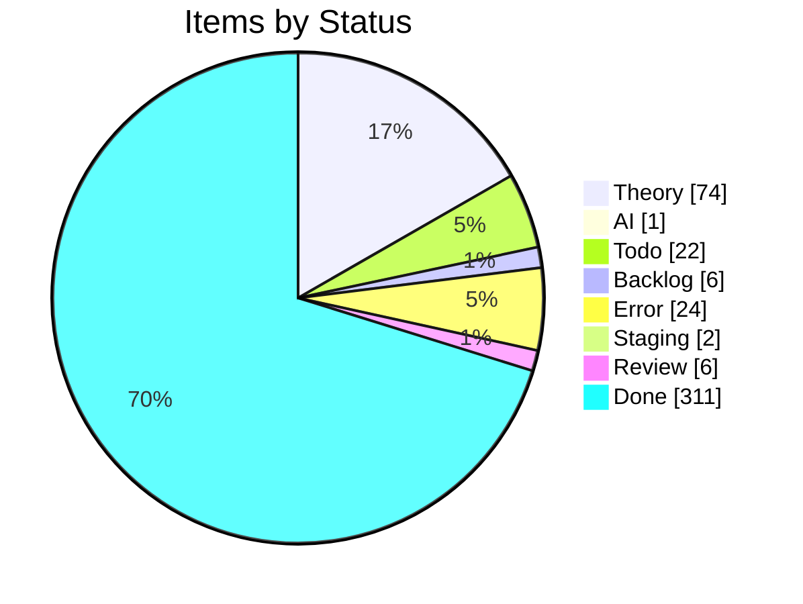
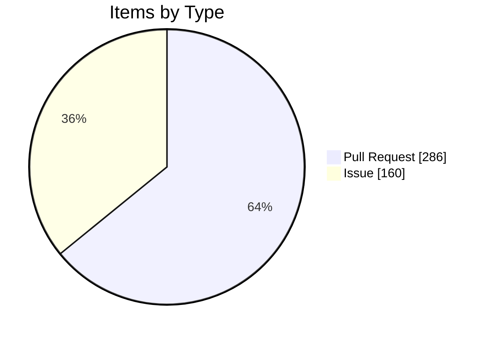

import { Card, CardGrid, Tabs, TabItem } from '@astrojs/starlight/components';

## Project Board Snapshot

:::note[Auto-generated]
Last synced: **2026-07-06T12:07:02.204Z** — updated daily by `ci-dashboard`.
Source: [KBVE Project Board](https://github.com/orgs/KBVE/projects/5)
:::

### Summary

<CardGrid>
  <Card title="Theory" icon="star">
    **74** items
  </Card>
  <Card title="AI" icon="rocket">
    **1** items
  </Card>
  <Card title="Todo" icon="list-format">
    **22** items
  </Card>
  <Card title="Backlog" icon="document">
    **6** items
  </Card>
  <Card title="Error" icon="warning">
    **24** items
  </Card>
  <Card title="Support" icon="information">
    **0** items
  </Card>
  <Card title="Staging" icon="setting">
    **2** items
  </Card>
  <Card title="Review" icon="approve-check">
    **6** items
  </Card>
  <Card title="Done" icon="approve-check-circle">
    **311** items
  </Card>
</CardGrid>

<Tabs>
  <TabItem label="Distribution">

  </TabItem>
  <TabItem label="Pipeline">

```mermaid
flowchart LR
    classDef planning fill:#8b5cf6,stroke:#6d28d9,color:#fff
    classDef active fill:#3b82f6,stroke:#1d4ed8,color:#fff
    classDef blocked fill:#ef4444,stroke:#b91c1c,color:#fff
    classDef done fill:#10b981,stroke:#059669,color:#fff
    Theory["Theory<br/><strong>74</strong>"]
    Theory --> AI
    AI["AI<br/><strong>1</strong>"]
    AI --> Todo
    Todo["Todo<br/><strong>22</strong>"]
    Todo --> Backlog
    Backlog["Backlog<br/><strong>6</strong>"]
    Backlog --> Error
    Error["Error<br/><strong>24</strong>"]
    Error --> Support
    Support["Support<br/><strong>0</strong>"]
    Support --> Staging
    Staging["Staging<br/><strong>2</strong>"]
    Staging --> Review
    Review["Review<br/><strong>6</strong>"]
    Review --> Done
    Done["Done<br/><strong>311</strong>"]
    class Theory,AI,Backlog planning
    class Todo,Staging,Review active
    class Error,Support blocked
    class Done done
```

:::tip[Legend]
**Purple** = Planning &nbsp; **Blue** = Active &nbsp; **Red** = Blocked &nbsp; **Green** = Done
:::

  </TabItem>
  <TabItem label="Breakdown">

#### Top Labels

| Label | Count |
|-------|:-----:|
| auto-pr | 286 |
| atomic | 140 |
| dev→main | 127 |
| enhancement | 106 |
| todo | 42 |
| bug | 37 |
| rust | 21 |
| 0 | 15 |
| 1 | 10 |
| unity | 8 |

  </TabItem>
</Tabs>

### Theory (74)

| # | Title | Priority | Assignees | Labels |
|---|-------|----------|-----------|--------|
| [#2252](https://github.com/KBVE/kbve/issues/2252) | [Concept] : Shop Layout - Merch, Hardware, Services. | — | — | 1, enhancement |
| [#4643](https://github.com/KBVE/kbve/issues/4643) | [Concept] : [Unity] : Transport System | — | h0lybyte | 0, enhancement, unity |
| [#5624](https://github.com/KBVE/kbve/issues/5624) | [Concept] : Add Intel NUC worker nodes to existing Talos KBVE cluster | — | h0lybyte, Copilot | 0, enhancement |
| [#6437](https://github.com/KBVE/kbve/issues/6437) | [Concept] : [Unity] : Pathfinding ECS | — | h0lybyte | 0, enhancement, unity |
| [#6438](https://github.com/KBVE/kbve/issues/6438) | [Concept] : [Unity] : ItemDB ECS Migration | — | h0lybyte | 0, enhancement, unity |
| [#6576](https://github.com/KBVE/kbve/issues/6576) | [Concept] : [Unity] : Entity Blittable System | — | h0lybyte | 0, enhancement, unity |
| [#7730](https://github.com/KBVE/kbve/issues/7730) | [DISCORDSH] Rust-First Vote Process — Rate-Limited Server Voting Pipeline | — | h0lybyte | 1, enhancement, security |
| [#7593](https://github.com/KBVE/kbve/issues/7593) | [PG] Deploy CNPG Pooler (PgBouncer) and migrate services from direct -rw connect | — | h0lybyte | 2, enhancement, dependencies |
| [#8180](https://github.com/KBVE/kbve/issues/8180) | [DISCORDSH] POC: Mockoon docker-compose for local E2E testing | — | h0lybyte | 1, enhancement |
| [#8245](https://github.com/KBVE/kbve/issues/8245) | perf(dashboard): migrate ClickHouse queries to @kbve/droid worker pipeline with  | — | — | 1, enhancement |
| [#9789](https://github.com/KBVE/kbve/issues/9789) | [Dashboard] Forgejo dashboard expansion — token scopes, user management, DB role | — | — | 3, enhancement, ci |
| [#9724](https://github.com/KBVE/kbve/issues/9724) | [ISOMETRIC] [BEVY] Convert sprite atlases from PNG to KTX2 with basis universal  | — | h0lybyte | 1, enhancement |
| [#9588](https://github.com/KBVE/kbve/issues/9588) | [ISOMETRIC] Pixel Smoothing | — | h0lybyte | 0, enhancement |
| [#9850](https://github.com/KBVE/kbve/issues/9850) | feat(mud): data population, IRC deployment, and isometric integration for MUD co | — | h0lybyte | 2, enhancement |
| [#8254](https://github.com/KBVE/kbve/issues/8254) | feat(unreal): CI/CD pipeline for UEDevOps plugin (itch.io + Fab) | — | h0lybyte | 2, enhancement |
| [#10194](https://github.com/KBVE/kbve/issues/10194) | [DISCORDSH] [BEVY] Key Integration Gaps | — | — | enhancement |
| [#10979](https://github.com/KBVE/kbve/issues/10979) | feat(wallet): khash marketplace bootstrap (5-phase roadmap) | — | — | enhancement |
| [#10980](https://github.com/KBVE/kbve/issues/10980) | isometric: upgrade Bevy 0.18 → 0.19 + wgpu 27 → 29 | — | — | enhancement |
| [#11244](https://github.com/KBVE/kbve/issues/11244) | [BEVY][ISOMETRIC] Refactor remaining menus to ui component library | — | — | enhancement |
| [#11246](https://github.com/KBVE/kbve/issues/11246) | [BEVY][ISOMETRIC] In-game chat overlay (incoming + outgoing) | — | — | enhancement |
| [#11247](https://github.com/KBVE/kbve/issues/11247) | [BEVY][ISOMETRIC] Toast styling pass — color accents + animations | — | — | enhancement |
| [#11262](https://github.com/KBVE/kbve/issues/11262) | feat(discordsh): /gh claim — Discord user self-assigns issue + KBVE profile link | — | — | enhancement |
| [#11294](https://github.com/KBVE/kbve/issues/11294) | feat(td-online): multiplayer tower defense — bevy+rapier2d sim, agones game serv | — | — | enhancement |
| [#11362](https://github.com/KBVE/kbve/issues/11362) | feat(astro-kbve,guild-vault): /dashboard/agents — multi-tenant bot management su | — | — | enhancement |
| [#11579](https://github.com/KBVE/kbve/issues/11579) | feat(laser): extract chat client into @kbve/laser for Phaser game embedding | — | — | enhancement |
| [#11580](https://github.com/KBVE/kbve/issues/11580) | feat(chat): proto + zod schema for ChatMessage envelope (bots, NOTICE, kinds) | — | — | enhancement |
| [#11582](https://github.com/KBVE/kbve/issues/11582) | harden(astro-irc): embed popup lifecycle + data-signin-url override | — | — | enhancement |
| [#11605](https://github.com/KBVE/kbve/issues/11605) | [isometric] WebGL2 fallback for browsers without WebGPU | — | — | 2, enhancement |
| [#12315](https://github.com/KBVE/kbve/issues/12315) | cryptothrone: zone-agnostic scenes + multi-area world model (city → world → town | — | — | enhancement |
| [#12360](https://github.com/KBVE/kbve/issues/12360) | cryptothrone: remaining scene/netcode abstraction layers (C8 + B4/B6) — successo | — | — | enhancement |
| [#12362](https://github.com/KBVE/kbve/issues/12362) | cryptothrone: playable as Discord Activity + standalone embed.js + itch (one mou | — | — | enhancement |
| [#12376](https://github.com/KBVE/kbve/issues/12376) | cryptothrone: ship to itch.io via embed.js (HTML5 build) — deferred after Discor | — | — | enhancement |
| [#12422](https://github.com/KBVE/kbve/issues/12422) | cryptothrone: decompose CloudCityScene into ECS systems over EntityStore (phased | — | — | enhancement |
| [#12484](https://github.com/KBVE/kbve/issues/12484) | [RN] [CRUX] Off Thread Networking | — | — | enhancement |
| [#12495](https://github.com/KBVE/kbve/issues/12495) | [RN] [WEB] Reuse React Native components on web via react-native-web + Astro | — | — | enhancement |
| [#12519](https://github.com/KBVE/kbve/issues/12519) | cryptothrone: render status effects on the client | — | — | enhancement |
| [#12520](https://github.com/KBVE/kbve/issues/12520) | cryptothrone: Discord Activity end-to-end verify + boot polish | — | — | enhancement |
| [#12522](https://github.com/KBVE/kbve/issues/12522) | [RN] OAuth integration (Discord / GitHub / Twitch) | — | — | enhancement |
| [#12531](https://github.com/KBVE/kbve/issues/12531) | cryptothrone: Discord activity-instance participant list → in-game lobby | — | — | enhancement |
| [#12533](https://github.com/KBVE/kbve/issues/12533) | cryptothrone: use openExternalLink for outbound links + encourageHardwareAcceler | — | — | enhancement |
| [#12532](https://github.com/KBVE/kbve/issues/12532) | cryptothrone: Discord Activity mobile layout (safe-area + layout-mode + orientat | — | — | enhancement |
| [#12692](https://github.com/KBVE/kbve/issues/12692) | jobboard: validate discipline_ids references at membership submit/approval | — | — | enhancement, security |
| [#12694](https://github.com/KBVE/kbve/issues/12694) | jobboard-web: validate API responses at runtime with the generated zod schemas | — | — | enhancement, good first issue |
| [#12693](https://github.com/KBVE/kbve/issues/12693) | jobboard: write audit_log entries on membership approve/reject | — | — | enhancement, good first issue |
| [#12695](https://github.com/KBVE/kbve/issues/12695) | jobboard: complete the gRPC envelope or retire the dead bytes-id membership mess | — | — | enhancement, rust |
| [#12703](https://github.com/KBVE/kbve/issues/12703) | cryptothrone: bring map/tile data into the ECS MapSystem (phased) | — | — | enhancement |
| [#12705](https://github.com/KBVE/kbve/issues/12705) | cryptothrone: Discord Activity mobile + lobby — real-device verification &amp; p | — | — | enhancement |
| [#12735](https://github.com/KBVE/kbve/issues/12735) | [Factorio] Remaining work — Agones server, factorio-ctl, telemetry, rotation (su | — | — | enhancement |
| [#12875](https://github.com/KBVE/kbve/issues/12875) | UE5 iOS CI/CD Pipeline | — | — | enhancement, todo, ios |
| [#12879](https://github.com/KBVE/kbve/issues/12879) | UE5 Android CI/CD Pipeline | — | — | enhancement, todo, android |
| [#12880](https://github.com/KBVE/kbve/issues/12880) | React Native Android CI/CD Pipeline | — | — | enhancement, todo, android |
| [#12915](https://github.com/KBVE/kbve/issues/12915) | Extend Longhorn filesystem-trim beyond Forgejo LFS volume (cluster-wide block re | — | — | enhancement |
| [#12924](https://github.com/KBVE/kbve/issues/12924) | feat(dashboard): per-app health + sync-history timeline (Argo) | — | — | enhancement |
| [#12925](https://github.com/KBVE/kbve/issues/12925) | feat(dashboard): collapse unchanged context in Argo Diff tab (hunk view) | — | — | enhancement |
| [#12926](https://github.com/KBVE/kbve/issues/12926) | feat(dashboard): Argo sync options — prune toggle + dry-run preview | — | — | enhancement |
| [#12927](https://github.com/KBVE/kbve/issues/12927) | feat(dashboard): selective resource sync from the Argo resource tree | — | — | enhancement |
| [#12928](https://github.com/KBVE/kbve/issues/12928) | feat(dashboard): deep-linkable Argo triage — persist filter/search/group in URL | — | — | enhancement |
| [#12929](https://github.com/KBVE/kbve/issues/12929) | feat(dashboard): bulk sync/refresh OutOfSync apps from the attention panel | — | — | enhancement |
| [#12930](https://github.com/KBVE/kbve/issues/12930) | feat(dashboard): rollback diff preview before confirm (Argo) | — | — | enhancement |
| [#12938](https://github.com/KBVE/kbve/issues/12938) | refactor(astro-kbve): shared collection-index util + typed API responses | — | — | enhancement, todo, npm |
| [#12939](https://github.com/KBVE/kbve/issues/12939) | perf(astro-kbve): precompute sitegraph at build instead of per-request | — | — | enhancement, todo, npm |
| [#13179](https://github.com/KBVE/kbve/issues/13179) | feat: Automate GitHub → Forgejo repository mirroring for kbve/kbve | — | — | enhancement |
| [#13194](https://github.com/KBVE/kbve/issues/13194) | [ROWS] Fix player-count reporting + auto spin-down of empty zone servers | — | — | enhancement |
| [#13350](https://github.com/KBVE/kbve/issues/13350) | ROWS deployment hardening: securityContext, KEDA decision, build-version cache,  | — | — | enhancement |
| [#13351](https://github.com/KBVE/kbve/issues/13351) | Upgrade astro-kbve to Astro 7 (build-speed: markdown/MDX-heavy static site) | — | — | enhancement |
| [#13506](https://github.com/KBVE/kbve/issues/13506) | Epic: Kilobase Postgres 17.4→17.6 blue-green migration (v2 cluster cutover) | — | — | enhancement |
| [#13555](https://github.com/KBVE/kbve/issues/13555) | ROWS: populate charonmapinstance (in-world presence tracking) — admission travel | — | — | enhancement, backlog |
| [#13576](https://github.com/KBVE/kbve/issues/13576) | Epic: RentEarth Launcher (Unreal + Tauri) — PoC for the ChuckRPG Launcher | — | — | enhancement |
| [#13734](https://github.com/KBVE/kbve/issues/13734) | epic(desktop-kbve): first-class terminal — PTY + xterm.js, tmux control mode, ra | — | — | enhancement |
| [#13783](https://github.com/KBVE/kbve/issues/13783) | perf(simgrid): borrow WS client decode buffer instead of cloning per recv | — | — | enhancement, todo, rust |
| [#13784](https://github.com/KBVE/kbve/issues/13784) | perf(simgrid): Bytes-backed EncodedFrame to avoid per-writer buffer copy | — | — | enhancement, todo, rust |
| [#13786](https://github.com/KBVE/kbve/issues/13786) | perf(arpg): cache felled/harvested env-log tile sets instead of rebuilding per s | — | — | enhancement, todo, rust |
| [#13796](https://github.com/KBVE/kbve/issues/13796) | ARPG: server-side hotbar/spell loadout representation | — | — | enhancement |
| [#13801](https://github.com/KBVE/kbve/issues/13801) | ARPG: pet battle disconnect handling + vitals commit-back before real rosters en | — | — | enhancement |

### AI (1)

| # | Title | Priority | Assignees | Labels |
|---|-------|----------|-----------|--------|
| [#4906](https://github.com/KBVE/kbve/issues/4906) | [Bug] : [Unity] : Character Orchestrator | — | h0lybyte | 0, bug, unity |

### Todo (22)

| # | Title | Priority | Assignees | Labels |
|---|-------|----------|-----------|--------|
| [#3572](https://github.com/KBVE/kbve/issues/3572) | [Update] : [Fudster] : User Billing &amp; Auth | — | h0lybyte | 1, security, update |
| [#4232](https://github.com/KBVE/kbve/issues/4232) | [Update] : [Github] : Rotate Tokens + Refactor Permissions | — | h0lybyte | 1, security, update |
| [#6939](https://github.com/KBVE/kbve/issues/6939) | [EPIC] Agent Orchestration Tab | — | — | 0, todo |
| [#8134](https://github.com/KBVE/kbve/issues/8134) | feat(proto): ClickHouse schema source of truth via protobuf → zod → vector pipel | — | h0lybyte | 4, documentation, todo |
| [#8148](https://github.com/KBVE/kbve/issues/8148) | [PSQL] Audit Discord Public Server Listing Functions | — | h0lybyte | 3, security, todo |
| [#8817](https://github.com/KBVE/kbve/issues/8817) | [E2E] kilobase needs pgrx/PostgreSQL build environment | — | h0lybyte | 1, todo |
| [#11013](https://github.com/KBVE/kbve/issues/11013) | [CICD] [Github] Migrate workflows to arc-runner-set-kbve + strip apt-install ban | — | — | enhancement, update |
| [#12931](https://github.com/KBVE/kbve/issues/12931) | perf(axum-kbve): hash JWT cache keys instead of storing raw token strings | — | — | enhancement, todo, rust |
| [#12932](https://github.com/KBVE/kbve/issues/12932) | perf(axum-kbve): zero-copy proxy hot path (borrow query/headers, avoid per-reque | — | — | enhancement, todo, rust |
| [#12933](https://github.com/KBVE/kbve/issues/12933) | perf(axum-kbve): tighten borrow scopes — pass &amp;TokenInfo, drop redundant Arc | — | — | enhancement, todo, rust |
| [#12934](https://github.com/KBVE/kbve/issues/12934) | perf(axum-kbve): serialize marketplace enums as &amp;'static str instead of per- | — | — | enhancement, todo, rust |
| [#12935](https://github.com/KBVE/kbve/issues/12935) | perf(astro-kbve): add Cache-Control headers to data/game API endpoints | — | — | enhancement, todo, npm |
| [#12936](https://github.com/KBVE/kbve/issues/12936) | perf(astro-kbve): audit island hydration — reduce client:only, defer off-viewpor | — | — | enhancement, todo, npm |
| [#12937](https://github.com/KBVE/kbve/issues/12937) | refactor(astro-kbve): split 3163-line AskamaProfileProvider into subcomponents | — | — | enhancement, todo, npm |
| [#13121](https://github.com/KBVE/kbve/issues/13121) | [LOW] Deprecated external-secrets.io/v1beta1 on new ES/SecretStore objects | — | — | update |
| [#13751](https://github.com/KBVE/kbve/issues/13751) | verify(rentearth): slime navmesh pathing after region PMC nav removal (#13735) | — | — | todo, ue |
| [#13752](https://github.com/KBVE/kbve/issues/13752) | chore(rentearth): gate debug glass-slime spawn in chuckCorePlayerController | — | — | todo, ue |
| [#13753](https://github.com/KBVE/kbve/issues/13753) | perf(rentearth): grass follow-up — DensityScale 3.5 tuning + streamer pool valid | — | — | todo, ue |
| [#13754](https://github.com/KBVE/kbve/issues/13754) | tooling(unreal): detect stale Engine/Plugins/Marketplace copies shadowing repo K | — | — | todo, ue |
| [#13785](https://github.com/KBVE/kbve/issues/13785) | perf(arpg): reuse Local scratch buffers in creature stream systems | — | — | enhancement, todo, rust |
| [#13787](https://github.com/KBVE/kbve/issues/13787) | perf(axum-kbve): borrow auth token via Cow in extract_auth_token | — | — | enhancement, todo, rust |
| [#13789](https://github.com/KBVE/kbve/issues/13789) | [EPIC] ARPG character persistence — Supabase item ledger + tokio write-behind | — | — | enhancement, todo, rust |

### Backlog (6)

| # | Title | Priority | Assignees | Labels |
|---|-------|----------|-----------|--------|
| [#75](https://github.com/KBVE/kbve/issues/75) | [Concept] : HerbMail.com - Front Page | — | — | 1, backlog |
| [#96](https://github.com/KBVE/kbve/issues/96) | [Concept] : [Backend] : Charles. | — | h0lybyte | 0, backlog |
| [#4642](https://github.com/KBVE/kbve/issues/4642) | [Concept] : [Unity] : Droid System - Hybrid NPC System. | — | h0lybyte | 0, enhancement, backlog |
| [#7548](https://github.com/KBVE/kbve/issues/7548) | feat(memes): responsive bento grid feed + dedicated meme pages | — | h0lybyte | 1, backlog |
| [#11250](https://github.com/KBVE/kbve/issues/11250) | feat(ci-dbmate-deploy): bake migrations into OCI image for cap-free deploys | — | — | enhancement, backlog |
| [#13556](https://github.com/KBVE/kbve/issues/13556) | ROWS: server-authoritative zone travel + anti-teleport (client-supplied zone hon | — | — | security, backlog |

### Error (24)

| # | Title | Priority | Assignees | Labels |
|---|-------|----------|-----------|--------|
| [#2992](https://github.com/KBVE/kbve/issues/2992) | [Bug] LofiFocus is down - [PENDING] Ingress | — | h0lybyte | 0, bug |
| [#3536](https://github.com/KBVE/kbve/issues/3536) | [Bug] : Update CONTRIBUE.MD | — | h0lybyte | 0, bug |
| [#3538](https://github.com/KBVE/kbve/issues/3538) | [Bug] : [Unity] : Gameplay Mechanics - Farming &amp; Crafting | — | h0lybyte | 0, bug, unity |
| [#6705](https://github.com/KBVE/kbve/issues/6705) | [Bug] : [Unity] : Chip Character Sheet Off Center Sprites | — | h0lybyte | 0, bug, unity |
| [#9182](https://github.com/KBVE/kbve/issues/9182) | [ROWS] Performance Audit — missing indexes, unbounded caches, query optimization | — | h0lybyte | 6, bug, enhancement |
| [#9205](https://github.com/KBVE/kbve/issues/9205) | feat(rows): pass zone instance ID to allocated game servers + unify launcher arc | — | h0lybyte | 2, bug |
| [#8815](https://github.com/KBVE/kbve/issues/8815) | [E2E] bevy_* projects need Rust + wasm32 toolchain in CI | — | h0lybyte | 0, bug, ci |
| [#13082](https://github.com/KBVE/kbve/issues/13082) | [CRITICAL] CNPG bootstrap: recovery left on live cluster under Argo auto-prune | — | — | bug |
| [#13085](https://github.com/KBVE/kbve/issues/13085) | [HIGH] Modrinth pipeline will be pruned on merge | — | — | bug |
| [#13097](https://github.com/KBVE/kbve/issues/13097) | [HIGH] CNPG primaryUpdateStrategy left commented (defaults to unsupervised) | — | — | bug |
| [#13099](https://github.com/KBVE/kbve/issues/13099) | [HIGH] Vector ClickHouse sinks use in-memory buffers | — | — | bug |
| [#13103](https://github.com/KBVE/kbve/issues/13103) | [MEDIUM] No probes on four public services (herbmail/memes/rentearth/cityvote) | — | — | bug |
| [#13096](https://github.com/KBVE/kbve/issues/13096) | [CRITICAL/verify] Agones health enabled on rows-tenant fleets | — | — | bug |
| [#13101](https://github.com/KBVE/kbve/issues/13101) | [MEDIUM] discordsh-bot liveness/readiness probe paths disagree | — | — | bug |
| [#13098](https://github.com/KBVE/kbve/issues/13098) | [HIGH] Valkey metrics scrape will be dead — monitoring ns not in allowlist | — | — | bug |
| [#13102](https://github.com/KBVE/kbve/issues/13102) | [MEDIUM] n8n PDB blocks node drains (minAvailable:1 on replicas:1) | — | — | bug |
| [#13105](https://github.com/KBVE/kbve/issues/13105) | [MEDIUM] --appendonly yes on emptyDir (rows valkey) | — | — | bug |
| [#13109](https://github.com/KBVE/kbve/issues/13109) | [MEDIUM] LB VIP 142.132.206.74 dropped from the pool | — | — | bug |
| [#13112](https://github.com/KBVE/kbve/issues/13112) | [MEDIUM] agones rows-tenants secret-name prefix drift (ows- vs rows-) | — | — | bug |
| [#13108](https://github.com/KBVE/kbve/issues/13108) | [MEDIUM] supabase-service-key property-name conflict (hash vs key) | — | — | bug |
| [#13104](https://github.com/KBVE/kbve/issues/13104) | [MEDIUM] Factorio rotation cronjob deletes server every 2 minutes | — | — | bug |
| [#13116](https://github.com/KBVE/kbve/issues/13116) | [LOW] Orphaned ReferenceGrant in rows ns | — | — | bug |
| [#13113](https://github.com/KBVE/kbve/issues/13113) | [MEDIUM] rabbitmq RoleBinding omits rows-chuckrpg-prod | — | — | bug |
| [#13119](https://github.com/KBVE/kbve/issues/13119) | [LOW] Cilium API-version skew (v2alpha1 L2 policy vs v2 pool) | — | — | bug |

### Staging (2)

| # | Title | Priority | Assignees | Labels |
|---|-------|----------|-----------|--------|
| [#2208](https://github.com/KBVE/kbve/issues/2208) | [Concept] Service Page Enchancemnts | — | h0lybyte, dladeira | 4 |
| [#6943](https://github.com/KBVE/kbve/issues/6943) | Phase 2: Frontend - Orchestration Tab | — | — | todo |

### Review (6)

| # | Title | Priority | Assignees | Labels |
|---|-------|----------|-----------|--------|
| [#13222](https://github.com/KBVE/kbve/pull/13222) | Atomic: chuck v0.3.36 post-publish sync | — | — | auto-pr, atomic |
| [#13275](https://github.com/KBVE/kbve/pull/13275) | Atomic: valkey harden | — | — | auto-pr, atomic |
| [#13278](https://github.com/KBVE/kbve/pull/13278) | Atomic: ue ramdisk spec | — | — | auto-pr, atomic |
| [#13572](https://github.com/KBVE/kbve/pull/13572) | Atomic: bump mdx spec | — | — | auto-pr, atomic |
| [#13575](https://github.com/KBVE/kbve/pull/13575) | Atomic: rows drain fleet plan fix | — | — | auto-pr, atomic |
| [#13892](https://github.com/KBVE/kbve/pull/13892) | Release: 1 commit → Main | — | — | auto-pr, dev→main |

### Done (311)

| # | Title | Priority | Assignees | Labels |
|---|-------|----------|-----------|--------|
| [#2267](https://github.com/KBVE/kbve/issues/2267) | [Concept] : CryptoThrone.com - King of the Hill App/Game | — | h0lybyte, BChip | 6 |
| [#12702](https://github.com/KBVE/kbve/issues/12702) | [Cryptothrone] Internal coin economy (coin / gold-bar) — design &amp; isolation  | — | — | enhancement |
| [#12955](https://github.com/KBVE/kbve/issues/12955) | Epic: ARPG environment objects — generic placeable foundation + campfire | — | — | enhancement, todo |
| [#12958](https://github.com/KBVE/kbve/issues/12958) | ARPG server — WalkableMap dynamic blocked-tile overlay | — | — | enhancement, todo, rust |
| [#12957](https://github.com/KBVE/kbve/issues/12957) | ARPG server — KIND_CAT_ENV + register_env | — | — | enhancement, todo, rust |
| [#12959](https://github.com/KBVE/kbve/issues/12959) | ARPG server — generic env components + bundle (EnvObject/Blocker/HealAura/Hazard | — | — | enhancement, todo, rust |
| [#12960](https://github.com/KBVE/kbve/issues/12960) | ARPG server — proximity heal/buff aura system | — | — | enhancement, todo, rust |
| [#12961](https://github.com/KBVE/kbve/issues/12961) | ARPG server — burn DoT via itemdb StatusEffectKind (no new proto) | — | — | enhancement, todo, rust |
| [#12962](https://github.com/KBVE/kbve/issues/12962) | ARPG server — spawn campfire in spawn_world | — | — | enhancement, todo, rust |
| [#12964](https://github.com/KBVE/kbve/issues/12964) | ARPG client — EnvironmentDef + preload/anim + sprite factory | — | — | enhancement, todo, npm |
| [#12963](https://github.com/KBVE/kbve/issues/12963) | ARPG client — env category plumbing (resolvers + store + EnvTag) | — | — | enhancement, todo, npm |
| [#12966](https://github.com/KBVE/kbve/issues/12966) | ARPG — campfire as itemdb item + deployable craft→place flow | — | — | enhancement, todo, backlog |
| [#12965](https://github.com/KBVE/kbve/issues/12965) | ARPG client — prediction collision + burn/heal feedback | — | — | enhancement, todo, npm |
| [#12972](https://github.com/KBVE/kbve/issues/12972) | ARPG server — read itemdb effect data (data-driven env objects) | — | — | enhancement, todo, rust |
| [#13065](https://github.com/KBVE/kbve/pull/13065) | Release: 11 features, 9 fixes, 2 perfs, 3 chores → Main | — | — | auto-pr, dev→main |
| [#13077](https://github.com/KBVE/kbve/pull/13077) | Release: 2 features, 3 fixes, 1 doc, 2 chores → Main | — | — | auto-pr, dev→main |
| [#13079](https://github.com/KBVE/kbve/pull/13079) | Atomic: discordsh-bot v0.1.21 post-publish sync | — | — | auto-pr, atomic |
| [#13080](https://github.com/KBVE/kbve/pull/13080) | Atomic: axum-kbve v1.0.207 post-publish sync | — | — | auto-pr, atomic |
| [#13083](https://github.com/KBVE/kbve/issues/13083) | [CRITICAL] nd-server Agones fleet dead on arrival — wrong SecretStore ref | — | — | bug |
| [#13100](https://github.com/KBVE/kbve/issues/13100) | [HIGH] VM idle-shutdown fails OPEN on transient API error | — | — | bug |
| [#13107](https://github.com/KBVE/kbve/issues/13107) | [MEDIUM] Backup/restore drills fail silently — no kube_job_status_failed rule | — | — | bug |
| [#13106](https://github.com/KBVE/kbve/issues/13106) | [MEDIUM] Immutable seed Job under selfHeal can thrash | — | — | bug |
| [#13110](https://github.com/KBVE/kbve/issues/13110) | [MEDIUM] Wildcard cert kbve-wt-tls has no explicit Certificate object | — | — | bug |
| [#13111](https://github.com/KBVE/kbve/issues/13111) | [MEDIUM] Kyverno CRD-before-CR bootstrap ordering (sync-wave) | — | — | bug |
| [#13117](https://github.com/KBVE/kbve/issues/13117) | [LOW] Base rows/application.yaml not wired into root | — | — | bug |
| [#13124](https://github.com/KBVE/kbve/issues/13124) | [LOW] mc-vt-api-key SealedSecret consumed by nothing | — | — | bug |
| [#13122](https://github.com/KBVE/kbve/issues/13122) | [LOW] jobboard version label/env drift (0.1.0 vs 0.1.7) | — | — | bug |
| [#13130](https://github.com/KBVE/kbve/pull/13130) | Release: 4 features, 4 fixes, 1 doc, 3 perfs, 2 refactors, 3 chores → Main | — | — | auto-pr, dev→main |
| [#13133](https://github.com/KBVE/kbve/pull/13133) | Atomic: arpg-web v0.1.2 post-publish sync | — | — | auto-pr, atomic |
| [#13140](https://github.com/KBVE/kbve/pull/13140) | Release: 2 features, 4 fixes, 1 build, 1 chore → Main | — | — | auto-pr, dev→main |
| [#13142](https://github.com/KBVE/kbve/pull/13142) | Atomic: kbve-kubectl v0.1.5 post-publish sync | — | — | auto-pr, atomic |
| [#13143](https://github.com/KBVE/kbve/pull/13143) | Atomic: kong cors regex | — | — | auto-pr, atomic |
| [#13147](https://github.com/KBVE/kbve/pull/13147) | Release: 2 fixes → Main | — | — | auto-pr, dev→main |
| [#13148](https://github.com/KBVE/kbve/pull/13148) | Release: 2 fixes → Main | — | — | auto-pr, dev→main |
| [#13149](https://github.com/KBVE/kbve/pull/13149) | Release: 1 chore → Main | — | — | auto-pr, dev→main |
| [#13151](https://github.com/KBVE/kbve/pull/13151) | Atomic: arpg-server v0.0.3 post-publish sync | — | — | auto-pr, atomic |
| [#13152](https://github.com/KBVE/kbve/pull/13152) | Release: 2 chores → Main | — | — | auto-pr, dev→main |
| [#13153](https://github.com/KBVE/kbve/pull/13153) | Atomic: axum-kbve v1.0.208 post-publish sync | — | — | auto-pr, atomic |
| [#13155](https://github.com/KBVE/kbve/pull/13155) | Release: 1 feature, 1 chore → Main | — | — | auto-pr, dev→main |
| [#13156](https://github.com/KBVE/kbve/pull/13156) | Atomic: arpg-web v0.1.3 post-publish sync | — | — | auto-pr, atomic |
| [#13158](https://github.com/KBVE/kbve/pull/13158) | chore(dashboard): daily sync — 2026-06-23 | — | — | auto-pr |
| [#13159](https://github.com/KBVE/kbve/pull/13159) | Release: 1 feature, 3 chores → Main | — | — | auto-pr, dev→main |
| [#13162](https://github.com/KBVE/kbve/pull/13162) | Release: 2 fixes → Main | — | — | auto-pr, dev→main |
| [#13165](https://github.com/KBVE/kbve/pull/13165) | Atomic: axum-kbve v1.0.209 post-publish sync | — | — | auto-pr, atomic |
| [#13166](https://github.com/KBVE/kbve/pull/13166) | Release: 6 features, 1 chore → Main | — | — | auto-pr, dev→main |
| [#13169](https://github.com/KBVE/kbve/pull/13169) | Atomic: chuck beta 0332 | — | — | auto-pr, atomic |
| [#13170](https://github.com/KBVE/kbve/pull/13170) | Release: 15 features, 3 fixes, 1 doc, 1 build, 1 test, 5 chores → Main | — | — | auto-pr, dev→main |
| [#13174](https://github.com/KBVE/kbve/pull/13174) | Atomic: chuck v0.3.32 post-publish sync | — | — | auto-pr, atomic |
| [#13183](https://github.com/KBVE/kbve/pull/13183) | Atomic: chuck beta logging | — | — | auto-pr, atomic |
| [#13184](https://github.com/KBVE/kbve/pull/13184) | Atomic: chuck beta 0333 | — | — | auto-pr, atomic |
| [#13185](https://github.com/KBVE/kbve/pull/13185) | Atomic: chuck beta 0334 | — | — | auto-pr, atomic |
| [#13188](https://github.com/KBVE/kbve/pull/13188) | Atomic: arpg-server v0.0.4 post-publish sync | — | — | auto-pr, atomic |
| [#13189](https://github.com/KBVE/kbve/pull/13189) | Release: 2 features, 1 fix, 3 chores → Main | — | — | auto-pr, dev→main |
| [#13190](https://github.com/KBVE/kbve/pull/13190) | Atomic: arpg-web v0.1.4 post-publish sync | — | — | auto-pr, atomic |
| [#13192](https://github.com/KBVE/kbve/issues/13192) | [Design / Future] ROWS multi-zone scaling — Agones-as-dispatcher, Option A (gene | — | — | enhancement |
| [#13195](https://github.com/KBVE/kbve/pull/13195) | Atomic: chuck v0.3.34 post-publish sync | — | — | auto-pr, atomic |
| [#13197](https://github.com/KBVE/kbve/pull/13197) | Atomic: chuck beta 0335 | — | — | auto-pr, atomic |
| [#13198](https://github.com/KBVE/kbve/pull/13198) | Release: 1 chore → Main | — | — | auto-pr, dev→main |
| [#13200](https://github.com/KBVE/kbve/pull/13200) | Atomic: rows reaper plan | — | — | auto-pr, atomic |
| [#13201](https://github.com/KBVE/kbve/pull/13201) | Release: 5 features, 2 fixes, 5 chores → Main | — | — | auto-pr, dev→main |
| [#13204](https://github.com/KBVE/kbve/pull/13204) | Atomic: chuck v0.3.35 post-publish sync | — | — | auto-pr, atomic |
| [#13209](https://github.com/KBVE/kbve/pull/13209) | Atomic: chuck beta 0336 | — | — | auto-pr, atomic |
| [#13212](https://github.com/KBVE/kbve/pull/13212) | Atomic: chuck beta 0336 | — | — | auto-pr, atomic |
| [#13213](https://github.com/KBVE/kbve/pull/13213) | Release: 2 fixes → Main | — | — | auto-pr, dev→main |
| [#13215](https://github.com/KBVE/kbve/pull/13215) | Atomic: axum-kbve v1.0.210 post-publish sync | — | — | auto-pr, atomic |
| [#13216](https://github.com/KBVE/kbve/pull/13216) | Release: 2 fixes, 3 chores → Main | — | — | auto-pr, dev→main |
| [#13217](https://github.com/KBVE/kbve/pull/13217) | Atomic: arpg-web v0.1.5 post-publish sync | — | — | auto-pr, atomic |
| [#13219](https://github.com/KBVE/kbve/pull/13219) | Atomic: arpg-server v0.0.5 post-publish sync | — | — | auto-pr, atomic |
| [#13220](https://github.com/KBVE/kbve/pull/13220) | Release: 1 chore → Main | — | — | auto-pr, dev→main |
| [#13223](https://github.com/KBVE/kbve/pull/13223) | Release: 1 fix, 1 chore → Main | — | — | auto-pr, dev→main |
| [#13226](https://github.com/KBVE/kbve/pull/13226) | Release: 1 feature, 1 fix, 1 chore → Main | — | — | auto-pr, dev→main |
| [#13229](https://github.com/KBVE/kbve/pull/13229) | Release: 2 chores → Main | — | — | auto-pr, dev→main |
| [#13230](https://github.com/KBVE/kbve/pull/13230) | Release: 2 chores → Main | — | — | auto-pr, dev→main |
| [#13235](https://github.com/KBVE/kbve/pull/13235) | Release: 4 fixes, 1 chore → Main | — | — | auto-pr, dev→main |
| [#13238](https://github.com/KBVE/kbve/pull/13238) | Release: 1 fix, 1 chore → Main | — | — | auto-pr, dev→main |
| [#13239](https://github.com/KBVE/kbve/pull/13239) | Atomic: ue cook customconfig | — | — | auto-pr, atomic |
| [#13240](https://github.com/KBVE/kbve/pull/13240) | Atomic: chuck beta 0337 | — | — | auto-pr, atomic |
| [#13242](https://github.com/KBVE/kbve/pull/13242) | Release: 2 fixes, 1 chore → Main | — | — | auto-pr, dev→main |
| [#13244](https://github.com/KBVE/kbve/pull/13244) | Atomic: kbve-gate v0.1.4 post-publish sync | — | — | auto-pr, atomic |
| [#13245](https://github.com/KBVE/kbve/pull/13245) | Release: 3 features, 2 fixes, 5 chores → Main | — | — | auto-pr, dev→main |
| [#13246](https://github.com/KBVE/kbve/pull/13246) | Atomic: ue verify staged | — | — | auto-pr, atomic |
| [#13247](https://github.com/KBVE/kbve/pull/13247) | Atomic: chuck beta 0338 | — | — | auto-pr, atomic |
| [#13248](https://github.com/KBVE/kbve/pull/13248) | Atomic: chuck beta 0339 | — | — | auto-pr, atomic |
| [#13250](https://github.com/KBVE/kbve/pull/13250) | Atomic: chuck v0.3.37 post-publish sync | — | — | auto-pr, atomic |
| [#13251](https://github.com/KBVE/kbve/pull/13251) | Release: 1 doc, 2 chores → Main | — | — | auto-pr, dev→main |
| [#13252](https://github.com/KBVE/kbve/pull/13252) | Atomic: kbve-gate v0.1.5 post-publish sync | — | — | auto-pr, atomic |
| [#13253](https://github.com/KBVE/kbve/pull/13253) | chore(dashboard): daily sync — 2026-06-24 | — | — | auto-pr |
| [#13255](https://github.com/KBVE/kbve/pull/13255) | Atomic: chuck v0.3.39 post-publish sync | — | — | auto-pr, atomic |
| [#13256](https://github.com/KBVE/kbve/pull/13256) | Release: 5 chores → Main | — | — | auto-pr, dev→main |
| [#13257](https://github.com/KBVE/kbve/pull/13257) | Atomic: arpg-web v0.1.6 post-publish sync | — | — | auto-pr, atomic |
| [#13258](https://github.com/KBVE/kbve/pull/13258) | Atomic: arpg-server v0.0.6 post-publish sync | — | — | auto-pr, atomic |
| [#13259](https://github.com/KBVE/kbve/pull/13259) | Atomic: chuck beta 0340 | — | — | auto-pr, atomic |
| [#13262](https://github.com/KBVE/kbve/pull/13262) | Atomic: axum-kbve v1.0.211 post-publish sync | — | — | auto-pr, atomic |
| [#13264](https://github.com/KBVE/kbve/pull/13264) | Release: 2 features, 1 fix, 1 doc, 2 refactors, 1 chore → Main | — | — | auto-pr, dev→main |
| [#13267](https://github.com/KBVE/kbve/pull/13267) | Release: 2 features, 3 fixes, 1 doc, 3 CI, 5 refactors → Main | — | — | auto-pr, dev→main |
| [#13273](https://github.com/KBVE/kbve/pull/13273) | Atomic: portal | — | — | auto-pr, atomic |
| [#13276](https://github.com/KBVE/kbve/pull/13276) | Release: 3 fixes, 2 perfs, 2 refactors, 2 chores → Main | — | — | auto-pr, dev→main |
| [#13287](https://github.com/KBVE/kbve/pull/13287) | Release: 1 feature, 2 fixes, 5 chores → Main | — | — | auto-pr, dev→main |
| [#13289](https://github.com/KBVE/kbve/pull/13289) | Atomic: chuck v0.3.40 post-publish sync | — | — | auto-pr, atomic |
| [#13290](https://github.com/KBVE/kbve/pull/13290) | Atomic: axum-kbve v1.0.212 post-publish sync | — | — | auto-pr, atomic |
| [#13293](https://github.com/KBVE/kbve/pull/13293) | Atomic: chuck v0.3.41 post-publish sync | — | — | auto-pr, atomic |
| [#13294](https://github.com/KBVE/kbve/pull/13294) | Release: 1 fix, 2 chores → Main | — | — | auto-pr, dev→main |
| [#13295](https://github.com/KBVE/kbve/pull/13295) | Atomic: arpg-server v0.0.7 post-publish sync | — | — | auto-pr, atomic |
| [#13297](https://github.com/KBVE/kbve/pull/13297) | Atomic: arc runner apiserver egress | — | — | auto-pr, atomic |
| [#13298](https://github.com/KBVE/kbve/pull/13298) | Atomic: chuck beta 0342 | — | — | auto-pr, atomic |
| [#13299](https://github.com/KBVE/kbve/pull/13299) | Release: 1 chore → Main | — | — | auto-pr, dev→main |
| [#13301](https://github.com/KBVE/kbve/pull/13301) | Atomic: chuck v0.3.42 post-publish sync | — | — | auto-pr, atomic |
| [#13302](https://github.com/KBVE/kbve/pull/13302) | Release: 1 fix, 1 chore → Main | — | — | auto-pr, dev→main |
| [#13303](https://github.com/KBVE/kbve/pull/13303) | Release: 3 fixes → Main | — | — | auto-pr, dev→main |
| [#13305](https://github.com/KBVE/kbve/pull/13305) | Release: 3 features, 1 fix → Main | — | — | auto-pr, dev→main |
| [#13307](https://github.com/KBVE/kbve/pull/13307) | Release: 1 feature, 2 fixes, 1 chore → Main | — | — | auto-pr, dev→main |
| [#13308](https://github.com/KBVE/kbve/pull/13308) | Atomic: chuck beta 0343 | — | — | auto-pr, atomic |
| [#13309](https://github.com/KBVE/kbve/pull/13309) | Release: 2 features, 1 fix, 2 perfs, 1 chore → Main | — | — | auto-pr, dev→main |
| [#13310](https://github.com/KBVE/kbve/pull/13310) | Atomic: ue customconfig bake | — | — | auto-pr, atomic |
| [#13311](https://github.com/KBVE/kbve/pull/13311) | Atomic: chuck beta 0343 | — | — | auto-pr, atomic |
| [#13312](https://github.com/KBVE/kbve/pull/13312) | Atomic: chuck v0.3.43 post-publish sync | — | — | auto-pr, atomic |
| [#13313](https://github.com/KBVE/kbve/pull/13313) | Release: 1 chore → Main | — | — | auto-pr, dev→main |
| [#13314](https://github.com/KBVE/kbve/pull/13314) | Atomic: arpg-server v0.0.8 post-publish sync | — | — | auto-pr, atomic |
| [#13315](https://github.com/KBVE/kbve/pull/13315) | Release: 6 features, 4 fixes, 2 chores → Main | — | — | auto-pr, dev→main |
| [#13317](https://github.com/KBVE/kbve/pull/13317) | Atomic: rows pk users race | — | — | auto-pr, atomic |
| [#13319](https://github.com/KBVE/kbve/pull/13319) | Atomic: chuck beta 0344 | — | — | auto-pr, atomic |
| [#13320](https://github.com/KBVE/kbve/pull/13320) | Release: 3 features, 3 chores → Main | — | — | auto-pr, dev→main |
| [#13321](https://github.com/KBVE/kbve/pull/13321) | Atomic: chuck v0.3.44 post-publish sync | — | — | auto-pr, atomic |
| [#13322](https://github.com/KBVE/kbve/pull/13322) | Release: 1 fix, 4 chores → Main | — | — | auto-pr, dev→main |
| [#13323](https://github.com/KBVE/kbve/pull/13323) | Atomic: arpg-server v0.1.9 post-publish sync | — | — | auto-pr, atomic |
| [#13324](https://github.com/KBVE/kbve/pull/13324) | Atomic: rows v0.1.31 post-publish sync | — | — | auto-pr, atomic |
| [#13325](https://github.com/KBVE/kbve/pull/13325) | chore(dashboard): daily sync — 2026-06-25 | — | — | auto-pr |
| [#13326](https://github.com/KBVE/kbve/pull/13326) | Atomic: axum-chuckrpg v0.1.9 post-publish sync | — | — | auto-pr, atomic |
| [#13327](https://github.com/KBVE/kbve/pull/13327) | Release: 2 features, 2 refactors, 1 chore → Main | — | — | auto-pr, dev→main |
| [#13328](https://github.com/KBVE/kbve/pull/13328) | Atomic: arpg-web v0.1.9 post-publish sync | — | — | auto-pr, atomic |
| [#13329](https://github.com/KBVE/kbve/pull/13329) | Release: 2 chores → Main | — | — | auto-pr, dev→main |
| [#13330](https://github.com/KBVE/kbve/pull/13330) | Release: 3 features, 3 fixes, 1 build, 2 chores → Main | — | — | auto-pr, dev→main |
| [#13333](https://github.com/KBVE/kbve/pull/13333) | Release: 4 features, 2 fixes, 2 refactors, 4 chores → Main | — | — | auto-pr, dev→main |
| [#13335](https://github.com/KBVE/kbve/pull/13335) | Atomic: arpg-server v0.1.10 post-publish sync | — | — | auto-pr, atomic |
| [#13336](https://github.com/KBVE/kbve/pull/13336) | Atomic: arpg-web v0.1.10 post-publish sync | — | — | auto-pr, atomic |
| [#13338](https://github.com/KBVE/kbve/pull/13338) | Atomic: axum-kbve v1.0.213 post-publish sync | — | — | auto-pr, atomic |
| [#13339](https://github.com/KBVE/kbve/pull/13339) | Atomic: axum-kbve v1.0.214 post-publish sync | — | — | auto-pr, atomic |
| [#13340](https://github.com/KBVE/kbve/pull/13340) | Release: 6 features, 3 fixes, 3 CI, 1 refactor, 4 chores → Main | — | — | auto-pr, dev→main |
| [#13345](https://github.com/KBVE/kbve/pull/13345) | Atomic: arpg-server v0.1.11 post-publish sync | — | — | auto-pr, atomic |
| [#13346](https://github.com/KBVE/kbve/pull/13346) | Release: 2 features, 1 refactor, 2 chores → Main | — | — | auto-pr, dev→main |
| [#13347](https://github.com/KBVE/kbve/pull/13347) | Atomic: arpg-web v0.1.11 post-publish sync | — | — | auto-pr, atomic |
| [#13349](https://github.com/KBVE/kbve/pull/13349) | Release: 14 features, 8 fixes, 4 perfs, 1 chore → Main | — | — | auto-pr, dev→main |
| [#13357](https://github.com/KBVE/kbve/pull/13357) | Atomic: arpg-server v0.1.12 post-publish sync | — | — | auto-pr, atomic |
| [#13358](https://github.com/KBVE/kbve/pull/13358) | Release: 2 features, 2 fixes, 1 chore → Main | — | — | auto-pr, dev→main |
| [#13361](https://github.com/KBVE/kbve/pull/13361) | Atomic: arpg-web v0.1.12 post-publish sync | — | — | auto-pr, atomic |
| [#13362](https://github.com/KBVE/kbve/pull/13362) | Release: 1 chore → Main | — | — | auto-pr, dev→main |
| [#13365](https://github.com/KBVE/kbve/pull/13365) | Release: 2 features, 1 fix, 1 chore → Main | — | — | auto-pr, dev→main |
| [#13366](https://github.com/KBVE/kbve/pull/13366) | Atomic: arpg-web v0.1.13 post-publish sync | — | — | auto-pr, atomic |
| [#13367](https://github.com/KBVE/kbve/pull/13367) | Release: 2 chores → Main | — | — | auto-pr, dev→main |
| [#13368](https://github.com/KBVE/kbve/pull/13368) | Atomic: arpg-server v0.1.13 post-publish sync | — | — | auto-pr, atomic |
| [#13370](https://github.com/KBVE/kbve/pull/13370) | Release: 1 feature, 1 perf → Main | — | — | auto-pr, dev→main |
| [#13372](https://github.com/KBVE/kbve/pull/13372) | Release: 2 features, 2 fixes, 1 perf, 1 chore → Main | — | — | auto-pr, dev→main |
| [#13375](https://github.com/KBVE/kbve/pull/13375) | Atomic: arpg-web v0.1.14 post-publish sync | — | — | auto-pr, atomic |
| [#13376](https://github.com/KBVE/kbve/pull/13376) | Atomic: arpg-server v0.1.14 post-publish sync | — | — | auto-pr, atomic |
| [#13377](https://github.com/KBVE/kbve/pull/13377) | Release: 2 chores → Main | — | — | auto-pr, dev→main |
| [#13380](https://github.com/KBVE/kbve/pull/13380) | Atomic: axum-kbve v1.0.215 post-publish sync | — | — | auto-pr, atomic |
| [#13382](https://github.com/KBVE/kbve/pull/13382) | Release: 10 features, 4 fixes, 3 refactors, 1 chore → Main | — | — | auto-pr, dev→main |
| [#13388](https://github.com/KBVE/kbve/pull/13388) | chore(dashboard): daily sync — 2026-06-26 | — | — | auto-pr |
| [#13390](https://github.com/KBVE/kbve/pull/13390) | Release: 10 features, 4 fixes, 1 CI, 3 chores → Main | — | — | auto-pr, dev→main |
| [#13397](https://github.com/KBVE/kbve/pull/13397) | Atomic: arc-runner v0.1.6 post-publish sync | — | — | auto-pr, atomic |
| [#13398](https://github.com/KBVE/kbve/pull/13398) | Atomic: arpg-web v0.1.15 post-publish sync | — | — | auto-pr, atomic |
| [#13399](https://github.com/KBVE/kbve/pull/13399) | Release: 4 chores → Main | — | — | auto-pr, dev→main |
| [#13400](https://github.com/KBVE/kbve/pull/13400) | Atomic: kbve-gate v0.1.6 post-publish sync | — | — | auto-pr, atomic |
| [#13401](https://github.com/KBVE/kbve/pull/13401) | Atomic: arpg-server v0.1.15 post-publish sync | — | — | auto-pr, atomic |
| [#13406](https://github.com/KBVE/kbve/pull/13406) | Release: 8 features, 7 fixes, 1 test, 2 chores → Main | — | — | auto-pr, dev→main |
| [#13414](https://github.com/KBVE/kbve/pull/13414) | Atomic: arpg-web v0.1.16 post-publish sync | — | — | auto-pr, atomic |
| [#13415](https://github.com/KBVE/kbve/pull/13415) | Release: 2 chores → Main | — | — | auto-pr, dev→main |
| [#13416](https://github.com/KBVE/kbve/pull/13416) | Atomic: arpg-server v0.1.16 post-publish sync | — | — | auto-pr, atomic |
| [#13419](https://github.com/KBVE/kbve/pull/13419) | Release: 15 features, 4 fixes, 1 doc, 2 CI, 4 refactors, 3 chores → Main | — | — | auto-pr, dev→main |
| [#13425](https://github.com/KBVE/kbve/pull/13425) | Atomic: ows customdata uq | — | — | auto-pr, atomic |
| [#13427](https://github.com/KBVE/kbve/pull/13427) | Atomic: wp external actors | — | — | auto-pr, atomic |
| [#13428](https://github.com/KBVE/kbve/pull/13428) | Release: 3 features, 1 fix, 1 refactor → Main | — | — | auto-pr, dev→main |
| [#13432](https://github.com/KBVE/kbve/pull/13432) | Atomic: axum-kbve v1.0.216 post-publish sync | — | — | auto-pr, atomic |
| [#13433](https://github.com/KBVE/kbve/pull/13433) | Release: 1 chore → Main | — | — | auto-pr, dev→main |
| [#13434](https://github.com/KBVE/kbve/pull/13434) | Release: 3 features, 1 fix, 1 test → Main | — | — | auto-pr, dev→main |
| [#13437](https://github.com/KBVE/kbve/pull/13437) | Atomic: ows customdata uq | — | — | auto-pr, atomic |
| [#13438](https://github.com/KBVE/kbve/pull/13438) | Atomic: rows v0.1.32 post-publish sync | — | — | auto-pr, atomic |
| [#13439](https://github.com/KBVE/kbve/pull/13439) | Release: 1 feature, 2 fixes, 6 chores → Main | — | — | auto-pr, dev→main |
| [#13443](https://github.com/KBVE/kbve/pull/13443) | Release: 9 features, 5 fixes, 1 CI, 6 chores → Main | — | — | auto-pr, dev→main |
| [#13444](https://github.com/KBVE/kbve/pull/13444) | Atomic: arpg-server v0.1.17 post-publish sync | — | — | auto-pr, atomic |
| [#13445](https://github.com/KBVE/kbve/pull/13445) | Atomic: axum-kbve v1.0.217 post-publish sync | — | — | auto-pr, atomic |
| [#13446](https://github.com/KBVE/kbve/pull/13446) | chore(dashboard): daily sync — 2026-06-27 | — | — | auto-pr |
| [#13450](https://github.com/KBVE/kbve/pull/13450) | Atomic: arpg-server v0.1.18 post-publish sync | — | — | auto-pr, atomic |
| [#13451](https://github.com/KBVE/kbve/pull/13451) | Release: 1 fix, 1 chore → Main | — | — | auto-pr, dev→main |
| [#13452](https://github.com/KBVE/kbve/pull/13452) | Atomic: arpg-web v0.1.18 post-publish sync | — | — | auto-pr, atomic |
| [#13453](https://github.com/KBVE/kbve/pull/13453) | Release: 1 chore → Main | — | — | auto-pr, dev→main |
| [#13454](https://github.com/KBVE/kbve/pull/13454) | Release: 1 fix → Main | — | — | auto-pr, dev→main |
| [#13455](https://github.com/KBVE/kbve/pull/13455) | Release: 1 fix, 1 CI → Main | — | — | auto-pr, dev→main |
| [#13456](https://github.com/KBVE/kbve/pull/13456) | Release: 1 fix → Main | — | — | auto-pr, dev→main |
| [#13457](https://github.com/KBVE/kbve/pull/13457) | Atomic: arpg-web v0.1.19 post-publish sync | — | — | auto-pr, atomic |
| [#13458](https://github.com/KBVE/kbve/pull/13458) | Release: 2 chores → Main | — | — | auto-pr, dev→main |
| [#13459](https://github.com/KBVE/kbve/pull/13459) | Atomic: arpg-server v0.1.19 post-publish sync | — | — | auto-pr, atomic |
| [#13461](https://github.com/KBVE/kbve/pull/13461) | Release: 1 feature, 2 fixes → Main | — | — | auto-pr, dev→main |
| [#13462](https://github.com/KBVE/kbve/pull/13462) | Release: 9 features, 4 fixes, 3 docs, 2 tests, 5 chores → Main | — | — | auto-pr, dev→main |
| [#13467](https://github.com/KBVE/kbve/pull/13467) | Atomic: axum-rentearth v0.1.1 post-publish sync | — | — | auto-pr, atomic |
| [#13469](https://github.com/KBVE/kbve/pull/13469) | Release: 7 features, 8 fixes, 1 CI, 2 refactors, 5 chores → Main | — | — | auto-pr, dev→main |
| [#13501](https://github.com/KBVE/kbve/pull/13501) | chore(dashboard): daily sync — 2026-06-28 | — | — | auto-pr |
| [#13508](https://github.com/KBVE/kbve/pull/13508) | Release: 4 features, 7 fixes, 1 doc, 1 test, 2 chores → Main | — | — | auto-pr, dev→main |
| [#13514](https://github.com/KBVE/kbve/pull/13514) | Atomic: kilobase v17.6.1 post-publish sync | — | — | auto-pr, atomic |
| [#13517](https://github.com/KBVE/kbve/pull/13517) | Atomic: arpg-web v0.1.20 post-publish sync | — | — | auto-pr, atomic |
| [#13519](https://github.com/KBVE/kbve/pull/13519) | Release: 3 features, 1 fix, 2 chores → Main | — | — | auto-pr, dev→main |
| [#13520](https://github.com/KBVE/kbve/pull/13520) | Atomic: axum-kbve v1.0.218 post-publish sync | — | — | auto-pr, atomic |
| [#13524](https://github.com/KBVE/kbve/pull/13524) | Atomic: arpg-server v0.1.20 post-publish sync | — | — | auto-pr, atomic |
| [#13525](https://github.com/KBVE/kbve/pull/13525) | Release: 1 fix, 1 chore → Main | — | — | auto-pr, dev→main |
| [#13526](https://github.com/KBVE/kbve/pull/13526) | Release: 4 features, 1 fix, 1 refactor, 1 chore → Main | — | — | auto-pr, dev→main |
| [#13533](https://github.com/KBVE/kbve/pull/13533) | Atomic: chuck beta 0345 | — | — | auto-pr, atomic |
| [#13534](https://github.com/KBVE/kbve/pull/13534) | Atomic: edge v0.1.46 post-publish sync | — | — | auto-pr, atomic |
| [#13535](https://github.com/KBVE/kbve/pull/13535) | Release: 2 chores → Main | — | — | auto-pr, dev→main |
| [#13536](https://github.com/KBVE/kbve/pull/13536) | Atomic: chuck v0.3.45 post-publish sync | — | — | auto-pr, atomic |
| [#13537](https://github.com/KBVE/kbve/pull/13537) | Atomic: rows drain core phase1 | — | — | auto-pr, atomic |
| [#13538](https://github.com/KBVE/kbve/pull/13538) | Release: 1 feature, 1 fix, 1 doc, 1 refactor, 3 chores → Main | — | — | auto-pr, dev→main |
| [#13541](https://github.com/KBVE/kbve/pull/13541) | Atomic: atom pr only | — | — | auto-pr, atomic |
| [#13543](https://github.com/KBVE/kbve/pull/13543) | Atomic: rows admission audit | — | — | auto-pr, atomic |
| [#13547](https://github.com/KBVE/kbve/pull/13547) | Atomic: arpg-web v0.1.21 post-publish sync | — | — | auto-pr, atomic |
| [#13548](https://github.com/KBVE/kbve/pull/13548) | Release: 3 chores → Main | — | — | auto-pr, dev→main |
| [#13549](https://github.com/KBVE/kbve/pull/13549) | Atomic: arpg-server v0.1.21 post-publish sync | — | — | auto-pr, atomic |
| [#13550](https://github.com/KBVE/kbve/pull/13550) | deploy(isometric): update WASM build | — | — | auto-pr |
| [#13551](https://github.com/KBVE/kbve/pull/13551) | Atomic: rows bump 033 | — | — | auto-pr, atomic |
| [#13553](https://github.com/KBVE/kbve/pull/13553) | Atomic: rows v0.1.33 post-publish sync | — | — | auto-pr, atomic |
| [#13554](https://github.com/KBVE/kbve/pull/13554) | Release: 1 chore → Main | — | — | auto-pr, dev→main |
| [#13557](https://github.com/KBVE/kbve/pull/13557) | Atomic: rows health version | — | — | auto-pr, atomic |
| [#13558](https://github.com/KBVE/kbve/pull/13558) | Release: 1 chore → Main | — | — | auto-pr, dev→main |
| [#13559](https://github.com/KBVE/kbve/pull/13559) | Atomic: rows v0.1.34 post-publish sync | — | — | auto-pr, atomic |
| [#13560](https://github.com/KBVE/kbve/pull/13560) | Release: 1 chore → Main | — | — | auto-pr, dev→main |
| [#13561](https://github.com/KBVE/kbve/pull/13561) | Atomic: rows version unmask | — | — | auto-pr, atomic |
| [#13562](https://github.com/KBVE/kbve/pull/13562) | Release: 1 fix → Main | — | — | auto-pr, dev→main |
| [#13563](https://github.com/KBVE/kbve/pull/13563) | Release: 2 features, 2 fixes, 1 refactor, 2 chores → Main | — | — | auto-pr, dev→main |
| [#13564](https://github.com/KBVE/kbve/pull/13564) | Atomic: rows v0.1.35 post-publish sync | — | — | auto-pr, atomic |
| [#13565](https://github.com/KBVE/kbve/pull/13565) | Atomic: rows bump 036 | — | — | auto-pr, atomic |
| [#13567](https://github.com/KBVE/kbve/pull/13567) | Release: 1 feature, 1 refactor, 3 chores → Main | — | — | auto-pr, dev→main |
| [#13569](https://github.com/KBVE/kbve/pull/13569) | Atomic: arpg-server v0.1.22 post-publish sync | — | — | auto-pr, atomic |
| [#13570](https://github.com/KBVE/kbve/pull/13570) | Atomic: rows v0.1.36 post-publish sync | — | — | auto-pr, atomic |
| [#13571](https://github.com/KBVE/kbve/pull/13571) | Atomic: arpg-web v0.1.22 post-publish sync | — | — | auto-pr, atomic |
| [#13574](https://github.com/KBVE/kbve/pull/13574) | Release: 16 features, 8 fixes, 9 docs, 1 CI, 6 perfs, 6 chores → Main | — | — | auto-pr, dev→main |
| [#13585](https://github.com/KBVE/kbve/pull/13585) | chore(dashboard): daily sync — 2026-06-29 | — | — | auto-pr |
| [#13617](https://github.com/KBVE/kbve/pull/13617) | Atomic: rows ci test | — | — | auto-pr, atomic |
| [#13618](https://github.com/KBVE/kbve/pull/13618) | Release: 1 commit → Main | — | — | auto-pr, dev→main |
| [#13619](https://github.com/KBVE/kbve/pull/13619) | Atomic: kbve-gate v0.1.7 post-publish sync | — | — | auto-pr, atomic |
| [#13620](https://github.com/KBVE/kbve/pull/13620) | Release: 1 chore → Main | — | — | auto-pr, dev→main |
| [#13621](https://github.com/KBVE/kbve/pull/13621) | Atomic: rows v0.1.37 post-publish sync | — | — | auto-pr, atomic |
| [#13622](https://github.com/KBVE/kbve/pull/13622) | Release: 2 chores → Main | — | — | auto-pr, dev→main |
| [#13623](https://github.com/KBVE/kbve/pull/13623) | Atomic: axum-kbve v1.0.219 post-publish sync | — | — | auto-pr, atomic |
| [#13624](https://github.com/KBVE/kbve/pull/13624) | Release: 16 features, 9 fixes, 13 docs, 5 chores → Main | — | — | auto-pr, dev→main |
| [#13628](https://github.com/KBVE/kbve/pull/13628) | chore(dashboard): daily sync — 2026-06-30 | — | — | auto-pr |
| [#13647](https://github.com/KBVE/kbve/pull/13647) | chore(dashboard): daily sync — 2026-07-01 | — | — | auto-pr |
| [#13660](https://github.com/KBVE/kbve/pull/13660) | Release: 2 features, 4 fixes, 2 docs, 1 chore → Main | — | — | auto-pr, dev→main |
| [#13662](https://github.com/KBVE/kbve/pull/13662) | Atomic: metrics v0.1.5 post-publish sync | — | — | auto-pr, atomic |
| [#13672](https://github.com/KBVE/kbve/pull/13672) | Release: 3 fixes, 1 doc → Main | — | — | auto-pr, dev→main |
| [#13675](https://github.com/KBVE/kbve/pull/13675) | chore(laser): update version.toml to 0.1.5 | — | — | auto-pr |
| [#13677](https://github.com/KBVE/kbve/pull/13677) | Release: 1 fix, 1 chore → Main | — | — | auto-pr, dev→main |
| [#13680](https://github.com/KBVE/kbve/pull/13680) | Release: 3 features, 3 fixes → Main | — | — | auto-pr, dev→main |
| [#13683](https://github.com/KBVE/kbve/pull/13683) | Atomic: harden ci atom | — | — | auto-pr, atomic |
| [#13684](https://github.com/KBVE/kbve/pull/13684) | chore(devops): update version.toml to 0.0.20 | — | — | auto-pr |
| [#13685](https://github.com/KBVE/kbve/pull/13685) | Release: 1 feature, 1 chore → Main | — | — | auto-pr, dev→main |
| [#13687](https://github.com/KBVE/kbve/pull/13687) | Release: 3 features, 7 fixes, 1 doc, 1 perf, 4 chores → Main | — | — | auto-pr, dev→main |
| [#13694](https://github.com/KBVE/kbve/pull/13694) | chore(dashboard): daily sync — 2026-07-02 | — | — | auto-pr |
| [#13701](https://github.com/KBVE/kbve/pull/13701) | chore(devops): update version.toml to 0.0.21 | — | — | auto-pr |
| [#13702](https://github.com/KBVE/kbve/pull/13702) | Atomic: arpg-server v0.1.23 post-publish sync | — | — | auto-pr, atomic |
| [#13704](https://github.com/KBVE/kbve/pull/13704) | Release: 3 features, 3 fixes, 4 chores → Main | — | — | auto-pr, dev→main |
| [#13708](https://github.com/KBVE/kbve/pull/13708) | Atomic: axum-kbve v1.0.220 post-publish sync | — | — | auto-pr, atomic |
| [#13715](https://github.com/KBVE/kbve/pull/13715) | Atomic: arpg-web v0.1.23 post-publish sync | — | — | auto-pr, atomic |
| [#13716](https://github.com/KBVE/kbve/pull/13716) | Release: 1 chore → Main | — | — | auto-pr, dev→main |
| [#13718](https://github.com/KBVE/kbve/issues/13718) | feat(rentearth): tree billboards — replace slime env placeholder with shared tre | — | — | enhancement, todo |
| [#13719](https://github.com/KBVE/kbve/pull/13719) | Release: 3 features, 10 fixes, 2 docs, 1 perf, 1 refactor, 1 chore → Main | — | — | auto-pr, dev→main |
| [#13741](https://github.com/KBVE/kbve/issues/13741) | feat(world): shared deterministic heightmap — 1:1 across simgrid server, web, an | — | — | enhancement, todo |
| [#13747](https://github.com/KBVE/kbve/issues/13747) | feat(arpg-web): iso height rendering — displaced chunk meshes for 1:1 terrain pa | — | — | enhancement, todo |
| [#13750](https://github.com/KBVE/kbve/pull/13750) | chore(devops): update version.toml to 0.0.22 | — | — | auto-pr |
| [#13757](https://github.com/KBVE/kbve/pull/13757) | Release: 9 features, 6 fixes, 2 docs, 1 perf, 8 chores → Main | — | — | auto-pr, dev→main |
| [#13767](https://github.com/KBVE/kbve/pull/13767) | Atomic: arpg udp transport | — | — | auto-pr, atomic |
| [#13772](https://github.com/KBVE/kbve/pull/13772) | Atomic: arpg udp transport | — | — | auto-pr, atomic |
| [#13773](https://github.com/KBVE/kbve/pull/13773) | Atomic: simgrid clippy multiple of | — | — | auto-pr, atomic |
| [#13799](https://github.com/KBVE/kbve/issues/13799) | ARPG: death corpse holds full inventory but is never persisted — restart wipes i | — | — | bug |
| [#13798](https://github.com/KBVE/kbve/issues/13798) | ARPG: PlacedBy/ShipOwner keyed by reused slot u16 — furniture theft + ship despa | — | — | bug |
| [#13800](https://github.com/KBVE/kbve/issues/13800) | ARPG: PersistedEnvObject lacks owner/kit_ref — deployables + ships orphaned afte | — | — | enhancement |
| [#13802](https://github.com/KBVE/kbve/issues/13802) | ARPG: blackjack settle drops winnings for disconnected players | — | — | bug |
| [#13803](https://github.com/KBVE/kbve/pull/13803) | Atomic: axum rareicon lint | — | — | auto-pr, atomic |
| [#13808](https://github.com/KBVE/kbve/pull/13808) | Release: 3 fixes, 1 chore → Main | — | — | auto-pr, dev→main |
| [#13822](https://github.com/KBVE/kbve/pull/13822) | Release: 2 fixes, 1 chore → Main | — | — | auto-pr, dev→main |
| [#13824](https://github.com/KBVE/kbve/pull/13824) | deploy(isometric): update WASM build | — | — | auto-pr |
| [#13826](https://github.com/KBVE/kbve/pull/13826) | Release: 2 fixes → Main | — | — | auto-pr, dev→main |
| [#13833](https://github.com/KBVE/kbve/pull/13833) | Release: 1 fix, 2 chores → Main | — | — | auto-pr, dev→main |
| [#13834](https://github.com/KBVE/kbve/pull/13834) | Atomic: arpg-web v0.1.24 post-publish sync | — | — | auto-pr, atomic |
| [#13835](https://github.com/KBVE/kbve/pull/13835) | Atomic: chisel-ubuntu-axum v24.04.8 post-publish sync | — | — | auto-pr, atomic |
| [#13836](https://github.com/KBVE/kbve/pull/13836) | chore(dashboard): daily sync — 2026-07-03 | — | — | auto-pr |
| [#13837](https://github.com/KBVE/kbve/pull/13837) | Release: 1 chore → Main | — | — | auto-pr, dev→main |
| [#13840](https://github.com/KBVE/kbve/pull/13840) | Release: 1 fix → Main | — | — | auto-pr, dev→main |
| [#13841](https://github.com/KBVE/kbve/pull/13841) | Atomic: chisel-ubuntu-axum v24.04.9 post-publish sync | — | — | auto-pr, atomic |
| [#13842](https://github.com/KBVE/kbve/pull/13842) | Release: 1 chore → Main | — | — | auto-pr, dev→main |
| [#13843](https://github.com/KBVE/kbve/pull/13843) | Atomic: arpg-server v0.1.24 post-publish sync | — | — | auto-pr, atomic |
| [#13844](https://github.com/KBVE/kbve/pull/13844) | Release: 1 chore → Main | — | — | auto-pr, dev→main |
| [#13845](https://github.com/KBVE/kbve/pull/13845) | Release: 2 chores → Main | — | — | auto-pr, dev→main |
| [#13848](https://github.com/KBVE/kbve/pull/13848) | chore(dashboard): daily sync — 2026-07-04 | — | — | auto-pr |
| [#13849](https://github.com/KBVE/kbve/pull/13849) | Release: 2 features, 1 fix, 1 build, 1 chore → Main | — | — | auto-pr, dev→main |
| [#13855](https://github.com/KBVE/kbve/pull/13855) | Atomic: chisel-ubuntu-axum v24.04.10 post-publish sync | — | — | auto-pr, atomic |
| [#13856](https://github.com/KBVE/kbve/pull/13856) | Release: 1 feature, 2 fixes, 1 CI, 2 chores → Main | — | — | auto-pr, dev→main |
| [#13857](https://github.com/KBVE/kbve/pull/13857) | Atomic: irc-gateway v0.1.28 post-publish sync | — | — | auto-pr, atomic |
| [#13862](https://github.com/KBVE/kbve/pull/13862) | Atomic: axum-kbve v1.0.221 post-publish sync | — | — | auto-pr, atomic |
| [#13863](https://github.com/KBVE/kbve/pull/13863) | Release: 1 chore → Main | — | — | auto-pr, dev→main |
| [#13865](https://github.com/KBVE/kbve/pull/13865) | Release: 2 features, 1 fix, 1 chore → Main | — | — | auto-pr, dev→main |
| [#13867](https://github.com/KBVE/kbve/pull/13867) | Release: 2 features, 3 docs, 2 chores → Main | — | — | auto-pr, dev→main |
| [#13868](https://github.com/KBVE/kbve/pull/13868) | Atomic: axum-kbve v1.0.222 post-publish sync | — | — | auto-pr, atomic |
| [#13869](https://github.com/KBVE/kbve/pull/13869) | Atomic: axum-kbve v1.0.223 post-publish sync | — | — | auto-pr, atomic |
| [#13870](https://github.com/KBVE/kbve/pull/13870) | Release: 1 chore → Main | — | — | auto-pr, dev→main |
| [#13871](https://github.com/KBVE/kbve/pull/13871) | chore(dashboard): daily sync — 2026-07-05 | — | — | auto-pr |
| [#13873](https://github.com/KBVE/kbve/pull/13873) | Release: 2 fixes, 3 chores → Main | — | — | auto-pr, dev→main |
| [#13877](https://github.com/KBVE/kbve/pull/13877) | Release: 7 commits → Main | — | — | auto-pr, dev→main |
| [#13878](https://github.com/KBVE/kbve/pull/13878) | Release: 1 chore → Main | — | — | auto-pr, dev→main |
| [#13879](https://github.com/KBVE/kbve/pull/13879) | Atomic: axum-kbve v1.0.224 post-publish sync | — | — | auto-pr, atomic |
| [#13882](https://github.com/KBVE/kbve/pull/13882) | Release: 2 features, 1 fix, 2 docs, 1 chore → Main | — | — | auto-pr, dev→main |
| [#13887](https://github.com/KBVE/kbve/pull/13887) | Atomic: axum-kbve v1.0.225 post-publish sync | — | — | auto-pr, atomic |
| [#13888](https://github.com/KBVE/kbve/pull/13888) | Release: 1 chore → Main | — | — | auto-pr, dev→main |

---

*Auto-generated by [ci-dashboard.yml](https://github.com/KBVE/kbve/actions/workflows/ci-dashboard.yml)*
