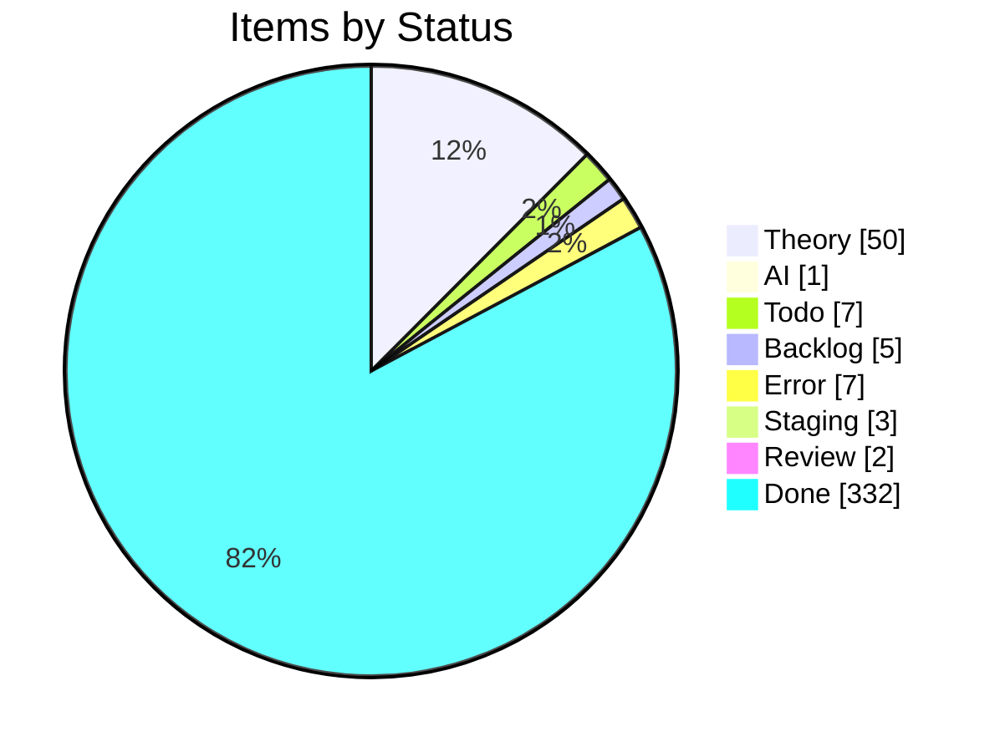
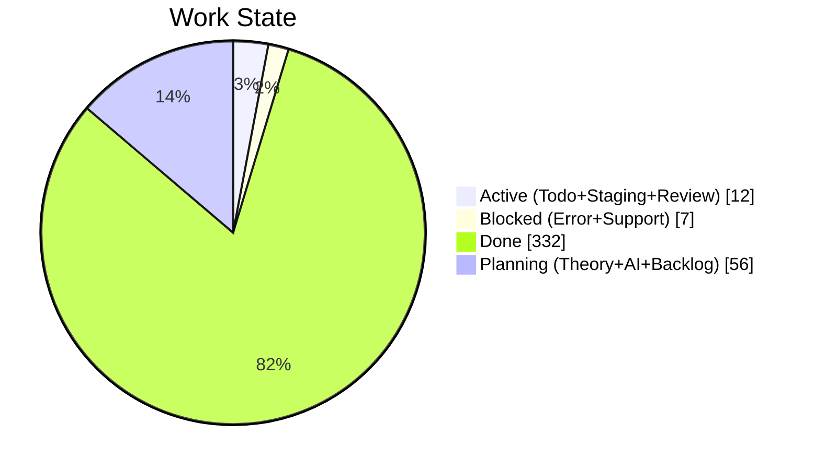

import { Card, CardGrid, Tabs, TabItem } from '@astrojs/starlight/components';

## Project Board Snapshot

:::note[Auto-generated]
Last synced: **2026-06-18T09:37:39.038Z** — updated daily by `ci-dashboard`.
Source: [KBVE Project Board](https://github.com/orgs/KBVE/projects/5)
:::

### Summary

<CardGrid>
  <Card title="Theory" icon="star">
    **50** items
  </Card>
  <Card title="AI" icon="rocket">
    **1** items
  </Card>
  <Card title="Todo" icon="list-format">
    **7** items
  </Card>
  <Card title="Backlog" icon="document">
    **5** items
  </Card>
  <Card title="Error" icon="warning">
    **7** items
  </Card>
  <Card title="Support" icon="information">
    **0** items
  </Card>
  <Card title="Staging" icon="setting">
    **3** items
  </Card>
  <Card title="Review" icon="approve-check">
    **2** items
  </Card>
  <Card title="Done" icon="approve-check-circle">
    **332** items
  </Card>
</CardGrid>

<Tabs>
  <TabItem label="Distribution">

  </TabItem>
  <TabItem label="Pipeline">

```mermaid
flowchart LR
    classDef planning fill:#8b5cf6,stroke:#6d28d9,color:#fff
    classDef active fill:#3b82f6,stroke:#1d4ed8,color:#fff
    classDef blocked fill:#ef4444,stroke:#b91c1c,color:#fff
    classDef done fill:#10b981,stroke:#059669,color:#fff
    Theory["Theory<br/><strong>50</strong>"]
    Theory --> AI
    AI["AI<br/><strong>1</strong>"]
    AI --> Todo
    Todo["Todo<br/><strong>7</strong>"]
    Todo --> Backlog
    Backlog["Backlog<br/><strong>5</strong>"]
    Backlog --> Error
    Error["Error<br/><strong>7</strong>"]
    Error --> Support
    Support["Support<br/><strong>0</strong>"]
    Support --> Staging
    Staging["Staging<br/><strong>3</strong>"]
    Staging --> Review
    Review["Review<br/><strong>2</strong>"]
    Review --> Done
    Done["Done<br/><strong>332</strong>"]
    class Theory,AI,Backlog planning
    class Todo,Staging,Review active
    class Error,Support blocked
    class Done done
```

:::tip[Legend]
**Purple** = Planning &nbsp; **Blue** = Active &nbsp; **Red** = Blocked &nbsp; **Green** = Done
:::

  </TabItem>
  <TabItem label="Breakdown">

#### Top Labels

| Label | Count |
|-------|:-----:|
| auto-pr | 317 |
| dev→main | 167 |
| atomic | 134 |
| enhancement | 62 |
| 0 | 19 |
| 1 | 14 |
| unity | 10 |
| bug | 10 |
| backlog | 8 |
| todo | 7 |

  </TabItem>
</Tabs>

### Theory (50)

| # | Title | Priority | Assignees | Labels |
|---|-------|----------|-----------|--------|
| [#2252](https://github.com/KBVE/kbve/issues/2252) | [Concept] : Shop Layout - Merch, Hardware, Services. | — | — | 1, enhancement |
| [#4643](https://github.com/KBVE/kbve/issues/4643) | [Concept] : [Unity] : Transport System | — | h0lybyte | 0, enhancement, unity |
| [#5624](https://github.com/KBVE/kbve/issues/5624) | [Concept] : Add Intel NUC worker nodes to existing Talos KBVE cluster | — | h0lybyte, Copilot | 0, enhancement |
| [#6437](https://github.com/KBVE/kbve/issues/6437) | [Concept] : [Unity] : Pathfinding ECS | — | h0lybyte | 0, enhancement, unity |
| [#6438](https://github.com/KBVE/kbve/issues/6438) | [Concept] : [Unity] : ItemDB ECS Migration | — | h0lybyte | 0, enhancement, unity |
| [#6576](https://github.com/KBVE/kbve/issues/6576) | [Concept] : [Unity] : Entity Blittable System | — | h0lybyte | 0, enhancement, unity |
| [#7730](https://github.com/KBVE/kbve/issues/7730) | [DISCORDSH] Rust-First Vote Process — Rate-Limited Server Voting Pipeline | — | h0lybyte | 1, enhancement, security |
| [#7593](https://github.com/KBVE/kbve/issues/7593) | [PG] Deploy CNPG Pooler (PgBouncer) and migrate services from direct -rw connect | — | h0lybyte | 2, enhancement, dependencies |
| [#8180](https://github.com/KBVE/kbve/issues/8180) | [DISCORDSH] POC: Mockoon docker-compose for local E2E testing | — | h0lybyte | 1, enhancement |
| [#8245](https://github.com/KBVE/kbve/issues/8245) | perf(dashboard): migrate ClickHouse queries to @kbve/droid worker pipeline with  | — | — | 1, enhancement |
| [#9789](https://github.com/KBVE/kbve/issues/9789) | [Dashboard] Forgejo dashboard expansion — token scopes, user management, DB role | — | — | 3, enhancement, ci |
| [#9724](https://github.com/KBVE/kbve/issues/9724) | [ISOMETRIC] [BEVY] Convert sprite atlases from PNG to KTX2 with basis universal  | — | h0lybyte | 1, enhancement |
| [#9588](https://github.com/KBVE/kbve/issues/9588) | [ISOMETRIC] Pixel Smoothing | — | h0lybyte | 0, enhancement |
| [#9850](https://github.com/KBVE/kbve/issues/9850) | feat(mud): data population, IRC deployment, and isometric integration for MUD co | — | h0lybyte | 2, enhancement |
| [#8254](https://github.com/KBVE/kbve/issues/8254) | feat(unreal): CI/CD pipeline for UEDevOps plugin (itch.io + Fab) | — | h0lybyte | 2, enhancement |
| [#10194](https://github.com/KBVE/kbve/issues/10194) | [DISCORDSH] [BEVY] Key Integration Gaps | — | — | enhancement |
| [#10979](https://github.com/KBVE/kbve/issues/10979) | feat(wallet): khash marketplace bootstrap (5-phase roadmap) | — | — | enhancement |
| [#10980](https://github.com/KBVE/kbve/issues/10980) | isometric: upgrade Bevy 0.18 → 0.19 + wgpu 27 → 29 | — | — | enhancement |
| [#11138](https://github.com/KBVE/kbve/issues/11138) | [Plan] Agones-managed Factorio dedicated server | — | — | enhancement |
| [#11244](https://github.com/KBVE/kbve/issues/11244) | [BEVY][ISOMETRIC] Refactor remaining menus to ui component library | — | — | enhancement |
| [#11246](https://github.com/KBVE/kbve/issues/11246) | [BEVY][ISOMETRIC] In-game chat overlay (incoming + outgoing) | — | — | enhancement |
| [#11247](https://github.com/KBVE/kbve/issues/11247) | [BEVY][ISOMETRIC] Toast styling pass — color accents + animations | — | — | enhancement |
| [#11262](https://github.com/KBVE/kbve/issues/11262) | feat(discordsh): /gh claim — Discord user self-assigns issue + KBVE profile link | — | — | enhancement |
| [#11294](https://github.com/KBVE/kbve/issues/11294) | feat(td-online): multiplayer tower defense — bevy+rapier2d sim, agones game serv | — | — | enhancement |
| [#11362](https://github.com/KBVE/kbve/issues/11362) | feat(astro-kbve,guild-vault): /dashboard/agents — multi-tenant bot management su | — | — | enhancement |
| [#11579](https://github.com/KBVE/kbve/issues/11579) | feat(laser): extract chat client into @kbve/laser for Phaser game embedding | — | — | enhancement |
| [#11580](https://github.com/KBVE/kbve/issues/11580) | feat(chat): proto + zod schema for ChatMessage envelope (bots, NOTICE, kinds) | — | — | enhancement |
| [#11582](https://github.com/KBVE/kbve/issues/11582) | harden(astro-irc): embed popup lifecycle + data-signin-url override | — | — | enhancement |
| [#11605](https://github.com/KBVE/kbve/issues/11605) | [isometric] WebGL2 fallback for browsers without WebGPU | — | — | 2, enhancement |
| [#12315](https://github.com/KBVE/kbve/issues/12315) | cryptothrone: zone-agnostic scenes + multi-area world model (city → world → town | — | — | enhancement |
| [#12360](https://github.com/KBVE/kbve/issues/12360) | cryptothrone: remaining scene/netcode abstraction layers (C8 + B4/B6) — successo | — | — | enhancement |
| [#12362](https://github.com/KBVE/kbve/issues/12362) | cryptothrone: playable as Discord Activity + standalone embed.js + itch (one mou | — | — | enhancement |
| [#12376](https://github.com/KBVE/kbve/issues/12376) | cryptothrone: ship to itch.io via embed.js (HTML5 build) — deferred after Discor | — | — | enhancement |
| [#12422](https://github.com/KBVE/kbve/issues/12422) | cryptothrone: decompose CloudCityScene into ECS systems over EntityStore (phased | — | — | enhancement |
| [#12484](https://github.com/KBVE/kbve/issues/12484) | [RN] [CRUX] Off Thread Networking | — | — | enhancement |
| [#12495](https://github.com/KBVE/kbve/issues/12495) | [RN] [WEB] Reuse React Native components on web via react-native-web + Astro | — | — | enhancement |
| [#12521](https://github.com/KBVE/kbve/issues/12521) | simgrid: player-to-player trading | — | — | enhancement |
| [#12519](https://github.com/KBVE/kbve/issues/12519) | cryptothrone: render status effects on the client | — | — | enhancement |
| [#12520](https://github.com/KBVE/kbve/issues/12520) | cryptothrone: Discord Activity end-to-end verify + boot polish | — | — | enhancement |
| [#12522](https://github.com/KBVE/kbve/issues/12522) | [RN] OAuth integration (Discord / GitHub / Twitch) | — | — | enhancement |
| [#12532](https://github.com/KBVE/kbve/issues/12532) | cryptothrone: Discord Activity mobile layout (safe-area + layout-mode + orientat | — | — | enhancement |
| [#12555](https://github.com/KBVE/kbve/issues/12555) | cryptothrone: fast-register Discord users (link-by-email, else create) | — | — | enhancement |
| [#12692](https://github.com/KBVE/kbve/issues/12692) | jobboard: validate discipline_ids references at membership submit/approval | — | — | enhancement, security |
| [#12694](https://github.com/KBVE/kbve/issues/12694) | jobboard-web: validate API responses at runtime with the generated zod schemas | — | — | enhancement, good first issue |
| [#12693](https://github.com/KBVE/kbve/issues/12693) | jobboard: write audit_log entries on membership approve/reject | — | — | enhancement, good first issue |
| [#12695](https://github.com/KBVE/kbve/issues/12695) | jobboard: complete the gRPC envelope or retire the dead bytes-id membership mess | — | — | enhancement, rust |
| [#12701](https://github.com/KBVE/kbve/issues/12701) | [Cryptothrone] Multiplayer blackjack mini-game at the casino table | — | — | enhancement |
| [#12702](https://github.com/KBVE/kbve/issues/12702) | [Cryptothrone] Internal coin economy (coin / gold-bar) — design &amp; isolation  | — | — | enhancement |
| [#12703](https://github.com/KBVE/kbve/issues/12703) | cryptothrone: bring map/tile data into the ECS MapSystem (phased) | — | — | enhancement |
| [#12705](https://github.com/KBVE/kbve/issues/12705) | cryptothrone: Discord Activity mobile + lobby — real-device verification &amp; p | — | — | enhancement |

### AI (1)

| # | Title | Priority | Assignees | Labels |
|---|-------|----------|-----------|--------|
| [#4906](https://github.com/KBVE/kbve/issues/4906) | [Bug] : [Unity] : Character Orchestrator | — | h0lybyte | 0, bug, unity |

### Todo (7)

| # | Title | Priority | Assignees | Labels |
|---|-------|----------|-----------|--------|
| [#3572](https://github.com/KBVE/kbve/issues/3572) | [Update] : [Fudster] : User Billing &amp; Auth | — | h0lybyte | 1, security, update |
| [#4232](https://github.com/KBVE/kbve/issues/4232) | [Update] : [Github] : Rotate Tokens + Refactor Permissions | — | h0lybyte | 1, security, update |
| [#6939](https://github.com/KBVE/kbve/issues/6939) | [EPIC] Agent Orchestration Tab | — | — | 0, todo |
| [#8134](https://github.com/KBVE/kbve/issues/8134) | feat(proto): ClickHouse schema source of truth via protobuf → zod → vector pipel | — | h0lybyte | 4, documentation, todo |
| [#8148](https://github.com/KBVE/kbve/issues/8148) | [PSQL] Audit Discord Public Server Listing Functions | — | h0lybyte | 3, security, todo |
| [#8817](https://github.com/KBVE/kbve/issues/8817) | [E2E] kilobase needs pgrx/PostgreSQL build environment | — | h0lybyte | 1, todo |
| [#11013](https://github.com/KBVE/kbve/issues/11013) | [CICD] [Github] Migrate workflows to arc-runner-set-kbve + strip apt-install ban | — | — | enhancement, update |

### Backlog (5)

| # | Title | Priority | Assignees | Labels |
|---|-------|----------|-----------|--------|
| [#75](https://github.com/KBVE/kbve/issues/75) | [Concept] : HerbMail.com - Front Page | — | — | 1, backlog |
| [#96](https://github.com/KBVE/kbve/issues/96) | [Concept] : [Backend] : Charles. | — | h0lybyte | 0, backlog |
| [#4642](https://github.com/KBVE/kbve/issues/4642) | [Concept] : [Unity] : Droid System - Hybrid NPC System. | — | h0lybyte | 0, enhancement, backlog |
| [#7548](https://github.com/KBVE/kbve/issues/7548) | feat(memes): responsive bento grid feed + dedicated meme pages | — | h0lybyte | 1, backlog |
| [#11250](https://github.com/KBVE/kbve/issues/11250) | feat(ci-dbmate-deploy): bake migrations into OCI image for cap-free deploys | — | — | enhancement, backlog |

### Error (7)

| # | Title | Priority | Assignees | Labels |
|---|-------|----------|-----------|--------|
| [#2992](https://github.com/KBVE/kbve/issues/2992) | [Bug] LofiFocus is down - [PENDING] Ingress | — | h0lybyte | 0, bug |
| [#3536](https://github.com/KBVE/kbve/issues/3536) | [Bug] : Update CONTRIBUE.MD | — | h0lybyte | 0, bug |
| [#3538](https://github.com/KBVE/kbve/issues/3538) | [Bug] : [Unity] : Gameplay Mechanics - Farming &amp; Crafting | — | h0lybyte | 0, bug, unity |
| [#6705](https://github.com/KBVE/kbve/issues/6705) | [Bug] : [Unity] : Chip Character Sheet Off Center Sprites | — | h0lybyte | 0, bug, unity |
| [#9182](https://github.com/KBVE/kbve/issues/9182) | [ROWS] Performance Audit — missing indexes, unbounded caches, query optimization | — | h0lybyte | 6, bug, enhancement |
| [#9205](https://github.com/KBVE/kbve/issues/9205) | feat(rows): pass zone instance ID to allocated game servers + unify launcher arc | — | h0lybyte | 2, bug |
| [#8815](https://github.com/KBVE/kbve/issues/8815) | [E2E] bevy_* projects need Rust + wasm32 toolchain in CI | — | h0lybyte | 0, bug, ci |

### Staging (3)

| # | Title | Priority | Assignees | Labels |
|---|-------|----------|-----------|--------|
| [#2208](https://github.com/KBVE/kbve/issues/2208) | [Concept] Service Page Enchancemnts | — | h0lybyte, dladeira | 4 |
| [#2267](https://github.com/KBVE/kbve/issues/2267) | [Concept] : CryptoThrone.com - King of the Hill App/Game | — | h0lybyte, BChip | 6 |
| [#6943](https://github.com/KBVE/kbve/issues/6943) | Phase 2: Frontend - Orchestration Tab | — | — | todo |

### Review (2)

| # | Title | Priority | Assignees | Labels |
|---|-------|----------|-----------|--------|
| [#12712](https://github.com/KBVE/kbve/pull/12712) | Atomic: rows fleet beta prod | — | — | auto-pr, atomic |
| [#12714](https://github.com/KBVE/kbve/pull/12714) | Release: 1 feature, 2 fixes, 1 refactor, 1 chore → Main | — | — | auto-pr, dev→main |

### Done (332)

| # | Title | Priority | Assignees | Labels |
|---|-------|----------|-----------|--------|
| [#416](https://github.com/KBVE/kbve/issues/416) | [Concept] : FlyIO Deployment | — | — | 0, backlog |
| [#1559](https://github.com/KBVE/kbve/issues/1559) | [Concept] : Adding TailwindCSS Example Components | — | — | 2, backlog |
| [#2362](https://github.com/KBVE/kbve/issues/2362) | [Concept] : [ItemDB] - Rigged Dice - 6 Items | — | h0lybyte | 1, enhancement |
| [#3472](https://github.com/KBVE/kbve/issues/3472) | [Concept] : [Unity] : TileMap GameObject | — | h0lybyte | 0, enhancement, unity |
| [#4538](https://github.com/KBVE/kbve/issues/4538) | [Bug] : [Unity] : Multiplayer / Steam Integration | — | h0lybyte | 0, bug, unity |
| [#7547](https://github.com/KBVE/kbve/issues/7547) | [MC] [Pumpkin] Implement CMerchantOffers packet and Merchant Trading GUI | — | h0lybyte | 0, enhancement |
| [#7709](https://github.com/KBVE/kbve/issues/7709) | [CRYPTOTHRONE] Inventory System, Event Bridge, and Gameplay Loop Completion | — | h0lybyte | 1, enhancement, backlog |
| [#8169](https://github.com/KBVE/kbve/issues/8169) | [CI] Docker image version mismatch — cached binary reports stale version | — | — | 6, bug, ci |
| [#8170](https://github.com/KBVE/kbve/issues/8170) | feat(proto): ArgoCD application state schema via protobuf → zod → edge pipeline | — | h0lybyte | 4, documentation, todo |
| [#9334](https://github.com/KBVE/kbve/issues/9334) | [ROWS] v0.4/v0.5 — Complete migration from C# OWS to Rust ROWS | — | h0lybyte | 6, enhancement, todo |
| [#9809](https://github.com/KBVE/kbve/issues/9809) | [UE5] Windows plugin build pipeline — runner agent, file-server proxy, Win64 Bui | — | h0lybyte | 6, ci, ue |
| [#9805](https://github.com/KBVE/kbve/issues/9805) | [ROWS] v0.5 — Remove legacy C# OWS microservices | — | h0lybyte | 1, dependencies, ci |
| [#9230](https://github.com/KBVE/kbve/issues/9230) | [CHUCKRPG] [UNREAL] Version Control from Monorepo | — | h0lybyte | 1, ue |
| [#10560](https://github.com/KBVE/kbve/issues/10560) | chore(redis): evaluate Bitnami chart bump 21.2.13 -&gt; 25.x | — | — | update |
| [#11726](https://github.com/KBVE/kbve/pull/11726) | Release: 3 features, 4 fixes, 1 doc, 5 perfs, 1 refactor, 3 chores → Main | — | — | auto-pr, dev→main |
| [#11756](https://github.com/KBVE/kbve/pull/11756) | Atomic: kasm-void v0.0.3 post-publish sync | — | — | auto-pr, atomic |
| [#11757](https://github.com/KBVE/kbve/pull/11757) | Release: 1 chore → Main | — | — | auto-pr, dev→main |
| [#11759](https://github.com/KBVE/kbve/pull/11759) | Release: 21 features, 4 fixes, 1 perf, 3 chores → Main | — | — | auto-pr, dev→main |
| [#11760](https://github.com/KBVE/kbve/pull/11760) | chore(dashboard): daily sync — 2026-06-04 | — | — | auto-pr |
| [#11763](https://github.com/KBVE/kbve/pull/11763) | Atomic: edge v0.1.35 post-publish sync | — | — | auto-pr, atomic |
| [#11770](https://github.com/KBVE/kbve/pull/11770) | Atomic: kasm-void v0.0.4 post-publish sync | — | — | auto-pr, atomic |
| [#11771](https://github.com/KBVE/kbve/pull/11771) | Release: 3 fixes, 2 chores → Main | — | — | auto-pr, dev→main |
| [#11777](https://github.com/KBVE/kbve/pull/11777) | Release: 2 features, 1 fix, 1 chore → Main | — | — | auto-pr, dev→main |
| [#11778](https://github.com/KBVE/kbve/pull/11778) | Atomic: axum-kbve v1.0.182 post-publish sync | — | — | auto-pr, atomic |
| [#11782](https://github.com/KBVE/kbve/pull/11782) | Release: 7 features, 1 fix, 1 perf, 1 chore → Main | — | — | auto-pr, dev→main |
| [#11788](https://github.com/KBVE/kbve/pull/11788) | Release: 3 fixes, 1 chore → Main | — | — | auto-pr, dev→main |
| [#11791](https://github.com/KBVE/kbve/pull/11791) | chore(dashboard): daily sync — 2026-06-05 | — | — | auto-pr |
| [#11792](https://github.com/KBVE/kbve/pull/11792) | Release: 3 features, 2 fixes, 5 chores → Main | — | — | auto-pr, dev→main |
| [#11795](https://github.com/KBVE/kbve/pull/11795) | Atomic: axum-kbve v1.0.183 post-publish sync | — | — | auto-pr, atomic |
| [#11799](https://github.com/KBVE/kbve/pull/11799) | Atomic: edge v0.1.36 post-publish sync | — | — | auto-pr, atomic |
| [#11805](https://github.com/KBVE/kbve/pull/11805) | Atomic: edge v0.1.37 post-publish sync | — | — | auto-pr, atomic |
| [#11806](https://github.com/KBVE/kbve/pull/11806) | Release: 1 feature, 2 chores → Main | — | — | auto-pr, dev→main |
| [#11807](https://github.com/KBVE/kbve/pull/11807) | Atomic: kasm-void v0.0.5 post-publish sync | — | — | auto-pr, atomic |
| [#11810](https://github.com/KBVE/kbve/pull/11810) | Release: 1 chore → Main | — | — | auto-pr, dev→main |
| [#11812](https://github.com/KBVE/kbve/pull/11812) | Release: 1 fix → Main | — | — | auto-pr, dev→main |
| [#11814](https://github.com/KBVE/kbve/pull/11814) | Release: 1 fix → Main | — | — | auto-pr, dev→main |
| [#11816](https://github.com/KBVE/kbve/pull/11816) | Release: 2 fixes → Main | — | — | auto-pr, dev→main |
| [#11817](https://github.com/KBVE/kbve/pull/11817) | Atomic: builder http egress | — | — | auto-pr, atomic |
| [#11820](https://github.com/KBVE/kbve/pull/11820) | Atomic: rdp multisession | — | — | auto-pr, atomic |
| [#11821](https://github.com/KBVE/kbve/pull/11821) | Release: 5 fixes, 1 CI, 1 chore → Main | — | — | auto-pr, dev→main |
| [#11823](https://github.com/KBVE/kbve/pull/11823) | Atomic: vnc viewport resize | — | — | auto-pr, atomic |
| [#11832](https://github.com/KBVE/kbve/pull/11832) | Release: 1 fix → Main | — | — | auto-pr, dev→main |
| [#11834](https://github.com/KBVE/kbve/pull/11834) | chore(dashboard): daily sync — 2026-06-06 | — | — | auto-pr |
| [#11835](https://github.com/KBVE/kbve/pull/11835) | Release: 2 features, 2 fixes, 1 CI, 2 chores → Main | — | — | auto-pr, dev→main |
| [#11837](https://github.com/KBVE/kbve/pull/11837) | Atomic: axum-kbve v1.0.184 post-publish sync | — | — | auto-pr, atomic |
| [#11840](https://github.com/KBVE/kbve/pull/11840) | Atomic: kbve-kubectl v0.1.4 post-publish sync | — | — | auto-pr, atomic |
| [#11841](https://github.com/KBVE/kbve/pull/11841) | Release: 4 features, 1 fix, 1 chore → Main | — | — | auto-pr, dev→main |
| [#11842](https://github.com/KBVE/kbve/pull/11842) | Atomic: vnc canvas resize | — | — | auto-pr, atomic |
| [#11847](https://github.com/KBVE/kbve/pull/11847) | Release: 3 features, 1 fix, 1 chore → Main | — | — | auto-pr, dev→main |
| [#11848](https://github.com/KBVE/kbve/pull/11848) | Release: 9 features, 5 fixes, 1 CI → Main | — | — | auto-pr, dev→main |
| [#11860](https://github.com/KBVE/kbve/pull/11860) | Release: 1 feature, 3 fixes, 2 perfs, 1 test, 2 chores → Main | — | — | auto-pr, dev→main |
| [#11867](https://github.com/KBVE/kbve/pull/11867) | Atomic: edge v0.1.38 post-publish sync | — | — | auto-pr, atomic |
| [#11868](https://github.com/KBVE/kbve/pull/11868) | Release: 4 features, 5 fixes, 3 perfs, 1 test, 1 chore → Main | — | — | auto-pr, dev→main |
| [#11885](https://github.com/KBVE/kbve/pull/11885) | Release: 3 features, 4 fixes, 1 perf, 1 refactor, 1 test, 1 chore → Main | — | — | auto-pr, dev→main |
| [#11897](https://github.com/KBVE/kbve/pull/11897) | Release: 2 features, 1 fix, 1 chore → Main | — | — | auto-pr, dev→main |
| [#11898](https://github.com/KBVE/kbve/pull/11898) | Atomic: arc-runner v0.1.4 post-publish sync | — | — | auto-pr, atomic |
| [#11904](https://github.com/KBVE/kbve/pull/11904) | Release: 4 fixes, 2 perfs, 1 chore → Main | — | — | auto-pr, dev→main |
| [#11911](https://github.com/KBVE/kbve/pull/11911) | Atomic: axum-kbve v1.0.185 post-publish sync | — | — | auto-pr, atomic |
| [#11915](https://github.com/KBVE/kbve/pull/11915) | Atomic: vnc screen fill | — | — | auto-pr, atomic |
| [#11916](https://github.com/KBVE/kbve/pull/11916) | Atomic: vnc publish bump | — | — | auto-pr, atomic |
| [#11917](https://github.com/KBVE/kbve/pull/11917) | Release: 1 chore → Main | — | — | auto-pr, dev→main |
| [#11918](https://github.com/KBVE/kbve/pull/11918) | Release: 7 features, 4 fixes, 1 chore → Main | — | — | auto-pr, dev→main |
| [#11921](https://github.com/KBVE/kbve/pull/11921) | Atomic: axum-kbve v1.0.186 post-publish sync | — | — | auto-pr, atomic |
| [#11934](https://github.com/KBVE/kbve/pull/11934) | Release: 6 features, 8 fixes, 1 refactor, 1 chore → Main | — | — | auto-pr, dev→main |
| [#11938](https://github.com/KBVE/kbve/pull/11938) | Atomic: rareicon v0.1.8 post-publish sync | — | — | auto-pr, atomic |
| [#11945](https://github.com/KBVE/kbve/pull/11945) | Release: 7 features, 1 doc, 2 chores → Main | — | — | auto-pr, dev→main |
| [#11950](https://github.com/KBVE/kbve/pull/11950) | Atomic: irc-gateway v0.1.21 post-publish sync | — | — | auto-pr, atomic |
| [#11952](https://github.com/KBVE/kbve/pull/11952) | Atomic: cryptothrone v0.1.6 post-publish sync | — | — | auto-pr, atomic |
| [#11954](https://github.com/KBVE/kbve/pull/11954) | Release: 1 feature, 2 fixes, 1 refactor, 2 chores → Main | — | — | auto-pr, dev→main |
| [#11960](https://github.com/KBVE/kbve/pull/11960) | Release: 8 features, 1 fix, 1 CI, 1 build, 1 refactor, 3 chores → Main | — | — | auto-pr, dev→main |
| [#11966](https://github.com/KBVE/kbve/pull/11966) | Atomic: cryptothrone v0.1.7 post-publish sync | — | — | auto-pr, atomic |
| [#11968](https://github.com/KBVE/kbve/pull/11968) | Atomic: axum-kbve v1.0.187 post-publish sync | — | — | auto-pr, atomic |
| [#11977](https://github.com/KBVE/kbve/pull/11977) | Atomic: edge v0.1.39 post-publish sync | — | — | auto-pr, atomic |
| [#11978](https://github.com/KBVE/kbve/pull/11978) | Release: 5 features, 1 fix, 1 doc, 2 refactors, 6 chores → Main | — | — | auto-pr, dev→main |
| [#11980](https://github.com/KBVE/kbve/pull/11980) | Atomic: rows v0.1.25 post-publish sync | — | — | auto-pr, atomic |
| [#11989](https://github.com/KBVE/kbve/pull/11989) | chore(dashboard): daily sync — 2026-06-07 | — | — | auto-pr |
| [#11994](https://github.com/KBVE/kbve/pull/11994) | Release: 7 features, 2 fixes, 4 refactors, 2 chores → Main | — | — | auto-pr, dev→main |
| [#12003](https://github.com/KBVE/kbve/pull/12003) | Release: 1 fix → Main | — | — | auto-pr, dev→main |
| [#12004](https://github.com/KBVE/kbve/pull/12004) | Release: 2 features, 3 fixes, 1 refactor → Main | — | — | auto-pr, dev→main |
| [#12008](https://github.com/KBVE/kbve/pull/12008) | Atomic: axum-kbve v1.0.188 post-publish sync | — | — | auto-pr, atomic |
| [#12011](https://github.com/KBVE/kbve/pull/12011) | Release: 1 fix → Main | — | — | auto-pr, dev→main |
| [#12014](https://github.com/KBVE/kbve/pull/12014) | Release: 3 features → Main | — | — | auto-pr, dev→main |
| [#12016](https://github.com/KBVE/kbve/pull/12016) | Release: 3 features, 3 fixes, 3 chores → Main | — | — | auto-pr, dev→main |
| [#12019](https://github.com/KBVE/kbve/pull/12019) | Release: 5 features, 9 fixes, 1 doc, 2 chores → Main | — | — | auto-pr, dev→main |
| [#12020](https://github.com/KBVE/kbve/pull/12020) | Atomic: edge v0.1.40 post-publish sync | — | — | auto-pr, atomic |
| [#12022](https://github.com/KBVE/kbve/pull/12022) | Atomic: axum-kbve v1.0.189 post-publish sync | — | — | auto-pr, atomic |
| [#12025](https://github.com/KBVE/kbve/pull/12025) | Release: 1 fix, 2 chores → Main | — | — | auto-pr, dev→main |
| [#12026](https://github.com/KBVE/kbve/pull/12026) | Atomic: axum-kbve v1.0.190 post-publish sync | — | — | auto-pr, atomic |
| [#12027](https://github.com/KBVE/kbve/pull/12027) | Release: 1 chore → Main | — | — | auto-pr, dev→main |
| [#12028](https://github.com/KBVE/kbve/pull/12028) | Atomic: edge v0.1.41 post-publish sync | — | — | auto-pr, atomic |
| [#12029](https://github.com/KBVE/kbve/pull/12029) | Release: 1 chore → Main | — | — | auto-pr, dev→main |
| [#12032](https://github.com/KBVE/kbve/pull/12032) | Release: 1 fix → Main | — | — | auto-pr, dev→main |
| [#12035](https://github.com/KBVE/kbve/pull/12035) | Release: 1 feature, 2 fixes, 1 chore → Main | — | — | auto-pr, dev→main |
| [#12038](https://github.com/KBVE/kbve/pull/12038) | Release: 1 fix → Main | — | — | auto-pr, dev→main |
| [#12039](https://github.com/KBVE/kbve/pull/12039) | Release: 1 feature, 2 fixes → Main | — | — | auto-pr, dev→main |
| [#12043](https://github.com/KBVE/kbve/pull/12043) | Release: 2 fixes → Main | — | — | auto-pr, dev→main |
| [#12044](https://github.com/KBVE/kbve/pull/12044) | Release: 7 features, 3 fixes, 1 perf, 1 chore → Main | — | — | auto-pr, dev→main |
| [#12059](https://github.com/KBVE/kbve/pull/12059) | Atomic: edge v0.1.42 post-publish sync | — | — | auto-pr, atomic |
| [#12062](https://github.com/KBVE/kbve/pull/12062) | Release: 3 features, 3 chores → Main | — | — | auto-pr, dev→main |
| [#12064](https://github.com/KBVE/kbve/pull/12064) | chore(dashboard): daily sync — 2026-06-08 | — | — | auto-pr |
| [#12065](https://github.com/KBVE/kbve/pull/12065) | Atomic: axum-kbve v1.0.191 post-publish sync | — | — | auto-pr, atomic |
| [#12068](https://github.com/KBVE/kbve/pull/12068) | Release: 9 features, 5 fixes, 1 CI, 1 refactor, 7 chores → Main | — | — | auto-pr, dev→main |
| [#12081](https://github.com/KBVE/kbve/pull/12081) | Release: 4 features, 2 fixes, 1 perf, 3 chores → Main | — | — | auto-pr, dev→main |
| [#12084](https://github.com/KBVE/kbve/pull/12084) | Atomic: axum-kbve v1.0.192 post-publish sync | — | — | auto-pr, atomic |
| [#12085](https://github.com/KBVE/kbve/pull/12085) | chore(dashboard): daily sync — 2026-06-09 | — | — | auto-pr |
| [#12091](https://github.com/KBVE/kbve/pull/12091) | Atomic: adsense redirect guard | — | — | auto-pr, atomic |
| [#12092](https://github.com/KBVE/kbve/pull/12092) | Release: 1 feature, 1 fix → Main | — | — | auto-pr, dev→main |
| [#12094](https://github.com/KBVE/kbve/pull/12094) | Release: 1 fix, 1 chore → Main | — | — | auto-pr, dev→main |
| [#12095](https://github.com/KBVE/kbve/pull/12095) | Atomic: axum-kbve v1.0.193 post-publish sync | — | — | auto-pr, atomic |
| [#12096](https://github.com/KBVE/kbve/pull/12096) | Atomic: bump kbve 1 0 194 | — | — | auto-pr, atomic |
| [#12097](https://github.com/KBVE/kbve/pull/12097) | Release: 1 chore → Main | — | — | auto-pr, dev→main |
| [#12099](https://github.com/KBVE/kbve/pull/12099) | Release: 4 features, 2 chores → Main | — | — | auto-pr, dev→main |
| [#12101](https://github.com/KBVE/kbve/pull/12101) | Atomic: axum-kbve v1.0.194 post-publish sync | — | — | auto-pr, atomic |
| [#12102](https://github.com/KBVE/kbve/pull/12102) | Release: 1 feature, 1 fix → Main | — | — | auto-pr, dev→main |
| [#12104](https://github.com/KBVE/kbve/pull/12104) | chore(dashboard): daily sync — 2026-06-10 | — | — | auto-pr |
| [#12105](https://github.com/KBVE/kbve/pull/12105) | Release: 2 fixes, 1 chore → Main | — | — | auto-pr, dev→main |
| [#12108](https://github.com/KBVE/kbve/pull/12108) | Release: 4 features, 1 fix → Main | — | — | auto-pr, dev→main |
| [#12114](https://github.com/KBVE/kbve/pull/12114) | Release: 3 features, 2 fixes → Main | — | — | auto-pr, dev→main |
| [#12117](https://github.com/KBVE/kbve/pull/12117) | Release: 1 feature, 2 fixes → Main | — | — | auto-pr, dev→main |
| [#12120](https://github.com/KBVE/kbve/pull/12120) | Release: 2 features, 1 chore → Main | — | — | auto-pr, dev→main |
| [#12125](https://github.com/KBVE/kbve/pull/12125) | Release: 1 feature, 1 fix → Main | — | — | auto-pr, dev→main |
| [#12128](https://github.com/KBVE/kbve/pull/12128) | Release: 7 features, 4 fixes, 2 perfs, 1 chore → Main | — | — | auto-pr, dev→main |
| [#12140](https://github.com/KBVE/kbve/pull/12140) | Release: 3 features, 1 fix, 3 perfs, 1 chore → Main | — | — | auto-pr, dev→main |
| [#12145](https://github.com/KBVE/kbve/pull/12145) | Release: 1 feature, 3 fixes, 1 perf, 1 chore → Main | — | — | auto-pr, dev→main |
| [#12146](https://github.com/KBVE/kbve/pull/12146) | Atomic: cryptothrone v0.1.8 post-publish sync | — | — | auto-pr, atomic |
| [#12151](https://github.com/KBVE/kbve/pull/12151) | Release: 4 features, 1 chore → Main | — | — | auto-pr, dev→main |
| [#12158](https://github.com/KBVE/kbve/pull/12158) | Release: 2 features, 2 fixes, 1 perf, 1 chore → Main | — | — | auto-pr, dev→main |
| [#12159](https://github.com/KBVE/kbve/pull/12159) | Atomic: discordsh-bot v0.1.19 post-publish sync | — | — | auto-pr, atomic |
| [#12160](https://github.com/KBVE/kbve/pull/12160) | Release: 2 chores → Main | — | — | auto-pr, dev→main |
| [#12161](https://github.com/KBVE/kbve/pull/12161) | Atomic: cryptothrone v0.1.9 post-publish sync | — | — | auto-pr, atomic |
| [#12162](https://github.com/KBVE/kbve/pull/12162) | Release: 9 features, 2 fixes, 1 perf, 2 chores → Main | — | — | auto-pr, dev→main |
| [#12169](https://github.com/KBVE/kbve/pull/12169) | chore(dashboard): daily sync — 2026-06-11 | — | — | auto-pr |
| [#12172](https://github.com/KBVE/kbve/pull/12172) | Release: 1 feature, 1 fix, 1 CI, 1 chore → Main | — | — | auto-pr, dev→main |
| [#12175](https://github.com/KBVE/kbve/pull/12175) | Atomic: rareicon v0.1.9 post-publish sync | — | — | auto-pr, atomic |
| [#12179](https://github.com/KBVE/kbve/pull/12179) | Release: 1 fix → Main | — | — | auto-pr, dev→main |
| [#12180](https://github.com/KBVE/kbve/pull/12180) | Release: 3 features, 1 fix → Main | — | — | auto-pr, dev→main |
| [#12184](https://github.com/KBVE/kbve/pull/12184) | Release: 10 features, 2 fixes, 1 doc, 2 CI, 2 chores → Main | — | — | auto-pr, dev→main |
| [#12193](https://github.com/KBVE/kbve/pull/12193) | chore(dashboard): daily sync — 2026-06-12 | — | — | auto-pr |
| [#12194](https://github.com/KBVE/kbve/pull/12194) | Atomic: cryptothrone-server v0.0.2 post-publish sync | — | — | auto-pr, atomic |
| [#12195](https://github.com/KBVE/kbve/pull/12195) | Release: 2 chores → Main | — | — | auto-pr, dev→main |
| [#12199](https://github.com/KBVE/kbve/pull/12199) | Atomic: cryptothrone v0.1.10 post-publish sync | — | — | auto-pr, atomic |
| [#12200](https://github.com/KBVE/kbve/pull/12200) | Release: 1 feature, 1 fix, 2 chores → Main | — | — | auto-pr, dev→main |
| [#12203](https://github.com/KBVE/kbve/pull/12203) | Atomic: cryptothrone-server v0.0.3 post-publish sync | — | — | auto-pr, atomic |
| [#12204](https://github.com/KBVE/kbve/pull/12204) | Release: 1 chore → Main | — | — | auto-pr, dev→main |
| [#12208](https://github.com/KBVE/kbve/pull/12208) | Release: 2 features, 1 fix, 1 chore → Main | — | — | auto-pr, dev→main |
| [#12209](https://github.com/KBVE/kbve/pull/12209) | Atomic: cryptothrone v0.1.11 post-publish sync | — | — | auto-pr, atomic |
| [#12213](https://github.com/KBVE/kbve/pull/12213) | Release: 3 features, 1 chore → Main | — | — | auto-pr, dev→main |
| [#12216](https://github.com/KBVE/kbve/pull/12216) | Release: 5 features, 3 fixes, 1 perf, 1 chore → Main | — | — | auto-pr, dev→main |
| [#12226](https://github.com/KBVE/kbve/pull/12226) | Release: 2 features, 2 fixes, 3 chores → Main | — | — | auto-pr, dev→main |
| [#12232](https://github.com/KBVE/kbve/pull/12232) | Atomic: axum-kbve v1.0.196 post-publish sync | — | — | auto-pr, atomic |
| [#12233](https://github.com/KBVE/kbve/pull/12233) | Atomic: cryptothrone-server v0.0.4 post-publish sync | — | — | auto-pr, atomic |
| [#12234](https://github.com/KBVE/kbve/pull/12234) | Release: 1 feature, 1 refactor, 2 chores → Main | — | — | auto-pr, dev→main |
| [#12236](https://github.com/KBVE/kbve/pull/12236) | Atomic: cryptothrone v0.1.12 post-publish sync | — | — | auto-pr, atomic |
| [#12239](https://github.com/KBVE/kbve/pull/12239) | Release: 1 fix → Main | — | — | auto-pr, dev→main |
| [#12241](https://github.com/KBVE/kbve/pull/12241) | Release: 1 feature, 3 fixes → Main | — | — | auto-pr, dev→main |
| [#12247](https://github.com/KBVE/kbve/pull/12247) | Release: 1 feature → Main | — | — | auto-pr, dev→main |
| [#12251](https://github.com/KBVE/kbve/pull/12251) | Release: 2 features, 1 fix, 1 chore → Main | — | — | auto-pr, dev→main |
| [#12253](https://github.com/KBVE/kbve/pull/12253) | Atomic: cryptothrone-server v0.0.5 post-publish sync | — | — | auto-pr, atomic |
| [#12254](https://github.com/KBVE/kbve/pull/12254) | Release: 2 chores → Main | — | — | auto-pr, dev→main |
| [#12255](https://github.com/KBVE/kbve/pull/12255) | Atomic: cryptothrone v0.1.13 post-publish sync | — | — | auto-pr, atomic |
| [#12258](https://github.com/KBVE/kbve/pull/12258) | Release: 1 feature, 1 fix → Main | — | — | auto-pr, dev→main |
| [#12262](https://github.com/KBVE/kbve/pull/12262) | Release: 2 fixes → Main | — | — | auto-pr, dev→main |
| [#12265](https://github.com/KBVE/kbve/pull/12265) | Release: 4 features, 1 fix → Main | — | — | auto-pr, dev→main |
| [#12271](https://github.com/KBVE/kbve/pull/12271) | Atomic: cryptothrone-server v0.0.7 post-publish sync | — | — | auto-pr, atomic |
| [#12273](https://github.com/KBVE/kbve/pull/12273) | Release: 5 chores → Main | — | — | auto-pr, dev→main |
| [#12274](https://github.com/KBVE/kbve/pull/12274) | Atomic: irc-gateway v0.1.22 post-publish sync | — | — | auto-pr, atomic |
| [#12275](https://github.com/KBVE/kbve/pull/12275) | Atomic: cryptothrone v0.1.15 post-publish sync | — | — | auto-pr, atomic |
| [#12276](https://github.com/KBVE/kbve/pull/12276) | Atomic: cryptothrone-server v0.0.8 post-publish sync | — | — | auto-pr, atomic |
| [#12277](https://github.com/KBVE/kbve/pull/12277) | Release: 2 features, 2 fixes, 1 perf, 2 chores → Main | — | — | auto-pr, dev→main |
| [#12280](https://github.com/KBVE/kbve/pull/12280) | Atomic: cryptothrone v0.1.16 post-publish sync | — | — | auto-pr, atomic |
| [#12285](https://github.com/KBVE/kbve/pull/12285) | Release: 2 chores → Main | — | — | auto-pr, dev→main |
| [#12286](https://github.com/KBVE/kbve/pull/12286) | Atomic: cryptothrone-server v0.0.9 post-publish sync | — | — | auto-pr, atomic |
| [#12288](https://github.com/KBVE/kbve/pull/12288) | Atomic: cryptothrone v0.1.17 post-publish sync | — | — | auto-pr, atomic |
| [#12289](https://github.com/KBVE/kbve/pull/12289) | Release: 1 chore → Main | — | — | auto-pr, dev→main |
| [#12290](https://github.com/KBVE/kbve/pull/12290) | chore(dashboard): daily sync — 2026-06-13 | — | — | auto-pr |
| [#12291](https://github.com/KBVE/kbve/pull/12291) | Release: 2 features, 2 chores → Main | — | — | auto-pr, dev→main |
| [#12296](https://github.com/KBVE/kbve/pull/12296) | Atomic: cryptothrone-server v0.0.10 post-publish sync | — | — | auto-pr, atomic |
| [#12297](https://github.com/KBVE/kbve/pull/12297) | Release: 2 features, 1 chore → Main | — | — | auto-pr, dev→main |
| [#12300](https://github.com/KBVE/kbve/pull/12300) | Atomic: cryptothrone v0.1.18 post-publish sync | — | — | auto-pr, atomic |
| [#12301](https://github.com/KBVE/kbve/pull/12301) | Release: 2 features, 2 fixes, 2 chores → Main | — | — | auto-pr, dev→main |
| [#12308](https://github.com/KBVE/kbve/pull/12308) | Release: 5 features, 1 fix, 3 chores → Main | — | — | auto-pr, dev→main |
| [#12309](https://github.com/KBVE/kbve/pull/12309) | Atomic: cryptothrone-server v0.0.11 post-publish sync | — | — | auto-pr, atomic |
| [#12310](https://github.com/KBVE/kbve/pull/12310) | Atomic: arc-runner v0.1.5 post-publish sync | — | — | auto-pr, atomic |
| [#12314](https://github.com/KBVE/kbve/pull/12314) | Atomic: cryptothrone v0.1.19 post-publish sync | — | — | auto-pr, atomic |
| [#12318](https://github.com/KBVE/kbve/pull/12318) | Release: 1 feature, 1 fix → Main | — | — | auto-pr, dev→main |
| [#12321](https://github.com/KBVE/kbve/pull/12321) | Release: 1 feature, 1 refactor, 3 chores → Main | — | — | auto-pr, dev→main |
| [#12324](https://github.com/KBVE/kbve/pull/12324) | Release: 2 features, 3 fixes, 1 perf, 3 chores → Main | — | — | auto-pr, dev→main |
| [#12326](https://github.com/KBVE/kbve/pull/12326) | Atomic: cryptothrone-server v0.0.12 post-publish sync | — | — | auto-pr, atomic |
| [#12328](https://github.com/KBVE/kbve/pull/12328) | Atomic: axum-kbve v1.0.197 post-publish sync | — | — | auto-pr, atomic |
| [#12335](https://github.com/KBVE/kbve/pull/12335) | Release: 1 feature, 2 fixes, 1 doc → Main | — | — | auto-pr, dev→main |
| [#12340](https://github.com/KBVE/kbve/issues/12340) | cryptothrone: sequenced rollout of UI / netcode / scene / server abstraction lay | — | — | enhancement |
| [#12342](https://github.com/KBVE/kbve/pull/12342) | Release: 2 features, 1 doc, 2 chores → Main | — | — | auto-pr, dev→main |
| [#12343](https://github.com/KBVE/kbve/issues/12343) | jedi: PgCluster improvements — observability, hardening, primitive expansion | — | — | enhancement |
| [#12344](https://github.com/KBVE/kbve/pull/12344) | Atomic: cryptothrone v0.1.20 post-publish sync | — | — | auto-pr, atomic |
| [#12350](https://github.com/KBVE/kbve/pull/12350) | Atomic: cryptothrone-server v0.0.13 post-publish sync | — | — | auto-pr, atomic |
| [#12351](https://github.com/KBVE/kbve/pull/12351) | Release: 1 fix, 2 chores → Main | — | — | auto-pr, dev→main |
| [#12353](https://github.com/KBVE/kbve/pull/12353) | Atomic: cryptothrone v0.1.21 post-publish sync | — | — | auto-pr, atomic |
| [#12355](https://github.com/KBVE/kbve/pull/12355) | Release: 1 feature, 1 refactor → Main | — | — | auto-pr, dev→main |
| [#12357](https://github.com/KBVE/kbve/pull/12357) | Release: 5 features, 2 fixes, 1 doc, 3 chores → Main | — | — | auto-pr, dev→main |
| [#12368](https://github.com/KBVE/kbve/pull/12368) | Release: 1 fix, 1 refactor, 1 test, 3 chores → Main | — | — | auto-pr, dev→main |
| [#12370](https://github.com/KBVE/kbve/pull/12370) | Atomic: irc-gateway v0.1.23 post-publish sync | — | — | auto-pr, atomic |
| [#12371](https://github.com/KBVE/kbve/pull/12371) | Atomic: cryptothrone v0.1.23 post-publish sync | — | — | auto-pr, atomic |
| [#12372](https://github.com/KBVE/kbve/pull/12372) | Atomic: axum-kbve v1.0.198 post-publish sync | — | — | auto-pr, atomic |
| [#12375](https://github.com/KBVE/kbve/pull/12375) | Release: 1 fix → Main | — | — | auto-pr, dev→main |
| [#12377](https://github.com/KBVE/kbve/pull/12377) | Release: 6 features, 3 fixes, 1 doc, 1 refactor, 1 test, 4 chores → Main | — | — | auto-pr, dev→main |
| [#12379](https://github.com/KBVE/kbve/pull/12379) | Atomic: irc-gateway v0.1.24 post-publish sync | — | — | auto-pr, atomic |
| [#12382](https://github.com/KBVE/kbve/pull/12382) | deploy(isometric): update WASM build | — | — | auto-pr |
| [#12383](https://github.com/KBVE/kbve/pull/12383) | Release: 3 features, 1 fix → Main | — | — | auto-pr, dev→main |
| [#12386](https://github.com/KBVE/kbve/pull/12386) | Release: 3 features, 1 doc, 1 refactor, 2 chores → Main | — | — | auto-pr, dev→main |
| [#12396](https://github.com/KBVE/kbve/pull/12396) | Atomic: edge v0.1.43 post-publish sync | — | — | auto-pr, atomic |
| [#12397](https://github.com/KBVE/kbve/pull/12397) | Release: 2 features, 2 fixes, 4 chores → Main | — | — | auto-pr, dev→main |
| [#12401](https://github.com/KBVE/kbve/pull/12401) | Atomic: cryptothrone v0.1.25 post-publish sync | — | — | auto-pr, atomic |
| [#12405](https://github.com/KBVE/kbve/pull/12405) | Atomic: cryptothrone-server v0.0.15 post-publish sync | — | — | auto-pr, atomic |
| [#12406](https://github.com/KBVE/kbve/pull/12406) | Release: 1 feature, 1 CI, 2 chores → Main | — | — | auto-pr, dev→main |
| [#12408](https://github.com/KBVE/kbve/pull/12408) | Atomic: cryptothrone v0.1.27 post-publish sync | — | — | auto-pr, atomic |
| [#12410](https://github.com/KBVE/kbve/pull/12410) | Atomic: axum-kbve v1.0.199 post-publish sync | — | — | auto-pr, atomic |
| [#12411](https://github.com/KBVE/kbve/pull/12411) | Release: 2 chores → Main | — | — | auto-pr, dev→main |
| [#12412](https://github.com/KBVE/kbve/pull/12412) | chore(dashboard): daily sync — 2026-06-14 | — | — | auto-pr |
| [#12417](https://github.com/KBVE/kbve/pull/12417) | Release: 2 features, 3 fixes, 1 chore → Main | — | — | auto-pr, dev→main |
| [#12420](https://github.com/KBVE/kbve/pull/12420) | Atomic: cryptothrone v0.1.28 post-publish sync | — | — | auto-pr, atomic |
| [#12424](https://github.com/KBVE/kbve/pull/12424) | Atomic: cryptothrone-server v0.0.16 post-publish sync | — | — | auto-pr, atomic |
| [#12425](https://github.com/KBVE/kbve/pull/12425) | Release: 4 features, 1 fix, 2 chores → Main | — | — | auto-pr, dev→main |
| [#12426](https://github.com/KBVE/kbve/pull/12426) | Atomic: irc-gateway v0.1.25 post-publish sync | — | — | auto-pr, atomic |
| [#12433](https://github.com/KBVE/kbve/pull/12433) | Release: 3 features, 4 fixes, 1 test, 1 chore → Main | — | — | auto-pr, dev→main |
| [#12438](https://github.com/KBVE/kbve/pull/12438) | Atomic: irc-gateway v0.1.26 post-publish sync | — | — | auto-pr, atomic |
| [#12446](https://github.com/KBVE/kbve/pull/12446) | Release: 1 feature, 1 fix, 2 chores → Main | — | — | auto-pr, dev→main |
| [#12447](https://github.com/KBVE/kbve/pull/12447) | Atomic: cryptothrone v0.1.29 post-publish sync | — | — | auto-pr, atomic |
| [#12450](https://github.com/KBVE/kbve/pull/12450) | Release: 1 feature, 2 fixes, 1 doc, 1 test, 1 chore → Main | — | — | auto-pr, dev→main |
| [#12454](https://github.com/KBVE/kbve/pull/12454) | Release: 3 features, 2 fixes, 1 doc, 1 test, 3 chores → Main | — | — | auto-pr, dev→main |
| [#12455](https://github.com/KBVE/kbve/pull/12455) | Atomic: cryptothrone-server v0.0.17 post-publish sync | — | — | auto-pr, atomic |
| [#12457](https://github.com/KBVE/kbve/pull/12457) | Atomic: axum-kbve v1.0.200 post-publish sync | — | — | auto-pr, atomic |
| [#12465](https://github.com/KBVE/kbve/pull/12465) | Atomic: cryptothrone v0.1.30 post-publish sync | — | — | auto-pr, atomic |
| [#12466](https://github.com/KBVE/kbve/pull/12466) | Release: 1 chore → Main | — | — | auto-pr, dev→main |
| [#12468](https://github.com/KBVE/kbve/pull/12468) | Release: 3 features, 1 fix, 1 refactor, 1 chore → Main | — | — | auto-pr, dev→main |
| [#12472](https://github.com/KBVE/kbve/pull/12472) | Release: 2 features → Main | — | — | auto-pr, dev→main |
| [#12474](https://github.com/KBVE/kbve/pull/12474) | Release: 2 features, 2 chores → Main | — | — | auto-pr, dev→main |
| [#12477](https://github.com/KBVE/kbve/pull/12477) | Atomic: cryptothrone v0.1.31 post-publish sync | — | — | auto-pr, atomic |
| [#12480](https://github.com/KBVE/kbve/pull/12480) | Release: 10 features, 1 fix, 2 refactors, 2 chores → Main | — | — | auto-pr, dev→main |
| [#12487](https://github.com/KBVE/kbve/pull/12487) | Atomic: axum-kbve v1.0.201 post-publish sync | — | — | auto-pr, atomic |
| [#12490](https://github.com/KBVE/kbve/pull/12490) | Release: 5 features, 2 fixes, 2 docs, 1 chore → Main | — | — | auto-pr, dev→main |
| [#12491](https://github.com/KBVE/kbve/pull/12491) | Atomic: cryptothrone-server v0.0.18 post-publish sync | — | — | auto-pr, atomic |
| [#12498](https://github.com/KBVE/kbve/pull/12498) | deploy(isometric): update WASM build | — | — | auto-pr |
| [#12499](https://github.com/KBVE/kbve/pull/12499) | Release: 1 chore → Main | — | — | auto-pr, dev→main |
| [#12500](https://github.com/KBVE/kbve/pull/12500) | Atomic: cryptothrone v0.1.32 post-publish sync | — | — | auto-pr, atomic |
| [#12502](https://github.com/KBVE/kbve/pull/12502) | Release: 2 features, 2 fixes, 1 doc, 1 chore → Main | — | — | auto-pr, dev→main |
| [#12506](https://github.com/KBVE/kbve/pull/12506) | Release: 1 feature, 1 chore → Main | — | — | auto-pr, dev→main |
| [#12508](https://github.com/KBVE/kbve/pull/12508) | Atomic: cryptothrone v0.1.33 post-publish sync | — | — | auto-pr, atomic |
| [#12511](https://github.com/KBVE/kbve/pull/12511) | Release: 1 feature, 2 fixes, 1 chore → Main | — | — | auto-pr, dev→main |
| [#12512](https://github.com/KBVE/kbve/pull/12512) | chore(dashboard): daily sync — 2026-06-15 | — | — | auto-pr |
| [#12516](https://github.com/KBVE/kbve/pull/12516) | Release: 2 features, 1 test → Main | — | — | auto-pr, dev→main |
| [#12523](https://github.com/KBVE/kbve/pull/12523) | Release: 1 fix, 1 chore → Main | — | — | auto-pr, dev→main |
| [#12524](https://github.com/KBVE/kbve/pull/12524) | Atomic: cryptothrone v0.1.35 post-publish sync | — | — | auto-pr, atomic |
| [#12525](https://github.com/KBVE/kbve/pull/12525) | Release: 9 features, 3 fixes, 1 build, 1 refactor, 1 chore → Main | — | — | auto-pr, dev→main |
| [#12530](https://github.com/KBVE/kbve/issues/12530) | cryptothrone: Discord rich presence via setActivity | — | — | enhancement |
| [#12539](https://github.com/KBVE/kbve/pull/12539) | Release: 4 features, 6 fixes, 1 build, 1 refactor → Main | — | — | auto-pr, dev→main |
| [#12547](https://github.com/KBVE/kbve/pull/12547) | Release: 2 features, 5 fixes, 1 doc, 1 chore → Main | — | — | auto-pr, dev→main |
| [#12548](https://github.com/KBVE/kbve/pull/12548) | Atomic: cryptothrone v0.1.36 post-publish sync | — | — | auto-pr, atomic |
| [#12550](https://github.com/KBVE/kbve/pull/12550) | Release: 11 features, 2 fixes, 3 chores → Main | — | — | auto-pr, dev→main |
| [#12557](https://github.com/KBVE/kbve/pull/12557) | Release: 1 feature, 1 fix, 1 chore → Main | — | — | auto-pr, dev→main |
| [#12558](https://github.com/KBVE/kbve/pull/12558) | Atomic: jobboard v0.1.0 post-publish sync | — | — | auto-pr, atomic |
| [#12561](https://github.com/KBVE/kbve/pull/12561) | Release: 3 features, 1 fix → Main | — | — | auto-pr, dev→main |
| [#12569](https://github.com/KBVE/kbve/pull/12569) | Atomic: jobboard v0.1.1 post-publish sync | — | — | auto-pr, atomic |
| [#12571](https://github.com/KBVE/kbve/pull/12571) | Release: 1 chore → Main | — | — | auto-pr, dev→main |
| [#12572](https://github.com/KBVE/kbve/pull/12572) | Atomic: cryptothrone v0.1.37 post-publish sync | — | — | auto-pr, atomic |
| [#12573](https://github.com/KBVE/kbve/pull/12573) | Release: 1 fix, 1 refactor, 3 chores → Main | — | — | auto-pr, dev→main |
| [#12577](https://github.com/KBVE/kbve/pull/12577) | Release: 1 fix, 1 chore → Main | — | — | auto-pr, dev→main |
| [#12578](https://github.com/KBVE/kbve/pull/12578) | Atomic: jobboard v0.1.2 post-publish sync | — | — | auto-pr, atomic |
| [#12580](https://github.com/KBVE/kbve/pull/12580) | Release: 3 features, 4 fixes, 1 chore → Main | — | — | auto-pr, dev→main |
| [#12584](https://github.com/KBVE/kbve/pull/12584) | Atomic: jobboard v0.1.3 post-publish sync | — | — | auto-pr, atomic |
| [#12585](https://github.com/KBVE/kbve/pull/12585) | Release: 3 chores → Main | — | — | auto-pr, dev→main |
| [#12586](https://github.com/KBVE/kbve/pull/12586) | Atomic: cryptothrone v0.1.38 post-publish sync | — | — | auto-pr, atomic |
| [#12588](https://github.com/KBVE/kbve/pull/12588) | chore(dashboard): daily sync — 2026-06-16 | — | — | auto-pr |
| [#12589](https://github.com/KBVE/kbve/pull/12589) | Release: 7 features, 2 fixes, 1 refactor, 1 chore → Main | — | — | auto-pr, dev→main |
| [#12593](https://github.com/KBVE/kbve/pull/12593) | Release: 1 feature, 1 chore → Main | — | — | auto-pr, dev→main |
| [#12594](https://github.com/KBVE/kbve/pull/12594) | Atomic: jobboard v0.1.4 post-publish sync | — | — | auto-pr, atomic |
| [#12596](https://github.com/KBVE/kbve/pull/12596) | Release: 3 features, 3 fixes, 1 refactor, 2 chores → Main | — | — | auto-pr, dev→main |
| [#12602](https://github.com/KBVE/kbve/pull/12602) | Atomic: jobboard v0.1.5 post-publish sync | — | — | auto-pr, atomic |
| [#12603](https://github.com/KBVE/kbve/pull/12603) | Release: 5 features, 2 fixes, 1 CI, 4 chores → Main | — | — | auto-pr, dev→main |
| [#12606](https://github.com/KBVE/kbve/pull/12606) | Atomic: cryptothrone v0.1.39 post-publish sync | — | — | auto-pr, atomic |
| [#12607](https://github.com/KBVE/kbve/pull/12607) | Atomic: axum-kbve v1.0.202 post-publish sync | — | — | auto-pr, atomic |
| [#12615](https://github.com/KBVE/kbve/pull/12615) | Atomic: cryptothrone v0.1.41 post-publish sync | — | — | auto-pr, atomic |
| [#12616](https://github.com/KBVE/kbve/pull/12616) | Release: 3 features, 3 fixes, 1 chore → Main | — | — | auto-pr, dev→main |
| [#12624](https://github.com/KBVE/kbve/pull/12624) | Atomic: cryptothrone-server v0.0.19 post-publish sync | — | — | auto-pr, atomic |
| [#12625](https://github.com/KBVE/kbve/pull/12625) | Release: 2 fixes, 3 chores → Main | — | — | auto-pr, dev→main |
| [#12626](https://github.com/KBVE/kbve/pull/12626) | Atomic: cryptothrone v0.1.44 post-publish sync | — | — | auto-pr, atomic |
| [#12627](https://github.com/KBVE/kbve/pull/12627) | Atomic: chuckrpg api env hosts | — | — | auto-pr, atomic |
| [#12628](https://github.com/KBVE/kbve/pull/12628) | Atomic: itch linux gamedata | — | — | auto-pr, atomic |
| [#12630](https://github.com/KBVE/kbve/pull/12630) | Atomic: chuck v0.3.21 post-publish sync | — | — | auto-pr, atomic |
| [#12632](https://github.com/KBVE/kbve/pull/12632) | Release: 1 fix → Main | — | — | auto-pr, dev→main |
| [#12633](https://github.com/KBVE/kbve/pull/12633) | Release: 1 commit → Main | — | — | auto-pr, dev→main |
| [#12635](https://github.com/KBVE/kbve/pull/12635) | Release: 1 feature, 1 fix → Main | — | — | auto-pr, dev→main |
| [#12640](https://github.com/KBVE/kbve/pull/12640) | Atomic: chuck beta 0322 | — | — | auto-pr, atomic |
| [#12641](https://github.com/KBVE/kbve/pull/12641) | Release: 1 chore → Main | — | — | auto-pr, dev→main |
| [#12642](https://github.com/KBVE/kbve/pull/12642) | Atomic: vm boot poll jq | — | — | auto-pr, atomic |
| [#12644](https://github.com/KBVE/kbve/pull/12644) | Release: 1 fix, 2 chores → Main | — | — | auto-pr, dev→main |
| [#12647](https://github.com/KBVE/kbve/pull/12647) | Atomic: jobboard v0.1.6 post-publish sync | — | — | auto-pr, atomic |
| [#12648](https://github.com/KBVE/kbve/pull/12648) | Release: 1 feature, 3 fixes, 4 chores → Main | — | — | auto-pr, dev→main |
| [#12651](https://github.com/KBVE/kbve/pull/12651) | Atomic: chuck v0.3.22 post-publish sync | — | — | auto-pr, atomic |
| [#12653](https://github.com/KBVE/kbve/pull/12653) | Atomic: axum-kbve v1.0.203 post-publish sync | — | — | auto-pr, atomic |
| [#12655](https://github.com/KBVE/kbve/pull/12655) | chore(dashboard): daily sync — 2026-06-17 | — | — | auto-pr |
| [#12656](https://github.com/KBVE/kbve/pull/12656) | Atomic: chuck beta customconfig | — | — | auto-pr, atomic |
| [#12658](https://github.com/KBVE/kbve/pull/12658) | Release: 1 fix, 1 test → Main | — | — | auto-pr, dev→main |
| [#12661](https://github.com/KBVE/kbve/pull/12661) | Release: 1 fix, 3 chores → Main | — | — | auto-pr, dev→main |
| [#12664](https://github.com/KBVE/kbve/pull/12664) | Atomic: rows v0.1.26 post-publish sync | — | — | auto-pr, atomic |
| [#12665](https://github.com/KBVE/kbve/pull/12665) | Release: 1 chore → Main | — | — | auto-pr, dev→main |
| [#12666](https://github.com/KBVE/kbve/pull/12666) | Release: 1 fix → Main | — | — | auto-pr, dev→main |
| [#12667](https://github.com/KBVE/kbve/pull/12667) | Atomic: rows image 0126 | — | — | auto-pr, atomic |
| [#12669](https://github.com/KBVE/kbve/pull/12669) | Atomic: cryptothrone-server v0.0.20 post-publish sync | — | — | auto-pr, atomic |
| [#12670](https://github.com/KBVE/kbve/pull/12670) | Release: 3 chores → Main | — | — | auto-pr, dev→main |
| [#12671](https://github.com/KBVE/kbve/pull/12671) | Atomic: cryptothrone v0.1.45 post-publish sync | — | — | auto-pr, atomic |
| [#12675](https://github.com/KBVE/kbve/pull/12675) | Release: 1 feature, 2 chores → Main | — | — | auto-pr, dev→main |
| [#12677](https://github.com/KBVE/kbve/pull/12677) | Atomic: rows v0.1.27 post-publish sync | — | — | auto-pr, atomic |
| [#12678](https://github.com/KBVE/kbve/pull/12678) | Atomic: rows v0.1.28 post-publish sync | — | — | auto-pr, atomic |
| [#12679](https://github.com/KBVE/kbve/pull/12679) | Release: 1 chore → Main | — | — | auto-pr, dev→main |
| [#12682](https://github.com/KBVE/kbve/pull/12682) | Release: 2 features, 1 fix → Main | — | — | auto-pr, dev→main |
| [#12684](https://github.com/KBVE/kbve/pull/12684) | Atomic: rows agones rbac | — | — | auto-pr, atomic |
| [#12685](https://github.com/KBVE/kbve/pull/12685) | Atomic: release version bumps | — | — | auto-pr, atomic |
| [#12686](https://github.com/KBVE/kbve/pull/12686) | Atomic: cryptothrone-server v0.0.21 post-publish sync | — | — | auto-pr, atomic |
| [#12687](https://github.com/KBVE/kbve/pull/12687) | Release: 2 chores → Main | — | — | auto-pr, dev→main |
| [#12688](https://github.com/KBVE/kbve/pull/12688) | Atomic: rows v0.1.29 post-publish sync | — | — | auto-pr, atomic |
| [#12689](https://github.com/KBVE/kbve/pull/12689) | Atomic: cryptothrone v0.1.46 post-publish sync | — | — | auto-pr, atomic |
| [#12690](https://github.com/KBVE/kbve/pull/12690) | Release: 1 feature, 2 chores → Main | — | — | auto-pr, dev→main |
| [#12696](https://github.com/KBVE/kbve/pull/12696) | Atomic: chuckrpg dev editor fleet | — | — | auto-pr, atomic |
| [#12697](https://github.com/KBVE/kbve/pull/12697) | Atomic: rows version bump | — | — | auto-pr, atomic |
| [#12698](https://github.com/KBVE/kbve/pull/12698) | Atomic: rows v0.1.30 post-publish sync | — | — | auto-pr, atomic |
| [#12699](https://github.com/KBVE/kbve/pull/12699) | Release: 1 chore → Main | — | — | auto-pr, dev→main |
| [#12700](https://github.com/KBVE/kbve/pull/12700) | Release: 3 features, 1 fix, 1 chore → Main | — | — | auto-pr, dev→main |
| [#12707](https://github.com/KBVE/kbve/pull/12707) | Atomic: chuckrpg dev cooked | — | — | auto-pr, atomic |
| [#12708](https://github.com/KBVE/kbve/pull/12708) | Atomic: cryptothrone-server v0.0.22 post-publish sync | — | — | auto-pr, atomic |
| [#12709](https://github.com/KBVE/kbve/pull/12709) | Atomic: rows agones fleet name | — | — | auto-pr, atomic |
| [#12710](https://github.com/KBVE/kbve/pull/12710) | Release: 1 fix, 1 chore → Main | — | — | auto-pr, dev→main |
| [#12713](https://github.com/KBVE/kbve/pull/12713) | Atomic: cryptothrone v0.1.47 post-publish sync | — | — | auto-pr, atomic |

---

*Auto-generated by [ci-dashboard.yml](https://github.com/KBVE/kbve/actions/workflows/ci-dashboard.yml)*
