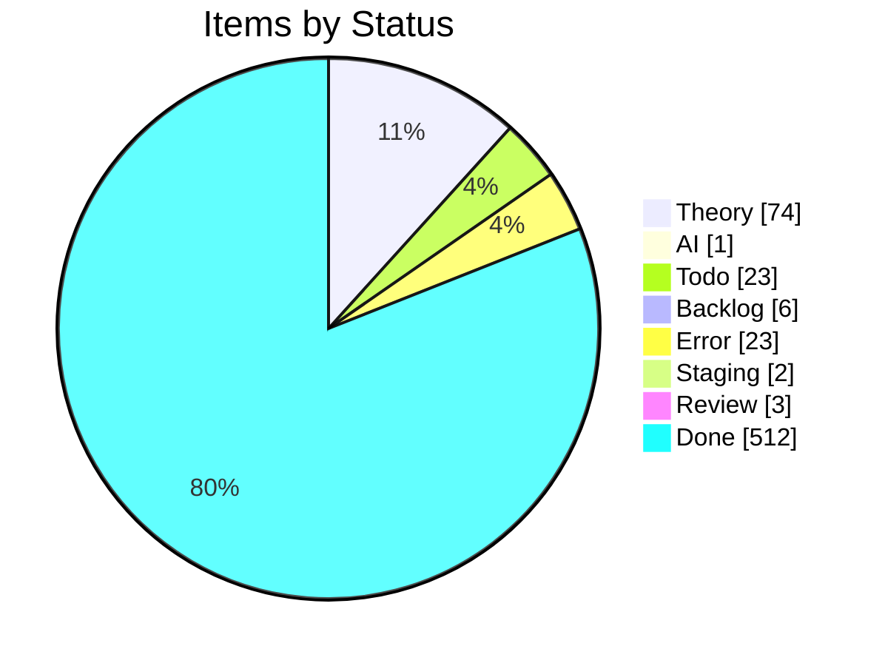
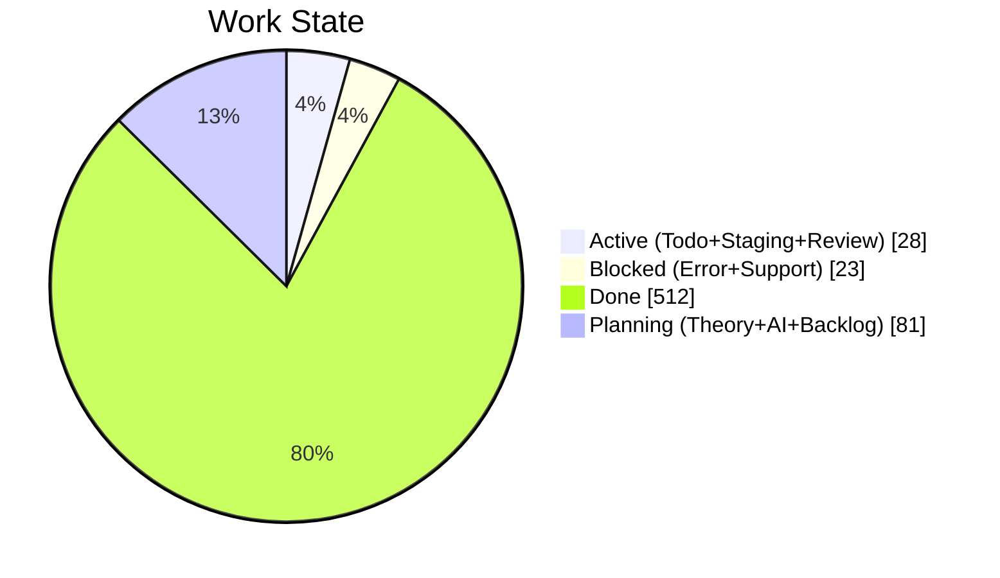
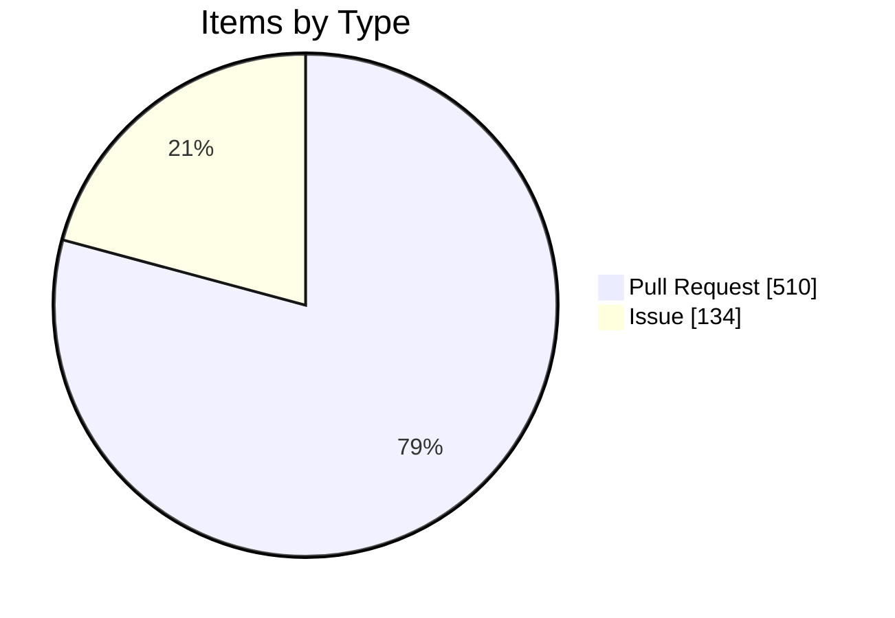

import BentoShell from '@/components/hero/BentoShell.astro';
import BentoProse from '@/components/hero/BentoProse.astro';

<section class="bento-hero bento-section not-content" aria-label="Project board">
	

	

		

			

				
					<svg viewBox="0 0 24 24" width="14" height="14" fill="none" stroke="currentColor" stroke-width="1.75" stroke-linecap="round" stroke-linejoin="round" aria-hidden="true"><path d="M3 3h7v7H3zM14 3h7v7h-7zM14 14h7v7h-7zM3 14h7v7H3z" /></svg>
					auto-generated · daily
				
				<h1 class="bento-title">
					Project board
					across every column.
				</h1>
				
<strong>644</strong> items on the board — <strong>28</strong> active, <strong>23</strong> blocked.

				
Last generated <strong>2026-08-02T04:23:20Z</strong>.

				

					<a class="bento-btn bento-btn--primary" href="#columns">
						View columns
						<svg viewBox="0 0 24 24" fill="none" stroke="currentColor" aria-hidden="true"><path stroke-linecap="round" stroke-linejoin="round" stroke-width="2" d="M5 12h14M13 6l6 6-6 6" /></svg>
					</a>
					<a class="bento-btn bento-btn--ghost" href="https://github.com/orgs/KBVE/projects/5">Open board</a>
					<a class="bento-btn bento-btn--ghost" href="/dashboard/">Dashboard home</a>
				

			

				

					
						<svg viewBox="0 0 24 24" width="16" height="16" fill="none" stroke="currentColor" stroke-width="1.75" stroke-linecap="round" stroke-linejoin="round" aria-hidden="true"><path d="M12 2 2 7l10 5 10-5zM2 17l10 5 10-5M2 12l10 5 10-5" /></svg>
					
					644
					Tracked
				

				

					
						<svg viewBox="0 0 24 24" width="16" height="16" fill="none" stroke="currentColor" stroke-width="1.75" stroke-linecap="round" stroke-linejoin="round" aria-hidden="true"><path d="M13 2 3 14h7l-1 8 10-12h-7z" /></svg>
					
					28
					Active
				

				

					
						<svg viewBox="0 0 24 24" width="16" height="16" fill="none" stroke="currentColor" stroke-width="1.75" stroke-linecap="round" stroke-linejoin="round" aria-hidden="true"><path d="M12 9v4m0 4h.01M10.3 3.9 1.8 18a2 2 0 0 0 1.7 3h17a2 2 0 0 0 1.7-3L13.7 3.9a2 2 0 0 0-3.4 0z" /></svg>
					
					23
					Blocked
				

				

					
						<svg viewBox="0 0 24 24" width="16" height="16" fill="none" stroke="currentColor" stroke-width="1.75" stroke-linecap="round" stroke-linejoin="round" aria-hidden="true"><path d="M12 2 15 9l7 .5-5.3 4.6L18.5 21 12 17l-6.5 4 1.8-6.9L2 9.5 9 9z" /></svg>
					
					81
					Planning
				

				

					
						<svg viewBox="0 0 24 24" width="16" height="16" fill="none" stroke="currentColor" stroke-width="1.75" stroke-linecap="round" stroke-linejoin="round" aria-hidden="true"><path d="M22 11.1V12a10 10 0 1 1-5.9-9.1M22 4 12 14.01l-3-3" /></svg>
					
					512
					Done
				

		

		<nav class="bento-jump" aria-label="On this page">
			<a class="bento-chip" href="#columns">Columns</a>
			<a class="bento-chip" href="#flow">Pipeline</a>
			<a class="bento-chip" href="#board">Board</a>
		</nav>
	

</section>

<BentoShell id="columns" eyebrow="Board" heading="Column breakdown">
	

		<a class="bento-cell bento-linkcard bento-card bento-card--glass bento-card--interactive" href="#col-theory">
			
				<svg viewBox="0 0 24 24" width="18" height="18" fill="none" stroke="currentColor" stroke-width="1.75" stroke-linecap="round" stroke-linejoin="round" aria-hidden="true"><path d="M12 2 15 9l7 .5-5.3 4.6L18.5 21 12 17l-6.5 4 1.8-6.9L2 9.5 9 9z" /></svg>
			
			Theory
			74 items
			
				<svg viewBox="0 0 24 24" width="16" height="16" fill="none" stroke="currentColor" stroke-width="2" stroke-linecap="round" stroke-linejoin="round"><path d="M5 12h14M13 6l6 6-6 6" /></svg>
			
		</a>
		<a class="bento-cell bento-linkcard bento-card bento-card--glass bento-card--interactive" href="#col-ai">
			
				<svg viewBox="0 0 24 24" width="18" height="18" fill="none" stroke="currentColor" stroke-width="1.75" stroke-linecap="round" stroke-linejoin="round" aria-hidden="true"><path d="M9 2v2m6-2v2M9 20v2m6-2v2M2 9h2m-2 6h2m16-6h2m-2 6h2M6 6h12v12H6zM9 9h6v6H9z" /></svg>
			
			AI
			1 item
			
				<svg viewBox="0 0 24 24" width="16" height="16" fill="none" stroke="currentColor" stroke-width="2" stroke-linecap="round" stroke-linejoin="round"><path d="M5 12h14M13 6l6 6-6 6" /></svg>
			
		</a>
		<a class="bento-cell bento-linkcard bento-card bento-card--glass bento-card--interactive" href="#col-todo">
			
				<svg viewBox="0 0 24 24" width="18" height="18" fill="none" stroke="currentColor" stroke-width="1.75" stroke-linecap="round" stroke-linejoin="round" aria-hidden="true"><path d="M8 6h13M8 12h13M8 18h13M3 6h.01M3 12h.01M3 18h.01" /></svg>
			
			Todo
			23 items
			
				<svg viewBox="0 0 24 24" width="16" height="16" fill="none" stroke="currentColor" stroke-width="2" stroke-linecap="round" stroke-linejoin="round"><path d="M5 12h14M13 6l6 6-6 6" /></svg>
			
		</a>
		<a class="bento-cell bento-linkcard bento-card bento-card--glass bento-card--interactive" href="#col-backlog">
			
				<svg viewBox="0 0 24 24" width="18" height="18" fill="none" stroke="currentColor" stroke-width="1.75" stroke-linecap="round" stroke-linejoin="round" aria-hidden="true"><path d="M12 2 2 7l10 5 10-5zM2 17l10 5 10-5M2 12l10 5 10-5" /></svg>
			
			Backlog
			6 items
			
				<svg viewBox="0 0 24 24" width="16" height="16" fill="none" stroke="currentColor" stroke-width="2" stroke-linecap="round" stroke-linejoin="round"><path d="M5 12h14M13 6l6 6-6 6" /></svg>
			
		</a>
		<a class="bento-cell bento-linkcard bento-card bento-card--glass bento-card--interactive" href="#col-error">
			
				<svg viewBox="0 0 24 24" width="18" height="18" fill="none" stroke="currentColor" stroke-width="1.75" stroke-linecap="round" stroke-linejoin="round" aria-hidden="true"><path d="M12 9v4m0 4h.01M10.3 3.9 1.8 18a2 2 0 0 0 1.7 3h17a2 2 0 0 0 1.7-3L13.7 3.9a2 2 0 0 0-3.4 0z" /></svg>
			
			Error
			23 items
			
				<svg viewBox="0 0 24 24" width="16" height="16" fill="none" stroke="currentColor" stroke-width="2" stroke-linecap="round" stroke-linejoin="round"><path d="M5 12h14M13 6l6 6-6 6" /></svg>
			
		</a>
		<a class="bento-cell bento-linkcard bento-card bento-card--glass bento-card--interactive" href="#col-support">
			
				<svg viewBox="0 0 24 24" width="18" height="18" fill="none" stroke="currentColor" stroke-width="1.75" stroke-linecap="round" stroke-linejoin="round" aria-hidden="true"><path d="M12 2a10 10 0 1 0 0 20 10 10 0 0 0 0-20zm0 6a4 4 0 1 0 0 8 4 4 0 0 0 0-8zM4.9 4.9l3.5 3.5m7.2 7.2 3.5 3.5m0-14.2-3.5 3.5m-7.2 7.2-3.5 3.5" /></svg>
			
			Support
			0 items
			
				<svg viewBox="0 0 24 24" width="16" height="16" fill="none" stroke="currentColor" stroke-width="2" stroke-linecap="round" stroke-linejoin="round"><path d="M5 12h14M13 6l6 6-6 6" /></svg>
			
		</a>
		<a class="bento-cell bento-linkcard bento-card bento-card--glass bento-card--interactive" href="#col-staging">
			
				<svg viewBox="0 0 24 24" width="18" height="18" fill="none" stroke="currentColor" stroke-width="1.75" stroke-linecap="round" stroke-linejoin="round" aria-hidden="true"><path d="M12 8a4 4 0 1 0 0 8 4 4 0 0 0 0-8zM19.4 15a1.65 1.65 0 0 0 .33 1.82l.06.06a2 2 0 1 1-2.83 2.83l-.06-.06a1.65 1.65 0 0 0-1.82-.33 1.65 1.65 0 0 0-1 1.51V21a2 2 0 1 1-4 0v-.09A1.65 1.65 0 0 0 9 19.4a1.65 1.65 0 0 0-1.82.33l-.06.06a2 2 0 1 1-2.83-2.83l.06-.06a1.65 1.65 0 0 0 .33-1.82 1.65 1.65 0 0 0-1.51-1H3a2 2 0 1 1 0-4h.09A1.65 1.65 0 0 0 4.6 9a1.65 1.65 0 0 0-.33-1.82l-.06-.06a2 2 0 1 1 2.83-2.83l.06.06a1.65 1.65 0 0 0 1.82.33H9a1.65 1.65 0 0 0 1-1.51V3a2 2 0 1 1 4 0v.09a1.65 1.65 0 0 0 1 1.51 1.65 1.65 0 0 0 1.82-.33l.06-.06a2 2 0 1 1 2.83 2.83l-.06.06a1.65 1.65 0 0 0-.33 1.82V9a1.65 1.65 0 0 0 1.51 1H21a2 2 0 1 1 0 4h-.09a1.65 1.65 0 0 0-1.51 1z" /></svg>
			
			Staging
			2 items
			
				<svg viewBox="0 0 24 24" width="16" height="16" fill="none" stroke="currentColor" stroke-width="2" stroke-linecap="round" stroke-linejoin="round"><path d="M5 12h14M13 6l6 6-6 6" /></svg>
			
		</a>
		<a class="bento-cell bento-linkcard bento-card bento-card--glass bento-card--interactive" href="#col-review">
			
				<svg viewBox="0 0 24 24" width="18" height="18" fill="none" stroke="currentColor" stroke-width="1.75" stroke-linecap="round" stroke-linejoin="round" aria-hidden="true"><path d="M2 12s3.5-7 10-7 10 7 10 7-3.5 7-10 7-10-7-10-7zM12 15a3 3 0 1 0 0-6 3 3 0 0 0 0 6z" /></svg>
			
			Review
			3 items
			
				<svg viewBox="0 0 24 24" width="16" height="16" fill="none" stroke="currentColor" stroke-width="2" stroke-linecap="round" stroke-linejoin="round"><path d="M5 12h14M13 6l6 6-6 6" /></svg>
			
		</a>
		<a class="bento-cell bento-linkcard bento-card bento-card--glass bento-card--interactive" href="#col-done">
			
				<svg viewBox="0 0 24 24" width="18" height="18" fill="none" stroke="currentColor" stroke-width="1.75" stroke-linecap="round" stroke-linejoin="round" aria-hidden="true"><path d="M22 11.1V12a10 10 0 1 1-5.9-9.1M22 4 12 14.01l-3-3" /></svg>
			
			Done
			512 items
			
				<svg viewBox="0 0 24 24" width="16" height="16" fill="none" stroke="currentColor" stroke-width="2" stroke-linecap="round" stroke-linejoin="round"><path d="M5 12h14M13 6l6 6-6 6" /></svg>
			
		</a>
	

</BentoShell>

<BentoProse id="flow" heading="Pipeline flow">

### Items by status

```mermaid
pie showData
    title Items by Status
    "Theory" : 74
    "AI" : 1
    "Todo" : 23
    "Backlog" : 6
    "Error" : 23
    "Staging" : 2
    "Review" : 3
    "Done" : 512
```

### Work state

```mermaid
pie showData
    title Work State
    "Active (Todo+Staging+Review)" : 28
    "Blocked (Error+Support)" : 23
    "Done" : 512
    "Planning (Theory+AI+Backlog)" : 81
```

### Pipeline

```mermaid
flowchart LR
    classDef planning fill:#8b5cf6,stroke:#6d28d9,color:#fff
    classDef active fill:#3b82f6,stroke:#1d4ed8,color:#fff
    classDef blocked fill:#ef4444,stroke:#b91c1c,color:#fff
    classDef done fill:#10b981,stroke:#059669,color:#fff
    Theory["Theory<br/><strong>74</strong>"]
    Theory --> AI
    AI["AI<br/><strong>1</strong>"]
    AI --> Todo
    Todo["Todo<br/><strong>23</strong>"]
    Todo --> Backlog
    Backlog["Backlog<br/><strong>6</strong>"]
    Backlog --> Error
    Error["Error<br/><strong>23</strong>"]
    Error --> Support
    Support["Support<br/><strong>0</strong>"]
    Support --> Staging
    Staging["Staging<br/><strong>2</strong>"]
    Staging --> Review
    Review["Review<br/><strong>3</strong>"]
    Review --> Done
    Done["Done<br/><strong>512</strong>"]
    class Theory,AI,Backlog planning
    class Todo,Staging,Review active
    class Error,Support blocked
    class Done done
```

### Items by type

```mermaid
pie showData
    title Items by Type
    "Pull Request" : 510
    "Issue" : 134
```

</BentoProse>

<BentoProse id="board" heading="Board detail">

### Top labels

| Label | Count |
|-------|:-----:|
| auto-pr | 510 |
| dev→main | 145 |
| atomic | 114 |
| enhancement | 94 |
| todo | 27 |
| bug | 24 |
| rust | 17 |
| 0 | 15 |
| 1 | 10 |
| unity | 8 |

### Theory (74)

| # | Title | Priority | Assignees | Labels |
|---|-------|----------|-----------|--------|
| [#2252](https://github.com/KBVE/kbve/issues/2252) | [Concept] : Shop Layout - Merch, Hardware, Services. | — | — | 1, enhancement |
| [#4643](https://github.com/KBVE/kbve/issues/4643) | [Concept] : [Unity] : Transport System | — | h0lybyte | 0, enhancement, unity |
| [#5624](https://github.com/KBVE/kbve/issues/5624) | [Concept] : Add Intel NUC worker nodes to existing Talos KBVE cluster | — | h0lybyte, Copilot | 0, enhancement |
| [#6437](https://github.com/KBVE/kbve/issues/6437) | [Concept] : [Unity] : Pathfinding ECS | — | h0lybyte | 0, enhancement, unity |
| [#6438](https://github.com/KBVE/kbve/issues/6438) | [Concept] : [Unity] : ItemDB ECS Migration | — | h0lybyte | 0, enhancement, unity |
| [#6576](https://github.com/KBVE/kbve/issues/6576) | [Concept] : [Unity] : Entity Blittable System | — | h0lybyte | 0, enhancement, unity |
| [#7730](https://github.com/KBVE/kbve/issues/7730) | [DISCORDSH] Rust-First Vote Process — Rate-Limited Server Voting Pipeline | — | h0lybyte | 1, enhancement, security |
| [#7593](https://github.com/KBVE/kbve/issues/7593) | [PG] Deploy CNPG Pooler (PgBouncer) and migrate services from direct -rw connect | — | h0lybyte | 2, enhancement, dependencies |
| [#8180](https://github.com/KBVE/kbve/issues/8180) | [DISCORDSH] POC: Mockoon docker-compose for local E2E testing | — | h0lybyte | 1, enhancement |
| [#8245](https://github.com/KBVE/kbve/issues/8245) | perf(dashboard): migrate ClickHouse queries to @kbve/droid worker pipeline with  | — | — | 1, enhancement |
| [#9789](https://github.com/KBVE/kbve/issues/9789) | [Dashboard] Forgejo dashboard expansion — token scopes, user management, DB role | — | — | 3, enhancement, ci |
| [#9724](https://github.com/KBVE/kbve/issues/9724) | [ISOMETRIC] [BEVY] Convert sprite atlases from PNG to KTX2 with basis universal  | — | h0lybyte | 1, enhancement |
| [#9588](https://github.com/KBVE/kbve/issues/9588) | [ISOMETRIC] Pixel Smoothing | — | h0lybyte | 0, enhancement |
| [#9850](https://github.com/KBVE/kbve/issues/9850) | feat(mud): data population, IRC deployment, and isometric integration for MUD co | — | h0lybyte | 2, enhancement |
| [#8254](https://github.com/KBVE/kbve/issues/8254) | feat(unreal): CI/CD pipeline for UEDevOps plugin (itch.io + Fab) | — | h0lybyte | 2, enhancement |
| [#10194](https://github.com/KBVE/kbve/issues/10194) | [DISCORDSH] [BEVY] Key Integration Gaps | — | — | enhancement |
| [#10979](https://github.com/KBVE/kbve/issues/10979) | feat(wallet): khash marketplace bootstrap (5-phase roadmap) | — | — | enhancement |
| [#10980](https://github.com/KBVE/kbve/issues/10980) | isometric: upgrade Bevy 0.18 → 0.19 + wgpu 27 → 29 | — | — | enhancement |
| [#11244](https://github.com/KBVE/kbve/issues/11244) | [BEVY][ISOMETRIC] Refactor remaining menus to ui component library | — | — | enhancement |
| [#11246](https://github.com/KBVE/kbve/issues/11246) | [BEVY][ISOMETRIC] In-game chat overlay (incoming + outgoing) | — | — | enhancement |
| [#11247](https://github.com/KBVE/kbve/issues/11247) | [BEVY][ISOMETRIC] Toast styling pass — color accents + animations | — | — | enhancement |
| [#11262](https://github.com/KBVE/kbve/issues/11262) | feat(discordsh): /gh claim — Discord user self-assigns issue + KBVE profile link | — | — | enhancement |
| [#11294](https://github.com/KBVE/kbve/issues/11294) | feat(td-online): multiplayer tower defense — bevy+rapier2d sim, agones game serv | — | — | enhancement |
| [#11362](https://github.com/KBVE/kbve/issues/11362) | feat(astro-kbve,guild-vault): /dashboard/agents — multi-tenant bot management su | — | — | enhancement |
| [#11579](https://github.com/KBVE/kbve/issues/11579) | feat(laser): extract chat client into @kbve/laser for Phaser game embedding | — | — | enhancement |
| [#11580](https://github.com/KBVE/kbve/issues/11580) | feat(chat): proto + zod schema for ChatMessage envelope (bots, NOTICE, kinds) | — | — | enhancement |
| [#11582](https://github.com/KBVE/kbve/issues/11582) | harden(astro-irc): embed popup lifecycle + data-signin-url override | — | — | enhancement |
| [#11605](https://github.com/KBVE/kbve/issues/11605) | [isometric] WebGL2 fallback for browsers without WebGPU | — | — | 2, enhancement |
| [#12315](https://github.com/KBVE/kbve/issues/12315) | cryptothrone: zone-agnostic scenes + multi-area world model (city → world → town | — | — | enhancement |
| [#12360](https://github.com/KBVE/kbve/issues/12360) | cryptothrone: remaining scene/netcode abstraction layers (C8 + B4/B6) — successo | — | — | enhancement |
| [#12362](https://github.com/KBVE/kbve/issues/12362) | cryptothrone: playable as Discord Activity + standalone embed.js + itch (one mou | — | — | enhancement |
| [#12376](https://github.com/KBVE/kbve/issues/12376) | cryptothrone: ship to itch.io via embed.js (HTML5 build) — deferred after Discor | — | — | enhancement |
| [#12422](https://github.com/KBVE/kbve/issues/12422) | cryptothrone: decompose CloudCityScene into ECS systems over EntityStore (phased | — | — | enhancement |
| [#12484](https://github.com/KBVE/kbve/issues/12484) | [RN] [CRUX] Off Thread Networking | — | — | enhancement |
| [#12519](https://github.com/KBVE/kbve/issues/12519) | cryptothrone: render status effects on the client | — | — | enhancement |
| [#12520](https://github.com/KBVE/kbve/issues/12520) | cryptothrone: Discord Activity end-to-end verify + boot polish | — | — | enhancement |
| [#12522](https://github.com/KBVE/kbve/issues/12522) | [RN] OAuth integration (Discord / GitHub / Twitch) | — | — | enhancement |
| [#12531](https://github.com/KBVE/kbve/issues/12531) | cryptothrone: Discord activity-instance participant list → in-game lobby | — | — | enhancement |
| [#12533](https://github.com/KBVE/kbve/issues/12533) | cryptothrone: use openExternalLink for outbound links + encourageHardwareAcceler | — | — | enhancement |
| [#12532](https://github.com/KBVE/kbve/issues/12532) | cryptothrone: Discord Activity mobile layout (safe-area + layout-mode + orientat | — | — | enhancement |
| [#12692](https://github.com/KBVE/kbve/issues/12692) | jobboard: validate discipline_ids references at membership submit/approval | — | — | enhancement, security |
| [#12694](https://github.com/KBVE/kbve/issues/12694) | jobboard-web: validate API responses at runtime with the generated zod schemas | — | — | enhancement, good first issue |
| [#12693](https://github.com/KBVE/kbve/issues/12693) | jobboard: write audit_log entries on membership approve/reject | — | — | enhancement, good first issue |
| [#12695](https://github.com/KBVE/kbve/issues/12695) | jobboard: complete the gRPC envelope or retire the dead bytes-id membership mess | — | — | enhancement, rust |
| [#12703](https://github.com/KBVE/kbve/issues/12703) | cryptothrone: bring map/tile data into the ECS MapSystem (phased) | — | — | enhancement |
| [#12705](https://github.com/KBVE/kbve/issues/12705) | cryptothrone: Discord Activity mobile + lobby — real-device verification &amp; p | — | — | enhancement |
| [#12735](https://github.com/KBVE/kbve/issues/12735) | [Factorio] Remaining work — Agones server, factorio-ctl, telemetry, rotation (su | — | — | enhancement |
| [#12875](https://github.com/KBVE/kbve/issues/12875) | UE5 iOS CI/CD Pipeline | — | — | enhancement, todo, ios |
| [#12879](https://github.com/KBVE/kbve/issues/12879) | UE5 Android CI/CD Pipeline | — | — | enhancement, todo, android |
| [#12880](https://github.com/KBVE/kbve/issues/12880) | React Native Android CI/CD Pipeline | — | — | enhancement, todo, android |
| [#12915](https://github.com/KBVE/kbve/issues/12915) | Extend Longhorn filesystem-trim beyond Forgejo LFS volume (cluster-wide block re | — | — | enhancement |
| [#12924](https://github.com/KBVE/kbve/issues/12924) | feat(dashboard): per-app health + sync-history timeline (Argo) | — | — | enhancement |
| [#12925](https://github.com/KBVE/kbve/issues/12925) | feat(dashboard): collapse unchanged context in Argo Diff tab (hunk view) | — | — | enhancement |
| [#12926](https://github.com/KBVE/kbve/issues/12926) | feat(dashboard): Argo sync options — prune toggle + dry-run preview | — | — | enhancement |
| [#12927](https://github.com/KBVE/kbve/issues/12927) | feat(dashboard): selective resource sync from the Argo resource tree | — | — | enhancement |
| [#12928](https://github.com/KBVE/kbve/issues/12928) | feat(dashboard): deep-linkable Argo triage — persist filter/search/group in URL | — | — | enhancement |
| [#12929](https://github.com/KBVE/kbve/issues/12929) | feat(dashboard): bulk sync/refresh OutOfSync apps from the attention panel | — | — | enhancement |
| [#12930](https://github.com/KBVE/kbve/issues/12930) | feat(dashboard): rollback diff preview before confirm (Argo) | — | — | enhancement |
| [#12938](https://github.com/KBVE/kbve/issues/12938) | refactor(astro-kbve): shared collection-index util + typed API responses | — | — | enhancement, todo, npm |
| [#12939](https://github.com/KBVE/kbve/issues/12939) | perf(astro-kbve): precompute sitegraph at build instead of per-request | — | — | enhancement, todo, npm |
| [#13179](https://github.com/KBVE/kbve/issues/13179) | feat: Automate GitHub → Forgejo repository mirroring for kbve/kbve | — | — | enhancement |
| [#13194](https://github.com/KBVE/kbve/issues/13194) | [ROWS] Fix player-count reporting + auto spin-down of empty zone servers | — | — | enhancement |
| [#13350](https://github.com/KBVE/kbve/issues/13350) | ROWS deployment hardening: securityContext, KEDA decision, build-version cache,  | — | — | enhancement |
| [#13506](https://github.com/KBVE/kbve/issues/13506) | Epic: Kilobase Postgres 17.4→17.6 blue-green migration (v2 cluster cutover) | — | — | enhancement |
| [#13555](https://github.com/KBVE/kbve/issues/13555) | ROWS: populate charonmapinstance (in-world presence tracking) — admission travel | — | — | enhancement, backlog |
| [#13576](https://github.com/KBVE/kbve/issues/13576) | Epic: RentEarth Launcher (Unreal + Tauri) — PoC for the ChuckRPG Launcher | — | — | enhancement |
| [#13734](https://github.com/KBVE/kbve/issues/13734) | epic(desktop-kbve): first-class terminal — PTY + xterm.js, tmux control mode, ra | — | — | enhancement |
| [#13783](https://github.com/KBVE/kbve/issues/13783) | perf(simgrid): borrow WS client decode buffer instead of cloning per recv | — | — | enhancement, todo, rust |
| [#13786](https://github.com/KBVE/kbve/issues/13786) | perf(arpg): cache felled/harvested env-log tile sets instead of rebuilding per s | — | — | enhancement, todo, rust |
| [#13796](https://github.com/KBVE/kbve/issues/13796) | ARPG: server-side hotbar/spell loadout representation | — | — | enhancement |
| [#14132](https://github.com/KBVE/kbve/issues/14132) | [FEATURE] /wm — generic Windmill job runner in discordsh (replaces dead /n8n) | — | — | enhancement |
| [#14305](https://github.com/KBVE/kbve/issues/14305) | jedi crate cleanups: jwks key caching, cache eviction, hygiene | — | — | enhancement, rust |
| [#14460](https://github.com/KBVE/kbve/issues/14460) | [Epic] embeddb: native embeddings — vector store, model2vec default, durable asy | — | — | enhancement, rust, epic |
| [#14524](https://github.com/KBVE/kbve/issues/14524) | chore(agones-palworld): ClickHouse gameops DDL + CH ExternalSecret wiring | — | — | enhancement |

### AI (1)

| # | Title | Priority | Assignees | Labels |
|---|-------|----------|-----------|--------|
| [#4906](https://github.com/KBVE/kbve/issues/4906) | [Bug] : [Unity] : Character Orchestrator | — | h0lybyte | 0, bug, unity |

### Todo (23)

| # | Title | Priority | Assignees | Labels |
|---|-------|----------|-----------|--------|
| [#3572](https://github.com/KBVE/kbve/issues/3572) | [Update] : [Fudster] : User Billing &amp; Auth | — | h0lybyte | 1, security, update |
| [#4232](https://github.com/KBVE/kbve/issues/4232) | [Update] : [Github] : Rotate Tokens + Refactor Permissions | — | h0lybyte | 1, security, update |
| [#6939](https://github.com/KBVE/kbve/issues/6939) | [EPIC] Agent Orchestration Tab | — | — | 0, todo |
| [#8134](https://github.com/KBVE/kbve/issues/8134) | feat(proto): ClickHouse schema source of truth via protobuf → zod → vector pipel | — | h0lybyte | 4, documentation, todo |
| [#8148](https://github.com/KBVE/kbve/issues/8148) | [PSQL] Audit Discord Public Server Listing Functions | — | h0lybyte | 3, security, todo |
| [#8817](https://github.com/KBVE/kbve/issues/8817) | [E2E] kilobase needs pgrx/PostgreSQL build environment | — | h0lybyte | 1, todo |
| [#11013](https://github.com/KBVE/kbve/issues/11013) | [CICD] [Github] Migrate workflows to arc-runner-set-kbve + strip apt-install ban | — | — | enhancement, update |
| [#12931](https://github.com/KBVE/kbve/issues/12931) | perf(axum-kbve): hash JWT cache keys instead of storing raw token strings | — | — | enhancement, todo, rust |
| [#12932](https://github.com/KBVE/kbve/issues/12932) | perf(axum-kbve): zero-copy proxy hot path (borrow query/headers, avoid per-reque | — | — | enhancement, todo, rust |
| [#12933](https://github.com/KBVE/kbve/issues/12933) | perf(axum-kbve): tighten borrow scopes — pass &amp;TokenInfo, drop redundant Arc | — | — | enhancement, todo, rust |
| [#12934](https://github.com/KBVE/kbve/issues/12934) | perf(axum-kbve): serialize marketplace enums as &amp;'static str instead of per- | — | — | enhancement, todo, rust |
| [#12935](https://github.com/KBVE/kbve/issues/12935) | perf(astro-kbve): add Cache-Control headers to data/game API endpoints | — | — | enhancement, todo, npm |
| [#12936](https://github.com/KBVE/kbve/issues/12936) | perf(astro-kbve): audit island hydration — reduce client:only, defer off-viewpor | — | — | enhancement, todo, npm |
| [#12937](https://github.com/KBVE/kbve/issues/12937) | refactor(astro-kbve): split 3163-line AskamaProfileProvider into subcomponents | — | — | enhancement, todo, npm |
| [#13121](https://github.com/KBVE/kbve/issues/13121) | [LOW] Deprecated external-secrets.io/v1beta1 on new ES/SecretStore objects | — | — | update |
| [#13751](https://github.com/KBVE/kbve/issues/13751) | verify(rentearth): slime navmesh pathing after region PMC nav removal (#13735) | — | — | todo, ue |
| [#13752](https://github.com/KBVE/kbve/issues/13752) | chore(rentearth): gate debug glass-slime spawn in chuckCorePlayerController | — | — | todo, ue |
| [#13753](https://github.com/KBVE/kbve/issues/13753) | perf(rentearth): grass follow-up — DensityScale 3.5 tuning + streamer pool valid | — | — | todo, ue |
| [#13754](https://github.com/KBVE/kbve/issues/13754) | tooling(unreal): detect stale Engine/Plugins/Marketplace copies shadowing repo K | — | — | todo, ue |
| [#13785](https://github.com/KBVE/kbve/issues/13785) | perf(arpg): reuse Local scratch buffers in creature stream systems | — | — | enhancement, todo, rust |
| [#13787](https://github.com/KBVE/kbve/issues/13787) | perf(axum-kbve): borrow auth token via Cow in extract_auth_token | — | — | enhancement, todo, rust |
| [#13789](https://github.com/KBVE/kbve/issues/13789) | [EPIC] ARPG character persistence — Supabase item ledger + tokio write-behind | — | — | enhancement, todo, rust |
| [#14948](https://github.com/KBVE/kbve/issues/14948) | [EPIC] ARPG pet roster + hub — capture, wire sync, and party UI/UX | — | — | enhancement, todo, rust |

### Backlog (6)

| # | Title | Priority | Assignees | Labels |
|---|-------|----------|-----------|--------|
| [#75](https://github.com/KBVE/kbve/issues/75) | [Concept] : HerbMail.com - Front Page | — | — | 1, backlog |
| [#96](https://github.com/KBVE/kbve/issues/96) | [Concept] : [Backend] : Charles. | — | h0lybyte | 0, backlog |
| [#4642](https://github.com/KBVE/kbve/issues/4642) | [Concept] : [Unity] : Droid System - Hybrid NPC System. | — | h0lybyte | 0, enhancement, backlog |
| [#7548](https://github.com/KBVE/kbve/issues/7548) | feat(memes): responsive bento grid feed + dedicated meme pages | — | h0lybyte | 1, backlog |
| [#11250](https://github.com/KBVE/kbve/issues/11250) | feat(ci-dbmate-deploy): bake migrations into OCI image for cap-free deploys | — | — | enhancement, backlog |
| [#13556](https://github.com/KBVE/kbve/issues/13556) | ROWS: server-authoritative zone travel + anti-teleport (client-supplied zone hon | — | — | security, backlog |

### Error (23)

| # | Title | Priority | Assignees | Labels |
|---|-------|----------|-----------|--------|
| [#2992](https://github.com/KBVE/kbve/issues/2992) | [Bug] LofiFocus is down - [PENDING] Ingress | — | h0lybyte | 0, bug |
| [#3536](https://github.com/KBVE/kbve/issues/3536) | [Bug] : Update CONTRIBUE.MD | — | h0lybyte | 0, bug |
| [#3538](https://github.com/KBVE/kbve/issues/3538) | [Bug] : [Unity] : Gameplay Mechanics - Farming &amp; Crafting | — | h0lybyte | 0, bug, unity |
| [#6705](https://github.com/KBVE/kbve/issues/6705) | [Bug] : [Unity] : Chip Character Sheet Off Center Sprites | — | h0lybyte | 0, bug, unity |
| [#9182](https://github.com/KBVE/kbve/issues/9182) | [ROWS] Performance Audit — missing indexes, unbounded caches, query optimization | — | h0lybyte | 6, bug, enhancement |
| [#9205](https://github.com/KBVE/kbve/issues/9205) | feat(rows): pass zone instance ID to allocated game servers + unify launcher arc | — | h0lybyte | 2, bug |
| [#8815](https://github.com/KBVE/kbve/issues/8815) | [E2E] bevy_* projects need Rust + wasm32 toolchain in CI | — | h0lybyte | 0, bug, ci |
| [#13082](https://github.com/KBVE/kbve/issues/13082) | [CRITICAL] CNPG bootstrap: recovery left on live cluster under Argo auto-prune | — | — | bug |
| [#13085](https://github.com/KBVE/kbve/issues/13085) | [HIGH] Modrinth pipeline will be pruned on merge | — | — | bug |
| [#13097](https://github.com/KBVE/kbve/issues/13097) | [HIGH] CNPG primaryUpdateStrategy left commented (defaults to unsupervised) | — | — | bug |
| [#13099](https://github.com/KBVE/kbve/issues/13099) | [HIGH] Vector ClickHouse sinks use in-memory buffers | — | — | bug |
| [#13103](https://github.com/KBVE/kbve/issues/13103) | [MEDIUM] No probes on four public services (herbmail/memes/rentearth/cityvote) | — | — | bug |
| [#13096](https://github.com/KBVE/kbve/issues/13096) | [CRITICAL/verify] Agones health enabled on rows-tenant fleets | — | — | bug |
| [#13101](https://github.com/KBVE/kbve/issues/13101) | [MEDIUM] discordsh-bot liveness/readiness probe paths disagree | — | — | bug |
| [#13098](https://github.com/KBVE/kbve/issues/13098) | [HIGH] Valkey metrics scrape will be dead — monitoring ns not in allowlist | — | — | bug |
| [#13105](https://github.com/KBVE/kbve/issues/13105) | [MEDIUM] --appendonly yes on emptyDir (rows valkey) | — | — | bug |
| [#13112](https://github.com/KBVE/kbve/issues/13112) | [MEDIUM] agones rows-tenants secret-name prefix drift (ows- vs rows-) | — | — | bug |
| [#13108](https://github.com/KBVE/kbve/issues/13108) | [MEDIUM] supabase-service-key property-name conflict (hash vs key) | — | — | bug |
| [#13104](https://github.com/KBVE/kbve/issues/13104) | [MEDIUM] Factorio rotation cronjob deletes server every 2 minutes | — | — | bug |
| [#13116](https://github.com/KBVE/kbve/issues/13116) | [LOW] Orphaned ReferenceGrant in rows ns | — | — | bug |
| [#13113](https://github.com/KBVE/kbve/issues/13113) | [MEDIUM] rabbitmq RoleBinding omits rows-chuckrpg-prod | — | — | bug |
| [#13119](https://github.com/KBVE/kbve/issues/13119) | [LOW] Cilium API-version skew (v2alpha1 L2 policy vs v2 pool) | — | — | bug |
| [#14008](https://github.com/KBVE/kbve/issues/14008) | ROWS fleet-restart (#13575) — audit follow-ups &amp; pre-enablement gates | — | — | bug, security |

### Support (0)

:::tip[Empty]
No items in **Support**.
:::

### Staging (2)

| # | Title | Priority | Assignees | Labels |
|---|-------|----------|-----------|--------|
| [#2208](https://github.com/KBVE/kbve/issues/2208) | [Concept] Service Page Enchancemnts | — | h0lybyte, dladeira | 4 |
| [#6943](https://github.com/KBVE/kbve/issues/6943) | Phase 2: Frontend - Orchestration Tab | — | — | todo |

### Review (3)

| # | Title | Priority | Assignees | Labels |
|---|-------|----------|-----------|--------|
| [#13278](https://github.com/KBVE/kbve/pull/13278) | Atomic: ue ramdisk spec | — | — | auto-pr, atomic |
| [#13572](https://github.com/KBVE/kbve/pull/13572) | Atomic: bump mdx spec | — | — | auto-pr, atomic |
| [#15126](https://github.com/KBVE/kbve/pull/15126) | Release: 1 feature, 4 chores → Main | — | — | auto-pr, dev→main |

### Done (512)

| # | Title | Priority | Assignees | Labels |
|---|-------|----------|-----------|--------|
| [#13801](https://github.com/KBVE/kbve/issues/13801) | ARPG: pet battle disconnect handling + vitals commit-back before real rosters en | — | — | enhancement |
| [#14261](https://github.com/KBVE/kbve/pull/14261) | Release: 1 feature, 1 CI, 2 chores → Main | — | — | auto-pr, dev→main |
| [#14267](https://github.com/KBVE/kbve/pull/14267) | Release: 1 fix → Main | — | — | auto-pr, dev→main |
| [#14268](https://github.com/KBVE/kbve/pull/14268) | Release: 1 doc, 1 chore → Main | — | — | auto-pr, dev→main |
| [#14269](https://github.com/KBVE/kbve/issues/14269) | Optimize &amp; de-boilerplate the axum-kbve proxy ecosystem | — | — | enhancement, rust |
| [#14271](https://github.com/KBVE/kbve/pull/14271) | chore(ci): sync ci-dispatch-manifest | — | — | auto-pr |
| [#14272](https://github.com/KBVE/kbve/pull/14272) | Atomic: axum-kbve v1.0.241 post-publish sync | — | — | auto-pr, atomic |
| [#14273](https://github.com/KBVE/kbve/pull/14273) | Release: 1 feature, 1 refactor, 2 chores → Main | — | — | auto-pr, dev→main |
| [#14275](https://github.com/KBVE/kbve/pull/14275) | Atomic: discordsh-bot v0.1.25 post-publish sync | — | — | auto-pr, atomic |
| [#14280](https://github.com/KBVE/kbve/pull/14280) | Release: 2 features, 1 CI, 1 perf, 1 refactor → Main | — | — | auto-pr, dev→main |
| [#14283](https://github.com/KBVE/kbve/pull/14283) | chore(content): daily journal scaffold | — | — | auto-pr |
| [#14284](https://github.com/KBVE/kbve/pull/14284) | Release: 1 fix → Main | — | — | auto-pr, dev→main |
| [#14286](https://github.com/KBVE/kbve/pull/14286) | Release: 2 features, 1 fix, 1 doc, 1 perf, 1 chore → Main | — | — | auto-pr, dev→main |
| [#14290](https://github.com/KBVE/kbve/pull/14290) | chore(ci): sync ci-dispatch-manifest | — | — | auto-pr |
| [#14291](https://github.com/KBVE/kbve/pull/14291) | chore(ci): sync ci-dispatch-manifest | — | — | auto-pr |
| [#14293](https://github.com/KBVE/kbve/pull/14293) | Release: 1 feature, 3 chores → Main | — | — | auto-pr, dev→main |
| [#14294](https://github.com/KBVE/kbve/pull/14294) | Atomic: discordsh-bot v0.1.26 post-publish sync | — | — | auto-pr, atomic |
| [#14295](https://github.com/KBVE/kbve/pull/14295) | Atomic: discordsh v0.1.46 post-publish sync | — | — | auto-pr, atomic |
| [#14296](https://github.com/KBVE/kbve/pull/14296) | Atomic: axum-kbve v1.0.242 post-publish sync | — | — | auto-pr, atomic |
| [#14298](https://github.com/KBVE/kbve/pull/14298) | chore(content): daily graph scaffold | — | — | auto-pr |
| [#14300](https://github.com/KBVE/kbve/pull/14300) | chore(content): daily security scaffold | — | — | auto-pr |
| [#14303](https://github.com/KBVE/kbve/pull/14303) | Release: 2 features, 1 fix, 1 perf, 2 chores → Main | — | — | auto-pr, dev→main |
| [#14304](https://github.com/KBVE/kbve/pull/14304) | chore(ci): sync ci-dispatch-manifest | — | — | auto-pr |
| [#14309](https://github.com/KBVE/kbve/pull/14309) | Release: 2 features, 2 fixes, 2 chores → Main | — | — | auto-pr, dev→main |
| [#14311](https://github.com/KBVE/kbve/pull/14311) | Atomic: discordsh-bot v0.1.27 post-publish sync | — | — | auto-pr, atomic |
| [#14318](https://github.com/KBVE/kbve/pull/14318) | Release: 2 features, 1 refactor, 1 chore → Main | — | — | auto-pr, dev→main |
| [#14319](https://github.com/KBVE/kbve/pull/14319) | chore(ci): sync ci-dispatch-manifest | — | — | auto-pr |
| [#14322](https://github.com/KBVE/kbve/pull/14322) | Release: 2 fixes → Main | — | — | auto-pr, dev→main |
| [#14323](https://github.com/KBVE/kbve/pull/14323) | Atomic: axum-kbve v1.0.243 post-publish sync | — | — | auto-pr, atomic |
| [#14324](https://github.com/KBVE/kbve/pull/14324) | Release: 2 chores → Main | — | — | auto-pr, dev→main |
| [#14325](https://github.com/KBVE/kbve/pull/14325) | chore(dashboard): daily sync — 2026-07-19 | — | — | auto-pr |
| [#14328](https://github.com/KBVE/kbve/pull/14328) | Release: 8 features, 2 fixes, 4 docs, 2 chores → Main | — | — | auto-pr, dev→main |
| [#14335](https://github.com/KBVE/kbve/pull/14335) | chore(ci): sync ci-dispatch-manifest | — | — | auto-pr |
| [#14341](https://github.com/KBVE/kbve/pull/14341) | Release: 3 features, 2 fixes, 1 chore → Main | — | — | auto-pr, dev→main |
| [#14342](https://github.com/KBVE/kbve/issues/14342) | epic(discordsh): explicit GitHub close/reopen from Discord (/gh close, /gh reope | — | — | enhancement |
| [#14344](https://github.com/KBVE/kbve/pull/14344) | Atomic: axum-kbve v1.0.244 post-publish sync | — | — | auto-pr, atomic |
| [#14347](https://github.com/KBVE/kbve/pull/14347) | Release: 3 features, 5 chores → Main | — | — | auto-pr, dev→main |
| [#14363](https://github.com/KBVE/kbve/pull/14363) | Release: 2 features, 1 fix, 1 doc, 1 refactor, 12 chores → Main | — | — | auto-pr, dev→main |
| [#14365](https://github.com/KBVE/kbve/pull/14365) | chore(content): daily releases scaffold | — | — | auto-pr |
| [#14366](https://github.com/KBVE/kbve/pull/14366) | chore(content): daily journal scaffold | — | — | auto-pr |
| [#14367](https://github.com/KBVE/kbve/pull/14367) | chore(content): daily activity scaffold | — | — | auto-pr |
| [#14368](https://github.com/KBVE/kbve/pull/14368) | chore(content): daily kanban scaffold | — | — | auto-pr |
| [#14369](https://github.com/KBVE/kbve/pull/14369) | chore(content): daily ci-health scaffold | — | — | auto-pr |
| [#14370](https://github.com/KBVE/kbve/pull/14370) | chore(content): daily proto scaffold | — | — | auto-pr |
| [#14371](https://github.com/KBVE/kbve/pull/14371) | chore(content): daily graph scaffold | — | — | auto-pr |
| [#14372](https://github.com/KBVE/kbve/pull/14372) | chore(content): daily report scaffold | — | — | auto-pr |
| [#14373](https://github.com/KBVE/kbve/pull/14373) | chore(content): daily security scaffold | — | — | auto-pr |
| [#14374](https://github.com/KBVE/kbve/pull/14374) | chore(content): daily deps scaffold | — | — | auto-pr |
| [#14377](https://github.com/KBVE/kbve/pull/14377) | chore(ci): sync ci-dispatch-manifest | — | — | auto-pr |
| [#14378](https://github.com/KBVE/kbve/pull/14378) | chore(embeddb-derive): update version.toml to 0.1.0 | — | — | auto-pr |
| [#14379](https://github.com/KBVE/kbve/pull/14379) | Release: 1 fix, 1 doc, 3 chores → Main | — | — | auto-pr, dev→main |
| [#14380](https://github.com/KBVE/kbve/pull/14380) | Atomic: axum-kbve v1.0.245 post-publish sync | — | — | auto-pr, atomic |
| [#14400](https://github.com/KBVE/kbve/pull/14400) | Atomic: chisel-ubuntu-axum v24.04.11 post-publish sync | — | — | auto-pr, atomic |
| [#14401](https://github.com/KBVE/kbve/pull/14401) | Release: 1 feature, 1 fix, 1 doc, 2 chores → Main | — | — | auto-pr, dev→main |
| [#14402](https://github.com/KBVE/kbve/pull/14402) | Atomic: arc-runner v0.1.7 post-publish sync | — | — | auto-pr, atomic |
| [#14406](https://github.com/KBVE/kbve/pull/14406) | Release: 3 features, 2 fixes, 3 chores → Main | — | — | auto-pr, dev→main |
| [#14408](https://github.com/KBVE/kbve/pull/14408) | chore(ci): sync ci-dispatch-manifest | — | — | auto-pr |
| [#14414](https://github.com/KBVE/kbve/pull/14414) | Release: 2 features, 3 fixes, 2 chores → Main | — | — | auto-pr, dev→main |
| [#14417](https://github.com/KBVE/kbve/pull/14417) | chore(embeddb): update version.toml to 0.1.0 | — | — | auto-pr |
| [#14421](https://github.com/KBVE/kbve/pull/14421) | Atomic: axum-kbve v1.0.246 post-publish sync | — | — | auto-pr, atomic |
| [#14422](https://github.com/KBVE/kbve/pull/14422) | Release: 1 feature, 2 fixes, 1 doc, 5 chores → Main | — | — | auto-pr, dev→main |
| [#14426](https://github.com/KBVE/kbve/pull/14426) | Release: 2 fixes, 5 chores → Main | — | — | auto-pr, dev→main |
| [#14427](https://github.com/KBVE/kbve/pull/14427) | chore(ci): sync ci-dispatch-manifest | — | — | auto-pr |
| [#14428](https://github.com/KBVE/kbve/pull/14428) | chore(laser): update version.toml to 0.1.6 | — | — | auto-pr |
| [#14432](https://github.com/KBVE/kbve/pull/14432) | chore(ci): sync ci-dispatch-manifest | — | — | auto-pr |
| [#14435](https://github.com/KBVE/kbve/pull/14435) | chore(python-kbve): update version.toml to 1.0.14 | — | — | auto-pr |
| [#14436](https://github.com/KBVE/kbve/pull/14436) | Atomic: axum-kbve v1.0.247 post-publish sync | — | — | auto-pr, atomic |
| [#14437](https://github.com/KBVE/kbve/pull/14437) | Release: 2 chores → Main | — | — | auto-pr, dev→main |
| [#14438](https://github.com/KBVE/kbve/pull/14438) | Release: 1 fix, 11 chores → Main | — | — | auto-pr, dev→main |
| [#14439](https://github.com/KBVE/kbve/pull/14439) | chore(content): daily journal scaffold | — | — | auto-pr |
| [#14440](https://github.com/KBVE/kbve/pull/14440) | chore(content): daily releases scaffold | — | — | auto-pr |
| [#14441](https://github.com/KBVE/kbve/pull/14441) | chore(content): daily kanban scaffold | — | — | auto-pr |
| [#14442](https://github.com/KBVE/kbve/pull/14442) | chore(content): daily activity scaffold | — | — | auto-pr |
| [#14443](https://github.com/KBVE/kbve/pull/14443) | chore(content): daily ci-health scaffold | — | — | auto-pr |
| [#14444](https://github.com/KBVE/kbve/pull/14444) | chore(content): daily graph scaffold | — | — | auto-pr |
| [#14445](https://github.com/KBVE/kbve/pull/14445) | chore(content): daily proto scaffold | — | — | auto-pr |
| [#14446](https://github.com/KBVE/kbve/pull/14446) | chore(content): daily report scaffold | — | — | auto-pr |
| [#14447](https://github.com/KBVE/kbve/pull/14447) | chore(content): daily deps scaffold | — | — | auto-pr |
| [#14448](https://github.com/KBVE/kbve/pull/14448) | chore(content): daily security scaffold | — | — | auto-pr |
| [#14449](https://github.com/KBVE/kbve/pull/14449) | chore(ci): sync ci-dispatch-manifest | — | — | auto-pr |
| [#14451](https://github.com/KBVE/kbve/pull/14451) | chore(ci): sync ci-dispatch-manifest | — | — | auto-pr |
| [#14452](https://github.com/KBVE/kbve/pull/14452) | Atomic: herbmail v0.1.2 post-publish sync | — | — | auto-pr, atomic |
| [#14453](https://github.com/KBVE/kbve/pull/14453) | Release: 3 chores → Main | — | — | auto-pr, dev→main |
| [#14454](https://github.com/KBVE/kbve/pull/14454) | Atomic: discordsh-bot v0.1.28 post-publish sync | — | — | auto-pr, atomic |
| [#14457](https://github.com/KBVE/kbve/pull/14457) | Release: 2 features, 2 fixes, 1 doc, 4 chores → Main | — | — | auto-pr, dev→main |
| [#14459](https://github.com/KBVE/kbve/issues/14459) | Epic: Cube Analytics Dashboard Polish | — | — | enhancement |
| [#14462](https://github.com/KBVE/kbve/pull/14462) | Atomic: dashboard polish | — | — | auto-pr, atomic |
| [#14463](https://github.com/KBVE/kbve/pull/14463) | Atomic: dashboard nav | — | — | auto-pr, atomic |
| [#14464](https://github.com/KBVE/kbve/pull/14464) | chore(ci): sync ci-dispatch-manifest | — | — | auto-pr |
| [#14467](https://github.com/KBVE/kbve/pull/14467) | Atomic: axum-kbve v1.0.248 post-publish sync | — | — | auto-pr, atomic |
| [#14468](https://github.com/KBVE/kbve/pull/14468) | Release: 1 chore → Main | — | — | auto-pr, dev→main |
| [#14469](https://github.com/KBVE/kbve/pull/14469) | Release: 3 features, 1 fix, 17 chores → Main | — | — | auto-pr, dev→main |
| [#14470](https://github.com/KBVE/kbve/pull/14470) | chore(content): daily journal scaffold | — | — | auto-pr |
| [#14471](https://github.com/KBVE/kbve/pull/14471) | chore(content): daily activity scaffold | — | — | auto-pr |
| [#14472](https://github.com/KBVE/kbve/pull/14472) | chore(content): daily releases scaffold | — | — | auto-pr |
| [#14473](https://github.com/KBVE/kbve/pull/14473) | chore(content): daily kanban scaffold | — | — | auto-pr |
| [#14474](https://github.com/KBVE/kbve/pull/14474) | chore(content): daily ci-health scaffold | — | — | auto-pr |
| [#14475](https://github.com/KBVE/kbve/pull/14475) | chore(content): daily graph scaffold | — | — | auto-pr |
| [#14476](https://github.com/KBVE/kbve/pull/14476) | chore(content): daily proto scaffold | — | — | auto-pr |
| [#14477](https://github.com/KBVE/kbve/pull/14477) | chore(content): daily report scaffold | — | — | auto-pr |
| [#14478](https://github.com/KBVE/kbve/pull/14478) | chore(content): daily deps scaffold | — | — | auto-pr |
| [#14479](https://github.com/KBVE/kbve/pull/14479) | chore(content): daily security scaffold | — | — | auto-pr |
| [#14483](https://github.com/KBVE/kbve/pull/14483) | chore(ci): sync ci-dispatch-manifest | — | — | auto-pr |
| [#14485](https://github.com/KBVE/kbve/pull/14485) | chore(ci): sync ci-dispatch-manifest | — | — | auto-pr |
| [#14487](https://github.com/KBVE/kbve/pull/14487) | Release: 2 features, 2 fixes, 2 chores → Main | — | — | auto-pr, dev→main |
| [#14488](https://github.com/KBVE/kbve/pull/14488) | Atomic: firecracker-ctl v0.1.42 post-publish sync | — | — | auto-pr, atomic |
| [#14490](https://github.com/KBVE/kbve/pull/14490) | Atomic: axum-kbve v1.0.249 post-publish sync | — | — | auto-pr, atomic |
| [#14494](https://github.com/KBVE/kbve/pull/14494) | Release: 8 features, 2 fixes, 1 test, 5 chores → Main | — | — | auto-pr, dev→main |
| [#14503](https://github.com/KBVE/kbve/issues/14503) | feat(agones): Palworld dedicated server + Agones SDK integration (factorio-parit | — | — | enhancement |
| [#14506](https://github.com/KBVE/kbve/pull/14506) | chore(ci): sync ci-dispatch-manifest | — | — | auto-pr |
| [#14510](https://github.com/KBVE/kbve/pull/14510) | Atomic: axum-kbve v1.0.250 post-publish sync | — | — | auto-pr, atomic |
| [#14511](https://github.com/KBVE/kbve/pull/14511) | Release: 1 feature, 1 fix, 1 chore → Main | — | — | auto-pr, dev→main |
| [#14512](https://github.com/KBVE/kbve/pull/14512) | Atomic: reel v0.1.1 post-publish sync | — | — | auto-pr, atomic |
| [#14514](https://github.com/KBVE/kbve/pull/14514) | Release: 1 fix, 1 chore → Main | — | — | auto-pr, dev→main |
| [#14516](https://github.com/KBVE/kbve/pull/14516) | Release: 1 fix → Main | — | — | auto-pr, dev→main |
| [#14518](https://github.com/KBVE/kbve/pull/14518) | Release: 1 fix → Main | — | — | auto-pr, dev→main |
| [#14519](https://github.com/KBVE/kbve/pull/14519) | chore(ci): sync ci-dispatch-manifest | — | — | auto-pr |
| [#14521](https://github.com/KBVE/kbve/pull/14521) | Atomic: agones-palworld-relay v0.0.2 post-publish sync | — | — | auto-pr, atomic |
| [#14522](https://github.com/KBVE/kbve/pull/14522) | Release: 1 feature, 2 chores → Main | — | — | auto-pr, dev→main |
| [#14523](https://github.com/KBVE/kbve/pull/14523) | Atomic: agones-palworld v0.0.2 post-publish sync | — | — | auto-pr, atomic |
| [#14526](https://github.com/KBVE/kbve/pull/14526) | Release: 1 feature, 1 fix → Main | — | — | auto-pr, dev→main |
| [#14528](https://github.com/KBVE/kbve/pull/14528) | chore(ci): sync ci-dispatch-manifest | — | — | auto-pr |
| [#14530](https://github.com/KBVE/kbve/pull/14530) | Atomic: agones-palworld-relay v0.0.3 post-publish sync | — | — | auto-pr, atomic |
| [#14531](https://github.com/KBVE/kbve/pull/14531) | Release: 2 chores → Main | — | — | auto-pr, dev→main |
| [#14532](https://github.com/KBVE/kbve/pull/14532) | Atomic: agones-palworld v0.0.3 post-publish sync | — | — | auto-pr, atomic |
| [#14533](https://github.com/KBVE/kbve/pull/14533) | chore(content): daily journal scaffold | — | — | auto-pr |
| [#14534](https://github.com/KBVE/kbve/pull/14534) | chore(content): daily kanban scaffold | — | — | auto-pr |
| [#14535](https://github.com/KBVE/kbve/pull/14535) | chore(content): daily activity scaffold | — | — | auto-pr |
| [#14536](https://github.com/KBVE/kbve/pull/14536) | chore(content): daily releases scaffold | — | — | auto-pr |
| [#14537](https://github.com/KBVE/kbve/pull/14537) | chore(content): daily ci-health scaffold | — | — | auto-pr |
| [#14538](https://github.com/KBVE/kbve/pull/14538) | chore(content): daily graph scaffold | — | — | auto-pr |
| [#14539](https://github.com/KBVE/kbve/pull/14539) | chore(content): daily proto scaffold | — | — | auto-pr |
| [#14540](https://github.com/KBVE/kbve/pull/14540) | chore(content): daily report scaffold | — | — | auto-pr |
| [#14541](https://github.com/KBVE/kbve/pull/14541) | chore(content): daily deps scaffold | — | — | auto-pr |
| [#14542](https://github.com/KBVE/kbve/pull/14542) | chore(content): daily security scaffold | — | — | auto-pr |
| [#14543](https://github.com/KBVE/kbve/pull/14543) | Release: 1 feature, 10 chores → Main | — | — | auto-pr, dev→main |
| [#14544](https://github.com/KBVE/kbve/pull/14544) | chore(ci): sync ci-dispatch-manifest | — | — | auto-pr |
| [#14547](https://github.com/KBVE/kbve/pull/14547) | Release: 1 feature, 1 fix → Main | — | — | auto-pr, dev→main |
| [#14549](https://github.com/KBVE/kbve/pull/14549) | chore(ci): sync ci-dispatch-manifest | — | — | auto-pr |
| [#14550](https://github.com/KBVE/kbve/pull/14550) | Release: 4 fixes, 3 chores → Main | — | — | auto-pr, dev→main |
| [#14553](https://github.com/KBVE/kbve/pull/14553) | chore(ci): sync ci-dispatch-manifest | — | — | auto-pr |
| [#14556](https://github.com/KBVE/kbve/pull/14556) | Atomic: agones-palworld-relay v0.0.5 post-publish sync | — | — | auto-pr, atomic |
| [#14557](https://github.com/KBVE/kbve/pull/14557) | Release: 1 feature, 2 chores → Main | — | — | auto-pr, dev→main |
| [#14560](https://github.com/KBVE/kbve/pull/14560) | Atomic: agones-palworld v0.0.5 post-publish sync | — | — | auto-pr, atomic |
| [#14563](https://github.com/KBVE/kbve/pull/14563) | Release: 3 features → Main | — | — | auto-pr, dev→main |
| [#14566](https://github.com/KBVE/kbve/pull/14566) | chore(ci): sync ci-dispatch-manifest | — | — | auto-pr |
| [#14567](https://github.com/KBVE/kbve/pull/14567) | Release: 1 feature, 2 docs, 4 chores → Main | — | — | auto-pr, dev→main |
| [#14568](https://github.com/KBVE/kbve/pull/14568) | Atomic: agones-palworld-relay v0.0.6 post-publish sync | — | — | auto-pr, atomic |
| [#14570](https://github.com/KBVE/kbve/pull/14570) | Atomic: agones-palworld v0.0.6 post-publish sync | — | — | auto-pr, atomic |
| [#14573](https://github.com/KBVE/kbve/pull/14573) | Release: 2 features, 1 fix, 2 chores → Main | — | — | auto-pr, dev→main |
| [#14574](https://github.com/KBVE/kbve/pull/14574) | chore(ci): sync ci-dispatch-manifest | — | — | auto-pr |
| [#14578](https://github.com/KBVE/kbve/pull/14578) | chore(ci): sync ci-dispatch-manifest | — | — | auto-pr |
| [#14579](https://github.com/KBVE/kbve/pull/14579) | Release: 1 test, 5 chores → Main | — | — | auto-pr, dev→main |
| [#14580](https://github.com/KBVE/kbve/pull/14580) | chore(ci): sync ci-dispatch-manifest | — | — | auto-pr |
| [#14581](https://github.com/KBVE/kbve/pull/14581) | Atomic: kbve-kubectl v0.1.7 post-publish sync | — | — | auto-pr, atomic |
| [#14582](https://github.com/KBVE/kbve/pull/14582) | Atomic: agones-palworld v0.0.7 post-publish sync | — | — | auto-pr, atomic |
| [#14583](https://github.com/KBVE/kbve/pull/14583) | Atomic: axum-kbve v1.0.251 post-publish sync | — | — | auto-pr, atomic |
| [#14585](https://github.com/KBVE/kbve/pull/14585) | chore(content): daily releases scaffold | — | — | auto-pr |
| [#14586](https://github.com/KBVE/kbve/pull/14586) | chore(content): daily journal scaffold | — | — | auto-pr |
| [#14587](https://github.com/KBVE/kbve/pull/14587) | chore(content): daily activity scaffold | — | — | auto-pr |
| [#14588](https://github.com/KBVE/kbve/pull/14588) | chore(content): daily kanban scaffold | — | — | auto-pr |
| [#14589](https://github.com/KBVE/kbve/pull/14589) | chore(content): daily ci-health scaffold | — | — | auto-pr |
| [#14590](https://github.com/KBVE/kbve/pull/14590) | chore(content): daily proto scaffold | — | — | auto-pr |
| [#14591](https://github.com/KBVE/kbve/pull/14591) | chore(content): daily graph scaffold | — | — | auto-pr |
| [#14592](https://github.com/KBVE/kbve/pull/14592) | chore(content): daily report scaffold | — | — | auto-pr |
| [#14593](https://github.com/KBVE/kbve/pull/14593) | chore(content): daily deps scaffold | — | — | auto-pr |
| [#14594](https://github.com/KBVE/kbve/pull/14594) | chore(content): daily security scaffold | — | — | auto-pr |
| [#14596](https://github.com/KBVE/kbve/pull/14596) | chore(ci): sync ci-dispatch-manifest | — | — | auto-pr |
| [#14597](https://github.com/KBVE/kbve/pull/14597) | Atomic: kbve-kubectl v0.1.8 post-publish sync | — | — | auto-pr, atomic |
| [#14598](https://github.com/KBVE/kbve/pull/14598) | Release: 1 fix, 2 chores → Main | — | — | auto-pr, dev→main |
| [#14600](https://github.com/KBVE/kbve/pull/14600) | chore(ci): sync ci-dispatch-manifest | — | — | auto-pr |
| [#14601](https://github.com/KBVE/kbve/pull/14601) | Atomic: agones-palworld v0.0.8 post-publish sync | — | — | auto-pr, atomic |
| [#14602](https://github.com/KBVE/kbve/pull/14602) | Release: 1 fix, 1 chore → Main | — | — | auto-pr, dev→main |
| [#14604](https://github.com/KBVE/kbve/pull/14604) | chore(ci): sync ci-dispatch-manifest | — | — | auto-pr |
| [#14605](https://github.com/KBVE/kbve/pull/14605) | Atomic: agones-palworld v0.0.9 post-publish sync | — | — | auto-pr, atomic |
| [#14606](https://github.com/KBVE/kbve/pull/14606) | Release: 1 feature, 1 chore → Main | — | — | auto-pr, dev→main |
| [#14611](https://github.com/KBVE/kbve/pull/14611) | chore(ci): sync ci-dispatch-manifest | — | — | auto-pr |
| [#14617](https://github.com/KBVE/kbve/pull/14617) | Release: 2 features, 1 fix, 2 chores → Main | — | — | auto-pr, dev→main |
| [#14619](https://github.com/KBVE/kbve/pull/14619) | Release: 1 fix → Main | — | — | auto-pr, dev→main |
| [#14620](https://github.com/KBVE/kbve/pull/14620) | chore(ci): sync ci-dispatch-manifest | — | — | auto-pr |
| [#14621](https://github.com/KBVE/kbve/pull/14621) | Atomic: agones-palworld-relay v0.0.7 post-publish sync | — | — | auto-pr, atomic |
| [#14622](https://github.com/KBVE/kbve/pull/14622) | Release: 1 fix, 2 chores → Main | — | — | auto-pr, dev→main |
| [#14623](https://github.com/KBVE/kbve/pull/14623) | Atomic: discordsh-bot v0.1.29 post-publish sync | — | — | auto-pr, atomic |
| [#14625](https://github.com/KBVE/kbve/pull/14625) | chore(ci): sync ci-dispatch-manifest | — | — | auto-pr |
| [#14626](https://github.com/KBVE/kbve/pull/14626) | Atomic: agones-palworld v0.0.11 post-publish sync | — | — | auto-pr, atomic |
| [#14627](https://github.com/KBVE/kbve/pull/14627) | Release: 1 chore → Main | — | — | auto-pr, dev→main |
| [#14629](https://github.com/KBVE/kbve/pull/14629) | Release: 4 features, 1 test, 10 chores → Main | — | — | auto-pr, dev→main |
| [#14630](https://github.com/KBVE/kbve/pull/14630) | chore(content): daily journal scaffold | — | — | auto-pr |
| [#14631](https://github.com/KBVE/kbve/pull/14631) | chore(content): daily activity scaffold | — | — | auto-pr |
| [#14632](https://github.com/KBVE/kbve/pull/14632) | chore(content): daily kanban scaffold | — | — | auto-pr |
| [#14633](https://github.com/KBVE/kbve/pull/14633) | chore(content): daily releases scaffold | — | — | auto-pr |
| [#14634](https://github.com/KBVE/kbve/pull/14634) | chore(content): daily ci-health scaffold | — | — | auto-pr |
| [#14635](https://github.com/KBVE/kbve/pull/14635) | chore(content): daily graph scaffold | — | — | auto-pr |
| [#14636](https://github.com/KBVE/kbve/pull/14636) | chore(content): daily proto scaffold | — | — | auto-pr |
| [#14637](https://github.com/KBVE/kbve/pull/14637) | chore(content): daily report scaffold | — | — | auto-pr |
| [#14638](https://github.com/KBVE/kbve/pull/14638) | chore(content): daily deps scaffold | — | — | auto-pr |
| [#14639](https://github.com/KBVE/kbve/pull/14639) | chore(content): daily security scaffold | — | — | auto-pr |
| [#14645](https://github.com/KBVE/kbve/pull/14645) | chore(ci): sync ci-dispatch-manifest | — | — | auto-pr |
| [#14646](https://github.com/KBVE/kbve/pull/14646) | Atomic: agones-palworld v0.0.12 post-publish sync | — | — | auto-pr, atomic |
| [#14647](https://github.com/KBVE/kbve/pull/14647) | Release: 2 chores → Main | — | — | auto-pr, dev→main |
| [#14649](https://github.com/KBVE/kbve/pull/14649) | Release: 1 feature, 1 fix, 2 chores → Main | — | — | auto-pr, dev→main |
| [#14650](https://github.com/KBVE/kbve/pull/14650) | chore(ci): sync ci-dispatch-manifest | — | — | auto-pr |
| [#14652](https://github.com/KBVE/kbve/pull/14652) | chore(ci): sync ci-dispatch-manifest | — | — | auto-pr |
| [#14653](https://github.com/KBVE/kbve/pull/14653) | Atomic: agones-palworld v0.0.13 post-publish sync | — | — | auto-pr, atomic |
| [#14654](https://github.com/KBVE/kbve/pull/14654) | Release: 2 chores → Main | — | — | auto-pr, dev→main |
| [#14655](https://github.com/KBVE/kbve/pull/14655) | Atomic: axum-kbve v1.0.252 post-publish sync | — | — | auto-pr, atomic |
| [#14657](https://github.com/KBVE/kbve/pull/14657) | Release: 1 feature → Main | — | — | auto-pr, dev→main |
| [#14658](https://github.com/KBVE/kbve/pull/14658) | chore(ci): sync ci-dispatch-manifest | — | — | auto-pr |
| [#14659](https://github.com/KBVE/kbve/pull/14659) | Atomic: agones-palworld v0.0.14 post-publish sync | — | — | auto-pr, atomic |
| [#14660](https://github.com/KBVE/kbve/pull/14660) | Release: 2 chores → Main | — | — | auto-pr, dev→main |
| [#14663](https://github.com/KBVE/kbve/pull/14663) | Release: 4 features, 13 chores → Main | — | — | auto-pr, dev→main |
| [#14664](https://github.com/KBVE/kbve/pull/14664) | chore(ci): sync ci-dispatch-manifest | — | — | auto-pr |
| [#14666](https://github.com/KBVE/kbve/pull/14666) | Atomic: palworld hatch time | — | — | auto-pr, atomic |
| [#14667](https://github.com/KBVE/kbve/pull/14667) | chore(ci): sync ci-dispatch-manifest | — | — | auto-pr |
| [#14668](https://github.com/KBVE/kbve/pull/14668) | chore(content): daily journal scaffold | — | — | auto-pr |
| [#14669](https://github.com/KBVE/kbve/pull/14669) | chore(content): daily releases scaffold | — | — | auto-pr |
| [#14670](https://github.com/KBVE/kbve/pull/14670) | chore(content): daily ci-health scaffold | — | — | auto-pr |
| [#14671](https://github.com/KBVE/kbve/pull/14671) | chore(content): daily activity scaffold | — | — | auto-pr |
| [#14672](https://github.com/KBVE/kbve/pull/14672) | chore(content): daily kanban scaffold | — | — | auto-pr |
| [#14673](https://github.com/KBVE/kbve/pull/14673) | chore(content): daily graph scaffold | — | — | auto-pr |
| [#14674](https://github.com/KBVE/kbve/pull/14674) | chore(content): daily proto scaffold | — | — | auto-pr |
| [#14675](https://github.com/KBVE/kbve/pull/14675) | chore(content): daily report scaffold | — | — | auto-pr |
| [#14676](https://github.com/KBVE/kbve/pull/14676) | chore(content): daily deps scaffold | — | — | auto-pr |
| [#14677](https://github.com/KBVE/kbve/pull/14677) | chore(content): daily security scaffold | — | — | auto-pr |
| [#14679](https://github.com/KBVE/kbve/pull/14679) | Atomic: reel v0.1.2 post-publish sync | — | — | auto-pr, atomic |
| [#14680](https://github.com/KBVE/kbve/pull/14680) | Release: 1 feature, 2 chores → Main | — | — | auto-pr, dev→main |
| [#14681](https://github.com/KBVE/kbve/pull/14681) | Atomic: agones-palworld v0.0.15 post-publish sync | — | — | auto-pr, atomic |
| [#14685](https://github.com/KBVE/kbve/pull/14685) | Release: 2 features → Main | — | — | auto-pr, dev→main |
| [#14686](https://github.com/KBVE/kbve/pull/14686) | chore(ci): sync ci-dispatch-manifest | — | — | auto-pr |
| [#14687](https://github.com/KBVE/kbve/pull/14687) | chore(ci): sync ci-dispatch-manifest | — | — | auto-pr |
| [#14689](https://github.com/KBVE/kbve/pull/14689) | chore(ci): sync ci-dispatch-manifest | — | — | auto-pr |
| [#14690](https://github.com/KBVE/kbve/pull/14690) | Atomic: reel v0.1.3 post-publish sync | — | — | auto-pr, atomic |
| [#14691](https://github.com/KBVE/kbve/pull/14691) | Release: 3 chores → Main | — | — | auto-pr, dev→main |
| [#14692](https://github.com/KBVE/kbve/pull/14692) | Atomic: agones-palworld v0.0.17 post-publish sync | — | — | auto-pr, atomic |
| [#14694](https://github.com/KBVE/kbve/pull/14694) | Release: 2 features, 3 chores → Main | — | — | auto-pr, dev→main |
| [#14695](https://github.com/KBVE/kbve/pull/14695) | chore(ci): sync ci-dispatch-manifest | — | — | auto-pr |
| [#14696](https://github.com/KBVE/kbve/pull/14696) | chore(ci): sync ci-dispatch-manifest | — | — | auto-pr |
| [#14699](https://github.com/KBVE/kbve/pull/14699) | Atomic: agones-palworld v0.0.18 post-publish sync | — | — | auto-pr, atomic |
| [#14700](https://github.com/KBVE/kbve/pull/14700) | Release: 5 features, 1 fix, 14 chores → Main | — | — | auto-pr, dev→main |
| [#14701](https://github.com/KBVE/kbve/pull/14701) | Atomic: axum-kbve v1.0.253 post-publish sync | — | — | auto-pr, atomic |
| [#14705](https://github.com/KBVE/kbve/pull/14705) | chore(ci): sync ci-dispatch-manifest | — | — | auto-pr |
| [#14707](https://github.com/KBVE/kbve/pull/14707) | chore(ci): sync ci-dispatch-manifest | — | — | auto-pr |
| [#14709](https://github.com/KBVE/kbve/pull/14709) | chore(content): daily journal scaffold | — | — | auto-pr |
| [#14710](https://github.com/KBVE/kbve/pull/14710) | chore(content): daily activity scaffold | — | — | auto-pr |
| [#14711](https://github.com/KBVE/kbve/pull/14711) | chore(content): daily releases scaffold | — | — | auto-pr |
| [#14712](https://github.com/KBVE/kbve/pull/14712) | chore(content): daily kanban scaffold | — | — | auto-pr |
| [#14713](https://github.com/KBVE/kbve/pull/14713) | chore(content): daily ci-health scaffold | — | — | auto-pr |
| [#14714](https://github.com/KBVE/kbve/pull/14714) | chore(content): daily graph scaffold | — | — | auto-pr |
| [#14715](https://github.com/KBVE/kbve/pull/14715) | chore(content): daily proto scaffold | — | — | auto-pr |
| [#14716](https://github.com/KBVE/kbve/pull/14716) | chore(content): daily report scaffold | — | — | auto-pr |
| [#14717](https://github.com/KBVE/kbve/pull/14717) | chore(content): daily deps scaffold | — | — | auto-pr |
| [#14718](https://github.com/KBVE/kbve/pull/14718) | chore(content): daily security scaffold | — | — | auto-pr |
| [#14726](https://github.com/KBVE/kbve/pull/14726) | chore(content): daily graphify scaffold | — | — | auto-pr |
| [#14730](https://github.com/KBVE/kbve/pull/14730) | Atomic: reel v0.1.5 post-publish sync | — | — | auto-pr, atomic |
| [#14731](https://github.com/KBVE/kbve/pull/14731) | Release: 1 fix, 1 chore → Main | — | — | auto-pr, dev→main |
| [#14734](https://github.com/KBVE/kbve/pull/14734) | Release: 1 feature → Main | — | — | auto-pr, dev→main |
| [#14735](https://github.com/KBVE/kbve/pull/14735) | chore(ci): sync ci-dispatch-manifest | — | — | auto-pr |
| [#14737](https://github.com/KBVE/kbve/pull/14737) | Release: 1 doc, 1 chore → Main | — | — | auto-pr, dev→main |
| [#14738](https://github.com/KBVE/kbve/pull/14738) | Atomic: agones-palworld v0.0.19 post-publish sync | — | — | auto-pr, atomic |
| [#14740](https://github.com/KBVE/kbve/pull/14740) | chore(ci): sync ci-dispatch-manifest | — | — | auto-pr |
| [#14741](https://github.com/KBVE/kbve/pull/14741) | Atomic: reel v0.1.6 post-publish sync | — | — | auto-pr, atomic |
| [#14742](https://github.com/KBVE/kbve/pull/14742) | Release: 2 chores → Main | — | — | auto-pr, dev→main |
| [#14743](https://github.com/KBVE/kbve/pull/14743) | Release: 1 feature → Main | — | — | auto-pr, dev→main |
| [#14744](https://github.com/KBVE/kbve/pull/14744) | chore(ci): sync ci-dispatch-manifest | — | — | auto-pr |
| [#14747](https://github.com/KBVE/kbve/pull/14747) | Atomic: agones-palworld v0.0.20 post-publish sync | — | — | auto-pr, atomic |
| [#14748](https://github.com/KBVE/kbve/pull/14748) | Release: 1 fix, 2 chores → Main | — | — | auto-pr, dev→main |
| [#14750](https://github.com/KBVE/kbve/pull/14750) | chore(ci): sync ci-dispatch-manifest | — | — | auto-pr |
| [#14751](https://github.com/KBVE/kbve/pull/14751) | chore(ci): sync ci-dispatch-manifest | — | — | auto-pr |
| [#14752](https://github.com/KBVE/kbve/pull/14752) | Atomic: reel v0.1.7 post-publish sync | — | — | auto-pr, atomic |
| [#14753](https://github.com/KBVE/kbve/pull/14753) | Release: 3 chores → Main | — | — | auto-pr, dev→main |
| [#14754](https://github.com/KBVE/kbve/pull/14754) | Atomic: agones-palworld v0.0.21 post-publish sync | — | — | auto-pr, atomic |
| [#14757](https://github.com/KBVE/kbve/pull/14757) | Release: 4 features, 1 fix, 2 chores → Main | — | — | auto-pr, dev→main |
| [#14758](https://github.com/KBVE/kbve/pull/14758) | chore(ci): sync ci-dispatch-manifest | — | — | auto-pr |
| [#14761](https://github.com/KBVE/kbve/pull/14761) | chore(ci): sync ci-dispatch-manifest | — | — | auto-pr |
| [#14763](https://github.com/KBVE/kbve/pull/14763) | chore(ci): sync ci-dispatch-manifest | — | — | auto-pr |
| [#14764](https://github.com/KBVE/kbve/pull/14764) | Atomic: reel v0.1.9 post-publish sync | — | — | auto-pr, atomic |
| [#14765](https://github.com/KBVE/kbve/pull/14765) | Release: 2 chores → Main | — | — | auto-pr, dev→main |
| [#14766](https://github.com/KBVE/kbve/pull/14766) | Atomic: agones-palworld v0.0.22 post-publish sync | — | — | auto-pr, atomic |
| [#14767](https://github.com/KBVE/kbve/pull/14767) | Release: 3 features, 1 fix, 1 doc, 11 chores → Main | — | — | auto-pr, dev→main |
| [#14769](https://github.com/KBVE/kbve/pull/14769) | chore(ci): sync ci-dispatch-manifest | — | — | auto-pr |
| [#14773](https://github.com/KBVE/kbve/pull/14773) | chore(content): daily journal scaffold | — | — | auto-pr |
| [#14774](https://github.com/KBVE/kbve/pull/14774) | chore(content): daily releases scaffold | — | — | auto-pr |
| [#14775](https://github.com/KBVE/kbve/pull/14775) | chore(content): daily activity scaffold | — | — | auto-pr |
| [#14776](https://github.com/KBVE/kbve/pull/14776) | chore(content): daily kanban scaffold | — | — | auto-pr |
| [#14777](https://github.com/KBVE/kbve/pull/14777) | chore(content): daily ci-health scaffold | — | — | auto-pr |
| [#14778](https://github.com/KBVE/kbve/pull/14778) | chore(content): daily proto scaffold | — | — | auto-pr |
| [#14779](https://github.com/KBVE/kbve/pull/14779) | chore(content): daily graph scaffold | — | — | auto-pr |
| [#14780](https://github.com/KBVE/kbve/pull/14780) | chore(content): daily report scaffold | — | — | auto-pr |
| [#14781](https://github.com/KBVE/kbve/pull/14781) | chore(content): daily deps scaffold | — | — | auto-pr |
| [#14782](https://github.com/KBVE/kbve/pull/14782) | chore(content): daily security scaffold | — | — | auto-pr |
| [#14783](https://github.com/KBVE/kbve/pull/14783) | chore(ci): sync ci-dispatch-manifest | — | — | auto-pr |
| [#14784](https://github.com/KBVE/kbve/pull/14784) | Atomic: reel v0.1.10 post-publish sync | — | — | auto-pr, atomic |
| [#14785](https://github.com/KBVE/kbve/pull/14785) | Release: 2 chores → Main | — | — | auto-pr, dev→main |
| [#14786](https://github.com/KBVE/kbve/pull/14786) | Atomic: agones-palworld v0.0.23 post-publish sync | — | — | auto-pr, atomic |
| [#14787](https://github.com/KBVE/kbve/pull/14787) | Release: 1 chore → Main | — | — | auto-pr, dev→main |
| [#14788](https://github.com/KBVE/kbve/pull/14788) | chore(ci): sync ci-dispatch-manifest | — | — | auto-pr |
| [#14789](https://github.com/KBVE/kbve/pull/14789) | Atomic: axum-kbve v1.0.254 post-publish sync | — | — | auto-pr, atomic |
| [#14790](https://github.com/KBVE/kbve/pull/14790) | Release: 1 feature, 1 fix, 3 chores → Main | — | — | auto-pr, dev→main |
| [#14792](https://github.com/KBVE/kbve/pull/14792) | chore(ci): sync ci-dispatch-manifest | — | — | auto-pr |
| [#14794](https://github.com/KBVE/kbve/pull/14794) | chore(ci): sync ci-dispatch-manifest | — | — | auto-pr |
| [#14795](https://github.com/KBVE/kbve/pull/14795) | Atomic: agones-palworld v0.0.25 post-publish sync | — | — | auto-pr, atomic |
| [#14796](https://github.com/KBVE/kbve/pull/14796) | Release: 2 chores → Main | — | — | auto-pr, dev→main |
| [#14799](https://github.com/KBVE/kbve/pull/14799) | Release: 1 feature, 1 fix → Main | — | — | auto-pr, dev→main |
| [#14800](https://github.com/KBVE/kbve/pull/14800) | chore(ci): sync ci-dispatch-manifest | — | — | auto-pr |
| [#14801](https://github.com/KBVE/kbve/pull/14801) | chore(ci): sync ci-dispatch-manifest | — | — | auto-pr |
| [#14802](https://github.com/KBVE/kbve/pull/14802) | Release: 1 doc, 2 chores → Main | — | — | auto-pr, dev→main |
| [#14804](https://github.com/KBVE/kbve/pull/14804) | Release: 1 feature, 1 fix, 3 chores → Main | — | — | auto-pr, dev→main |
| [#14805](https://github.com/KBVE/kbve/pull/14805) | Atomic: reel v0.1.11 post-publish sync | — | — | auto-pr, atomic |
| [#14806](https://github.com/KBVE/kbve/pull/14806) | chore(ci): sync ci-dispatch-manifest | — | — | auto-pr |
| [#14808](https://github.com/KBVE/kbve/pull/14808) | Atomic: agones-palworld v0.0.26 post-publish sync | — | — | auto-pr, atomic |
| [#14810](https://github.com/KBVE/kbve/pull/14810) | Release: 1 fix, 2 chores → Main | — | — | auto-pr, dev→main |
| [#14811](https://github.com/KBVE/kbve/pull/14811) | chore(ci): sync ci-dispatch-manifest | — | — | auto-pr |
| [#14812](https://github.com/KBVE/kbve/pull/14812) | Atomic: reel v0.1.12 post-publish sync | — | — | auto-pr, atomic |
| [#14814](https://github.com/KBVE/kbve/pull/14814) | Atomic: reel v0.1.13 post-publish sync | — | — | auto-pr, atomic |
| [#14815](https://github.com/KBVE/kbve/pull/14815) | Release: 2 features, 1 fix, 2 chores → Main | — | — | auto-pr, dev→main |
| [#14817](https://github.com/KBVE/kbve/pull/14817) | chore(ci): sync ci-dispatch-manifest | — | — | auto-pr |
| [#14819](https://github.com/KBVE/kbve/pull/14819) | chore(ci): sync ci-dispatch-manifest | — | — | auto-pr |
| [#14820](https://github.com/KBVE/kbve/pull/14820) | chore(ci): sync ci-dispatch-manifest | — | — | auto-pr |
| [#14822](https://github.com/KBVE/kbve/pull/14822) | chore(ci): sync ci-dispatch-manifest | — | — | auto-pr |
| [#14824](https://github.com/KBVE/kbve/pull/14824) | Atomic: reel v0.1.16 post-publish sync | — | — | auto-pr, atomic |
| [#14825](https://github.com/KBVE/kbve/pull/14825) | Release: 1 feature, 5 chores → Main | — | — | auto-pr, dev→main |
| [#14827](https://github.com/KBVE/kbve/pull/14827) | Atomic: agones-palworld v0.0.27 post-publish sync | — | — | auto-pr, atomic |
| [#14828](https://github.com/KBVE/kbve/pull/14828) | chore(ci): sync ci-dispatch-manifest | — | — | auto-pr |
| [#14829](https://github.com/KBVE/kbve/pull/14829) | Release: 1 fix, 3 chores → Main | — | — | auto-pr, dev→main |
| [#14830](https://github.com/KBVE/kbve/pull/14830) | chore(ci): sync ci-dispatch-manifest | — | — | auto-pr |
| [#14831](https://github.com/KBVE/kbve/pull/14831) | Atomic: agones-palworld v0.0.28 post-publish sync | — | — | auto-pr, atomic |
| [#14835](https://github.com/KBVE/kbve/pull/14835) | Atomic: axum-kbve v1.0.255 post-publish sync | — | — | auto-pr, atomic |
| [#14836](https://github.com/KBVE/kbve/pull/14836) | Release: 1 chore → Main | — | — | auto-pr, dev→main |
| [#14840](https://github.com/KBVE/kbve/pull/14840) | Release: 1 fix → Main | — | — | auto-pr, dev→main |
| [#14841](https://github.com/KBVE/kbve/pull/14841) | chore(ci): sync ci-dispatch-manifest | — | — | auto-pr |
| [#14844](https://github.com/KBVE/kbve/pull/14844) | Atomic: reel v0.1.17 post-publish sync | — | — | auto-pr, atomic |
| [#14845](https://github.com/KBVE/kbve/pull/14845) | Release: 2 chores → Main | — | — | auto-pr, dev→main |
| [#14848](https://github.com/KBVE/kbve/pull/14848) | Release: 1 feature, 1 fix → Main | — | — | auto-pr, dev→main |
| [#14849](https://github.com/KBVE/kbve/pull/14849) | chore(ci): sync ci-dispatch-manifest | — | — | auto-pr |
| [#14850](https://github.com/KBVE/kbve/pull/14850) | Release: 1 feature, 1 fix, 1 chore → Main | — | — | auto-pr, dev→main |
| [#14851](https://github.com/KBVE/kbve/pull/14851) | Atomic: agones-palworld v0.0.29 post-publish sync | — | — | auto-pr, atomic |
| [#14854](https://github.com/KBVE/kbve/pull/14854) | chore(ci): sync ci-dispatch-manifest | — | — | auto-pr |
| [#14856](https://github.com/KBVE/kbve/pull/14856) | Atomic: reel v0.1.18 post-publish sync | — | — | auto-pr, atomic |
| [#14857](https://github.com/KBVE/kbve/pull/14857) | Release: 2 chores → Main | — | — | auto-pr, dev→main |
| [#14858](https://github.com/KBVE/kbve/pull/14858) | Release: 1 feature, 1 fix, 3 chores → Main | — | — | auto-pr, dev→main |
| [#14859](https://github.com/KBVE/kbve/pull/14859) | chore(ci): sync ci-dispatch-manifest | — | — | auto-pr |
| [#14861](https://github.com/KBVE/kbve/pull/14861) | chore(ci): sync ci-dispatch-manifest | — | — | auto-pr |
| [#14862](https://github.com/KBVE/kbve/pull/14862) | chore(ci): sync ci-dispatch-manifest | — | — | auto-pr |
| [#14863](https://github.com/KBVE/kbve/pull/14863) | Release: 4 chores → Main | — | — | auto-pr, dev→main |
| [#14864](https://github.com/KBVE/kbve/pull/14864) | Atomic: reel v0.1.19 post-publish sync | — | — | auto-pr, atomic |
| [#14865](https://github.com/KBVE/kbve/pull/14865) | Atomic: agones-palworld v0.0.30 post-publish sync | — | — | auto-pr, atomic |
| [#14866](https://github.com/KBVE/kbve/pull/14866) | Atomic: axum-kbve v1.0.256 post-publish sync | — | — | auto-pr, atomic |
| [#14867](https://github.com/KBVE/kbve/pull/14867) | Release: 1 chore → Main | — | — | auto-pr, dev→main |
| [#14868](https://github.com/KBVE/kbve/pull/14868) | Release: 1 fix → Main | — | — | auto-pr, dev→main |
| [#14870](https://github.com/KBVE/kbve/pull/14870) | Release: 1 feature, 2 fixes, 10 chores → Main | — | — | auto-pr, dev→main |
| [#14873](https://github.com/KBVE/kbve/pull/14873) | chore(content): daily journal scaffold | — | — | auto-pr |
| [#14874](https://github.com/KBVE/kbve/pull/14874) | chore(content): daily kanban scaffold | — | — | auto-pr |
| [#14875](https://github.com/KBVE/kbve/pull/14875) | chore(content): daily activity scaffold | — | — | auto-pr |
| [#14876](https://github.com/KBVE/kbve/pull/14876) | chore(content): daily releases scaffold | — | — | auto-pr |
| [#14877](https://github.com/KBVE/kbve/pull/14877) | chore(content): daily ci-health scaffold | — | — | auto-pr |
| [#14878](https://github.com/KBVE/kbve/pull/14878) | chore(content): daily graph scaffold | — | — | auto-pr |
| [#14879](https://github.com/KBVE/kbve/pull/14879) | chore(content): daily proto scaffold | — | — | auto-pr |
| [#14880](https://github.com/KBVE/kbve/pull/14880) | chore(content): daily report scaffold | — | — | auto-pr |
| [#14881](https://github.com/KBVE/kbve/pull/14881) | chore(content): daily deps scaffold | — | — | auto-pr |
| [#14882](https://github.com/KBVE/kbve/pull/14882) | chore(content): daily security scaffold | — | — | auto-pr |
| [#14884](https://github.com/KBVE/kbve/pull/14884) | Atomic: kbve-kubectl v0.1.9 post-publish sync | — | — | auto-pr, atomic |
| [#14885](https://github.com/KBVE/kbve/pull/14885) | Release: 1 fix, 1 chore → Main | — | — | auto-pr, dev→main |
| [#14887](https://github.com/KBVE/kbve/pull/14887) | Release: 1 fix, 1 refactor → Main | — | — | auto-pr, dev→main |
| [#14889](https://github.com/KBVE/kbve/pull/14889) | chore(ci): sync ci-dispatch-manifest | — | — | auto-pr |
| [#14890](https://github.com/KBVE/kbve/pull/14890) | Atomic: reel v0.1.20 post-publish sync | — | — | auto-pr, atomic |
| [#14891](https://github.com/KBVE/kbve/pull/14891) | Release: 1 chore → Main | — | — | auto-pr, dev→main |
| [#14893](https://github.com/KBVE/kbve/pull/14893) | Release: 1 feature, 1 fix → Main | — | — | auto-pr, dev→main |
| [#14896](https://github.com/KBVE/kbve/pull/14896) | Release: 1 fix, 1 chore → Main | — | — | auto-pr, dev→main |
| [#14897](https://github.com/KBVE/kbve/pull/14897) | chore(ci): sync ci-dispatch-manifest | — | — | auto-pr |
| [#14899](https://github.com/KBVE/kbve/pull/14899) | Release: 1 fix → Main | — | — | auto-pr, dev→main |
| [#14901](https://github.com/KBVE/kbve/pull/14901) | Atomic: axum-kbve v1.0.257 post-publish sync | — | — | auto-pr, atomic |
| [#14902](https://github.com/KBVE/kbve/pull/14902) | Release: 1 chore → Main | — | — | auto-pr, dev→main |
| [#14903](https://github.com/KBVE/kbve/pull/14903) | chore(content): daily activity scaffold | — | — | auto-pr |
| [#14904](https://github.com/KBVE/kbve/pull/14904) | chore(content): daily kanban scaffold | — | — | auto-pr |
| [#14905](https://github.com/KBVE/kbve/pull/14905) | chore(content): daily releases scaffold | — | — | auto-pr |
| [#14906](https://github.com/KBVE/kbve/pull/14906) | chore(content): daily ci-health scaffold | — | — | auto-pr |
| [#14907](https://github.com/KBVE/kbve/pull/14907) | chore(content): daily graph scaffold | — | — | auto-pr |
| [#14908](https://github.com/KBVE/kbve/pull/14908) | chore(content): daily proto scaffold | — | — | auto-pr |
| [#14909](https://github.com/KBVE/kbve/pull/14909) | chore(content): daily report scaffold | — | — | auto-pr |
| [#14910](https://github.com/KBVE/kbve/pull/14910) | chore(content): daily deps scaffold | — | — | auto-pr |
| [#14911](https://github.com/KBVE/kbve/pull/14911) | chore(content): daily security scaffold | — | — | auto-pr |
| [#14913](https://github.com/KBVE/kbve/pull/14913) | Release: 1 fix, 9 chores → Main | — | — | auto-pr, dev→main |
| [#14914](https://github.com/KBVE/kbve/pull/14914) | chore(ci): sync ci-dispatch-manifest | — | — | auto-pr |
| [#14915](https://github.com/KBVE/kbve/pull/14915) | Atomic: reel v0.1.21 post-publish sync | — | — | auto-pr, atomic |
| [#14916](https://github.com/KBVE/kbve/pull/14916) | Release: 1 doc, 2 chores → Main | — | — | auto-pr, dev→main |
| [#14917](https://github.com/KBVE/kbve/pull/14917) | chore(ci): sync ci-dispatch-manifest | — | — | auto-pr |
| [#14918](https://github.com/KBVE/kbve/pull/14918) | Atomic: axum-kbve v1.0.258 post-publish sync | — | — | auto-pr, atomic |
| [#14919](https://github.com/KBVE/kbve/pull/14919) | Release: 2 chores → Main | — | — | auto-pr, dev→main |
| [#14922](https://github.com/KBVE/kbve/pull/14922) | Release: 1 fix, 1 chore → Main | — | — | auto-pr, dev→main |
| [#14924](https://github.com/KBVE/kbve/pull/14924) | chore(ci): sync ci-dispatch-manifest | — | — | auto-pr |
| [#14926](https://github.com/KBVE/kbve/pull/14926) | chore(ci): sync ci-dispatch-manifest | — | — | auto-pr |
| [#14928](https://github.com/KBVE/kbve/pull/14928) | chore(embeddb-derive): update version.toml to 0.1.1 | — | — | auto-pr |
| [#14929](https://github.com/KBVE/kbve/pull/14929) | chore(holy): update version.toml to 0.2.2 | — | — | auto-pr |
| [#14930](https://github.com/KBVE/kbve/pull/14930) | Release: 1 fix, 4 chores → Main | — | — | auto-pr, dev→main |
| [#14931](https://github.com/KBVE/kbve/pull/14931) | Atomic: reel v0.1.22 post-publish sync | — | — | auto-pr, atomic |
| [#14932](https://github.com/KBVE/kbve/pull/14932) | chore(ci): sync ci-dispatch-manifest | — | — | auto-pr |
| [#14933](https://github.com/KBVE/kbve/pull/14933) | Atomic: kbve-gate v0.1.9 post-publish sync | — | — | auto-pr, atomic |
| [#14934](https://github.com/KBVE/kbve/pull/14934) | Release: 2 chores → Main | — | — | auto-pr, dev→main |
| [#14935](https://github.com/KBVE/kbve/pull/14935) | Atomic: reel v0.1.23 post-publish sync | — | — | auto-pr, atomic |
| [#14938](https://github.com/KBVE/kbve/pull/14938) | Release: 2 fixes → Main | — | — | auto-pr, dev→main |
| [#14939](https://github.com/KBVE/kbve/pull/14939) | chore(ci): sync ci-dispatch-manifest | — | — | auto-pr |
| [#14940](https://github.com/KBVE/kbve/pull/14940) | Atomic: reel v0.1.24 post-publish sync | — | — | auto-pr, atomic |
| [#14941](https://github.com/KBVE/kbve/pull/14941) | Release: 1 feature, 1 chore → Main | — | — | auto-pr, dev→main |
| [#14943](https://github.com/KBVE/kbve/pull/14943) | chore(ci): sync ci-dispatch-manifest | — | — | auto-pr |
| [#14947](https://github.com/KBVE/kbve/pull/14947) | Release: 1 feature, 1 perf, 1 chore → Main | — | — | auto-pr, dev→main |
| [#14949](https://github.com/KBVE/kbve/pull/14949) | Atomic: reel v0.1.25 post-publish sync | — | — | auto-pr, atomic |
| [#14950](https://github.com/KBVE/kbve/pull/14950) | chore(ci): sync ci-dispatch-manifest | — | — | auto-pr |
| [#14951](https://github.com/KBVE/kbve/pull/14951) | Release: 4 features, 1 doc, 3 chores → Main | — | — | auto-pr, dev→main |
| [#14957](https://github.com/KBVE/kbve/pull/14957) | chore(ci): sync ci-dispatch-manifest | — | — | auto-pr |
| [#14958](https://github.com/KBVE/kbve/pull/14958) | chore(ci): sync ci-dispatch-manifest | — | — | auto-pr |
| [#14960](https://github.com/KBVE/kbve/pull/14960) | Atomic: reel v0.1.27 post-publish sync | — | — | auto-pr, atomic |
| [#14961](https://github.com/KBVE/kbve/pull/14961) | Release: 1 feature, 2 chores → Main | — | — | auto-pr, dev→main |
| [#14962](https://github.com/KBVE/kbve/pull/14962) | Atomic: axum-kbve v1.0.259 post-publish sync | — | — | auto-pr, atomic |
| [#14963](https://github.com/KBVE/kbve/pull/14963) | Release: 1 chore → Main | — | — | auto-pr, dev→main |
| [#14966](https://github.com/KBVE/kbve/pull/14966) | Release: 3 features, 2 fixes, 2 perfs, 5 chores → Main | — | — | auto-pr, dev→main |
| [#14968](https://github.com/KBVE/kbve/pull/14968) | chore(ci): sync ci-dispatch-manifest | — | — | auto-pr |
| [#14973](https://github.com/KBVE/kbve/pull/14973) | chore(ci): sync ci-dispatch-manifest | — | — | auto-pr |
| [#14977](https://github.com/KBVE/kbve/pull/14977) | chore(ci): sync ci-dispatch-manifest | — | — | auto-pr |
| [#14978](https://github.com/KBVE/kbve/pull/14978) | chore(ci): sync ci-dispatch-manifest | — | — | auto-pr |
| [#14980](https://github.com/KBVE/kbve/pull/14980) | Atomic: reel v0.1.31 post-publish sync | — | — | auto-pr, atomic |
| [#14981](https://github.com/KBVE/kbve/pull/14981) | Release: 2 features, 12 chores → Main | — | — | auto-pr, dev→main |
| [#14982](https://github.com/KBVE/kbve/pull/14982) | chore(content): daily activity scaffold | — | — | auto-pr |
| [#14983](https://github.com/KBVE/kbve/pull/14983) | chore(content): daily journal scaffold | — | — | auto-pr |
| [#14984](https://github.com/KBVE/kbve/pull/14984) | chore(content): daily releases scaffold | — | — | auto-pr |
| [#14985](https://github.com/KBVE/kbve/pull/14985) | chore(content): daily kanban scaffold | — | — | auto-pr |
| [#14986](https://github.com/KBVE/kbve/pull/14986) | chore(content): daily ci-health scaffold | — | — | auto-pr |
| [#14987](https://github.com/KBVE/kbve/pull/14987) | chore(content): daily graph scaffold | — | — | auto-pr |
| [#14988](https://github.com/KBVE/kbve/pull/14988) | chore(content): daily proto scaffold | — | — | auto-pr |
| [#14989](https://github.com/KBVE/kbve/pull/14989) | chore(content): daily report scaffold | — | — | auto-pr |
| [#14990](https://github.com/KBVE/kbve/pull/14990) | chore(content): daily security scaffold | — | — | auto-pr |
| [#14991](https://github.com/KBVE/kbve/pull/14991) | chore(content): daily deps scaffold | — | — | auto-pr |
| [#14993](https://github.com/KBVE/kbve/pull/14993) | Atomic: axum-kbve v1.0.260 post-publish sync | — | — | auto-pr, atomic |
| [#14994](https://github.com/KBVE/kbve/pull/14994) | Release: 1 chore → Main | — | — | auto-pr, dev→main |
| [#14999](https://github.com/KBVE/kbve/pull/14999) | Release: 2 features, 2 fixes → Main | — | — | auto-pr, dev→main |
| [#15001](https://github.com/KBVE/kbve/pull/15001) | Release: 1 feature, 3 chores → Main | — | — | auto-pr, dev→main |
| [#15002](https://github.com/KBVE/kbve/pull/15002) | chore(ci): sync ci-dispatch-manifest | — | — | auto-pr |
| [#15004](https://github.com/KBVE/kbve/pull/15004) | chore(ci): sync ci-dispatch-manifest | — | — | auto-pr |
| [#15005](https://github.com/KBVE/kbve/pull/15005) | Atomic: agones-palworld-relay v0.0.9 post-publish sync | — | — | auto-pr, atomic |
| [#15006](https://github.com/KBVE/kbve/pull/15006) | Release: 1 chore → Main | — | — | auto-pr, dev→main |
| [#15007](https://github.com/KBVE/kbve/pull/15007) | Release: 1 feature, 2 chores → Main | — | — | auto-pr, dev→main |
| [#15008](https://github.com/KBVE/kbve/pull/15008) | chore(ci): sync ci-dispatch-manifest | — | — | auto-pr |
| [#15010](https://github.com/KBVE/kbve/pull/15010) | chore(ci): sync ci-dispatch-manifest | — | — | auto-pr |
| [#15013](https://github.com/KBVE/kbve/pull/15013) | Atomic: axum-kbve v1.0.261 post-publish sync | — | — | auto-pr, atomic |
| [#15014](https://github.com/KBVE/kbve/pull/15014) | Release: 2 chores → Main | — | — | auto-pr, dev→main |
| [#15016](https://github.com/KBVE/kbve/pull/15016) | Release: 2 fixes → Main | — | — | auto-pr, dev→main |
| [#15019](https://github.com/KBVE/kbve/pull/15019) | Release: 1 fix → Main | — | — | auto-pr, dev→main |
| [#15020](https://github.com/KBVE/kbve/pull/15020) | chore(ci): sync ci-dispatch-manifest | — | — | auto-pr |
| [#15021](https://github.com/KBVE/kbve/pull/15021) | Atomic: agones-palworld-relay v0.0.11 post-publish sync | — | — | auto-pr, atomic |
| [#15022](https://github.com/KBVE/kbve/pull/15022) | Release: 2 chores → Main | — | — | auto-pr, dev→main |
| [#15023](https://github.com/KBVE/kbve/pull/15023) | Atomic: agones-palworld v0.0.32 post-publish sync | — | — | auto-pr, atomic |
| [#15025](https://github.com/KBVE/kbve/pull/15025) | Release: 3 features, 3 fixes → Main | — | — | auto-pr, dev→main |
| [#15032](https://github.com/KBVE/kbve/pull/15032) | chore(ci): sync ci-dispatch-manifest | — | — | auto-pr |
| [#15036](https://github.com/KBVE/kbve/pull/15036) | Atomic: reel v0.1.32 post-publish sync | — | — | auto-pr, atomic |
| [#15037](https://github.com/KBVE/kbve/pull/15037) | Release: 3 fixes, 5 chores → Main | — | — | auto-pr, dev→main |
| [#15038](https://github.com/KBVE/kbve/pull/15038) | Atomic: arpg-server v0.1.28 post-publish sync | — | — | auto-pr, atomic |
| [#15039](https://github.com/KBVE/kbve/pull/15039) | Atomic: memes v0.1.9 post-publish sync | — | — | auto-pr, atomic |
| [#15040](https://github.com/KBVE/kbve/pull/15040) | Atomic: irc-gateway v0.1.29 post-publish sync | — | — | auto-pr, atomic |
| [#15044](https://github.com/KBVE/kbve/pull/15044) | chore(ci): sync ci-dispatch-manifest | — | — | auto-pr |
| [#15047](https://github.com/KBVE/kbve/pull/15047) | Atomic: arpg-web v0.1.28 post-publish sync | — | — | auto-pr, atomic |
| [#15048](https://github.com/KBVE/kbve/pull/15048) | Release: 2 chores → Main | — | — | auto-pr, dev→main |
| [#15049](https://github.com/KBVE/kbve/pull/15049) | Atomic: agones-palworld v0.0.33 post-publish sync | — | — | auto-pr, atomic |
| [#15051](https://github.com/KBVE/kbve/pull/15051) | Release: 1 feature, 1 chore → Main | — | — | auto-pr, dev→main |
| [#15052](https://github.com/KBVE/kbve/pull/15052) | chore(ci): sync ci-dispatch-manifest | — | — | auto-pr |
| [#15053](https://github.com/KBVE/kbve/pull/15053) | chore(content): daily journal scaffold | — | — | auto-pr |
| [#15054](https://github.com/KBVE/kbve/pull/15054) | chore(content): daily activity scaffold | — | — | auto-pr |
| [#15055](https://github.com/KBVE/kbve/pull/15055) | chore(content): daily kanban scaffold | — | — | auto-pr |
| [#15056](https://github.com/KBVE/kbve/pull/15056) | chore(content): daily releases scaffold | — | — | auto-pr |
| [#15057](https://github.com/KBVE/kbve/pull/15057) | chore(content): daily ci-health scaffold | — | — | auto-pr |
| [#15058](https://github.com/KBVE/kbve/pull/15058) | chore(content): daily graph scaffold | — | — | auto-pr |
| [#15059](https://github.com/KBVE/kbve/pull/15059) | chore(content): daily proto scaffold | — | — | auto-pr |
| [#15060](https://github.com/KBVE/kbve/pull/15060) | chore(content): daily report scaffold | — | — | auto-pr |
| [#15061](https://github.com/KBVE/kbve/pull/15061) | chore(content): daily deps scaffold | — | — | auto-pr |
| [#15062](https://github.com/KBVE/kbve/pull/15062) | chore(content): daily security scaffold | — | — | auto-pr |
| [#15064](https://github.com/KBVE/kbve/pull/15064) | Release: 2 features, 1 fix, 1 chore → Main | — | — | auto-pr, dev→main |
| [#15065](https://github.com/KBVE/kbve/pull/15065) | Atomic: axum-kbve v1.0.262 post-publish sync | — | — | auto-pr, atomic |
| [#15070](https://github.com/KBVE/kbve/pull/15070) | Release: 1 feature → Main | — | — | auto-pr, dev→main |
| [#15071](https://github.com/KBVE/kbve/pull/15071) | chore(ci): sync ci-dispatch-manifest | — | — | auto-pr |
| [#15072](https://github.com/KBVE/kbve/pull/15072) | Atomic: reel v0.1.33 post-publish sync | — | — | auto-pr, atomic |
| [#15073](https://github.com/KBVE/kbve/pull/15073) | Release: 1 feature, 3 chores → Main | — | — | auto-pr, dev→main |
| [#15076](https://github.com/KBVE/kbve/pull/15076) | chore(ci): sync ci-dispatch-manifest | — | — | auto-pr |
| [#15077](https://github.com/KBVE/kbve/pull/15077) | Atomic: reel v0.1.34 post-publish sync | — | — | auto-pr, atomic |
| [#15078](https://github.com/KBVE/kbve/pull/15078) | Release: 1 chore → Main | — | — | auto-pr, dev→main |
| [#15080](https://github.com/KBVE/kbve/pull/15080) | Release: 1 build, 1 chore → Main | — | — | auto-pr, dev→main |
| [#15081](https://github.com/KBVE/kbve/pull/15081) | chore(ci): sync ci-dispatch-manifest | — | — | auto-pr |
| [#15082](https://github.com/KBVE/kbve/pull/15082) | Atomic: agones-palworld v0.0.34 post-publish sync | — | — | auto-pr, atomic |
| [#15083](https://github.com/KBVE/kbve/pull/15083) | Release: 3 features, 3 fixes, 5 chores → Main | — | — | auto-pr, dev→main |
| [#15085](https://github.com/KBVE/kbve/pull/15085) | chore(ci): sync ci-dispatch-manifest | — | — | auto-pr |
| [#15089](https://github.com/KBVE/kbve/pull/15089) | chore(ci): sync ci-dispatch-manifest | — | — | auto-pr |
| [#15093](https://github.com/KBVE/kbve/pull/15093) | chore(ci): sync ci-dispatch-manifest | — | — | auto-pr |
| [#15094](https://github.com/KBVE/kbve/pull/15094) | Atomic: herbmail-game v0.1.12 post-publish sync | — | — | auto-pr, atomic |
| [#15095](https://github.com/KBVE/kbve/pull/15095) | Release: 4 chores → Main | — | — | auto-pr, dev→main |
| [#15096](https://github.com/KBVE/kbve/pull/15096) | Atomic: agones-palworld-relay v0.0.12 post-publish sync | — | — | auto-pr, atomic |
| [#15097](https://github.com/KBVE/kbve/pull/15097) | chore(laser): update version.toml to 0.2.0 | — | — | auto-pr |
| [#15098](https://github.com/KBVE/kbve/pull/15098) | Atomic: agones-palworld v0.0.35 post-publish sync | — | — | auto-pr, atomic |
| [#15100](https://github.com/KBVE/kbve/pull/15100) | Release: 1 fix, 1 chore → Main | — | — | auto-pr, dev→main |
| [#15101](https://github.com/KBVE/kbve/pull/15101) | Atomic: axum-kbve v1.0.263 post-publish sync | — | — | auto-pr, atomic |
| [#15103](https://github.com/KBVE/kbve/pull/15103) | Release: 1 fix, 2 chores → Main | — | — | auto-pr, dev→main |
| [#15104](https://github.com/KBVE/kbve/pull/15104) | chore(ci): sync ci-dispatch-manifest | — | — | auto-pr |
| [#15105](https://github.com/KBVE/kbve/pull/15105) | Atomic: agones-palworld v0.0.36 post-publish sync | — | — | auto-pr, atomic |
| [#15106](https://github.com/KBVE/kbve/pull/15106) | Release: 2 chores → Main | — | — | auto-pr, dev→main |
| [#15108](https://github.com/KBVE/kbve/pull/15108) | Release: 2 features, 2 fixes → Main | — | — | auto-pr, dev→main |
| [#15112](https://github.com/KBVE/kbve/pull/15112) | chore(ci): sync ci-dispatch-manifest | — | — | auto-pr |
| [#15113](https://github.com/KBVE/kbve/pull/15113) | Atomic: axum-kbve v1.0.264 post-publish sync | — | — | auto-pr, atomic |
| [#15114](https://github.com/KBVE/kbve/pull/15114) | Release: 2 chores → Main | — | — | auto-pr, dev→main |
| [#15117](https://github.com/KBVE/kbve/pull/15117) | Release: 2 features, 1 fix, 1 perf, 4 chores → Main | — | — | auto-pr, dev→main |
| [#15119](https://github.com/KBVE/kbve/pull/15119) | chore(ci): sync ci-dispatch-manifest | — | — | auto-pr |
| [#15121](https://github.com/KBVE/kbve/pull/15121) | chore(ci): sync ci-dispatch-manifest | — | — | auto-pr |
| [#15122](https://github.com/KBVE/kbve/pull/15122) | chore(ci): sync ci-dispatch-manifest | — | — | auto-pr |
| [#15123](https://github.com/KBVE/kbve/pull/15123) | chore(ci): sync ci-dispatch-manifest | — | — | auto-pr |
| [#15125](https://github.com/KBVE/kbve/pull/15125) | Atomic: herbmail-game v0.1.13 post-publish sync | — | — | auto-pr, atomic |
| [#15127](https://github.com/KBVE/kbve/pull/15127) | chore(droid): update version.toml to 0.1.2 | — | — | auto-pr |
| [#15128](https://github.com/KBVE/kbve/pull/15128) | Atomic: reel v0.1.35 post-publish sync | — | — | auto-pr, atomic |

</BentoProse>

<BentoProse id="about">

---

Source: [KBVE Project Board](https://github.com/orgs/KBVE/projects/5)

*Auto-generated by [ci-daily-content.yml](https://github.com/KBVE/kbve/actions/workflows/ci-daily-content.yml)*

</BentoProse>

