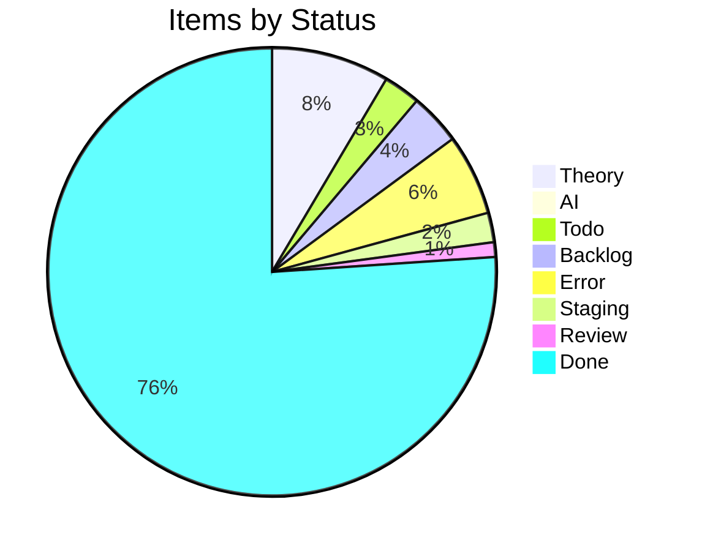
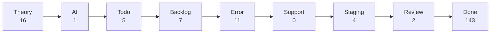

import { Card, CardGrid } from '@astrojs/starlight/components';

## Project Board Snapshot

:::note[Auto-generated]
Last synced: **2026-03-18T06:21:31.538Z** — updated daily by `ci-dashboard`.
Source: [KBVE Project Board](https://github.com/orgs/KBVE/projects/5)
:::

### Summary

<CardGrid>
  <Card title="Theory" icon="star">
    **16** items
  </Card>
  <Card title="AI" icon="rocket">
    **1** items
  </Card>
  <Card title="Todo" icon="list-format">
    **5** items
  </Card>
  <Card title="Backlog" icon="document">
    **7** items
  </Card>
  <Card title="Error" icon="warning">
    **11** items
  </Card>
  <Card title="Support" icon="information">
    **0** items
  </Card>
  <Card title="Staging" icon="setting">
    **4** items
  </Card>
  <Card title="Review" icon="approve-check">
    **2** items
  </Card>
  <Card title="Done" icon="approve-check-circle">
    **143** items
  </Card>
</CardGrid>

### Distribution

### Pipeline Flow

### Theory (16)

| # | Title | Priority | Assignees | Labels |
|---|-------|----------|-----------|--------|
| [#2252](https://github.com/KBVE/kbve/issues/2252) | [Concept] : Shop Layout - Merch, Hardware, Services. | — | — | 1, enhancement |
| [#2362](https://github.com/KBVE/kbve/issues/2362) | [Concept] : [ItemDB] - Rigged Dice - 6 Items | — | h0lybyte | 1, enhancement |
| [#3472](https://github.com/KBVE/kbve/issues/3472) | [Concept] : [Unity] : TileMap GameObject | — | h0lybyte | 0, enhancement, unity |
| [#4643](https://github.com/KBVE/kbve/issues/4643) | [Concept] : [Unity] : Transport System | — | h0lybyte | 0, enhancement, unity |
| [#4812](https://github.com/KBVE/kbve/issues/4812) | [Concept] : [Unity] : Elven Mage - Character | — | h0lybyte | 0, enhancement, unity |
| [#5624](https://github.com/KBVE/kbve/issues/5624) | [Concept] : Add Intel NUC worker nodes to existing Talos KBVE cluster | — | h0lybyte, Copilot | 0, enhancement |
| [#6436](https://github.com/KBVE/kbve/issues/6436) | [Concept] : [Unity] : NPCDB - ECS | — | h0lybyte | 0, enhancement, unity |
| [#6437](https://github.com/KBVE/kbve/issues/6437) | [Concept] : [Unity] : Pathfinding ECS | — | h0lybyte | 0, enhancement, unity |
| [#6438](https://github.com/KBVE/kbve/issues/6438) | [Concept] : [Unity] : ItemDB ECS Migration | — | h0lybyte | 0, enhancement, unity |
| [#6446](https://github.com/KBVE/kbve/issues/6446) | [Concept] : [Unity] : MapDB - Schemas | — | h0lybyte | 0, enhancement, unity |
| [#6576](https://github.com/KBVE/kbve/issues/6576) | [Concept] : [Unity] : Entity Blittable System | — | h0lybyte | 0, enhancement, unity |
| [#7547](https://github.com/KBVE/kbve/issues/7547) | [MC] [Pumpkin] Implement CMerchantOffers packet and Merchant Trading GUI | — | h0lybyte | 0, enhancement |
| [#7730](https://github.com/KBVE/kbve/issues/7730) | [DISCORDSH] Rust-First Vote Process — Rate-Limited Server Voting Pipeline | — | h0lybyte | 1, enhancement, security |
| [#7593](https://github.com/KBVE/kbve/issues/7593) | [PG] Deploy CNPG Pooler (PgBouncer) and migrate services from direct -rw connect | — | h0lybyte | 2, enhancement, dependencies |
| [#8180](https://github.com/KBVE/kbve/issues/8180) | [DISCORDSH] POC: Mockoon docker-compose for local E2E testing | — | h0lybyte | 1, enhancement |
| [#8189](https://github.com/KBVE/kbve/issues/8189) | [BEVY] NPC Creatures — Performance Audit | — | — | enhancement |

### AI (1)

| # | Title | Priority | Assignees | Labels |
|---|-------|----------|-----------|--------|
| [#4906](https://github.com/KBVE/kbve/issues/4906) | [Bug] : [Unity] : Character Orchestrator | — | h0lybyte | 0, bug, unity |

### Todo (5)

| # | Title | Priority | Assignees | Labels |
|---|-------|----------|-----------|--------|
| [#3572](https://github.com/KBVE/kbve/issues/3572) | [Update] : [Fudster] : User Billing &amp; Auth | — | h0lybyte | 1, security, update |
| [#4232](https://github.com/KBVE/kbve/issues/4232) | [Update] : [Github] : Rotate Tokens + Refactor Permissions | — | h0lybyte | 1, security, update |
| [#6939](https://github.com/KBVE/kbve/issues/6939) | [EPIC] Agent Orchestration Tab | — | — | 0, todo |
| [#8134](https://github.com/KBVE/kbve/issues/8134) | feat(proto): ClickHouse schema source of truth via protobuf → zod → vector pipel | — | h0lybyte | 4, documentation, todo |
| [#8170](https://github.com/KBVE/kbve/issues/8170) | feat(proto): ArgoCD application state schema via protobuf → zod → edge pipeline | — | h0lybyte | 4, documentation, todo |

### Backlog (7)

| # | Title | Priority | Assignees | Labels |
|---|-------|----------|-----------|--------|
| [#75](https://github.com/KBVE/kbve/issues/75) | [Concept] : HerbMail.com - Front Page | — | — | 1, backlog |
| [#96](https://github.com/KBVE/kbve/issues/96) | [Concept] : [Backend] : Charles. | — | h0lybyte | 0, backlog |
| [#416](https://github.com/KBVE/kbve/issues/416) | [Concept] : FlyIO Deployment | — | — | 0, backlog |
| [#1559](https://github.com/KBVE/kbve/issues/1559) | [Concept] : Adding TailwindCSS Example Components | — | — | 2, backlog |
| [#4642](https://github.com/KBVE/kbve/issues/4642) | [Concept] : [Unity] : Droid System - Hybrid NPC System. | — | h0lybyte | 0, enhancement, backlog |
| [#7548](https://github.com/KBVE/kbve/issues/7548) | feat(memes): responsive bento grid feed + dedicated meme pages | — | h0lybyte | 1, backlog |
| [#7709](https://github.com/KBVE/kbve/issues/7709) | [CRYPTOTHRONE] Inventory System, Event Bridge, and Gameplay Loop Completion | — | h0lybyte | 1, enhancement, backlog |

### Error (11)

| # | Title | Priority | Assignees | Labels |
|---|-------|----------|-----------|--------|
| [#2992](https://github.com/KBVE/kbve/issues/2992) | [Bug] LofiFocus is down - [PENDING] Ingress | — | h0lybyte | 0, bug |
| [#3536](https://github.com/KBVE/kbve/issues/3536) | [Bug] : Update CONTRIBUE.MD | — | h0lybyte | 0, bug |
| [#3538](https://github.com/KBVE/kbve/issues/3538) | [Bug] : [Unity] : Gameplay Mechanics - Farming &amp; Crafting | — | h0lybyte | 0, bug, unity |
| [#4538](https://github.com/KBVE/kbve/issues/4538) | [Bug] : [Unity] : Multiplayer / Steam Integration | — | h0lybyte | 0, bug, unity |
| [#4623](https://github.com/KBVE/kbve/issues/4623) | [Bug] : [Unity] : Procedural Map Generation | — | h0lybyte | 2, bug, unity |
| [#4797](https://github.com/KBVE/kbve/issues/4797) | [Bug] : [Unity] : Enemy Ai should attack player structures, if players are not a | — | h0lybyte | 4, bug, unity |
| [#6705](https://github.com/KBVE/kbve/issues/6705) | [Bug] : [Unity] : Chip Character Sheet Off Center Sprites | — | h0lybyte | 0, bug, unity |
| [#7761](https://github.com/KBVE/kbve/issues/7761) | [PSQL] Schema Optimizations - Memes, Realtime, Discordsh | — | h0lybyte | 3, bug, security |
| [#7956](https://github.com/KBVE/kbve/issues/7956) | chore(astro-kbve): re-enable starlight-site-graph after Zod 4 / Astro 6 support | — | — | 1, bug, backlog |
| [#8169](https://github.com/KBVE/kbve/issues/8169) | [CI] Docker image version mismatch — cached binary reports stale version | — | — | 6, bug, ci |
| [#8172](https://github.com/KBVE/kbve/issues/8172) | [ISOMETRIC] Lint deployments — validate WASM build assets before merge | — | — | 6, bug, ci |

### Staging (4)

| # | Title | Priority | Assignees | Labels |
|---|-------|----------|-----------|--------|
| [#2208](https://github.com/KBVE/kbve/issues/2208) | [Concept] Service Page Enchancemnts | — | h0lybyte, dladeira | 4 |
| [#2267](https://github.com/KBVE/kbve/issues/2267) | [Concept] : CryptoThrone.com - King of the Hill App/Game | — | h0lybyte, BChip | 6 |
| [#3396](https://github.com/KBVE/kbve/issues/3396) | [Concept] : [Unity] : Adding Quirky Character Pack by Noiryt | — | h0lybyte | 4, unity |
| [#6943](https://github.com/KBVE/kbve/issues/6943) | Phase 2: Frontend - Orchestration Tab | — | — | todo |

### Review (2)

| # | Title | Priority | Assignees | Labels |
|---|-------|----------|-----------|--------|
| [#8050](https://github.com/KBVE/kbve/pull/8050) | Release: 4 features, 1 chore → Main | — | — | auto-pr, dev→main |
| [#8209](https://github.com/KBVE/kbve/pull/8209) | Release: 8 features, 10 fixes, 2 refactors, 5 chores → Main | — | — | auto-pr, dev→main |

### Done (143)

| # | Title | Priority | Assignees | Labels |
|---|-------|----------|-----------|--------|
| [#5442](https://github.com/KBVE/kbve/issues/5442) | [Suggestion] : [Godot] : Pirate 17 - Airship - Dialogue System Improvements | — | h0lybyte | 0, bug, godot |
| [#7497](https://github.com/KBVE/kbve/issues/7497) | [VAULT] Discord Guild Secrets + Token Management | — | — | enhancement |
| [#7515](https://github.com/KBVE/kbve/issues/7515) | [VAULT] Edge Function: Discord Guild Ownership Verification + Token Management A | — | — | enhancement |
| [#7585](https://github.com/KBVE/kbve/pull/7585) | Release: 6 features, 1 fix → Main | — | — | auto-pr, dev→main |
| [#7596](https://github.com/KBVE/kbve/pull/7596) | Release: 1 fix → Main | — | — | auto-pr, dev→main |
| [#7600](https://github.com/KBVE/kbve/pull/7600) | Release: 6 features, 3 fixes, 1 chore → Main | — | — | auto-pr, dev→main |
| [#7608](https://github.com/KBVE/kbve/pull/7608) | Release: 3 chores → Main | — | — | auto-pr, dev→main |
| [#7610](https://github.com/KBVE/kbve/pull/7610) | Atomic: kube memes v0.1.6 | — | — | auto-pr, atomic |
| [#7611](https://github.com/KBVE/kbve/pull/7611) | Atomic: kube irc-gateway v0.1.2 | — | — | auto-pr, atomic |
| [#7613](https://github.com/KBVE/kbve/pull/7613) | Release: 3 features, 4 fixes, 2 chores → Main | — | — | auto-pr, dev→main |
| [#7626](https://github.com/KBVE/kbve/pull/7626) | Release: 3 features, 2 fixes → Main | — | — | auto-pr, dev→main |
| [#7631](https://github.com/KBVE/kbve/pull/7631) | Release: 3 features → Main | — | — | auto-pr, dev→main |
| [#7635](https://github.com/KBVE/kbve/pull/7635) | Release: 1 fix, 1 CI, 1 test → Main | — | — | auto-pr, dev→main |
| [#7638](https://github.com/KBVE/kbve/pull/7638) | Release: 2 chores → Main | — | — | auto-pr, dev→main |
| [#7642](https://github.com/KBVE/kbve/pull/7642) | Release: 2 fixes → Main | — | — | auto-pr, dev→main |
| [#7645](https://github.com/KBVE/kbve/pull/7645) | Release: 1 feature → Main | — | — | auto-pr, dev→main |
| [#7651](https://github.com/KBVE/kbve/pull/7651) | Release: 7 features, 3 fixes → Main | — | — | auto-pr, dev→main |
| [#7665](https://github.com/KBVE/kbve/pull/7665) | Release: 6 features, 2 fixes, 1 CI, 2 chores → Main | — | — | auto-pr, dev→main |
| [#7675](https://github.com/KBVE/kbve/pull/7675) | Atomic: kube discordsh v0.1.27 | — | — | auto-pr, atomic |
| [#7678](https://github.com/KBVE/kbve/pull/7678) | Atomic: kube cryptothrone v0.1.1 | — | — | auto-pr, atomic |
| [#7679](https://github.com/KBVE/kbve/pull/7679) | Release: 1 fix, 4 chores → Main | — | — | auto-pr, dev→main |
| [#7688](https://github.com/KBVE/kbve/pull/7688) | Atomic: kube cryptothrone v0.1.2 | — | — | auto-pr, atomic |
| [#7694](https://github.com/KBVE/kbve/pull/7694) | Release: 2 features, 3 fixes, 1 chore → Main | — | — | auto-pr, dev→main |
| [#7697](https://github.com/KBVE/kbve/pull/7697) | Atomic: kube edge v0.1.10 | — | — | auto-pr, atomic |
| [#7698](https://github.com/KBVE/kbve/pull/7698) | Release: 4 features, 1 fix, 1 chore → Main | — | — | auto-pr, dev→main |
| [#7705](https://github.com/KBVE/kbve/issues/7705) | [VAULT] Guild Vault End-to-End Integration: Bot, OAuth, UI, Tests | — | — | enhancement, security |
| [#7708](https://github.com/KBVE/kbve/pull/7708) | Release: 1 feature, 1 chore → Main | — | — | auto-pr, dev→main |
| [#7711](https://github.com/KBVE/kbve/pull/7711) | Release: 1 feature, 1 chore → Main | — | — | auto-pr, dev→main |
| [#7712](https://github.com/KBVE/kbve/issues/7712) | [DISCORDSH] Astro-DiscordSH UI/Performance Audit — Improvements &amp; Million.js | — | — | enhancement |
| [#7717](https://github.com/KBVE/kbve/pull/7717) | Release: 2 fixes, 1 test → Main | — | — | auto-pr, dev→main |
| [#7720](https://github.com/KBVE/kbve/pull/7720) | Release: 1 fix → Main | — | — | auto-pr, dev→main |
| [#7723](https://github.com/KBVE/kbve/pull/7723) | Release: 2 fixes → Main | — | — | auto-pr, dev→main |
| [#7726](https://github.com/KBVE/kbve/pull/7726) | Release: 4 fixes, 1 chore → Main | — | — | auto-pr, dev→main |
| [#7727](https://github.com/KBVE/kbve/issues/7727) | [DISCORDSH] Rust-First Server Submission Pipeline — Belt &amp; Suspenders Valida | — | h0lybyte | enhancement |
| [#7734](https://github.com/KBVE/kbve/pull/7734) | Release: 1 feature, 2 fixes → Main | — | — | auto-pr, dev→main |
| [#7741](https://github.com/KBVE/kbve/pull/7741) | Atomic: kube discordsh v0.1.28 | — | — | auto-pr, atomic |
| [#7742](https://github.com/KBVE/kbve/pull/7742) | Release: 2 features, 1 fix, 1 chore → Main | — | — | auto-pr, dev→main |
| [#7744](https://github.com/KBVE/kbve/pull/7744) | Atomic: kube cryptothrone v0.1.4 | — | — | auto-pr, atomic |
| [#7746](https://github.com/KBVE/kbve/pull/7746) | Release: 1 fix, 1 chore → Main | — | — | auto-pr, dev→main |
| [#7749](https://github.com/KBVE/kbve/pull/7749) | Release: 3 fixes → Main | — | — | auto-pr, dev→main |
| [#7752](https://github.com/KBVE/kbve/pull/7752) | Release: 1 feature, 1 fix, 2 chores → Main | — | — | auto-pr, dev→main |
| [#7755](https://github.com/KBVE/kbve/pull/7755) | Atomic: kube axum-kbve v1.0.32 | — | — | auto-pr, atomic |
| [#7756](https://github.com/KBVE/kbve/pull/7756) | Release: 4 features, 2 fixes, 1 chore → Main | — | — | auto-pr, dev→main |
| [#7765](https://github.com/KBVE/kbve/pull/7765) | Release: 6 features, 1 chore → Main | — | — | auto-pr, dev→main |
| [#7771](https://github.com/KBVE/kbve/pull/7771) | Atomic: kube axum-kbve v1.0.33 | — | — | auto-pr, atomic |
| [#7776](https://github.com/KBVE/kbve/pull/7776) | Release: 4 features, 4 fixes, 2 chores → Main | — | — | auto-pr, dev→main |
| [#7782](https://github.com/KBVE/kbve/pull/7782) | Atomic: bump axum kbve 1034 | — | — | auto-pr, atomic |
| [#7784](https://github.com/KBVE/kbve/pull/7784) | Release: 1 feature, 1 fix, 1 chore → Main | — | — | auto-pr, dev→main |
| [#7785](https://github.com/KBVE/kbve/pull/7785) | Atomic: kube axum-kbve v1.0.34 | — | — | auto-pr, atomic |
| [#7788](https://github.com/KBVE/kbve/pull/7788) | Release: 1 feature, 1 fix, 1 chore → Main | — | — | auto-pr, dev→main |
| [#7789](https://github.com/KBVE/kbve/pull/7789) | Atomic: bump axum 1035 | — | — | auto-pr, atomic |
| [#7792](https://github.com/KBVE/kbve/pull/7792) | Release: 2 features, 1 fix, 1 chore → Main | — | — | auto-pr, dev→main |
| [#7794](https://github.com/KBVE/kbve/pull/7794) | Atomic: kube axum-kbve v1.0.35 | — | — | auto-pr, atomic |
| [#7800](https://github.com/KBVE/kbve/pull/7800) | Release: 2 features, 3 fixes, 1 chore → Main | — | — | auto-pr, dev→main |
| [#7801](https://github.com/KBVE/kbve/pull/7801) | Atomic: axum bump | — | — | auto-pr, atomic |
| [#7804](https://github.com/KBVE/kbve/pull/7804) | Release: 1 perf, 2 chores → Main | — | — | auto-pr, dev→main |
| [#7805](https://github.com/KBVE/kbve/pull/7805) | Atomic: ci atom body | — | — | auto-pr, atomic |
| [#7806](https://github.com/KBVE/kbve/pull/7806) | Atomic: kube axum-kbve v1.0.36 | — | — | auto-pr, atomic |
| [#7809](https://github.com/KBVE/kbve/pull/7809) | Release: 3 fixes, 1 perf, 1 chore → Main | — | — | auto-pr, dev→main |
| [#7826](https://github.com/KBVE/kbve/pull/7826) | Release: 4 features, 1 chore → Main | — | — | auto-pr, dev→main |
| [#7829](https://github.com/KBVE/kbve/pull/7829) | Atomic: kube axum-kbve v1.0.37 | — | — | auto-pr, atomic |
| [#7832](https://github.com/KBVE/kbve/pull/7832) | Release: 8 features, 1 fix, 1 refactor, 3 chores → Main | — | — | auto-pr, dev→main |
| [#7843](https://github.com/KBVE/kbve/pull/7843) | Atomic: kube axum-kbve v1.0.38 | — | — | auto-pr, atomic |
| [#7844](https://github.com/KBVE/kbve/pull/7844) | Release: 1 feature, 2 chores → Main | — | — | auto-pr, dev→main |
| [#7848](https://github.com/KBVE/kbve/pull/7848) | Release: 10 features, 3 fixes, 1 refactor, 2 chores → Main | — | — | auto-pr, dev→main |
| [#7870](https://github.com/KBVE/kbve/pull/7870) | Atomic: kube axum-kbve v1.0.39 | — | — | auto-pr, atomic |
| [#7871](https://github.com/KBVE/kbve/pull/7871) | Release: 1 chore → Main | — | — | auto-pr, dev→main |
| [#7873](https://github.com/KBVE/kbve/pull/7873) | Release: 5 features, 4 fixes, 1 chore → Main | — | — | auto-pr, dev→main |
| [#7882](https://github.com/KBVE/kbve/pull/7882) | Atomic: kube axum-kbve v1.0.40 | — | — | auto-pr, atomic |
| [#7883](https://github.com/KBVE/kbve/pull/7883) | Release: 1 chore → Main | — | — | auto-pr, dev→main |
| [#7885](https://github.com/KBVE/kbve/pull/7885) | Release: 2 features, 1 fix, 1 chore → Main | — | — | auto-pr, dev→main |
| [#7888](https://github.com/KBVE/kbve/pull/7888) | Atomic: kube axum-kbve v1.0.41 | — | — | auto-pr, atomic |
| [#7889](https://github.com/KBVE/kbve/pull/7889) | Release: 1 chore → Main | — | — | auto-pr, dev→main |
| [#7891](https://github.com/KBVE/kbve/pull/7891) | Release: 12 features, 3 fixes, 1 test, 1 chore → Main | — | — | auto-pr, dev→main |
| [#7909](https://github.com/KBVE/kbve/pull/7909) | Release: 9 features, 2 fixes, 3 refactors, 1 chore → Main | — | — | auto-pr, dev→main |
| [#7913](https://github.com/KBVE/kbve/pull/7913) | Atomic: kube axum-kbve v1.0.42 | — | — | auto-pr, atomic |
| [#7918](https://github.com/KBVE/kbve/pull/7918) | Atomic: jedi doctest fix | — | — | auto-pr, atomic |
| [#7927](https://github.com/KBVE/kbve/pull/7927) | Release: 1 fix → Main | — | — | auto-pr, dev→main |
| [#7929](https://github.com/KBVE/kbve/pull/7929) | Release: 7 features, 5 fixes, 1 refactor, 1 test, 3 chores → Main | — | — | auto-pr, dev→main |
| [#7943](https://github.com/KBVE/kbve/pull/7943) | Release: 10 features, 6 fixes, 1 refactor, 2 chores → Main | — | — | auto-pr, dev→main |
| [#7965](https://github.com/KBVE/kbve/pull/7965) | Release: 4 features, 3 fixes, 1 doc, 1 refactor, 8 chores → Main | — | — | auto-pr, dev→main |
| [#7972](https://github.com/KBVE/kbve/pull/7972) | Atomic: kube axum-kbve v1.0.44 | — | — | auto-pr, atomic |
| [#7980](https://github.com/KBVE/kbve/pull/7980) | Release: 3 features, 2 chores → Main | — | — | auto-pr, dev→main |
| [#7984](https://github.com/KBVE/kbve/pull/7984) | Atomic: kube discordsh v0.1.31 | — | — | auto-pr, atomic |
| [#7988](https://github.com/KBVE/kbve/pull/7988) | Release: 1 feature, 2 fixes, 2 chores → Main | — | — | auto-pr, dev→main |
| [#7990](https://github.com/KBVE/kbve/pull/7990) | Atomic: remove v atlas workflow | — | — | auto-pr, atomic |
| [#7993](https://github.com/KBVE/kbve/pull/7993) | Release: 2 features, 4 fixes, 2 chores → Main | — | — | auto-pr, dev→main |
| [#7999](https://github.com/KBVE/kbve/pull/7999) | Atomic: fix nx report gh cli | — | — | auto-pr, atomic |
| [#8001](https://github.com/KBVE/kbve/pull/8001) | Release: 4 features, 4 fixes, 1 chore → Main | — | — | auto-pr, dev→main |
| [#8012](https://github.com/KBVE/kbve/pull/8012) | Release: 5 features → Main | — | — | auto-pr, dev→main |
| [#8019](https://github.com/KBVE/kbve/pull/8019) | Atomic: kube axum-kbve v1.0.47 | — | — | auto-pr, atomic |
| [#8021](https://github.com/KBVE/kbve/pull/8021) | Release: 4 features, 5 fixes, 1 chore → Main | — | — | auto-pr, dev→main |
| [#8031](https://github.com/KBVE/kbve/pull/8031) | Atomic: kube axum-kbve v1.0.48 | — | — | auto-pr, atomic |
| [#8032](https://github.com/KBVE/kbve/pull/8032) | Release: 1 chore → Main | — | — | auto-pr, dev→main |
| [#8034](https://github.com/KBVE/kbve/pull/8034) | Release: 1 fix → Main | — | — | auto-pr, dev→main |
| [#8037](https://github.com/KBVE/kbve/pull/8037) | Release: 4 features, 2 fixes, 1 chore → Main | — | — | auto-pr, dev→main |
| [#8042](https://github.com/KBVE/kbve/pull/8042) | Release: 1 feature, 6 fixes, 1 chore → Main | — | — | auto-pr, dev→main |
| [#8047](https://github.com/KBVE/kbve/pull/8047) | Release: 1 feature, 1 chore → Main | — | — | auto-pr, dev→main |
| [#8049](https://github.com/KBVE/kbve/pull/8049) | Atomic: kube axum-kbve v1.0.50 | — | — | auto-pr, atomic |
| [#8055](https://github.com/KBVE/kbve/pull/8055) | Release: 1 fix → Main | — | — | auto-pr, dev→main |
| [#8058](https://github.com/KBVE/kbve/pull/8058) | Release: 1 fix → Main | — | — | auto-pr, dev→main |
| [#8060](https://github.com/KBVE/kbve/pull/8060) | Atomic: kube axum-kbve v1.0.51 | — | — | auto-pr, atomic |
| [#8066](https://github.com/KBVE/kbve/pull/8066) | Release: 2 features, 1 chore → Main | — | — | auto-pr, dev→main |
| [#8072](https://github.com/KBVE/kbve/pull/8072) | Release: 2 features, 1 fix, 5 chores → Main | — | — | auto-pr, dev→main |
| [#8078](https://github.com/KBVE/kbve/pull/8078) | Release: 3 features, 1 fix → Main | — | — | auto-pr, dev→main |
| [#8085](https://github.com/KBVE/kbve/pull/8085) | Release: 1 feature, 1 fix, 1 chore → Main | — | — | auto-pr, dev→main |
| [#8088](https://github.com/KBVE/kbve/pull/8088) | Release: 3 features, 1 fix, 1 test, 7 chores → Main | — | — | auto-pr, dev→main |
| [#8090](https://github.com/KBVE/kbve/pull/8090) | Atomic: kube axum-kbve v1.0.52 | — | — | auto-pr, atomic |
| [#8097](https://github.com/KBVE/kbve/pull/8097) | Release: 2 features, 8 fixes, 3 chores → Main | — | — | auto-pr, dev→main |
| [#8109](https://github.com/KBVE/kbve/pull/8109) | Release: 1 feature, 1 perf → Main | — | — | auto-pr, dev→main |
| [#8111](https://github.com/KBVE/kbve/issues/8111) | feat(discordsh): Phase 3b Quest Integration + Phase 4 Session Persistence | — | — | enhancement |
| [#8113](https://github.com/KBVE/kbve/pull/8113) | Release: 1 fix → Main | — | — | auto-pr, dev→main |
| [#8114](https://github.com/KBVE/kbve/pull/8114) | Release: 2 features, 4 fixes, 3 chores → Main | — | — | auto-pr, dev→main |
| [#8117](https://github.com/KBVE/kbve/pull/8117) | Release: 4 fixes, 1 doc, 3 perfs, 1 chore → Main | — | — | auto-pr, dev→main |
| [#8122](https://github.com/KBVE/kbve/pull/8122) | Atomic: kube axum-kbve v1.0.55 | — | — | auto-pr, atomic |
| [#8123](https://github.com/KBVE/kbve/pull/8123) | Release: 7 features, 7 fixes, 1 refactor, 1 test, 2 chores → Main | — | — | auto-pr, dev→main |
| [#8137](https://github.com/KBVE/kbve/issues/8137) | feat(ci): daily kanban sync workflow — nx-kanban.json + nx-kanban.mdx from GitHu | — | — | 4, documentation |
| [#7849](https://github.com/KBVE/kbve/issues/7849) | [DISCORDSH] GitHub API ↔ Supabase Vault ↔ Discord Embed Integration | — | h0lybyte | 6, enhancement |
| [#8015](https://github.com/KBVE/kbve/issues/8015) | feat: migrate Supabase Analytics from PostgreSQL to ClickHouse | — | h0lybyte | 5, enhancement, todo |
| [#7866](https://github.com/KBVE/kbve/issues/7866) | [ISOMETRIC] [BEVY] Replace MeshPickingPlugin with Rapier raycast hover detection | — | h0lybyte | 1, backlog, rust |
| [#7855](https://github.com/KBVE/kbve/issues/7855) | [DISCORDSH] Add slash commands and scheduled triggers for embeds | — | h0lybyte | 0, enhancement, rust |
| [#7856](https://github.com/KBVE/kbve/issues/7856) | [DISCORDSH] End-to-end testing with live GitHub repo data | — | h0lybyte | 0, enhancement |
| [#8142](https://github.com/KBVE/kbve/pull/8142) | Release: 1 feature, 1 fix, 1 chore → Main | — | — | auto-pr, dev→main |
| [#8146](https://github.com/KBVE/kbve/pull/8146) | Release: 1 feature, 2 fixes, 3 chores → Main | — | — | auto-pr, dev→main |
| [#8153](https://github.com/KBVE/kbve/pull/8153) | Atomic: kube axum-kbve v1.0.57 | — | — | auto-pr, atomic |
| [#8159](https://github.com/KBVE/kbve/pull/8159) | Release: 1 feature, 3 fixes, 1 chore → Main | — | — | auto-pr, dev→main |
| [#8160](https://github.com/KBVE/kbve/pull/8160) | Atomic: edge version bump | — | — | auto-pr, atomic |
| [#8163](https://github.com/KBVE/kbve/pull/8163) | Release: 2 features, 1 fix, 1 chore → Main | — | — | auto-pr, dev→main |
| [#8164](https://github.com/KBVE/kbve/pull/8164) | Atomic: kube axum-kbve v1.0.58 | — | — | auto-pr, atomic |
| [#8175](https://github.com/KBVE/kbve/pull/8175) | Release: 1 fix, 1 doc, 1 test → Main | — | — | auto-pr, dev→main |
| [#8181](https://github.com/KBVE/kbve/pull/8181) | Release: 4 features, 1 fix, 1 test, 1 chore → Main | — | — | auto-pr, dev→main |
| [#8183](https://github.com/KBVE/kbve/issues/8183) | [SECURITY] Exclude generated WASM assets from CodeQL scanning | — | — | 6, bug, ci |
| [#8192](https://github.com/KBVE/kbve/pull/8192) | Atomic: kube axum-kbve v1.0.60 | — | — | auto-pr, atomic |
| [#8193](https://github.com/KBVE/kbve/pull/8193) | Release: 1 chore → Main | — | — | auto-pr, dev→main |
| [#8195](https://github.com/KBVE/kbve/pull/8195) | Release: 3 fixes, 1 CI → Main | — | — | auto-pr, dev→main |
| [#8196](https://github.com/KBVE/kbve/issues/8196) | [CI] Refactor ci-main.yml into dispatcher + independent domain workflows | — | — | 6, bug, ci |
| [#8200](https://github.com/KBVE/kbve/pull/8200) | Atomic: coep assets fix | — | — | auto-pr, atomic |
| [#8202](https://github.com/KBVE/kbve/issues/8202) | feat(astro-kbve): /music/ splash page with Jukebox YouTube player component | — | — | enhancement, todo |
| [#8203](https://github.com/KBVE/kbve/pull/8203) | Release: 2 features, 5 fixes, 2 chores → Main | — | — | auto-pr, dev→main |
| [#8206](https://github.com/KBVE/kbve/pull/8206) | chore(kanban): sync project board — 2026-03-17 | — | — | 1, auto-pr |
| [#8207](https://github.com/KBVE/kbve/pull/8207) | Atomic: kube axum-kbve v1.0.61 | — | — | auto-pr, atomic |
| [#8211](https://github.com/KBVE/kbve/pull/8211) | fix(isometric): Safari WebGPU crashes — setBindGroup SharedArrayBuffer shim + wi | — | — | 1, auto-pr |
| [#8212](https://github.com/KBVE/kbve/pull/8212) | Atomic: astro queued rendering | — | — | auto-pr, atomic |

---

*Auto-generated by [ci-dashboard.yml](https://github.com/KBVE/kbve/actions/workflows/ci-dashboard.yml)*
