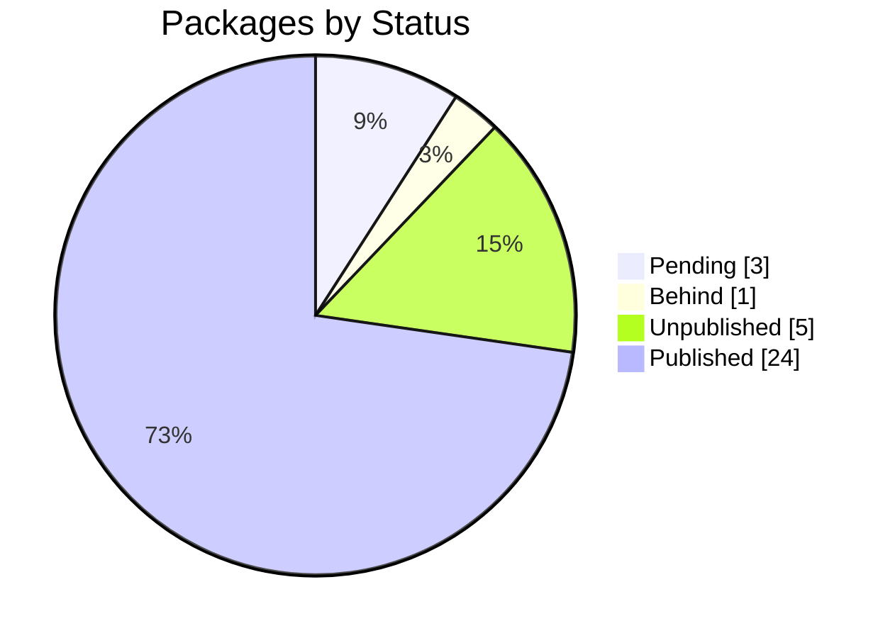

import BentoShell from '@/components/hero/BentoShell.astro';
import BentoProse from '@/components/hero/BentoProse.astro';

<section class="bento-hero bento-section not-content" aria-label="Release radar">
	

	

		

			

				
					<svg viewBox="0 0 24 24" width="14" height="14" fill="none" stroke="currentColor" stroke-width="1.75" stroke-linecap="round" stroke-linejoin="round" aria-hidden="true"><path d="M12 2a10 10 0 1 0 0 20 10 10 0 0 0 0-20zM12 6v6l4 2" /></svg>
					auto-generated · daily
				
				<h1 class="bento-title">
					Release radar
					manifest versus registry.
				</h1>
				
<strong>3</strong> packages ahead of the registry — pending publish.

				
Last generated <strong>2026-07-20T04:35:41Z</strong>.

				

					<a class="bento-btn bento-btn--primary" href="#ecosystems">
						View drift
						<svg viewBox="0 0 24 24" fill="none" stroke="currentColor" aria-hidden="true"><path stroke-linecap="round" stroke-linejoin="round" stroke-width="2" d="M5 12h14M13 6l6 6-6 6" /></svg>
					</a>
					<a class="bento-btn bento-btn--ghost" href="#packages">Packages</a>
					<a class="bento-btn bento-btn--ghost" href="/dashboard/">Dashboard home</a>
				

			

				

					
						<svg viewBox="0 0 24 24" width="16" height="16" fill="none" stroke="currentColor" stroke-width="1.75" stroke-linecap="round" stroke-linejoin="round" aria-hidden="true"><path d="M12 2 2 7l10 5 10-5zM2 17l10 5 10-5M2 12l10 5 10-5" /></svg>
					
					33
					Tracked
				

				

					
						<svg viewBox="0 0 24 24" width="16" height="16" fill="none" stroke="currentColor" stroke-width="1.75" stroke-linecap="round" stroke-linejoin="round" aria-hidden="true"><path d="M12 19V5M5 12l7-7 7 7" /></svg>
					
					3
					Pending
				

				

					
						<svg viewBox="0 0 24 24" width="16" height="16" fill="none" stroke="currentColor" stroke-width="1.75" stroke-linecap="round" stroke-linejoin="round" aria-hidden="true"><path d="M12 5v14M5 12l7 7 7-7" /></svg>
					
					1
					Behind
				

				

					
						<svg viewBox="0 0 24 24" width="16" height="16" fill="none" stroke="currentColor" stroke-width="1.75" stroke-linecap="round" stroke-linejoin="round" aria-hidden="true"><path d="M12 9v4m0 4h.01M10.3 3.9 1.8 18a2 2 0 0 0 1.7 3h17a2 2 0 0 0 1.7-3L13.7 3.9a2 2 0 0 0-3.4 0z" /></svg>
					
					5
					Unpublished
				

				

					
						<svg viewBox="0 0 24 24" width="16" height="16" fill="none" stroke="currentColor" stroke-width="1.75" stroke-linecap="round" stroke-linejoin="round" aria-hidden="true"><path d="M22 11.1V12a10 10 0 1 1-5.9-9.1M22 4 12 14.01l-3-3" /></svg>
					
					24
					Published
				

		

		<nav class="bento-jump" aria-label="On this page">
			<a class="bento-chip" href="#ecosystems">Ecosystems</a>
			<a class="bento-chip" href="#packages">Packages</a>
		</nav>
	

</section>

<BentoShell id="ecosystems" eyebrow="Registries" heading="Ecosystem status">
	

		<a class="bento-cell bento-linkcard bento-card bento-card--glass bento-card--interactive" href="#packages">
			
				<svg viewBox="0 0 24 24" width="18" height="18" fill="none" stroke="currentColor" stroke-width="1.75" stroke-linecap="round" stroke-linejoin="round" aria-hidden="true"><path d="M12 2 2 7l10 5 10-5zM2 17l10 5 10-5M2 12l10 5 10-5" /></svg>
			
			Crates.io
			27 tracked · 2 pending
			
				<svg viewBox="0 0 24 24" width="16" height="16" fill="none" stroke="currentColor" stroke-width="2" stroke-linecap="round" stroke-linejoin="round"><path d="M5 12h14M13 6l6 6-6 6" /></svg>
			
		</a>
		<a class="bento-cell bento-linkcard bento-card bento-card--glass bento-card--interactive" href="#packages">
			
				<svg viewBox="0 0 24 24" width="18" height="18" fill="none" stroke="currentColor" stroke-width="1.75" stroke-linecap="round" stroke-linejoin="round" aria-hidden="true"><path d="M12 2 2 7l10 5 10-5zM2 17l10 5 10-5M2 12l10 5 10-5" /></svg>
			
			npm
			4 tracked · 1 pending
			
				<svg viewBox="0 0 24 24" width="16" height="16" fill="none" stroke="currentColor" stroke-width="2" stroke-linecap="round" stroke-linejoin="round"><path d="M5 12h14M13 6l6 6-6 6" /></svg>
			
		</a>
		<a class="bento-cell bento-linkcard bento-card bento-card--glass bento-card--interactive" href="#packages">
			
				<svg viewBox="0 0 24 24" width="18" height="18" fill="none" stroke="currentColor" stroke-width="1.75" stroke-linecap="round" stroke-linejoin="round" aria-hidden="true"><path d="M12 2 2 7l10 5 10-5zM2 17l10 5 10-5M2 12l10 5 10-5" /></svg>
			
			PyPI
			2 tracked · 0 pending
			
				<svg viewBox="0 0 24 24" width="16" height="16" fill="none" stroke="currentColor" stroke-width="2" stroke-linecap="round" stroke-linejoin="round"><path d="M5 12h14M13 6l6 6-6 6" /></svg>
			
		</a>
	

</BentoShell>

<BentoProse id="packages" heading="Package status">

| Ecosystem | Package | Local | Published | Status |
|-----------|---------|-------|-----------|--------|
| Crates.io | bevy_battle | 0.1.0 | 0.1.0 | Published |
| Crates.io | bevy_behavior | 0.1.0 | 0.1.0 | Published |
| Crates.io | bevy_cam | 0.1.0 | 0.1.0 | Published |
| Crates.io | bevy_chat | 0.1.0 | 0.1.0 | Published |
| Crates.io | bevy_db | 0.1.0 | 0.1.0 | Published |
| Crates.io | bevy_inventory | 0.1.0 | 0.1.0 | Published |
| Crates.io | bevy_items | 0.1.0 | 0.1.0 | Published |
| Crates.io | bevy_kbve_net | 0.1.0 | 0.1.0 | Published |
| Crates.io | bevy_mapdb | 0.1.0 | 0.1.0 | Published |
| Crates.io | bevy_npc | 0.1.0 | 0.1.0 | Published |
| Crates.io | bevy_pathfinder | 0.1.1 | 0.1.1 | Published |
| Crates.io | bevy_player | 0.1.0 | 0.1.0 | Published |
| Crates.io | bevy_quests | 0.1.0 | 0.1.0 | Published |
| Crates.io | bevy_skills | 0.1.0 | 0.1.0 | Published |
| Crates.io | bevy_spells | 0.1.0 | 0.1.0 | Published |
| Crates.io | bevy_statemachine | 0.1.0 | 0.1.0 | Published |
| Crates.io | bevy_supa | 0.1.0 | 0.1.0 | Published |
| Crates.io | bevy_tasker | 0.1.1 | 0.1.1 | Published |
| Crates.io | embeddb | 0.1.0 | — | Unpublished |
| Crates.io | embeddb-derive | 0.1.0 | — | Unpublished |
| Crates.io | erust | 0.1.7 | 0.1.6 | Pending |
| Crates.io | holy | 0.2.1 | 0.2.1 | Published |
| Crates.io | jedi | 0.2.2 | 0.2.2 | Published |
| Crates.io | kbve | 0.1.26 | 0.1.25 | Pending |
| Crates.io | q | 0.1.1 | 0.1.1 | Published |
| Crates.io | soul | 0.1.1 | — | Unpublished |
| Crates.io | uniti | 0.1.0 | 0.1.0 | Published |
| npm | devops | 0.1.0 | 0.0.0 | Pending |
| npm | droid | 0.1.1 | 0.175.0 | Behind |
| npm | khashvault | 1.0.12 | — | Unpublished |
| npm | laser | 0.1.5 | — | Unpublished |
| PyPI | python-fudster | 1.0.3 | 1.0.3 | Published |
| PyPI | python-kbve | 1.0.13 | 1.0.13 | Published |

</BentoProse>

<BentoProse id="about">

---

*Auto-generated by [ci-daily-content.yml](https://github.com/KBVE/kbve/actions/workflows/ci-daily-content.yml)*

</BentoProse>

