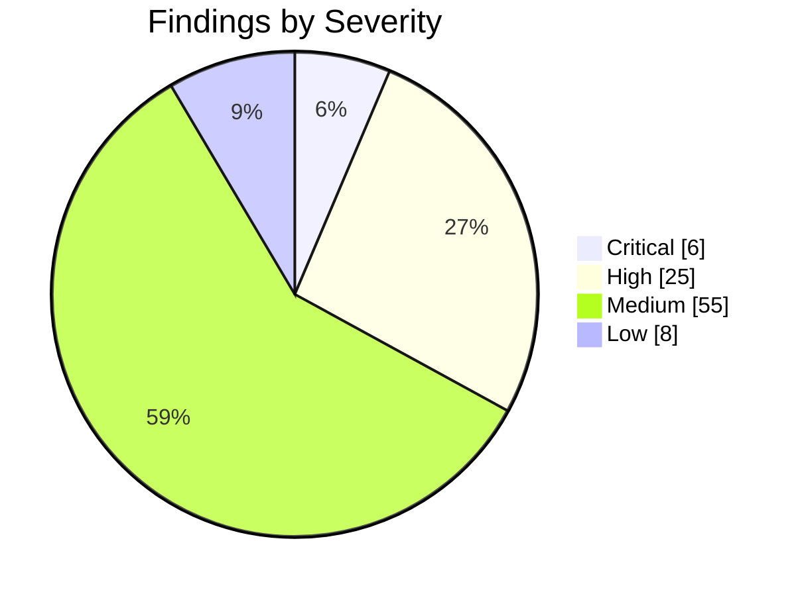
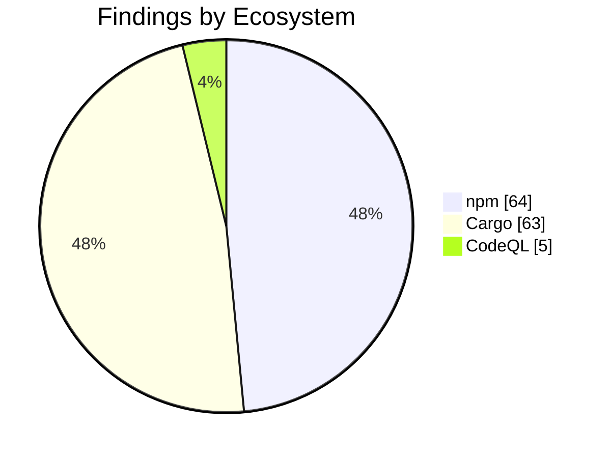

import { Card, CardGrid, Tabs, TabItem } from '@astrojs/starlight/components';

## Security Audit Report

:::note[Auto-generated]
Last generated: **2026-07-18T09:40:57Z** — updated daily by `ci-dashboard`.
:::

:::caution[Action Required]
**31** critical/high severity findings across the monorepo.
:::

### Severity Overview

<CardGrid>
  <Card title="6 Critical" icon="warning">
    Critical-severity findings across all ecosystems.
  </Card>
  <Card title="25 High" icon="error">
    High-severity findings across all ecosystems.
  </Card>
  <Card title="55 Medium" icon="information">
    Medium-severity findings across all ecosystems.
  </Card>
  <Card title="8 Low" icon="approve-check-circle">
    Low-severity findings across all ecosystems.
  </Card>
</CardGrid>

### Ecosystem Breakdown

<CardGrid>
  <Card title="npm" icon="seti:npm">
    **64** advisories
  </Card>
  <Card title="Cargo" icon="seti:rust">
    **63** advisories
  </Card>
  <Card title="Python" icon="seti:python">
    **0** advisories
  </Card>
  <Card title="CodeQL" icon="magnifier">
    **5** alerts
  </Card>
  <Card title="Dependabot" icon="github">
    **0** alerts
  </Card>
</CardGrid>

### Severity Distribution

### Findings by Ecosystem

<Tabs>
  <TabItem label="Summary">

| Ecosystem | Critical | High | Medium | Low | Total |
|-----------|:--------:|:----:|:------:|:---:|:-----:|
| **npm** | 3 | 25 | 28 | 8 | 64 |
| **Cargo** | 0 | 0 | 25 | 0 | 63 |
| **Python** | 0 | 0 | 0 | 0 | 0 |
| **CodeQL** | 3 | 0 | 2 | 0 | 5 |
| **Dependabot** | 0 | 0 | 0 | 0 | 0 |
| **Total** | 6 | 25 | 55 | 8 | 132 |

  </TabItem>
  <TabItem label="npm">

| Severity | Package | Advisory | Link |
|----------|---------|----------|------|
| Critical | `vitest` | When Vitest UI server is listening, arbitrary file can be... | [Details](https://github.com/advisories/GHSA-5xrq-8626-4rwp) |
| Critical | `shell-quote` | shell-quote quote() does not escape newlines in object .o... | [Details](https://github.com/advisories/GHSA-w7jw-789q-3m8p) |
| Critical | `websocket-driver` | websocket-driver: Message corruption via abuse of protoco... | [Details](https://github.com/advisories/GHSA-xv26-6w52-cph6) |
| High | `rollup` | Rollup 4 has Arbitrary File Write via Path Traversal | [Details](https://github.com/advisories/GHSA-mw96-cpmx-2vgc) |
| High | `koa` | Koa has Host Header Injection via ctx.hostname | [Details](https://github.com/advisories/GHSA-7gcc-r8m5-44qm) |
| High | `serialize-javascript` | Serialize JavaScript is Vulnerable to RCE via RegExp.flag... | [Details](https://github.com/advisories/GHSA-5c6j-r48x-rmvq) |
| High | `svgo` | SVGO DoS through entity expansion in DOCTYPE (Billion Lau... | [Details](https://github.com/advisories/GHSA-xpqw-6gx7-v673) |
| High | `tar` | tar has Hardlink Path Traversal via Drive-Relative Linkpath | [Details](https://github.com/advisories/GHSA-qffp-2rhf-9h96) |
| High | `tar` | node-tar Symlink Path Traversal via Drive-Relative Linkpath | [Details](https://github.com/advisories/GHSA-9ppj-qmqm-q256) |
| High | `flatted` | flatted vulnerable to unbounded recursion DoS in parse() ... | [Details](https://github.com/advisories/GHSA-25h7-pfq9-p65f) |
| High | `flatted` | Prototype Pollution via parse() in NodeJS flatted | [Details](https://github.com/advisories/GHSA-rf6f-7fwh-wjgh) |
| High | `path-to-regexp` | path-to-regexp vulnerable to Regular Expression Denial of... | [Details](https://github.com/advisories/GHSA-37ch-88jc-xwx2) |
| High | `picomatch` | Picomatch has a ReDoS vulnerability via extglob quantifiers | [Details](https://github.com/advisories/GHSA-c2c7-rcm5-vvqj) |
| High | `lodash` | lodash vulnerable to Code Injection via `_.template` impo... | [Details](https://github.com/advisories/GHSA-r5fr-rjxr-66jc) |
| High | `fast-uri` | fast-uri vulnerable to path traversal via percent-encoded... | [Details](https://github.com/advisories/GHSA-q3j6-qgpj-74h6) |
| High | `fast-uri` | fast-uri vulnerable to host confusion via percent-encoded... | [Details](https://github.com/advisories/GHSA-v39h-62p7-jpjc) |
| High | `tmp` | tmp has Path Traversal via unsanitized prefix/postfix tha... | [Details](https://github.com/advisories/GHSA-ph9p-34f9-6g65) |
| High | `form-data` | form-data: CRLF injection in form-data via unescaped mult... | [Details](https://github.com/advisories/GHSA-hmw2-7cc7-3qxx) |
| High | `http-proxy-middleware` | http-proxy-middleware: multipart/form-data field injectio... | [Details](https://github.com/advisories/GHSA-gcq2-9pq2-cxqm) |
| High | `undici` | undici vulnerable to TLS certificate validation bypass vi... | [Details](https://github.com/advisories/GHSA-vmh5-mc38-953g) |
| High | `nodemailer` | Nodemailer: Message-level raw option bypasses disableFile... | [Details](https://github.com/advisories/GHSA-p6gq-j5cr-w38f) |
| High | `undici` | undici WebSocket client vulnerable to denial of service v... | [Details](https://github.com/advisories/GHSA-vxpw-j846-p89q) |
| High | `undici` | undici WebSocket client vulnerable to denial of service v... | [Details](https://github.com/advisories/GHSA-vxpw-j846-p89q) |
| High | `undici` | undici vulnerable to cross-origin request routing via SOC... | [Details](https://github.com/advisories/GHSA-hm92-r4w5-c3mj) |
| High | `ws` | ws: Memory exhaustion DoS from tiny fragments and data ch... | [Details](https://github.com/advisories/GHSA-96hv-2xvq-fx4p) |
| High | `vite` | vite: `server.fs.deny` bypass on Windows alternate paths | [Details](https://github.com/advisories/GHSA-fx2h-pf6j-xcff) |
| High | `vite` | vite: `server.fs.deny` bypass on Windows alternate paths | [Details](https://github.com/advisories/GHSA-fx2h-pf6j-xcff) |
| High | `adm-zip` | adm-zip: Crafted ZIP file triggers 4GB memory allocation | [Details](https://github.com/advisories/GHSA-xcpc-8h2w-3j85) |
| Medium | `vue-template-compiler` | vue-template-compiler vulnerable to client-side Cross-Sit... | [Details](https://github.com/advisories/GHSA-g3ch-rx76-35fx) |
| Medium | `js-yaml` | js-yaml has prototype pollution in merge (&lt;&lt;) | [Details](https://github.com/advisories/GHSA-mh29-5h37-fv8m) |
| Medium | `mdast-util-to-hast` | mdast-util-to-hast has unsanitized class attribute | [Details](https://github.com/advisories/GHSA-4fh9-h7wg-q85m) |
| Medium | `ajv` | ajv has ReDoS when using `$data` option | [Details](https://github.com/advisories/GHSA-2g4f-4pwh-qvx6) |
| Medium | `ajv` | ajv has ReDoS when using `$data` option | [Details](https://github.com/advisories/GHSA-2g4f-4pwh-qvx6) |
| Medium | `qs` | qs's arrayLimit bypass in its bracket notation allows DoS... | [Details](https://github.com/advisories/GHSA-6rw7-vpxm-498p) |
| Medium | `brace-expansion` | brace-expansion: Zero-step sequence causes process hang a... | [Details](https://github.com/advisories/GHSA-f886-m6hf-6m8v) |
| Medium | `picomatch` | Picomatch: Method Injection in POSIX Character Classes ca... | [Details](https://github.com/advisories/GHSA-3v7f-55p6-f55p) |
| Medium | `yaml` | yaml is vulnerable to Stack Overflow via deeply nested YA... | [Details](https://github.com/advisories/GHSA-48c2-rrv3-qjmp) |
| Medium | `yaml` | yaml is vulnerable to Stack Overflow via deeply nested YA... | [Details](https://github.com/advisories/GHSA-48c2-rrv3-qjmp) |
| Medium | `lodash` | lodash vulnerable to Prototype Pollution via array path b... | [Details](https://github.com/advisories/GHSA-f23m-r3pf-42rh) |
| Medium | `ws` | ws: Uninitialized memory disclosure | [Details](https://github.com/advisories/GHSA-58qx-3vcg-4xpx) |
| Medium | `serialize-javascript` | Serialize JavaScript has CPU Exhaustion Denial of Service... | [Details](https://github.com/advisories/GHSA-qj8w-gfj5-8c6v) |
| Medium | `uuid` | uuid: Missing buffer bounds check in v3/v5/v6 when buf is... | [Details](https://github.com/advisories/GHSA-w5hq-g745-h8pq) |
| Medium | `qs` | qs has a remotely triggerable DoS: qs.stringify crashes w... | [Details](https://github.com/advisories/GHSA-q8mj-m7cp-5q26) |
| Medium | `lodash` | Lodash has Prototype Pollution Vulnerability in `_.unset`... | [Details](https://github.com/advisories/GHSA-xxjr-mmjv-4gpg) |
| Medium | `tar` | node-tar applies PAX size override to intermediary GNU lo... | [Details](https://github.com/advisories/GHSA-vmf3-w455-68vh) |
| Medium | `vite` | launch-editor: NTLMv2 hash disclosure via UNC path handli... | [Details](https://github.com/advisories/GHSA-v6wh-96g9-6wx3) |
| Medium | `vite` | launch-editor: NTLMv2 hash disclosure via UNC path handli... | [Details](https://github.com/advisories/GHSA-v6wh-96g9-6wx3) |
| Medium | `launch-editor` | launch-editor: NTLMv2 hash disclosure via UNC path handli... | [Details](https://github.com/advisories/GHSA-v6wh-96g9-6wx3) |
| Medium | `undici` | undici vulnerable to HTTP header injection via Set-Cookie... | [Details](https://github.com/advisories/GHSA-p88m-4jfj-68fv) |
| Medium | `undici` | undici vulnerable to HTTP header injection via Set-Cookie... | [Details](https://github.com/advisories/GHSA-p88m-4jfj-68fv) |
| Medium | `http-proxy-middleware` | http-proxy-middleware `router` host+path substring matchi... | [Details](https://github.com/advisories/GHSA-64mm-vxmg-q3vj) |
| Medium | `http-proxy-middleware` | http-proxy-middleware `router` host+path substring matchi... | [Details](https://github.com/advisories/GHSA-64mm-vxmg-q3vj) |
| Medium | `undici` | undici vulnerable to cross-user information disclosure vi... | [Details](https://github.com/advisories/GHSA-pr7r-676h-xcf6) |
| Medium | `js-yaml` | JS-YAML: Quadratic-complexity DoS in merge key handling v... | [Details](https://github.com/advisories/GHSA-h67p-54hq-rp68) |
| Medium | `js-yaml` | JS-YAML: Quadratic-complexity DoS in merge key handling v... | [Details](https://github.com/advisories/GHSA-h67p-54hq-rp68) |
| Medium | `websocket-driver` | websocket-driver: Resource limit bypass via message compr... | [Details](https://github.com/advisories/GHSA-mp7j-qc5w-4988) |
| Low | `diff` | jsdiff has a Denial of Service vulnerability in parsePatc... | [Details](https://github.com/advisories/GHSA-73rr-hh4g-fpgx) |
| Low | `qs` | qs's arrayLimit bypass in comma parsing allows denial of ... | [Details](https://github.com/advisories/GHSA-w7fw-mjwx-w883) |
| Low | `esbuild` | esbuild allows arbitrary file read when running the devel... | [Details](https://github.com/advisories/GHSA-g7r4-m6w7-qqqr) |
| Low | `undici` | undici vulnerable to HTTP response queue poisoning via ke... | [Details](https://github.com/advisories/GHSA-35p6-xmwp-9g52) |
| Low | `undici` | undici vulnerable to HTTP response queue poisoning via ke... | [Details](https://github.com/advisories/GHSA-35p6-xmwp-9g52) |
| Low | `undici` | undici vulnerable to Set-Cookie SameSite attribute downgr... | [Details](https://github.com/advisories/GHSA-g8m3-5g58-fq7m) |
| Low | `undici` | undici vulnerable to Set-Cookie SameSite attribute downgr... | [Details](https://github.com/advisories/GHSA-g8m3-5g58-fq7m) |
| Low | `@babel/core` | @babel/core: Arbitrary File Read via sourceMappingURL Com... | [Details](https://github.com/advisories/GHSA-4x5r-pxfx-6jf8) |

  </TabItem>
  <TabItem label="Cargo">

| Severity | Package | Advisory | Link |
|----------|---------|----------|------|
| Medium | `ammonia` | mXSS in ammonia via MathML `annotation-xml` encoding strip |  |
| Medium | `crossbeam-epoch` | Invalid pointer dereference in `fmt::Pointer` impl for `A... | [Details](https://github.com/crossbeam-rs/crossbeam/pull/1276) |
| Medium | `hickory-proto` | CPU exhaustion during message encoding due to O(n²) name ... | [Details](https://github.com/hickory-dns/hickory-dns/security/advisories/GHSA-q2qq-hmj6-3wpp) |
| Medium | `hickory-proto` | NSEC3 closest-encloser proof validation enters unbounded ... | [Details](https://github.com/hickory-dns/hickory-dns/security/advisories/GHSA-3v94-mw7p-v465) |
| Medium | `postgres-protocol` | Unbounded SCRAM iteration count allows a malicious server... | [Details](https://github.com/rust-postgres/rust-postgres/commit/d40097a36a85068ea50a3afbf0ce154ba439e7f0) |
| Medium | `postgres-protocol` | Panic decoding a malformed `hstore` value allows denial o... | [Details](https://github.com/rust-postgres/rust-postgres/commit/a7cf84b5c46431cbca9d8ff50508c23f446efa7d) |
| Medium | `quick-xml` | Unbounded namespace-declaration allocation in `NsReader` ... | [Details](https://github.com/tafia/quick-xml/issues/970) |
| Medium | `quick-xml` | Quadratic run time when checking a start tag for duplicat... | [Details](https://github.com/tafia/quick-xml/issues/969) |
| Medium | `quick-xml` | Unbounded namespace-declaration allocation in `NsReader` ... | [Details](https://github.com/tafia/quick-xml/issues/970) |
| Medium | `quick-xml` | Quadratic run time when checking a start tag for duplicat... | [Details](https://github.com/tafia/quick-xml/issues/969) |
| Medium | `quinn-proto` |  Remote memory exhaustion in quinn-proto from unbounded o... | [Details](https://github.com/quinn-rs/quinn/pull/2694) |
| Medium | `rsa` | Marvin Attack: potential key recovery through timing side... | [Details](https://github.com/RustCrypto/RSA/issues/626) |
| Medium | `rustls-webpki` | Reachable panic in certificate revocation list parsing |  |
| Medium | `rustls-webpki` | Name constraints were accepted for certificates asserting... |  |
| Medium | `rustls-webpki` | Name constraints for URI names were incorrectly accepted |  |
| Medium | `rustls-webpki` | Reachable panic in certificate revocation list parsing |  |
| Medium | `rustls-webpki` | Name constraints were accepted for certificates asserting... |  |
| Medium | `rustls-webpki` | Name constraints for URI names were incorrectly accepted |  |
| Medium | `rustls-webpki` | CRLs not considered authoritative by Distribution Point d... |  |
| Medium | `rustls-webpki` | Reachable panic in certificate revocation list parsing |  |
| Medium | `rustls-webpki` | Name constraints were accepted for certificates asserting... |  |
| Medium | `rustls-webpki` | Name constraints for URI names were incorrectly accepted |  |
| Medium | `sqlx` | Binary Protocol Misinterpretation caused by Truncating or... | [Details](https://github.com/launchbadge/sqlx/issues/3440) |
| Medium | `steamworks` | Denial of service in Steamworks game clients/servers usin... | [Details](https://github.com/Noxime/steamworks-rs/issues/321) |
| Medium | `tokio-postgres` | Panic on a `DataRow` with fewer fields than columns allow... | [Details](https://github.com/rust-postgres/rust-postgres/commit/7a00ffa9ad4d951ec0a4564b52f1780fa9d353c1) |
| Info | `atk` | gtk-rs GTK3 bindings - no longer maintained | [Details](https://github.com/gtk-rs/gtk3-rs/commit/508a69b63a3c5bf73790e0e59101a955847f30d6) |
| Info | `atk-sys` | gtk-rs GTK3 bindings - no longer maintained | [Details](https://github.com/gtk-rs/gtk3-rs/commit/508a69b63a3c5bf73790e0e59101a955847f30d6) |
| Info | `bincode` | Bincode is unmaintained | [Details](https://git.sr.ht/~stygianentity/bincode/tree/v3.0/item/README.md) |
| Info | `derivative` | `derivative` is unmaintained; consider using an alternative | [Details](https://github.com/mcarton/rust-derivative/issues/117) |
| Info | `fxhash` | fxhash - no longer maintained | [Details](https://github.com/cbreeden/fxhash/issues/20) |
| Info | `gdk` | gtk-rs GTK3 bindings - no longer maintained | [Details](https://github.com/gtk-rs/gtk3-rs/commit/508a69b63a3c5bf73790e0e59101a955847f30d6) |
| Info | `gdk-sys` | gtk-rs GTK3 bindings - no longer maintained | [Details](https://github.com/gtk-rs/gtk3-rs/commit/508a69b63a3c5bf73790e0e59101a955847f30d6) |
| Info | `gdkwayland-sys` | gtk-rs GTK3 bindings - no longer maintained | [Details](https://github.com/gtk-rs/gtk3-rs/commit/508a69b63a3c5bf73790e0e59101a955847f30d6) |
| Info | `gdkx11` | gtk-rs GTK3 bindings - no longer maintained | [Details](https://github.com/gtk-rs/gtk3-rs/commit/508a69b63a3c5bf73790e0e59101a955847f30d6) |
| Info | `gdkx11-sys` | gtk-rs GTK3 bindings - no longer maintained | [Details](https://github.com/gtk-rs/gtk3-rs/commit/508a69b63a3c5bf73790e0e59101a955847f30d6) |
| Info | `gtk` | gtk-rs GTK3 bindings - no longer maintained | [Details](https://github.com/gtk-rs/gtk3-rs/commit/508a69b63a3c5bf73790e0e59101a955847f30d6) |
| Info | `gtk-sys` | gtk-rs GTK3 bindings - no longer maintained | [Details](https://github.com/gtk-rs/gtk3-rs/commit/508a69b63a3c5bf73790e0e59101a955847f30d6) |
| Info | `gtk3-macros` | gtk-rs GTK3 bindings - no longer maintained | [Details](https://github.com/gtk-rs/gtk3-rs/commit/508a69b63a3c5bf73790e0e59101a955847f30d6) |
| Info | `paste` | paste - no longer maintained | [Details](https://github.com/dtolnay/paste) |
| Info | `proc-macro-error` | proc-macro-error is unmaintained | [Details](https://gitlab.com/CreepySkeleton/proc-macro-error/-/issues/20) |
| Info | `proc-macro-error2` | proc-macro-error2 is unmaintained | [Details](https://github.com/GnomedDev/proc-macro-error-2/issues/17) |
| Info | `rustls-pemfile` | rustls-pemfile is unmaintained | [Details](https://github.com/rustls/pemfile/issues/61) |
| Info | `rustls-pemfile` | rustls-pemfile is unmaintained | [Details](https://github.com/rustls/pemfile/issues/61) |
| Info | `rustybuzz` | `rustybuzz` is unmaintained | [Details](https://github.com/harfbuzz/rustybuzz/issues/166) |
| Info | `serde_cbor` | serde_cbor is unmaintained | [Details](https://github.com/pyfisch/cbor) |
| Info | `ttf-parser` | `ttf-parser` is unmaintained | [Details](https://github.com/harfbuzz/ttf-parser/issues/217) |
| Info | `unic-char-property` | `unic-char-property` is unmaintained | [Details](https://github.com/rustsec/advisory-db/issues/2414) |
| Info | `unic-char-range` | `unic-char-range` is unmaintained | [Details](https://github.com/rustsec/advisory-db/issues/2414) |
| Info | `unic-common` | `unic-common` is unmaintained | [Details](https://github.com/rustsec/advisory-db/issues/2414) |
| Info | `unic-ucd-ident` | `unic-ucd-ident` is unmaintained | [Details](https://github.com/rustsec/advisory-db/issues/2414) |
| Info | `unic-ucd-version` | `unic-ucd-version` is unmaintained | [Details](https://github.com/rustsec/advisory-db/issues/2414) |
| Info | `anyhow` | Unsoundness in `Error::downcast_mut()` | [Details](https://github.com/dtolnay/anyhow/issues/451) |
| Info | `diesel` | Possible use after free when deserializing a SQLite datab... | [Details](https://github.com/diesel-rs/diesel/commit/1bc2ea46d9840e8d9af844239d3c84f37fe7d84b) |
| Info | `glib` | Unsoundness in `Iterator` and `DoubleEndedIterator` impls... | [Details](https://github.com/gtk-rs/gtk-rs-core/pull/1343) |
| Info | `lru` | `IterMut` violates Stacked Borrows by invalidating intern... | [Details](https://github.com/jeromefroe/lru-rs/pull/224) |
| Info | `memmap2` | Unchecked pointer offset in crate `memmap2` | [Details](https://github.com/RazrFalcon/memmap2-rs/issues/169) |
| Info | `rand` | Rand is unsound with a custom logger using `rand::rng()` | [Details](https://github.com/rust-random/rand/pull/1763) |
| Info | `rand` | Rand is unsound with a custom logger using `rand::rng()` | [Details](https://github.com/rust-random/rand/pull/1763) |
| Info | `rand` | Rand is unsound with a custom logger using `rand::rng()` | [Details](https://github.com/rust-random/rand/pull/1763) |
| Info | `rand` | Rand is unsound with a custom logger using `rand::rng()` | [Details](https://github.com/rust-random/rand/pull/1763) |
| Info | `scc` | `Array::insert` violates exception safety if compare func... | [Details](https://codeberg.org/wvwwvwwv/scalable-concurrent-containers/issues/232) |
| Info | `spin` |  |  |
| Info | `spin` |  |  |

  </TabItem>
  <TabItem label="Python">

:::tip[All Clear]
No python advisories found.
:::

  </TabItem>
  <TabItem label="CodeQL">

| Severity | Rule | Path | Link |
|----------|------|------|------|
| Critical | `rust/hard-coded-cryptographic-value` | `packages/rust/simgrid/src/blackjack/engine.rs` | [Details](https://github.com/KBVE/kbve/security/code-scanning/512) |
| Critical | `rust/hard-coded-cryptographic-value` | `packages/rust/simgrid/src/blackjack/engine.rs` | [Details](https://github.com/KBVE/kbve/security/code-scanning/511) |
| Critical | `rust/hard-coded-cryptographic-value` | `packages/rust/simgrid/src/blackjack/engine.rs` | [Details](https://github.com/KBVE/kbve/security/code-scanning/510) |
| Medium | `js/shell-command-constructed-from-input` | `packages/npm/devops/src/lib/client/github/pulls.ts` | [Details](https://github.com/KBVE/kbve/security/code-scanning/517) |
| Medium | `js/shell-command-constructed-from-input` | `packages/npm/devops/src/lib/client/github/pulls.ts` | [Details](https://github.com/KBVE/kbve/security/code-scanning/516) |

  </TabItem>
  <TabItem label="Dependabot">

:::tip[All Clear]
No open Dependabot alerts.
:::

  </TabItem>
</Tabs>

---

*Auto-generated by [ci-dashboard.yml](https://github.com/KBVE/kbve/actions/workflows/ci-dashboard.yml)*
