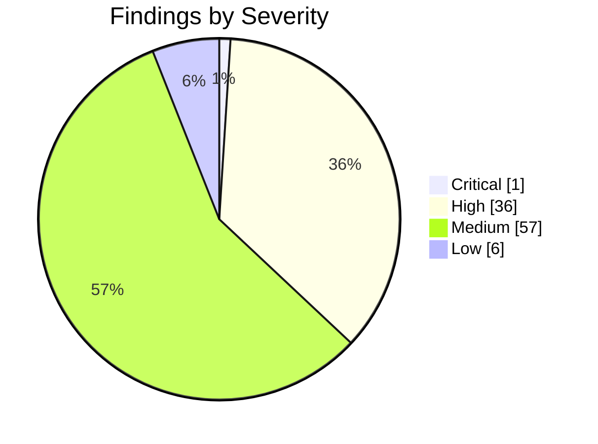
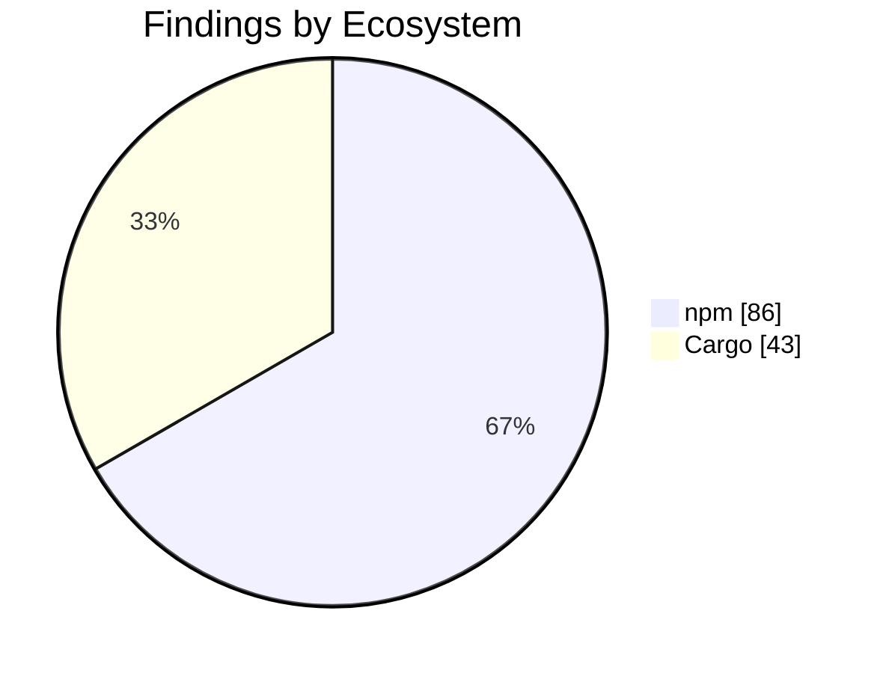

import { Card, CardGrid, Tabs, TabItem } from '@astrojs/starlight/components';

## Security Audit Report

:::note[Auto-generated]
Last generated: **2026-05-06T09:02:35Z** — updated daily by `ci-dashboard`.
:::

:::caution[Action Required]
**37** critical/high severity findings across the monorepo.
:::

### Severity Overview

<CardGrid>
  <Card title="1 Critical" icon="warning">
    Critical-severity findings across all ecosystems.
  </Card>
  <Card title="36 High" icon="error">
    High-severity findings across all ecosystems.
  </Card>
  <Card title="57 Medium" icon="information">
    Medium-severity findings across all ecosystems.
  </Card>
  <Card title="6 Low" icon="approve-check-circle">
    Low-severity findings across all ecosystems.
  </Card>
</CardGrid>

### Ecosystem Breakdown

<CardGrid>
  <Card title="npm" icon="seti:npm">
    **86** advisories
  </Card>
  <Card title="Cargo" icon="seti:rust">
    **43** advisories
  </Card>
  <Card title="Python" icon="seti:python">
    **0** advisories
  </Card>
  <Card title="CodeQL" icon="magnifier">
    **0** alerts
  </Card>
  <Card title="Dependabot" icon="github">
    **0** alerts
  </Card>
</CardGrid>

### Severity Distribution

### Findings by Ecosystem

<Tabs>
  <TabItem label="Summary">

| Ecosystem | Critical | High | Medium | Low | Total |
|-----------|:--------:|:----:|:------:|:---:|:-----:|
| **npm** | 1 | 36 | 43 | 6 | 86 |
| **Cargo** | 0 | 0 | 14 | 0 | 43 |
| **Python** | 0 | 0 | 0 | 0 | 0 |
| **CodeQL** | 0 | 0 | 0 | 0 | 0 |
| **Dependabot** | 0 | 0 | 0 | 0 | 0 |
| **Total** | 1 | 36 | 57 | 6 | 129 |

  </TabItem>
  <TabItem label="npm">

| Severity | Package | Advisory | Link |
|----------|---------|----------|------|
| Critical | `handlebars` | Handlebars.js has JavaScript Injection via AST Type Confu... | [Details](https://github.com/advisories/GHSA-2w6w-674q-4c4q) |
| High | `glob` | glob CLI: Command injection via -c/--cmd executes matches... | [Details](https://github.com/advisories/GHSA-5j98-mcp5-4vw2) |
| High | `rollup` | Rollup 4 has Arbitrary File Write via Path Traversal | [Details](https://github.com/advisories/GHSA-mw96-cpmx-2vgc) |
| High | `koa` | Koa has Host Header Injection via ctx.hostname | [Details](https://github.com/advisories/GHSA-7gcc-r8m5-44qm) |
| High | `serialize-javascript` | Serialize JavaScript is Vulnerable to RCE via RegExp.flag... | [Details](https://github.com/advisories/GHSA-5c6j-r48x-rmvq) |
| High | `svgo` | SVGO DoS through entity expansion in DOCTYPE (Billion Lau... | [Details](https://github.com/advisories/GHSA-xpqw-6gx7-v673) |
| High | `svgo` | SVGO DoS through entity expansion in DOCTYPE (Billion Lau... | [Details](https://github.com/advisories/GHSA-xpqw-6gx7-v673) |
| High | `tar` | tar has Hardlink Path Traversal via Drive-Relative Linkpath | [Details](https://github.com/advisories/GHSA-qffp-2rhf-9h96) |
| High | `tar` | node-tar Symlink Path Traversal via Drive-Relative Linkpath | [Details](https://github.com/advisories/GHSA-9ppj-qmqm-q256) |
| High | `flatted` | flatted vulnerable to unbounded recursion DoS in parse() ... | [Details](https://github.com/advisories/GHSA-25h7-pfq9-p65f) |
| High | `undici` | Undici has Unbounded Memory Consumption in WebSocket perm... | [Details](https://github.com/advisories/GHSA-vrm6-8vpv-qv8q) |
| High | `undici` | Undici has Unhandled Exception in WebSocket Client Due to... | [Details](https://github.com/advisories/GHSA-v9p9-hfj2-hcw8) |
| High | `h3` | h3 has a Server-Sent Events Injection via Unsanitized New... | [Details](https://github.com/advisories/GHSA-22cc-p3c6-wpvm) |
| High | `flatted` | Prototype Pollution via parse() in NodeJS flatted | [Details](https://github.com/advisories/GHSA-rf6f-7fwh-wjgh) |
| High | `path-to-regexp` | path-to-regexp vulnerable to Regular Expression Denial of... | [Details](https://github.com/advisories/GHSA-37ch-88jc-xwx2) |
| High | `handlebars` | Handlebars.js has JavaScript Injection via AST Type Confu... | [Details](https://github.com/advisories/GHSA-3mfm-83xf-c92r) |
| High | `picomatch` | Picomatch has a ReDoS vulnerability via extglob quantifiers | [Details](https://github.com/advisories/GHSA-c2c7-rcm5-vvqj) |
| High | `picomatch` | Picomatch has a ReDoS vulnerability via extglob quantifiers | [Details](https://github.com/advisories/GHSA-c2c7-rcm5-vvqj) |
| High | `handlebars` | Handlebars.js has JavaScript Injection via AST Type Confu... | [Details](https://github.com/advisories/GHSA-xhpv-hc6g-r9c6) |
| High | `handlebars` | Handlebars.js has Denial of Service via Malformed Decorat... | [Details](https://github.com/advisories/GHSA-9cx6-37pm-9jff) |
| High | `lodash-es` | lodash vulnerable to Code Injection via `_.template` impo... | [Details](https://github.com/advisories/GHSA-r5fr-rjxr-66jc) |
| High | `lodash` | lodash vulnerable to Code Injection via `_.template` impo... | [Details](https://github.com/advisories/GHSA-r5fr-rjxr-66jc) |
| High | `defu` | defu: Prototype pollution via `__proto__` key in defaults... | [Details](https://github.com/advisories/GHSA-737v-mqg7-c878) |
| High | `vite` | Vite: `server.fs.deny` bypassed with queries | [Details](https://github.com/advisories/GHSA-v2wj-q39q-566r) |
| High | `vite` | Vite Vulnerable to Arbitrary File Read via Vite Dev Serve... | [Details](https://github.com/advisories/GHSA-p9ff-h696-f583) |
| High | `vite` | Vite Vulnerable to Arbitrary File Read via Vite Dev Serve... | [Details](https://github.com/advisories/GHSA-p9ff-h696-f583) |
| High | `@xmldom/xmldom` | xmldom: Uncontrolled recursion in XML serialization leads... | [Details](https://github.com/advisories/GHSA-2v35-w6hq-6mfw) |
| High | `@xmldom/xmldom` | xmldom has XML injection through unvalidated DocumentType... | [Details](https://github.com/advisories/GHSA-f6ww-3ggp-fr8h) |
| High | `@xmldom/xmldom` | xmldom has XML node injection through unvalidated process... | [Details](https://github.com/advisories/GHSA-x6wf-f3px-wcqx) |
| High | `@xmldom/xmldom` | xmldom has XML node injection through unvalidated comment... | [Details](https://github.com/advisories/GHSA-j759-j44w-7fr8) |
| High | `immutable` | Immutable is vulnerable to Prototype Pollution | [Details](https://github.com/advisories/GHSA-wf6x-7x77-mvgw) |
| High | `@xmldom/xmldom` | xmldom: XML injection via unsafe CDATA serialization allo... | [Details](https://github.com/advisories/GHSA-wh4c-j3r5-mjhp) |
| High | `handlebars` | Handlebars.js has JavaScript Injection in CLI Precompiler... | [Details](https://github.com/advisories/GHSA-xjpj-3mr7-gcpf) |
| High | `axios` | Axios: Incomplete Fix for CVE-2025-62718 — NO_PROXY Prote... | [Details](https://github.com/advisories/GHSA-pmwg-cvhr-8vh7) |
| High | `axios` | Axios has prototype pollution read-side gadgets in HTTP a... | [Details](https://github.com/advisories/GHSA-q8qp-cvcw-x6jj) |
| High | `axios` | Axios: Prototype Pollution Gadgets - Response Tampering, ... | [Details](https://github.com/advisories/GHSA-pf86-5x62-jrwf) |
| High | `axios` | Axios: Header Injection via Prototype Pollution | [Details](https://github.com/advisories/GHSA-6chq-wfr3-2hj9) |
| Medium | `got` | Got allows a redirect to a UNIX socket | [Details](https://github.com/advisories/GHSA-pfrx-2q88-qq97) |
| Medium | `vue-template-compiler` | vue-template-compiler vulnerable to client-side Cross-Sit... | [Details](https://github.com/advisories/GHSA-g3ch-rx76-35fx) |
| Medium | `lodash` | Lodash has Prototype Pollution Vulnerability in `_.unset`... | [Details](https://github.com/advisories/GHSA-xxjr-mmjv-4gpg) |
| Medium | `undici` | Undici has an unbounded decompression chain in HTTP respo... | [Details](https://github.com/advisories/GHSA-g9mf-h72j-4rw9) |
| Medium | `js-yaml` | js-yaml has prototype pollution in merge (&lt;&lt;) | [Details](https://github.com/advisories/GHSA-mh29-5h37-fv8m) |
| Medium | `mdast-util-to-hast` | mdast-util-to-hast has unsanitized class attribute | [Details](https://github.com/advisories/GHSA-4fh9-h7wg-q85m) |
| Medium | `ajv` | ajv has ReDoS when using `$data` option | [Details](https://github.com/advisories/GHSA-2g4f-4pwh-qvx6) |
| Medium | `ajv` | ajv has ReDoS when using `$data` option | [Details](https://github.com/advisories/GHSA-2g4f-4pwh-qvx6) |
| Medium | `qs` | qs's arrayLimit bypass in its bracket notation allows DoS... | [Details](https://github.com/advisories/GHSA-6rw7-vpxm-498p) |
| Medium | `file-type` | file-type affected by infinite loop in ASF parser on malf... | [Details](https://github.com/advisories/GHSA-5v7r-6r5c-r473) |
| Medium | `undici` | Undici has an HTTP Request/Response Smuggling issue | [Details](https://github.com/advisories/GHSA-2mjp-6q6p-2qxm) |
| Medium | `undici` | Undici has CRLF Injection in undici via `upgrade` option | [Details](https://github.com/advisories/GHSA-4992-7rv2-5pvq) |
| Medium | `yauzl` | yauzl contains an off-by-one error | [Details](https://github.com/advisories/GHSA-gmq8-994r-jv83) |
| Medium | `h3` | h3 has a Path Traversal via Percent-Encoded Dot Segments ... | [Details](https://github.com/advisories/GHSA-wr4h-v87w-p3r7) |
| Medium | `h3` | h3: SSE Event Injection via Unsanitized Carriage Return (... | [Details](https://github.com/advisories/GHSA-4hxc-9384-m385) |
| Medium | `h3` | h3: Double Decoding in `serveStatic` Bypasses `resolveDot... | [Details](https://github.com/advisories/GHSA-72gr-qfp7-vwhw) |
| Medium | `smol-toml` | smol-toml: Denial of Service via TOML documents containin... | [Details](https://github.com/advisories/GHSA-v3rj-xjv7-4jmq) |
| Medium | `brace-expansion` | brace-expansion: Zero-step sequence causes process hang a... | [Details](https://github.com/advisories/GHSA-f886-m6hf-6m8v) |
| Medium | `brace-expansion` | brace-expansion: Zero-step sequence causes process hang a... | [Details](https://github.com/advisories/GHSA-f886-m6hf-6m8v) |
| Medium | `brace-expansion` | brace-expansion: Zero-step sequence causes process hang a... | [Details](https://github.com/advisories/GHSA-f886-m6hf-6m8v) |
| Medium | `handlebars` | Handlebars.js has Prototype Pollution Leading to XSS thro... | [Details](https://github.com/advisories/GHSA-2qvq-rjwj-gvw9) |
| Medium | `picomatch` | Picomatch: Method Injection in POSIX Character Classes ca... | [Details](https://github.com/advisories/GHSA-3v7f-55p6-f55p) |
| Medium | `picomatch` | Picomatch: Method Injection in POSIX Character Classes ca... | [Details](https://github.com/advisories/GHSA-3v7f-55p6-f55p) |
| Medium | `yaml` | yaml is vulnerable to Stack Overflow via deeply nested YA... | [Details](https://github.com/advisories/GHSA-48c2-rrv3-qjmp) |
| Medium | `yaml` | yaml is vulnerable to Stack Overflow via deeply nested YA... | [Details](https://github.com/advisories/GHSA-48c2-rrv3-qjmp) |
| Medium | `handlebars` | Handlebars.js has a Prototype Method Access Control Gap v... | [Details](https://github.com/advisories/GHSA-7rx3-28cr-v5wh) |
| Medium | `serialize-javascript` | Serialize JavaScript has CPU Exhaustion Denial of Service... | [Details](https://github.com/advisories/GHSA-qj8w-gfj5-8c6v) |
| Medium | `lodash-es` | lodash vulnerable to Prototype Pollution via array path b... | [Details](https://github.com/advisories/GHSA-f23m-r3pf-42rh) |
| Medium | `lodash` | lodash vulnerable to Prototype Pollution via array path b... | [Details](https://github.com/advisories/GHSA-f23m-r3pf-42rh) |
| Medium | `vite` | Vite Vulnerable to Path Traversal in Optimized Deps `.map... | [Details](https://github.com/advisories/GHSA-4w7w-66w2-5vf9) |
| Medium | `vite` | Vite Vulnerable to Path Traversal in Optimized Deps `.map... | [Details](https://github.com/advisories/GHSA-4w7w-66w2-5vf9) |
| Medium | `follow-redirects` | follow-redirects leaks Custom Authentication Headers to C... | [Details](https://github.com/advisories/GHSA-r4q5-vmmm-2653) |
| Medium | `postcss` | PostCSS has XSS via Unescaped &lt;/style&gt; in its CSS Stringi... | [Details](https://github.com/advisories/GHSA-qx2v-qp2m-jg93) |
| Medium | `astro` | Astro: XSS in define:vars via incomplete &lt;/script&gt; tag sa... | [Details](https://github.com/advisories/GHSA-j687-52p2-xcff) |
| Medium | `axios` | Axios: Authentication Bypass via Prototype Pollution Gadg... | [Details](https://github.com/advisories/GHSA-w9j2-pvgh-6h63) |
| Medium | `axios` | Axios: Invisible JSON Response Tampering via Prototype Po... | [Details](https://github.com/advisories/GHSA-3w6x-2g7m-8v23) |
| Medium | `axios` | Axios: CRLF Injection in multipart/form-data body via uns... | [Details](https://github.com/advisories/GHSA-445q-vr5w-6q77) |
| Medium | `axios` | Axios: no_proxy bypass via IP alias allows SSRF | [Details](https://github.com/advisories/GHSA-m7pr-hjqh-92cm) |
| Medium | `axios` | Axios: unbounded recursion in toFormData causes DoS via d... | [Details](https://github.com/advisories/GHSA-62hf-57xw-28j9) |
| Medium | `axios` | Axios' HTTP adapter-streamed uploads bypass maxBodyLength... | [Details](https://github.com/advisories/GHSA-5c9x-8gcm-mpgx) |
| Medium | `axios` | Axios: HTTP adapter streamed responses bypass maxContentL... | [Details](https://github.com/advisories/GHSA-vf2m-468p-8v99) |
| Medium | `axios` | Axios: XSRF Token Cross-Origin Leakage via Prototype Poll... | [Details](https://github.com/advisories/GHSA-xx6v-rp6x-q39c) |
| Medium | `uuid` | uuid: Missing buffer bounds check in v3/v5/v6 when buf is... | [Details](https://github.com/advisories/GHSA-w5hq-g745-h8pq) |
| Low | `diff` | jsdiff has a Denial of Service vulnerability in parsePatc... | [Details](https://github.com/advisories/GHSA-73rr-hh4g-fpgx) |
| Low | `diff` | jsdiff has a Denial of Service vulnerability in parsePatc... | [Details](https://github.com/advisories/GHSA-73rr-hh4g-fpgx) |
| Low | `qs` | qs's arrayLimit bypass in comma parsing allows denial of ... | [Details](https://github.com/advisories/GHSA-w7fw-mjwx-w883) |
| Low | `astro` | Astro: Remote allowlist bypass via unanchored matchPathna... | [Details](https://github.com/advisories/GHSA-g735-7g2w-hh3f) |
| Low | `handlebars` | Handlebars.js has a Property Access Validation Bypass in ... | [Details](https://github.com/advisories/GHSA-442j-39wm-28r2) |
| Low | `axios` | Axios: Null Byte Injection via Reverse-Encoding in AxiosU... | [Details](https://github.com/advisories/GHSA-xhjh-pmcv-23jw) |

  </TabItem>
  <TabItem label="Cargo">

| Severity | Package | Advisory | Link |
|----------|---------|----------|------|
| Medium | `hickory-proto` | NSEC3 closest-encloser proof validation enters unbounded ... | [Details](https://github.com/hickory-dns/hickory-dns/security/advisories/GHSA-3v94-mw7p-v465) |
| Medium | `hickory-proto` | CPU exhaustion during message encoding due to O(n²) name ... | [Details](https://github.com/hickory-dns/hickory-dns/security/advisories/GHSA-q2qq-hmj6-3wpp) |
| Medium | `rsa` | Marvin Attack: potential key recovery through timing side... | [Details](https://github.com/RustCrypto/RSA/issues/626) |
| Medium | `rustls-webpki` | Name constraints for URI names were incorrectly accepted |  |
| Medium | `rustls-webpki` | Name constraints were accepted for certificates asserting... |  |
| Medium | `rustls-webpki` | Reachable panic in certificate revocation list parsing |  |
| Medium | `rustls-webpki` | CRLs not considered authoritative by Distribution Point d... |  |
| Medium | `rustls-webpki` | Name constraints for URI names were incorrectly accepted |  |
| Medium | `rustls-webpki` | Name constraints were accepted for certificates asserting... |  |
| Medium | `rustls-webpki` | Reachable panic in certificate revocation list parsing |  |
| Medium | `rustls-webpki` | Name constraints for URI names were incorrectly accepted |  |
| Medium | `rustls-webpki` | Name constraints were accepted for certificates asserting... |  |
| Medium | `rustls-webpki` | Reachable panic in certificate revocation list parsing |  |
| Medium | `sqlx` | Binary Protocol Misinterpretation caused by Truncating or... | [Details](https://github.com/launchbadge/sqlx/issues/3440) |
| Info | `atk` | gtk-rs GTK3 bindings - no longer maintained | [Details](https://github.com/gtk-rs/gtk3-rs/commit/508a69b63a3c5bf73790e0e59101a955847f30d6) |
| Info | `atk-sys` | gtk-rs GTK3 bindings - no longer maintained | [Details](https://github.com/gtk-rs/gtk3-rs/commit/508a69b63a3c5bf73790e0e59101a955847f30d6) |
| Info | `bincode` | Bincode is unmaintained | [Details](https://git.sr.ht/~stygianentity/bincode/tree/v3.0/item/README.md) |
| Info | `derivative` | `derivative` is unmaintained; consider using an alternative | [Details](https://github.com/mcarton/rust-derivative/issues/117) |
| Info | `fxhash` | fxhash - no longer maintained | [Details](https://github.com/cbreeden/fxhash/issues/20) |
| Info | `gdk` | gtk-rs GTK3 bindings - no longer maintained | [Details](https://github.com/gtk-rs/gtk3-rs/commit/508a69b63a3c5bf73790e0e59101a955847f30d6) |
| Info | `gdk-sys` | gtk-rs GTK3 bindings - no longer maintained | [Details](https://github.com/gtk-rs/gtk3-rs/commit/508a69b63a3c5bf73790e0e59101a955847f30d6) |
| Info | `gdkwayland-sys` | gtk-rs GTK3 bindings - no longer maintained | [Details](https://github.com/gtk-rs/gtk3-rs/commit/508a69b63a3c5bf73790e0e59101a955847f30d6) |
| Info | `gdkx11` | gtk-rs GTK3 bindings - no longer maintained | [Details](https://github.com/gtk-rs/gtk3-rs/commit/508a69b63a3c5bf73790e0e59101a955847f30d6) |
| Info | `gdkx11-sys` | gtk-rs GTK3 bindings - no longer maintained | [Details](https://github.com/gtk-rs/gtk3-rs/commit/508a69b63a3c5bf73790e0e59101a955847f30d6) |
| Info | `gtk` | gtk-rs GTK3 bindings - no longer maintained | [Details](https://github.com/gtk-rs/gtk3-rs/commit/508a69b63a3c5bf73790e0e59101a955847f30d6) |
| Info | `gtk-sys` | gtk-rs GTK3 bindings - no longer maintained | [Details](https://github.com/gtk-rs/gtk3-rs/commit/508a69b63a3c5bf73790e0e59101a955847f30d6) |
| Info | `gtk3-macros` | gtk-rs GTK3 bindings - no longer maintained | [Details](https://github.com/gtk-rs/gtk3-rs/commit/508a69b63a3c5bf73790e0e59101a955847f30d6) |
| Info | `paste` | paste - no longer maintained | [Details](https://github.com/dtolnay/paste) |
| Info | `proc-macro-error` | proc-macro-error is unmaintained | [Details](https://gitlab.com/CreepySkeleton/proc-macro-error/-/issues/20) |
| Info | `rustls-pemfile` | rustls-pemfile is unmaintained | [Details](https://github.com/rustls/pemfile/issues/61) |
| Info | `rustls-pemfile` | rustls-pemfile is unmaintained | [Details](https://github.com/rustls/pemfile/issues/61) |
| Info | `serde_cbor` | serde_cbor is unmaintained | [Details](https://github.com/pyfisch/cbor) |
| Info | `unic-char-property` | `unic-char-property` is unmaintained | [Details](https://github.com/rustsec/advisory-db/issues/2414) |
| Info | `unic-char-range` | `unic-char-range` is unmaintained | [Details](https://github.com/rustsec/advisory-db/issues/2414) |
| Info | `unic-common` | `unic-common` is unmaintained | [Details](https://github.com/rustsec/advisory-db/issues/2414) |
| Info | `unic-ucd-ident` | `unic-ucd-ident` is unmaintained | [Details](https://github.com/rustsec/advisory-db/issues/2414) |
| Info | `unic-ucd-version` | `unic-ucd-version` is unmaintained | [Details](https://github.com/rustsec/advisory-db/issues/2414) |
| Info | `diesel` | Possible UTF-8 corruption in Diesels SQLite backend | [Details](https://github.com/diesel-rs/diesel/pull/5042) |
| Info | `glib` | Unsoundness in `Iterator` and `DoubleEndedIterator` impls... | [Details](https://github.com/gtk-rs/gtk-rs-core/pull/1343) |
| Info | `rand` | Rand is unsound with a custom logger using `rand::rng()` | [Details](https://github.com/rust-random/rand/pull/1763) |
| Info | `rand` | Rand is unsound with a custom logger using `rand::rng()` | [Details](https://github.com/rust-random/rand/pull/1763) |
| Info | `rand` | Rand is unsound with a custom logger using `rand::rng()` | [Details](https://github.com/rust-random/rand/pull/1763) |
| Info | `rand` | Rand is unsound with a custom logger using `rand::rng()` | [Details](https://github.com/rust-random/rand/pull/1763) |

  </TabItem>
  <TabItem label="Python">

:::tip[All Clear]
No python advisories found.
:::

  </TabItem>
  <TabItem label="CodeQL">

:::tip[All Clear]
No open CodeQL alerts.
:::

  </TabItem>
  <TabItem label="Dependabot">

:::tip[All Clear]
No open Dependabot alerts.
:::

  </TabItem>
</Tabs>

---

*Auto-generated by [ci-dashboard.yml](https://github.com/KBVE/kbve/actions/workflows/ci-dashboard.yml)*
