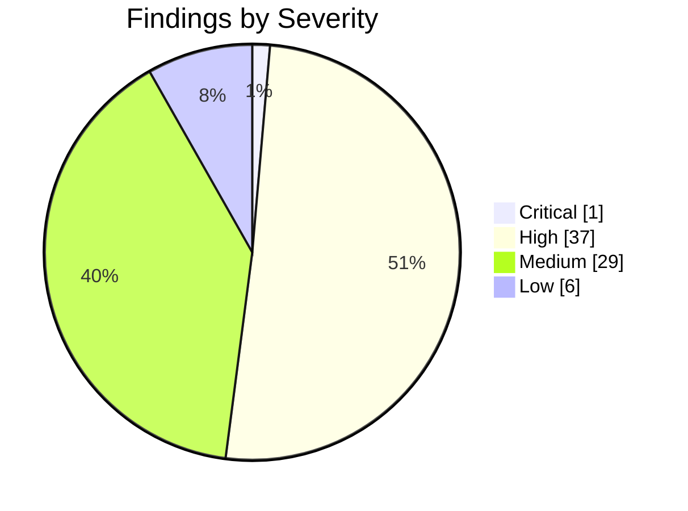
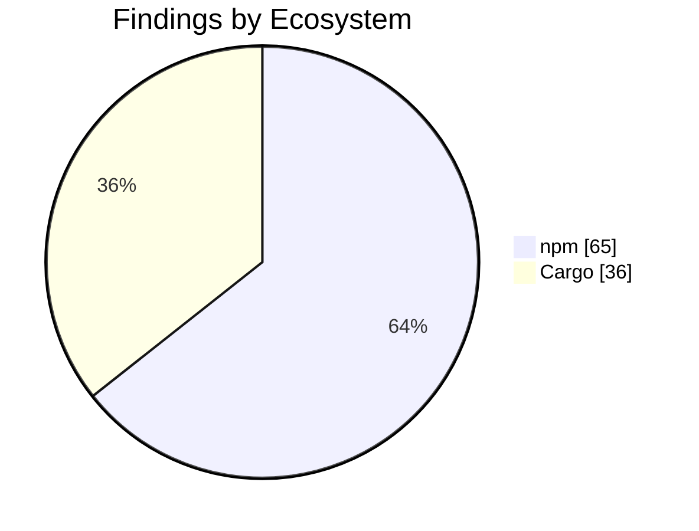

import { Card, CardGrid, Tabs, TabItem } from '@astrojs/starlight/components';

## Security Audit Report

:::note[Auto-generated]
Last generated: **2026-03-22T08:42:56Z** — updated daily by `ci-dashboard`.
:::

:::caution[Action Required]
**38** critical/high severity findings across the monorepo.
:::

### Severity Overview

<CardGrid>
  <Card title="1 Critical" icon="warning">
    Critical-severity findings across all ecosystems.
  </Card>
  <Card title="37 High" icon="error">
    High-severity findings across all ecosystems.
  </Card>
  <Card title="29 Medium" icon="information">
    Medium-severity findings across all ecosystems.
  </Card>
  <Card title="6 Low" icon="approve-check-circle">
    Low-severity findings across all ecosystems.
  </Card>
</CardGrid>

### Ecosystem Breakdown

<CardGrid>
  <Card title="npm" icon="seti:npm">
    **65** advisories
  </Card>
  <Card title="Cargo" icon="seti:rust">
    **36** advisories
  </Card>
  <Card title="Python" icon="seti:python">
    **0** advisories
  </Card>
  <Card title="CodeQL" icon="magnifier">
    **0** alerts
  </Card>
  <Card title="Dependabot" icon="github">
    **0** alerts
  </Card>
</CardGrid>

### Severity Distribution

### Findings by Ecosystem

<Tabs>
  <TabItem label="Summary">

| Ecosystem | Critical | High | Medium | Low | Total |
|-----------|:--------:|:----:|:------:|:---:|:-----:|
| **npm** | 1 | 37 | 21 | 6 | 65 |
| **Cargo** | 0 | 0 | 8 | 0 | 36 |
| **Python** | 0 | 0 | 0 | 0 | 0 |
| **CodeQL** | 0 | 0 | 0 | 0 | 0 |
| **Dependabot** | 0 | 0 | 0 | 0 | 0 |
| **Total** | 1 | 37 | 29 | 6 | 101 |

  </TabItem>
  <TabItem label="npm">

| Severity | Package | Advisory | Link |
|----------|---------|----------|------|
| Critical | `form-data` | form-data uses unsafe random function in form-data for ch... | [Details](https://github.com/advisories/GHSA-fjxv-7rqg-78g4) |
| High | `axios` | Server-Side Request Forgery in axios | [Details](https://github.com/advisories/GHSA-8hc4-vh64-cxmj) |
| High | `playwright` | Playwright downloads and installs browsers without verify... | [Details](https://github.com/advisories/GHSA-7mvr-c777-76hp) |
| High | `glob` | glob CLI: Command injection via -c/--cmd executes matches... | [Details](https://github.com/advisories/GHSA-5j98-mcp5-4vw2) |
| High | `axios` | axios Requests Vulnerable To Possible SSRF and Credential... | [Details](https://github.com/advisories/GHSA-jr5f-v2jv-69x6) |
| High | `jws` | auth0/node-jws Improperly Verifies HMAC Signature | [Details](https://github.com/advisories/GHSA-869p-cjfg-cm3x) |
| High | `axios` | Axios is vulnerable to DoS attack through lack of data si... | [Details](https://github.com/advisories/GHSA-4hjh-wcwx-xvwj) |
| High | `validator` | Validator is Vulnerable to Incomplete Filtering of One or... | [Details](https://github.com/advisories/GHSA-vghf-hv5q-vc2g) |
| High | `axios` | Axios is Vulnerable to Denial of Service via __proto__ Ke... | [Details](https://github.com/advisories/GHSA-43fc-jf86-j433) |
| High | `minimatch` | minimatch has a ReDoS via repeated wildcards with non-mat... | [Details](https://github.com/advisories/GHSA-3ppc-4f35-3m26) |
| High | `minimatch` | minimatch has a ReDoS via repeated wildcards with non-mat... | [Details](https://github.com/advisories/GHSA-3ppc-4f35-3m26) |
| High | `minimatch` | minimatch has a ReDoS via repeated wildcards with non-mat... | [Details](https://github.com/advisories/GHSA-3ppc-4f35-3m26) |
| High | `minimatch` | minimatch has a ReDoS via repeated wildcards with non-mat... | [Details](https://github.com/advisories/GHSA-3ppc-4f35-3m26) |
| High | `minimatch` | minimatch has a ReDoS via repeated wildcards with non-mat... | [Details](https://github.com/advisories/GHSA-3ppc-4f35-3m26) |
| High | `rollup` | Rollup 4 has Arbitrary File Write via Path Traversal | [Details](https://github.com/advisories/GHSA-mw96-cpmx-2vgc) |
| High | `minimatch` | minimatch has ReDoS: matchOne() combinatorial backtrackin... | [Details](https://github.com/advisories/GHSA-7r86-cg39-jmmj) |
| High | `minimatch` | minimatch has ReDoS: matchOne() combinatorial backtrackin... | [Details](https://github.com/advisories/GHSA-7r86-cg39-jmmj) |
| High | `minimatch` | minimatch has ReDoS: matchOne() combinatorial backtrackin... | [Details](https://github.com/advisories/GHSA-7r86-cg39-jmmj) |
| High | `minimatch` | minimatch has ReDoS: matchOne() combinatorial backtrackin... | [Details](https://github.com/advisories/GHSA-7r86-cg39-jmmj) |
| High | `minimatch` | minimatch has ReDoS: matchOne() combinatorial backtrackin... | [Details](https://github.com/advisories/GHSA-7r86-cg39-jmmj) |
| High | `minimatch` | minimatch ReDoS: nested *() extglobs generate catastrophi... | [Details](https://github.com/advisories/GHSA-23c5-xmqv-rm74) |
| High | `minimatch` | minimatch ReDoS: nested *() extglobs generate catastrophi... | [Details](https://github.com/advisories/GHSA-23c5-xmqv-rm74) |
| High | `minimatch` | minimatch ReDoS: nested *() extglobs generate catastrophi... | [Details](https://github.com/advisories/GHSA-23c5-xmqv-rm74) |
| High | `minimatch` | minimatch ReDoS: nested *() extglobs generate catastrophi... | [Details](https://github.com/advisories/GHSA-23c5-xmqv-rm74) |
| High | `minimatch` | minimatch ReDoS: nested *() extglobs generate catastrophi... | [Details](https://github.com/advisories/GHSA-23c5-xmqv-rm74) |
| High | `koa` | Koa has Host Header Injection via ctx.hostname | [Details](https://github.com/advisories/GHSA-7gcc-r8m5-44qm) |
| High | `serialize-javascript` | Serialize JavaScript is Vulnerable to RCE via RegExp.flag... | [Details](https://github.com/advisories/GHSA-5c6j-r48x-rmvq) |
| High | `svgo` | SVGO DoS through entity expansion in DOCTYPE (Billion Lau... | [Details](https://github.com/advisories/GHSA-xpqw-6gx7-v673) |
| High | `svgo` | SVGO DoS through entity expansion in DOCTYPE (Billion Lau... | [Details](https://github.com/advisories/GHSA-xpqw-6gx7-v673) |
| High | `immutable` | Immutable is vulnerable to Prototype Pollution | [Details](https://github.com/advisories/GHSA-wf6x-7x77-mvgw) |
| High | `tar` | tar has Hardlink Path Traversal via Drive-Relative Linkpath | [Details](https://github.com/advisories/GHSA-qffp-2rhf-9h96) |
| High | `tar` | node-tar Symlink Path Traversal via Drive-Relative Linkpath | [Details](https://github.com/advisories/GHSA-9ppj-qmqm-q256) |
| High | `flatted` | flatted vulnerable to unbounded recursion DoS in parse() ... | [Details](https://github.com/advisories/GHSA-25h7-pfq9-p65f) |
| High | `undici` | Undici has Unbounded Memory Consumption in WebSocket perm... | [Details](https://github.com/advisories/GHSA-vrm6-8vpv-qv8q) |
| High | `undici` | Undici has Unhandled Exception in WebSocket Client Due to... | [Details](https://github.com/advisories/GHSA-v9p9-hfj2-hcw8) |
| High | `flatted` | Prototype Pollution via parse() in NodeJS flatted | [Details](https://github.com/advisories/GHSA-rf6f-7fwh-wjgh) |
| High | `fast-xml-parser` | fast-xml-parser affected by numeric entity expansion bypa... | [Details](https://github.com/advisories/GHSA-8gc5-j5rx-235r) |
| High | `h3` | h3 has a Server-Sent Events Injection via Unsanitized New... | [Details](https://github.com/advisories/GHSA-22cc-p3c6-wpvm) |
| Medium | `got` | Got allows a redirect to a UNIX socket | [Details](https://github.com/advisories/GHSA-pfrx-2q88-qq97) |
| Medium | `validator` | validator.js has a URL validation bypass vulnerability in... | [Details](https://github.com/advisories/GHSA-9965-vmph-33xx) |
| Medium | `vue-template-compiler` | vue-template-compiler vulnerable to client-side Cross-Sit... | [Details](https://github.com/advisories/GHSA-g3ch-rx76-35fx) |
| Medium | `lodash-es` | Lodash has Prototype Pollution Vulnerability in `_.unset`... | [Details](https://github.com/advisories/GHSA-xxjr-mmjv-4gpg) |
| Medium | `lodash` | Lodash has Prototype Pollution Vulnerability in `_.unset`... | [Details](https://github.com/advisories/GHSA-xxjr-mmjv-4gpg) |
| Medium | `undici` | Undici has an unbounded decompression chain in HTTP respo... | [Details](https://github.com/advisories/GHSA-g9mf-h72j-4rw9) |
| Medium | `js-yaml` | js-yaml has prototype pollution in merge (&lt;&lt;) | [Details](https://github.com/advisories/GHSA-mh29-5h37-fv8m) |
| Medium | `mdast-util-to-hast` | mdast-util-to-hast has unsanitized class attribute | [Details](https://github.com/advisories/GHSA-4fh9-h7wg-q85m) |
| Medium | `ajv` | ajv has ReDoS when using `$data` option | [Details](https://github.com/advisories/GHSA-2g4f-4pwh-qvx6) |
| Medium | `ajv` | ajv has ReDoS when using `$data` option | [Details](https://github.com/advisories/GHSA-2g4f-4pwh-qvx6) |
| Medium | `qs` | qs's arrayLimit bypass in its bracket notation allows DoS... | [Details](https://github.com/advisories/GHSA-6rw7-vpxm-498p) |
| Medium | `dompurify` | DOMPurify contains a Cross-site Scripting vulnerability | [Details](https://github.com/advisories/GHSA-v8jm-5vwx-cfxm) |
| Medium | `dompurify` | DOMPurify contains a Cross-site Scripting vulnerability | [Details](https://github.com/advisories/GHSA-v2wj-7wpq-c8vv) |
| Medium | `file-type` | file-type affected by infinite loop in ASF parser on malf... | [Details](https://github.com/advisories/GHSA-5v7r-6r5c-r473) |
| Medium | `undici` | Undici has an HTTP Request/Response Smuggling issue | [Details](https://github.com/advisories/GHSA-2mjp-6q6p-2qxm) |
| Medium | `undici` | Undici has CRLF Injection in undici via `upgrade` option | [Details](https://github.com/advisories/GHSA-4992-7rv2-5pvq) |
| Medium | `yauzl` | yauzl contains an off-by-one error | [Details](https://github.com/advisories/GHSA-gmq8-994r-jv83) |
| Medium | `h3` | h3 has a Path Traversal via Percent-Encoded Dot Segments ... | [Details](https://github.com/advisories/GHSA-wr4h-v87w-p3r7) |
| Medium | `fast-xml-parser` | Entity Expansion Limits Bypassed When Set to Zero Due to ... | [Details](https://github.com/advisories/GHSA-jp2q-39xq-3w4g) |
| Medium | `h3` | h3: SSE Event Injection via Unsanitized Carriage Return (... | [Details](https://github.com/advisories/GHSA-4hxc-9384-m385) |
| Medium | `h3` | h3: Double Decoding in `serveStatic` Bypasses `resolveDot... | [Details](https://github.com/advisories/GHSA-72gr-qfp7-vwhw) |
| Low | `brace-expansion` | brace-expansion Regular Expression Denial of Service vuln... | [Details](https://github.com/advisories/GHSA-v6h2-p8h4-qcjw) |
| Low | `brace-expansion` | brace-expansion Regular Expression Denial of Service vuln... | [Details](https://github.com/advisories/GHSA-v6h2-p8h4-qcjw) |
| Low | `on-headers` | on-headers is vulnerable to http response header manipula... | [Details](https://github.com/advisories/GHSA-76c9-3jph-rj3q) |
| Low | `diff` | jsdiff has a Denial of Service vulnerability in parsePatc... | [Details](https://github.com/advisories/GHSA-73rr-hh4g-fpgx) |
| Low | `diff` | jsdiff has a Denial of Service vulnerability in parsePatc... | [Details](https://github.com/advisories/GHSA-73rr-hh4g-fpgx) |
| Low | `qs` | qs's arrayLimit bypass in comma parsing allows denial of ... | [Details](https://github.com/advisories/GHSA-w7fw-mjwx-w883) |

  </TabItem>
  <TabItem label="Cargo">

| Severity | Package | Advisory | Link |
|----------|---------|----------|------|
| Medium | `aws-lc-sys` | AWS-LC X.509 Name Constraints Bypass via Wildcard/Unicode CN |  |
| Medium | `aws-lc-sys` | CRL Distribution Point Scope Check Logic Error in AWS-LC | [Details](https://aws.amazon.com/security/security-bulletins/2026-010-AWS) |
| Medium | `curve25519-dalek` | Timing variability in `curve25519-dalek`'s `Scalar29::sub... | [Details](https://github.com/dalek-cryptography/curve25519-dalek/pull/659) |
| Medium | `ed25519-dalek` | Double Public Key Signing Function Oracle Attack on `ed25... | [Details](https://github.com/MystenLabs/ed25519-unsafe-libs) |
| Medium | `rsa` | Marvin Attack: potential key recovery through timing side... | [Details](https://github.com/RustCrypto/RSA/issues/19#issuecomment-1822995643) |
| Medium | `rustls-webpki` | CRLs not considered authorative by Distribution Point due... |  |
| Medium | `rustls-webpki` | CRLs not considered authorative by Distribution Point due... |  |
| Medium | `rustls-webpki` | CRLs not considered authorative by Distribution Point due... |  |
| Info | `atk` | gtk-rs GTK3 bindings - no longer maintained | [Details](https://github.com/gtk-rs/gtk3-rs/commit/508a69b63a3c5bf73790e0e59101a955847f30d6) |
| Info | `atk-sys` | gtk-rs GTK3 bindings - no longer maintained | [Details](https://github.com/gtk-rs/gtk3-rs/commit/508a69b63a3c5bf73790e0e59101a955847f30d6) |
| Info | `atty` | `atty` is unmaintained | [Details](https://github.com/softprops/atty/issues/57) |
| Info | `bincode` | Bincode is unmaintained | [Details](https://git.sr.ht/~stygianentity/bincode/tree/v3.0/item/README.md) |
| Info | `bincode` | Bincode is unmaintained | [Details](https://git.sr.ht/~stygianentity/bincode/tree/v3.0/item/README.md) |
| Info | `derivative` | `derivative` is unmaintained; consider using an alternative | [Details](https://github.com/mcarton/rust-derivative/issues/117) |
| Info | `fxhash` | fxhash - no longer maintained | [Details](https://github.com/cbreeden/fxhash/issues/20) |
| Info | `gdk` | gtk-rs GTK3 bindings - no longer maintained | [Details](https://github.com/gtk-rs/gtk3-rs/commit/508a69b63a3c5bf73790e0e59101a955847f30d6) |
| Info | `gdk-sys` | gtk-rs GTK3 bindings - no longer maintained | [Details](https://github.com/gtk-rs/gtk3-rs/commit/508a69b63a3c5bf73790e0e59101a955847f30d6) |
| Info | `gdkwayland-sys` | gtk-rs GTK3 bindings - no longer maintained | [Details](https://github.com/gtk-rs/gtk3-rs/commit/508a69b63a3c5bf73790e0e59101a955847f30d6) |
| Info | `gdkx11` | gtk-rs GTK3 bindings - no longer maintained | [Details](https://github.com/gtk-rs/gtk3-rs/commit/508a69b63a3c5bf73790e0e59101a955847f30d6) |
| Info | `gdkx11-sys` | gtk-rs GTK3 bindings - no longer maintained | [Details](https://github.com/gtk-rs/gtk3-rs/commit/508a69b63a3c5bf73790e0e59101a955847f30d6) |
| Info | `gtk` | gtk-rs GTK3 bindings - no longer maintained | [Details](https://github.com/gtk-rs/gtk3-rs/commit/508a69b63a3c5bf73790e0e59101a955847f30d6) |
| Info | `gtk-sys` | gtk-rs GTK3 bindings - no longer maintained | [Details](https://github.com/gtk-rs/gtk3-rs/commit/508a69b63a3c5bf73790e0e59101a955847f30d6) |
| Info | `gtk3-macros` | gtk-rs GTK3 bindings - no longer maintained | [Details](https://github.com/gtk-rs/gtk3-rs/commit/508a69b63a3c5bf73790e0e59101a955847f30d6) |
| Info | `number_prefix` | number_prefix crate is unmaintained | [Details](https://github.com/ogham/rust-number-prefix/pull/8) |
| Info | `paste` | paste - no longer maintained | [Details](https://github.com/dtolnay/paste) |
| Info | `proc-macro-error` | proc-macro-error is unmaintained | [Details](https://gitlab.com/CreepySkeleton/proc-macro-error/-/issues/20) |
| Info | `rustls-pemfile` | rustls-pemfile is unmaintained | [Details](https://github.com/rustls/pemfile/issues/61) |
| Info | `rustls-pemfile` | rustls-pemfile is unmaintained | [Details](https://github.com/rustls/pemfile/issues/61) |
| Info | `serde_cbor` | serde_cbor is unmaintained | [Details](https://github.com/pyfisch/cbor) |
| Info | `unic-char-property` | `unic-char-property` is unmaintained | [Details](https://github.com/rustsec/advisory-db/issues/2414) |
| Info | `unic-char-range` | `unic-char-range` is unmaintained | [Details](https://github.com/rustsec/advisory-db/issues/2414) |
| Info | `unic-common` | `unic-common` is unmaintained | [Details](https://github.com/rustsec/advisory-db/issues/2414) |
| Info | `unic-ucd-ident` | `unic-ucd-ident` is unmaintained | [Details](https://github.com/rustsec/advisory-db/issues/2414) |
| Info | `unic-ucd-version` | `unic-ucd-version` is unmaintained | [Details](https://github.com/rustsec/advisory-db/issues/2414) |
| Info | `atty` | Potential unaligned read | [Details](https://github.com/softprops/atty/issues/50) |
| Info | `glib` | Unsoundness in `Iterator` and `DoubleEndedIterator` impls... | [Details](https://github.com/gtk-rs/gtk-rs-core/pull/1343) |

  </TabItem>
  <TabItem label="Python">

:::tip[All Clear]
No python advisories found.
:::

  </TabItem>
  <TabItem label="CodeQL">

:::tip[All Clear]
No open CodeQL alerts.
:::

  </TabItem>
  <TabItem label="Dependabot">

:::tip[All Clear]
No open Dependabot alerts.
:::

  </TabItem>
</Tabs>

---

*Auto-generated by [ci-dashboard.yml](https://github.com/KBVE/kbve/actions/workflows/ci-dashboard.yml)*
