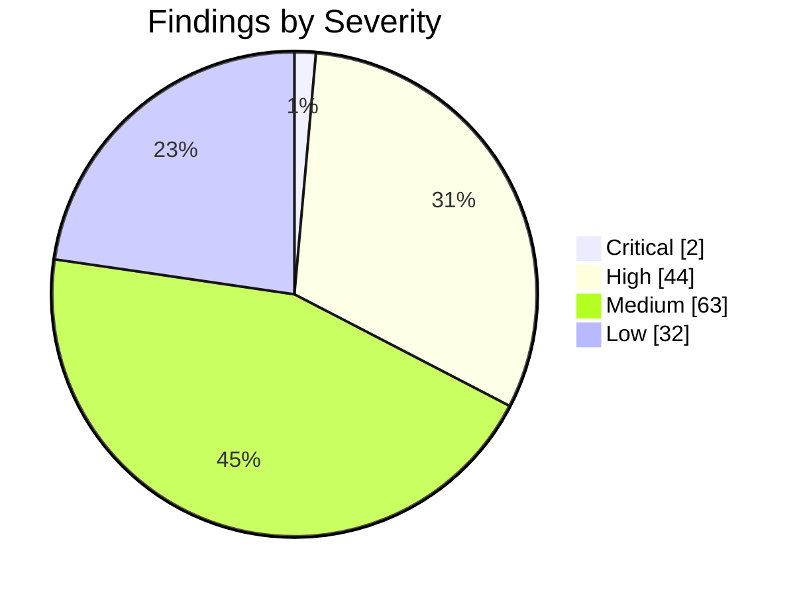
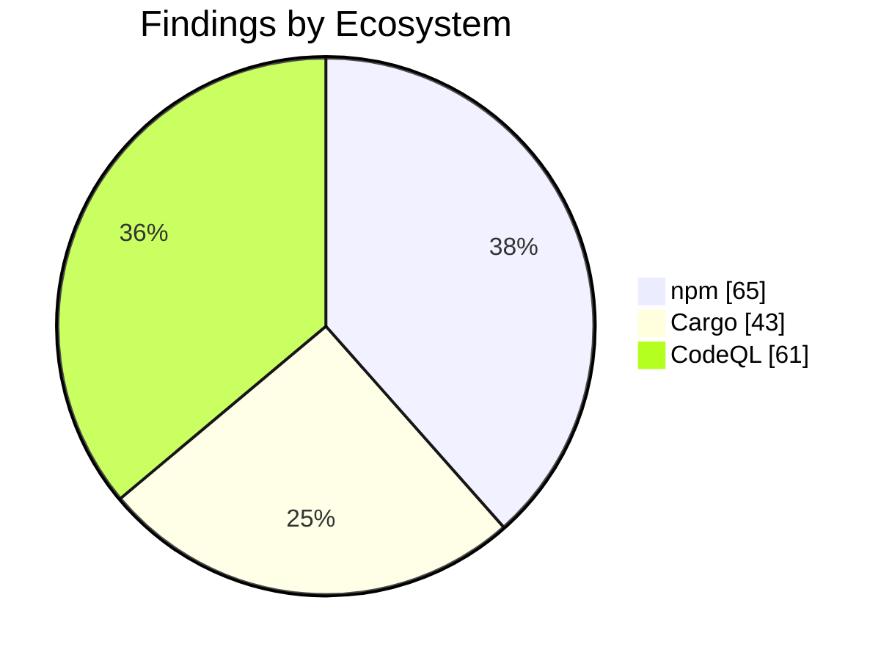

import { Card, CardGrid, Tabs, TabItem } from '@astrojs/starlight/components';

## Security Audit Report

:::note[Auto-generated]
Last generated: **2026-05-28T09:27:50Z** — updated daily by `ci-dashboard`.
:::

:::caution[Action Required]
**46** critical/high severity findings across the monorepo.
:::

### Severity Overview

<CardGrid>
  <Card title="2 Critical" icon="warning">
    Critical-severity findings across all ecosystems.
  </Card>
  <Card title="44 High" icon="error">
    High-severity findings across all ecosystems.
  </Card>
  <Card title="63 Medium" icon="information">
    Medium-severity findings across all ecosystems.
  </Card>
  <Card title="32 Low" icon="approve-check-circle">
    Low-severity findings across all ecosystems.
  </Card>
</CardGrid>

### Ecosystem Breakdown

<CardGrid>
  <Card title="npm" icon="seti:npm">
    **65** advisories
  </Card>
  <Card title="Cargo" icon="seti:rust">
    **43** advisories
  </Card>
  <Card title="Python" icon="seti:python">
    **0** advisories
  </Card>
  <Card title="CodeQL" icon="magnifier">
    **61** alerts
  </Card>
  <Card title="Dependabot" icon="github">
    **0** alerts
  </Card>
</CardGrid>

### Severity Distribution

### Findings by Ecosystem

<Tabs>
  <TabItem label="Summary">

| Ecosystem | Critical | High | Medium | Low | Total |
|-----------|:--------:|:----:|:------:|:---:|:-----:|
| **npm** | 0 | 26 | 33 | 6 | 65 |
| **Cargo** | 0 | 0 | 15 | 0 | 43 |
| **Python** | 0 | 0 | 0 | 0 | 0 |
| **CodeQL** | 2 | 18 | 15 | 26 | 61 |
| **Dependabot** | 0 | 0 | 0 | 0 | 0 |
| **Total** | 2 | 44 | 63 | 32 | 169 |

  </TabItem>
  <TabItem label="npm">

| Severity | Package | Advisory | Link |
|----------|---------|----------|------|
| High | `glob` | glob CLI: Command injection via -c/--cmd executes matches... | [Details](https://github.com/advisories/GHSA-5j98-mcp5-4vw2) |
| High | `rollup` | Rollup 4 has Arbitrary File Write via Path Traversal | [Details](https://github.com/advisories/GHSA-mw96-cpmx-2vgc) |
| High | `koa` | Koa has Host Header Injection via ctx.hostname | [Details](https://github.com/advisories/GHSA-7gcc-r8m5-44qm) |
| High | `serialize-javascript` | Serialize JavaScript is Vulnerable to RCE via RegExp.flag... | [Details](https://github.com/advisories/GHSA-5c6j-r48x-rmvq) |
| High | `svgo` | SVGO DoS through entity expansion in DOCTYPE (Billion Lau... | [Details](https://github.com/advisories/GHSA-xpqw-6gx7-v673) |
| High | `svgo` | SVGO DoS through entity expansion in DOCTYPE (Billion Lau... | [Details](https://github.com/advisories/GHSA-xpqw-6gx7-v673) |
| High | `tar` | tar has Hardlink Path Traversal via Drive-Relative Linkpath | [Details](https://github.com/advisories/GHSA-qffp-2rhf-9h96) |
| High | `tar` | node-tar Symlink Path Traversal via Drive-Relative Linkpath | [Details](https://github.com/advisories/GHSA-9ppj-qmqm-q256) |
| High | `flatted` | flatted vulnerable to unbounded recursion DoS in parse() ... | [Details](https://github.com/advisories/GHSA-25h7-pfq9-p65f) |
| High | `flatted` | Prototype Pollution via parse() in NodeJS flatted | [Details](https://github.com/advisories/GHSA-rf6f-7fwh-wjgh) |
| High | `path-to-regexp` | path-to-regexp vulnerable to Regular Expression Denial of... | [Details](https://github.com/advisories/GHSA-37ch-88jc-xwx2) |
| High | `picomatch` | Picomatch has a ReDoS vulnerability via extglob quantifiers | [Details](https://github.com/advisories/GHSA-c2c7-rcm5-vvqj) |
| High | `picomatch` | Picomatch has a ReDoS vulnerability via extglob quantifiers | [Details](https://github.com/advisories/GHSA-c2c7-rcm5-vvqj) |
| High | `lodash` | lodash vulnerable to Code Injection via `_.template` impo... | [Details](https://github.com/advisories/GHSA-r5fr-rjxr-66jc) |
| High | `vite` | Vite: `server.fs.deny` bypassed with queries | [Details](https://github.com/advisories/GHSA-v2wj-q39q-566r) |
| High | `vite` | Vite Vulnerable to Arbitrary File Read via Vite Dev Serve... | [Details](https://github.com/advisories/GHSA-p9ff-h696-f583) |
| High | `vite` | Vite Vulnerable to Arbitrary File Read via Vite Dev Serve... | [Details](https://github.com/advisories/GHSA-p9ff-h696-f583) |
| High | `immutable` | Immutable is vulnerable to Prototype Pollution | [Details](https://github.com/advisories/GHSA-wf6x-7x77-mvgw) |
| High | `axios` | Axios: Incomplete Fix for CVE-2025-62718 — NO_PROXY Prote... | [Details](https://github.com/advisories/GHSA-pmwg-cvhr-8vh7) |
| High | `axios` | Axios: Prototype Pollution Gadgets - Response Tampering, ... | [Details](https://github.com/advisories/GHSA-pf86-5x62-jrwf) |
| High | `axios` | Axios: Header Injection via Prototype Pollution | [Details](https://github.com/advisories/GHSA-6chq-wfr3-2hj9) |
| High | `fast-uri` | fast-uri vulnerable to path traversal via percent-encoded... | [Details](https://github.com/advisories/GHSA-q3j6-qgpj-74h6) |
| High | `fast-uri` | fast-uri vulnerable to host confusion via percent-encoded... | [Details](https://github.com/advisories/GHSA-v39h-62p7-jpjc) |
| High | `axios` | Axios has prototype pollution read-side gadgets in HTTP a... | [Details](https://github.com/advisories/GHSA-q8qp-cvcw-x6jj) |
| High | `devalue` | Svelte devalue: DoS via sparse array deserialization | [Details](https://github.com/advisories/GHSA-77vg-94rm-hx3p) |
| High | `tmp` | tmp has Path Traversal via unsanitized prefix/postfix tha... | [Details](https://github.com/advisories/GHSA-ph9p-34f9-6g65) |
| Medium | `got` | Got allows a redirect to a UNIX socket | [Details](https://github.com/advisories/GHSA-pfrx-2q88-qq97) |
| Medium | `vue-template-compiler` | vue-template-compiler vulnerable to client-side Cross-Sit... | [Details](https://github.com/advisories/GHSA-g3ch-rx76-35fx) |
| Medium | `lodash` | Lodash has Prototype Pollution Vulnerability in `_.unset`... | [Details](https://github.com/advisories/GHSA-xxjr-mmjv-4gpg) |
| Medium | `js-yaml` | js-yaml has prototype pollution in merge (&lt;&lt;) | [Details](https://github.com/advisories/GHSA-mh29-5h37-fv8m) |
| Medium | `mdast-util-to-hast` | mdast-util-to-hast has unsanitized class attribute | [Details](https://github.com/advisories/GHSA-4fh9-h7wg-q85m) |
| Medium | `ajv` | ajv has ReDoS when using `$data` option | [Details](https://github.com/advisories/GHSA-2g4f-4pwh-qvx6) |
| Medium | `ajv` | ajv has ReDoS when using `$data` option | [Details](https://github.com/advisories/GHSA-2g4f-4pwh-qvx6) |
| Medium | `qs` | qs's arrayLimit bypass in its bracket notation allows DoS... | [Details](https://github.com/advisories/GHSA-6rw7-vpxm-498p) |
| Medium | `brace-expansion` | brace-expansion: Zero-step sequence causes process hang a... | [Details](https://github.com/advisories/GHSA-f886-m6hf-6m8v) |
| Medium | `brace-expansion` | brace-expansion: Zero-step sequence causes process hang a... | [Details](https://github.com/advisories/GHSA-f886-m6hf-6m8v) |
| Medium | `brace-expansion` | brace-expansion: Zero-step sequence causes process hang a... | [Details](https://github.com/advisories/GHSA-f886-m6hf-6m8v) |
| Medium | `picomatch` | Picomatch: Method Injection in POSIX Character Classes ca... | [Details](https://github.com/advisories/GHSA-3v7f-55p6-f55p) |
| Medium | `picomatch` | Picomatch: Method Injection in POSIX Character Classes ca... | [Details](https://github.com/advisories/GHSA-3v7f-55p6-f55p) |
| Medium | `yaml` | yaml is vulnerable to Stack Overflow via deeply nested YA... | [Details](https://github.com/advisories/GHSA-48c2-rrv3-qjmp) |
| Medium | `yaml` | yaml is vulnerable to Stack Overflow via deeply nested YA... | [Details](https://github.com/advisories/GHSA-48c2-rrv3-qjmp) |
| Medium | `lodash` | lodash vulnerable to Prototype Pollution via array path b... | [Details](https://github.com/advisories/GHSA-f23m-r3pf-42rh) |
| Medium | `vite` | Vite Vulnerable to Path Traversal in Optimized Deps `.map... | [Details](https://github.com/advisories/GHSA-4w7w-66w2-5vf9) |
| Medium | `vite` | Vite Vulnerable to Path Traversal in Optimized Deps `.map... | [Details](https://github.com/advisories/GHSA-4w7w-66w2-5vf9) |
| Medium | `astro` | Astro: XSS in define:vars via incomplete &lt;/script&gt; tag sa... | [Details](https://github.com/advisories/GHSA-j687-52p2-xcff) |
| Medium | `axios` | Axios: Authentication Bypass via Prototype Pollution Gadg... | [Details](https://github.com/advisories/GHSA-w9j2-pvgh-6h63) |
| Medium | `axios` | Axios: Invisible JSON Response Tampering via Prototype Po... | [Details](https://github.com/advisories/GHSA-3w6x-2g7m-8v23) |
| Medium | `axios` | Axios: CRLF Injection in multipart/form-data body via uns... | [Details](https://github.com/advisories/GHSA-445q-vr5w-6q77) |
| Medium | `axios` | Axios: no_proxy bypass via IP alias allows SSRF | [Details](https://github.com/advisories/GHSA-m7pr-hjqh-92cm) |
| Medium | `axios` | Axios: unbounded recursion in toFormData causes DoS via d... | [Details](https://github.com/advisories/GHSA-62hf-57xw-28j9) |
| Medium | `axios` | Axios' HTTP adapter-streamed uploads bypass maxBodyLength... | [Details](https://github.com/advisories/GHSA-5c9x-8gcm-mpgx) |
| Medium | `axios` | Axios: HTTP adapter streamed responses bypass maxContentL... | [Details](https://github.com/advisories/GHSA-vf2m-468p-8v99) |
| Medium | `axios` | Axios: XSRF Token Cross-Origin Leakage via Prototype Poll... | [Details](https://github.com/advisories/GHSA-xx6v-rp6x-q39c) |
| Medium | `webpack-dev-server` | webpack-dev-server vulnerable to cross-origin source code... | [Details](https://github.com/advisories/GHSA-79cf-xcqc-c78w) |
| Medium | `brace-expansion` | brace-expansion: Large numeric range defeats documented `... | [Details](https://github.com/advisories/GHSA-jxxr-4gwj-5jf2) |
| Medium | `ws` | ws: Uninitialized memory disclosure | [Details](https://github.com/advisories/GHSA-58qx-3vcg-4xpx) |
| Medium | `serialize-javascript` | Serialize JavaScript has CPU Exhaustion Denial of Service... | [Details](https://github.com/advisories/GHSA-qj8w-gfj5-8c6v) |
| Medium | `uuid` | uuid: Missing buffer bounds check in v3/v5/v6 when buf is... | [Details](https://github.com/advisories/GHSA-w5hq-g745-h8pq) |
| Medium | `qs` | qs has a remotely triggerable DoS: qs.stringify crashes w... | [Details](https://github.com/advisories/GHSA-q8mj-m7cp-5q26) |
| Low | `diff` | jsdiff has a Denial of Service vulnerability in parsePatc... | [Details](https://github.com/advisories/GHSA-73rr-hh4g-fpgx) |
| Low | `diff` | jsdiff has a Denial of Service vulnerability in parsePatc... | [Details](https://github.com/advisories/GHSA-73rr-hh4g-fpgx) |
| Low | `qs` | qs's arrayLimit bypass in comma parsing allows denial of ... | [Details](https://github.com/advisories/GHSA-w7fw-mjwx-w883) |
| Low | `astro` | Astro: Remote allowlist bypass via unanchored matchPathna... | [Details](https://github.com/advisories/GHSA-g735-7g2w-hh3f) |
| Low | `axios` | Axios: Null Byte Injection via Reverse-Encoding in AxiosU... | [Details](https://github.com/advisories/GHSA-xhjh-pmcv-23jw) |
| Low | `astro` | Astro: Server island encrypted parameters vulnerable to c... | [Details](https://github.com/advisories/GHSA-xr5h-phrj-8vxv) |

  </TabItem>
  <TabItem label="Cargo">

| Severity | Package | Advisory | Link |
|----------|---------|----------|------|
| Medium | `hickory-proto` | NSEC3 closest-encloser proof validation enters unbounded ... | [Details](https://github.com/hickory-dns/hickory-dns/security/advisories/GHSA-3v94-mw7p-v465) |
| Medium | `hickory-proto` | CPU exhaustion during message encoding due to O(n²) name ... | [Details](https://github.com/hickory-dns/hickory-dns/security/advisories/GHSA-q2qq-hmj6-3wpp) |
| Medium | `rsa` | Marvin Attack: potential key recovery through timing side... | [Details](https://github.com/RustCrypto/RSA/issues/626) |
| Medium | `rustls-webpki` | Name constraints for URI names were incorrectly accepted |  |
| Medium | `rustls-webpki` | Name constraints were accepted for certificates asserting... |  |
| Medium | `rustls-webpki` | Reachable panic in certificate revocation list parsing |  |
| Medium | `rustls-webpki` | CRLs not considered authoritative by Distribution Point d... |  |
| Medium | `rustls-webpki` | Name constraints for URI names were incorrectly accepted |  |
| Medium | `rustls-webpki` | Name constraints were accepted for certificates asserting... |  |
| Medium | `rustls-webpki` | Reachable panic in certificate revocation list parsing |  |
| Medium | `rustls-webpki` | Name constraints for URI names were incorrectly accepted |  |
| Medium | `rustls-webpki` | Name constraints were accepted for certificates asserting... |  |
| Medium | `rustls-webpki` | Reachable panic in certificate revocation list parsing |  |
| Medium | `sqlx` | Binary Protocol Misinterpretation caused by Truncating or... | [Details](https://github.com/launchbadge/sqlx/issues/3440) |
| Medium | `steamworks` | Denial of service in Steamworks game clients/servers usin... | [Details](https://github.com/Noxime/steamworks-rs/issues/321) |
| Info | `atk` | gtk-rs GTK3 bindings - no longer maintained | [Details](https://github.com/gtk-rs/gtk3-rs/commit/508a69b63a3c5bf73790e0e59101a955847f30d6) |
| Info | `atk-sys` | gtk-rs GTK3 bindings - no longer maintained | [Details](https://github.com/gtk-rs/gtk3-rs/commit/508a69b63a3c5bf73790e0e59101a955847f30d6) |
| Info | `bincode` | Bincode is unmaintained | [Details](https://git.sr.ht/~stygianentity/bincode/tree/v3.0/item/README.md) |
| Info | `derivative` | `derivative` is unmaintained; consider using an alternative | [Details](https://github.com/mcarton/rust-derivative/issues/117) |
| Info | `fxhash` | fxhash - no longer maintained | [Details](https://github.com/cbreeden/fxhash/issues/20) |
| Info | `gdk` | gtk-rs GTK3 bindings - no longer maintained | [Details](https://github.com/gtk-rs/gtk3-rs/commit/508a69b63a3c5bf73790e0e59101a955847f30d6) |
| Info | `gdk-sys` | gtk-rs GTK3 bindings - no longer maintained | [Details](https://github.com/gtk-rs/gtk3-rs/commit/508a69b63a3c5bf73790e0e59101a955847f30d6) |
| Info | `gdkwayland-sys` | gtk-rs GTK3 bindings - no longer maintained | [Details](https://github.com/gtk-rs/gtk3-rs/commit/508a69b63a3c5bf73790e0e59101a955847f30d6) |
| Info | `gdkx11` | gtk-rs GTK3 bindings - no longer maintained | [Details](https://github.com/gtk-rs/gtk3-rs/commit/508a69b63a3c5bf73790e0e59101a955847f30d6) |
| Info | `gdkx11-sys` | gtk-rs GTK3 bindings - no longer maintained | [Details](https://github.com/gtk-rs/gtk3-rs/commit/508a69b63a3c5bf73790e0e59101a955847f30d6) |
| Info | `gtk` | gtk-rs GTK3 bindings - no longer maintained | [Details](https://github.com/gtk-rs/gtk3-rs/commit/508a69b63a3c5bf73790e0e59101a955847f30d6) |
| Info | `gtk-sys` | gtk-rs GTK3 bindings - no longer maintained | [Details](https://github.com/gtk-rs/gtk3-rs/commit/508a69b63a3c5bf73790e0e59101a955847f30d6) |
| Info | `gtk3-macros` | gtk-rs GTK3 bindings - no longer maintained | [Details](https://github.com/gtk-rs/gtk3-rs/commit/508a69b63a3c5bf73790e0e59101a955847f30d6) |
| Info | `paste` | paste - no longer maintained | [Details](https://github.com/dtolnay/paste) |
| Info | `proc-macro-error` | proc-macro-error is unmaintained | [Details](https://gitlab.com/CreepySkeleton/proc-macro-error/-/issues/20) |
| Info | `rustls-pemfile` | rustls-pemfile is unmaintained | [Details](https://github.com/rustls/pemfile/issues/61) |
| Info | `rustls-pemfile` | rustls-pemfile is unmaintained | [Details](https://github.com/rustls/pemfile/issues/61) |
| Info | `serde_cbor` | serde_cbor is unmaintained | [Details](https://github.com/pyfisch/cbor) |
| Info | `unic-char-property` | `unic-char-property` is unmaintained | [Details](https://github.com/rustsec/advisory-db/issues/2414) |
| Info | `unic-char-range` | `unic-char-range` is unmaintained | [Details](https://github.com/rustsec/advisory-db/issues/2414) |
| Info | `unic-common` | `unic-common` is unmaintained | [Details](https://github.com/rustsec/advisory-db/issues/2414) |
| Info | `unic-ucd-ident` | `unic-ucd-ident` is unmaintained | [Details](https://github.com/rustsec/advisory-db/issues/2414) |
| Info | `unic-ucd-version` | `unic-ucd-version` is unmaintained | [Details](https://github.com/rustsec/advisory-db/issues/2414) |
| Info | `glib` | Unsoundness in `Iterator` and `DoubleEndedIterator` impls... | [Details](https://github.com/gtk-rs/gtk-rs-core/pull/1343) |
| Info | `rand` | Rand is unsound with a custom logger using `rand::rng()` | [Details](https://github.com/rust-random/rand/pull/1763) |
| Info | `rand` | Rand is unsound with a custom logger using `rand::rng()` | [Details](https://github.com/rust-random/rand/pull/1763) |
| Info | `rand` | Rand is unsound with a custom logger using `rand::rng()` | [Details](https://github.com/rust-random/rand/pull/1763) |
| Info | `rand` | Rand is unsound with a custom logger using `rand::rng()` | [Details](https://github.com/rust-random/rand/pull/1763) |

  </TabItem>
  <TabItem label="Python">

:::tip[All Clear]
No python advisories found.
:::

  </TabItem>
  <TabItem label="CodeQL">

| Severity | Rule | Path | Link |
|----------|------|------|------|
| Critical | `rust/hard-coded-cryptographic-value` | `packages/rust/erust/src/supabase/integration.rs` | [Details](https://github.com/KBVE/kbve/security/code-scanning/278) |
| Critical | `rust/hard-coded-cryptographic-value` | `packages/rust/erust/src/supabase/integration.rs` | [Details](https://github.com/KBVE/kbve/security/code-scanning/277) |
| High | `rust/cleartext-transmission` | `apps/kbve/axum-kbve/src/db/twitch.rs` | [Details](https://github.com/KBVE/kbve/security/code-scanning/438) |
| High | `rust/cleartext-transmission` | `apps/kbve/axum-kbve/src/db/twitch.rs` | [Details](https://github.com/KBVE/kbve/security/code-scanning/437) |
| High | `rust/cleartext-transmission` | `apps/kbve/axum-kbve/src/db/discord.rs` | [Details](https://github.com/KBVE/kbve/security/code-scanning/436) |
| High | `rust/cleartext-transmission` | `apps/kbve/axum-kbve/src/db/discord.rs` | [Details](https://github.com/KBVE/kbve/security/code-scanning/435) |
| High | `rust/cleartext-transmission` | `apps/kbve/axum-kbve/src/db/mc.rs` | [Details](https://github.com/KBVE/kbve/security/code-scanning/434) |
| High | `rust/non-https-url` | `packages/rust/kbve/src/sys/system_diagnostics.rs` | [Details](https://github.com/KBVE/kbve/security/code-scanning/264) |
| High | `rust/insecure-cookie` | `...ust/kbve/src/entity/response/header_response.rs` | [Details](https://github.com/KBVE/kbve/security/code-scanning/263) |
| High | `rust/insecure-cookie` | `packages/rust/kbve/src/authentication.rs` | [Details](https://github.com/KBVE/kbve/security/code-scanning/262) |
| High | `rust/insecure-cookie` | `packages/rust/kbve/src/authentication.rs` | [Details](https://github.com/KBVE/kbve/security/code-scanning/261) |
| High | `rust/cleartext-logging` | `apps/mc/plugins/kbve-mc-plugin/src/lib.rs` | [Details](https://github.com/KBVE/kbve/security/code-scanning/256) |
| High | `js/tainted-format-string` | `apps/kbve/astro-kbve/src/workers/supabase.db.ts` | [Details](https://github.com/KBVE/kbve/security/code-scanning/218) |
| High | `py/uninitialized-local-variable` | `...n_bot/api/discord/embed/discord_status_embed.py` | [Details](https://github.com/KBVE/kbve/security/code-scanning/43) |
| High | `py/uninitialized-local-variable` | `...n_bot/api/discord/embed/discord_status_embed.py` | [Details](https://github.com/KBVE/kbve/security/code-scanning/42) |
| High | `py/uninitialized-local-variable` | `...n_bot/api/discord/embed/discord_status_embed.py` | [Details](https://github.com/KBVE/kbve/security/code-scanning/41) |
| High | `py/uninitialized-local-variable` | `...n_bot/api/discord/embed/discord_status_embed.py` | [Details](https://github.com/KBVE/kbve/security/code-scanning/40) |
| High | `py/uninitialized-local-variable` | `...n_bot/api/discord/embed/discord_status_embed.py` | [Details](https://github.com/KBVE/kbve/security/code-scanning/39) |
| High | `py/uninitialized-local-variable` | `...n_bot/api/discord/embed/discord_status_embed.py` | [Details](https://github.com/KBVE/kbve/security/code-scanning/38) |
| High | `js/xss-through-dom` | `apps/pydesk/templates/home.html` | [Details](https://github.com/KBVE/kbve/security/code-scanning/11) |
| Medium | `js/trivial-conditional` | `...tion-unobtrusive/jquery.validate.unobtrusive.js` | [Details](https://github.com/KBVE/kbve/security/code-scanning/491) |
| Medium | `js/useless-assignment-to-local` | `apps/kbve/edge/functions/meme/index.ts` | [Details](https://github.com/KBVE/kbve/security/code-scanning/482) |
| Medium | `js/useless-assignment-to-local` | `...kbve/src/components/realtime/Realtime.worker.ts` | [Details](https://github.com/KBVE/kbve/security/code-scanning/228) |
| Medium | `js/client-side-request-forgery` | `...ve/astro-kbve/src/workers/supabase.websocket.ts` | [Details](https://github.com/KBVE/kbve/security/code-scanning/227) |
| Medium | `js/log-injection` | `.../kbve/astro-kbve/src/workers/supabase.shared.ts` | [Details](https://github.com/KBVE/kbve/security/code-scanning/226) |
| Medium | `js/log-injection` | `...ve/astro-kbve/src/workers/supabase.websocket.ts` | [Details](https://github.com/KBVE/kbve/security/code-scanning/225) |
| Medium | `js/missing-origin-check` | `apps/kbve/astro-kbve/src/workers/supabase.db.ts` | [Details](https://github.com/KBVE/kbve/security/code-scanning/223) |
| Medium | `js/missing-origin-check` | `apps/kbve/astro-kbve/src/workers/test-worker.ts` | [Details](https://github.com/KBVE/kbve/security/code-scanning/222) |
| Medium | `js/missing-origin-check` | `...ve/astro-kbve/src/workers/supabase.db.simple.ts` | [Details](https://github.com/KBVE/kbve/security/code-scanning/221) |
| Medium | `js/missing-origin-check` | `...kbve/src/components/realtime/Realtime.worker.ts` | [Details](https://github.com/KBVE/kbve/security/code-scanning/220) |
| Medium | `js/useless-assignment-to-local` | `apps/pydesk/templates/home.html` | [Details](https://github.com/KBVE/kbve/security/code-scanning/102) |
| Medium | `js/useless-assignment-to-local` | `apps/pydesk/templates/home.html` | [Details](https://github.com/KBVE/kbve/security/code-scanning/101) |
| Medium | `js/missing-origin-check` | `...npm/droid/src/lib/workers/supabase-db-worker.ts` | [Details](https://github.com/KBVE/kbve/security/code-scanning/60) |
| Medium | `py/exit-from-finally` | `apps/pydesk/pydesk/main.py` | [Details](https://github.com/KBVE/kbve/security/code-scanning/59) |
| Medium | `py/stack-trace-exposure` | `apps/pydesk/pydesk/main.py` | [Details](https://github.com/KBVE/kbve/security/code-scanning/7) |
| Low | `js/unused-local-variable` | `packages/data/codegen/generate-proto-registry.mjs` | [Details](https://github.com/KBVE/kbve/security/code-scanning/488) |
| Low | `js/unused-local-variable` | `...-memes/src/components/feed/ReactMemeContent.tsx` | [Details](https://github.com/KBVE/kbve/security/code-scanning/485) |
| Low | `py/import-and-import-from` | `packages/python/fudster/fudster/cli.py` | [Details](https://github.com/KBVE/kbve/security/code-scanning/483) |
| Low | `rust/unused-variable` | `...e/isometric/src-tauri/src/game/scene_objects.rs` | [Details](https://github.com/KBVE/kbve/security/code-scanning/440) |
| Low | `rust/unused-variable` | `...e/isometric/src-tauri/src/game/scene_objects.rs` | [Details](https://github.com/KBVE/kbve/security/code-scanning/439) |
| Low | `js/unused-local-variable` | `...e/templates/askama/profile_not_found/index.html` | [Details](https://github.com/KBVE/kbve/security/code-scanning/251) |
| Low | `js/syntax-error` | `...ta/scripts/unity/WebGLTemplates/KBVE/index.html` | [Details](https://github.com/KBVE/kbve/security/code-scanning/250) |
| Low | `js/unused-local-variable` | `...o-kbve/src/components/user/ReactUserProfile.tsx` | [Details](https://github.com/KBVE/kbve/security/code-scanning/248) |
| Low | `js/unused-local-variable` | `...e/src/components/realtime/ReactSupaRealtime.tsx` | [Details](https://github.com/KBVE/kbve/security/code-scanning/241) |
| Low | `js/unused-local-variable` | `...e/src/components/realtime/ReactSupaRealtime.tsx` | [Details](https://github.com/KBVE/kbve/security/code-scanning/240) |
| Low | `js/unused-local-variable` | `...e/src/components/realtime/ReactSupaRealtime.tsx` | [Details](https://github.com/KBVE/kbve/security/code-scanning/239) |
| Low | `js/unused-local-variable` | `...e/src/components/realtime/ReactSupaRealtime.tsx` | [Details](https://github.com/KBVE/kbve/security/code-scanning/238) |
| Low | `js/unused-local-variable` | `.../astro-kbve/src/components/jay/ReactJayYuki.tsx` | [Details](https://github.com/KBVE/kbve/security/code-scanning/237) |
| Low | `js/unused-local-variable` | `.../src/components/discord/ReactDiscordProfile.tsx` | [Details](https://github.com/KBVE/kbve/security/code-scanning/236) |
| Low | `rust/unused-variable` | `packages/rust/q/src/manager/gui_manager.rs` | [Details](https://github.com/KBVE/kbve/security/code-scanning/124) |
| Low | `js/unused-local-variable` | `apps/pydesk/templates/home.html` | [Details](https://github.com/KBVE/kbve/security/code-scanning/93) |
| Low | `js/unused-local-variable` | `apps/pydesk/templates/home.html` | [Details](https://github.com/KBVE/kbve/security/code-scanning/92) |
| Low | `js/unused-local-variable` | `apps/pydesk/templates/home.html` | [Details](https://github.com/KBVE/kbve/security/code-scanning/91) |
| Low | `js/unused-local-variable` | `apps/pydesk/templates/home.html` | [Details](https://github.com/KBVE/kbve/security/code-scanning/90) |
| Low | `js/unused-local-variable` | `...astro-irc/src/components/chat/ReactChatRoom.tsx` | [Details](https://github.com/KBVE/kbve/security/code-scanning/88) |
| Low | `js/unused-local-variable` | `.github/deprecated/github-a-localtunnel/index.js` | [Details](https://github.com/KBVE/kbve/security/code-scanning/74) |
| Low | `py/empty-except` | `...on-bot/notification_bot/utils/health_monitor.py` | [Details](https://github.com/KBVE/kbve/security/code-scanning/58) |
| Low | `py/unused-import` | `packages/python/kbve/kbve/proto/kbve_pb2_grpc.py` | [Details](https://github.com/KBVE/kbve/security/code-scanning/49) |
| Low | `py/mixed-returns` | `...on-bot/notification_bot/api/supabase/tracker.py` | [Details](https://github.com/KBVE/kbve/security/code-scanning/48) |
| Low | `py/mixed-returns` | `...notification_bot/api/discord/discord_service.py` | [Details](https://github.com/KBVE/kbve/security/code-scanning/47) |
| Low | `py/unused-global-variable` | `packages/python/kbve/kbve/proto/kbve_pb2.py` | [Details](https://github.com/KBVE/kbve/security/code-scanning/37) |

  </TabItem>
  <TabItem label="Dependabot">

:::tip[All Clear]
No open Dependabot alerts.
:::

  </TabItem>
</Tabs>

---

*Auto-generated by [ci-dashboard.yml](https://github.com/KBVE/kbve/actions/workflows/ci-dashboard.yml)*
