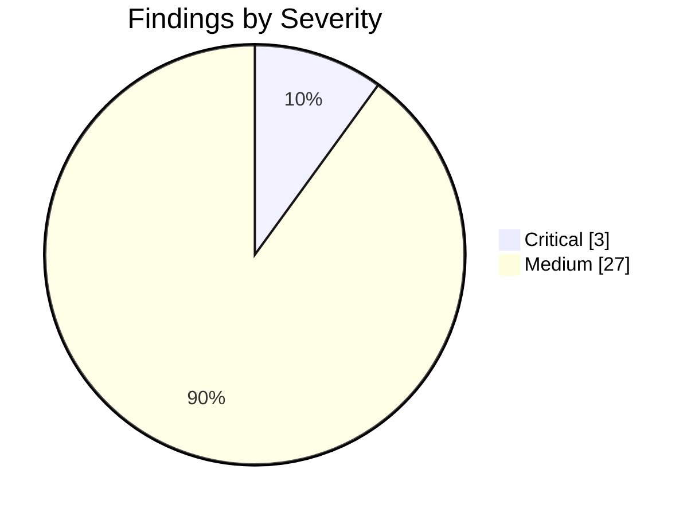
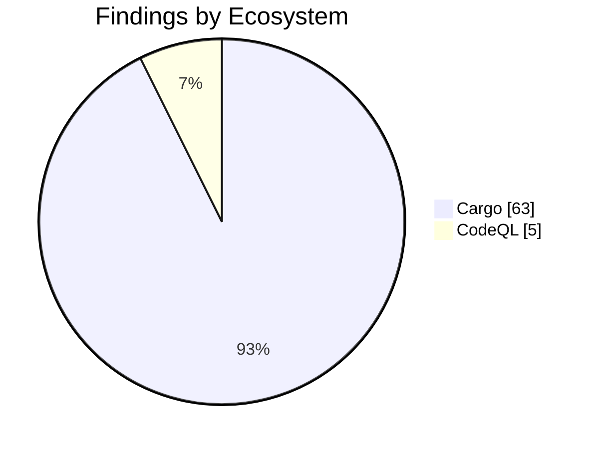

import { Card, CardGrid, Tabs, TabItem } from '@astrojs/starlight/components';

## Security Audit Report

:::note[Auto-generated]
Last generated: **2026-07-16T10:14:40Z** — updated daily by `ci-dashboard`.
:::

:::caution[Action Required]
**3** critical/high severity findings across the monorepo.
:::

### Severity Overview

<CardGrid>
  <Card title="3 Critical" icon="warning">
    Critical-severity findings across all ecosystems.
  </Card>
  <Card title="0 High" icon="error">
    High-severity findings across all ecosystems.
  </Card>
  <Card title="27 Medium" icon="information">
    Medium-severity findings across all ecosystems.
  </Card>
  <Card title="0 Low" icon="approve-check-circle">
    Low-severity findings across all ecosystems.
  </Card>
</CardGrid>

### Ecosystem Breakdown

<CardGrid>
  <Card title="npm" icon="seti:npm">
    **0** advisories
  </Card>
  <Card title="Cargo" icon="seti:rust">
    **63** advisories
  </Card>
  <Card title="Python" icon="seti:python">
    **0** advisories
  </Card>
  <Card title="CodeQL" icon="magnifier">
    **5** alerts
  </Card>
  <Card title="Dependabot" icon="github">
    **0** alerts
  </Card>
</CardGrid>

### Severity Distribution

### Findings by Ecosystem

<Tabs>
  <TabItem label="Summary">

| Ecosystem | Critical | High | Medium | Low | Total |
|-----------|:--------:|:----:|:------:|:---:|:-----:|
| **npm** | 0 | 0 | 0 | 0 | 0 |
| **Cargo** | 0 | 0 | 25 | 0 | 63 |
| **Python** | 0 | 0 | 0 | 0 | 0 |
| **CodeQL** | 3 | 0 | 2 | 0 | 5 |
| **Dependabot** | 0 | 0 | 0 | 0 | 0 |
| **Total** | 3 | 0 | 27 | 0 | 68 |

  </TabItem>
  <TabItem label="npm">

:::tip[All Clear]
No npm advisories found.
:::

  </TabItem>
  <TabItem label="Cargo">

| Severity | Package | Advisory | Link |
|----------|---------|----------|------|
| Medium | `ammonia` | mXSS in ammonia via MathML `annotation-xml` encoding strip |  |
| Medium | `crossbeam-epoch` | Invalid pointer dereference in `fmt::Pointer` impl for `A... | [Details](https://github.com/crossbeam-rs/crossbeam/pull/1276) |
| Medium | `hickory-proto` | CPU exhaustion during message encoding due to O(n²) name ... | [Details](https://github.com/hickory-dns/hickory-dns/security/advisories/GHSA-q2qq-hmj6-3wpp) |
| Medium | `hickory-proto` | NSEC3 closest-encloser proof validation enters unbounded ... | [Details](https://github.com/hickory-dns/hickory-dns/security/advisories/GHSA-3v94-mw7p-v465) |
| Medium | `postgres-protocol` | Unbounded SCRAM iteration count allows a malicious server... | [Details](https://github.com/rust-postgres/rust-postgres/commit/d40097a36a85068ea50a3afbf0ce154ba439e7f0) |
| Medium | `postgres-protocol` | Panic decoding a malformed `hstore` value allows denial o... | [Details](https://github.com/rust-postgres/rust-postgres/commit/a7cf84b5c46431cbca9d8ff50508c23f446efa7d) |
| Medium | `quick-xml` | Unbounded namespace-declaration allocation in `NsReader` ... | [Details](https://github.com/tafia/quick-xml/issues/970) |
| Medium | `quick-xml` | Quadratic run time when checking a start tag for duplicat... | [Details](https://github.com/tafia/quick-xml/issues/969) |
| Medium | `quick-xml` | Unbounded namespace-declaration allocation in `NsReader` ... | [Details](https://github.com/tafia/quick-xml/issues/970) |
| Medium | `quick-xml` | Quadratic run time when checking a start tag for duplicat... | [Details](https://github.com/tafia/quick-xml/issues/969) |
| Medium | `quinn-proto` |  Remote memory exhaustion in quinn-proto from unbounded o... | [Details](https://github.com/quinn-rs/quinn/pull/2694) |
| Medium | `rsa` | Marvin Attack: potential key recovery through timing side... | [Details](https://github.com/RustCrypto/RSA/issues/626) |
| Medium | `rustls-webpki` | Reachable panic in certificate revocation list parsing |  |
| Medium | `rustls-webpki` | Name constraints were accepted for certificates asserting... |  |
| Medium | `rustls-webpki` | Name constraints for URI names were incorrectly accepted |  |
| Medium | `rustls-webpki` | Reachable panic in certificate revocation list parsing |  |
| Medium | `rustls-webpki` | Name constraints were accepted for certificates asserting... |  |
| Medium | `rustls-webpki` | Name constraints for URI names were incorrectly accepted |  |
| Medium | `rustls-webpki` | CRLs not considered authoritative by Distribution Point d... |  |
| Medium | `rustls-webpki` | Reachable panic in certificate revocation list parsing |  |
| Medium | `rustls-webpki` | Name constraints were accepted for certificates asserting... |  |
| Medium | `rustls-webpki` | Name constraints for URI names were incorrectly accepted |  |
| Medium | `sqlx` | Binary Protocol Misinterpretation caused by Truncating or... | [Details](https://github.com/launchbadge/sqlx/issues/3440) |
| Medium | `steamworks` | Denial of service in Steamworks game clients/servers usin... | [Details](https://github.com/Noxime/steamworks-rs/issues/321) |
| Medium | `tokio-postgres` | Panic on a `DataRow` with fewer fields than columns allow... | [Details](https://github.com/rust-postgres/rust-postgres/commit/7a00ffa9ad4d951ec0a4564b52f1780fa9d353c1) |
| Info | `atk` | gtk-rs GTK3 bindings - no longer maintained | [Details](https://github.com/gtk-rs/gtk3-rs/commit/508a69b63a3c5bf73790e0e59101a955847f30d6) |
| Info | `atk-sys` | gtk-rs GTK3 bindings - no longer maintained | [Details](https://github.com/gtk-rs/gtk3-rs/commit/508a69b63a3c5bf73790e0e59101a955847f30d6) |
| Info | `bincode` | Bincode is unmaintained | [Details](https://git.sr.ht/~stygianentity/bincode/tree/v3.0/item/README.md) |
| Info | `derivative` | `derivative` is unmaintained; consider using an alternative | [Details](https://github.com/mcarton/rust-derivative/issues/117) |
| Info | `fxhash` | fxhash - no longer maintained | [Details](https://github.com/cbreeden/fxhash/issues/20) |
| Info | `gdk` | gtk-rs GTK3 bindings - no longer maintained | [Details](https://github.com/gtk-rs/gtk3-rs/commit/508a69b63a3c5bf73790e0e59101a955847f30d6) |
| Info | `gdk-sys` | gtk-rs GTK3 bindings - no longer maintained | [Details](https://github.com/gtk-rs/gtk3-rs/commit/508a69b63a3c5bf73790e0e59101a955847f30d6) |
| Info | `gdkwayland-sys` | gtk-rs GTK3 bindings - no longer maintained | [Details](https://github.com/gtk-rs/gtk3-rs/commit/508a69b63a3c5bf73790e0e59101a955847f30d6) |
| Info | `gdkx11` | gtk-rs GTK3 bindings - no longer maintained | [Details](https://github.com/gtk-rs/gtk3-rs/commit/508a69b63a3c5bf73790e0e59101a955847f30d6) |
| Info | `gdkx11-sys` | gtk-rs GTK3 bindings - no longer maintained | [Details](https://github.com/gtk-rs/gtk3-rs/commit/508a69b63a3c5bf73790e0e59101a955847f30d6) |
| Info | `gtk` | gtk-rs GTK3 bindings - no longer maintained | [Details](https://github.com/gtk-rs/gtk3-rs/commit/508a69b63a3c5bf73790e0e59101a955847f30d6) |
| Info | `gtk-sys` | gtk-rs GTK3 bindings - no longer maintained | [Details](https://github.com/gtk-rs/gtk3-rs/commit/508a69b63a3c5bf73790e0e59101a955847f30d6) |
| Info | `gtk3-macros` | gtk-rs GTK3 bindings - no longer maintained | [Details](https://github.com/gtk-rs/gtk3-rs/commit/508a69b63a3c5bf73790e0e59101a955847f30d6) |
| Info | `paste` | paste - no longer maintained | [Details](https://github.com/dtolnay/paste) |
| Info | `proc-macro-error` | proc-macro-error is unmaintained | [Details](https://gitlab.com/CreepySkeleton/proc-macro-error/-/issues/20) |
| Info | `proc-macro-error2` | proc-macro-error2 is unmaintained | [Details](https://github.com/GnomedDev/proc-macro-error-2/issues/17) |
| Info | `rustls-pemfile` | rustls-pemfile is unmaintained | [Details](https://github.com/rustls/pemfile/issues/61) |
| Info | `rustls-pemfile` | rustls-pemfile is unmaintained | [Details](https://github.com/rustls/pemfile/issues/61) |
| Info | `rustybuzz` | `rustybuzz` is unmaintained | [Details](https://github.com/harfbuzz/rustybuzz/issues/166) |
| Info | `serde_cbor` | serde_cbor is unmaintained | [Details](https://github.com/pyfisch/cbor) |
| Info | `ttf-parser` | `ttf-parser` is unmaintained | [Details](https://github.com/harfbuzz/ttf-parser/issues/217) |
| Info | `unic-char-property` | `unic-char-property` is unmaintained | [Details](https://github.com/rustsec/advisory-db/issues/2414) |
| Info | `unic-char-range` | `unic-char-range` is unmaintained | [Details](https://github.com/rustsec/advisory-db/issues/2414) |
| Info | `unic-common` | `unic-common` is unmaintained | [Details](https://github.com/rustsec/advisory-db/issues/2414) |
| Info | `unic-ucd-ident` | `unic-ucd-ident` is unmaintained | [Details](https://github.com/rustsec/advisory-db/issues/2414) |
| Info | `unic-ucd-version` | `unic-ucd-version` is unmaintained | [Details](https://github.com/rustsec/advisory-db/issues/2414) |
| Info | `anyhow` | Unsoundness in `Error::downcast_mut()` | [Details](https://github.com/dtolnay/anyhow/issues/451) |
| Info | `diesel` | Possible use after free when deserializing a SQLite datab... | [Details](https://github.com/diesel-rs/diesel/commit/1bc2ea46d9840e8d9af844239d3c84f37fe7d84b) |
| Info | `glib` | Unsoundness in `Iterator` and `DoubleEndedIterator` impls... | [Details](https://github.com/gtk-rs/gtk-rs-core/pull/1343) |
| Info | `lru` | `IterMut` violates Stacked Borrows by invalidating intern... | [Details](https://github.com/jeromefroe/lru-rs/pull/224) |
| Info | `memmap2` | Unchecked pointer offset in crate `memmap2` | [Details](https://github.com/RazrFalcon/memmap2-rs/issues/169) |
| Info | `rand` | Rand is unsound with a custom logger using `rand::rng()` | [Details](https://github.com/rust-random/rand/pull/1763) |
| Info | `rand` | Rand is unsound with a custom logger using `rand::rng()` | [Details](https://github.com/rust-random/rand/pull/1763) |
| Info | `rand` | Rand is unsound with a custom logger using `rand::rng()` | [Details](https://github.com/rust-random/rand/pull/1763) |
| Info | `rand` | Rand is unsound with a custom logger using `rand::rng()` | [Details](https://github.com/rust-random/rand/pull/1763) |
| Info | `scc` | `Array::insert` violates exception safety if compare func... | [Details](https://codeberg.org/wvwwvwwv/scalable-concurrent-containers/issues/232) |
| Info | `spin` |  |  |
| Info | `spin` |  |  |

  </TabItem>
  <TabItem label="Python">

:::tip[All Clear]
No python advisories found.
:::

  </TabItem>
  <TabItem label="CodeQL">

| Severity | Rule | Path | Link |
|----------|------|------|------|
| Critical | `rust/hard-coded-cryptographic-value` | `packages/rust/simgrid/src/blackjack/engine.rs` | [Details](https://github.com/KBVE/kbve/security/code-scanning/512) |
| Critical | `rust/hard-coded-cryptographic-value` | `packages/rust/simgrid/src/blackjack/engine.rs` | [Details](https://github.com/KBVE/kbve/security/code-scanning/511) |
| Critical | `rust/hard-coded-cryptographic-value` | `packages/rust/simgrid/src/blackjack/engine.rs` | [Details](https://github.com/KBVE/kbve/security/code-scanning/510) |
| Medium | `js/shell-command-constructed-from-input` | `packages/npm/devops/src/lib/client/github/pulls.ts` | [Details](https://github.com/KBVE/kbve/security/code-scanning/517) |
| Medium | `js/shell-command-constructed-from-input` | `packages/npm/devops/src/lib/client/github/pulls.ts` | [Details](https://github.com/KBVE/kbve/security/code-scanning/516) |

  </TabItem>
  <TabItem label="Dependabot">

:::tip[All Clear]
No open Dependabot alerts.
:::

  </TabItem>
</Tabs>

---

*Auto-generated by [ci-dashboard.yml](https://github.com/KBVE/kbve/actions/workflows/ci-dashboard.yml)*
