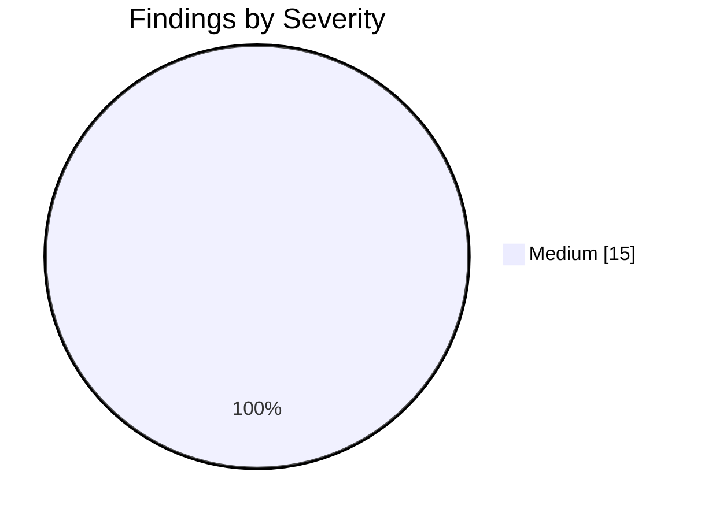
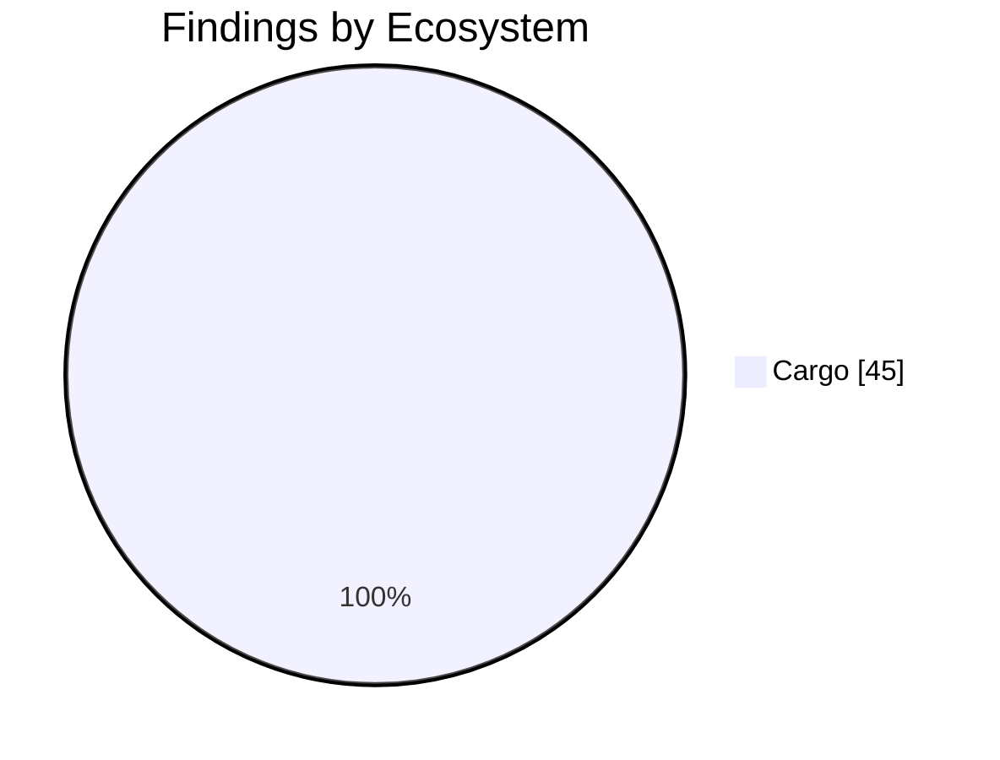

import BentoShell from '@/components/hero/BentoShell.astro';
import BentoProse from '@/components/hero/BentoProse.astro';

<section class="bento-hero bento-section not-content" aria-label="Security audit">
	

	

		

			

				
					<svg viewBox="0 0 24 24" width="14" height="14" fill="none" stroke="currentColor" stroke-width="1.75" stroke-linecap="round" stroke-linejoin="round" aria-hidden="true"><path d="M12 2 4 5v6c0 5 3.4 9.4 8 11 4.6-1.6 8-6 8-11V5z" /></svg>
					auto-generated · daily
				
				<h1 class="bento-title">
					Security posture
					across every ecosystem.
				</h1>
				
<strong>45</strong> findings tracked — none critical or high.

				
Last generated <strong>2026-07-26T04:30:16Z</strong>.

				

					<a class="bento-btn bento-btn--primary" href="#findings">
						View findings
						<svg viewBox="0 0 24 24" fill="none" stroke="currentColor" aria-hidden="true"><path stroke-linecap="round" stroke-linejoin="round" stroke-width="2" d="M5 12h14M13 6l6 6-6 6" /></svg>
					</a>
					<a class="bento-btn bento-btn--ghost" href="#ecosystems">Ecosystems</a>
					<a class="bento-btn bento-btn--ghost" href="/dashboard/">Dashboard home</a>
				

			

				

					
						<svg viewBox="0 0 24 24" width="16" height="16" fill="none" stroke="currentColor" stroke-width="1.75" stroke-linecap="round" stroke-linejoin="round" aria-hidden="true"><path d="M10.29 3.86 1.82 18a2 2 0 0 0 1.71 3h16.94a2 2 0 0 0 1.71-3L13.71 3.86a2 2 0 0 0-3.42 0zM12 9v4M12 17h.01" /></svg>
					
					0
					Critical
				

				

					
						<svg viewBox="0 0 24 24" width="16" height="16" fill="none" stroke="currentColor" stroke-width="1.75" stroke-linecap="round" stroke-linejoin="round" aria-hidden="true"><path d="M12 2a10 10 0 1 0 0 20 10 10 0 0 0 0-20zM12 8v4M12 16h.01" /></svg>
					
					0
					High
				

				

					
						<svg viewBox="0 0 24 24" width="16" height="16" fill="none" stroke="currentColor" stroke-width="1.75" stroke-linecap="round" stroke-linejoin="round" aria-hidden="true"><path d="M12 2a10 10 0 1 0 0 20 10 10 0 0 0 0-20zM12 16v-4M12 8h.01" /></svg>
					
					15
					Medium
				

				

					
						<svg viewBox="0 0 24 24" width="16" height="16" fill="none" stroke="currentColor" stroke-width="1.75" stroke-linecap="round" stroke-linejoin="round" aria-hidden="true"><path d="M22 11.08V12a10 10 0 1 1-5.93-9.14M22 4 12 14.01l-3-3" /></svg>
					
					0
					Low
				

				

					
						<svg viewBox="0 0 24 24" width="16" height="16" fill="none" stroke="currentColor" stroke-width="1.75" stroke-linecap="round" stroke-linejoin="round" aria-hidden="true"><path d="M4 15s1-1 4-1 5 2 8 2 4-1 4-1V3s-1 1-4 1-5-2-8-2-4 1-4 1zM4 22v-7" /></svg>
					
					30
					Info
				

		

		<nav class="bento-jump" aria-label="On this page">
			<a class="bento-chip" href="#ecosystems">Ecosystems</a>
			<a class="bento-chip" href="#findings">Findings</a>
		</nav>
	

</section>

<BentoShell id="ecosystems" eyebrow="Coverage" heading="Ecosystem breakdown">
	

		<a class="bento-cell bento-linkcard bento-card bento-card--glass bento-card--interactive" href="#eco-npm">
			
				<svg viewBox="0 0 24 24" width="18" height="18" fill="none" stroke="currentColor" stroke-width="1.75" stroke-linecap="round" stroke-linejoin="round" aria-hidden="true"><path d="M21 16V8a2 2 0 0 0-1-1.73l-7-4a2 2 0 0 0-2 0l-7 4A2 2 0 0 0 3 8v8a2 2 0 0 0 1 1.73l7 4a2 2 0 0 0 2 0l7-4A2 2 0 0 0 21 16zM3.27 6.96 12 12.01l8.73-5.05M12 22.08V12" /></svg>
			
			npm
			0 advisories
			
				<svg viewBox="0 0 24 24" width="16" height="16" fill="none" stroke="currentColor" stroke-width="2" stroke-linecap="round" stroke-linejoin="round"><path d="M5 12h14M13 6l6 6-6 6" /></svg>
			
		</a>
		<a class="bento-cell bento-linkcard bento-card bento-card--glass bento-card--interactive" href="#eco-cargo">
			
				<svg viewBox="0 0 24 24" width="18" height="18" fill="none" stroke="currentColor" stroke-width="1.75" stroke-linecap="round" stroke-linejoin="round" aria-hidden="true"><path d="M12 2 2 7l10 5 10-5zM2 17l10 5 10-5M2 12l10 5 10-5" /></svg>
			
			Cargo
			45 advisories
			
				<svg viewBox="0 0 24 24" width="16" height="16" fill="none" stroke="currentColor" stroke-width="2" stroke-linecap="round" stroke-linejoin="round"><path d="M5 12h14M13 6l6 6-6 6" /></svg>
			
		</a>
		<a class="bento-cell bento-linkcard bento-card bento-card--glass bento-card--interactive" href="#eco-python">
			
				<svg viewBox="0 0 24 24" width="18" height="18" fill="none" stroke="currentColor" stroke-width="1.75" stroke-linecap="round" stroke-linejoin="round" aria-hidden="true"><path d="M16 18l6-6-6-6M8 6l-6 6 6 6" /></svg>
			
			Python
			0 advisories
			
				<svg viewBox="0 0 24 24" width="16" height="16" fill="none" stroke="currentColor" stroke-width="2" stroke-linecap="round" stroke-linejoin="round"><path d="M5 12h14M13 6l6 6-6 6" /></svg>
			
		</a>
		<a class="bento-cell bento-linkcard bento-card bento-card--glass bento-card--interactive" href="#eco-codeql">
			
				<svg viewBox="0 0 24 24" width="18" height="18" fill="none" stroke="currentColor" stroke-width="1.75" stroke-linecap="round" stroke-linejoin="round" aria-hidden="true"><path d="M21 21l-6-6M11 19a8 8 0 1 0 0-16 8 8 0 0 0 0 16z" /></svg>
			
			CodeQL
			0 alerts
			
				<svg viewBox="0 0 24 24" width="16" height="16" fill="none" stroke="currentColor" stroke-width="2" stroke-linecap="round" stroke-linejoin="round"><path d="M5 12h14M13 6l6 6-6 6" /></svg>
			
		</a>
		<a class="bento-cell bento-linkcard bento-card bento-card--glass bento-card--interactive" href="#eco-dependabot">
			
				<svg viewBox="0 0 24 24" width="18" height="18" fill="none" stroke="currentColor" stroke-width="1.75" stroke-linecap="round" stroke-linejoin="round" aria-hidden="true"><path d="M6 3v12M18 9a3 3 0 1 0 0 6 3 3 0 0 0 0-6zM6 21a3 3 0 1 0 0-6 3 3 0 0 0 0 6zM15 6a9 9 0 0 1-9 9" /></svg>
			
			Dependabot
			0 alerts
			
				<svg viewBox="0 0 24 24" width="16" height="16" fill="none" stroke="currentColor" stroke-width="2" stroke-linecap="round" stroke-linejoin="round"><path d="M5 12h14M13 6l6 6-6 6" /></svg>
			
		</a>
	

</BentoShell>

<BentoProse id="findings" heading="Advisories">

### Severity distribution

```mermaid
pie showData
    title Findings by Severity
    "Medium" : 15
```

### Findings by ecosystem

```mermaid
pie showData
    title Findings by Ecosystem
    "Cargo" : 45
```

### Summary

| Ecosystem | Critical | High | Medium | Low | Total |
|-----------|:--------:|:----:|:------:|:---:|:-----:|
| **npm** | 0 | 0 | 0 | 0 | 0 |
| **Cargo** | 0 | 0 | 15 | 0 | 45 |
| **Python** | 0 | 0 | 0 | 0 | 0 |
| **CodeQL** | 0 | 0 | 0 | 0 | 0 |
| **Dependabot** | 0 | 0 | 0 | 0 | 0 |
| **Total** | 0 | 0 | 15 | 0 | 45 |

### npm

:::tip[All Clear]
No npm advisories found.
:::

### Cargo

| Severity | Package | Advisory | Link |
|----------|---------|----------|------|
| Medium | `ammonia` | XSS in ammonia via SVG `animate` and `set` animation tags |  |
| Medium | `quick-xml` | Quadratic run time when checking a start tag for duplicat... | [Details](https://github.com/tafia/quick-xml/issues/969) |
| Medium | `quick-xml` | Unbounded namespace-declaration allocation in `NsReader` ... | [Details](https://github.com/tafia/quick-xml/issues/970) |
| Medium | `quick-xml` | Quadratic run time when checking a start tag for duplicat... | [Details](https://github.com/tafia/quick-xml/issues/969) |
| Medium | `quick-xml` | Unbounded namespace-declaration allocation in `NsReader` ... | [Details](https://github.com/tafia/quick-xml/issues/970) |
| Medium | `rsa` | Marvin Attack: potential key recovery through timing side... | [Details](https://github.com/RustCrypto/RSA/issues/626) |
| Medium | `rustls-webpki` | Name constraints for URI names were incorrectly accepted |  |
| Medium | `rustls-webpki` | Name constraints were accepted for certificates asserting... |  |
| Medium | `rustls-webpki` | Reachable panic in certificate revocation list parsing |  |
| Medium | `rustls-webpki` | Name constraints for URI names were incorrectly accepted |  |
| Medium | `rustls-webpki` | CRLs not considered authoritative by Distribution Point d... |  |
| Medium | `rustls-webpki` | Name constraints were accepted for certificates asserting... |  |
| Medium | `rustls-webpki` | Reachable panic in certificate revocation list parsing |  |
| Medium | `sqlx` | Binary Protocol Misinterpretation caused by Truncating or... | [Details](https://github.com/launchbadge/sqlx/issues/3440) |
| Medium | `steamworks` | Denial of service in Steamworks game clients/servers usin... | [Details](https://github.com/Noxime/steamworks-rs/issues/321) |
| Info | `atk` | gtk-rs GTK3 bindings - no longer maintained | [Details](https://github.com/gtk-rs/gtk3-rs/commit/508a69b63a3c5bf73790e0e59101a955847f30d6) |
| Info | `atk-sys` | gtk-rs GTK3 bindings - no longer maintained | [Details](https://github.com/gtk-rs/gtk3-rs/commit/508a69b63a3c5bf73790e0e59101a955847f30d6) |
| Info | `backoff` | `backoff` is unmaintained. | [Details](https://github.com/ihrwein/backoff/issues/66) |
| Info | `bincode` | Bincode is unmaintained | [Details](https://git.sr.ht/~stygianentity/bincode/tree/v3.0/item/README.md) |
| Info | `bincode` | Bincode is unmaintained | [Details](https://git.sr.ht/~stygianentity/bincode/tree/v3.0/item/README.md) |
| Info | `crypto-hash` | crypto-hash crate is unmaintained | [Details](https://github.com/rustsec/advisory-db/issues/1633) |
| Info | `derivative` | `derivative` is unmaintained; consider using an alternative | [Details](https://github.com/mcarton/rust-derivative/issues/117) |
| Info | `gdk` | gtk-rs GTK3 bindings - no longer maintained | [Details](https://github.com/gtk-rs/gtk3-rs/commit/508a69b63a3c5bf73790e0e59101a955847f30d6) |
| Info | `gdk-sys` | gtk-rs GTK3 bindings - no longer maintained | [Details](https://github.com/gtk-rs/gtk3-rs/commit/508a69b63a3c5bf73790e0e59101a955847f30d6) |
| Info | `gdkwayland-sys` | gtk-rs GTK3 bindings - no longer maintained | [Details](https://github.com/gtk-rs/gtk3-rs/commit/508a69b63a3c5bf73790e0e59101a955847f30d6) |
| Info | `gdkx11` | gtk-rs GTK3 bindings - no longer maintained | [Details](https://github.com/gtk-rs/gtk3-rs/commit/508a69b63a3c5bf73790e0e59101a955847f30d6) |
| Info | `gdkx11-sys` | gtk-rs GTK3 bindings - no longer maintained | [Details](https://github.com/gtk-rs/gtk3-rs/commit/508a69b63a3c5bf73790e0e59101a955847f30d6) |
| Info | `gtk` | gtk-rs GTK3 bindings - no longer maintained | [Details](https://github.com/gtk-rs/gtk3-rs/commit/508a69b63a3c5bf73790e0e59101a955847f30d6) |
| Info | `gtk-sys` | gtk-rs GTK3 bindings - no longer maintained | [Details](https://github.com/gtk-rs/gtk3-rs/commit/508a69b63a3c5bf73790e0e59101a955847f30d6) |
| Info | `gtk3-macros` | gtk-rs GTK3 bindings - no longer maintained | [Details](https://github.com/gtk-rs/gtk3-rs/commit/508a69b63a3c5bf73790e0e59101a955847f30d6) |
| Info | `instant` | `instant` is unmaintained |  |
| Info | `paste` | paste - no longer maintained | [Details](https://github.com/dtolnay/paste) |
| Info | `proc-macro-error` | proc-macro-error is unmaintained | [Details](https://gitlab.com/CreepySkeleton/proc-macro-error/-/issues/20) |
| Info | `rustls-pemfile` | rustls-pemfile is unmaintained | [Details](https://github.com/rustls/pemfile/issues/61) |
| Info | `rustls-pemfile` | rustls-pemfile is unmaintained | [Details](https://github.com/rustls/pemfile/issues/61) |
| Info | `rustybuzz` | `rustybuzz` is unmaintained | [Details](https://github.com/harfbuzz/rustybuzz/issues/166) |
| Info | `serde_cbor` | serde_cbor is unmaintained | [Details](https://github.com/pyfisch/cbor) |
| Info | `ttf-parser` | `ttf-parser` is unmaintained | [Details](https://github.com/harfbuzz/ttf-parser/issues/217) |
| Info | `unic-char-property` | `unic-char-property` is unmaintained | [Details](https://github.com/rustsec/advisory-db/issues/2414) |
| Info | `unic-char-range` | `unic-char-range` is unmaintained | [Details](https://github.com/rustsec/advisory-db/issues/2414) |
| Info | `unic-common` | `unic-common` is unmaintained | [Details](https://github.com/rustsec/advisory-db/issues/2414) |
| Info | `unic-ucd-ident` | `unic-ucd-ident` is unmaintained | [Details](https://github.com/rustsec/advisory-db/issues/2414) |
| Info | `unic-ucd-version` | `unic-ucd-version` is unmaintained | [Details](https://github.com/rustsec/advisory-db/issues/2414) |
| Info | `glib` | Unsoundness in `Iterator` and `DoubleEndedIterator` impls... | [Details](https://github.com/gtk-rs/gtk-rs-core/pull/1343) |
| Info | `lru` | `IterMut` violates Stacked Borrows by invalidating intern... | [Details](https://github.com/jeromefroe/lru-rs/pull/224) |

### Python

:::tip[All Clear]
No python advisories found.
:::

### CodeQL

:::tip[All Clear]
No open CodeQL alerts.
:::

### Dependabot

:::tip[All Clear]
No open Dependabot alerts.
:::

</BentoProse>

<BentoProse id="about">

---

*Auto-generated by [ci-daily-content.yml](https://github.com/KBVE/kbve/actions/workflows/ci-daily-content.yml)*

</BentoProse>

