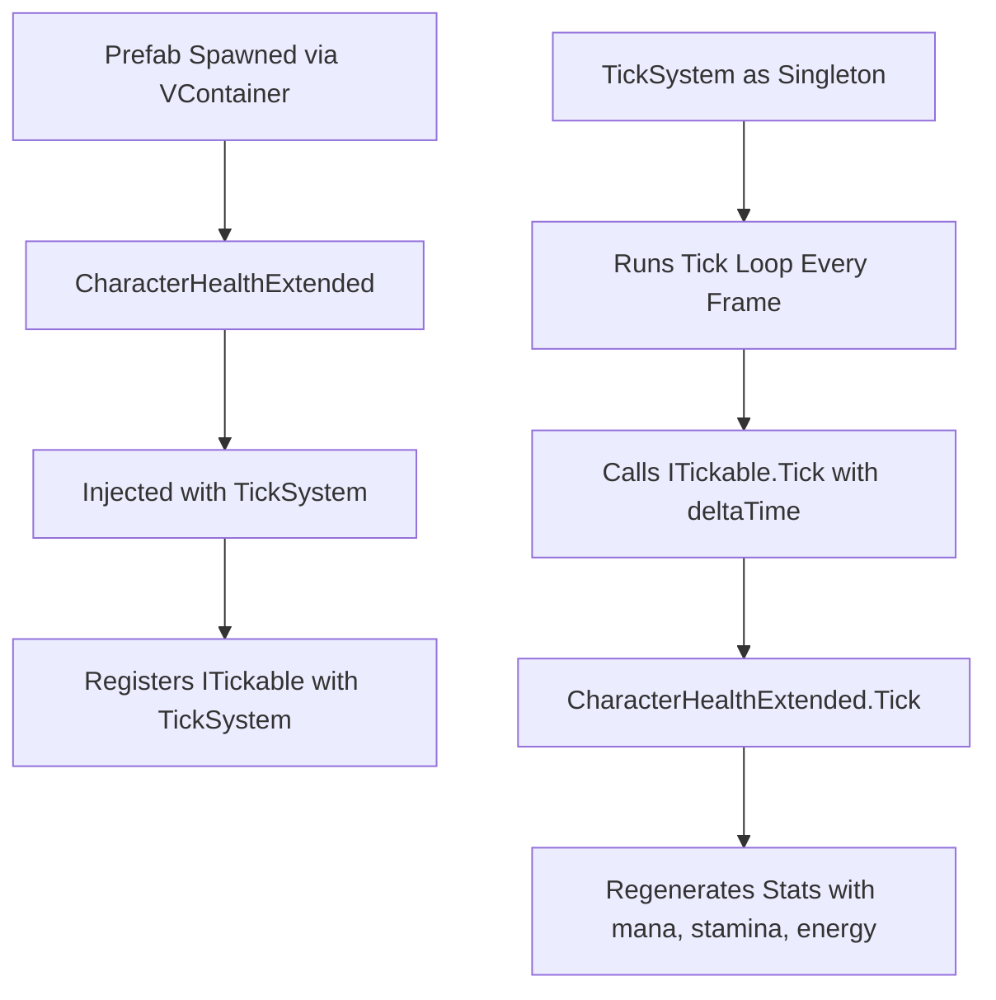

import { Adsense } from '@/components/astropad';

<Adsense />


## 2025

### Unity Custom Item Script

-   01:23AM

    The custom item deployment script is almost ready and afterwards we can work on the custom item effects.
    With each prefab that gets deployed, we might have to adjust how we go about the actual deployment too.
    I am thinking that we might use a vcontainer setup, similar to how we are deploying the prefabs.

### Starlight Graph

-   02:09AM

    The graph seems to fail on view transition, so maybe we can find a way to reset it.
    Here is the snip that I used to for reloading the plugin.

```js

document.addEventListener('astro:page-load', () => {
    const graph = document.querySelector('graph-component');
    if (graph?.setup && typeof graph.setup === 'function') {
      console.log('[STARLIGHT] Re-running graph setup');
      graph.cleanup?.();
      graph.setup();
    }
  });

```

    This should run the graph after each view transition.

### WishList RareIcon

-   03:08AM

    Sweet, just made a dope wishlist button for rareicon, which will be op.
    For marketing reasons, I should also start building out the markdown codes to quickly add around in discords.
    I should also start preparing the main website for game too, ugh, so many things that I need to do before the game is even ready.
    Collecting wishlists will be rough but I think I will be able to get it out of the way, I can see us reaching around 1000 wihtin a month but past 10k is going to be rough.


### ItemDB

-   05:05PM

    Without having github being down and slowly me to a crawl, I was able to get a couple more of the concepts out of the way.
    The assets now get stored into the addressables, which will make it easier to call and deploy them.
    We still have to do the pool integration and making sure that they can be added and consumed without any draw backs.
    For this, I will have to build the right "stats" component, maybe even extend the more mountains to include the stats and bonuses, hmm.
    There are a couple ways that we could go about this, but I believe damage reduction would be the most important.
    The balance of power creep is always going to be a pain moving forward.

-   06:23PM

    Now we need to figure out the best way to link the stats from an item and the character, hmm.
    We should make it so that items could also be used by NPCs but that will be for a later time, as for now, we can just focus on the characters.

### MM ExtendedHealth v0

-   06:31PM
    Taking the `MoreMountains.TopDownEngine.Health` component and then extending it out as a "HealthExtended", which will then hold the full scope of stats.
    This means we can easily apply those stats to different structures, NPCs, players, ect.. without having to reinvent the whole wheel.
    The stats will be stored under a `StatsData` which will include the mana, energy, stamina and any additional stats.
    As for effects, I believe we could also store them into this component, since it will already be running through a tick base system.

-   10:33PM

    The next update to the system will look like this below but before I can really break it down, I should focus on creating the first couple files.
    These will be scoped to the specific areas that I want to resolve.



    


## 2024

**MTG**

Meeting up to play my trump deck!
I did not get a chance to turn it into a commander deck, but I will do that in June!
Ugh, summer is already here? Time is moving way too fast.


## 2023


- The time stamps are a bit messy for this note because there were a couple failures during the migration to the newer journal system. 
- The Asynchronous loading seems to be working fine within our first test case inside of Unity but it automatically replaces the cut scene window. So I am thinking we need a button within the loader that the user presses again to go to actually enter the level, I am thinking of calling it `Skip` or `Next` which will be disabled initially on load and then enabled once the asynchronous function has loaded the next scene. 
- Besides spending time on the Unity project, I decided to go back into the rs project which I believe I will go ahead and end for the time being. I will return to that aspect once I get a couple concepts clear up from my plate. I believe that I am spreading myself a bit too thin for the current amount of work and backlog.

## Quote

> I have not failed. I've just found 10,000 ways that won't work.
> — <cite>Thomas Edison</cite>

---

## Tasks

- [x] Test case the asynchronous unity loader with the visual novel cut scenes.